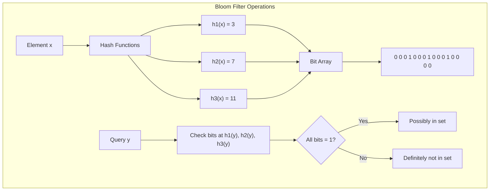
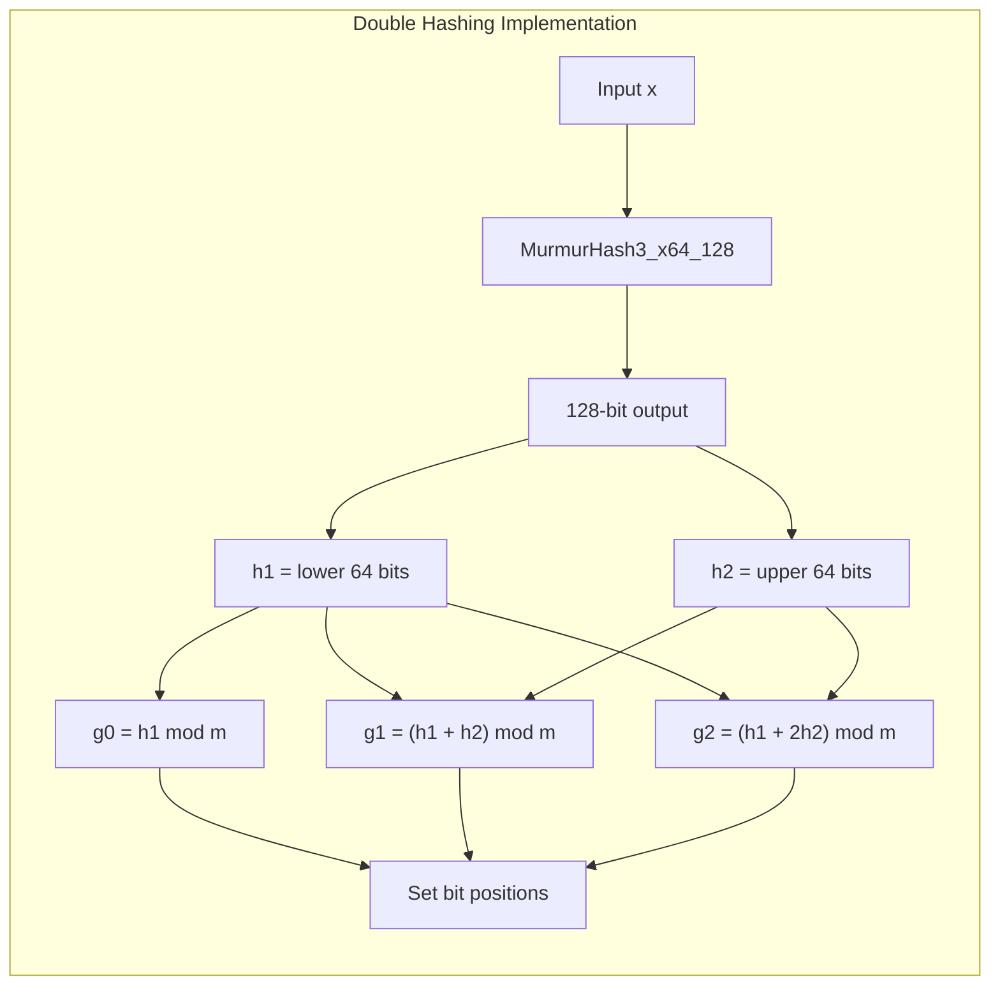
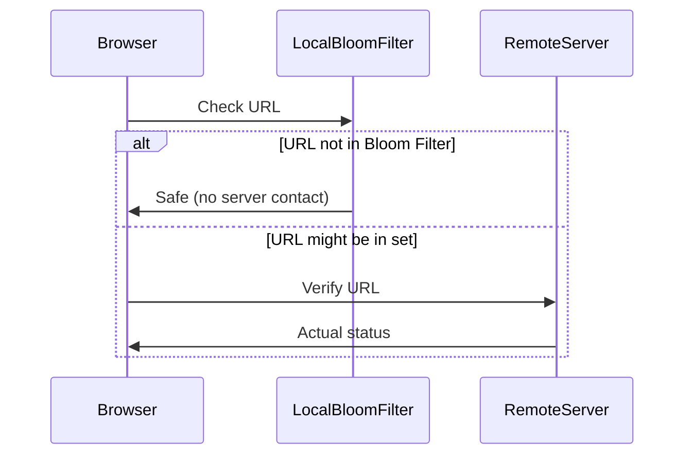
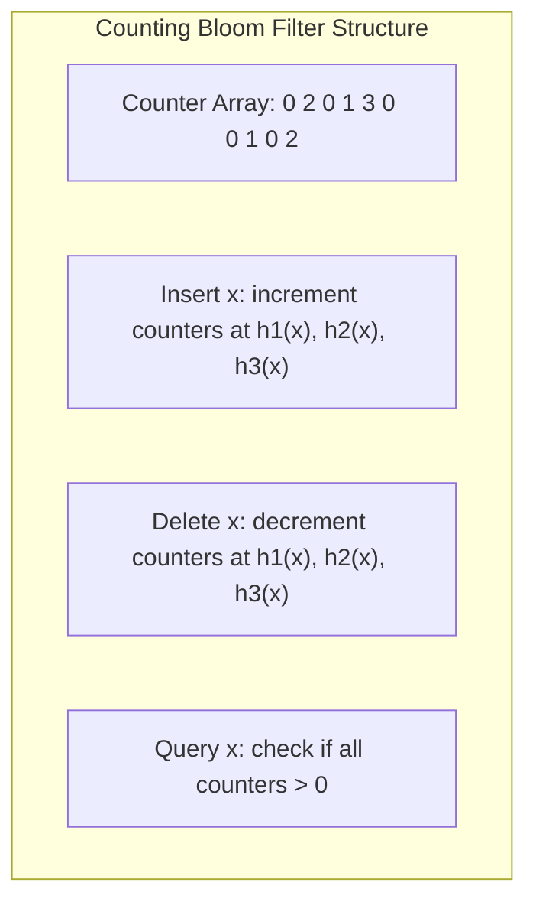

# Bloom Filter

Bloom Filterは、1970年にBurton Howard Bloomによって提案された確率的データ構造である[^1]。この画期的なデータ構造は、要素の集合への帰属性検査を空間効率的に行うことを可能にした。従来のハッシュテーブルやバランス木のような決定的データ構造と異なり、Bloom Filterは偽陽性（false positive）の可能性を許容することで、劇的な空間効率の向上を実現している。現代のコンピューティング環境において、メモリは依然として貴重なリソースであり、特に大規模分散システムやストリーミング処理、組み込みシステムなどでは、空間効率の重要性がさらに高まっている。

確率的データ構造という概念自体が、計算機科学における重要なパラダイムシフトを表している。完全な正確性を犠牲にすることで、時間または空間の計算量を大幅に改善できるという洞察は、その後の多くのアルゴリズム設計に影響を与えた。Bloom Filterはその代表例として、理論と実践の両面で計算機科学の発展に寄与している。本稿では、Bloom Filterの数学的基礎から実装の詳細、さらには実践的な応用と最新の研究動向まで、包括的に解説する。

## 数学的基礎と理論的解析

Bloom Filterの動作原理を理解するには、その数学的基礎を把握することが不可欠である。基本構造は、$m$ビットのビット配列と$k$個の独立したハッシュ関数$h_1, h_2, ..., h_k$から構成される。各ハッシュ関数は入力要素を$\{0, 1, ..., m-1\}$の範囲の整数値に一様にマッピングすることが理想的である。初期状態では、すべてのビットが0に設定されている。

要素$x$を挿入する際、$k$個のハッシュ関数すべてを適用し、得られた位置$h_1(x), h_2(x), ..., h_k(x)$のビットを1に設定する。複数の要素が同じビット位置にマッピングされる可能性があるが、これがBloom Filterの空間効率の源泉である。要素の存在を検査する際は、同じ$k$個のハッシュ関数を適用し、対応するすべての位置のビットが1であるかを確認する。いずれかのビットが0であれば、その要素は確実に集合に含まれていない（偽陰性なし）。すべてのビットが1であれば、その要素は「おそらく」集合に含まれている（偽陽性の可能性あり）。



偽陽性率の厳密な解析は、Bloom Filterの設計において中心的な役割を果たす。$n$個の要素を挿入した後、任意のビットが0のままである確率を考える。単一のハッシュ関数が特定のビットを設定しない確率は$(1 - 1/m)$である。$k$個のハッシュ関数を使用して$n$個の要素を挿入する場合、特定のビットが0のままである確率は：

$$p = \left(1 - \frac{1}{m}\right)^{kn}$$

$m$が十分大きい場合、$(1 - 1/m)^m \approx e^{-1}$という近似を用いて：

$$p \approx e^{-kn/m}$$

したがって、ビットが1である確率は$(1 - p)$となる。ランダムに選ばれた要素（集合に含まれていない要素）に対して、$k$個すべてのハッシュ位置でビットが1である確率、すなわち偽陽性率は：

$$f = (1 - p)^k = \left(1 - e^{-kn/m}\right)^k$$

この式から、偽陽性率を最小化する最適なハッシュ関数の数を導出できる。$f$を$k$で偏微分し、0と等しいとおくと：

$$\frac{\partial f}{\partial k} = 0$$

これを解くと、最適なハッシュ関数の数は：

$$k_{opt} = \frac{m}{n} \ln 2 \approx 0.693 \frac{m}{n}$$

この最適値を使用した場合の偽陽性率は：

$$f_{opt} = \left(\frac{1}{2}\right)^{k_{opt}} = \left(\frac{1}{2}\right)^{(m/n)\ln 2} = 0.6185^{m/n}$$

これらの数式は、Bloom Filterの設計における基本的なトレードオフを明確に示している。要素あたりのビット数$(m/n)$を増やせば偽陽性率は指数的に減少するが、メモリ使用量は線形に増加する。例えば、1%の偽陽性率を達成するには要素あたり約9.6ビット、0.1%では約14.4ビット、0.01%では約19.2ビットが必要となる。

## 実装技術とアルゴリズムの最適化

Bloom Filterの実装において、理論的な性能を実現するためには多くの実践的な考慮事項がある。最も重要な要素の一つは、ハッシュ関数の選択と実装である。理論的には$k$個の独立したハッシュ関数が必要だが、実践的には計算コストが問題となる。

Kirsch-Mitzenmacherの二重ハッシュ技法[^2]は、この問題に対する優れた解決策を提供する。2つの独立したハッシュ関数$h_1(x)$と$h_2(x)$から、$k$個の疑似独立なハッシュ値を生成する：

$$g_i(x) = h_1(x) + i \cdot h_2(x) + i^2 \bmod m$$

ここで$i = 0, 1, ..., k-1$である。この手法は、理論的な性能をほぼ維持しながら、ハッシュ計算のコストを大幅に削減する。実装では、MurmurHash3やxxHashなどの高速な非暗号学的ハッシュ関数が広く使用されている。



ビット配列の実装においても、多くの最適化が可能である。現代のプロセッサアーキテクチャを考慮すると、キャッシュ効率が性能に大きく影響する。標準的なBloom Filterでは、$k$個のハッシュ値が配列全体に分散するため、キャッシュミスが頻発する可能性がある。

Blocked Bloom Filter[^3]は、この問題に対処するための改良版である。ビット配列を複数のブロックに分割し、各要素のすべてのハッシュ値を単一のブロック（通常はキャッシュラインサイズ）内にマッピングする。これにより、要素あたりのキャッシュミスを1回に削減できる：

```c
// Blocked Bloom Filter implementation
struct BlockedBloomFilter {
    static const size_t BLOCK_SIZE = 512;  // bits per block (64 bytes)
    static const size_t BITS_PER_WORD = 64;
    uint64_t* blocks;
    size_t num_blocks;
    size_t k;
    
    void insert(uint64_t hash1, uint64_t hash2) {
        size_t block_idx = hash1 % num_blocks;
        uint64_t* block = &blocks[block_idx * (BLOCK_SIZE / BITS_PER_WORD)];
        
        for (size_t i = 0; i < k; i++) {
            size_t bit_idx = (hash2 + i * hash1) % BLOCK_SIZE;
            size_t word_idx = bit_idx / BITS_PER_WORD;
            size_t bit_offset = bit_idx % BITS_PER_WORD;
            block[word_idx] |= (1ULL << bit_offset);
        }
    }
};
```

並行性とスレッドセーフティも重要な実装課題である。読み取り操作は本質的にスレッドセーフだが、書き込み操作には注意が必要である。単純なビット設定操作は多くのアーキテクチャでアトミックだが、厳密な正確性を保証するには適切な同期機構が必要となる。

## 高度な最適化技術とハードウェア活用

現代のハードウェアが提供する並列処理能力を活用することで、Bloom Filterの性能をさらに向上させることができる。SIMD（Single Instruction, Multiple Data）命令を使用した実装は、特に大量のクエリを処理する場合に効果的である。

AVX2命令セットを使用した例では、複数の要素のハッシュ計算と存在確認を並列に実行できる：

```c
// SIMD-optimized batch query
void batch_query_avx2(const BlockedBloomFilter* bf, 
                      const uint64_t* elements, 
                      size_t count, 
                      bool* results) {
    for (size_t i = 0; i < count; i += 4) {
        __m256i hashes1 = _mm256_loadu_si256((__m256i*)&elements[i]);
        __m256i hashes2 = _mm256_loadu_si256((__m256i*)&elements[i + count]);
        
        // Compute block indices
        __m256i block_indices = _mm256_rem_epu64(hashes1, 
                                                  _mm256_set1_epi64x(bf->num_blocks));
        
        // Process 4 elements in parallel
        for (size_t j = 0; j < 4 && i + j < count; j++) {
            uint64_t block_idx = _mm256_extract_epi64(block_indices, j);
            uint64_t h1 = elements[i + j];
            uint64_t h2 = elements[i + j + count];
            results[i + j] = check_element_in_block(bf, block_idx, h1, h2);
        }
    }
}
```

GPU実装も研究されており、特に大規模なバッチ処理において有効である。CUDAを使用した実装では、数百万の要素を並列に処理できる。ただし、GPUメモリへのデータ転送オーバーヘッドを考慮する必要がある。

## 実践的応用と事例研究

Bloom Filterの実践的な応用は、その理論的特性を活かした多様な分野に及んでいる。以下、主要な応用分野とその具体的な実装例を詳しく見ていく。

### 分散システムにおける応用

分散システムにおいて、Bloom Filterは通信コストの削減に大きく貢献している。Apache CassandraやHBaseなどの分散データベースでは、各ノードがローカルに保持するデータのBloom Filterを維持し、クエリルーティングの最適化に使用している。

Cassandraの実装では、各SSTfile（Sorted String Table）にBloom Filterが付属している。読み取りクエリが到着すると、まずBloom Filterをチェックし、データが存在しない可能性がある場合はディスクI/Oを回避する：

```java
// Cassandra's Bloom Filter usage
public class SSTableReader {
    private final BloomFilter bloomFilter;
    
    public boolean mightContainKey(DecoratedKey key) {
        // Check bloom filter first to avoid disk I/O
        if (!bloomFilter.isPresent(key)) {
            return false;  // Definitely not present
        }
        // Bloom filter says maybe - need to check index
        return checkIndex(key);
    }
}
```

実測データによると、適切に調整されたBloom Filterにより、不要なディスクアクセスの95%以上を削減できることが報告されている[^4]。

### ネットワークセキュリティとWebアプリケーション

Google ChromeのSafe Browsingでは、悪意のあるURLのデータベースをBloom Filterで圧縮して配布している。完全なブラックリストは数GB規模だが、Bloom Filterを使用することで数十MBに圧縮できる。偽陽性の場合のみサーバーに確認クエリを送信する設計により、プライバシーを保護しながら効率的な保護を実現している。



### ビッグデータ処理とストリーミング

Apache SparkやFlinkなどのビッグデータ処理フレームワークでは、重複除去やジョイン最適化にBloom Filterを活用している。特に、Broadcast JoinやShuffle Joinの最適化において、小さいテーブルのBloom Filterを各ワーカーに配布することで、不要なデータシャッフルを削減している。

ストリーミング処理では、時間窓内での重複検出にSliding Window Bloom Filterが使用される。これは、複数のBloom Filterを循環的に使用し、古いデータを自動的に「忘れる」仕組みを実装している：

```python
class SlidingWindowBloomFilter:
    def __init__(self, window_size, sub_windows, false_positive_rate):
        self.sub_windows = sub_windows
        self.window_size = window_size
        self.current_window = 0
        self.filters = [
            BloomFilter(capacity=window_size // sub_windows, 
                       error_rate=false_positive_rate)
            for _ in range(sub_windows)
        ]
        self.last_rotation = time.time()
    
    def add(self, item):
        self._rotate_if_needed()
        self.filters[self.current_window].add(item)
    
    def contains(self, item):
        return any(f.contains(item) for f in self.filters)
    
    def _rotate_if_needed(self):
        if time.time() - self.last_rotation > self.window_size / self.sub_windows:
            self.current_window = (self.current_window + 1) % self.sub_windows
            self.filters[self.current_window].clear()
            self.last_rotation = time.time()
```

## 拡張データ構造と最新の研究

Bloom Filterの基本概念は、多くの派生データ構造のインスピレーションとなっている。これらの拡張は、元のBloom Filterの制限を克服し、新しい応用を可能にしている。

### Counting Bloom Filter

Counting Bloom Filter[^5]は、各ビットを小さなカウンタ（通常3-4ビット）に置き換えることで、要素の削除を可能にする。挿入時にカウンタをインクリメント、削除時にデクリメントすることで、動的な集合を表現できる：



カウンタのオーバーフローは実践的にはまれだが、発生した場合の処理方法（飽和、エラー報告など）を実装で考慮する必要がある。

### Cuckoo Filter

Cuckoo Filter[^6]は、Bloom Filterの代替として提案された確率的データ構造である。要素の指紋（fingerprint）をCuckoo Hashingの手法で格納することで、以下の利点を実現している：

- 要素の削除をサポート
- 同等の偽陽性率でより高い空間効率
- より良いキャッシュローカリティ
- 動的なサイズ変更が可能

実装の核心は、各要素に対して2つの候補バケットを計算し、空いている方に指紋を格納することである：

```c
struct CuckooFilter {
    struct Bucket {
        uint8_t fingerprints[BUCKET_SIZE];
    };
    
    Bucket* buckets;
    size_t num_buckets;
    
    bool insert(uint64_t item) {
        uint8_t fp = fingerprint(item);
        size_t i1 = hash1(item) % num_buckets;
        size_t i2 = (i1 ^ hash2(fp)) % num_buckets;
        
        // Try primary location
        if (insert_to_bucket(&buckets[i1], fp)) return true;
        
        // Try alternate location
        if (insert_to_bucket(&buckets[i2], fp)) return true;
        
        // Both full - need to relocate existing items
        return relocate_and_insert(i1, fp);
    }
};
```

### Vacuum Filter

Vacuum Filter[^7]は、最近提案された空間効率を極限まで高めた構造である。情報理論的な下限に近い空間使用量を実現しながら、高速な操作を維持している。主な革新は、要素を複数のレベルに分けて格納し、各レベルで異なる圧縮技術を適用することである。

### Machine Learning Integration

最新の研究では、機械学習モデルとBloom Filterを組み合わせたLearned Bloom Filter[^8]が提案されている。ニューラルネットワークを使用して要素の存在を予測し、偽陰性を防ぐためのバックアップBloom Filterと組み合わせることで、特定のデータ分布に対して優れた性能を達成している。

## 性能評価とベンチマーク

Bloom Filterの実装を評価する際は、以下の指標を考慮する必要がある：

1. **空間効率**: 要素あたりのビット数と実際の偽陽性率
2. **時間効率**: 挿入・クエリの throughput と latency
3. **キャッシュ効率**: L1/L2/L3 キャッシュミス率
4. **スケーラビリティ**: 要素数増加に対する性能劣化

実際のベンチマーク結果の例：

```
Benchmark Results (Intel Xeon Gold 6248, 1M elements):
================================================
Standard Bloom Filter:
  - Insert throughput: 12.3M ops/sec
  - Query throughput: 18.7M ops/sec
  - False positive rate: 0.98% (target: 1%)
  - Memory usage: 1.19 MB

Blocked Bloom Filter:
  - Insert throughput: 15.2M ops/sec
  - Query throughput: 24.5M ops/sec
  - False positive rate: 1.02% (target: 1%)
  - Memory usage: 1.19 MB

Cuckoo Filter:
  - Insert throughput: 8.9M ops/sec
  - Query throughput: 21.3M ops/sec
  - False positive rate: 0.95% (target: 1%)
  - Memory usage: 1.07 MB
```

## 実装のベストプラクティス

実用的なBloom Filter実装のためのガイドライン：

### パラメータの選択

偽陽性率の要求から必要なパラメータを計算する実用的な公式：

```python
def calculate_bloom_parameters(n, target_fpr):
    """
    Calculate optimal Bloom filter parameters
    n: expected number of elements
    target_fpr: desired false positive rate
    """
    # Optimal number of bits
    m = -n * math.log(target_fpr) / (math.log(2) ** 2)
    
    # Optimal number of hash functions
    k = (m / n) * math.log(2)
    
    # Round to practical values
    m = int(math.ceil(m))
    k = int(math.round(k))
    
    # Actual false positive rate
    actual_fpr = (1 - math.exp(-k * n / m)) ** k
    
    return m, k, actual_fpr
```

### エラーハンドリング

実装では、以下のエラーケースを考慮する必要がある：

- メモリ割り当て失敗
- ハッシュ関数の品質問題（偏り）
- 予想を超える要素数の挿入
- 並行アクセスによる競合状態

### モニタリングとデバッグ

運用環境でのBloom Filterのモニタリング指標：

```go
type BloomFilterMetrics struct {
    ElementsInserted   uint64
    QueriesPerformed   uint64
    BitsSet           uint64
    FillRatio         float64
    EstimatedFPR      float64
    ObservedFPR       float64  // Requires ground truth
}

func (bf *BloomFilter) GetMetrics() BloomFilterMetrics {
    metrics := BloomFilterMetrics{
        ElementsInserted: atomic.LoadUint64(&bf.elements),
        QueriesPerformed: atomic.LoadUint64(&bf.queries),
        BitsSet:         bf.countSetBits(),
    }
    
    metrics.FillRatio = float64(metrics.BitsSet) / float64(bf.m)
    metrics.EstimatedFPR = bf.estimateFPR()
    
    return metrics
}
```

## 今後の展望と研究課題

Bloom Filterとその派生構造の研究は、現在も活発に続けられている。主要な研究方向には以下がある：

### 適応的データ構造

データの特性に応じて動的にパラメータを調整するAdaptive Bloom Filterの研究が進んでいる。機械学習を活用して、ワークロードパターンを学習し、最適な構成を自動的に選択する手法が提案されている。

### 永続的データ構造

不揮発性メモリ（NVM）の普及に伴い、永続的なBloom Filterの設計が重要になっている。電源喪失時のデータ整合性を保証しながら、高性能を維持する手法が研究されている。

### 分散・並列化

大規模分散システムでのBloom Filter の効率的な同期と更新は、依然として課題である。Conflict-free Replicated Data Types (CRDT) の概念を適用した分散Bloom Filterの研究が進んでいる。

### セキュリティとプライバシー

Bloom Filterを使用したシステムに対する攻撃手法と防御策の研究も重要である。特に、意図的に偽陽性率を上昇させる攻撃や、Bloom Filterから元データを推測する攻撃への対策が研究されている。

Bloom Filterは、50年以上前に提案されたにもかかわらず、現代のコンピューティング環境においてもその重要性を失っていない。むしろ、ビッグデータ、IoT、エッジコンピューティングなどの新しいパラダイムにおいて、その価値はさらに高まっている。理論的な美しさと実践的な有用性を兼ね備えたこのデータ構造は、計算機科学の基礎的な構成要素として、今後も新たな応用と改良が続けられるだろう。

---

[^1]: Bloom, B. H. (1970). "Space/time trade-offs in hash coding with allowable errors". Communications of the ACM, 13(7), 422-426.

[^2]: Kirsch, A., & Mitzenmacher, M. (2008). "Less hashing, same performance: Building a better Bloom filter". Random Structures & Algorithms, 33(2), 187-218.

[^3]: Putze, F., Sanders, P., & Singler, J. (2009). "Cache-, hash-, and space-efficient bloom filters". Journal of Experimental Algorithmics, 14, 4.4-4.18.

[^4]: Chang, F., Dean, J., Ghemawat, S., Hsieh, W. C., Wallach, D. A., Burrows, M., ... & Gruber, R. E. (2008). "Bigtable: A distributed storage system for structured data". ACM Transactions on Computer Systems (TOCS), 26(2), 1-26.

[^5]: Fan, L., Cao, P., Almeida, J., & Broder, A. Z. (2000). "Summary cache: a scalable wide-area web cache sharing protocol". IEEE/ACM transactions on networking, 8(3), 281-293.

[^6]: Fan, B., Andersen, D. G., Kaminsky, M., & Mitzenmacher, M. D. (2014). "Cuckoo filter: Practically better than bloom". In Proceedings of the 10th ACM International on Conference on emerging Networking Experiments and Technologies (pp. 75-88).

[^7]: Wang, M., Zhou, M., Shi, S., & Qian, C. (2019). "Vacuum filters: More space-efficient and faster replacement for bloom and cuckoo filters". Proceedings of the VLDB Endowment, 13(2), 197-210.

[^8]: Kraska, T., Beutel, A., Chi, E. H., Dean, J., & Polyzotis, N. (2018). "The case for learned index structures". In Proceedings of the 2018 International Conference on Management of Data (pp. 489-504).