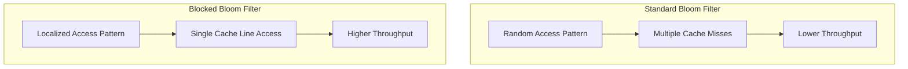

# Bloom Filter

Bloom Filterは、1970年にBurton Howard Bloomによって提案された確率的データ構造である[^1]。この画期的なデータ構造は、要素の集合への帰属性検査を空間効率的に行うことを可能にした。従来のハッシュテーブルやバランス木のような決定的データ構造と異なり、Bloom Filterは偽陽性（false positive）の可能性を許容することで、劇的な空間効率の向上を実現している。この特性により、大規模分散システムやストリーミング処理、データベースシステムなど、メモリ効率が重要な多くの応用分野で活用されている。

確率的データ構造という概念自体が、計算機科学における重要なパラダイムシフトを表している。完全な正確性を犠牲にすることで、時間または空間の計算量を大幅に改善できるという洞察は、その後の多くのアルゴリズム設計に影響を与えた。Bloom Filterはその代表例として、理論と実践の両面で計算機科学の発展に寄与している。

## 数学的基礎

Bloom Filterの動作原理を理解するには、その数学的基礎を把握することが不可欠である。$m$ビットのビット配列と$k$個の独立したハッシュ関数$h_1, h_2, ..., h_k$を考える。各ハッシュ関数は入力要素を$\{0, 1, ..., m-1\}$の範囲の整数値にマッピングする。初期状態では、すべてのビットが0に設定されている。

要素$x$を挿入する際、$k$個のハッシュ関数すべてを適用し、得られた位置$h_1(x), h_2(x), ..., h_k(x)$のビットを1に設定する。要素の存在を検査する際は、同じ$k$個のハッシュ関数を適用し、対応するすべての位置のビットが1であるかを確認する。いずれかのビットが0であれば、その要素は確実に集合に含まれていない。すべてのビットが1であれば、その要素は「おそらく」集合に含まれている。

```mermaid
graph LR
    subgraph "Bloom Filter Structure"
        B[Bit Array: 0 1 0 1 1 0 0 1 0 1]
    end
    
    subgraph "Insert Operation"
        X[Element x] --> H1[h₁(x) = 1]
        X --> H2[h₂(x) = 4]
        X --> H3[h₃(x) = 7]
        H1 --> B
        H2 --> B
        H3 --> B
    end
```

偽陽性率の解析は、Bloom Filterの設計において中心的な役割を果たす。$n$個の要素を挿入した後、任意のビットが0のままである確率は次のように計算できる：

$$p = \left(1 - \frac{1}{m}\right)^{kn} \approx e^{-kn/m}$$

この近似は、$m$が十分大きい場合に成立する。したがって、ランダムに選ばれた要素に対する偽陽性率は：

$$f = \left(1 - \left(1 - \frac{1}{m}\right)^{kn}\right)^k \approx \left(1 - e^{-kn/m}\right)^k$$

この式から、最適なハッシュ関数の数$k$を導出できる。偽陽性率を最小化する$k$の値は：

$$k_{opt} = \frac{m}{n} \ln 2 \approx 0.693 \frac{m}{n}$$

この最適値を使用した場合の偽陽性率は：

$$f_{opt} = 0.6185^{m/n}$$

これらの数式は、Bloom Filterの設計における基本的なトレードオフを明確に示している。より多くのビットを使用すれば偽陽性率は低下するが、メモリ使用量は増加する。また、ハッシュ関数の数にも最適値が存在し、少なすぎても多すぎても性能が劣化する。

## アルゴリズムの詳細実装

Bloom Filterの実装において、ハッシュ関数の選択は極めて重要である。理論的には$k$個の独立したハッシュ関数が必要だが、実践的には2つの独立したハッシュ関数から$k$個の疑似独立なハッシュ値を生成する手法が広く使用されている[^2]。

```mermaid
flowchart TD
    A[Input Element] --> B[Hash Function h₁]
    A --> C[Hash Function h₂]
    B --> D[g₁ = h₁(x)]
    C --> E[g₂ = h₂(x)]
    D --> F[hᵢ(x) = g₁ + i·g₂ mod m]
    E --> F
    F --> G[k hash values]
    G --> H[Set bits in array]
```

この手法は、Kirsch-Mitzenmacherによって提案され、次の式で表される：

$$h_i(x) = h_1(x) + i \cdot h_2(x) \bmod m$$

ここで$i = 0, 1, ..., k-1$である。この方法により、計算コストを大幅に削減しながら、理論的な性能保証をほぼ維持できる。

ビット配列の実装においても、キャッシュ効率を考慮した設計が重要である。現代のプロセッサアーキテクチャでは、メモリアクセスのローカリティが性能に大きく影響する。ビット配列を複数のキャッシュラインに分散させることで、並列アクセスを可能にし、スループットを向上させることができる。

挿入操作と検索操作の計算量は、どちらも$O(k)$である。これは、$k$個のハッシュ関数の評価とビットアクセスが必要なためである。重要な点は、この計算量が格納される要素数$n$に依存しないことである。これにより、大規模なデータセットに対しても一定時間での操作が保証される。

## パフォーマンス特性と最適化

Bloom Filterのパフォーマンス特性は、その応用範囲を決定する重要な要素である。空間効率の観点から、要素あたりのビット数を$b = m/n$とすると、偽陽性率は$f = 0.6185^b$となる。例えば、1%の偽陽性率を達成するには、要素あたり約9.6ビットが必要である。これは、要素自体を格納する場合と比較して、劇的な空間削減を実現している。

時間効率については、ハッシュ関数の計算がボトルネックとなることが多い。MurmurHash3やxxHashなどの高速な非暗号学的ハッシュ関数を使用することで、ナノ秒オーダーでの操作が可能になる。さらに、SIMD命令を活用した並列化により、複数のハッシュ値を同時に計算することも可能である。

キャッシュ効率の最適化は、実装において見過ごされがちだが重要な要素である。Blocked Bloom Filterと呼ばれる変種では、各要素のすべてのハッシュ値を単一のキャッシュラインに収まる範囲にマッピングする。これにより、キャッシュミスを削減し、実効的なアクセス速度を向上させることができる。



並行性の観点から、Bloom Filterは読み取り操作に対して完全にスレッドセーフである。書き込み操作についても、ビット設定操作がアトミックであれば、複数のスレッドから同時に要素を挿入できる。ただし、偽陰性を完全に排除するには、メモリバリアの適切な使用が必要である。

## 実践的応用とトレードオフ

Bloom Filterの実践的な応用は多岐にわたる。分散システムにおいては、ネットワーク通信の削減に大きな効果を発揮する。例えば、分散データベースシステムでは、リモートノードへのクエリを発行する前に、ローカルのBloom Filterで存在確認を行うことで、不要なネットワークラウンドトリップを削減できる。

Webクローラーやスパムフィルタリングでは、既に処理済みのURLやメールアドレスの追跡にBloom Filterが使用される。この場合、偽陽性は一部の重複処理を引き起こすが、偽陰性がないという特性により、処理の完全性が保証される。メモリ使用量の削減効果は、処理対象が数十億規模に達する場合に特に顕著である。

データベースシステムにおけるBloom Filterの応用も重要である。LSM-tree（Log-Structured Merge-tree）ベースのストレージエンジンでは、各SSTファイルにBloom Filterを付加することで、不要なディスクI/Oを大幅に削減している。Apache CassandraやRocksDBなどの実装では、この手法により読み取り性能が数倍向上することが報告されている[^3]。

しかし、Bloom Filterには重要な制限も存在する。要素の削除ができないという特性は、動的なデータセットへの適用を困難にする。また、偽陽性率は要素数の増加とともに悪化するため、事前にデータセットのサイズを見積もる必要がある。これらの制限に対処するため、様々な派生データ構造が提案されている。

## 拡張と派生構造

Counting Bloom Filterは、各ビットをカウンタに置き換えることで、要素の削除を可能にした派生構造である[^4]。各位置に小さなカウンタ（通常4ビット）を使用し、挿入時にインクリメント、削除時にデクリメントする。この拡張により柔軟性は向上するが、メモリ使用量は標準的なBloom Filterの4倍以上に増加する。

Scalable Bloom Filterは、動的にサイズを拡張できる構造である。複数のBloom Filterを連鎖させ、現在のフィルタが飽和に近づくと新しいフィルタを追加する。各フィルタは前のものより厳しい偽陽性率を持つように設計され、全体として目標の偽陽性率を維持する。この手法により、事前のサイズ見積もりが不要になる。

Cuckoo Filterは、Bloom Filterの代替として提案された新しい確率的データ構造である[^5]。要素の削除をサポートし、同等の偽陽性率でより高い空間効率を実現する。さらに、要素の存在確認がキャッシュフレンドリーであるという利点もある。ただし、高い充填率では挿入が失敗する可能性があるというトレードオフが存在する。

これらの派生構造は、それぞれ特定の応用シナリオに最適化されている。選択にあたっては、要素の削除の必要性、メモリ制約、性能要求、実装の複雑さなどを総合的に評価する必要がある。多くの場合、シンプルな標準的なBloom Filterが最良の選択となるが、特殊な要求がある場合には、これらの拡張版が有効な選択肢となる。

Bloom Filterとその派生構造は、確率的データ構造の可能性を示す優れた例である。完全な正確性を諦めることで得られる効率性のトレードオフは、多くの実世界の問題において合理的な選択である。特に、ビッグデータ時代において、このような空間効率的なデータ構造の重要性はますます高まっている。理論的な美しさと実践的な有用性を兼ね備えたBloom Filterは、今後も計算機科学の重要な構成要素として、新たな応用分野での活用が期待される。

---

[^1]: Bloom, B. H. (1970). "Space/time trade-offs in hash coding with allowable errors". Communications of the ACM, 13(7), 422-426.

[^2]: Kirsch, A., & Mitzenmacher, M. (2008). "Less hashing, same performance: Building a better Bloom filter". Random Structures & Algorithms, 33(2), 187-218.

[^3]: Chang, F., Dean, J., Ghemawat, S., Hsieh, W. C., Wallach, D. A., Burrows, M., ... & Gruber, R. E. (2008). "Bigtable: A distributed storage system for structured data". ACM Transactions on Computer Systems (TOCS), 26(2), 1-26.

[^4]: Fan, L., Cao, P., Almeida, J., & Broder, A. Z. (2000). "Summary cache: a scalable wide-area web cache sharing protocol". IEEE/ACM transactions on networking, 8(3), 281-293.

[^5]: Fan, B., Andersen, D. G., Kaminsky, M., & Mitzenmacher, M. D. (2014). "Cuckoo filter: Practically better than bloom". In Proceedings of the 10th ACM International on Conference on emerging Networking Experiments and Technologies (pp. 75-88).