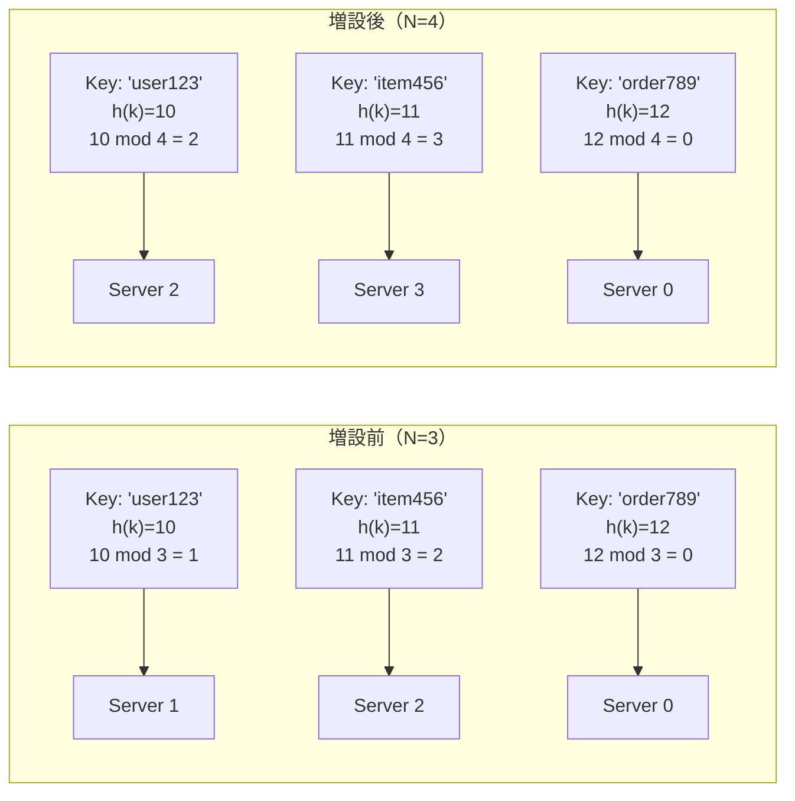
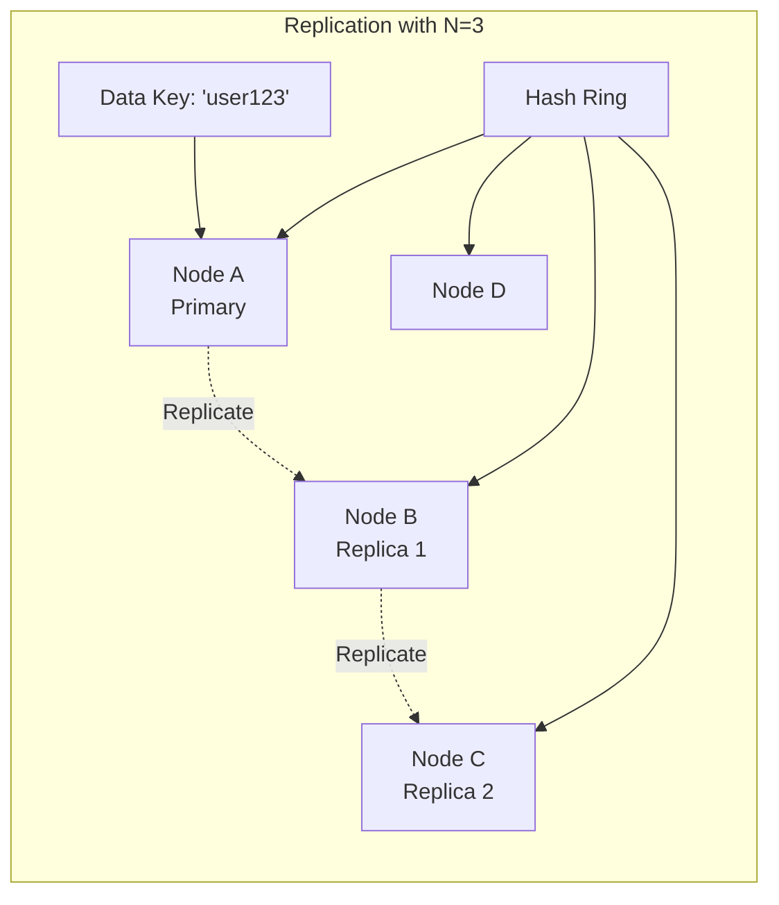

# Consistent Hashing

Consistent Hashingは、分散システムにおけるデータの配置問題を解決するために設計されたハッシュアルゴリズムです。1997年にDavid Karger、Eric Lehman、Tom Leighton、Matthew Levine、Daniel Lewin、Rina Panigrahyによって提案されました[^1]。このアルゴリズムは、ノードの追加や削除が頻繁に発生する動的な分散環境において、データの再配置を最小化することを目的としています。

分散キャッシュシステムやKey-Valueストア、CDN（Content Delivery Network）などの実装において、Consistent Hashingは不可欠な技術となっています。Amazon DynamoDB、Apache Cassandra、Memcachedなど、多くの実用的な分散システムがこのアルゴリズムを採用しています。

## 従来のハッシュ法の問題点

分散システムにおいて、データをN台のサーバーに分散配置する最も単純な方法は、剰余演算を用いたハッシュ法です。データのキーをkとし、ハッシュ関数をh(k)とすると、データの配置先サーバーは `server_index = h(k) mod N` で決定されます。

この方法は実装が簡潔で計算コストも低いという利点がありますが、サーバー数Nが変化した場合に深刻な問題が発生します。例えば、3台のサーバー構成から4台に増設した場合を考えてみましょう。増設前は `h(k) mod 3` で配置先が決まっていたデータが、増設後は `h(k) mod 4` で再計算されることになります。



この例では、3つのキーのうち2つ（'user123'と'item456'）の配置先が変更されています。一般に、N台からN+1台への増設時には、平均してN/(N+1)の割合のデータが再配置される必要があります。3台から4台への増設では75%、100台から101台への増設でも約99%のデータが影響を受けます。

大規模な分散システムでは、この再配置コストは許容できません。データの移動には帯域幅と時間が必要であり、移動中はシステムの可用性や性能が低下します。また、キャッシュシステムの場合、大量のキャッシュミスが発生し、バックエンドシステムに過度な負荷がかかる可能性があります。

## Consistent Hashingの基本原理

Consistent Hashingは、ハッシュ空間を環状（リング）として扱うことで、この問題を解決します。具体的には、ハッシュ関数の出力範囲（例えば0から2^32-1）を円環上に配置し、サーバーとデータの両方をこの環上にマッピングします。

アルゴリズムの基本的な動作は以下の通りです：

1. 各サーバーに識別子（IPアドレスやホスト名など）を割り当て、ハッシュ関数でリング上の位置を決定する
2. データのキーも同じハッシュ関数でリング上の位置を決定する
3. データは、リング上を時計回りに探索して最初に見つかるサーバーに配置する

```mermaid
graph TB
    subgraph "Consistent Hash Ring"
        Ring((Hash Ring<br/>0 to 2^32-1))
        
        S0[Server A<br/>h('192.168.1.1') = 100]
        S1[Server B<br/>h('192.168.1.2') = 800]
        S2[Server C<br/>h('192.168.1.3') = 1500]
        
        D1[Data 1<br/>h('key1') = 300]
        D2[Data 2<br/>h('key2') = 1200]
        D3[Data 3<br/>h('key3') = 1800]
        
        Ring --> S0
        Ring --> S1
        Ring --> S2
        
        D1 -.->|"Next server: B"| S1
        D2 -.->|"Next server: C"| S2
        D3 -.->|"Next server: A<br/>(wrap around)"| S0
    end
```

この方式の利点は、サーバーの追加や削除が局所的な影響に留まることです。新しいサーバーが追加された場合、そのサーバーの位置から反時計回りに最も近いサーバーが管理していたデータの一部のみが移動します。同様に、サーバーが削除された場合も、そのサーバーが管理していたデータは次のサーバーに引き継がれるだけです。

数学的には、N台のサーバー構成において1台のサーバーを追加または削除した場合、再配置されるデータの期待値はK/N（Kは全データ数）となります。これは従来の剰余演算によるハッシュ法と比較して大幅な改善です。

## Virtual Nodeの概念と実装

基本的なConsistent Hashingには、負荷の偏りという問題があります。サーバーがリング上にランダムに配置されるため、各サーバーが担当する範囲（アーク）の長さが不均一になる可能性があります。この問題を解決するために導入されたのがVirtual Node（仮想ノード）の概念です。

Virtual Nodeは、1つの物理サーバーを複数の仮想的なノードとしてリング上に配置する手法です。各物理サーバーに対してM個の仮想ノードを生成し、それぞれ異なる位置にマッピングすることで、負荷の均等化を図ります。

```python
import hashlib
import bisect

class ConsistentHash:
    def __init__(self, nodes=None, virtual_nodes=150):
        self.virtual_nodes = virtual_nodes
        self.ring = {}
        self.sorted_keys = []
        if nodes:
            for node in nodes:
                self.add_node(node)
    
    def _hash(self, key):
        """MD5ハッシュを使用してキーを32ビット整数に変換"""
        return int(hashlib.md5(key.encode()).hexdigest(), 16)
    
    def add_node(self, node):
        """ノードをリングに追加"""
        for i in range(self.virtual_nodes):
            virtual_key = f"{node}:{i}"
            hash_value = self._hash(virtual_key)
            self.ring[hash_value] = node
            bisect.insort(self.sorted_keys, hash_value)
    
    def remove_node(self, node):
        """ノードをリングから削除"""
        for i in range(self.virtual_nodes):
            virtual_key = f"{node}:{i}"
            hash_value = self._hash(virtual_key)
            if hash_value in self.ring:
                del self.ring[hash_value]
                self.sorted_keys.remove(hash_value)
    
    def get_node(self, key):
        """キーに対応するノードを取得"""
        if not self.ring:
            return None
        
        hash_value = self._hash(key)
        # 二分探索で最も近い仮想ノードを見つける
        index = bisect.bisect_right(self.sorted_keys, hash_value)
        if index == len(self.sorted_keys):
            index = 0
        
        return self.ring[self.sorted_keys[index]]
```

Virtual Nodeの数は、負荷分散の均等性とメモリ使用量のトレードオフを考慮して決定する必要があります。Amazon DynamoDBでは、各物理ノードに対して100から200個の仮想ノードを使用していることが報告されています[^2]。実験的には、仮想ノード数を増やすことで標準偏差は1/√M に比例して減少することが知られています。

## ハッシュ関数の選択と実装上の考慮事項

Consistent Hashingの実装において、ハッシュ関数の選択は重要な設計決定の一つです。理想的なハッシュ関数は以下の特性を持つ必要があります：

**均一性（Uniformity）**: ハッシュ値が出力範囲に均等に分布すること。これにより、ノードがリング上に偏りなく配置されます。

**決定性（Determinism）**: 同じ入力に対して常に同じ出力を返すこと。分散環境では、異なるノードが同じキーに対して同じハッシュ値を計算できる必要があります。

**計算効率**: ハッシュ値の計算が高速であること。大量のリクエストを処理する必要があるため、計算コストは重要な要素です。

実践的には、MD5、SHA-1、MurmurHash、CityHashなどが使用されます。暗号学的な強度は必要ないため、MurmurHashやCityHashのような非暗号学的ハッシュ関数が性能面で有利です。

また、リング上でのノード検索を効率化するためのデータ構造の選択も重要です。上記の実装例では、ソート済み配列と二分探索を使用していますが、大規模なシステムでは以下のような最適化が考慮されます：

**Skip List**: O(log n)の探索時間を保証しながら、並行アクセスに対してより良い性能を示します。

**Balanced Tree**: Red-Black TreeやAVL Treeを使用することで、挿入・削除・検索のすべてでO(log n)の性能を保証できます。

**Finger Table**: Chord[^3]で導入された手法で、各ノードが2^i番目の後続ノードへのポインタを保持することで、O(log n)ホップでの探索を可能にします。

## レプリケーションとの統合

実用的な分散システムでは、データの可用性と耐障害性を確保するためにレプリケーションが不可欠です。Consistent Hashingとレプリケーションを統合する一般的な手法は、リング上の連続するN個のノードにデータを複製することです。



この方式は「Preference List」と呼ばれ、Amazon DynamoDBやApache Cassandraで採用されています。ただし、Virtual Nodeを使用している場合は、同じ物理ノードに複数のレプリカが配置されないよう注意が必要です。

レプリケーション戦略の実装では、以下の点を考慮する必要があります：

**物理ノードの認識**: Virtual Nodeを使用する場合、レプリカは異なる物理ノードに配置されるべきです。これを実現するため、リング上を探索する際に既に選択された物理ノードをスキップする必要があります。

**ゾーンやデータセンターの認識**: 地理的に分散したシステムでは、レプリカを異なるゾーンやデータセンターに配置することで、大規模障害に対する耐性を高めます。

**読み書きクォーラム**: W個のレプリカへの書き込み成功とR個のレプリカからの読み込みを要求することで、一貫性レベルを調整できます。W + R > Nの場合、強い一貫性が保証されます。

## 実装の最適化と性能特性

Consistent Hashingの性能は、主に以下の要因に依存します：

**ノード探索の計算量**: 基本的な実装では、キーに対応するノードを見つけるためにO(log n)の時間が必要です（nは仮想ノード数）。これは、毎秒数百万のリクエストを処理する必要がある高負荷システムでは無視できないオーバーヘッドとなる可能性があります。

**キャッシュの活用**: 実際のシステムでは、頻繁にアクセスされるキーに対するノードマッピングをキャッシュすることで、探索コストを削減できます。ただし、ノードの追加・削除時にはキャッシュの無効化が必要です。

**並行性の考慮**: 複数のスレッドが同時にリングを更新する可能性がある場合、適切な同期メカニズムが必要です。Read-Write Lockを使用することで、読み込み操作の並行性を最大化しながら、書き込み操作の一貫性を保証できます。

```python
import threading

class ThreadSafeConsistentHash(ConsistentHash):
    def __init__(self, nodes=None, virtual_nodes=150):
        super().__init__(nodes, virtual_nodes)
        self.rwlock = threading.RLock()
    
    def add_node(self, node):
        with self.rwlock:
            super().add_node(node)
    
    def remove_node(self, node):
        with self.rwlock:
            super().remove_node(node)
    
    def get_node(self, key):
        # 読み込み操作も同じロックを使用（Python のRLockの制約）
        # 実際のシステムではRead-Write Lockの使用を推奨
        with self.rwlock:
            return super().get_node(key)
```

メモリ使用量の観点では、各仮想ノードに対してハッシュ値とノード識別子のマッピングを保存する必要があります。仮想ノード数をV、物理ノード数をPとすると、O(V × P)のメモリが必要です。1000台の物理ノードに対して各200個の仮想ノードを使用する場合、約200,000エントリの管理が必要となります。

## ジャンプ法による一貫性ハッシュ

Googleの研究者によって2014年に提案されたJump Consistent Hash[^4]は、従来のConsistent Hashingとは異なるアプローチを採用しています。この手法は、リングやVirtual Nodeを使用せず、純粋に計算によってキーからバケット（ノード）へのマッピングを決定します。

Jump Consistent Hashの核心は、キーkがバケットbに所属する確率を計算し、その確率に基づいて「ジャンプ」することです。アルゴリズムは以下のような疑似コードで表現されます：

```c
int32_t JumpConsistentHash(uint64_t key, int32_t num_buckets) {
    int64_t b = -1, j = 0;
    while (j < num_buckets) {
        b = j;
        key = key * 2862933555777941757ULL + 1;
        j = (b + 1) * (double(1LL << 31) / double((key >> 33) + 1));
    }
    return b;
}
```

このアルゴリズムの利点は、メモリ使用量がO(1)であり、計算も非常に高速であることです。また、バケット数が増加した場合でも、移動するキーの数が最小限に抑えられます。ただし、任意のノードの削除には対応していないため、ノード数が単調増加するシステムにのみ適用可能です。

## Maglev Hashingとその応用

GoogleのロードバランサーMaglevで使用されているMaglev Hashing[^5]は、Consistent Hashingの別の変種です。この手法は、高速なルックアップと優れた負荷分散を両立させることを目的としています。

Maglev Hashingの基本的なアイデアは、各ノードに対して疑似ランダムな順列を生成し、これらの順列を使用してルックアップテーブルを構築することです。テーブルのサイズMは素数であり、通常は65537などの値が使用されます。

アルゴリズムの概要：

1. 各ノードiに対して、2つの値offset[i]とskip[i]を計算する
2. 各ノードは自身の順列に従ってテーブルのエントリを埋めていく
3. すべてのエントリが埋まるまでラウンドロビン方式で続ける

この手法の利点は、O(1)のルックアップ時間と、ノードの追加・削除時の最小限のディスラプションです。実際、Googleの本番環境では、5台のノード構成で標準偏差0.77%という優れた負荷分散を実現しています。

## 実践的な設計指針とトレードオフ

Consistent Hashingを実際のシステムに適用する際には、以下の設計上の考慮事項があります：

**仮想ノード数の決定**: 仮想ノード数は負荷分散の均等性に直接影響します。一般的には、物理ノードあたり100-200個の仮想ノードが推奨されますが、システムの規模とメモリ制約を考慮して調整する必要があります。小規模なシステム（10台以下）では、より多くの仮想ノードが必要になる場合があります。

**ハッシュ関数の選択**: 暗号学的強度は不要なため、MurmurHash3やxxHashなどの高速な非暗号学的ハッシュ関数が推奨されます。ただし、セキュリティが重要な場合は、ハッシュフラッディング攻撃を防ぐためにSipHashなどの使用を検討すべきです。

**ノード重み付けの実装**: 異なる性能を持つノードが混在する環境では、各ノードに異なる数の仮想ノードを割り当てることで、重み付けを実現できます。高性能なノードにはより多くの仮想ノードを割り当て、より多くの負荷を担当させます。

**モニタリングとメトリクス**: 実運用では、各ノードの負荷（キー数、リクエスト数、データサイズ）を継続的に監視し、必要に応じて仮想ノード数を調整する必要があります。また、ノードの追加・削除時のデータ移動量も追跡すべきです。

他のデータ分散手法との比較において、Consistent Hashingは以下のような特徴を持ちます：

| 手法 | ノード追加時の影響 | 負荷分散 | 実装複雑度 | メモリ使用量 |
|------|-------------------|----------|------------|--------------|
| 剰余ハッシュ | O(n) | 優秀 | 低 | O(1) |
| Consistent Hashing | O(1/n) | 良好（Virtual Node使用時） | 中 | O(n×m) |
| Range Partitioning | 可変 | データ依存 | 高 | O(n) |
| Jump Hash | O(1/n) | 優秀 | 低 | O(1) |

## 実装時の落とし穴と回避策

Consistent Hashingの実装には、いくつかの一般的な落とし穴があります：

**ホットスポットの発生**: 特定のキー範囲に偏ったアクセスパターンがある場合、Virtual Nodeを使用していても負荷の偏りが発生する可能性があります。この問題に対しては、アクセス頻度に基づいた動的な仮想ノード調整や、ホットキーの特別な処理が必要です。

**ハッシュ衝突の扱い**: 異なる仮想ノードが同じハッシュ値を持つ可能性は低いものの、ゼロではありません。衝突が発生した場合の処理を適切に実装する必要があります。一般的には、衝突した場合は後から追加されたノードを僅かにオフセットさせる方法が採用されます。

**時刻同期の問題**: 分散環境では、ノードの追加・削除のタイミングが各サーバーで異なる可能性があります。これにより、一時的にデータの配置に不整合が生じる可能性があります。分散合意アルゴリズム（Raft、Paxos）を使用してメンバーシップの変更を同期させることが推奨されます。

```python
class ConsistentHashWithTimestamp:
    def __init__(self):
        self.ring = {}
        self.sorted_keys = []
        self.node_timestamps = {}  # ノードの追加時刻を記録
        
    def add_node_with_timestamp(self, node, timestamp):
        """タイムスタンプ付きでノードを追加"""
        if node in self.node_timestamps:
            if timestamp <= self.node_timestamps[node]:
                return  # 古い更新は無視
        
        # 既存のノードを削除してから再追加
        if node in self.node_timestamps:
            self.remove_node(node)
        
        self.node_timestamps[node] = timestamp
        # Virtual Nodeの追加処理...
```

## パフォーマンスチューニングと最適化

大規模な本番環境でConsistent Hashingを運用する際には、以下の最適化技術が有効です：

**階層的Consistent Hashing**: データセンター、ラック、サーバーといった階層構造を持つ環境では、各レベルでConsistent Hashingを適用することで、局所性を活かした効率的なデータ配置が可能です。

**Bounded Load Consistent Hashing**: Googleの研究[^6]により提案されたこの手法は、各ノードの負荷に上限を設けることで、より均等な負荷分散を実現します。負荷が上限に達したノードはスキップされ、次のノードが選択されます。

**キャッシュ統合**: 頻繁にアクセスされるキーに対するノードマッピングをLRUキャッシュに保存することで、ハッシュ計算とリング探索のオーバーヘッドを削減できます。ただし、ノードの変更時にはキャッシュの部分的な無効化が必要です。

実際の性能測定では、適切に実装されたConsistent Hashingは、1秒あたり数百万回のルックアップ操作を処理できることが示されています。Virtual Nodeを使用した場合でも、最新のCPUでは1回のルックアップに要する時間は通常100ナノ秒以下です。

分散システムの設計において、Consistent Hashingは単なるデータ分散アルゴリズムを超えた重要な構成要素となっています。その単純さと効率性により、スケーラブルなシステムの基盤技術として広く採用され続けています。新しい変種や最適化手法も継続的に研究されており、クラウドネイティブなアーキテクチャの発展とともに、その重要性はさらに高まっていくことが予想されます。

[^1]: Karger, D., Lehman, E., Leighton, T., Panigrahy, R., Levine, M., & Lewin, D. (1997). Consistent hashing and random trees: Distributed caching protocols for relieving hot spots on the World Wide Web. In Proceedings of the 29th Annual ACM Symposium on Theory of Computing (pp. 654-663).

[^2]: DeCandia, G., Hastorun, D., Jampani, M., Kakulapati, G., Lakshman, A., Pilchin, A., ... & Vogels, W. (2007). Dynamo: Amazon's highly available key-value store. ACM SIGOPS Operating Systems Review, 41(6), 205-220.

[^3]: Stoica, I., Morris, R., Karger, D., Kaashoek, M. F., & Balakrishnan, H. (2001). Chord: A scalable peer-to-peer lookup service for internet applications. ACM SIGCOMM Computer Communication Review, 31(4), 149-160.

[^4]: Lamping, J., & Veach, E. (2014). A fast, minimal memory, consistent hash algorithm. arXiv preprint arXiv:1406.2294.

[^5]: Eisenbud, D. E., Yi, C., Contavalli, C., Smith, C., Kononov, R., Mann-Hielscher, E., ... & Tuttle, R. (2016). Maglev: A fast and reliable software network load balancer. In 13th USENIX Symposium on Networked Systems Design and Implementation (pp. 523-535).

[^6]: Mirrokni, V., Thorup, M., & Zadimoghaddam, M. (2018). Consistent hashing with bounded loads. In Proceedings of the 29th Annual ACM-SIAM Symposium on Discrete Algorithms (pp. 587-604).