# CRDT: Conflict-free Replicated Data Type

分散システムにおけるデータ一貫性の問題は、システムの規模が拡大し、地理的に分散したノード間での協調が必要になるにつれて、ますます複雑になっている。従来のコンセンサスアルゴリズムやマスタースレーブ方式のレプリケーションでは、ネットワーク分断や高レイテンシ環境下での可用性に限界がある。CRDT（Conflict-free Replicated Data Type）[^1]は、これらの課題に対する革新的な解決策として、分散環境において最終的一貫性を保証しながら、高い可用性とスケーラビリティを実現するデータ構造である。

CRDTの本質は、複数のレプリカ間で独立に更新操作を行っても、それらの更新を適切に統合することで、すべてのレプリカが最終的に同じ状態に収束することを数学的に保証する点にある。この特性により、分散環境における同期の必要性を排除し、ローカルでの即座の更新と、ネットワーク分断時でも継続的な動作を可能にする。

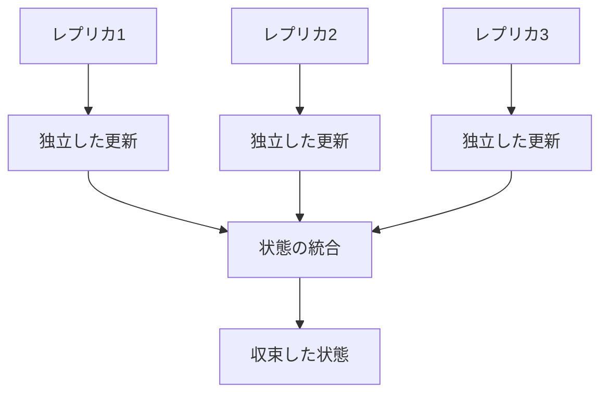

## 理論的基礎

CRDTの数学的基礎は、半順序集合（partially ordered set）と格子理論（lattice theory）に根ざしている。半順序集合 $(S, \leq)$ において、任意の2つの要素に対して上限（least upper bound）が存在する場合、これを結合半束（join-semilattice）と呼ぶ。CRDTは、この結合半束の性質を利用して、異なるレプリカからの更新を統合する際の一貫性を保証する。

結合半束における結合演算（join operation）$\sqcup$ は、以下の性質を満たす：

1. **可換性（Commutativity）**: $a \sqcup b = b \sqcup a$
2. **結合性（Associativity）**: $(a \sqcup b) \sqcup c = a \sqcup (b \sqcup c)$
3. **冪等性（Idempotency）**: $a \sqcup a = a$

これらの性質により、更新の適用順序に関わらず、同じ結果が得られることが保証される。さらに、状態が単調増加（monotonic）であることから、一度観測された状態が後退することがない。

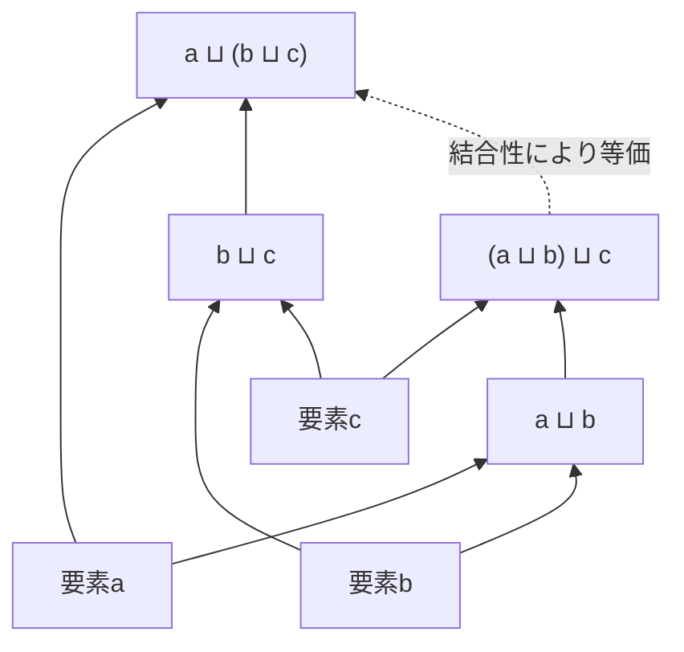

CRDTの収束性は、強結合収束性（Strong Eventual Consistency, SEC）[^2]として形式化される。システムが以下の条件を満たす場合、SECが成立する：

1. **最終的配送（Eventual Delivery）**: 正しいレプリカで実行された更新は、最終的にすべての正しいレプリカに配送される
2. **収束（Convergence）**: 同じ更新の集合を受信した正しいレプリカは、同じ状態になる
3. **終了（Termination）**: すべての更新操作は終了する

## CRDTの分類

CRDTは、その実装アプローチにより、主に2つのカテゴリに分類される：State-based CRDT（CvRDT）とOperation-based CRDT（CmRDT）である。それぞれが異なる特性とトレードオフを持ち、システムの要件に応じて選択される。

### State-based CRDT (CvRDT)

State-based CRDT[^3]は、レプリカの完全な状態を交換し、結合演算を用いて統合するアプローチである。各レプリカは、ローカルで状態を更新し、定期的に他のレプリカと状態全体を交換する。受信した状態は、ローカルの状態と結合演算により統合される。

CvRDTの形式的定義において、状態空間 $S$ は結合半束 $(S, \sqcup, \bot)$ を形成し、以下の要素で構成される：

- **状態空間** $S$：可能なすべての状態の集合
- **初期状態** $\bot \in S$：最小要素
- **更新操作** $u: S \rightarrow S$：単調増加関数（$s \leq u(s)$）
- **結合操作** $\sqcup: S \times S \rightarrow S$：最小上界を計算

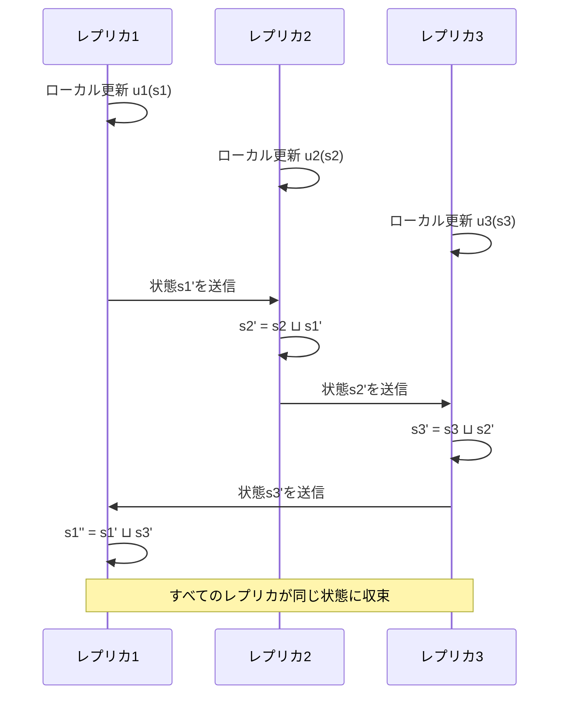

CvRDTの利点は、メッセージの重複や順序の入れ替わりに対して頑健であることである。結合演算の冪等性により、同じ状態を複数回受信しても問題ない。しかし、状態全体を転送する必要があるため、状態サイズが大きい場合には通信コストが高くなる。

### Operation-based CRDT (CmRDT)

Operation-based CRDT[^4]は、状態ではなく操作を伝播するアプローチである。各レプリカは実行された操作を他のレプリカに送信し、受信側でその操作を再実行する。CmRDTでは、操作の因果順序（causal order）を保証する必要がある。

CmRDTの形式的定義では、以下の要素が必要となる：

- **状態空間** $S$：可能なすべての状態の集合
- **初期状態** $s_0 \in S$
- **操作の集合** $O$：可能なすべての操作
- **準備条件** $P: S \times O \rightarrow \{true, false\}$
- **効果関数** $E: S \times O \rightarrow S$

操作の配送には、因果順序配送（causal order delivery）が必要である。操作 $o_1$ が操作 $o_2$ に因果的に先行する場合（$o_1 \rightarrow o_2$）、すべてのレプリカで $o_1$ は $o_2$ より先に適用される必要がある。

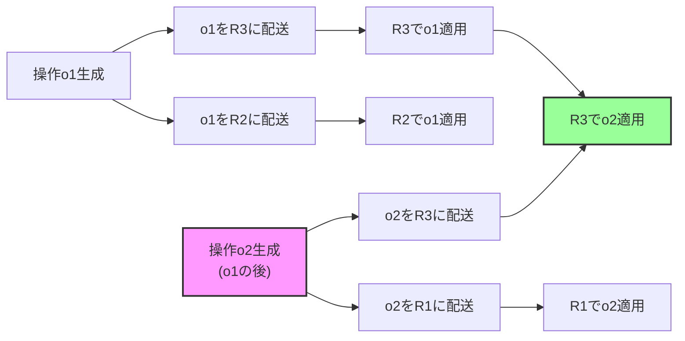

CmRDTは、操作のみを転送するため通信効率が良いが、因果順序の保証や、操作の重複配送の防止など、実装が複雑になる傾向がある。

## 主要なCRDTデータ構造

実用的なCRDTデータ構造は、基本的なデータ型からより複雑な構造まで、幅広く開発されている。それぞれが特定のユースケースに最適化されており、異なる特性とトレードオフを持つ。

### G-Counter (Grow-only Counter)

G-Counter[^5]は、増加のみが可能なカウンタであり、最も単純なCRDTの一つである。各レプリカは、自身のIDに対応するカウンタを保持し、ローカルでのインクリメント操作は自身のカウンタのみを更新する。

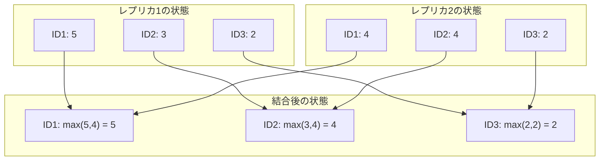

G-Counterの実装では、状態を $S: ID \rightarrow \mathbb{N}$ として表現し、結合演算は各IDに対して最大値を取る：

$$merge(s_1, s_2)(i) = \max(s_1(i), s_2(i))$$

値の読み取りは、すべてのカウンタの合計として計算される：

$$value(s) = \sum_{i \in ID} s(i)$$

### PN-Counter (Positive-Negative Counter)

PN-Counter[^6]は、増加と減少の両方が可能なカウンタである。内部的に2つのG-Counter（増加用のPと減少用のN）を保持し、値は両者の差として計算される。

```
State = (P: G-Counter, N: G-Counter)
increment(i) → P.increment(i)
decrement(i) → N.increment(i)
value() → P.value() - N.value()
merge((P1, N1), (P2, N2)) → (P1.merge(P2), N1.merge(N2))
```

PN-Counterの課題は、削除された値が内部的に蓄積され続けることである。これは「墓石問題（tombstone problem）」として知られ、長期間運用されるシステムでは、ガベージコレクションメカニズムが必要となる。

### G-Set (Grow-only Set)

G-Set[^7]は、要素の追加のみが可能な集合である。結合演算は単純な集合の和集合となる：

```
add(e) → S := S ∪ {e}
lookup(e) → e ∈ S
merge(S1, S2) → S1 ∪ S2
```

G-Setは単純で効率的だが、要素の削除ができないため、実用性は限定的である。

### 2P-Set (Two-Phase Set)

2P-Set[^8]は、要素の追加と削除の両方をサポートする集合である。内部的に追加集合（A）と削除集合（R）を保持し、一度削除された要素は再追加できないという制約がある。

```
State = (A: G-Set, R: G-Set)
add(e) → A.add(e) if e ∉ R
remove(e) → R.add(e) if e ∈ A
lookup(e) → e ∈ A ∧ e ∉ R
merge((A1, R1), (A2, R2)) → (A1 ∪ A2, R1 ∪ R2)
```

### LWW-Register (Last-Write-Wins Register)

LWW-Register[^9]は、タイムスタンプを用いて最新の値を保持するレジスタである。各更新にタイムスタンプを付与し、結合時には最も新しいタイムスタンプの値を採用する。

```
State = (value: V, timestamp: T)
assign(v) → State := (v, now())
value() → State.value
merge(s1, s2) → 
    if s1.timestamp > s2.timestamp then s1
    else if s1.timestamp < s2.timestamp then s2
    else tieBreaker(s1, s2)  // レプリカIDなどで決定
```

LWW-Registerの重要な課題は、分散環境での正確なタイムスタンプの生成である。物理時計の同期が不完全な場合、論理時計（Lamport Clock[^10]やHybrid Logical Clock[^11]）の使用が推奨される。

### OR-Set (Observed-Remove Set)

OR-Set[^12]は、並行な追加と削除を適切に処理できる集合である。各要素に一意のタグを付与し、削除時には観測されたタグのみを削除する。これにより、同じ要素の並行追加が削除によって失われることを防ぐ。

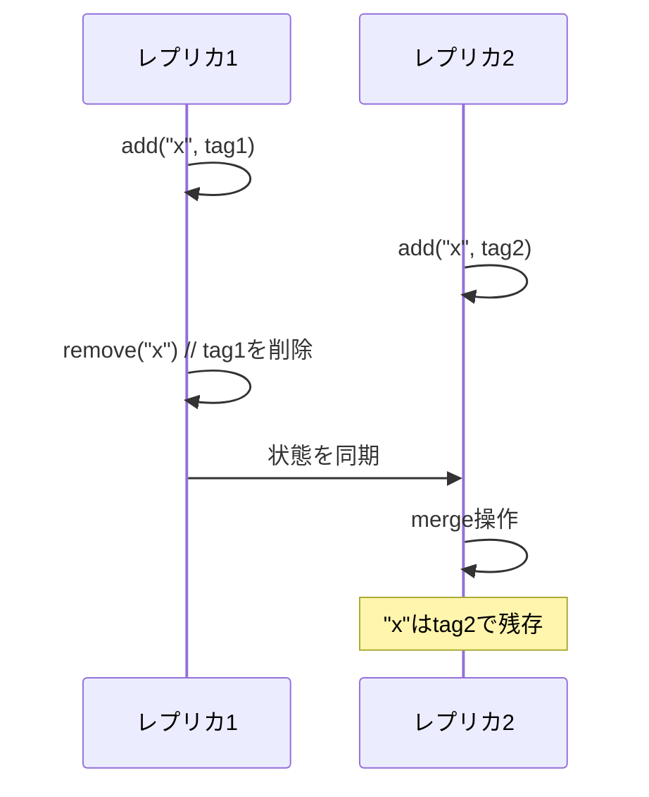

OR-Setの実装では、各要素を`(element, unique-tag)`のペアとして管理する：

```
State = Set<(Element, Tag)>
add(e) → S := S ∪ {(e, unique())}
remove(e) → S := S \ {(e, t) | (e, t) ∈ S}
lookup(e) → ∃t: (e, t) ∈ S
merge(S1, S2) → S1 ∪ S2
```

### RGA (Replicated Growable Array)

RGA[^13]は、順序を保持しながら要素の挿入・削除が可能な配列構造である。各要素に一意の識別子を付与し、要素間の順序関係を保持する。分散環境でのテキスト編集などに適用される。

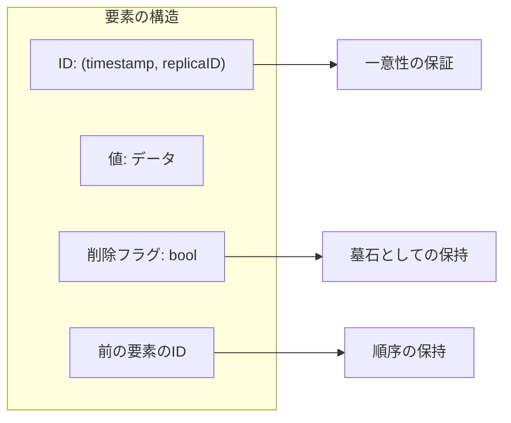

RGAの挿入操作では、新しい要素のIDを生成し、指定された位置の前後の要素との関係を記録する。並行挿入が発生した場合、IDの全順序（通常はタイムスタンプとレプリカIDの組み合わせ）により一貫した順序が決定される。

## 実装における考慮事項

CRDTの理論的な正しさと実用的な実装の間には、いくつかの重要なギャップが存在する。これらの課題に適切に対処することが、実用的なCRDTベースシステムの構築には不可欠である。

### メタデータの肥大化

多くのCRDTは、削除された要素の情報（墓石）や、各要素の履歴情報を保持する必要がある。時間の経過とともに、このメタデータは肥大化し、システムのパフォーマンスとストレージ効率に影響を与える。

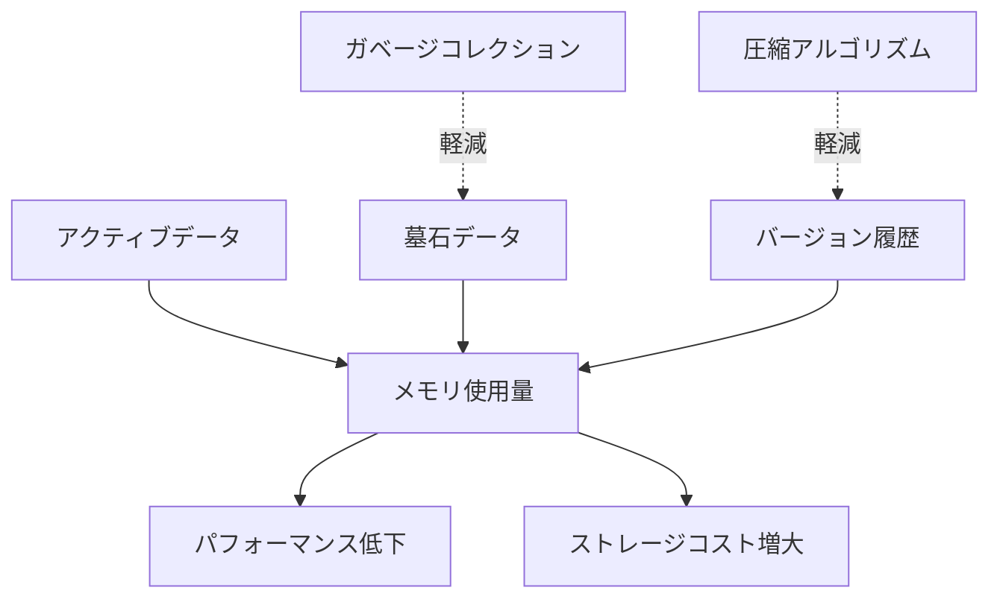

ガベージコレクションの実装では、すべてのレプリカが特定の墓石を観測したことを確認する必要がある。これは、安定なスナップショットや、ベクタークロックを用いた因果関係の追跡により実現される。ただし、ガベージコレクション自体が分散合意を必要とする場合があり、CRDTの利点である調整不要性を部分的に損なう可能性がある。

### 因果一貫性の保証

Operation-based CRDTでは、操作の因果順序を保証する必要がある。実装では、ベクタークロック[^14]やバージョンベクトル[^15]を用いて因果関係を追跡する。

```
VectorClock = Map<ReplicaID, LogicalTime>

happenssBefore(vc1, vc2) = 
    ∀i: vc1[i] ≤ vc2[i] ∧ ∃j: vc1[j] < vc2[j]

concurrent(vc1, vc2) = 
    ¬happensBefore(vc1, vc2) ∧ ¬happensBefore(vc2, vc1)
```

因果一貫性を保証するメッセージングレイヤーの実装では、以下の要素が必要となる：

1. **安定なメッセージバッファ**: 因果的に準備ができていない操作を一時的に保持
2. **再送メカニズム**: ネットワーク障害時の信頼性保証
3. **重複検出**: 同じ操作の複数回適用を防止

### 収束時間とネットワーク分断

CRDTは最終的一貫性を保証するが、収束までの時間は、ネットワークトポロジー、メッセージ伝播の遅延、および同期頻度に依存する。特に、長期間のネットワーク分断後の再統合では、大量の状態差分を処理する必要があり、一時的なパフォーマンス低下を引き起こす可能性がある。

反エントロピープロトコル[^16]の実装により、効率的な状態同期を実現できる：

```
// Merkle tree based anti-entropy
synchronize(remote) {
    rootHash = computeMerkleRoot(localState)
    remoteRootHash = remote.getRootHash()
    
    if (rootHash != remoteRootHash) {
        differences = findDifferences(localTree, remote)
        for (diff in differences) {
            exchangeStates(diff, remote)
        }
    }
}
```

### メモリ効率とスケーラビリティ

大規模なCRDTの実装では、メモリ効率が重要な課題となる。特に、要素数が多い集合や、頻繁に更新される構造では、以下の最適化が有効である：

1. **デルタCRDT**[^17]: 状態全体ではなく、前回の同期以降の差分（デルタ）のみを転送
2. **圧縮表現**: 連続する要素や重複するメタデータの圧縮
3. **階層的構造**: 大きなCRDTを小さな部分に分割し、必要な部分のみを同期

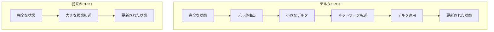

## 実用的な応用と事例

CRDTは、理論的な優雅さだけでなく、実際の分散システムにおいても広く採用されている。特に、高可用性と地理的分散が要求されるシステムにおいて、その価値を発揮している。

### 協調編集システム

Google Docs[^18]やApache Wave[^19]などの協調編集システムでは、複数のユーザーが同時に文書を編集する際の一貫性保証にCRDTが活用されている。RGAやTreedoc[^20]などの順序付きCRDTにより、並行編集操作の統合が可能となる。

実装では、各文字や段落に一意のIDを付与し、操作の因果関係を保持しながら、ユーザーの意図を正確に反映する必要がある。また、大規模な文書では、部分的な同期やオンデマンドローディングなどの最適化が不可欠である。

### 分散データベース

Riak[^21]、Redis[^22]のCRDTモジュール、AntidoteDB[^23]などの分散データベースは、CRDTを基盤として構築されている。これらのシステムでは、地理的に分散したデータセンター間でのレプリケーションにおいて、CRDTにより低レイテンシの更新と高可用性を実現している。

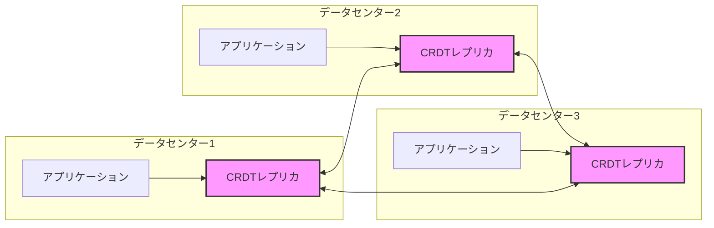

### モバイルアプリケーション

オフライン機能を持つモバイルアプリケーションでは、デバイス上でのローカル更新と、オンライン復帰時の同期にCRDTが活用される。例えば、ノートアプリケーションやタスク管理アプリケーションでは、オフライン時の編集内容を失うことなく、複数デバイス間での一貫性を保証できる。

### 分散構成管理

etcd[^24]やConsul[^25]などの分散構成管理システムでは、設定情報の管理にCRDTを応用することで、ネットワーク分断時でも設定の読み取りと更新を継続できる。特に、エッジコンピューティング環境では、中央サーバーとの接続が不安定な状況でも、ローカルでの設定管理が可能となる。

## パフォーマンス特性とトレードオフ

CRDTの選択と実装には、様々なトレードオフが存在する。システムの要件に応じて、適切なCRDTタイプと実装戦略を選択する必要がある。

### 通信コスト vs 計算コスト

State-based CRDTは状態全体を転送するため通信コストが高いが、受信側での処理は単純な結合演算で済む。一方、Operation-based CRDTは操作のみを転送するため通信効率は良いが、因果順序の管理や操作の再実行に計算コストがかかる。

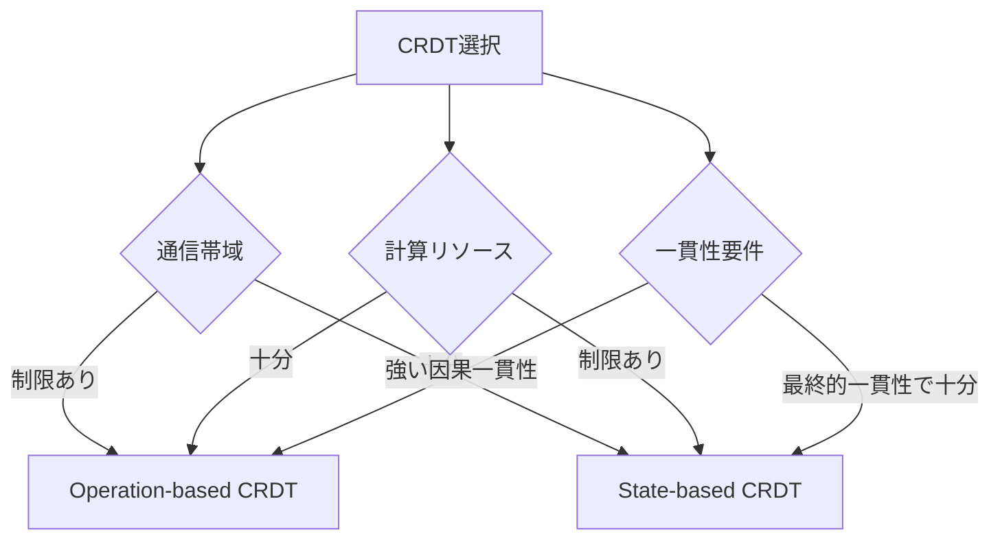

### メモリ使用量 vs 機能性

より豊富な機能を持つCRDT（例：OR-Set）は、単純なCRDT（例：G-Set）と比較して、より多くのメタデータを保持する必要がある。システムの要件に応じて、必要最小限の機能を持つCRDTを選択することが重要である。

### 収束速度 vs 調整コスト

純粋なCRDTは調整不要で即座にローカル更新が可能だが、収束までに時間がかかる場合がある。一方、ハイブリッドアプローチ（例：因果一貫性のための部分的な調整）では、収束速度を向上させることができるが、可用性や分断耐性が低下する。

## 実装のベストプラクティス

実用的なCRDTシステムの構築には、理論的な正しさだけでなく、エンジニアリング上の様々な考慮が必要である。

### バージョン管理とスキーマ進化

長期運用されるシステムでは、CRDTのデータ構造やアルゴリズムの変更が必要になる場合がある。バージョン管理システムを導入し、異なるバージョン間での互換性を保証する必要がある：

```
message CRDTState {
    uint32 version = 1;
    oneof state {
        StateV1 state_v1 = 2;
        StateV2 state_v2 = 3;
    }
}

// マイグレーションロジック
function migrate(state, targetVersion) {
    while (state.version < targetVersion) {
        state = migrationHandlers[state.version](state)
        state.version++
    }
    return state
}
```

### モニタリングとデバッグ

分散環境でのCRDTの動作を監視し、問題を診断するためのツールが不可欠である：

1. **収束メトリクス**: レプリカ間の状態差分を定量化
2. **操作レイテンシ**: 更新の伝播時間を測定
3. **メタデータサイズ**: 墓石やバージョン情報のサイズを追跡
4. **因果関係ビジュアライザ**: 操作の因果関係を可視化

### テスト戦略

CRDTの正しさを検証するには、通常の単体テストに加えて、並行性と分散環境を考慮したテストが必要である：

```
// プロパティベーステスト例
property("収束性") {
    forAll { (ops1: List[Op], ops2: List[Op]) =>
        val replica1 = new CRDT()
        val replica2 = new CRDT()
        
        // 異なる順序で操作を適用
        ops1.foreach(replica1.apply)
        ops2.foreach(replica1.apply)
        
        ops2.foreach(replica2.apply)
        ops1.foreach(replica2.apply)
        
        // 最終状態が一致することを確認
        replica1.state == replica2.state
    }
}
```

### セキュリティ考慮事項

CRDTベースのシステムでは、悪意のあるレプリカからの不正な更新を防ぐ必要がある：

1. **認証と認可**: レプリカの身元確認と操作権限の検証
2. **暗号学的署名**: 操作の完全性と出所の保証
3. **ビザンチン障害耐性**: 悪意のあるレプリカの検出と隔離

## 発展的なトピック

CRDTの研究は活発に進展しており、新しいアプローチや応用が継続的に提案されている。

### Pure Operation-based CRDTs

Pure Operation-based CRDTs[^26]は、操作の交換律を保証することで、因果順序配送の要件を緩和する。これにより、実装の簡素化と、より柔軟なネットワークトポロジーでの動作が可能となる。

### Conflict-free Replicated Relations (CRRs)

CRRs[^27]は、リレーショナルデータベースの概念をCRDTに拡張したものである。テーブル、行、および関係性をCRDTとして表現し、分散SQLデータベースの構築を可能にする。

### CRDTとブロックチェーン

CRDTとブロックチェーン技術の組み合わせにより、高スループットと最終的一貫性を持つ分散台帳の構築が研究されている[^28]。CRDTにより、ブロック生成前の状態更新が可能となり、トランザクションスループットが向上する。

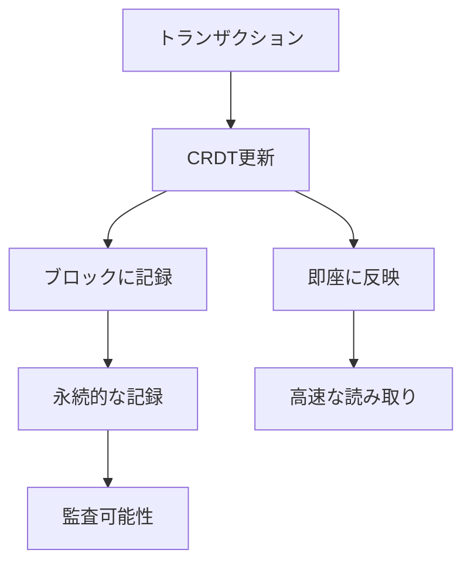

[^1]: Shapiro, M., Preguiça, N., Baquero, C., & Zawirski, M. (2011). Conflict-free replicated data types. In Symposium on Self-Stabilizing Systems (pp. 386-400). Springer.

[^2]: Shapiro, M., Preguiça, N., Baquero, C., & Zawirski, M. (2011). A comprehensive study of convergent and commutative replicated data types. INRIA Technical Report.

[^3]: Baquero, C., Almeida, P. S., & Shoker, A. (2014). Making operation-based CRDTs operation-based. In Distributed Applications and Interoperable Systems (pp. 126-140). Springer.

[^4]: Almeida, P. S., Shoker, A., & Baquero, C. (2015). Efficient state-based CRDTs by delta-mutation. In International Conference on Networked Systems (pp. 62-76). Springer.

[^5]: Preguiça, N., Baquero, C., & Shapiro, M. (2018). Conflict-free replicated data types (CRDTs). arXiv preprint arXiv:1805.06358.

[^6]: Bieniusa, A., Zawirski, M., Preguiça, N., Shapiro, M., Baquero, C., Balegas, V., & Duarte, S. (2012). An optimized conflict-free replicated set. arXiv preprint arXiv:1210.3368.

[^7]: Letia, M., Preguiça, N., & Shapiro, M. (2009). CRDTs: Consistency without concurrency control. arXiv preprint arXiv:0907.0929.

[^8]: Preguiça, N. (2018). Conflict-free replicated data types: An overview. arXiv preprint arXiv:1806.10254.

[^9]: Johnson, P. R., & Thomas, R. H. (1976). The maintenance of duplicate databases. Internet Request for Comments RFC, 677.

[^10]: Lamport, L. (1978). Time, clocks, and the ordering of events in a distributed system. Communications of the ACM, 21(7), 558-565.

[^11]: Kulkarni, S. S., Demirbas, M., Madappa, D., Avva, B., & Leone, M. (2014). Logical physical clocks. In International Conference on Principles of Distributed Systems (pp. 17-32). Springer.

[^12]: Bieniusa, A., Zawirski, M., Preguiça, N., Shapiro, M., Baquero, C., Balegas, V., & Duarte, S. (2012). An optimized conflict-free replicated set. arXiv preprint arXiv:1210.3368.

[^13]: Roh, H. G., Jeon, M., Kim, J. S., & Lee, J. (2011). Replicated abstract data types: Building blocks for collaborative applications. Journal of Parallel and Distributed Computing, 71(3), 354-368.

[^14]: Fidge, C. (1988). Timestamps in message-passing systems that preserve the partial ordering. Proceedings of the 11th Australian Computer Science Conference, 10(1), 56-66.

[^15]: Parker Jr, D. S., Popek, G. J., Rudisin, G., Stoughton, A., Walker, B. J., Walton, E., ... & Kiser, S. (1983). Detection of mutual inconsistency in distributed systems. IEEE transactions on Software Engineering, (3), 240-247.

[^16]: Demers, A., Greene, D., Hauser, C., Irish, W., Larson, J., Shenker, S., ... & Terry, D. (1987). Epidemic algorithms for replicated database maintenance. In Proceedings of the sixth annual ACM Symposium on Principles of distributed computing (pp. 1-12).

[^17]: Almeida, P. S., Shoker, A., & Baquero, C. (2016). Delta state replicated data types. Journal of Parallel and Distributed Computing, 111, 162-173.

[^18]: Google. (2010). Operational transformation in Google Wave. Google Wave Protocol Documentation.

[^19]: Wang, D., Mah, A., & Lassen, S. (2010). Google Wave operational transformation. Google White Paper.

[^20]: Preguiça, N., Marquès, J. M., Shapiro, M., & Letia, M. (2009). A commutative replicated data type for cooperative editing. In 2009 29th IEEE International Conference on Distributed Computing Systems (pp. 395-403). IEEE.

[^21]: Basho Technologies. (2013). Riak DT: Convergent replicated data types in Riak. Basho Documentation.

[^22]: Redis Labs. (2018). Redis CRDTs: Conflict-free replicated data types. Redis Documentation.

[^23]: AntidoteDB. (2019). AntidoteDB: A planet scale, highly available, transactional database. AntidoteDB Documentation.

[^24]: CoreOS. (2013). etcd: A distributed, reliable key-value store. CoreOS Documentation.

[^25]: HashiCorp. (2014). Consul: Service mesh and service discovery. HashiCorp Documentation.

[^26]: Baquero, C., Almeida, P. S., & Shoker, A. (2017). Pure operation-based replicated data types. arXiv preprint arXiv:1710.04469.

[^27]: Sovran, S., Power, R., Aguilera, M. K., & Li, J. (2011). Transactional storage for geo-replicated systems. In Proceedings of the Twenty-Third ACM Symposium on Operating Systems Principles (pp. 385-400).

[^28]: Cholvi, V., Felber, P., & Biely, M. (2019). Combining CRDTs and blockchain for highly available and scalable distributed ledgers. In 2019 38th Symposium on Reliable Distributed Systems (SRDS) (pp. 183-192). IEEE.