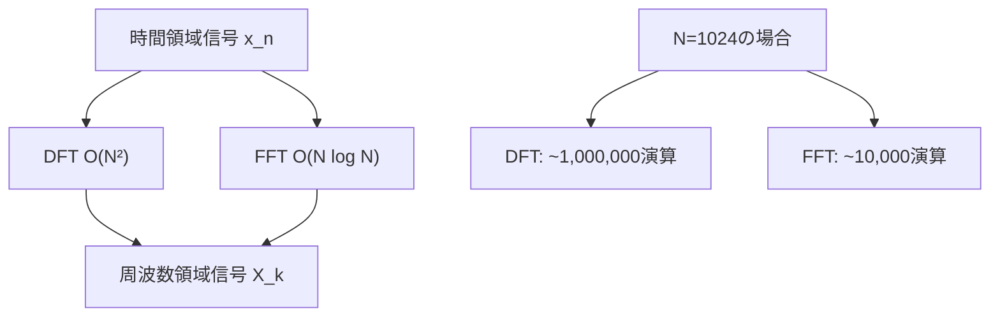
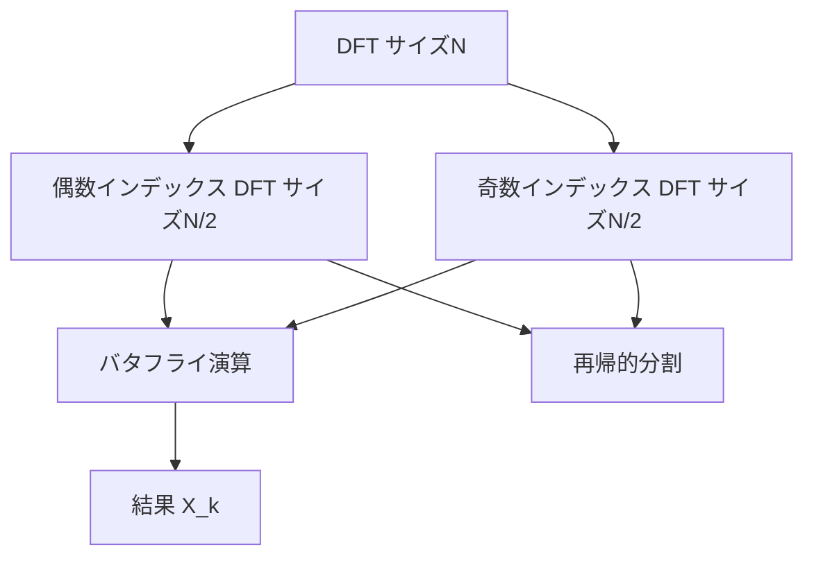
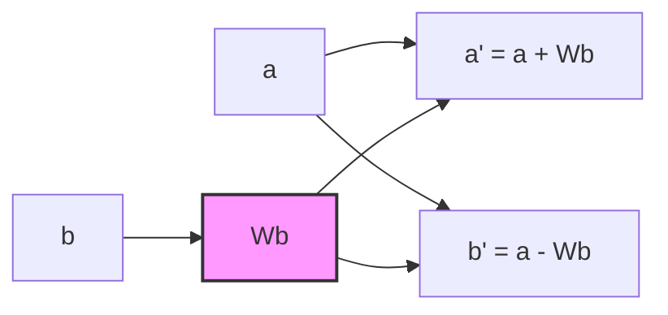
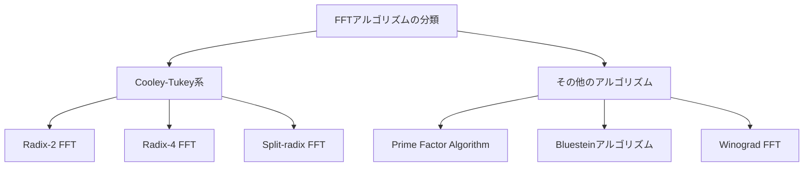
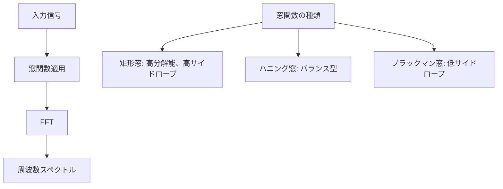
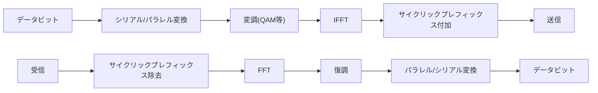

# 高速フーリエ変換

高速フーリエ変換（Fast Fourier Transform、FFT）は、離散フーリエ変換（Discrete Fourier Transform、DFT）を効率的に計算するアルゴリズムである。DFTの計算量を$O(N^2)$から$O(N \log N)$に削減することで、信号処理、画像処理、多倍長演算など様々な分野で実用的な計算を可能にした画期的なアルゴリズムである。

## 離散フーリエ変換の基礎

離散フーリエ変換は、離散的な時間領域の信号を周波数領域に変換する数学的操作である。長さ$N$の複素数列$\{x_n\}_{n=0}^{N-1}$に対して、その離散フーリエ変換$\{X_k\}_{k=0}^{N-1}$は以下のように定義される：

$$X_k = \sum_{n=0}^{N-1} x_n e^{-i2\pi kn/N}, \quad k = 0, 1, ..., N-1$$

ここで、$e^{-i2\pi kn/N}$は回転因子（twiddle factor）と呼ばれ、しばしば$W_N^{kn}$と表記される。ただし、$W_N = e^{-i2\pi/N}$は$N$次の原始単位根である。

この定義に基づいて素朴に計算すると、各$X_k$の計算に$N$回の複素数乗算と$N-1$回の複素数加算が必要となり、全体で$O(N^2)$の計算量となる。例えば、$N = 1024$の場合、約100万回の複素数演算が必要となり、実時間処理には適さない。



## Cooley-Tukeyアルゴリズムの原理

FFTの最も代表的なアルゴリズムであるCooley-Tukeyアルゴリズムは、分割統治法に基づいている[^1]。このアルゴリズムの核心的なアイデアは、DFTの計算を偶数インデックスと奇数インデックスの要素に分割し、それぞれ半分のサイズのDFTとして再帰的に計算することである。

$N = 2^m$（$m$は正の整数）とし、入力列を偶数インデックスと奇数インデックスに分割する：
- 偶数インデックス: $\{x_0, x_2, x_4, ..., x_{N-2}\}$
- 奇数インデックス: $\{x_1, x_3, x_5, ..., x_{N-1}\}$

このとき、DFTの定義式は次のように書き換えられる：

$$X_k = \sum_{n=0}^{N/2-1} x_{2n} W_N^{2nk} + \sum_{n=0}^{N/2-1} x_{2n+1} W_N^{(2n+1)k}$$

ここで、$W_N^{2nk} = W_{N/2}^{nk}$という関係を用いると：

$$X_k = \sum_{n=0}^{N/2-1} x_{2n} W_{N/2}^{nk} + W_N^k \sum_{n=0}^{N/2-1} x_{2n+1} W_{N/2}^{nk}$$

これは、偶数インデックスの要素に対する長さ$N/2$のDFTと、奇数インデックスの要素に対する長さ$N/2$のDFTを組み合わせた形になっている。$E_k$を偶数インデックスのDFT、$O_k$を奇数インデックスのDFTとすると：

$$X_k = E_k + W_N^k O_k, \quad k = 0, 1, ..., N/2-1$$

さらに、周期性を利用すると、$k \geq N/2$の場合：

$$X_{k+N/2} = E_k - W_N^k O_k, \quad k = 0, 1, ..., N/2-1$$

この関係により、2つの長さ$N/2$のDFTから長さ$N$のDFTを$O(N)$の追加計算で構成できる。



## バタフライ演算の構造

FFTの基本演算単位であるバタフライ演算は、2つの複素数入力から2つの複素数出力を生成する演算である。入力を$a$と$b$、回転因子を$W$とすると、出力は：

$$\begin{aligned}
a' &= a + Wb \\
b' &= a - Wb
\end{aligned}$$

この演算の名前は、信号フロー図で描いたときの形状が蝶に似ていることに由来する。



Cooley-TukeyアルゴリズムのRadix-2 FFT（基数2のFFT）では、$\log_2 N$段のバタフライ演算が必要である。各段では$N/2$個のバタフライ演算が並列に実行可能であり、全体の演算量は$O(N \log N)$となる。

## ビット反転置換

Cooley-Tukeyアルゴリズムを再帰的に適用すると、最終的に入力データの順序が変更される。具体的には、インデックスをビット反転した順序になる。例えば、$N = 8$の場合：

| 元のインデックス | 2進表現 | ビット反転 | 新しいインデックス |
|-----------------|---------|-----------|-------------------|
| 0               | 000     | 000       | 0                 |
| 1               | 001     | 100       | 4                 |
| 2               | 010     | 010       | 2                 |
| 3               | 011     | 110       | 6                 |
| 4               | 100     | 001       | 1                 |
| 5               | 101     | 101       | 5                 |
| 6               | 110     | 011       | 3                 |
| 7               | 111     | 111       | 7                 |

このビット反転置換は、FFTの実装において重要な前処理ステップとなる。効率的なビット反転アルゴリズムとして、以下のような手法がある：

```python
def bit_reverse(x, log2n):
    n = 0
    for _ in range(log2n):
        n <<= 1
        n |= x & 1
        x >>= 1
    return n
```

## 実装における最適化技法

FFTの実装において、理論的な計算量だけでなく、実際の計算機アーキテクチャに適合した最適化が重要である。主要な最適化技法には以下のものがある。

### メモリアクセスパターンの最適化

現代のプロセッサでは、キャッシュメモリの効率的な利用が性能に大きく影響する。FFTのメモリアクセスパターンは、ストライドアクセスを含むため、キャッシュミスが発生しやすい。これを改善する手法として：

1. **キャッシュブロッキング**: 大きなFFTを小さなブロックに分割し、各ブロックがキャッシュに収まるようにする
2. **データレイアウトの工夫**: 実部と虚部を交互に配置するインターリーブ形式か、別々に配置するスプリット形式かを、ターゲットアーキテクチャに応じて選択する

### 回転因子の事前計算

回転因子$W_N^k$の計算には三角関数の評価が必要であり、計算コストが高い。多くの実装では、これらを事前に計算してテーブルに格納する。ただし、メモリ使用量とのトレードオフを考慮する必要がある。

```c
// Precompute twiddle factors
for (int k = 0; k < N/2; k++) {
    double angle = -2.0 * M_PI * k / N;
    twiddle[k].real = cos(angle);
    twiddle[k].imag = sin(angle);
}
```

### SIMD命令の活用

現代のプロセッサはSIMD（Single Instruction Multiple Data）命令をサポートしており、複数のデータに対して同じ演算を並列に実行できる。FFTのバタフライ演算は、SIMD命令による並列化に適している。

## その他のFFTアルゴリズム

Cooley-Tukey以外にも、様々なFFTアルゴリズムが開発されている。それぞれ特定の条件下で優位性を持つ。

### Radix-4およびSplit-radix FFT

Radix-2 FFTを一般化したRadix-4 FFTは、4つの部分問題に分割することで、乗算回数を削減できる。Split-radix FFTはRadix-2とRadix-4を組み合わせたアルゴリズムで、既知のFFTアルゴリズムの中で最小の算術演算回数を達成する[^2]。

### Prime-factor algorithm（PFA）

$N$が互いに素な因数の積$N = N_1 \times N_2$として表せる場合、中国剰余定理を用いて2次元のDFTに変換できる。このアルゴリズムは回転因子の乗算を必要としない利点がある。

### Bluesteinアルゴリズム

任意の長さ$N$（2のべき乗でない場合も含む）に対して適用可能なアルゴリズムである。DFTを畳み込みとして表現し、その畳み込みをFFTで計算する。計算量は$O(N \log N)$であるが、定数倍が大きい。



## 実数FFTと多次元FFT

### 実数FFT

入力が実数列の場合、DFTの出力は複素共役対称性を持つ：$X_{N-k} = X_k^*$（ただし$X^*$は複素共役）。この性質を利用すると、計算量とメモリ使用量をほぼ半分に削減できる。

実数FFTの実装方法として、長さ$N$の実数列を長さ$N/2$の複素数列として扱い、通常のFFTを適用した後、結果を適切に分離する手法がある：

```python
# Pack two real sequences into one complex sequence
def real_fft_via_complex(x):
    N = len(x)
    # Pack even and odd samples into complex array
    z = x[0::2] + 1j * x[1::2]
    # Compute N/2 point complex FFT
    Z = fft(z)
    # Separate results
    # ... (separation logic)
```

### 多次元FFT

2次元以上のデータに対するFFTは、各次元に対して独立に1次元FFTを適用することで計算できる。2次元FFTの場合：

1. 各行に対して1次元FFTを適用
2. その結果の各列に対して1次元FFTを適用

この手法は行列の転置を含むため、キャッシュ効率を考慮した実装が重要となる。

## 数値精度と誤差解析

FFTの実装において、浮動小数点演算による丸め誤差の蓄積は避けられない問題である。誤差の主な要因は：

1. **回転因子の近似誤差**: 三角関数の計算や事前計算テーブルの量子化による誤差
2. **演算順序による誤差の蓄積**: バタフライ演算の繰り返しによる誤差の伝播

一般に、長さ$N$のFFTにおける相対誤差は$O(\epsilon \log N)$のオーダーとなる。ここで$\epsilon$は機械イプシロンである。倍精度浮動小数点数を使用する場合、$N = 10^6$程度までは十分な精度が保たれる。

## 逆離散フーリエ変換（IFFT）

逆離散フーリエ変換（Inverse DFT）は、周波数領域の信号を時間領域に戻す変換である。長さ$N$の周波数領域信号$\{X_k\}_{k=0}^{N-1}$に対して、その逆変換$\{x_n\}_{n=0}^{N-1}$は：

$$x_n = \frac{1}{N} \sum_{k=0}^{N-1} X_k e^{i2\pi kn/N}, \quad n = 0, 1, ..., N-1$$

注目すべきは、逆変換の式がDFTとほぼ同じ形であり、指数の符号が逆で、係数$1/N$が付いている点である。この類似性により、FFTアルゴリズムをそのまま逆変換にも利用できる。実装では、入力の複素共役を取り、FFTを適用し、結果の複素共役を$N$で除算する方法がよく用いられる：

```python
def ifft(X):
    N = len(X)
    # Conjugate the input
    X_conj = np.conj(X)
    # Apply forward FFT
    x_conj = fft(X_conj)
    # Conjugate and scale the result
    return np.conj(x_conj) / N
```

## 窓関数とスペクトル漏れ

実際の信号処理では、無限長の信号を有限長に切り出す必要がある。この切り出しによって生じる不連続性は、周波数領域でスペクトル漏れ（spectral leakage）と呼ばれる現象を引き起こす。窓関数（window function）は、この問題を軽減するために信号の両端を滑らかにゼロに近づける重み関数である。

代表的な窓関数には以下のものがある：

**矩形窓（Rectangular Window）**：
$$w[n] = 1, \quad 0 \leq n < N$$

**ハニング窓（Hanning Window）**：
$$w[n] = 0.5 - 0.5 \cos\left(\frac{2\pi n}{N-1}\right), \quad 0 \leq n < N$$

**ハミング窓（Hamming Window）**：
$$w[n] = 0.54 - 0.46 \cos\left(\frac{2\pi n}{N-1}\right), \quad 0 \leq n < N$$

**ブラックマン窓（Blackman Window）**：
$$w[n] = 0.42 - 0.5 \cos\left(\frac{2\pi n}{N-1}\right) + 0.08 \cos\left(\frac{4\pi n}{N-1}\right)$$

窓関数の選択は、主ローブの幅とサイドローブレベルのトレードオフを考慮して行う。矩形窓は最も狭い主ローブを持つが、サイドローブレベルが高い。一方、ブラックマン窓はサイドローブを効果的に抑制するが、主ローブが広くなる。



## 高速畳み込みへの応用

畳み込み（convolution）は信号処理において基本的な演算であり、時間領域での畳み込みは周波数領域での乗算に対応する（畳み込み定理）。この性質を利用すると、FFTを用いて畳み込みを高速に計算できる。

長さ$N$と$M$の2つの信号$x[n]$と$h[n]$の線形畳み込みは：

$$y[n] = \sum_{k=0}^{M-1} h[k] x[n-k]$$

直接計算では$O(NM)$の計算量が必要だが、FFTを用いると：

1. 両信号を$N+M-1$以上の長さにゼロパディング
2. 両信号のFFTを計算
3. 周波数領域で要素ごとの乗算
4. 逆FFTで時間領域に戻す

この方法により、計算量は$O((N+M)\log(N+M))$となる。$N$と$M$が大きい場合、計算量の削減効果は顕著である。

```python
def fft_convolution(x, h):
    # Determine output length
    N = len(x) + len(h) - 1
    # Find next power of 2 for efficiency
    N_fft = 2**np.ceil(np.log2(N)).astype(int)
    
    # Zero-pad and compute FFTs
    X = fft(x, N_fft)
    H = fft(h, N_fft)
    
    # Multiply in frequency domain
    Y = X * H
    
    # Inverse FFT and take real part
    y = np.real(ifft(Y))
    
    # Trim to correct length
    return y[:N]
```

## 実装例：Radix-2 FFTの詳細実装

以下は、教育目的のRadix-2 FFTの完全な実装例である。最適化は最小限に留め、アルゴリズムの構造を明確にしている：

```python
import numpy as np

def fft_radix2(x):
    """
    Compute FFT using Radix-2 Cooley-Tukey algorithm
    Input must have length that is a power of 2
    """
    N = len(x)
    
    # Base case
    if N <= 1:
        return x
    
    # Check if N is power of 2
    if N & (N - 1) != 0:
        raise ValueError("Input length must be a power of 2")
    
    # Divide into even and odd
    even = fft_radix2(x[0::2])
    odd = fft_radix2(x[1::2])
    
    # Combine results
    T = np.zeros(N, dtype=complex)
    for k in range(N // 2):
        t = np.exp(-2j * np.pi * k / N) * odd[k]
        T[k] = even[k] + t
        T[k + N//2] = even[k] - t
    
    return T

def fft_iterative(x):
    """
    Iterative implementation of Radix-2 FFT
    More efficient than recursive version
    """
    N = len(x)
    if N & (N - 1) != 0:
        raise ValueError("Input length must be a power of 2")
    
    # Bit-reversal permutation
    x = bit_reverse_copy(x)
    
    # Cooley-Tukey iterative FFT
    log2N = int(np.log2(N))
    for s in range(1, log2N + 1):
        m = 2**s
        omega_m = np.exp(-2j * np.pi / m)
        
        for k in range(0, N, m):
            omega = 1
            for j in range(m // 2):
                t = omega * x[k + j + m//2]
                u = x[k + j]
                x[k + j] = u + t
                x[k + j + m//2] = u - t
                omega *= omega_m
    
    return x

def bit_reverse_copy(x):
    """
    Rearrange array elements in bit-reversed order
    """
    N = len(x)
    log2N = int(np.log2(N))
    y = np.zeros_like(x)
    
    for i in range(N):
        j = bit_reverse(i, log2N)
        y[j] = x[i]
    
    return y
```

## FFTの主要な応用分野

### デジタル信号処理

音声信号処理では、FFTは音声の周波数成分を分析するために不可欠である。音声認識システムでは、メル周波数ケプストラム係数（MFCC）の計算にFFTが使用される。音声信号を短時間フレームに分割し、各フレームにFFTを適用することで、時間-周波数表現（スペクトログラム）を得る。

```python
def compute_spectrogram(signal, frame_size, hop_size, window_func):
    """
    Compute spectrogram using STFT (Short-Time Fourier Transform)
    """
    n_frames = (len(signal) - frame_size) // hop_size + 1
    n_fft = 2**np.ceil(np.log2(frame_size)).astype(int)
    spectrogram = np.zeros((n_fft // 2 + 1, n_frames))
    
    for i in range(n_frames):
        frame = signal[i * hop_size : i * hop_size + frame_size]
        windowed = frame * window_func
        spectrum = fft(windowed, n_fft)
        spectrogram[:, i] = np.abs(spectrum[:n_fft // 2 + 1])
    
    return spectrogram
```

### 画像処理

2次元FFTは画像処理において、フィルタリング、圧縮、パターン認識などに広く使用される。例えば、画像の高周波成分を除去することで、ノイズ除去や平滑化を実現できる。また、位相相関法による画像の位置合わせにもFFTが活用される。

### デジタル通信

OFDM（Orthogonal Frequency Division Multiplexing）は、現代の無線通信システム（Wi-Fi、LTE、5Gなど）の基盤技術である。OFDMでは、高速なデータストリームを複数の低速なサブキャリアに分割し、各サブキャリアを直交させることで、周波数選択性フェージングに対する耐性を実現する。送信側ではIFFTによって時間領域信号を生成し、受信側ではFFTによって元のデータを復元する。



### 多倍長演算

大きな整数の乗算において、Schönhage-Strassenアルゴリズム[^4]はFFTを利用して$O(n \log n \log \log n)$の計算量を実現する。このアルゴリズムは、整数を多項式として表現し、FFTによる高速畳み込みを用いて乗算を行う。現代の暗号システムや数論計算において重要な役割を果たしている。

## 並列化とGPU実装

FFTは本質的に並列化に適したアルゴリズムである。バタフライ演算の各段階において、多くの演算が独立に実行可能である。

### マルチスレッド並列化

共有メモリ環境でのFFT並列化では、各スレッドが異なるバタフライグループを処理する。OpenMPを用いた簡単な並列化の例：

```c
#pragma omp parallel for
for (int k = 0; k < N; k += m) {
    for (int j = 0; j < m/2; j++) {
        complex_t t = omega[j] * x[k + j + m/2];
        complex_t u = x[k + j];
        x[k + j] = u + t;
        x[k + j + m/2] = u - t;
    }
}
```

### GPU実装の考慮事項

GPUでのFFT実装（cuFFTやclFFTなど）では、以下の要素が性能に大きく影響する：

1. **共有メモリの活用**: バタフライ演算で頻繁にアクセスされるデータを共有メモリに配置
2. **バンクコンフリクトの回避**: メモリアクセスパターンを工夫してバンクコンフリクトを最小化
3. **合体メモリアクセス**: グローバルメモリへのアクセスを合体させて帯域幅を最大化

## 実装の設計指針

実用的なFFTライブラリの設計においては、以下の要素を考慮する必要がある：

### プランニングとコードレット

FFTW（Fastest Fourier Transform in the West）[^3]に代表される高性能FFTライブラリでは、実行前にプランニングフェーズを設け、与えられた問題サイズとハードウェア環境に最適なアルゴリズムを選択する。小さなサイズのFFTは、高度に最適化されたコードレット（codelets）として実装される。

### 自動チューニング

実行環境に応じて最適なパラメータ（ブロックサイズ、アルゴリズムの選択など）を自動的に決定する機能は、ポータブルな高性能を実現する上で重要である。

### APIの設計

使いやすさと柔軟性のバランスを考慮したAPIの設計が重要である。基本的なインターフェースの例：

```c
// Plan creation
fft_plan plan = fft_plan_dft_1d(N, in, out, FORWARD, ESTIMATE);

// Execute FFT
fft_execute(plan);

// Clean up
fft_destroy_plan(plan);
```

## 最新の研究動向

FFTの研究は現在も活発に行われている。近年の主要な研究領域には以下がある：

### スパースFFT

多くの実世界の信号は、周波数領域でスパース（疎）である。スパースFFT[^5]は、この性質を利用して、出力の非ゼロ要素のみを効率的に計算する。計算量は$O(k \log N)$（$k$は非ゼロ要素数）となり、大規模なスパース信号に対して劇的な高速化を実現する。

### 量子FFT

量子コンピューティングにおいて、量子フーリエ変換（QFT）はShorの素因数分解アルゴリズムなどの重要な量子アルゴリズムの基礎となる。古典的なFFTが$O(N \log N)$の計算量を要するのに対し、量子FFTは$O(\log^2 N)$の量子ゲートで実現できる。

### 近似FFT

機械学習や信号処理の一部のアプリケーションでは、厳密な結果よりも高速性が優先される場合がある。近似FFTアルゴリズムは、精度を犠牲にして計算速度を向上させる。例えば、ランダムサンプリングや低ランク近似を用いた手法が研究されている。

高速フーリエ変換は、その理論的な美しさと実用的な重要性から、計算機科学における最も重要なアルゴリズムの一つとして位置づけられている。Cooley-Tukeyアルゴリズムの発見から半世紀以上が経過した現在でも、新しいアーキテクチャやアプリケーションに向けた研究開発が続いている。GPUやFPGAなどの並列処理プラットフォームへの実装、機械学習における畳み込み演算の高速化への応用、量子コンピュータでの実装など、FFTの重要性は今後も増していくと考えられる。

[^1]: Cooley, J. W., & Tukey, J. W. (1965). An algorithm for the machine calculation of complex Fourier series. Mathematics of computation, 19(90), 297-301.

[^2]: Duhamel, P., & Vetterli, M. (1990). Fast Fourier transforms: a tutorial review and a state of the art. Signal processing, 19(4), 259-299.

[^3]: Frigo, M., & Johnson, S. G. (2005). The design and implementation of FFTW3. Proceedings of the IEEE, 93(2), 216-231.

[^4]: Schönhage, A., & Strassen, V. (1971). Schnelle multiplikation großer zahlen. Computing, 7(3), 281-292.

[^5]: Hassanieh, H., Indyk, P., Katabi, D., & Price, E. (2012). Simple and practical algorithm for sparse Fourier transform. In Proceedings of the twenty-third annual ACM-SIAM symposium on Discrete algorithms (pp. 1183-1194).