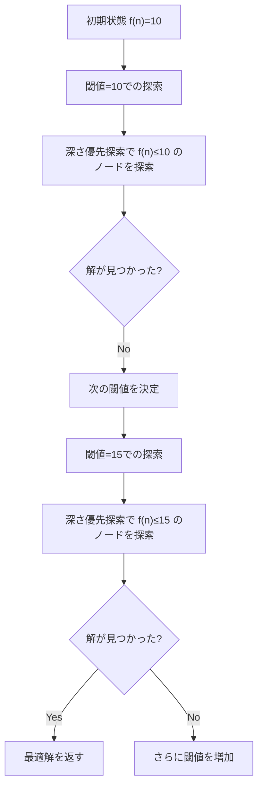
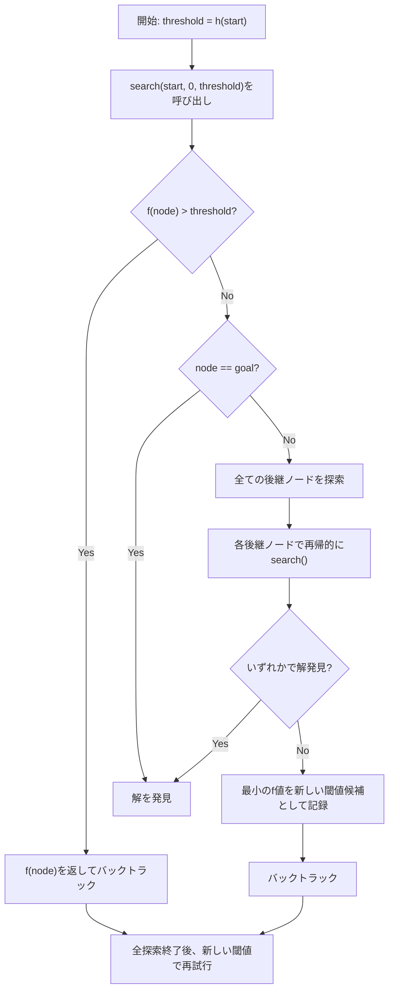
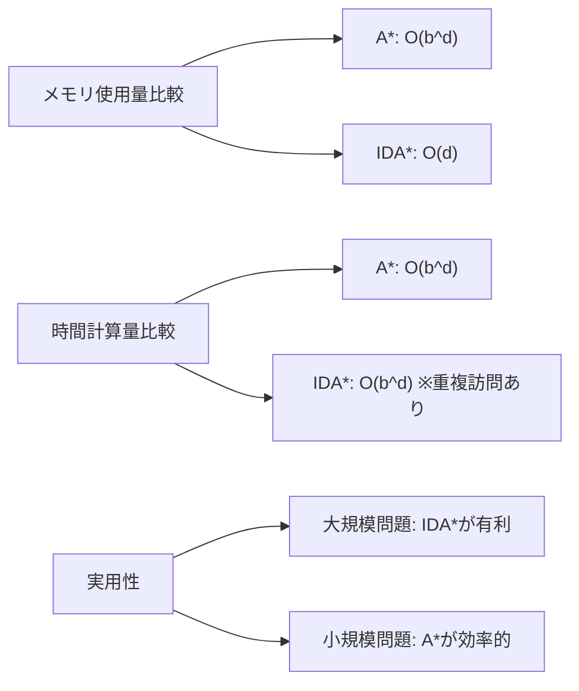
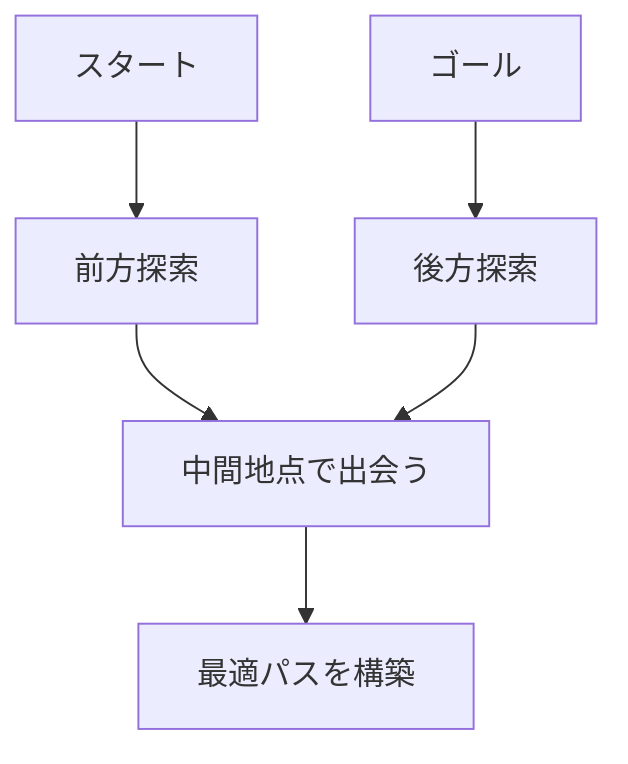

# IDA*アルゴリズム

IDA*（Iterative Deepening A*）アルゴリズムは、1985年にRichard E. Korfによって提案された経路探索アルゴリズムです。このアルゴリズムは、A*アルゴリズムの最適性保証とIterative Deepening深さ優先探索のメモリ効率性を組み合わせたもので、大規模な状態空間における最短経路問題を限られたメモリで解決することを可能にします。

人工知能分野における探索問題では、しばしばメモリ使用量が深刻な制約となります。A*アルゴリズムは最適解を保証する優れた探索手法ですが、探索過程で訪問した全ての状態をメモリに保持する必要があるため、状態空間が指数関数的に増大する問題では実用的でない場合があります。IDA*は、この問題に対する実践的な解決策として、深さ優先探索の特性を活用してメモリ使用量を劇的に削減しながら、ヒューリスティック関数による効率的な探索と最適性の保証を実現します。

## アルゴリズムの基本原理

IDA*の核心的なアイデアは、反復深化（Iterative Deepening）と呼ばれる手法をA*アルゴリズムに適用することです。通常のA*アルゴリズムでは、評価関数f(n) = g(n) + h(n)に基づいて最も有望なノードから優先的に探索を進めますが、IDA*では、この評価値に対する閾値を設定し、その閾値以下のノードのみを深さ優先探索で探索します。



評価関数f(n)は、A*アルゴリズムと同様に、スタートからノードnまでの実際のコストg(n)と、ノードnからゴールまでの推定コストh(n)の和として定義されます。ヒューリスティック関数h(n)が許容的（admissible）、つまり実際のコストを過大評価しない場合、IDA*は最適解を保証します。

各反復において、IDA*は現在の閾値を超えるノードに到達すると、そのパスの探索を打ち切り、バックトラックします。このとき、閾値を超えたノードのf値の最小値を記録し、次の反復の閾値として使用します。この過程を解が見つかるまで繰り返すことで、最終的に最適解に到達します。

## 詳細な実装と動作メカニズム

IDA*の実装は、再帰的な深さ優先探索を基本構造として持ちます。以下に、アルゴリズムの中核となる擬似コードを示します：

```python
def ida_star(start, goal):
    threshold = h(start)  # Initial threshold is the heuristic value of start
    
    while True:
        result, new_threshold = search(start, goal, 0, threshold)
        if result == "FOUND":
            return reconstruct_path()
        if new_threshold == float('inf'):
            return None  # No solution exists
        threshold = new_threshold

def search(node, goal, g_cost, threshold):
    f = g_cost + h(node)
    
    if f > threshold:
        return "NOT_FOUND", f
    
    if node == goal:
        return "FOUND", f
    
    min_threshold = float('inf')
    for successor in get_successors(node):
        if successor not in current_path:  # Avoid cycles
            result, new_threshold = search(successor, goal, 
                                         g_cost + cost(node, successor), 
                                         threshold)
            if result == "FOUND":
                return "FOUND", new_threshold
            min_threshold = min(min_threshold, new_threshold)
    
    return "NOT_FOUND", min_threshold
```

この実装において重要な点は、各ノードの訪問時にそのf値を計算し、現在の閾値と比較することです。閾値を超えた場合、そのノード以下の探索は行わず、即座にバックトラックします。この仕組みにより、メモリには現在の探索パスのみを保持すればよく、O(d)のメモリ使用量で済みます（dは解の深さ）。



サイクル検出は、現在の探索パス上にあるノードを記録することで実現されます。これは、グラフ探索において無限ループを防ぐために不可欠です。ただし、この情報も現在のパスに関するもののみであり、過去の反復で訪問したノードの情報は保持する必要がありません。

## 性能特性と計算量分析

IDA*の時間計算量は、最悪の場合O(b^d)となります（bは分岐係数、dは解の深さ）。これは、各反復で同じノードを複数回訪問する可能性があるためです。しかし、良質なヒューリスティック関数を使用した場合、実際の性能はこの理論的上限よりもはるかに良好です。

メモリ使用量に関しては、IDA*の最大の利点が現れます。A*アルゴリズムがO(b^d)のメモリを必要とするのに対し、IDA*はO(d)のメモリしか使用しません。これは、深さ優先探索の特性により、任意の時点で保持する必要があるのは現在の探索パスのみだからです。



反復回数は、ヒューリスティック関数の品質と問題の構造に大きく依存します。理想的な場合、つまりh(n)が実際のコストに非常に近い場合、IDA*は少数の反復で解を見つけることができます。一方、h(n)が実際のコストを大幅に過小評価する場合、多くの反復が必要となり、同じノードを何度も訪問することになります。

Korfの分析によれば、ヒューリスティック関数が単調（monotonic）である場合、IDA*の期待実行時間は、同じヒューリスティック関数を使用するA*の実行時間の定数倍以内に収まることが示されています¹。この定数は、典型的な問題では2から3程度であることが経験的に知られています。

## A*アルゴリズムとの詳細な比較

A*アルゴリズムとIDA*の本質的な違いは、探索戦略とメモリ管理にあります。A*は最良優先探索（best-first search）を採用し、常に最も有望なノードから探索を進めます。これに対し、IDA*は深さ優先探索をベースとし、閾値による制約の下で探索を行います。

```python
# A* algorithm core structure
def a_star(start, goal):
    open_set = PriorityQueue()
    open_set.put((h(start), start))
    g_score = {start: 0}
    closed_set = set()
    
    while not open_set.empty():
        current = open_set.get()[1]
        if current == goal:
            return reconstruct_path()
        
        closed_set.add(current)
        for neighbor in get_neighbors(current):
            if neighbor in closed_set:
                continue
            tentative_g = g_score[current] + cost(current, neighbor)
            if neighbor not in g_score or tentative_g < g_score[neighbor]:
                g_score[neighbor] = tentative_g
                f = tentative_g + h(neighbor)
                open_set.put((f, neighbor))
    
    return None
```

この実装の違いは、以下のような実践的な影響をもたらします：

1. **メモリ効率**: IDA*は探索パスのみを保持するため、15パズルや24パズルのような大規模な問題でも実行可能です。A*では、これらの問題は利用可能なメモリを超過する可能性があります。

2. **ノードの再展開**: IDA*では、異なる反復で同じノードを複数回訪問する可能性があります。これは時間効率の観点では不利ですが、メモリ制約が厳しい環境では受け入れられるトレードオフです。

3. **解の発見順序**: A*は常に最小コストの解を最初に発見しますが、IDA*は閾値を段階的に増加させるため、複数の解が存在する場合でも最適解を確実に発見します。

## 実践的な最適化手法

IDA*の実装において、いくつかの最適化手法が性能を大幅に改善することができます。

### 移動順序の最適化

後継ノードの生成順序は、探索効率に大きな影響を与えます。ヒューリスティック値が小さい方向への移動を優先することで、より早く解に到達する可能性が高まります：

```python
def get_successors_ordered(node):
    successors = []
    for action in get_possible_actions(node):
        successor = apply_action(node, action)
        successors.append((h(successor), successor))
    
    # Sort by heuristic value
    successors.sort(key=lambda x: x[0])
    return [s[1] for s in successors]
```

### 双方向IDA*

スタートとゴールの両方から探索を行う双方向IDA*は、特定の問題において探索空間を大幅に削減できます：



双方向探索では、前方と後方の探索が出会った時点で、そのパスが最適であることを確認する必要があります。これは、両方向の探索で使用される閾値と、出会った地点でのコストを慎重に管理することで実現されます。

### パターンデータベース

パターンデータベースは、部分問題の最適解を事前計算して保存しておく手法です。これにより、より正確なヒューリスティック値を高速に計算できます：

```python
class PatternDatabase:
    def __init__(self, pattern):
        self.pattern = pattern
        self.database = self._build_database()
    
    def _build_database(self):
        # Backward search from goal patterns
        database = {}
        queue = deque([(self.goal_pattern, 0)])
        
        while queue:
            state, cost = queue.popleft()
            if state in database:
                continue
            database[state] = cost
            
            for predecessor in get_predecessors(state):
                if predecessor not in database:
                    queue.append((predecessor, cost + 1))
        
        return database
    
    def get_heuristic(self, state):
        pattern_state = extract_pattern(state, self.pattern)
        return self.database.get(pattern_state, 0)
```

## メモリ制約環境での実装考慮事項

組み込みシステムやリソース制約のある環境でIDA*を実装する際には、さらなる最適化が必要です。スタックサイズの制限により、再帰的実装が不可能な場合があります。このような場合、明示的なスタックを使用した反復的実装が有効です：

```python
def ida_star_iterative(start, goal):
    threshold = h(start)
    
    while True:
        stack = [(start, 0, None)]  # (node, g_cost, parent)
        min_threshold = float('inf')
        
        while stack:
            node, g_cost, parent = stack.pop()
            f = g_cost + h(node)
            
            if f > threshold:
                min_threshold = min(min_threshold, f)
                continue
            
            if node == goal:
                return reconstruct_path_from_stack(stack, parent)
            
            # Add successors in reverse order for correct exploration
            successors = get_successors(node)
            for i in range(len(successors) - 1, -1, -1):
                successor = successors[i]
                if not creates_cycle(successor, parent):
                    stack.append((successor, 
                                g_cost + cost(node, successor), 
                                node))
        
        if min_threshold == float('inf'):
            return None
        threshold = min_threshold
```

この実装では、Python の組み込みリストをスタックとして使用していますが、固定サイズの配列を使用することで、メモリ割り当てのオーバーヘッドをさらに削減できます。

## 並列化の可能性と実装

IDA*の構造は、特定のレベルでの並列化を可能にします。各反復内で、異なる部分木を独立して探索できるため、マルチコアシステムでの性能向上が期待できます：

```python
from concurrent.futures import ProcessPoolExecutor, as_completed

def parallel_ida_star(start, goal, num_workers=4):
    threshold = h(start)
    
    while True:
        with ProcessPoolExecutor(max_workers=num_workers) as executor:
            initial_successors = get_successors(start)
            futures = []
            
            for successor in initial_successors:
                future = executor.submit(
                    search_subtree, 
                    successor, 
                    goal, 
                    cost(start, successor), 
                    threshold
                )
                futures.append(future)
            
            min_threshold = float('inf')
            for future in as_completed(futures):
                result, new_threshold = future.result()
                if result == "FOUND":
                    return reconstruct_path()
                min_threshold = min(min_threshold, new_threshold)
        
        if min_threshold == float('inf'):
            return None
        threshold = min_threshold
```

ただし、並列化のオーバーヘッドと探索の重複を考慮する必要があります。小規模な問題では、並列化による利益よりもオーバーヘッドが大きくなる可能性があります。

## 実世界での応用例と性能評価

IDA*は、様々な実世界の問題で成功を収めています。特に有名な応用例として、スライディングパズル（8パズル、15パズル、24パズル）の解法があります。Korfは、マンハッタン距離ヒューリスティックを使用したIDA*により、15パズルの任意のインスタンスを平均的なデスクトップコンピュータで数秒以内に解けることを示しました²。

経路計画問題においても、IDA*は重要な役割を果たしています。グリッドベースの地図上での最短経路探索では、障害物が多く、メモリが制限される環境で特に有効です：

```python
def grid_pathfinding_heuristic(pos1, pos2):
    # Octile distance for 8-directional movement
    dx = abs(pos1[0] - pos2[0])
    dy = abs(pos1[1] - pos2[1])
    return (dx + dy) + (math.sqrt(2) - 2) * min(dx, dy)
```

ゲームAIの分野では、IDA*はチェスの終盤データベース生成や、リアルタイムストラテジーゲームでのユニット経路探索に使用されています。特に、多数のユニットが同時に経路を探索する必要がある場合、各ユニットがIDA*を使用することで、全体のメモリ使用量を抑えることができます。

## アルゴリズムの限界と代替手法

IDA*には、特定の問題構造において効率が低下するという限界があります。特に、ヒューリスティック関数の精度が低い場合や、解への経路が多数存在する場合、同じノードを非常に多くの回数訪問することになります。

この問題に対処するため、いくつかの変種が提案されています：

**RBFS（Recursive Best-First Search）**: IDA*の再訪問問題を軽減するため、各ノードで兄弟ノードの最良のf値を記憶します。これにより、不必要な再展開を減らすことができますが、若干のメモリオーバーヘッドが発生します³。

**MA*（Memory-Bounded A*）**: 利用可能なメモリを最大限活用し、メモリが不足した場合のみ最も見込みの低いノードを削除します。これは、IDA*とA*の中間的なアプローチと言えます。

**Fringe Search**: 反復深化の考え方を、より効率的なデータ構造で実装したアルゴリズムです。現在の反復で訪問すべきノードのリスト（fringe）を保持し、次の反復ではこのリストから開始します⁴。

## 理論的基盤と証明

IDA*の最適性の証明は、A*の最適性証明と同様の原理に基づいています。許容的ヒューリスティックを使用する場合、以下の性質が成り立ちます：

**定理**: h(n) ≤ h*(n)（h*(n)はノードnから目標までの実際の最小コスト）である許容的ヒューリスティックを使用する場合、IDA*は最適解を返す。

**証明の概略**: 最適解のコストをC*とする。IDA*の各反復では、閾値がC*に達するまで、最適解は発見されない。閾値がC*以上になった最初の反復で、最適パス上の全てのノードのf値はC*以下となるため、このパスは完全に探索される。許容的ヒューリスティックの性質により、より高いコストの解が先に発見されることはない。

この証明は、IDA*が最悪でもA*と同じ解の品質を保証することを示しています。実際、両アルゴリズムは同じヒューリスティック関数を使用する限り、同じ最適解を発見します。

---

¹ Korf, R. E. (1985). "Depth-first iterative-deepening: An optimal admissible tree search". Artificial Intelligence, 27(1), 97-109.

² Korf, R. E. (1999). "Recent progress in the application of artificial intelligence algorithms to the traveling salesman problem". AAAI/IAAI, 312-316.

³ Korf, R. E. (1993). "Linear-space best-first search". Artificial Intelligence, 62(1), 41-78.

⁴ Björnsson, Y., Enzenberger, M., Holte, R. C., & Schaeffer, J. (2005). "Fringe search: Beating A* at pathfinding on game maps". Proceedings of the 2005 IEEE Symposium on Computational Intelligence and Games, 125-132.