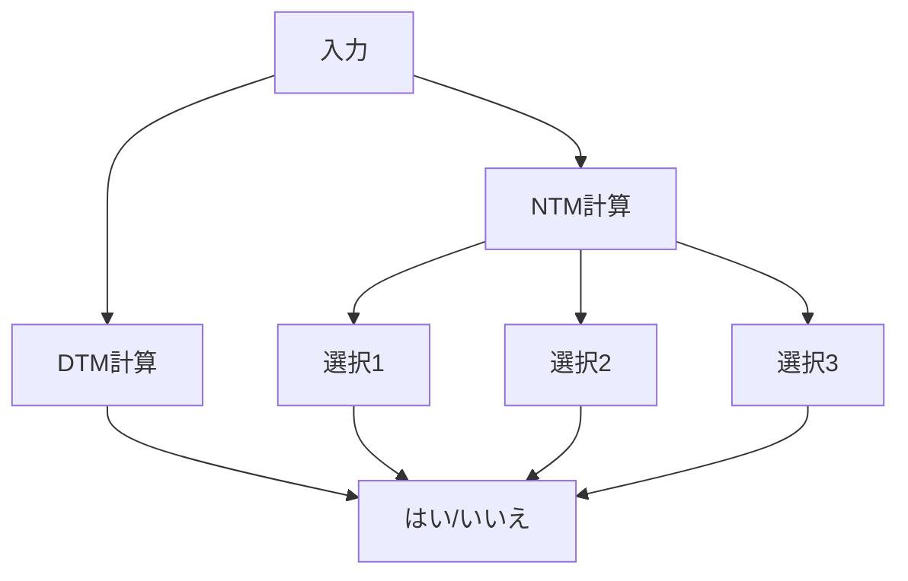
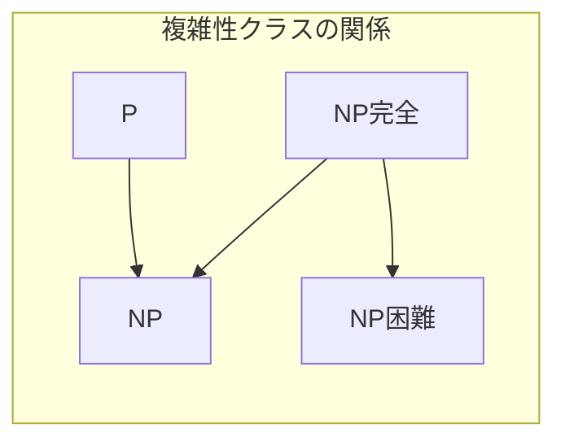
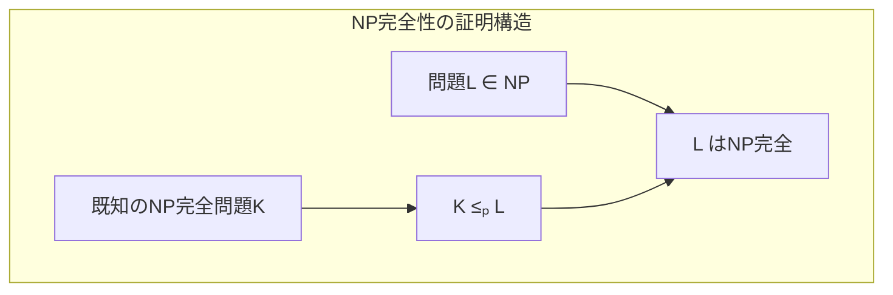
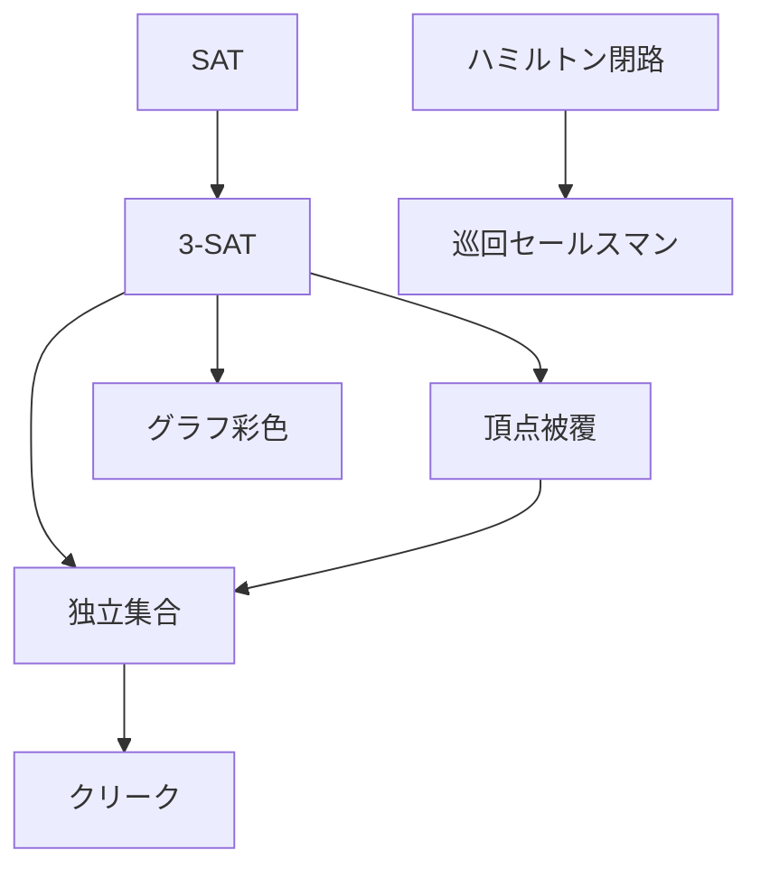
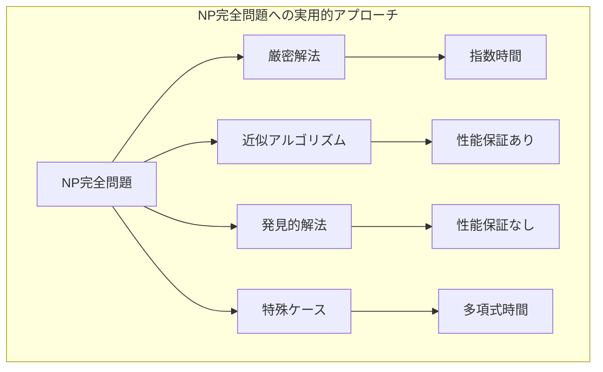

# NP完全

計算複雑性理論において、NP完全（NP-complete）は問題の困難さを分類する最も重要な概念の一つである。1971年にStephen Cookによって導入され[^1]、その後Richard Karpによって多くの実用的な問題がNP完全であることが示された[^2]。NP完全問題は、効率的な解法が存在するかどうかが未解決の問題群であり、その解決は計算機科学における最重要課題の一つとなっている。

NP完全性を理解するためには、まず計算複雑性理論の基本的な枠組みを理解する必要がある。計算複雑性理論は、問題の本質的な難しさを数学的に定式化し、異なる問題間の関係を明らかにする理論体系である。この理論では、問題を解くのに必要な計算資源（主に時間と空間）に基づいて問題を分類する。

## 決定問題と計算モデル

NP完全性を議論する際は、決定問題（decision problem）に焦点を当てる。決定問題とは、任意の入力に対して「はい」または「いいえ」で答える問題である。例えば、「与えられたグラフは3色で彩色可能か」という問題は決定問題である。最適化問題（「最小の彩色数は何か」）も、二分探索を用いることで決定問題に帰着できるため、決定問題の研究は一般性を失わない。

計算モデルとしては、決定性チューリング機械（Deterministic Turing Machine, DTM）と非決定性チューリング機械（Nondeterministic Turing Machine, NTM）を考える。DTMは通常のコンピュータに相当し、各計算ステップで次の状態が一意に決まる。一方、NTMは各ステップで複数の選択肢から「非決定的に」選択できる仮想的な計算モデルである。

## 複雑性クラスPとNP

複雑性クラスP（Polynomial time）は、DTMで多項式時間で解ける決定問題の集合である。形式的には、ある多項式p(n)が存在して、長さnの任意の入力に対してO(p(n))時間で正しく判定できる問題の集合がPである。例えば、ソートされた配列での二分探索（O(log n)）、グラフの連結性判定（O(n + m)）、行列の乗算（O(n³)）などはPに属する。

複雑性クラスNP（Nondeterministic Polynomial time）は、NTMで多項式時間で解ける決定問題の集合である。より実用的な定義として、NPは「はい」の答えを持つ入力に対して、多項式時間で検証可能な証拠（certificate）が存在する問題の集合である。この証拠を検証する多項式時間アルゴリズムを検証器（verifier）と呼ぶ。

例えば、グラフの3彩色問題を考える。与えられたグラフが3彩色可能かどうかを判定する問題はNPに属する。なぜなら、実際の彩色（各頂点への色の割り当て）が与えられれば、それが正しい3彩色であることを多項式時間で検証できるからである。検証は、すべての辺について両端の頂点が異なる色であることを確認するだけでよく、O(m)時間で可能である（mは辺数）。

PとNPの関係は計算複雑性理論の中心的な問題である。明らかにP ⊆ NPである（DTMで解ける問題はNTMでも解ける）が、P = NPかP ≠ NPかは未解決である。これがミレニアム懸賞問題の一つであるP対NP問題である[^3]。

## 多項式時間還元

NP完全性を定義するために、多項式時間還元（polynomial-time reduction）の概念が必要である。問題Aから問題Bへの多項式時間還元とは、Aの任意のインスタンスを多項式時間でBのインスタンスに変換する関数fで、元のインスタンスが「はい」であることと変換後のインスタンスが「はい」であることが同値になるものである。これをA ≤ₚ Bと表記する。

還元の直感的な意味は、「問題Aは問題Bより易しい（または同程度に難しい）」ということである。なぜなら、Bを解くアルゴリズムがあれば、還元を通じてAも解けるからである。還元は推移的であり、A ≤ₚ BかつB ≤ₚ CならばA ≤ₚ Cである。

例として、頂点被覆問題（Vertex Cover）から独立集合問題（Independent Set）への還元を考える。頂点被覆問題は「グラフGと整数kが与えられたとき、k個以下の頂点で全ての辺をカバーできるか」を問う。独立集合問題は「グラフGと整数kが与えられたとき、k個以上の頂点からなる独立集合（どの2頂点も隣接しない頂点集合）が存在するか」を問う。

この還元は次のように構成される：グラフGと整数kに対して、同じグラフGと整数n-k（nは頂点数）を独立集合問題のインスタンスとする。この変換は明らかに多項式時間（実際にはO(1)時間）で実行できる。そして、Gがサイズk以下の頂点被覆を持つことと、Gがサイズn-k以上の独立集合を持つことは同値である。なぜなら、頂点集合Sが頂点被覆であることと、その補集合V-Sが独立集合であることが同値だからである。

## NP困難とNP完全

問題LがNP困難（NP-hard）であるとは、NPに属するすべての問題がLに多項式時間還元可能であることを意味する。形式的には、任意のA ∈ NPに対してA ≤ₚ Lが成り立つときLはNP困難である。NP困難な問題は、NPの中で最も難しい問題と同程度以上に難しいことを意味する。

問題LがNP完全（NP-complete）であるとは、LがNPに属し、かつNP困難であることを意味する。つまり、NP完全問題はNPの中で最も難しい問題である。重要な性質として、もし一つでもNP完全問題が多項式時間で解ければ、すべてのNP問題が多項式時間で解けることになり、P = NPが成立する。

## Cook-Levin定理とSAT問題

最初のNP完全問題は、Stephen Cookによって1971年に示された充足可能性問題（SAT）である[^1]。独立にLeonid Levinも同様の結果を得ていたため、Cook-Levin定理と呼ばれる。SAT問題は、ブール変数の論理式が与えられたとき、その式を真にする変数への真理値割り当てが存在するかを判定する問題である。

Cook-Levin定理の証明の核心は、任意のNTMの計算を論理式として符号化することである。長さnの入力に対して多項式時間p(n)で動作するNTMを考える。このNTMの計算過程は、各時刻における状態、テープの内容、ヘッドの位置を表す変数を用いて論理式として表現できる。この論理式は、初期状態の制約、遷移規則の制約、受理状態の制約を連言で結んだものとなる。

論理式のサイズは計算時間の多項式となり、元のNTMが入力を受理することと、構成された論理式が充足可能であることが同値になる。これにより、任意のNP問題からSATへの多項式時間還元が存在することが示され、SATがNP困難であることが証明される。SATがNPに属することは明らかである（真理値割り当てが証拠となる）ため、SATはNP完全である。

## 代表的なNP完全問題

Cook-Levin定理によってSATがNP完全であることが示されると、他の問題のNP完全性は還元によって証明できる。Richard Karpは1972年に21個の重要な組合せ問題がNP完全であることを示した[^2]。これらの問題は実用上も重要であり、NP完全性理論の実践的意義を明確にした。

3-SATはSATの特殊な場合で、各節（clause）がちょうど3個のリテラル（変数またはその否定）の論理和である連言標準形（CNF）の充足可能性を判定する。例えば、(x₁ ∨ ¬x₂ ∨ x₃) ∧ (¬x₁ ∨ x₂ ∨ x₄) ∧ (x₁ ∨ ¬x₃ ∨ ¬x₄)という形式の論理式である。SATから3-SATへの還元は、長い節を補助変数を用いて分割することで実現される。例えば、(x₁ ∨ x₂ ∨ x₃ ∨ x₄)という4リテラルの節は、補助変数yを導入して(x₁ ∨ x₂ ∨ y) ∧ (¬y ∨ x₃ ∨ x₄)と変換できる。

グラフ彩色問題は、与えられたグラフの頂点をk色で彩色できるか（隣接する頂点が異なる色になるように）を判定する。k=2の場合は二部グラフ判定と等価であり、幅優先探索でO(n + m)時間で解ける。しかし、k≥3の場合はNP完全である。3-SATからの還元では、変数ガジェット（変数xに対して頂点xとx̄を作り、それらを辺で結ぶ）、節ガジェット（節の3つのリテラルに対応する頂点を三角形に結ぶ）、一貫性ガジェット（変数ガジェットと節ガジェットを適切に接続）を構成する。

巡回セールスマン問題（TSP）の決定版は、重み付き完全グラフと閾値Bが与えられたとき、総重みB以下のハミルトン閉路が存在するかを判定する。ハミルトン閉路問題（すべての頂点をちょうど一度ずつ通る閉路の存在判定）からの還元は、ハミルトン閉路が存在する場合は重み1、存在しない場合は重み2の辺を持つ完全グラフを構成することで行われる。

頂点被覆問題は、グラフのすべての辺を「カバー」する（少なくとも一方の端点を含む）頂点集合の最小サイズを求める問題の決定版である。3-SATからの還元では、各変数に対して2頂点（xとx̄）を作り、各節に対して3頂点の三角形を作る。変数の真偽値選択が頂点被覆での頂点選択に対応するように辺を追加する。

クリーク問題は、k個の頂点が互いに隣接している部分グラフ（クリーク）の存在を判定する。独立集合問題とは補グラフの関係にあり、グラフGにサイズkの独立集合が存在することと、Gの補グラフにサイズkのクリークが存在することは同値である。

部分和問題（Subset Sum）は、整数の集合Sと目標値tが与えられたとき、Sの部分集合で和がtになるものが存在するかを判定する。3-SATからの還元では、各変数と節に対応する巧妙に設計された整数を用いる。この問題は動的計画法でO(nt)時間で解けるが、tが指数的に大きい場合があるためNP完全である。

分割問題（Partition）は、整数の集合を同じ和を持つ2つの部分集合に分割できるかを判定する。部分和問題の特殊なケースであり、全体の和の半分を目標値とする部分和問題に帰着できる。

ビンパッキング問題の決定版は、サイズの異なるアイテムを容量Cのビンk個以内に詰め込めるかを判定する。分割問題からの還元により、NP完全であることが示される。この問題は、コンテナへの荷物の積み込みやメモリ管理など、実用的な応用が多い。

ナップサック問題は、アイテムの集合と容量が与えられたとき、価値の合計が閾値以上となるように容量内でアイテムを選択できるかを判定する。この問題は擬多項式時間アルゴリズム（動的計画法でO(nW)、Wは容量）を持つが、入力サイズの多項式時間ではないためNP完全である。

## NP完全性の証明技法

新しい問題のNP完全性を証明する標準的な方法は、既知のNP完全問題からの還元を構成することである。還元の設計には創造性が必要だが、いくつかの一般的な技法が存在する。

ガジェット構成法は、元の問題の各要素に対応する部分グラフや論理式の断片（ガジェット）を設計し、それらを組み合わせて還元先の問題のインスタンスを構成する方法である。具体例として、3-SATから3彩色への還元を詳しく見てみよう。

まず、パレットと呼ばれる三角形を作る。この三角形の3頂点をT（真）、F（偽）、B（基底）と呼び、3色で彩色する際、必ず異なる色になる。各変数xᵢに対して、2頂点xᵢとx̄ᵢを作り、両方をBに接続する。これにより、xᵢとx̄ᵢは異なる色（TまたはF）に彩色され、変数の真偽値割り当てを表現する。

各節(ℓᵢ ∨ ℓⱼ ∨ ℓₖ)に対しては、6頂点からなる節ガジェットを構成する。このガジェットは、3つのリテラル頂点の少なくとも1つがT色でないと3彩色不可能になるように設計される。具体的には、節の内部に補助頂点を配置し、適切な辺で接続することで、すべてのリテラルがF色の場合のみ彩色が破綻するようにする。

局所置換法は、問題の構造を保ちながら要素を置き換える方法である。有向グラフのハミルトン路から無向グラフのハミルトン路への還元では、各頂点vを3頂点vᵢₙ、v、vₒᵤₜに置換する。有向辺(u,v)は、uₒᵤₜとvᵢₙを結ぶ経路で置換される。この構成により、元の有向グラフにハミルトン路が存在することと、構成された無向グラフにハミルトン路が存在することが同値になる。

成分設計法の詳細な例として、3-SATから頂点被覆への還元を考える。変数成分として、各変数xᵢに対して辺(xᵢ, x̄ᵢ)を作る。節成分として、各節Cⱼ = (ℓᵢ ∨ ℓⱼ ∨ ℓₖ)に対して三角形を作る。そして、節の各頂点を対応するリテラル頂点に接続する。頂点被覆のサイズをn + 2m（nは変数数、mは節数）とすると、3-SAT式が充足可能であることと、このサイズの頂点被覆が存在することが同値になる。

## 具体的な還元の詳細：3-SATから頂点被覆

3-SATから頂点被覆への還元を完全に理解するため、具体例を通じて構成を追ってみよう。3-SAT式φ = (x₁ ∨ ¬x₂ ∨ x₃) ∧ (¬x₁ ∨ x₂ ∨ ¬x₃)を考える。

構成されるグラフGは以下の要素を持つ：
- 変数ガジェット：辺(x₁, x̄₁)、(x₂, x̄₂)、(x₃, x̄₃)
- 節ガジェット：2つの三角形C₁、C₂
- 接続辺：C₁の頂点をx₁、x̄₂、x₃に接続、C₂の頂点をx̄₁、x₂、x̄₃に接続

頂点被覆のサイズはk = 3 + 2×2 = 7とする。φが充足可能な場合、例えばx₁=真、x₂=偽、x₃=真という割り当てでは、頂点被覆として{x₁, x̄₂, x₃}（変数ガジェットから）と各三角形から2頂点ずつを選ぶ。逆に、サイズ7の頂点被覆が存在する場合、変数ガジェットから各辺につき1頂点、各三角形から2頂点を選ぶ必要がある。三角形の3辺をカバーするには少なくとも2頂点必要で、ちょうど2頂点の場合、カバーされない頂点が1つ残る。この頂点に接続する変数頂点は必ず頂点被覆に含まれており、それが真のリテラルに対応する。

## 強NP完全性と擬多項式時間アルゴリズム

NP完全問題の中でも、さらに細かい分類が可能である。問題に現れる数値を一進表記したときの入力サイズに関してもNP完全である問題を強NP完全（strongly NP-complete）と呼ぶ。3-分割問題（整数の集合を同じ和を持つ3要素の部分集合に分割する問題）は強NP完全の代表例である。

一方、ナップサック問題のように、数値の大きさの多項式時間で解ける問題は弱NP完全と呼ばれる。これらの問題に対しては、擬多項式時間アルゴリズム（pseudo-polynomial time algorithm）が存在する。動的計画法によるナップサック問題の解法はO(nW)時間だが、Wを二進表記したときのビット数に関しては指数時間となる。

強NP完全性は実用上重要な概念である。なぜなら、強NP完全問題に対しては、入力の数値が小さい場合でも効率的なアルゴリズムが期待できないからである。一方、弱NP完全問題は、実用的な範囲の数値に対しては効率的に解ける可能性がある。

## 近似アルゴリズムと発見的解法

NP完全問題が多項式時間で厳密に解けないと仮定すると、実用的なアプローチとして近似アルゴリズムや発見的解法が重要になる。近似アルゴリズムは、最適解の定数倍以内の解を多項式時間で見つけることを保証する。

頂点被覆問題に対する2-近似アルゴリズムは、極大マッチングを求めてその端点をすべて選ぶという単純な方法である。任意の頂点被覆は極大マッチングの各辺から少なくとも一つの端点を含む必要があるため、このアルゴリズムは最適解の2倍以下の解を出力する。

一方、一般のTSPに対しては、P ≠ NPの仮定の下で、任意の定数近似比を達成する多項式時間アルゴリズムが存在しないことが証明されている。しかし、三角不等式を満たすメトリックTSPに対しては、最小全域木を用いた2-近似アルゴリズムやChristofides-Serdukovアルゴリズムによる1.5-近似が可能である。

発見的解法は理論的な性能保証はないが、実用的に良い解を高速に見つけることを目指す。SATソルバーは、DPLL（Davis-Putnam-Logemann-Loveland）アルゴリズムやCDCL（Conflict-Driven Clause Learning）などの洗練された探索技術により、数百万変数規模の問題を実用的な時間で解くことができる。

局所探索、遺伝的アルゴリズム、アニーリング法などのメタヒューリスティクスも、NP完全問題に対する実用的なアプローチである。これらの手法は、問題の構造を活用して効率的に解空間を探索する。

## パラメータ化計算量

NP完全問題に対する別のアプローチとして、パラメータ化計算量理論がある。この理論では、問題の特定のパラメータkに関して、f(k)·nᴼ⁽¹⁾時間で解けるアルゴリズム（固定パラメータ扱い可能、FPT）の存在を研究する。

頂点被覆問題は、被覆のサイズkをパラメータとしたときFPTである。探索木アルゴリズムにより、O(2ᵏ·n)時間で解ける。一方、クリーク問題はW[1]-完全であり、FPTアルゴリズムの存在は期待できない（パラメータ化計算量理論における基本的な仮定の下で）。

カーネル化（kernelization）は、前処理により問題のサイズをパラメータの関数まで削減する技術である。頂点被覆問題では、次数が k より大きい頂点は必ず被覆に含まれることを利用して、O(k²)サイズのカーネルを多項式時間で構成できる。

## 量子計算とNP完全問題

量子コンピュータの登場により、NP完全問題に対する新しいアプローチが研究されている。しかし、現在のところ、量子コンピュータがNP完全問題を効率的に解けるという証拠はない。実際、量子計算の計算量クラスBQP（Bounded-error Quantum Polynomial time）とNPの関係は未解明である。

Groverのアルゴリズムは、n個の要素から特定の要素を見つける問題をO(√n)時間で解く。これをSATに適用すると、n変数のSATをO(2^(n/2))時間で解けるが、これは古典的な総当たりの平方根の改善に過ぎない。

量子アニーリングは、組合せ最適化問題を物理系の基底状態探索として解くアプローチである。D-Waveなどの量子アニーリングマシンは、特定のNP完全問題に対して実用的な性能を示すことがあるが、理論的な優位性は確立されていない。

## 平均時計算量と現実的な困難性

NP完全性は最悪時計算量に基づく概念だが、実用上は平均的な場合の計算量も重要である。多くのNP完全問題は、ランダムインスタンスに対しては効率的に解ける場合がある。

ランダム3-SATでは、節数mと変数数nの比α = m/n（節密度）が重要なパラメータとなる。α < 4.26の場合、高確率で充足可能であり、単純な探索アルゴリズムでも効率的に解ける。一方、α > 4.26では急激に充足不可能になる。この閾値αc ≈ 4.26は相転移点と呼ばれ、統計物理学の手法を用いて解析されている[^4]。相転移近傍のインスタンスは、充足可能性の判定が最も困難であることが知られている。

実際のSATソルバーの性能は、この理論的な困難性と必ずしも一致しない。現代的なSATソルバー（MiniSat、Glucose、CryptoMiniSatなど）は、構造を持つ実用的なインスタンスに対して驚くほど効率的である。これらのソルバーは、節学習（clause learning）、変数選択ヒューリスティック、再始動戦略などの高度な技術を組み合わせている。

暗号理論では、NP完全問題の平均的困難性に基づく暗号系の構成が長年研究されてきた。しかし、ナップサック暗号のように、当初安全と考えられていたシステムが後に破られる例が多い。問題は、暗号学的に必要な「一方向性」と「落とし戸」の性質を、NP完全性から直接導出できないことにある。現在では、格子問題や符号理論に基づく問題など、より構造的な困難性を持つ問題が暗号学的応用に使われている。

## 実際のソフトウェア開発におけるNP完全問題

ソフトウェア開発の現場では、NP完全問題は様々な形で現れる。これらの問題を認識し、適切に対処することは、実用的なシステムを構築する上で重要である。

コンパイラ最適化において、レジスタ割り当て問題はグラフ彩色問題として定式化される。変数を頂点、同時に生存する変数間に辺を持つ干渉グラフを構成し、k個のレジスタで彩色可能かを判定する。実用的なコンパイラは、Chaitinのアルゴリズムのような発見的手法を用いて、多くの場合で良好な割り当てを見つける。

データベースのクエリ最適化では、結合順序の決定がNP困難な問題となる。n個のテーブルの結合順序はn!通りあり、動的計画法でもO(2ⁿ)の計算量となる。実用的なオプティマイザは、貪欲法、遺伝的アルゴリズム、シミュレーテッドアニーリングなどの手法を組み合わせて、準最適な実行計画を高速に生成する。

配送経路最適化は典型的なTSP/VRP（Vehicle Routing Problem）の応用である。Amazon、UPS、FedExなどの物流企業は、数千から数万の配送先を持つ問題を日々解いている。実用的なソルバーは、局所探索、メタヒューリスティクス、分枝限定法を組み合わせ、制約条件（時間枠、車両容量、ドライバーの労働時間）を考慮しながら、実用的な時間で良質な解を生成する。

クラウドコンピューティングにおけるリソース割り当ても、本質的にはビンパッキング問題である。仮想マシンを物理サーバに配置する際、CPU、メモリ、ネットワーク帯域などの多次元リソースを考慮する必要がある。KubernetesやOpenStackなどのオーケストレーターは、様々なヒューリスティックを用いてリアルタイムでリソース配置を決定している。

## 最新の研究動向と実用的発展

NP完全性の研究は、理論と実践の両面で継続的に発展している。特に21世紀に入ってからは、大規模データと機械学習の発展により、新しいアプローチが生まれている。

機械学習を用いたNP完全問題の解法は、近年注目を集めている分野である。グラフニューラルネットワーク（GNN）を用いたTSPソルバーや、強化学習によるSATソルバーの変数選択戦略の学習などが研究されている。これらの手法は、問題の構造を学習し、従来のアルゴリズムでは見逃されがちなパターンを発見できる可能性がある。

並列・分散アルゴリズムの発展により、NP完全問題の実用的な解法も進化している。SATソルバーの並列化（ManySAT、HordeSATなど）では、異なる探索戦略を持つ複数のソルバーが協調して動作し、学習した節を共有することで、単一のソルバーよりも高速に解を見つける。クラウド環境では、数千コアを使った大規模並列探索も現実的になっている。

近似アルゴリズムの理論も継続的に発展している。例えば、巡回セールスマン問題に対するChristofides-Serdukovアルゴリズムの1.5近似は40年以上改善されていなかったが、2020年にKarlinらによって僅かながら改善された[^5]。このような理論的進展は、実用アルゴリズムの改良にもつながる可能性がある。

## 実装における考慮事項

NP完全問題を扱うソフトウェアを実装する際には、いくつかの重要な考慮事項がある。

インスタンスサイズの見積もりは重要である。問題がNP完全であっても、実用的なインスタンスサイズが小さければ、厳密解法が使える場合がある。例えば、20変数程度のSAT問題なら、2²⁰ ≈ 100万の全探索も現実的である。一方、変数が100を超えると、高度な探索技術が必須となる。

前処理と問題の簡約化は、多くの場合で劇的な効果を持つ。SATソルバーにおける単位伝播（unit propagation）、純リテラル除去（pure literal elimination）、包摂除去（subsumption elimination）などの前処理により、問題サイズを大幅に削減できることがある。グラフ問題では、次数1の頂点の除去、橋の検出、強連結成分分解などの前処理が有効である。

インクリメンタルな解法も実用上重要である。多くのアプリケーションでは、似た問題を繰り返し解く必要がある。前回の解や探索情報を再利用することで、大幅な高速化が可能である。インクリメンタルSATソルバーは、制約の追加・削除に対して効率的に対応できる。

## 教育的観点からのNP完全性

NP完全性の概念は、計算機科学教育においても重要な役割を果たす。アルゴリズムの限界を理解し、現実的な問題解決能力を養う上で、NP完全性の理解は不可欠である。

学部教育では、NP完全性は通常、アルゴリズム論やオートマトン理論の講義で扱われる。重要なのは、単に定義を暗記するのではなく、還元の構成を通じて問題の本質的な困難さを理解することである。実際に簡単な還元（例：3-SATから頂点被覆）を手で構成する演習は、理解を深める上で有効である。

大学院レベルでは、より高度なトピック（近似アルゴリズム、パラメータ化計算量、平均時計算量）が扱われる。また、実際の研究では、新しい問題のNP完全性を証明したり、既存の問題に対する新しいアルゴリズムを開発したりする能力が求められる。

産業界では、NP完全性の知識は、実装の前に問題の本質を理解し、適切なアプローチを選択する上で重要である。「この問題はNP完全だから解けない」という諦めではなく、「NP完全だが、どのようなアプローチが実用的か」という建設的な思考が求められる。

[^1]: Cook, S. A. (1971). "The complexity of theorem-proving procedures". Proceedings of the 3rd Annual ACM Symposium on Theory of Computing. pp. 151–158.

[^2]: Karp, R. M. (1972). "Reducibility among combinatorial problems". In Miller, R. E.; Thatcher, J. W. (eds.). Complexity of Computer Computations. Plenum. pp. 85–103.

[^3]: Clay Mathematics Institute. "P vs NP Problem". Millennium Prize Problems.

[^4]: Mézard, M., Parisi, G., & Zecchina, R. (2002). "Analytic and algorithmic solution of random satisfiability problems". Science, 297(5582), 812-815.

[^5]: Karlin, A. R., Klein, N., & Gharan, S. O. (2021). "A (slightly) improved approximation algorithm for metric TSP". Proceedings of the 53rd Annual ACM SIGACT Symposium on Theory of Computing. pp. 32-45.