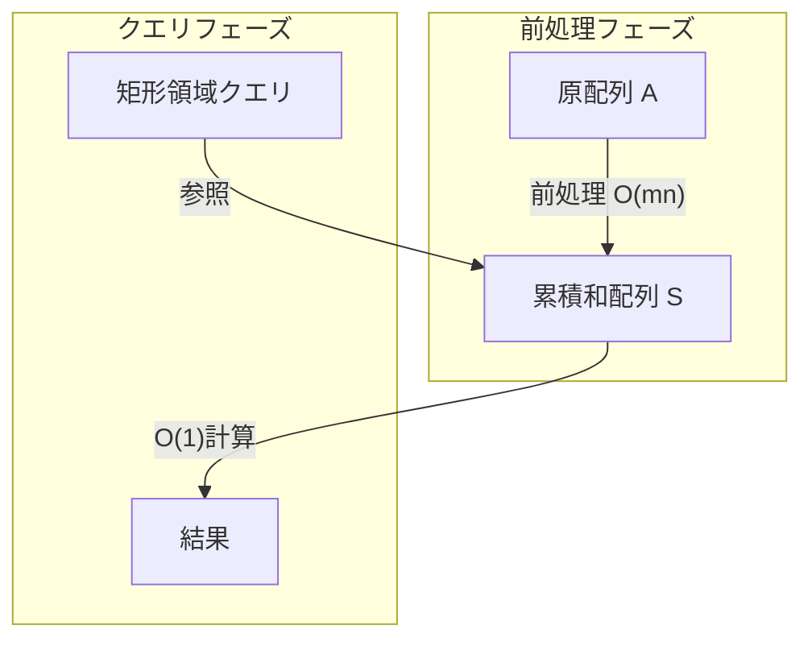
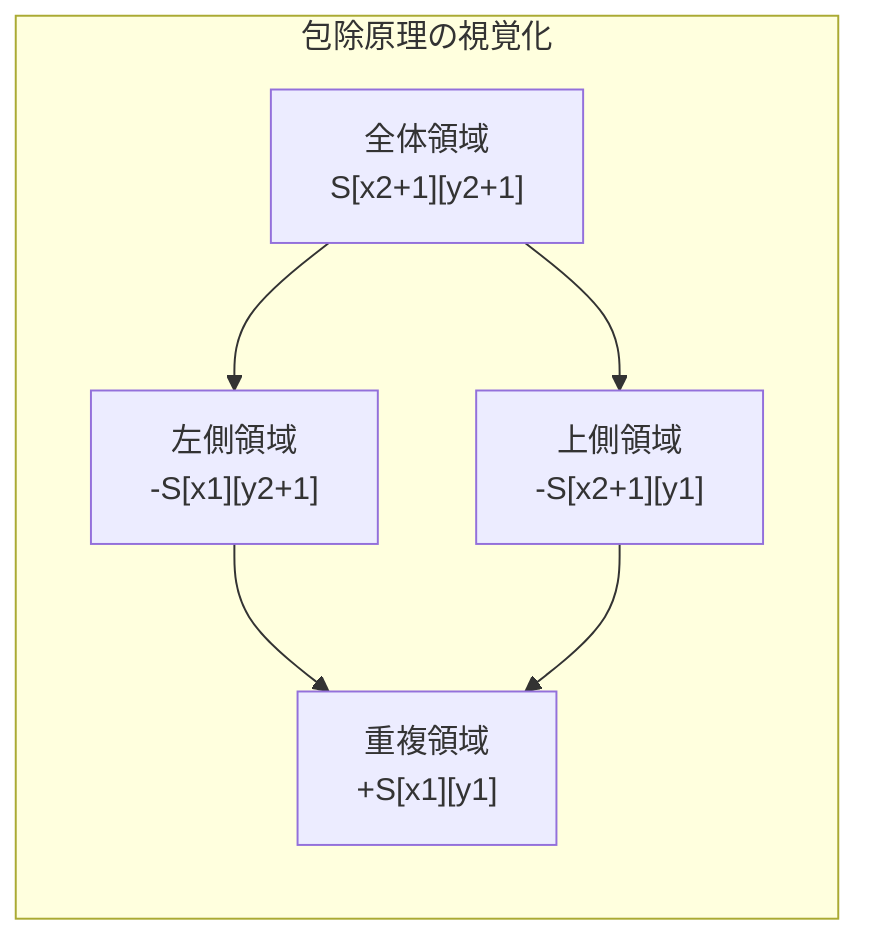
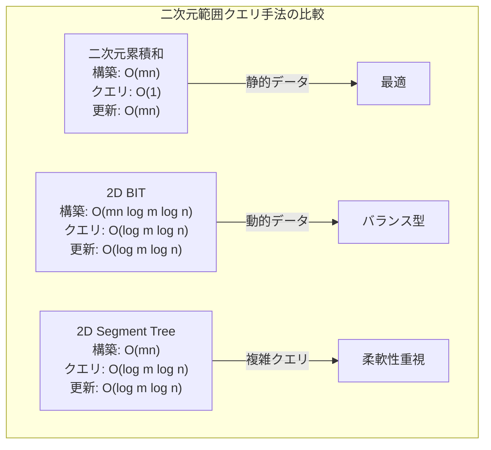

# 二次元累積和

二次元累積和は、二次元配列における任意の矩形領域の総和を高速に計算するためのデータ構造およびアルゴリズムである。一次元累積和の自然な拡張として位置づけられ、特に画像処理、競技プログラミング、数値計算などの分野で広く活用されている。本稿では、二次元累積和の数学的基礎から実装上の詳細、そして応用に至るまでを体系的に論じる。

## 基本概念と定義

二次元累積和を理解するためには、まず一次元累積和の概念を二次元空間に拡張する過程を把握することが重要である。$m \times n$の二次元配列$A$が与えられたとき、その累積和配列$S$は、各要素$S[i][j]$が原点$(0,0)$から$(i,j)$までの矩形領域内のすべての要素の総和を表すように構成される。



数学的に厳密に定義すると、原配列$A$の累積和配列$S$は次のように表される：

$$S[i][j] = \sum_{x=0}^{i-1} \sum_{y=0}^{j-1} A[x][y]$$

ここで、$0 \leq i \leq m$、$0 \leq j \leq n$である。境界条件として、$S[0][j] = S[i][0] = 0$（すべての$i, j$に対して）と定義することで、後続の計算が簡潔になる。

## 包除原理による矩形領域の総和計算

二次元累積和の核心は、任意の矩形領域$(x_1, y_1)$から$(x_2, y_2)$（ただし$x_1 \leq x_2$、$y_1 \leq y_2$）の総和を定数時間で計算できることにある。この計算は包除原理¹に基づいており、次の式で表される：

$$\text{sum}(x_1, y_1, x_2, y_2) = S[x_2+1][y_2+1] - S[x_1][y_2+1] - S[x_2+1][y_1] + S[x_1][y_1]$$

この式の意味を理解するために、各項が表す領域を考察する。$S[x_2+1][y_2+1]$は原点から$(x_2, y_2)$までの全体領域の総和を表す。ここから、不要な左側領域$S[x_1][y_2+1]$と上側領域$S[x_2+1][y_1]$を減算する。しかし、この操作により左上の領域$S[x_1][y_1]$が二重に減算されるため、これを加算して補正する必要がある。



## 累積和配列の構築アルゴリズム

累積和配列の構築は動的計画法の典型的な応用例である。各要素$S[i][j]$は、その左側$S[i][j-1]$、上側$S[i-1][j]$、および左上$S[i-1][j-1]$の値を用いて効率的に計算できる：

$$S[i][j] = A[i-1][j-1] + S[i-1][j] + S[i][j-1] - S[i-1][j-1]$$

この再帰式も包除原理に基づいている。左側と上側の累積和を加算すると、左上の領域が二重にカウントされるため、これを減算する必要がある。この計算方法により、全体の時間計算量は$O(mn)$となり、各要素を一度ずつ走査するだけで累積和配列を構築できる。

```python
def build_2d_cumulative_sum(A):
    m, n = len(A), len(A[0])
    S = [[0] * (n + 1) for _ in range(m + 1)]
    
    for i in range(1, m + 1):
        for j in range(1, n + 1):
            S[i][j] = A[i-1][j-1] + S[i-1][j] + S[i][j-1] - S[i-1][j-1]
    
    return S
```

## 計算量の解析

二次元累積和の計算量特性は、その実用性を決定づける重要な要素である。前処理フェーズでは、$m \times n$の配列に対して各要素を一度ずつ処理するため、時間計算量は$O(mn)$、空間計算量も同様に$O(mn)$となる。一方、クエリフェーズでは、矩形領域の総和計算に必要な操作は4つの配列要素の参照と3つの加減算のみであり、時間計算量は$O(1)$である。

この特性により、$q$個のクエリを処理する場合の全体的な時間計算量は$O(mn + q)$となる。これは、各クエリに対して矩形領域内の要素を逐次的に走査する素朴な方法の$O(mnq)$と比較して、クエリ数が多い場合に著しい性能向上をもたらす。

## 実装上の考慮事項

実装において注意すべき点がいくつか存在する。第一に、インデックスの扱いである。累積和配列のサイズを$(m+1) \times (n+1)$とすることで、境界条件の処理が簡潔になる。これにより、原配列の$(i, j)$要素は累積和配列の$(i+1, j+1)$に対応することになる。

第二に、数値オーバーフローの問題である。累積和は定義上、配列要素の総和を保持するため、要素数が増えるにつれて値が大きくなる傾向がある。32ビット整数型では、比較的小さな配列でもオーバーフローが発生する可能性があるため、64ビット整数型の使用や、必要に応じて任意精度演算の導入を検討する必要がある。

第三に、メモリアクセスパターンの最適化である。二次元配列の走査順序は、キャッシュ効率に大きな影響を与える。C言語やPythonなどの行優先（row-major）言語では、内側のループで列インデックスを変化させることで、連続したメモリアクセスを実現できる。

```cpp
// Cache-friendly implementation in C++
void build_cumulative_sum(vector<vector<int>>& A, vector<vector<long long>>& S) {
    int m = A.size(), n = A[0].size();
    
    // Row-major order traversal for better cache locality
    for (int i = 1; i <= m; i++) {
        for (int j = 1; j <= n; j++) {
            S[i][j] = A[i-1][j-1] + S[i-1][j] + S[i][j-1] - S[i-1][j-1];
        }
    }
}
```

## 高次元への拡張

二次元累積和の概念は、自然に高次元空間へと拡張できる。$d$次元累積和では、任意の$d$次元超直方体領域の総和を$O(2^d)$時間で計算できる。しかし、次元数の増加に伴い、包除原理の適用が複雑になり、実装の難易度も指数的に増大する。

三次元累積和の場合、構築時の再帰式は次のようになる：

$$S[i][j][k] = A[i-1][j-1][k-1] + S[i-1][j][k] + S[i][j-1][k] + S[i][j][k-1] - S[i-1][j-1][k] - S[i-1][j][k-1] - S[i][j-1][k-1] + S[i-1][j-1][k-1]$$

この式は、7つの既計算値を用いて新しい累積和を計算することを示している。一般に、$d$次元累積和の構築には$2^d - 1$個の項が必要となる。

## 応用分野と実践例

二次元累積和は、その効率性から多岐にわたる分野で活用されている。画像処理分野では、積分画像（Integral Image）²として知られ、Haar-like特徴量の高速計算やボックスフィルタの実装に不可欠である。コンピュータビジョンにおける物体検出アルゴリズムであるViola-Jones法³では、積分画像を用いることで、任意サイズの矩形領域内の画素値の平均を定数時間で計算できる。

地理情報システム（GIS）では、グリッド化された地理データの範囲クエリ処理に二次元累積和が応用される。例えば、特定の矩形領域内の降水量の総和や人口密度の計算などが、大規模データセットに対しても高速に実行できる。

競技プログラミングにおいては、二次元累積和は頻出テクニックの一つである。特に、動的計画法と組み合わせることで、より複雑な問題を効率的に解決できる。例えば、最大部分矩形和問題の$O(n^3)$解法では、二次元累積和を用いて各矩形の総和を$O(1)$で計算することが鍵となる。

## 変種と関連技術

二次元累積和には、特定の用途に最適化されたいくつかの変種が存在する。差分配列（Difference Array）は累積和の逆操作として位置づけられ、範囲更新クエリを効率的に処理できる。イモス法⁴は、この差分配列の考え方を二次元に拡張したもので、複数の矩形領域への一様な値の加算を効率的に実現する。

Binary Indexed Tree（BIT）やSegment Treeなどのデータ構造は、動的な更新操作をサポートする点で二次元累積和と異なる。これらの構造では、単一要素の更新を$O(\log m \log n)$で、矩形領域クエリを$O(\log m \log n)$で処理できる。静的なデータに対しては二次元累積和が最適であるが、頻繁な更新が必要な場合はこれらの動的データ構造が適している。



## 数値安定性と精度

浮動小数点数を扱う場合、累積和の計算には数値誤差の蓄積という問題が生じる。特に、値の大きさが著しく異なる要素を含む配列では、情報落ちによる精度低下が顕著になる。Kahan加算アルゴリズム⁵などの補償付き加算手法を適用することで、この問題をある程度緩和できるが、実装の複雑さとのトレードオフを考慮する必要がある。

整数演算においても、モジュラー演算を併用する場合は注意が必要である。累積和の計算過程で負の値が生じる可能性があるため、適切なモジュロ演算の実装が求められる。特に、減算操作後に負の値となった場合は、モジュラー値を加算して正の範囲に収める処理が必要となる。

## パフォーマンス最適化

現代のプロセッサアーキテクチャを考慮したパフォーマンス最適化には、いくつかの重要な観点がある。SIMD（Single Instruction, Multiple Data）命令を活用することで、複数の要素を並列に処理できる。特に、累積和の構築過程では、行方向の依存関係がないため、ベクトル化による高速化が期待できる。

また、大規模な配列に対しては、タイリング（ブロック分割）技術を適用することで、キャッシュ効率を向上させることができる。配列を適切なサイズのブロックに分割し、各ブロック内で累積和を計算した後、ブロック間の境界値を調整する手法により、メモリアクセスの局所性が改善される。

並列化の観点では、累積和の計算には本質的な逐次依存性があるため、単純な並列化は困難である。しかし、プレフィックスサム（Prefix Sum）の並列アルゴリズム⁶を二次元に拡張することで、$O(\log(mn))$の並列時間計算量を達成できる。GPUなどの大規模並列プロセッサでは、このような並列アルゴリズムが実用的な性能向上をもたらす。

## エラー処理と境界条件

実装において見落とされがちなのが、適切なエラー処理と境界条件の扱いである。入力配列が空である場合、不規則な形状（各行の列数が異なる）である場合、クエリで指定される座標が配列の範囲外である場合など、様々な異常ケースに対する堅牢性が求められる。

特に、クエリ処理においては、座標の大小関係が逆転している場合（$x_1 > x_2$または$y_1 > y_2$）の扱いを明確に定義する必要がある。一つの方法は、このような入力をエラーとして扱うことであるが、座標を自動的に交換して正しい順序に修正するアプローチも考えられる。

```python
def query_sum(S, x1, y1, x2, y2):
    # Validate and normalize coordinates
    if x1 > x2:
        x1, x2 = x2, x1
    if y1 > y2:
        y1, y2 = y2, y1
    
    # Check bounds
    m, n = len(S) - 1, len(S[0]) - 1
    if x1 < 0 or y1 < 0 or x2 >= m or y2 >= n:
        raise ValueError("Coordinates out of bounds")
    
    # Apply inclusion-exclusion principle
    return S[x2+1][y2+1] - S[x1][y2+1] - S[x2+1][y1] + S[x1][y1]
```

## 理論的背景と一般化

二次元累積和は、より一般的な概念であるプレフィックスサムの特殊ケースとして理解できる。群論的観点から見ると、累積和は可換群上の演算として一般化される。加法群$(G, +)$上の二次元配列に対して、その「累積和」を定義することができ、逆元の存在により「差分」操作も可能となる。

この一般化により、例えば、最大値や最小値を扱う熱帯半環（Tropical Semiring）上での累積和や、行列の積を扱う場合の累積積なども統一的に扱える。ただし、包除原理の適用には演算の可換性が必要であるため、非可換な演算に対しては別のアプローチが必要となる。

圏論的には、累積和操作は関手（Functor）として捉えることができ、配列のカテゴリから別の配列のカテゴリへの写像として形式化される。この視点は、関数型プログラミングにおける累積和の実装や、より抽象的なデータ構造への拡張を考える際に有用である。

## 具体的な実装例

実際の開発において、二次元累積和の実装は言語固有の特性を考慮する必要がある。ここでは、主要なプログラミング言語における実装例を示し、それぞれの言語における最適化のポイントを解説する。

### C++による実装

C++では、テンプレートを活用することで、任意の数値型に対応した汎用的な実装が可能である。また、コンパイル時の最適化を活用できるため、高性能な実装を実現できる。

```cpp
template<typename T>
class CumulativeSum2D {
private:
    vector<vector<T>> sum;
    int rows, cols;
    
public:
    CumulativeSum2D(const vector<vector<T>>& matrix) {
        rows = matrix.size();
        cols = matrix[0].size();
        sum.assign(rows + 1, vector<T>(cols + 1, 0));
        
        for (int i = 1; i <= rows; i++) {
            for (int j = 1; j <= cols; j++) {
                sum[i][j] = matrix[i-1][j-1] + sum[i-1][j] + sum[i][j-1] - sum[i-1][j-1];
            }
        }
    }
    
    T query(int x1, int y1, int x2, int y2) {
        return sum[x2+1][y2+1] - sum[x1][y2+1] - sum[x2+1][y1] + sum[x1][y1];
    }
};
```

### Javaによる実装

Javaでは、オブジェクト指向の原則に従い、カプセル化された実装を提供する。例外処理を含めることで、堅牢性を高めることができる。

```java
public class CumulativeSum2D {
    private long[][] sum;
    private int rows, cols;
    
    public CumulativeSum2D(int[][] matrix) {
        if (matrix == null || matrix.length == 0 || matrix[0].length == 0) {
            throw new IllegalArgumentException("Invalid matrix");
        }
        
        rows = matrix.length;
        cols = matrix[0].length;
        sum = new long[rows + 1][cols + 1];
        
        for (int i = 1; i <= rows; i++) {
            for (int j = 1; j <= cols; j++) {
                sum[i][j] = matrix[i-1][j-1] + sum[i-1][j] + sum[i][j-1] - sum[i-1][j-1];
            }
        }
    }
    
    public long query(int x1, int y1, int x2, int y2) {
        if (x1 < 0 || y1 < 0 || x2 >= rows || y2 >= cols || x1 > x2 || y1 > y2) {
            throw new IllegalArgumentException("Invalid query range");
        }
        return sum[x2+1][y2+1] - sum[x1][y2+1] - sum[x2+1][y1] + sum[x1][y1];
    }
}
```

### NumPyを使用したPython実装

NumPyを使用することで、ベクトル化された高速な実装が可能となる。内部的にC言語で実装されているため、純粋なPythonよりも大幅に高速である。

```python
import numpy as np

class CumulativeSum2D:
    def __init__(self, matrix):
        self.rows, self.cols = matrix.shape
        self.sum = np.zeros((self.rows + 1, self.cols + 1), dtype=np.int64)
        
        # Vectorized cumulative sum computation
        self.sum[1:, 1:] = np.cumsum(np.cumsum(matrix, axis=0), axis=1)
    
    def query(self, x1, y1, x2, y2):
        return (self.sum[x2+1, y2+1] - self.sum[x1, y2+1] - 
                self.sum[x2+1, y1] + self.sum[x1, y1])
```

## スペース最適化手法

メモリ使用量が制約となる環境では、二次元累積和のスペース効率を改善する手法が重要となる。基本的な実装では原配列と同じサイズの追加メモリが必要だが、いくつかの最適化により、この要求を削減できる。

### In-place累積和

原配列を破壊してもよい場合、追加のメモリを使用せずに累積和を計算できる。この手法は、メモリが極めて制限された組込みシステムなどで有用である。

```cpp
void buildCumulativeSumInPlace(vector<vector<int>>& matrix) {
    int m = matrix.size(), n = matrix[0].size();
    
    // First row cumulative sum
    for (int j = 1; j < n; j++) {
        matrix[0][j] += matrix[0][j-1];
    }
    
    // First column cumulative sum
    for (int i = 1; i < m; i++) {
        matrix[i][0] += matrix[i-1][0];
    }
    
    // Rest of the matrix
    for (int i = 1; i < m; i++) {
        for (int j = 1; j < n; j++) {
            matrix[i][j] += matrix[i-1][j] + matrix[i][j-1] - matrix[i-1][j-1];
        }
    }
}
```

### 圧縮累積和

データの特性を活用した圧縮手法も存在する。例えば、スパース行列（要素の大部分が0）の場合、非零要素のみを保持する圧縮形式を採用できる。また、値の範囲が限定されている場合は、ビット圧縮技術を適用できる。

## 実践的な問題例

二次元累積和の威力を実感するために、具体的な問題を通じてその応用を見ていく。

### 問題1: 最大部分矩形和

$m \times n$の整数配列が与えられたとき、要素の総和が最大となる矩形領域を見つける問題である。この問題は、一次元の最大部分配列和問題（Kadane's algorithm）と二次元累積和を組み合わせることで、$O(m^2n)$時間で解決できる。

```python
def maxRectangleSum(matrix):
    m, n = len(matrix), len(matrix[0])
    cumsum = CumulativeSum2D(matrix)
    max_sum = float('-inf')
    
    # Fix top and bottom rows
    for top in range(m):
        for bottom in range(top, m):
            # Convert to 1D problem using cumulative sum
            current_sum = 0
            for right in range(n):
                # Sum of column from top to bottom at position right
                col_sum = cumsum.query(top, right, bottom, right)
                current_sum = max(col_sum, current_sum + col_sum)
                max_sum = max(max_sum, current_sum)
    
    return max_sum
```

### 問題2: 画像の移動平均フィルタ

画像処理において、各ピクセルを周囲のピクセルの平均値で置き換える移動平均フィルタは、ノイズ除去に使用される。二次元累積和を用いることで、フィルタサイズに関わらず各ピクセルの計算を$O(1)$で実行できる。

```cpp
void applyAverageFilter(vector<vector<int>>& image, int filterSize) {
    int m = image.size(), n = image[0].size();
    CumulativeSum2D cumsum(image);
    vector<vector<int>> result(m, vector<int>(n));
    
    int half = filterSize / 2;
    
    for (int i = 0; i < m; i++) {
        for (int j = 0; j < n; j++) {
            int x1 = max(0, i - half);
            int y1 = max(0, j - half);
            int x2 = min(m - 1, i + half);
            int y2 = min(n - 1, j + half);
            
            int area = (x2 - x1 + 1) * (y2 - y1 + 1);
            result[i][j] = cumsum.query(x1, y1, x2, y2) / area;
        }
    }
    
    image = result;
}
```

## 並列化実装の詳細

大規模データに対する二次元累積和の構築を高速化するため、並列アルゴリズムの実装が重要となる。特にGPUを活用した実装では、数千のスレッドを同時に動作させることで、劇的な性能向上を実現できる。

### Work-efficient並列プレフィックスサム

Blellochのアルゴリズム⁷を二次元に拡張することで、work-efficientな並列実装が可能となる。このアルゴリズムは、アップスイープとダウンスイープの2フェーズから構成される。

```cuda
__global__ void parallelPrefixSum2D(float* data, int rows, int cols) {
    extern __shared__ float temp[];
    int tid = threadIdx.x;
    int row = blockIdx.y;
    int col = blockIdx.x * blockDim.x + tid;
    
    if (col < cols) {
        // Load data to shared memory
        temp[tid] = data[row * cols + col];
        __syncthreads();
        
        // Up-sweep phase
        for (int stride = 1; stride < blockDim.x; stride *= 2) {
            int index = (tid + 1) * stride * 2 - 1;
            if (index < blockDim.x) {
                temp[index] += temp[index - stride];
            }
            __syncthreads();
        }
        
        // Down-sweep phase
        if (tid == blockDim.x - 1) temp[tid] = 0;
        __syncthreads();
        
        for (int stride = blockDim.x / 2; stride > 0; stride /= 2) {
            int index = (tid + 1) * stride * 2 - 1;
            if (index < blockDim.x) {
                float t = temp[index - stride];
                temp[index - stride] = temp[index];
                temp[index] += t;
            }
            __syncthreads();
        }
        
        // Write result back
        if (col < cols) {
            data[row * cols + col] = temp[tid];
        }
    }
}
```

### タスク並列による実装

マルチコアCPUでは、タスク並列を活用した実装が効果的である。OpenMPを使用することで、簡潔に並列化を実現できる。

```cpp
void parallelBuildCumulativeSum(vector<vector<double>>& matrix) {
    int m = matrix.size(), n = matrix[0].size();
    
    // Parallel row-wise prefix sum
    #pragma omp parallel for
    for (int i = 0; i < m; i++) {
        for (int j = 1; j < n; j++) {
            matrix[i][j] += matrix[i][j-1];
        }
    }
    
    // Column-wise accumulation (inherently sequential)
    for (int i = 1; i < m; i++) {
        #pragma omp parallel for
        for (int j = 0; j < n; j++) {
            matrix[i][j] += matrix[i-1][j];
        }
    }
}
```

## メモリ階層を考慮した最適化

現代のコンピュータアーキテクチャでは、メモリ階層（キャッシュ、主記憶、外部記憶）の特性を考慮した最適化が性能に大きく影響する。

### キャッシュブロッキング

大規模な配列に対しては、キャッシュサイズを考慮したブロック処理が有効である。配列をキャッシュに収まるサイズのブロックに分割し、各ブロック内で処理を完結させることで、キャッシュミスを削減できる。

```cpp
void cacheOptimizedCumulativeSum(vector<vector<int>>& matrix, int blockSize = 64) {
    int m = matrix.size(), n = matrix[0].size();
    
    // Process in blocks
    for (int bi = 0; bi < m; bi += blockSize) {
        for (int bj = 0; bj < n; bj += blockSize) {
            int blockEndI = min(bi + blockSize, m);
            int blockEndJ = min(bj + blockSize, n);
            
            // Process block
            for (int i = bi; i < blockEndI; i++) {
                for (int j = bj; j < blockEndJ; j++) {
                    if (i > 0 && j > 0) {
                        matrix[i][j] += matrix[i-1][j] + matrix[i][j-1] - matrix[i-1][j-1];
                    } else if (i > 0) {
                        matrix[i][j] += matrix[i-1][j];
                    } else if (j > 0) {
                        matrix[i][j] += matrix[i][j-1];
                    }
                }
            }
        }
    }
}
```

### プリフェッチングの活用

現代のプロセッサは、ハードウェアプリフェッチングをサポートしているが、明示的なプリフェッチ命令を使用することで、さらなる性能向上が可能である。特に、予測可能なアクセスパターンを持つ累積和計算では効果的である。

---

¹ 包除原理（Inclusion-Exclusion Principle）: 有限集合の和集合の要素数を、各集合とその交わりの要素数から計算する組合せ論の基本原理。  
² Viola, P., & Jones, M. (2001). "Rapid object detection using a boosted cascade of simple features." CVPR 2001.  
³ Crow, F. C. (1984). "Summed-area tables for texture mapping." ACM SIGGRAPH Computer Graphics, 18(3), 207-212.  
⁴ Imos, T. (2005). "Imos法 - 累積和の応用テクニック" (Japanese algorithmic technique for efficient range updates).  
⁵ Kahan, W. (1965). "Pracniques: further remarks on reducing truncation errors." Communications of the ACM, 8(1), 40.  
⁶ Blelloch, G. E. (1990). "Prefix sums and their applications." Technical Report CMU-CS-90-190, Carnegie Mellon University.