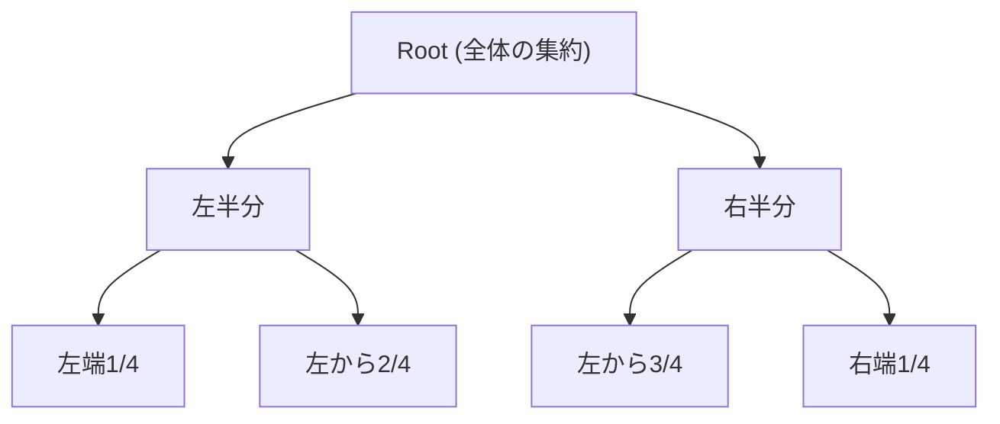
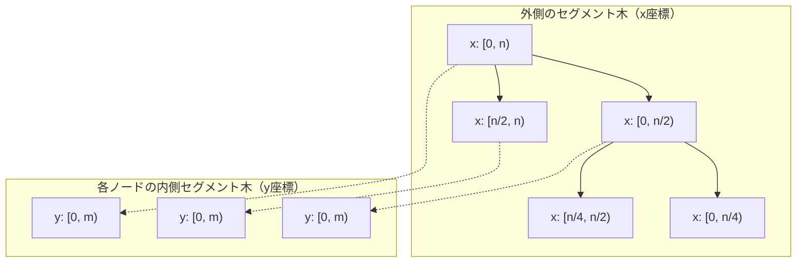
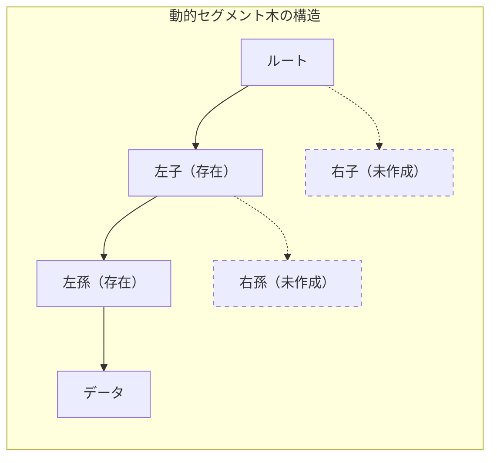
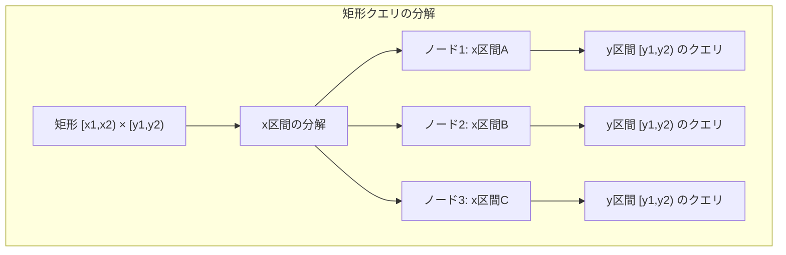
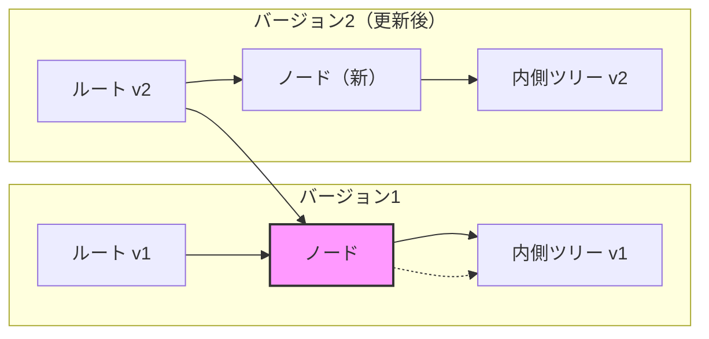
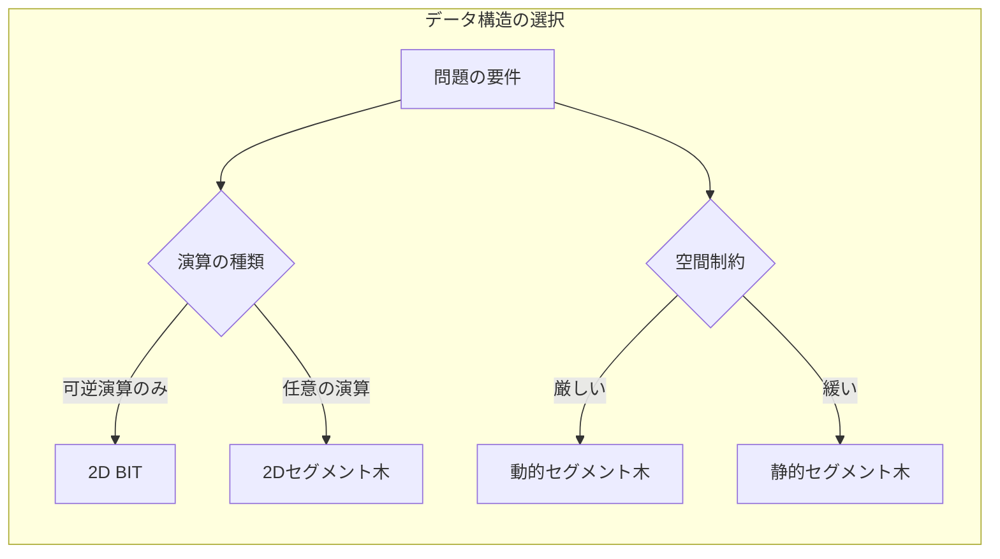
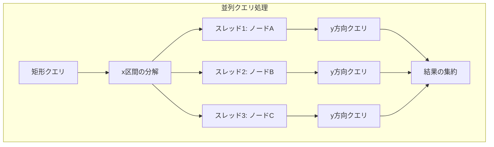

# 2Dセグメント木

2Dセグメント木は、平面上の矩形領域に対する区間クエリを効率的に処理するデータ構造である。1次元のセグメント木が線分上の区間に対するクエリを扱うのに対し、2Dセグメント木は2次元平面上の矩形領域に対するクエリを処理する。この拡張により、平面上の点群に対する矩形領域内の集約演算（総和、最小値、最大値など）を対数時間で実行できるようになる。

2Dセグメント木の基本的なアイデアは、セグメント木を入れ子にした構造を作ることである。外側のセグメント木がx座標を管理し、各ノードが内側のセグメント木を持ってy座標を管理する。この階層的な構造により、2次元の区間クエリを効率的に処理できる。しかし、この単純な入れ子構造には空間計算量の問題があり、実用的な実装では様々な工夫が必要となる。

## 基本構造と原理

2Dセグメント木の構造を理解するために、まず1次元のセグメント木を2次元に拡張する過程を考察する。1次元セグメント木では、配列の各要素を葉とする完全二分木を構築し、各内部ノードが子ノードの区間の集約値を保持する。この構造により、任意の区間に対するクエリをO(log n)で処理できる。



2Dセグメント木では、この概念を2次元に拡張する。最も直感的なアプローチは、x座標に対するセグメント木の各ノードに、そのx区間に含まれるすべての点のy座標に対するセグメント木を持たせることである。つまり、外側のセグメント木の各ノードが、内側のセグメント木のルートとなる。



この構造において、点(x, y)の値を更新する場合、x座標を含むすべてのセグメント木ノード（O(log n)個）について、それぞれのy座標セグメント木を更新する必要がある。同様に、矩形領域[x1, x2) × [y1, y2)に対するクエリでは、x座標の区間[x1, x2)をカバーするO(log n)個のノードを選び、各ノードのy座標セグメント木に対して[y1, y2)の区間クエリを実行する。

## 空間計算量の問題と解決策

単純な入れ子構造の2Dセグメント木は、理論的には美しいが、実用上は深刻な空間計算量の問題を抱えている。n×mのグリッドに対して、外側のセグメント木の各ノードがサイズmの内側セグメント木を持つとすると、全体の空間計算量はO(nm log n)となる。これは、各x座標のセグメント木ノードがO(log n)個存在し、それぞれがO(m)のメモリを使用するためである。

この問題を解決するアプローチはいくつか存在する。最も実用的なのは、動的セグメント木を使用する方法である。動的セグメント木では、実際に値が存在する座標のノードのみを作成し、空のノードはメモリ上に確保しない。これにより、k個の点が存在する場合の空間計算量をO(k log n log m)に削減できる。



もう一つのアプローチは、座標圧縮を使用する方法である。実際の座標値ではなく、存在する座標値の相対的な順序のみを考慮することで、空間を大幅に削減できる。n個の異なるx座標とm個の異なるy座標が存在する場合、座標圧縮により問題をn×mのグリッドに帰着できる。

座標圧縮を行う場合、元の座標値と圧縮後のインデックスの対応を管理する必要がある。これは通常、ソート済み配列や平衡二分探索木を使用して実装される。座標圧縮により空間効率は向上するが、前処理にO(k log k)の時間が必要となる。

## 更新操作の実装

2Dセグメント木における点更新は、1次元の場合の自然な拡張となる。点(x, y)の値をvに更新する場合、以下の手順で処理を行う：

1. x座標に対する外側セグメント木で、xを含むすべてのノードを特定する
2. 各ノードに対応する内側セグメント木で、y座標の更新を行う
3. 内側セグメント木の更新に伴い、親ノードの値を再計算する

この処理の計算量は、外側セグメント木でO(log n)個のノードを訪問し、各ノードでO(log m)の内側セグメント木更新を行うため、全体でO(log n log m)となる。

```python
def update(x, y, value):
    # 外側セグメント木のx座標を含むノードを走査
    x_node = x + offset_x  # 葉ノードの位置
    while x_node >= 1:
        # 内側セグメント木の更新
        update_inner(x_node, y, value)
        x_node //= 2  # 親ノードへ
```

動的セグメント木を使用する場合、更新時に必要に応じて新しいノードを作成する。これにより、疎なデータに対して効率的な空間使用が可能となる。ただし、ノードの動的生成にはメモリ管理のオーバーヘッドが伴うため、密なデータに対しては静的な配列実装の方が高速な場合もある。

## 矩形クエリの処理

矩形領域[x1, x2) × [y1, y2)に対するクエリは、2Dセグメント木の真価が発揮される操作である。このクエリを効率的に処理するために、1次元セグメント木のクエリ処理を2次元に拡張する。

まず、x座標の区間[x1, x2)をカバーする最小個数のセグメント木ノードを特定する。これは1次元セグメント木の標準的なクエリ処理と同じで、O(log n)個のノードが選ばれる。次に、選ばれた各ノードの内側セグメント木に対して、y座標の区間[y1, y2)のクエリを実行する。



クエリの計算量は、x方向でO(log n)個のノードを選び、各ノードでO(log m)のy方向クエリを実行するため、全体でO(log n log m)となる。この対数時間の計算量により、大規模なデータセットに対しても高速な矩形クエリが可能となる。

実装において重要なのは、各次元での区間分解を正確に行うことである。セグメント木の区間クエリでは、完全に含まれる区間と部分的に重なる区間を適切に処理する必要がある。2Dセグメント木では、この処理を両方の次元で行う必要があるため、境界条件の扱いが複雑になる。

## パーシステント2Dセグメント木

2Dセグメント木の発展的な応用として、パーシステント2Dセグメント木がある。これは、過去のすべての状態を保持し、任意の時点での状態に対してクエリを実行できるデータ構造である。パーシステント性は、更新時に変更された部分のみをコピーし、変更されない部分は共有することで実現される。

パーシステント1Dセグメント木では、更新時にルートから更新対象の葉までのパスのみをコピーすることで、O(log n)の追加メモリで新しいバージョンを作成できる。2Dセグメント木の場合、外側のセグメント木のパスと、各ノードでの内側セグメント木のパスをコピーする必要がある。



パーシステント2Dセグメント木の空間計算量は、k回の更新に対してO(k log n log m)となる。これは各更新でO(log n log m)の新しいノードが作成されるためである。時間計算量は通常の2Dセグメント木と同じO(log n log m)を維持できる。

## 実装上の最適化技法

2Dセグメント木の実装では、理論的な正しさだけでなく、実行効率も重要である。以下に、実用的な実装で考慮すべき最適化技法を述べる。

メモリレイアウトの最適化は、キャッシュ効率に大きく影響する。内側セグメント木のノードを連続したメモリ領域に配置することで、キャッシュミスを削減できる。特に、完全二分木として実装する場合、配列による実装がポインタベースの実装よりも高速な場合が多い。

```cpp
struct SegmentTree2D {
    static constexpr int MAX_N = 1 << 18;  // 2^18
    int outer_tree[2 * MAX_N];
    int inner_trees[2 * MAX_N][2 * MAX_N];  // 連続メモリ
};
```

遅延評価（lazy propagation）の2次元への拡張も重要な最適化である。矩形領域への一括更新を効率的に処理するために、更新を遅延させて必要時にのみ伝播する。ただし、2次元の遅延評価は1次元よりも複雑で、内側と外側の両方で遅延フラグを管理する必要がある。

ビット演算による高速化も有効である。セグメント木のインデックス計算では、2の累乗を扱うことが多いため、ビットシフトやビットマスクを活用できる。例えば、親ノードのインデックスは右シフト、子ノードは左シフトで計算できる。

## 他のデータ構造との比較

2Dセグメント木と同様の問題を解決する他のデータ構造との比較は、適切な選択をする上で重要である。以下に主要な代替手段とそのトレードオフを示す。

2D BIT（Binary Indexed Tree、Fenwick Tree）は、2Dセグメント木よりも実装が簡単で、定数倍が小さい。空間計算量もO(nm)と優れている。ただし、扱える演算が可逆なもの（加算、XORなど）に限定され、最小値や最大値のクエリには対応できない。また、任意の矩形クエリではなく、原点を含む矩形に限定される場合もある。



Range Treeは、計算幾何学で広く使用される別のアプローチである。Range Treeは、各次元でソートされた点を管理し、fractional cascadingという技法により、クエリ時間をO(log^(d-1) n)に削減できる（dは次元数）。2次元の場合、O(log n)のクエリ時間を達成できるが、実装が複雑で定数倍が大きい。

Quad TreeやK-d Treeは、空間を再帰的に分割するデータ構造である。これらは点の分布が偏っている場合に効率的で、最近傍探索などの用途に適している。しかし、最悪計算量の保証がなく、矩形クエリの効率も2Dセグメント木に劣る場合がある。

## 実装例と性能特性

実際の2Dセグメント木の実装では、問題の特性に応じて様々な選択をする必要がある。以下に、基本的な実装の骨格を示す。

```cpp
template<typename T>
class SegmentTree2D {
private:
    struct Node {
        int left, right;
        T value;
        Node() : left(-1), right(-1), value(T()) {}
    };
    
    vector<Node> nodes;
    int node_count;
    int width, height;
    
    int create_node() {
        if (node_count >= nodes.size()) {
            nodes.resize(nodes.size() * 2);
        }
        return node_count++;
    }
    
public:
    SegmentTree2D(int w, int h) 
        : width(w), height(h), node_count(0) {
        nodes.reserve(w * h * 20);  // 経験的な初期サイズ
    }
};
```

性能特性の実測では、データの密度と分布が大きく影響する。密なデータ（全体の50%以上が非零）では、静的な配列実装が最も高速である。一方、疎なデータ（1%未満）では、動的セグメント木のメモリ効率が重要となる。

更新とクエリの頻度比も重要な要因である。更新が頻繁な場合は、単純な実装の方が有利な場合がある。一方、クエリが支配的な場合は、前処理に時間をかけてでもクエリを高速化する価値がある。

## 応用問題と実装の注意点

2Dセグメント木は、競技プログラミングにおいて様々な問題に応用される。典型的な応用例として、動的な2次元の区間和クエリ、矩形領域内の最大値・最小値の取得、平面上の点の動的な追加・削除を伴う集計処理などがある。

実装時の注意点として、座標系の扱いがある。0-indexedか1-indexedか、区間は閉区間か半開区間かなど、一貫性を保つことが重要である。特に、セグメント木の実装では半開区間[l, r)を使用することが多いが、問題文では閉区間[l, r]で与えられることが多いため、変換時のミスに注意が必要である。

オーバーフローも重要な考慮事項である。特に、区間和を扱う場合、大きな値の累積によりオーバーフローが発生しやすい。64ビット整数を使用するか、必要に応じて任意精度演算やモジュラー演算を検討する必要がある。

境界条件の処理も慎重に行う必要がある。空の区間に対するクエリ、グリッドの端での更新、負の座標の扱いなど、エッジケースを適切に処理しないと、実行時エラーや誤った結果を生む可能性がある。

## 並列化と分散処理への拡張

2Dセグメント木の操作は、本質的に並列化可能な部分を含んでいる。特に、矩形クエリにおいて選ばれた複数のx座標ノードに対するy方向のクエリは、独立に実行できるため並列処理の恩恵を受けやすい。

更新操作の並列化はより複雑である。複数の更新が異なる座標を対象とする場合、外側セグメント木の異なる部分木に対する更新は並列化できる。しかし、同じノードへの同時アクセスを避けるための同期機構が必要となる。



大規模データに対しては、分散処理への拡張も考えられる。データを複数のマシンに分割し、各マシンが部分的な2Dセグメント木を管理する。クエリ時には、関連するマシンから結果を収集して集約する。この場合、データの分割方法とクエリのルーティングが性能に大きく影響する。

## 理論的な発展と研究動向

2Dセグメント木の理論的な側面では、より高次元への拡張や、動的な操作の効率化が研究されている。d次元セグメント木の場合、更新とクエリの計算量はO(log^d n)となるが、空間計算量が指数的に増加する問題がある。

最近の研究では、機械学習との融合も進んでいる。学習されたインデックス構造を2Dセグメント木に組み込むことで、実データの分布に適応した効率的なクエリ処理が可能となる。特に、データの局所性やアクセスパターンを学習して、頻繁にアクセスされる領域を最適化する手法が提案されている。

永続的データ構造の文脈では、関数型プログラミングとの親和性も注目されている。イミュータブルな2Dセグメント木は、並行処理において競合状態を避けることができ、関数型言語での実装が研究されている。

これらの理論的発展は、実用的な実装にも徐々に反映されており、特に大規模データ処理や並列計算の分野で新しい応用が生まれている。2Dセグメント木は、単なる競技プログラミングのツールから、実世界の複雑な問題を解決するための基盤技術へと進化を続けている。

## 詳細な実装例：動的2Dセグメント木

実際の競技プログラミングで使用される動的2Dセグメント木の完全な実装を示す。この実装は、メモリ効率と実行速度のバランスを考慮し、実用的な問題に対応できるよう設計されている。

```cpp
template<typename T, typename F>
class Dynamic2DSegmentTree {
private:
    struct InnerNode {
        int left, right;
        T value;
        InnerNode() : left(-1), right(-1), value(T()) {}
    };
    
    struct OuterNode {
        int left, right;
        int root;  // 内側セグメント木のルート
        OuterNode() : left(-1), right(-1), root(-1) {}
    };
    
    vector<OuterNode> outer_nodes;
    vector<InnerNode> inner_nodes;
    int outer_root;
    int outer_count, inner_count;
    int width, height;
    F merge;  // 集約関数
    T identity;  // 単位元
    
    int create_outer_node() {
        if (outer_count >= outer_nodes.size()) {
            outer_nodes.resize(outer_nodes.size() * 2);
        }
        return outer_count++;
    }
    
    int create_inner_node() {
        if (inner_count >= inner_nodes.size()) {
            inner_nodes.resize(inner_nodes.size() * 2);
        }
        return inner_count++;
    }
    
    void update_inner(int& node, int l, int r, int y, T val) {
        if (node == -1) {
            node = create_inner_node();
        }
        
        if (l + 1 == r) {
            inner_nodes[node].value = val;
            return;
        }
        
        int mid = (l + r) / 2;
        if (y < mid) {
            update_inner(inner_nodes[node].left, l, mid, y, val);
        } else {
            update_inner(inner_nodes[node].right, mid, r, y, val);
        }
        
        T left_val = (inner_nodes[node].left != -1) 
                     ? inner_nodes[inner_nodes[node].left].value 
                     : identity;
        T right_val = (inner_nodes[node].right != -1) 
                      ? inner_nodes[inner_nodes[node].right].value 
                      : identity;
        inner_nodes[node].value = merge(left_val, right_val);
    }
    
    T query_inner(int node, int l, int r, int ql, int qr) {
        if (node == -1 || qr <= l || r <= ql) return identity;
        if (ql <= l && r <= qr) return inner_nodes[node].value;
        
        int mid = (l + r) / 2;
        return merge(
            query_inner(inner_nodes[node].left, l, mid, ql, qr),
            query_inner(inner_nodes[node].right, mid, r, ql, qr)
        );
    }
    
    void update_outer(int& node, int l, int r, int x, int y, T val) {
        if (node == -1) {
            node = create_outer_node();
        }
        
        update_inner(outer_nodes[node].root, 0, height, y, val);
        
        if (l + 1 == r) return;
        
        int mid = (l + r) / 2;
        if (x < mid) {
            update_outer(outer_nodes[node].left, l, mid, x, y, val);
        } else {
            update_outer(outer_nodes[node].right, mid, r, x, y, val);
        }
    }
    
    T query_outer(int node, int l, int r, int qlx, int qrx, int qly, int qry) {
        if (node == -1 || qrx <= l || r <= qlx) return identity;
        if (qlx <= l && r <= qrx) {
            return query_inner(outer_nodes[node].root, 0, height, qly, qry);
        }
        
        int mid = (l + r) / 2;
        return merge(
            query_outer(outer_nodes[node].left, l, mid, qlx, qrx, qly, qry),
            query_outer(outer_nodes[node].right, mid, r, qlx, qrx, qly, qry)
        );
    }
    
public:
    Dynamic2DSegmentTree(int w, int h, F f, T id) 
        : width(w), height(h), merge(f), identity(id),
          outer_root(-1), outer_count(0), inner_count(0) {
        // 経験的な初期サイズ設定
        int expected_nodes = min(w * h, 100000);
        outer_nodes.reserve(expected_nodes);
        inner_nodes.reserve(expected_nodes * 20);
    }
    
    void update(int x, int y, T val) {
        update_outer(outer_root, 0, width, x, y, val);
    }
    
    T query(int x1, int y1, int x2, int y2) {
        return query_outer(outer_root, 0, width, x1, x2, y1, y2);
    }
};
```

この実装の特徴は、動的なノード生成により、疎なデータに対して効率的なメモリ使用を実現している点である。また、テンプレートパラメータにより、任意の型と集約関数に対応できる汎用的な設計となっている。

## 実践的な問題への適用例

2Dセグメント木が有効な問題の具体例として、「動的な点の追加・削除を伴う矩形領域内の最大値クエリ」を考える。この問題は、地理情報システムやゲームのコリジョン検出など、実世界のアプリケーションでも頻繁に現れるパターンである。

```cpp
// 使用例：点の重みの最大値を管理
int main() {
    // 1000x1000のグリッド、最大値を求める
    auto seg2d = Dynamic2DSegmentTree<int, function<int(int, int)>>(
        1000, 1000,
        [](int a, int b) { return max(a, b); },
        INT_MIN
    );
    
    // 点(100, 200)に重み50を設定
    seg2d.update(100, 200, 50);
    
    // 矩形[50, 150) x [100, 300)内の最大値を取得
    int max_val = seg2d.query(50, 100, 150, 300);
}
```

別の応用例として、「時系列データの2次元範囲集計」がある。x軸を時刻、y軸を値として、任意の時間窓と値の範囲に対する集計を高速に行える。

```cpp
// 時系列データの管理
struct TimeSeriesPoint {
    int timestamp;
    int value;
    int count;
};

// カウントの集計
auto count_seg2d = Dynamic2DSegmentTree<int, plus<int>>(
    86400,  // 1日の秒数
    1000,   // 値の範囲
    plus<int>(),
    0
);

// データポイントの追加
for (const auto& point : data_points) {
    count_seg2d.update(point.timestamp, point.value, 1);
}

// 特定の時間帯と値の範囲内のデータ数を取得
int count = count_seg2d.query(3600, 100, 7200, 500);
```

## 座標圧縮を用いた最適化実装

実際の問題では、座標値が非常に大きい場合があり、そのままではメモリ不足となる。座標圧縮を組み合わせた実装により、この問題を解決できる。

```cpp
template<typename T>
class CompressedSegmentTree2D {
private:
    vector<int> xs, ys;  // 圧縮後の座標
    Dynamic2DSegmentTree<T, function<T(T, T)>> seg2d;
    
    int compress_x(int x) {
        return lower_bound(xs.begin(), xs.end(), x) - xs.begin();
    }
    
    int compress_y(int y) {
        return lower_bound(ys.begin(), ys.end(), y) - ys.begin();
    }
    
public:
    CompressedSegmentTree2D(
        vector<pair<int, int>>& points,
        function<T(T, T)> merge,
        T identity
    ) : seg2d(points.size(), points.size(), merge, identity) {
        // 座標の抽出と圧縮
        for (const auto& [x, y] : points) {
            xs.push_back(x);
            ys.push_back(y);
        }
        
        sort(xs.begin(), xs.end());
        sort(ys.begin(), ys.end());
        xs.erase(unique(xs.begin(), xs.end()), xs.end());
        ys.erase(unique(ys.begin(), ys.end()), ys.end());
    }
    
    void update(int x, int y, T val) {
        seg2d.update(compress_x(x), compress_y(y), val);
    }
    
    T query(int x1, int y1, int x2, int y2) {
        return seg2d.query(
            compress_x(x1), compress_y(y1),
            compress_x(x2), compress_y(y2)
        );
    }
};
```

## パフォーマンスチューニングの詳細

2Dセグメント木の性能を最大化するための具体的なチューニング手法を以下に示す。

### キャッシュ最適化

メモリアクセスパターンの最適化により、実行速度を大幅に改善できる。特に、内側セグメント木のノードを連続メモリに配置することで、キャッシュヒット率を向上させる。

```cpp
// キャッシュフレンドリーな実装
class CacheOptimized2DSegTree {
private:
    static constexpr int CACHE_LINE = 64;  // 典型的なキャッシュラインサイズ
    static constexpr int NODES_PER_LINE = CACHE_LINE / sizeof(int);
    
    // アラインメントを考慮したメモリ配置
    alignas(CACHE_LINE) int* data;
    
    // プリフェッチヒントの使用
    void prefetch_node(int node) {
        __builtin_prefetch(&data[node * NODES_PER_LINE], 0, 3);
    }
};
```

### SIMD命令の活用

現代のCPUが提供するSIMD命令を使用することで、複数の演算を並列に実行できる。特に、総和や最大値などの演算で効果的である。

```cpp
#include <immintrin.h>

// AVX2を使用した高速集計
class SIMD2DSegTree {
private:
    __m256i query_sum_simd(const int* data, int count) {
        __m256i sum = _mm256_setzero_si256();
        int i = 0;
        
        // 8要素ずつ並列処理
        for (; i + 7 < count; i += 8) {
            __m256i values = _mm256_loadu_si256((__m256i*)&data[i]);
            sum = _mm256_add_epi32(sum, values);
        }
        
        // 残りの要素を処理
        int result = 0;
        int temp[8];
        _mm256_storeu_si256((__m256i*)temp, sum);
        for (int j = 0; j < 8; j++) result += temp[j];
        
        for (; i < count; i++) result += data[i];
        return _mm256_set1_epi32(result);
    }
};
```

### メモリプールの使用

頻繁なメモリ割り当てと解放を避けるため、カスタムメモリプールを実装する。これにより、メモリ管理のオーバーヘッドを削減できる。

```cpp
template<typename T>
class MemoryPool {
private:
    struct Block {
        T data[1024];
        Block* next;
    };
    
    Block* head;
    int current_idx;
    
public:
    MemoryPool() : head(new Block()), current_idx(0) {
        head->next = nullptr;
    }
    
    T* allocate() {
        if (current_idx >= 1024) {
            Block* new_block = new Block();
            new_block->next = head;
            head = new_block;
            current_idx = 0;
        }
        return &head->data[current_idx++];
    }
};
```

## 高度な応用：3D以上への拡張

2Dセグメント木の概念は、より高次元にも拡張可能である。3Dセグメント木では、立方体領域に対するクエリを処理できる。実装は2Dの場合の自然な拡張となるが、空間計算量がさらに増大するため、動的な実装がより重要となる。

```cpp
template<typename T>
class Dynamic3DSegmentTree {
private:
    struct ZNode {
        int left, right;
        T value;
    };
    
    struct YNode {
        int left, right;
        int z_root;
    };
    
    struct XNode {
        int left, right;
        int y_root;
    };
    
    // 3次元の再帰的な更新とクエリ
    void update_3d(int x, int y, int z, T val) {
        // x -> y -> z の順に更新
    }
    
    T query_3d(int x1, int y1, int z1, int x2, int y2, int z2) {
        // 3次元の矩形領域クエリ
    }
};
```

## デバッグとテスト戦略

2Dセグメント木の実装は複雑であり、バグが発生しやすい。効果的なデバッグとテスト戦略が不可欠である。

```cpp
// 単体テストの例
void test_2d_segment_tree() {
    // 小さなサイズでの網羅的テスト
    auto seg = Dynamic2DSegmentTree<int, plus<int>>(4, 4, plus<int>(), 0);
    
    // すべての点を更新
    for (int i = 0; i < 4; i++) {
        for (int j = 0; j < 4; j++) {
            seg.update(i, j, i * 4 + j);
        }
    }
    
    // すべての矩形領域でクエリを検証
    for (int x1 = 0; x1 < 4; x1++) {
        for (int y1 = 0; y1 < 4; y1++) {
            for (int x2 = x1 + 1; x2 <= 4; x2++) {
                for (int y2 = y1 + 1; y2 <= 4; y2++) {
                    int expected = 0;
                    for (int i = x1; i < x2; i++) {
                        for (int j = y1; j < y2; j++) {
                            expected += i * 4 + j;
                        }
                    }
                    assert(seg.query(x1, y1, x2, y2) == expected);
                }
            }
        }
    }
}
```

可視化ツールの作成も有効である。2Dセグメント木の内部状態を図示することで、問題の特定が容易になる。

これらの実装技術と最適化手法により、2Dセグメント木は理論的な美しさだけでなく、実用的な高性能を実現できる。競技プログラミングから実世界のアプリケーションまで、幅広い場面で活用される重要なデータ構造として、今後も発展を続けていくだろう。