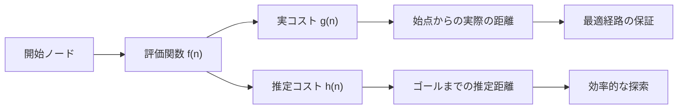
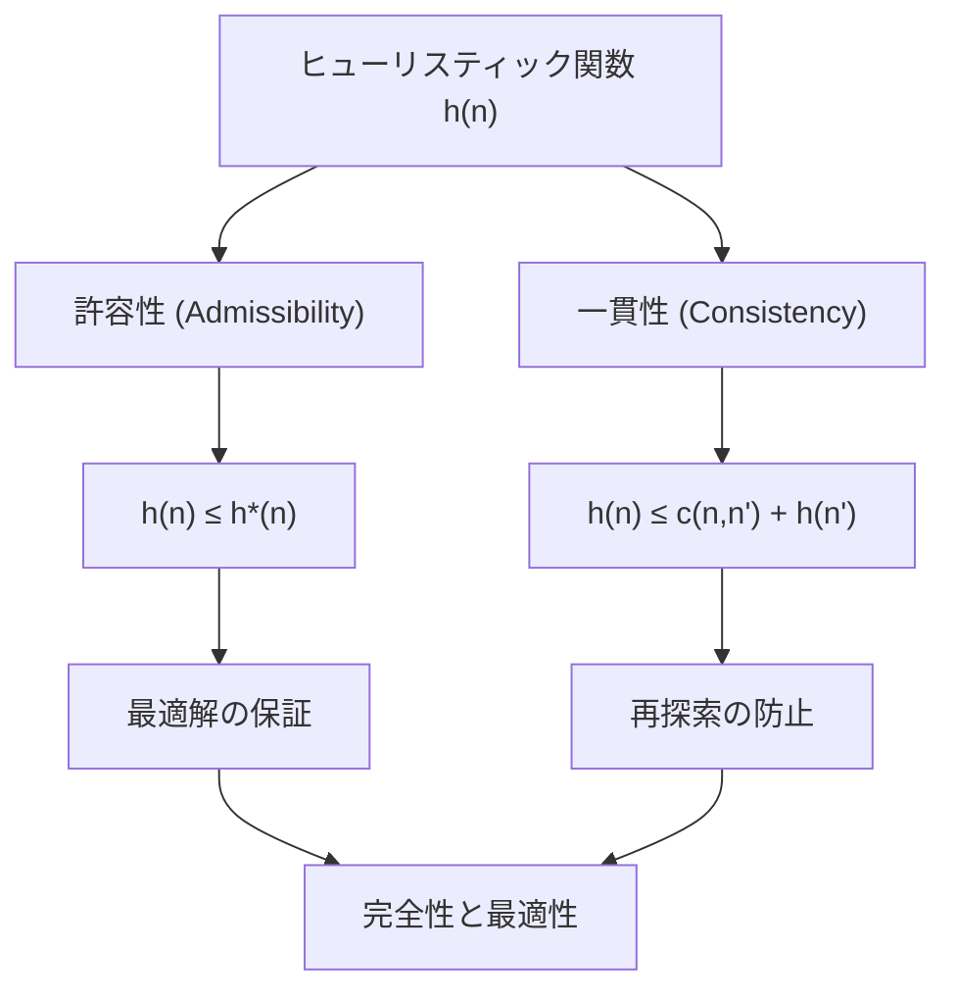
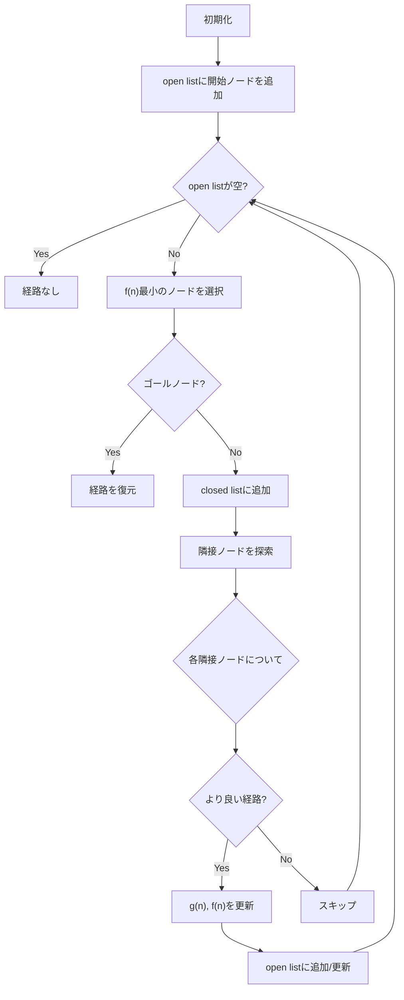
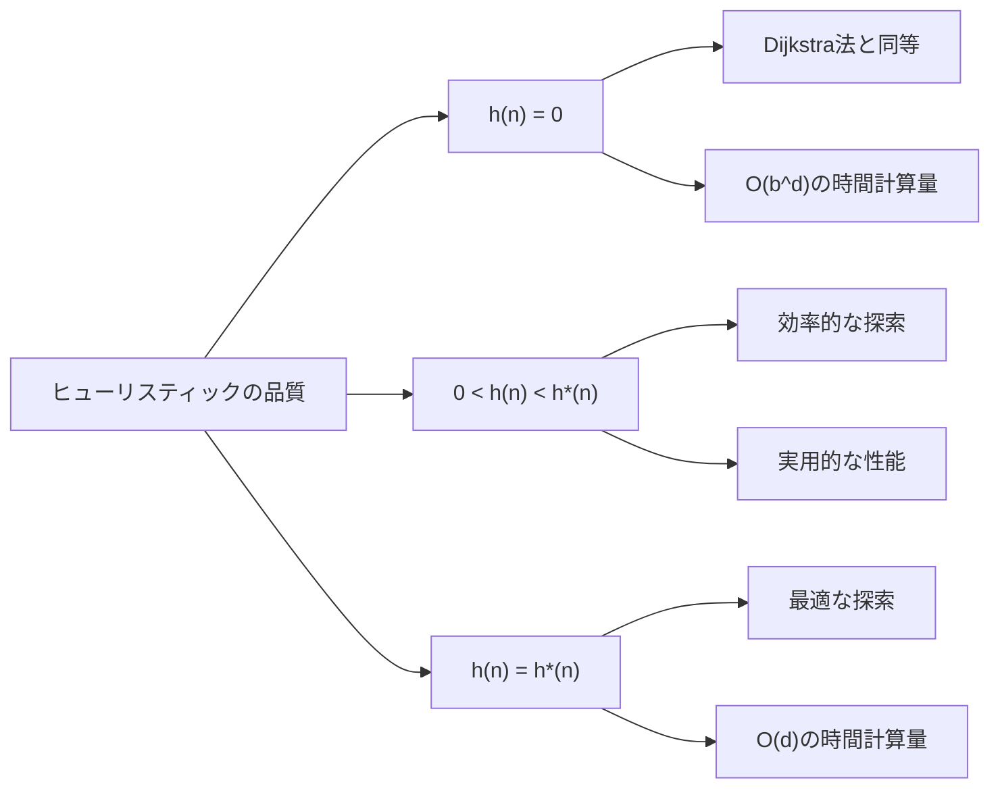
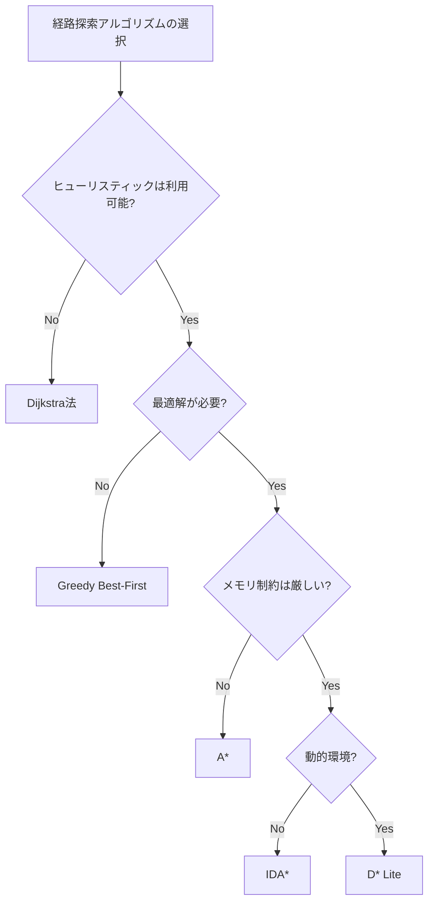
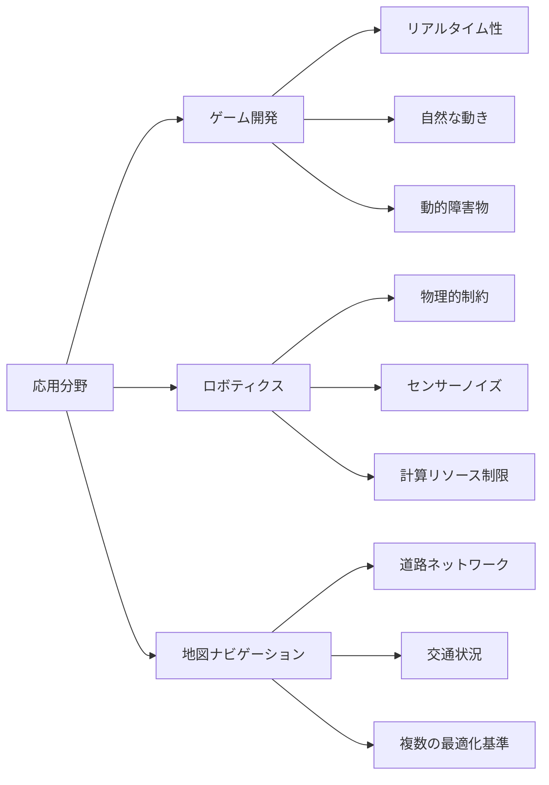

# A*アルゴリズム

A*アルゴリズム（A-star algorithm）は、グラフ探索において最短経路を効率的に発見するための発見的探索アルゴリズムである。1968年にPeter Hart、Nils Nilsson、Bertram Raphaelによって提案されたこのアルゴリズムは[^1]、最良優先探索の一種でありながら、適切なヒューリスティック関数を用いることで最適解を保証するという優れた特性を持つ。競技プログラミングからゲーム開発、ロボティクスまで幅広い分野で活用されており、効率的な経路探索が求められる問題の標準的な解法として確立している。

A*アルゴリズムの本質は、Dijkstra法の厳密性とGreedy Best-First Searchの効率性を巧妙に組み合わせた点にある。始点から任意のノードまでの実際のコストg(n)と、そのノードから目標までの推定コストh(n)を合計した評価関数f(n) = g(n) + h(n)を用いることで、探索の方向性を制御しながら最適性を保証する。この評価関数の設計により、無駄な探索を削減しつつ、確実に最短経路を発見できるという、一見相反する要求を同時に満たすことが可能となる。



## ヒューリスティック関数の数学的基礎

A*アルゴリズムの性能と正確性は、ヒューリスティック関数h(n)の設計に大きく依存する。ヒューリスティック関数が満たすべき条件として最も重要なのが「admissible（許容的）」と呼ばれる性質である。関数h(n)が許容的であるとは、任意のノードnに対して、h(n) ≤ h*(n)が成立することを意味する。ここでh*(n)はノードnから目標までの真の最小コストである。

この許容性の条件は、A*アルゴリズムが最適解を発見することを保証する上で不可欠である。直感的には、ヒューリスティック関数が実際のコストを過小評価することで、アルゴリズムは潜在的により良い経路を見逃さないようになる。逆に、過大評価してしまうと、実際には最適である経路を早期に切り捨ててしまう可能性がある。

グリッド上の経路探索問題を例に取ると、一般的に使用されるヒューリスティック関数には以下のようなものがある。マンハッタン距離は、格子状の移動（上下左右のみ）が可能な場合に適しており、h(n) = |x_goal - x_n| + |y_goal - y_n|で計算される。ユークリッド距離は、任意の方向への移動が可能な場合に使用され、h(n) = sqrt((x_goal - x_n)² + (y_goal - y_n)²)となる。これらはいずれも許容的なヒューリスティック関数である。



さらに強い条件として「consistent（一貫的）」または「monotone（単調）」と呼ばれる性質がある。ヒューリスティック関数h(n)が一貫的であるとは、任意の隣接ノードn, n'に対して、h(n) ≤ c(n,n') + h(n')が成立することを意味する。ここでc(n,n')はノードnからn'への移動コストである。この条件は三角不等式とも呼ばれ、一貫性を満たすヒューリスティック関数は必ず許容的でもある。

一貫性を満たすヒューリスティック関数を使用する利点は、一度展開されたノードを再び探索する必要がないことである。これにより、closed listの管理が簡潔になり、実装の効率性が向上する。実際の応用では、前述のマンハッタン距離やユークリッド距離は一貫性も満たすため、多くの場面で有効に機能する。

## アルゴリズムの詳細な動作原理

A*アルゴリズムは、2つの主要なデータ構造を用いて探索を管理する。open listは未探索だが発見済みのノードを保持し、closed listは既に探索が完了したノードを記録する。アルゴリズムの基本的な流れは、open listから最も有望なノード（f(n)が最小のノード）を選択し、そのノードを展開して隣接ノードを調査し、必要に応じてopen listを更新するという繰り返しである。

```python
def a_star(start, goal, graph, heuristic):
    # Initialize data structures
    open_list = PriorityQueue()
    closed_list = set()
    g_score = {start: 0}
    f_score = {start: heuristic(start, goal)}
    parent = {start: None}
    
    open_list.put((f_score[start], start))
    
    while not open_list.empty():
        current_f, current = open_list.get()
        
        # Goal check
        if current == goal:
            return reconstruct_path(parent, current)
        
        closed_list.add(current)
        
        # Explore neighbors
        for neighbor, cost in graph.get_neighbors(current):
            if neighbor in closed_list:
                continue
            
            tentative_g = g_score[current] + cost
            
            if neighbor not in g_score or tentative_g < g_score[neighbor]:
                # Update path
                parent[neighbor] = current
                g_score[neighbor] = tentative_g
                f_score[neighbor] = tentative_g + heuristic(neighbor, goal)
                
                # Add to open list
                open_list.put((f_score[neighbor], neighbor))
    
    return None  # No path found
```

アルゴリズムの各ステップでは、評価関数f(n) = g(n) + h(n)に基づいて次に展開するノードを選択する。この選択プロセスが、A*アルゴリズムの効率性の鍵となる。g(n)は既に確定した実際のコストであり、h(n)は将来の推定コストである。両者のバランスにより、探索は最短経路の方向に誘導されながらも、より良い経路の可能性を見逃さない。



重要な実装上の考慮事項として、open listの効率的な管理がある。f(n)が最小のノードを高速に取得する必要があるため、通常は優先度付きキュー（ヒープ）を使用する。また、同一ノードがopen list内に複数回出現する可能性があるため、これを適切に処理する必要がある。一つの方法は、ノードを取り出した際に既にclosed listに含まれているかを確認することである。

## 性能特性と計算複雑性

A*アルゴリズムの時間計算量は、使用するヒューリスティック関数の精度に大きく依存する。最悪の場合、つまりh(n) = 0の場合、A*アルゴリズムはDijkstra法と同等になり、時間計算量はO(b^d)となる。ここでbは分岐係数（各ノードの平均隣接ノード数）、dは解の深さである。一方、完璧なヒューリスティック関数（h(n) = h*(n)）が利用可能な理想的な場合、アルゴリズムは最短経路のみを辿り、O(d)の時間計算量となる。

空間計算量については、open listとclosed listの両方を保持する必要があるため、最悪の場合O(b^d)となる。これは、探索空間のすべてのノードを保存する可能性があるためである。実際の応用では、メモリ使用量が問題となることがあり、この制約を緩和するための変種アルゴリズムも提案されている。

ヒューリスティック関数の品質を評価する指標として、「effective branching factor」がある。これは、アルゴリズムが展開したノード数から逆算される実効的な分岐係数であり、理想的には1に近い値となることが望ましい。良質なヒューリスティック関数は、この値を大幅に削減し、探索の効率を向上させる。



実際の性能は、問題の構造にも大きく影響される。例えば、障害物が少ない開けた空間では、A*アルゴリズムは非常に効率的に動作する。一方、迷路のような複雑な構造では、多くのノードを展開する必要があり、性能が低下する可能性がある。このような場合、双方向探索やJump Point Searchなどの拡張手法を検討する価値がある。

## 実装上の最適化技術

実用的なA*アルゴリズムの実装では、様々な最適化技術が適用される。まず、tie-breakingの問題がある。複数のノードが同じf(n)値を持つ場合、どのノードを優先するかによって探索の効率が変わる。一般的な手法として、h(n)値が小さいノードを優先する、あるいは最後に追加されたノードを優先するなどがある。

```python
def improved_a_star(start, goal, graph, heuristic):
    # Use a counter for tie-breaking
    counter = itertools.count()
    open_list = []
    closed_list = set()
    g_score = {start: 0}
    
    # Push with (f_score, h_score, count, node) for better tie-breaking
    h_start = heuristic(start, goal)
    heappush(open_list, (h_start, h_start, next(counter), start))
    
    while open_list:
        _, _, _, current = heappop(open_list)
        
        if current in closed_list:
            continue
            
        if current == goal:
            return reconstruct_path(parent, current)
        
        closed_list.add(current)
        
        for neighbor, cost in graph.get_neighbors(current):
            if neighbor in closed_list:
                continue
            
            tentative_g = g_score[current] + cost
            
            if neighbor not in g_score or tentative_g < g_score[neighbor]:
                g_score[neighbor] = tentative_g
                h_score = heuristic(neighbor, goal)
                f_score = tentative_g + h_score
                
                heappush(open_list, 
                        (f_score, h_score, next(counter), neighbor))
```

メモリ使用量の最適化も重要な課題である。大規模なグラフでは、すべてのノードに対してg(n)値を保存することが現実的でない場合がある。この問題に対処するため、Iterative Deepening A* (IDA*)やMemory-bounded A* (MA*)などの変種が開発されている。IDA*は深さ優先探索の原理を利用してメモリ使用量を削減し、MA*は利用可能なメモリ量に応じて探索戦略を調整する。

グリッドベースの経路探索では、対称性を利用した最適化が可能である。Jump Point Search (JPS)は、グリッド上の対称な経路を認識し、不要なノードの展開を回避することで、A*アルゴリズムの性能を大幅に向上させる。特に、障害物が少ない開けた空間では、JPSは通常のA*と比較して10倍以上の高速化を実現することがある。

## 他のアルゴリズムとの比較と選択指針

A*アルゴリズムは多くの場面で優れた選択肢となるが、すべての状況で最適というわけではない。問題の特性に応じて、他のアルゴリズムがより適している場合がある。Dijkstra法は、ヒューリスティック関数が利用できない、あるいは信頼できない場合に有効である。すべての経路を平等に探索するため、最適解は保証されるが、効率性は劣る。

Greedy Best-First Searchは、メモリや計算時間が厳しく制限されており、準最適解でも許容できる場合に選択される。このアルゴリズムは、h(n)のみを評価関数として使用し、g(n)を無視するため、非常に高速に動作するが、最適解は保証されない。ゲームAIなど、リアルタイム性が重視される応用では、この特性が有利に働くことがある。



動的環境における経路探索では、D*やD* Liteなどのアルゴリズムが適している。これらは、環境の変化に応じて効率的に経路を再計算できるよう設計されている。ロボティクスやリアルタイムストラテジーゲームなど、環境が頻繁に変化する応用では、A*を繰り返し実行するよりも効率的である。

双方向探索は、開始地点と目標地点の両方から同時に探索を行う手法である。探索空間が大きく、単方向のA*では時間がかかる場合に有効である。理論的には、探索するノード数を大幅に削減できるが、実装の複雑さと、両方向の探索が出会う地点を効率的に検出する必要がある。

## 実践的な設計パターンと実装例

実際のシステムにA*アルゴリズムを組み込む際には、様々な設計上の配慮が必要となる。まず、グラフの表現方法が性能に大きく影響する。密なグラフでは隣接行列が効率的だが、疎なグラフでは隣接リストや動的な近傍生成が適している。特に、グリッドベースの問題では、すべてのセルを事前にノードとして生成するのではなく、必要に応じて動的に生成する手法が一般的である。

```python
class GridGraph:
    def __init__(self, width, height, obstacles):
        self.width = width
        self.height = height
        self.obstacles = set(obstacles)
    
    def get_neighbors(self, node):
        x, y = node
        neighbors = []
        
        # 4-directional movement
        for dx, dy in [(0, 1), (1, 0), (0, -1), (-1, 0)]:
            nx, ny = x + dx, y + dy
            
            if (0 <= nx < self.width and 
                0 <= ny < self.height and
                (nx, ny) not in self.obstacles):
                neighbors.append(((nx, ny), 1))  # Cost is 1
        
        return neighbors
    
    def heuristic(self, node, goal):
        # Manhattan distance for grid
        return abs(goal[0] - node[0]) + abs(goal[1] - node[1])
```

エラー処理と堅牢性も重要な設計要素である。到達不可能な目標、無効な開始地点、循環する経路など、様々な異常ケースに対処する必要がある。また、大規模なグラフでは、タイムアウトや反復回数の上限を設定することで、無限ループや過度な計算を防ぐことが重要である。

マルチスレッド環境での実装では、並列化の可能性を検討する価値がある。複数の目標に対する経路を同時に計算する場合や、大規模なopen listの管理において、並列処理により性能向上が期待できる。ただし、共有データ構造へのアクセスを適切に同期する必要があり、実装の複雑さは増加する。

```python
class ParallelAStar:
    def __init__(self, num_threads=4):
        self.num_threads = num_threads
        self.executor = ThreadPoolExecutor(max_workers=num_threads)
    
    def find_multiple_paths(self, start_goal_pairs, graph, heuristic):
        futures = []
        
        for start, goal in start_goal_pairs:
            future = self.executor.submit(
                a_star, start, goal, graph, heuristic
            )
            futures.append(future)
        
        results = []
        for future in futures:
            try:
                path = future.result(timeout=10.0)
                results.append(path)
            except TimeoutError:
                results.append(None)
        
        return results
```

## 応用分野における特殊な考慮事項

ゲーム開発におけるA*の応用では、リアルタイム性と視覚的な自然さのバランスが重要となる。完全に最適な経路は、しばしば不自然に見えることがある。例えば、壁に沿ってジグザグに移動するよりも、やや遠回りでも滑らかな経路の方が自然に見える。このような要求に対応するため、経路の後処理やヒューリスティック関数の調整が行われる。

ロボティクスにおいては、物理的な制約を考慮する必要がある。ロボットの回転半径、加速度の制限、障害物との安全距離など、単純な格子上の移動とは異なる制約が存在する。これらを扱うため、状態空間を拡張し、位置だけでなく向きや速度も含めた高次元空間でのA*探索が行われることがある。



地図ナビゲーションシステムでは、単純な距離だけでなく、交通状況、道路の種類、通行料金など、複数の要因を考慮する必要がある。このような多目的最適化問題では、評価関数を適切に設計することが課題となる。また、道路ネットワークの階層性を利用した最適化手法（Contraction Hierarchiesなど）と組み合わせることで、大規模なネットワークでも高速な経路探索を実現している。

機械学習との統合も近年注目されている分野である。ヒューリスティック関数を学習により獲得する試みや、過去の探索履歴から効率的な探索戦略を学習する研究が進められている。特に、複雑な地形や動的な環境では、手動で設計したヒューリスティック関数よりも、学習により獲得したものの方が優れた性能を示すことがある。

## 理論的な拡張と研究動向

A*アルゴリズムの理論的な拡張として、様々な変種が提案されている。Anytime A*は、利用可能な計算時間に応じて解の品質を段階的に改善するアルゴリズムである。最初に準最適解を高速に発見し、その後時間が許す限り解を改善していく。これは、リアルタイムシステムにおいて特に有用である。

並列化に関する研究も活発である。Parallel A* (PA*)やHash Distributed A* (HDA*)などは、複数のプロセッサやマシンを利用して大規模な探索空間を効率的に探索する。これらのアルゴリズムでは、探索空間の分割、負荷分散、通信オーバーヘッドの削減などが主要な課題となる。

不確実性を扱う拡張も重要な研究分野である。現実世界では、エッジのコストが確率的である場合や、グラフの構造自体が不確実な場合がある。このような状況に対処するため、確率的A*やロバストA*などの手法が開発されている。これらは、期待値最適化やワーストケース最適化など、異なる最適性の概念に基づいている。

```python
class AnytimeAStar:
    def __init__(self, epsilon_start=3.0, epsilon_decrement=0.5):
        self.epsilon = epsilon_start
        self.epsilon_decrement = epsilon_decrement
        self.incumbent_solution = None
        self.incumbent_cost = float('inf')
    
    def search(self, start, goal, graph, heuristic, time_limit):
        start_time = time.time()
        
        while time.time() - start_time < time_limit:
            # Run weighted A* with current epsilon
            solution = self.weighted_a_star(
                start, goal, graph, heuristic, self.epsilon
            )
            
            if solution and len(solution) < self.incumbent_cost:
                self.incumbent_solution = solution
                self.incumbent_cost = len(solution)
            
            # Decrease epsilon for next iteration
            self.epsilon = max(1.0, self.epsilon - self.epsilon_decrement)
            
            if self.epsilon == 1.0:
                break  # Optimal solution found
        
        return self.incumbent_solution
```

A*アルゴリズムは、その誕生から50年以上が経過した現在でも、経路探索問題の中核的な解法として広く使用されている。その理論的な優雅さと実用的な有効性の組み合わせは、アルゴリズム設計の模範例といえる。適切なヒューリスティック関数の設計により、問題固有の知識を活用できる柔軟性と、最適性を保証する厳密性を兼ね備えている点が、A*アルゴリズムの永続的な価値の源泉である。

実装においては、問題の特性を深く理解し、適切なデータ構造と最適化技術を選択することが成功の鍵となる。メモリ使用量、計算時間、解の品質のトレードオフを慎重に検討し、応用分野の要求に応じた設計判断を行う必要がある。また、関連アルゴリズムとの比較を通じて、A*が最適な選択肢であるかを常に再評価することも重要である。

[^1]: Hart, P. E., Nilsson, N. J., & Raphael, B. (1968). A formal basis for the heuristic determination of minimum cost paths. IEEE Transactions on Systems Science and Cybernetics, 4(2), 100-107.