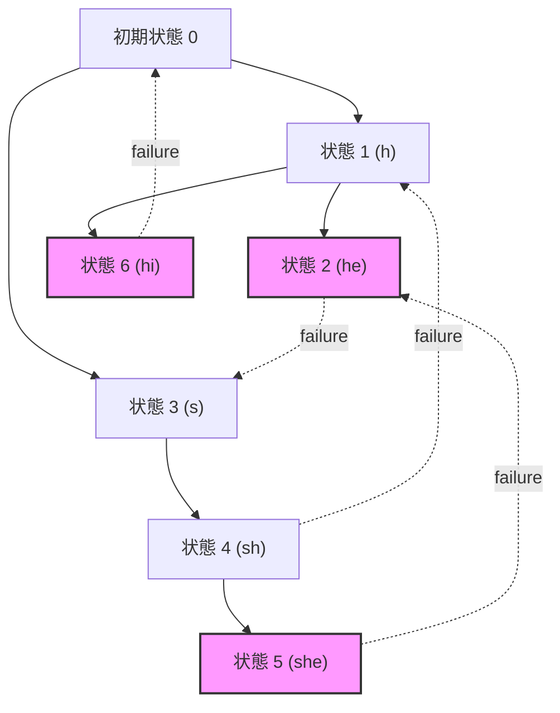
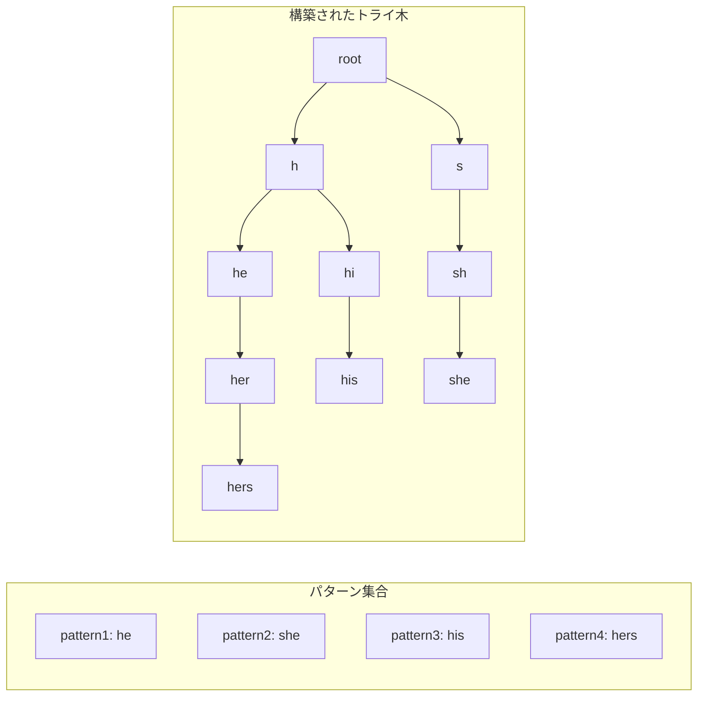
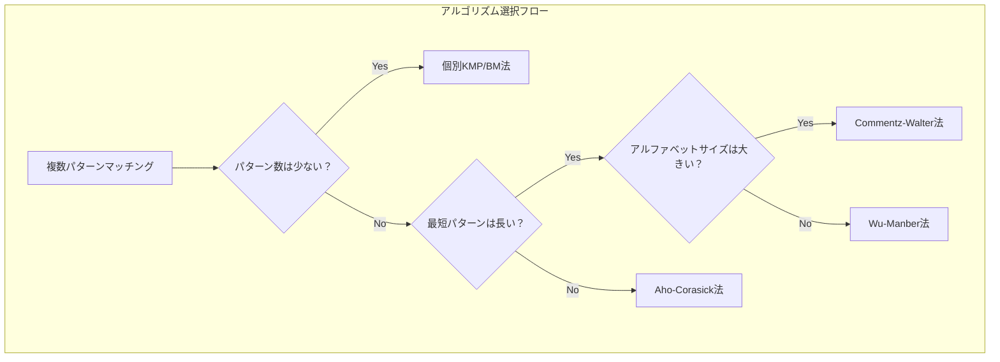

# Aho-Corasick法

Aho-Corasick法は、複数のパターン文字列を対象テキスト中から同時に検索する効率的なアルゴリズムである。1975年にAlfred V. AhoとMargaret J. Corasickによって発表されたこのアルゴリズム¹は、テキスト処理における基本的な問題の一つである複数パターンマッチング問題を、線形時間で解決する画期的な手法として知られている。

単一のパターンを検索するKnuth-Morris-Pratt法やBoyer-Moore法と異なり、Aho-Corasick法は任意の数のパターンを同時に処理できる。この特性により、侵入検知システム、バイオインフォマティクス、テキストエディタの検索機能など、実用的な応用分野で広く利用されている。

## アルゴリズムの基本構造

Aho-Corasick法の中核は、有限状態オートマトンの構築にある。このオートマトンは、入力テキストを1文字ずつ読み込みながら状態遷移を行い、パターンの出現を検出する。オートマトンは主に3つの要素から構成される：トライ木（goto関数）、failure関数、そして出力関数である。



このオートマトンの構築過程を理解するために、まずトライ木の性質を詳しく見ていこう。トライ木は、パターン集合の共通接頭辞を共有する木構造であり、各ノードは文字列の接頭辞を表現する。根から任意のノードへの経路上の文字を連結することで、そのノードが表す接頭辞が得られる。

## トライ木構築フェーズ

トライ木の構築は、各パターンを順次挿入することで行われる。パターン集合を $P = \{p_1, p_2, ..., p_k\}$ とし、各パターン $p_i$ の長さを $m_i$ とする。パターンの総文字数を $M = \sum_{i=1}^{k} m_i$ とすると、トライ木の構築は $O(M)$ 時間で完了する。



各ノードは状態番号で識別され、文字による遷移関数 $g(s, a)$ が定義される。ここで $s$ は現在の状態、$a$ は入力文字である。トライ木において、$g(s, a)$ が定義されていない場合、その遷移は存在しないことを意味する。

## Failure関数の設計と実装

Failure関数 $f(s)$ は、Aho-Corasick法の効率性を支える重要な要素である。この関数は、現在の状態 $s$ から次の文字での遷移が存在しない場合に、どの状態に「失敗遷移」すべきかを示す。Failure関数の値は、現在の状態が表す文字列の最長真部分接尾辞であって、同時にいずれかのパターンの接頭辞となるものを表す状態である。

数学的に表現すると、状態 $s$ が文字列 $w$ を表すとき、$f(s)$ は以下の条件を満たす状態 $t$ である：
- $t$ が表す文字列 $v$ は $w$ の真部分接尾辞
- $v$ はいずれかのパターンの接頭辞
- 上記を満たす中で $|v|$ が最大

Failure関数の構築は幅優先探索により行われる。深さ1のノード（根の直接の子）については、failure値は常に根（状態0）となる。深さ2以上のノードについては、親ノードのfailure値を利用して再帰的に計算される。

```python
def build_failure_function(trie):
    # Initialize failure function
    failure = {0: 0}
    queue = []
    
    # Set failure values for depth 1 nodes
    for char, state in trie.goto[0].items():
        failure[state] = 0
        queue.append(state)
    
    # BFS to compute failure values
    while queue:
        current_state = queue.pop(0)
        
        for char, next_state in trie.goto[current_state].items():
            queue.append(next_state)
            
            # Find failure state
            fail_state = failure[current_state]
            while fail_state != 0 and char not in trie.goto[fail_state]:
                fail_state = failure[fail_state]
            
            if char in trie.goto[fail_state] and trie.goto[fail_state][char] != next_state:
                failure[next_state] = trie.goto[fail_state][char]
            else:
                failure[next_state] = 0
```

## 出力関数とパターン検出

出力関数 $output(s)$ は、状態 $s$ において検出されるパターンの集合を返す。トライ木の構築時に、各パターンの末尾に対応する状態にそのパターンを登録する。さらに、failure関数の構築後、各状態の出力にはその状態のfailure遷移先の出力も含める必要がある。

この処理により、ある状態で複数のパターンが同時に検出される場合を正しく扱うことができる。例えば、パターン集合 {"he", "she", "hers"} において、"shers" という文字列を処理する際、位置3で "she" が、位置5で "he" と "hers" が同時に検出される。

## マッチング実行フェーズ

実際のパターンマッチングは、構築されたオートマトンを用いて線形時間で実行される。テキスト $T$ の各文字 $T[i]$ に対して、現在の状態から適切な遷移を選択する。goto関数に該当する遷移がない場合は、failure関数を用いて別の状態に移動する。

```mermaid
stateDiagram-v2
    [*] --> S0: 初期化
    S0 --> S1: 文字'h'
    S0 --> S3: 文字's'
    S1 --> S2: 文字'e'
    S1 --> S6: 文字'i'
    S3 --> S4: 文字'h'
    S4 --> S5: 文字'e'
    
    S2 --> S0: failure遷移
    S5 --> S2: failure遷移
    S6 --> S0: failure遷移
    
    note right of S2: output: "he"
    note right of S5: output: "she", "he"
    note right of S6: output: "hi"
```

マッチングアルゴリズムの疑似コードは以下のようになる：

```
function aho_corasick_search(text, automaton):
    current_state = 0
    results = []
    
    for position = 0 to length(text) - 1:
        char = text[position]
        
        # Find next state using goto or failure function
        while current_state != 0 and goto(current_state, char) is undefined:
            current_state = failure(current_state)
        
        if goto(current_state, char) is defined:
            current_state = goto(current_state, char)
        
        # Check for pattern matches
        for pattern in output(current_state):
            results.append((position - length(pattern) + 1, pattern))
    
    return results
```

## 計算量の詳細な分析

Aho-Corasick法の計算量は、前処理フェーズとマッチングフェーズに分けて分析される。パターン集合の総文字数を $M$、テキストの長さを $n$、アルファベットサイズを $\sigma$ とする。

前処理フェーズでは、トライ木の構築に $O(M)$ 時間、failure関数の構築に $O(M)$ 時間、出力関数の構築に $O(M^2)$ 時間（最悪の場合）が必要である。ただし、実用的なケースでは出力関数の構築も $O(M)$ で完了することが多い。

マッチングフェーズの時間計算量は $O(n + z)$ である。ここで $z$ は出力されるマッチの総数である。この線形性は、各文字に対する状態遷移が高々定数回のfailure遷移を含むことから保証される。

空間計算量については、オートマトンの状態数が $O(M)$ であり、各状態が最大 $\sigma$ 個の遷移を持つため、最悪の場合 $O(M\sigma)$ の空間が必要となる。しかし、実装上の工夫により、実際に存在する遷移のみを保存することで空間効率を大幅に改善できる。

## 実装上の最適化技術

実用的なAho-Corasick法の実装では、いくつかの最適化技術が重要である。第一に、goto関数の表現方法の選択がある。密な遷移を持つ状態（特に根に近い状態）には配列を、疎な遷移を持つ状態にはハッシュテーブルや連想配列を使用するハイブリッドアプローチが効果的である。

第二の最適化として、failure関数の遅延評価がある。すべてのfailure値を事前に計算するのではなく、実際に必要になった時点で計算・キャッシュする方法である。これにより、使用されない状態のfailure値計算を省略できる。

```cpp
class AhoCorasickOptimized {
private:
    struct Node {
        std::unordered_map<char, int> goto_table;
        std::vector<int> patterns;  // Pattern IDs ending at this node
        int failure = -1;  // Lazy evaluation marker
        int depth = 0;
    };
    
    std::vector<Node> nodes;
    std::vector<std::string> patterns;
    
    int compute_failure(int state) {
        if (nodes[state].failure != -1) {
            return nodes[state].failure;
        }
        
        // Compute and cache failure value
        // ... implementation details ...
        
        return nodes[state].failure;
    }
};
```

第三に、文字エンコーディングの考慮がある。ASCII文字のみを扱う場合は256要素の配列で十分だが、Unicode文字を扱う場合は異なるアプローチが必要となる。UTF-8エンコーディングでは、バイト単位でオートマトンを構築する方法と、コードポイント単位で構築する方法がある。

## 他のアルゴリズムとの比較

複数パターンマッチングの問題に対しては、Aho-Corasick法以外にもいくつかのアプローチが存在する。単純な方法として、各パターンに対して個別にKMP法やBoyer-Moore法を適用する方法がある。この場合、時間計算量は $O(kn)$ となり、パターン数 $k$ が大きい場合は非効率である。

Commentz-Walter法²は、Boyer-Moore法の考え方を複数パターンに拡張したアルゴリズムである。平均的なケースではAho-Corasick法より高速だが、最悪計算量は $O(mn)$ となる。実用的には、パターンが長く、アルファベットサイズが大きい場合に有効である。

Wu-Manber法³は、パターンの最小長が一定以上の場合に効率的なアルゴリズムである。ブロック単位でテキストをスキップすることで、平均的な性能を向上させている。しかし、短いパターンが含まれる場合や、パターン数が非常に多い場合は、Aho-Corasick法の方が適している。



## 実装の詳細と注意点

Aho-Corasick法の実装において、いくつかの重要な注意点がある。まず、パターンの重複や包含関係の処理である。例えば、パターン集合に "abc" と "bc" が含まれる場合、"abc" の検出時に "bc" も同時に報告する必要がある。これはfailure関数と出力関数の適切な構築により実現される。

次に、大文字小文字の扱いがある。ケースインセンシティブな検索を実現する場合、パターンとテキストの両方を正規化する方法と、オートマトン構築時に複数の遷移を追加する方法がある。前者は実装が簡単だが、後者の方が柔軟性が高い。

メモリ効率の観点からは、状態の番号付けとメモリレイアウトが重要である。幅優先探索順に番号を付けることで、キャッシュ効率を向上させることができる。また、頻繁にアクセスされる根付近の状態を連続したメモリ領域に配置することも効果的である。

並列化の可能性について、Aho-Corasick法のマッチングフェーズは、テキストを複数の部分に分割して並列処理することが可能である。ただし、パターンがチャンク境界をまたぐ可能性があるため、オーバーラップ領域の処理が必要となる。オーバーラップサイズは最長パターンの長さから1を引いた値とする。

## 応用分野における実装例

ネットワーク侵入検知システム（IDS）では、Aho-Corasick法が広く使用されている。Snort⁴のようなIDSでは、数千から数万のシグネチャパターンを同時に検査する必要があり、Aho-Corasick法の効率性が不可欠である。この文脈では、パケットペイロードに対するストリーミング処理や、正規表現パターンとの統合が重要な課題となる。

バイオインフォマティクスでは、DNA配列やタンパク質配列の解析にAho-Corasick法が応用されている。特に、モチーフ検索や制限酵素認識部位の同定において有用である。この分野特有の課題として、曖昧な文字（例：NはA、T、G、Cのいずれか）の処理や、相補鎖の同時検索がある。

```python
class BioinformaticsAhoCorasick(AhoCorasick):
    def __init__(self, patterns, search_complement=True):
        super().__init__(patterns)
        self.search_complement = search_complement
        
        if search_complement:
            # Add reverse complement patterns
            complement_map = {'A': 'T', 'T': 'A', 'G': 'C', 'C': 'G'}
            complement_patterns = []
            
            for pattern in patterns:
                complement = ''.join(complement_map.get(c, c) for c in reversed(pattern))
                complement_patterns.append(complement)
            
            self.add_patterns(complement_patterns)
    
    def handle_ambiguous_base(self, base):
        # IUPAC ambiguity codes
        ambiguity_map = {
            'N': ['A', 'C', 'G', 'T'],
            'R': ['A', 'G'],
            'Y': ['C', 'T'],
            # ... other codes ...
        }
        return ambiguity_map.get(base, [base])
```

## 理論的拡張と変種

Aho-Corasick法の理論的拡張として、近似マッチングへの応用がある。編集距離を許容したパターンマッチングでは、各状態において可能な編集操作（挿入、削除、置換）を考慮した拡張オートマトンを構築する。この場合、状態数は $O(Mk)$ となり、$k$ は許容する最大編集距離である。

もう一つの重要な拡張は、正規表現パターンへの対応である。単純な文字列パターンの代わりに正規表現を扱う場合、非決定性有限オートマトン（NFA）から決定性有限オートマトン（DFA）への変換が必要となる。この変換により状態数が指数的に増加する可能性があるため、実用的には部分的なDFA構築や、NFAシミュレーションとの組み合わせが用いられる。

動的パターン集合への対応も実践的に重要な課題である。パターンの追加や削除を効率的に行うためには、オートマトンの増分更新アルゴリズムが必要となる。パターンの追加は比較的単純だが、削除の場合はfailure関数と出力関数の再計算が必要な範囲を最小化する工夫が求められる。

## パフォーマンスチューニング

実用的なAho-Corasick実装のパフォーマンスは、いくつかの要因に大きく依存する。キャッシュ効率は特に重要で、頻繁にアクセスされる状態（特に根に近い状態）のメモリレイアウトを最適化することで、大幅な性能向上が可能である。

SIMD命令を活用した並列化も効果的である。複数の入力文字を同時に処理することで、スループットを向上させることができる。ただし、failure遷移の処理が複雑になるため、実装には注意が必要である。

```cpp
// SIMD-optimized character matching example
void process_chars_simd(const uint8_t* text, size_t len, AhoCorasickState* state) {
    const __m256i* text_vec = reinterpret_cast<const __m256i*>(text);
    size_t vec_len = len / 32;
    
    for (size_t i = 0; i < vec_len; ++i) {
        __m256i chars = _mm256_loadu_si256(&text_vec[i]);
        
        // Process 32 characters in parallel
        // Implementation details depend on state representation
        // ...
    }
    
    // Handle remaining characters
    for (size_t i = vec_len * 32; i < len; ++i) {
        process_single_char(text[i], state);
    }
}
```

プロファイリングに基づく最適化も重要である。実際のワークロードでは、特定の状態遷移が高頻度で発生することが多い。これらのホットパスを特定し、専用の最適化を適用することで、全体的な性能を大幅に改善できる。

---

¹ Aho, Alfred V., and Margaret J. Corasick. "Efficient string matching: an aid to bibliographic search." Communications of the ACM 18.6 (1975): 333-340.

² Commentz-Walter, Beate. "A string matching algorithm fast on the average." International Colloquium on Automata, Languages, and Programming. Springer, Berlin, Heidelberg, 1979.

³ Wu, Sun, and Udi Manber. "A fast algorithm for multi-pattern searching." Technical Report TR-94-17, Department of Computer Science, University of Arizona, 1994.

⁴ Roesch, Martin. "Snort: Lightweight intrusion detection for networks." LISA. Vol. 99. No. 1. 1999.