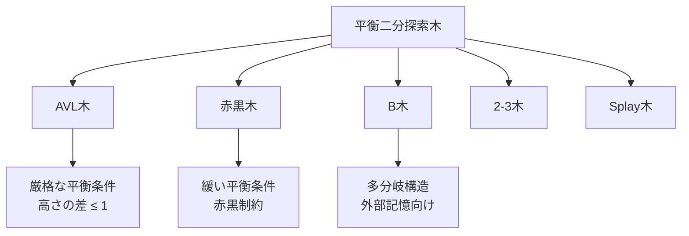
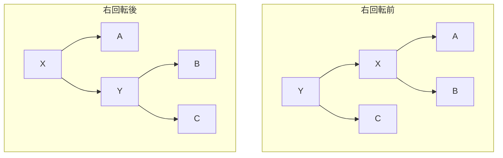
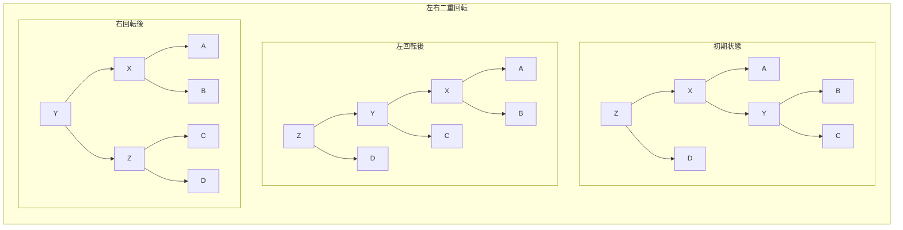
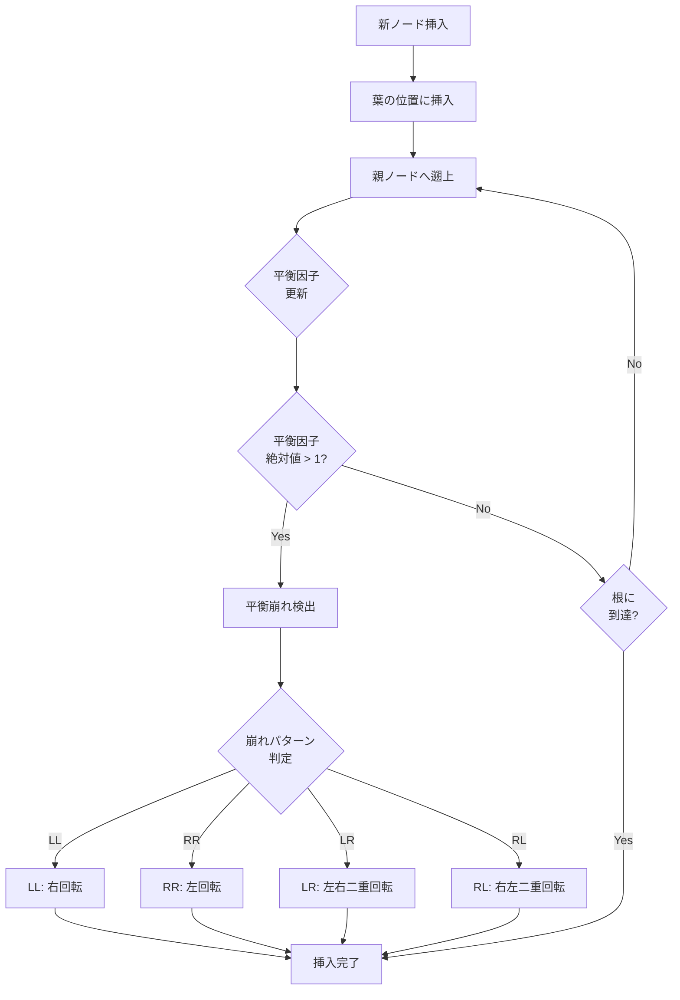
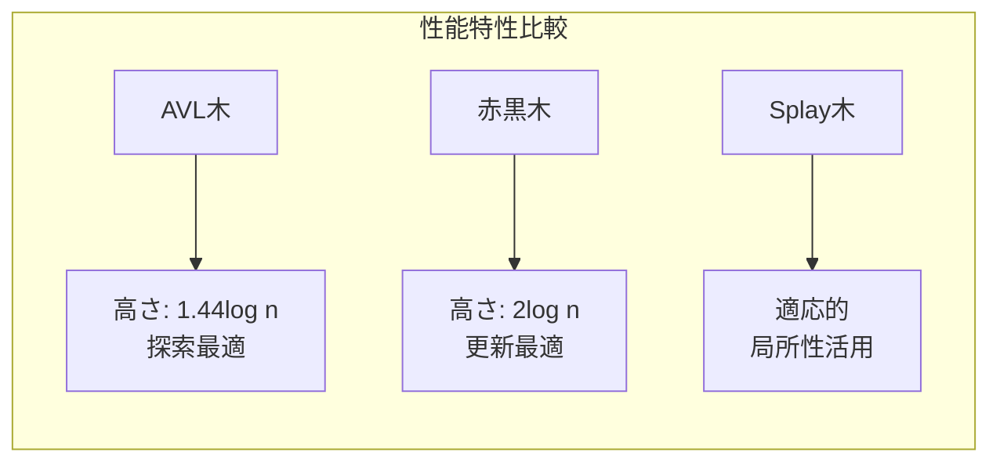

# AVL木

AVL木は、1962年にGeorgy Adelson-VelskyとEvgenii Landisによって考案された、最初の自己平衡二分探索木である[^1]。その名前は考案者二人の頭文字から取られている。AVL木の最大の特徴は、任意のノードにおいて左右の部分木の高さの差が最大でも1に保たれるという平衡条件にある。この厳格な平衡条件により、最悪計算量O(log n)での探索、挿入、削除操作が保証される。

二分探索木の性能は木の形状に大きく依存する。通常の二分探索木では、データの挿入順序によっては木が片側に偏り、最悪の場合には線形リストと同等の構造になってしまう。このような状況では、探索、挿入、削除の計算量がO(n)まで劣化する。AVL木はこの問題を解決するために、各操作の後に木の平衡を保つための再平衡化処理を行う。



## 平衡条件と平衡因子

AVL木の各ノードには、平衡因子（balance factor）と呼ばれる値が暗黙的に存在する。平衡因子は、そのノードの右部分木の高さから左部分木の高さを引いた値として定義される。AVL木では、すべてのノードの平衡因子が-1、0、1のいずれかでなければならない。

平衡因子の計算において、空の部分木の高さは-1と定義される。したがって、葉ノードの平衡因子は常に0となる。また、あるノードの高さは、その左右の部分木の高さの最大値に1を加えたものとして再帰的に定義される。

この平衡条件により、n個のノードを持つAVL木の高さhは以下の不等式を満たす：

```
log₂(n + 1) ≤ h ≤ 1.44 log₂(n + 2) - 0.328
```

この上限は、フィボナッチ数列との関係から導出される。最も偏ったAVL木は、各レベルで最小限のノード数を持つフィボナッチ木と呼ばれる構造になる。

## 回転操作

AVL木の平衡性を維持するための基本操作が回転（rotation）である。回転操作は木の局所的な構造を変更し、二分探索木の性質を保ちながら部分木の高さを調整する。AVL木では4種類の回転操作が使用される。

### 単一回転

単一回転には右回転（right rotation）と左回転（left rotation）の2種類がある。右回転は、あるノードとその左の子ノードの関係を変更し、左の子ノードを新しい根とする操作である。左回転はその鏡像の操作となる。



単一回転の重要な性質は、回転の前後で中順走査（in-order traversal）の結果が変わらないことである。これにより二分探索木の性質が保たれる。上図の例では、回転前も回転後も中順走査の結果はA, X, B, Y, Cとなる。

### 二重回転

二重回転は、単一回転では平衡が回復できない場合に使用される。左右二重回転（left-right rotation）は、まず左回転を行ってから右回転を行う操作であり、右左二重回転（right-left rotation）はその逆の操作である。



## 挿入操作

AVL木への挿入は、通常の二分探索木への挿入に続いて、必要に応じて再平衡化を行う二段階の処理となる。まず、新しいノードを二分探索木の規則に従って葉の位置に挿入する。その後、挿入位置から根に向かって経路を辿り、各ノードの平衡因子を更新しながら、平衡条件が崩れた最初のノードを探す。

平衡条件が崩れたノードが見つかった場合、そのノードを根とする部分木に対して適切な回転操作を適用する。崩れ方には4つのパターンがあり、それぞれに対応する回転操作が定められている。

挿入によって平衡が崩れるパターンは以下の4つに分類される：

1. **左左（LL）ケース**: 左の子の左部分木への挿入により平衡が崩れた場合。右回転で解決する。
2. **右右（RR）ケース**: 右の子の右部分木への挿入により平衡が崩れた場合。左回転で解決する。
3. **左右（LR）ケース**: 左の子の右部分木への挿入により平衡が崩れた場合。左右二重回転で解決する。
4. **右左（RL）ケース**: 右の子の左部分木への挿入により平衡が崩れた場合。右左二重回転で解決する。



重要な性質として、AVL木への1回の挿入で必要となる回転は最大でも1回（二重回転の場合は2回の単一回転）である。これは、回転操作によって部分木の高さが元に戻るため、それより上位のノードの平衡因子に影響を与えないためである。

## 削除操作

AVL木からの削除は挿入よりも複雑である。まず通常の二分探索木と同様に、削除対象のノードを見つけて削除する。削除するノードが内部ノードの場合は、その中順後続ノード（in-order successor）または中順先行ノード（in-order predecessor）と値を交換してから、葉ノードまたは子を1つだけ持つノードとして削除する。

削除後の再平衡化では、削除された位置から根に向かって経路を辿り、各ノードの平衡因子を更新する。挿入と異なり、削除では複数のノードで平衡が崩れる可能性があり、最悪の場合は根まですべてのノードで回転が必要になることがある。

削除における平衡の崩れは、以下の条件で発生する：

- あるノードの平衡因子が-2または2になった場合
- このとき、平衡因子の符号と反対側の子ノードの構造に基づいて回転方法を決定する

削除時の回転選択は、重い方の部分木の構造に依存する。例えば、右部分木が重い（平衡因子が2）場合：

- 右の子の平衡因子が0または1なら左回転
- 右の子の平衡因子が-1なら右左二重回転

削除操作の計算量は、最悪の場合でもO(log n)である。ただし、定数係数は挿入よりも大きくなる傾向がある。これは、削除では最悪の場合に根までのすべてのノードで回転が必要になる可能性があるためである。

## 実装上の考慮事項

AVL木の実装では、各ノードに高さまたは平衡因子を保存する必要がある。高さを保存する方法は実装が直感的で、デバッグが容易である。一方、平衡因子を直接保存する方法は、メモリ効率が良く（2ビットで表現可能）、更新処理が若干高速になる利点がある。

```c
// Height-based implementation
struct AVLNode {
    int key;
    struct AVLNode *left;
    struct AVLNode *right;
    int height;
};

// Balance factor-based implementation
struct AVLNode {
    int key;
    struct AVLNode *left;
    struct AVLNode *right;
    signed char balance_factor; // -1, 0, or 1
};
```

実装の最適化として、以下の技術が使用される：

1. **センチネルノード**: NULLポインタの代わりにセンチネルノードを使用することで、境界条件の処理を簡略化できる。

2. **親ポインタ**: 各ノードに親へのポインタを持たせることで、挿入・削除後の遡上処理を簡略化できる。ただし、メモリ使用量が増加する。

3. **遅延更新**: 平衡因子や高さの更新を遅延させ、必要になったときにのみ計算する方法。読み取り操作が多い場合に有効。

4. **スレッド化**: Morrisの中順走査アルゴリズムのように、NULLポインタを利用してスレッドを作成し、走査を高速化する。

メモリ管理の観点では、ノードの割り当てと解放の効率が重要である。頻繁な挿入・削除が行われる場合、メモリプールやカスタムアロケータの使用により性能を改善できる。また、キャッシュ効率を考慮したノードレイアウトの最適化も重要である。

## 性能特性と計算量解析

AVL木の各操作の時間計算量は以下の通りである：

- **探索**: O(log n) - 最悪ケースでも保証
- **挿入**: O(log n) - 探索 + 最大1回の回転
- **削除**: O(log n) - 探索 + 最大O(log n)回の回転
- **最小値/最大値**: O(log n)
- **中順走査**: O(n)

空間計算量は、各ノードに高さまたは平衡因子を保存する必要があるため、O(n)となる。再帰的な実装では、スタック空間としてO(log n)の追加メモリが必要となる。

AVL木の高さの上限1.44 log₂(n)は理論的に興味深い性質である。この値は、最悪ケースのAVL木がフィボナッチ木と呼ばれる構造を取ることから導かれる。フィボナッチ木は、各レベルで可能な限り少ないノード数を持つAVL木である。

実際のアプリケーションでは、AVL木の高さは理論的上限よりもかなり低くなることが多い。ランダムな挿入順序では、平均的な高さは約1.04 log₂(n)に近づく。これは、完全平衡二分木の高さlog₂(n)に非常に近い値である。

## 他の平衡木との比較

AVL木と他の平衡二分探索木を比較すると、それぞれに長所と短所がある。

**赤黒木との比較**: 赤黒木は1972年にRudolf Bayerによって考案され[^2]、後にLeo J. GuibasとRobert Sedgewickによって現在の形に改良された[^3]。赤黒木はAVL木よりも緩い平衡条件を持ち、最悪ケースの高さは2 log₂(n + 1)となる。この緩い条件により、挿入・削除時の回転回数が少なくなる（挿入時最大2回、削除時最大3回）。そのため、挿入・削除が頻繁に行われるアプリケーションでは赤黒木が有利である。一方、探索性能はAVL木の方が若干優れている。

**B木との比較**: B木は外部記憶装置向けに設計された多分岐の平衡木である。各ノードが複数のキーを持つことで、ディスクアクセス回数を削減する。AVL木は主記憶上での使用に適しているが、B木はデータベースやファイルシステムでの使用に適している。

**Splay木との比較**: Splay木は、Daniel SleatorとRobert Tarjanによって1985年に考案された自己調整二分探索木である[^4]。アクセスされたノードを根に移動させることで、頻繁にアクセスされるノードへの高速なアクセスを実現する。最悪計算量はO(n)だが、償却計算量はO(log n)となる。アクセスパターンに偏りがある場合はSplay木が有効だが、最悪ケースの保証が必要な場合はAVL木が適している。



実装の複雑さという観点では、AVL木は赤黒木よりも理解しやすく実装しやすいとされる。これは、AVL木の平衡条件が高さの差という直感的な概念に基づいているためである。一方、赤黒木の色による制約は、初学者にとって理解が困難な場合がある。

AVL木の採用例として、言語処理系の標準ライブラリでの使用がある。例えば、Windows APIのいくつかの内部実装や、一部のデータベースシステムのインデックス構造でAVL木が使用されている。ただし、現代の多くのシステムでは、挿入・削除の性能を重視して赤黒木が採用されることが多い。

並行性の観点では、AVL木は赤黒木と同様に、適切なロック機構を実装することで並行アクセスをサポートできる。細粒度ロックやロックフリーアルゴリズムの研究も行われており、マルチコアプロセッサ環境での効率的な実装が可能である。

永続データ構造としてのAVL木も研究されている。関数型プログラミング言語では、更新時に新しいバージョンの木を作成し、古いバージョンも保持する永続データ構造が重要である。AVL木の構造的性質により、効率的な永続化が可能である。

[^1]: Adelson-Velsky, G.; Landis, E. M. (1962). "An algorithm for the organization of information". Proceedings of the USSR Academy of Sciences (in Russian). 146: 263–266.

[^2]: Bayer, Rudolf (1972). "Symmetric binary B-Trees: Data structure and maintenance algorithms". Acta Informatica. 1 (4): 290–306.

[^3]: Guibas, Leo J.; Sedgewick, Robert (1978). "A Dichromatic Framework for Balanced Trees". Proceedings of the 19th Annual Symposium on Foundations of Computer Science. pp. 8–21.

[^4]: Sleator, Daniel D.; Tarjan, Robert E. (1985). "Self-Adjusting Binary Search Trees". Journal of the ACM. 32 (3): 652–686.