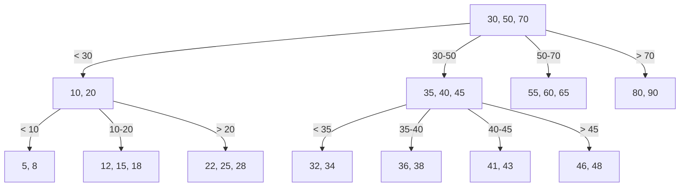
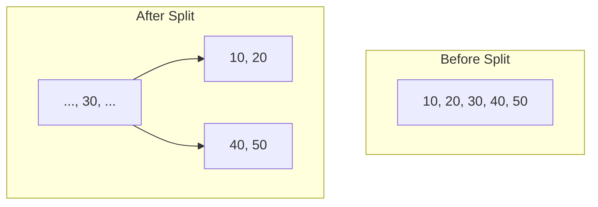
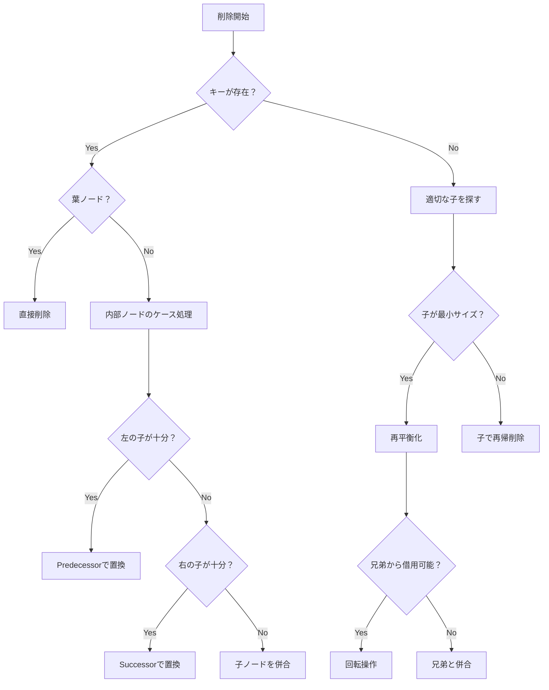
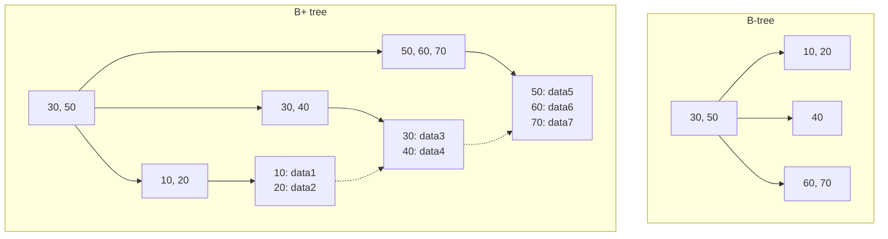

# B木

B木（B-tree）は、1972年にRudolf BayerとEdward M. McCreightによって考案された、自己平衡性を持つ多分木データ構造である¹。データベースシステムやファイルシステムにおいて、大量のデータを効率的に管理するための基礎技術として広く採用されている。B木の最も重要な特徴は、ディスクなどの外部記憶装置へのアクセス回数を最小化しながら、検索・挿入・削除の各操作を対数時間で実行できることである。

コンピュータシステムにおけるメモリ階層は、高速だが容量の小さいキャッシュメモリから、低速だが大容量のハードディスクまで、多層構造を形成している。この階層間でのデータ転送速度の差は極めて大きく、例えばメインメモリへのアクセスは数十ナノ秒で完了するのに対し、ハードディスクへのアクセスは数ミリ秒を要する。つまり、約10万倍もの速度差が存在する。このような環境下で、外部記憶装置に格納された大規模なデータセットに対して効率的にアクセスするためには、ディスクI/O回数を最小化することが性能上の最重要課題となる。

B木は、この課題に対する解決策として設計された。各ノードが複数のキーと子ノードへのポインタを保持できるようにすることで、木の高さを低く抑え、結果としてディスクアクセス回数を削減している。一般的な二分探索木では、各ノードが1つのキーしか持たないため、$n$個の要素を格納した場合の木の高さは$O(\log_2 n)$となる。一方、B木では各ノードが$t-1$個から$2t-1$個のキーを持つため（$t$は最小次数）、木の高さは$O(\log_t n)$となり、大幅に低くなる。

## B木の形式的定義と構造

B木の正確な定義は、その最小次数$t$（$t \geq 2$）によって特徴付けられる²。最小次数$t$のB木は以下の性質を満たす：

1. すべての葉ノードは同じ深さに存在する
2. 根以外の各ノードは少なくとも$t-1$個、最大で$2t-1$個のキーを含む
3. 根は少なくとも1個のキーを含む（木が空でない場合）
4. 内部ノード（葉でないノード）がk個のキーを持つ場合、k+1個の子を持つ
5. ノード内のキーは昇順にソートされている
6. 各キーは、その左右の部分木を分離する：キーの左側の部分木のすべての値はそのキーより小さく、右側の部分木のすべての値はそのキーより大きい



この例は最小次数$t=3$のB木を示している。各内部ノードは2個から5個のキーを持ち、3個から6個の子を持つ。すべての葉ノードが同じ深さ（レベル2）に存在することに注目されたい。

B木の構造は、外部記憶装置の物理的特性を考慮して設計されている。ディスクは通常、固定サイズのブロック（セクタ）単位でデータを読み書きする。B木の各ノードのサイズをディスクブロックのサイズに合わせることで、1回のディスクI/Oで1つのノード全体を読み込むことができる。例えば、4KBのディスクブロックサイズで、各キーが8バイト、各ポインタが8バイトの場合、1つのノードには約250個のキーを格納できる。これにより、10億個の要素を格納しても木の高さは4程度に抑えられる。

## 検索操作

B木における検索操作は、二分探索木の検索を多分木に拡張したものである。根ノードから開始し、探索キーと各ノード内のキーを比較しながら、適切な子ノードへと降下していく。

```python
def search(node, key):
    i = 0
    # Find the first key greater than or equal to the search key
    while i < node.n and key > node.keys[i]:
        i += 1
    
    # Check if the key is found
    if i < node.n and key == node.keys[i]:
        return (node, i)
    
    # If this is a leaf node, the key is not in the tree
    if node.is_leaf:
        return None
    
    # Recursively search the appropriate child
    # Read child from disk if necessary
    child = disk_read(node.children[i])
    return search(child, key)
```

検索操作の時間計算量は$O(t \log_t n)$である。ここで、$O(t)$は各ノード内での線形探索（または二分探索を使用した場合は$O(\log t)$）の時間であり、$O(\log_t n)$は木の高さである。しかし、実際の性能において重要なのはディスクI/O回数であり、これは木の高さ$O(\log_t n)$に比例する。

## 挿入操作

B木への挿入は、単純な二分探索木への挿入よりも複雑である。なぜなら、ノードが満杯（$2t-1$個のキーを持つ）になった場合、それを分割する必要があるからである。B木では、挿入時に満杯のノードに遭遇した場合、事前にそのノードを分割してから挿入を続ける「事前分割」戦略を採用することが多い。



満杯のノードを分割する際は、中央のキー（この例では30）を親ノードに昇格させ、残りのキーを2つの新しいノードに分配する。この操作により、各ノードが最小次数の制約を満たすことが保証される。

挿入アルゴリズムの基本的な流れは以下の通りである：

1. 根から葉に向かって適切な挿入位置を探索する
2. 途中で満杯のノードに遭遇した場合、それを分割する
3. 葉ノードに到達したら、新しいキーを挿入する
4. 根が満杯で分割が必要な場合、新しい根を作成する（これが木の高さが増加する唯一の場合）

```python
def insert_non_full(node, key):
    i = node.n - 1
    
    if node.is_leaf:
        # Shift keys to make room for the new key
        while i >= 0 and key < node.keys[i]:
            node.keys[i + 1] = node.keys[i]
            i -= 1
        node.keys[i + 1] = key
        node.n += 1
        disk_write(node)
    else:
        # Find the child to insert into
        while i >= 0 and key < node.keys[i]:
            i -= 1
        i += 1
        
        child = disk_read(node.children[i])
        if child.n == 2 * t - 1:
            # Child is full, split it
            split_child(node, i, child)
            if key > node.keys[i]:
                i += 1
        
        child = disk_read(node.children[i])
        insert_non_full(child, key)
```

挿入操作の時間計算量は$O(t \log_t n)$であり、ディスクI/O回数は$O(\log_t n)$である。重要な点は、B木では挿入によって木の構造が大きく変化することがあるが、常に平衡性が保たれることである。

## 削除操作

B木からの削除は、挿入よりもさらに複雑である。削除によってノードのキー数が最小値を下回る可能性があるため、隣接ノードからのキーの借用や、ノードの併合といった操作が必要になる場合がある。削除操作は、削除対象のキーが存在する位置によって、以下の3つのケースに分類される：

**ケース1: キーが葉ノードに存在する場合**
最も単純なケースで、キーを直接削除する。ただし、削除後もノードが最小キー数の制約を満たすことを確認する必要がある。

**ケース2: キーが内部ノードに存在する場合**
このケースはさらに3つのサブケースに分かれる：

2a. キーの左側の子ノードが少なくとも$t$個のキーを持つ場合、その子ノードから最大のキー（predecessor）を見つけ、削除対象のキーと置き換える。その後、predecessorを再帰的に削除する。

2b. キーの右側の子ノードが少なくとも$t$個のキーを持つ場合、その子ノードから最小のキー（successor）を見つけ、削除対象のキーと置き換える。その後、successorを再帰的に削除する。

2c. 両方の子ノードが正確に$t-1$個のキーしか持たない場合、削除対象のキーとその右側の子ノードを左側の子ノードに併合する。これにより、子ノードは$2t-1$個のキーを持つことになる。その後、併合されたノードから元のキーを再帰的に削除する。

**ケース3: キーが現在のノードに存在しない場合**
適切な子ノードに降下して削除を続ける必要があるが、その前に子ノードが最小キー数の制約を満たしていることを確認する。もし子ノードが正確に$t-1$個のキーしか持たない場合、以下の操作を行う：

3a. 隣接する兄弟ノードが少なくとも$t$個のキーを持つ場合、現在のノードから1つのキーを子ノードに降ろし、兄弟ノードから1つのキーを現在のノードに昇格させる（回転操作）。

3b. すべての隣接兄弟ノードが正確に$t-1$個のキーしか持たない場合、子ノードを兄弟ノードの1つと併合する。



削除操作の実装は複雑だが、その本質は木の平衡性を保ちながら、各ノードが最小キー数の制約を満たすことを保証することにある。この制約により、木の高さが$O(\log_t n)$に保たれ、効率的な操作が可能となる。

## B+木との比較

B木の派生形として最も重要なのがB+木である。B+木は、すべてのデータを葉ノードに格納し、内部ノードはインデックスとしてのみ機能する構造を持つ。この設計により、B+木は特にデータベースシステムにおいて以下の利点を提供する：

1. **範囲検索の効率性**: B+木では、葉ノードが連結リストで接続されているため、範囲検索が非常に効率的である。開始キーを見つけた後は、リンクをたどるだけで連続したデータにアクセスできる。

2. **一貫したアクセスパス**: すべてのデータが葉ノードに存在するため、どのキーへのアクセスも必ず根から葉までのパスをたどる。これにより、アクセス時間の予測可能性が向上する。

3. **キャッシュ効率**: 内部ノードにはキーとポインタのみが格納されるため、より多くのエントリを1つのノードに収めることができる。これにより、同じメモリサイズでより多くのインデックス情報をキャッシュできる。



一方で、B木にもB+木に対する利点がある。単一キーの検索においては、B木の方が効率的な場合がある。なぜなら、探しているキーが内部ノードに存在する場合、葉まで降下する必要がないからである。また、B木は各キーを一度だけ格納するため、同じキーを内部ノードと葉ノードの両方に格納するB+木よりも空間効率が良い場合がある。

## 実装上の考慮事項

B木を実装する際には、理論的な正確性だけでなく、実際のシステムにおける性能を考慮する必要がある。以下に主要な実装上の考慮事項を挙げる：

**ノードサイズの選択**
ノードサイズは、使用する記憶媒体のブロックサイズに合わせることが重要である。現代のSSDでは4KBまたは8KBのページサイズが一般的であり、これに合わせてノードサイズを設定する。ただし、ノードヘッダやメタデータのオーバーヘッドも考慮する必要がある。

**キーの圧縮**
特に文字列キーを扱う場合、プレフィックス圧縮やサフィックス切り詰めなどの技術を使用してノードあたりのキー数を増やすことができる。例えば、辞書順に並んだ文字列では、隣接するキー間で共通のプレフィックスを共有することが多い。

**バッファ管理**
データベースシステムでは、B木のノードをメモリ内にキャッシュするバッファプールを実装する。LRU（Least Recently Used）やCLOCKアルゴリズムなどの置換戦略を使用して、頻繁にアクセスされるノードをメモリ内に保持する。

**並行制御**
マルチスレッド環境では、B木への同時アクセスを制御する必要がある。ラッチカップリング（latch coupling）やB-link木などの技術を使用して、並行性を高めながら一貫性を保つ。

**ログとリカバリ**
データベースシステムでは、B木の操作をWAL（Write-Ahead Logging）に記録し、システム障害時のリカバリを可能にする。特に、ノードの分割や併合などの複数ページにまたがる操作では、原子性を保証するための特別な配慮が必要である。

## 性能特性とトレードオフ

B木の性能は、多くの要因に依存する。理論的な時間計算量は操作あたり$O(\log_t n)$だが、実際の性能はワークロードの特性、ハードウェアの性能、実装の品質などに大きく影響される。

**ワークロードの特性**
読み取り中心のワークロードでは、高い分岐因子（大きな$t$）を選択してより浅い木を作ることが有利である。一方、更新が頻繁なワークロードでは、ノードの分割や併合のコストを考慮して、適度な分岐因子を選択する必要がある。

**局所性の活用**
B木は空間的局所性と時間的局所性の両方を活用する。範囲検索では、連続したキーが同じノードまたは近接したノードに格納されているため、キャッシュ効率が良い。また、頻繁にアクセスされる上位ノードはメモリ内に留まりやすい。

**書き込み増幅**
B木の更新操作は、最悪の場合、根から葉までのパス上のすべてのノードを変更する可能性がある。これは「書き込み増幅」と呼ばれ、特にSSDのような書き込み回数に制限のある記憶媒体では問題となる。LSM木（Log-Structured Merge-tree）などの代替データ構造は、この問題に対処するために設計されている。

## 実践的な応用

B木とその派生形は、現代のコンピュータシステムの至るところで使用されている。以下に主要な応用例を示す：

**データベース管理システム**
ほぼすべての関係データベース管理システム（PostgreSQL、MySQL、Oracle、SQL Serverなど）は、インデックス構造としてB+木を使用している³。プライマリインデックス、セカンダリインデックス、クラスタードインデックスなど、様々な形でB木技術が活用されている。

**ファイルシステム**
多くのファイルシステム（HFS+、NTFS、Btrfs、ext4のエクステントツリーなど）は、ファイルやディレクトリのメタデータを管理するためにB木を使用している。特にBtrfsは、その名前が示すように、B木を中心に設計されたファイルシステムである。

**キーバリューストア**
RocksDBやLevelDBなどのキーバリューストアは、LSM木を主要なデータ構造として使用しているが、各レベルのSSTファイル内ではB木に似た構造を使用してデータを組織化している。

B木の発明から50年以上が経過した現在でも、その基本的な設計原理は変わらず有効である。メモリ階層の存在、ブロック単位のI/O、平衡木の必要性といった基本的な制約は、技術の進歩にもかかわらず本質的に変わっていない。むしろ、データ量の爆発的な増加により、効率的なインデックス構造の重要性はますます高まっている。新しいハードウェア技術（NVMeやPersistent Memoryなど）の登場に伴い、B木の実装も進化を続けているが、その根底にある原理は今後も長く活用され続けるだろう。

---

¹ Bayer, R., & McCreight, E. (1972). Organization and maintenance of large ordered indices. Acta Informatica, 1(3), 173-189.

² Cormen, T. H., Leiserson, C. E., Rivest, R. L., & Stein, C. (2009). Introduction to Algorithms (3rd ed.). MIT Press. Chapter 18: B-Trees.

³ Ramakrishnan, R., & Gehrke, J. (2003). Database Management Systems (3rd ed.). McGraw-Hill. Chapter 10: Tree-Structured Indexing.