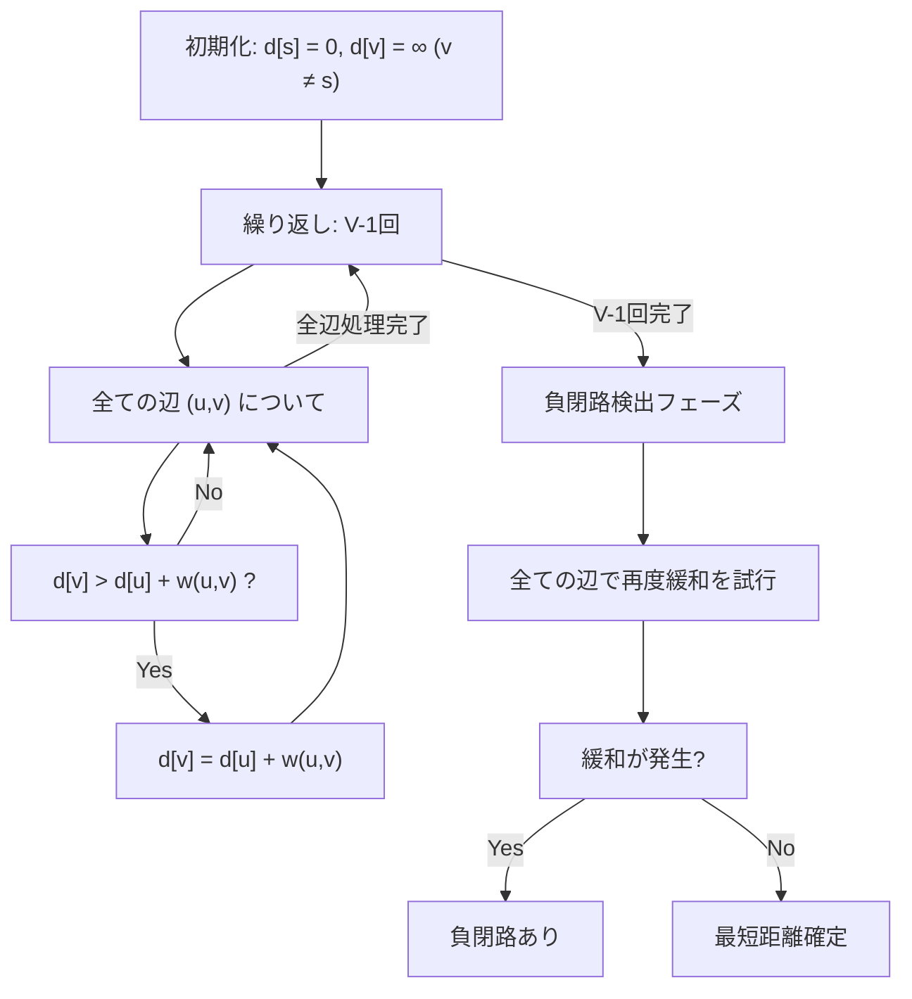
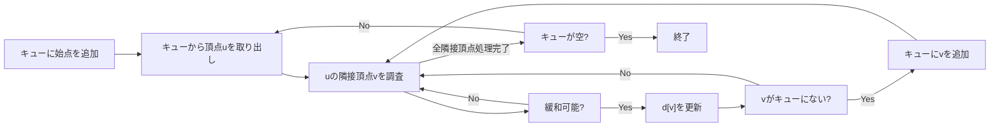
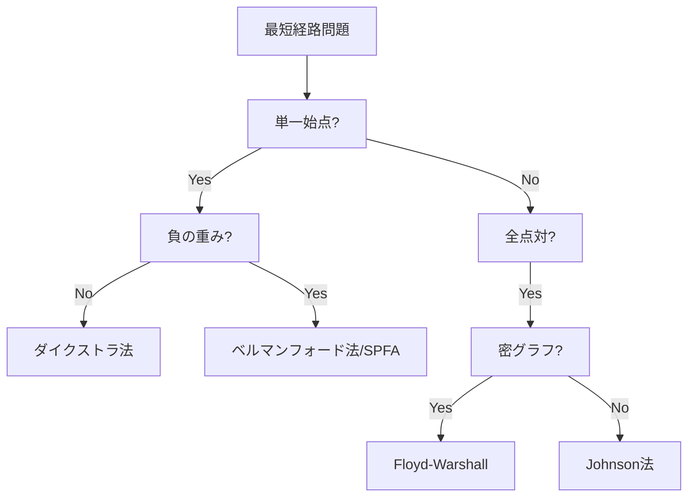

# ベルマンフォード法

ベルマンフォード法（Bellman-Ford algorithm）は、単一始点最短経路問題を解くアルゴリズムであり、1958年にリチャード・ベルマンとレスター・フォードによって独立に発見された¹。このアルゴリズムの最大の特徴は、辺の重みが負であっても正しく動作する点にあり、さらに負閉路の検出も可能である。グラフ理論における基本的なアルゴリズムの一つとして、ネットワークルーティング、経済モデル、競技プログラミングなど幅広い分野で応用されている。

ダイクストラ法が非負の重みを持つグラフに特化した効率的なアルゴリズムであるのに対し、ベルマンフォード法はより一般的な状況に対応できる汎用性を持つ。その代償として計算量はO(VE)となり、密グラフではO(V³)の時間がかかるが、この計算量の増加は負の重みを扱える柔軟性と引き換えに受け入れられるトレードオフである。

## アルゴリズムの基本原理

ベルマンフォード法の中核となる考え方は、最短経路の部分構造最適性（optimal substructure）を利用した動的計画法である。始点sから頂点vへの最短経路が存在するとき、その経路上の任意の中間頂点uに対して、sからuへの部分経路もまた最短経路となる。この性質を利用して、経路長の上限を段階的に緩和（relaxation）していくことで最短距離を求める。



アルゴリズムは大きく2つのフェーズから構成される。第1フェーズでは、始点からの距離を表す配列d[]を初期化し、V-1回の繰り返しで全ての辺について緩和操作を行う。ここでVは頂点数を表す。なぜV-1回なのかという疑問は自然に生じるが、これは最短経路が高々V-1本の辺から構成されるという事実に基づいている。単純経路（同じ頂点を2度通らない経路）はV個の頂点を持つグラフで最大V-1本の辺を含むため、V-1回の繰り返しで全ての最短経路が発見される。

第2フェーズは負閉路の検出である。V-1回の繰り返し後、さらにもう一度全ての辺について緩和を試みる。この時点で緩和が成功する場合、それは負閉路の存在を意味する。なぜなら、負閉路が存在しない場合はV-1回の繰り返しで最短距離が確定しているはずだからである。

## 数学的定式化と正当性の証明

グラフG = (V, E)において、頂点集合V = {v₁, v₂, ..., vₙ}、辺集合E ⊆ V × V、重み関数w: E → ℝとする。始点をsとし、d[v]を始点sから頂点vへの距離の上界とする。最短距離をδ(s, v)で表す。

**補題1（三角不等式）**: 任意の辺(u, v) ∈ Eに対して、δ(s, v) ≤ δ(s, u) + w(u, v)が成立する。

この補題は最短経路の定義から直ちに従う。もしδ(s, v) > δ(s, u) + w(u, v)ならば、sからuを経由してvに至る経路の方が短くなり、δ(s, v)が最短距離であることに矛盾する。

**定理1（収束性）**: 負閉路が存在しない場合、ベルマンフォード法はV-1回の繰り返し後に全ての頂点vに対してd[v] = δ(s, v)となる。

証明は数学的帰納法による。kを繰り返し回数とし、Pₖ(v)を「k回の繰り返し後、高々k本の辺を使う最短経路の長さがd[v]に格納されている」という命題とする。

基底: k = 0のとき、d[s] = 0 = δ(s, s)であり、他の頂点vに対してはd[v] = ∞となる。これは0本の辺を使う経路が存在しないことを正しく表している。

帰納段階: Pₖ₋₁が真であると仮定する。k回目の繰り返しで、辺(u, v)に対する緩和操作を考える。もしsからvへの最短経路がk本以下の辺を使うなら、その経路は以下の2つのケースに分類される：
1. k-1本以下の辺を使う：帰納法の仮定よりd[v]は既に正しい値
2. ちょうどk本の辺を使う：最後の辺を(u, v)とすると、sからuへの部分経路はk-1本の辺を使うため、帰納法の仮定よりd[u] = δ(s, u)。緩和操作によりd[v] = d[u] + w(u, v) = δ(s, u) + w(u, v) = δ(s, v)となる。

したがってPₖが成立し、特にk = V-1のときに全ての最短経路が発見される。

## 実装の詳細と最適化

ベルマンフォード法の基本実装は直感的である。以下にC++による実装例を示す：

```cpp
struct Edge {
    int from, to;
    long long cost;
};

vector<long long> bellman_ford(int n, const vector<Edge>& edges, int start) {
    const long long INF = 1e18;
    vector<long long> dist(n, INF);
    dist[start] = 0;
    
    // Main phase: relax edges V-1 times
    for (int i = 0; i < n - 1; i++) {
        for (const auto& e : edges) {
            if (dist[e.from] != INF && dist[e.from] + e.cost < dist[e.to]) {
                dist[e.to] = dist[e.from] + e.cost;
            }
        }
    }
    
    // Negative cycle detection phase
    vector<bool> negative(n, false);
    for (int i = 0; i < n; i++) {
        for (const auto& e : edges) {
            if (dist[e.from] != INF && dist[e.from] + e.cost < dist[e.to]) {
                dist[e.to] = dist[e.from] + e.cost;
                negative[e.to] = true;
            }
            if (negative[e.from]) {
                negative[e.to] = true;
            }
        }
    }
    
    // Mark all vertices affected by negative cycles as -INF
    for (int i = 0; i < n; i++) {
        if (negative[i]) {
            dist[i] = -INF;
        }
    }
    
    return dist;
}
```

この実装にはいくつかの重要な考慮点がある。まず、無限大の値としてINFを使用しているが、これは`dist[e.from] + e.cost`のオーバーフローを防ぐため十分大きく、かつ2倍してもオーバーフローしない値を選ぶ必要がある。実際の競技プログラミングでは、問題の制約に応じて適切な値を設定する。

負閉路の検出と影響範囲の特定も重要である。単に負閉路の存在を検出するだけでなく、どの頂点が負閉路の影響を受けるかを正確に判定する必要がある。上記の実装では、負閉路検出フェーズをn回繰り返すことで、負閉路から到達可能な全ての頂点を確実にマークしている。

## SPFA（Shortest Path Faster Algorithm）による最適化

SPFAは1994年に段凡丁（Duan Fanding）によって提案されたベルマンフォード法の最適化版である²。基本的なアイデアは、距離が更新された頂点に隣接する辺のみを次の繰り返しで調べることで、無駄な緩和操作を削減することである。



SPFAの平均的な時間計算量はO(kE)となり、実用的な多くのグラフでk ≈ 2程度となることが経験的に知られている。しかし、最悪計算量は依然としてO(VE)であり、特定の構造を持つグラフでは通常のベルマンフォード法と同等の性能となる。

```cpp
vector<long long> spfa(int n, const vector<vector<pair<int, long long>>>& graph, int start) {
    const long long INF = 1e18;
    vector<long long> dist(n, INF);
    vector<bool> in_queue(n, false);
    vector<int> count(n, 0);
    queue<int> q;
    
    dist[start] = 0;
    q.push(start);
    in_queue[start] = true;
    
    while (!q.empty()) {
        int u = q.front();
        q.pop();
        in_queue[u] = false;
        
        for (auto [v, cost] : graph[u]) {
            if (dist[u] + cost < dist[v]) {
                dist[v] = dist[u] + cost;
                if (!in_queue[v]) {
                    q.push(v);
                    in_queue[v] = true;
                    count[v]++;
                    
                    // Negative cycle detection
                    if (count[v] >= n) {
                        return vector<long long>();  // Negative cycle exists
                    }
                }
            }
        }
    }
    
    return dist;
}
```

SPFAの実装では、各頂点がキューに入る回数をカウントすることで負閉路を検出している。ある頂点がn回以上キューに入る場合、それは負閉路の存在を示している。

## 制約付き最短経路問題への応用

ベルマンフォード法の動的計画法的な性質は、様々な制約条件を持つ最短経路問題への拡張を可能にする。特に重要なのは、使用する辺数に制約がある場合の最短経路問題である。

例えば、「ちょうどk本の辺を使う最短経路」や「高々k本の辺を使う最短経路」を求める問題は、ベルマンフォード法の自然な拡張として解くことができる。状態をdp[i][v] = 「i本の辺を使ってsからvに至る最短距離」として定義すると、以下の漸化式が成立する：

dp[i][v] = min{dp[i-1][u] + w(u, v) | (u, v) ∈ E}

この拡張は、航空路線の乗り継ぎ回数制限や、ネットワークのホップ数制限など、実世界の問題に直接適用できる。

## 分散システムにおけるベルマンフォード法

ベルマンフォード法は、その構造から分散実装に適している。各頂点が自身の距離情報を保持し、隣接頂点と情報交換することで最短距離を計算できる。これは、インターネットのルーティングプロトコルであるRIP（Routing Information Protocol）の基礎となっている³。

分散ベルマンフォード法では、各ノードiが以下の処理を非同期に実行する：

1. 自身の距離ベクトルDᵢ = [Dᵢ(1), Dᵢ(2), ..., Dᵢ(n)]を保持
2. 隣接ノードjから距離ベクトルDⱼを受信
3. Dᵢ(k) = min{Dᵢ(k), Dᵢ(j) + w(i,j) + Dⱼ(k)}で更新
4. 更新があれば隣接ノードに新しい距離ベクトルを送信

この分散アルゴリズムは、カウント・トゥ・インフィニティ問題などの課題を抱えているが、適切な改良（スプリットホライズン、ルートポイズニングなど）により実用的なプロトコルとなっている。

## 通貨裁定取引への応用

ベルマンフォード法の興味深い応用例として、外国為替市場における裁定取引の検出がある。通貨iから通貨jへの為替レートをrᵢⱼとすると、通貨の循環取引で利益を得られる条件は：

rᵢ₁,ᵢ₂ × rᵢ₂,ᵢ₃ × ... × rᵢₖ,ᵢ₁ > 1

これは対数を取ることで：

log(rᵢ₁,ᵢ₂) + log(rᵢ₂,ᵢ₃) + ... + log(rᵢₖ,ᵢ₁) > 0

となり、-log(rᵢⱼ)を辺の重みとすることで、負閉路検出問題に帰着される。

```cpp
bool detect_arbitrage(const vector<vector<double>>& rates) {
    int n = rates.size();
    vector<Edge> edges;
    
    // Convert exchange rates to edge weights
    for (int i = 0; i < n; i++) {
        for (int j = 0; j < n; j++) {
            if (i != j && rates[i][j] > 0) {
                edges.push_back({i, j, -log(rates[i][j])});
            }
        }
    }
    
    // Run Bellman-Ford from arbitrary start vertex
    auto dist = bellman_ford(n, edges, 0);
    
    // Check for negative cycles
    for (const auto& e : edges) {
        if (dist[e.from] != INF && dist[e.from] + e.cost < dist[e.to]) {
            return true;  // Arbitrage opportunity exists
        }
    }
    
    return false;
}
```

この応用は、金融工学における理論と実践の橋渡しとなる好例である。実際の市場では取引手数料や時間遅延などの要因も考慮する必要があるが、基本的なモデルとしてベルマンフォード法が活用されている。

## 差分制約系の解法

ベルマンフォード法のもう一つの重要な応用は、差分制約系（system of difference constraints）の解法である。n個の変数x₁, x₂, ..., xₙに対して、以下の形式の不等式制約が与えられる：

xⱼ - xᵢ ≤ bᵢⱼ

この制約系は、頂点集合V = {v₀, v₁, ..., vₙ}、辺(vᵢ, vⱼ)の重みをbᵢⱼとするグラフの最短経路問題として解釈できる。超頂点v₀から全ての頂点への重み0の辺を追加し、v₀を始点としてベルマンフォード法を実行すると：

- 負閉路が存在する場合：制約系に解なし
- 負閉路が存在しない場合：d[vᵢ] = xᵢが実行可能解

この手法は、スケジューリング問題やVLSI設計における制約充足問題など、様々な分野で応用されている。

## 実装上の注意点とデバッグ手法

ベルマンフォード法の実装では、以下の点に特に注意を払う必要がある：

**オーバーフロー対策**: 距離の更新時にオーバーフローが発生する可能性がある。特に、INFに近い値同士の加算は危険である。実装では`dist[u] != INF`のチェックを必ず行い、到達不可能な頂点からの緩和を防ぐ。

**負閉路の影響範囲**: 負閉路が存在する場合、その影響を受ける頂点を正確に特定する必要がある。単純に1回の追加緩和では不十分で、負閉路から到達可能な全頂点をマークするにはV回の伝播が必要となる場合がある。

**浮動小数点数の扱い**: 通貨裁定取引のような応用では浮動小数点数を扱うが、比較時の誤差に注意が必要である。適切なイプシロン値を設定し、`abs(a - b) < eps`の形で比較を行う。

デバッグ時には、各繰り返しでの距離配列の変化を追跡することが有効である。特に、どの辺で緩和が発生したかを記録することで、アルゴリズムの動作を詳細に理解できる。

## パフォーマンス特性と実用上の考察

ベルマンフォード法の時間計算量O(VE)は、密グラフではO(V³)となり、大規模グラフでは計算時間が問題となる。実際の使用では、以下の観点から適用可能性を判断する：

**グラフの疎密**: 疎グラフ（E = O(V)）では実用的な速度で動作する。一方、密グラフではダイクストラ法（負の重みがない場合）やJohnsonのアルゴリズム（全点対最短経路）の使用を検討すべきである。

**負の重みの必要性**: 問題設定で本当に負の重みが必要かを再検討する。例えば、コストを「利益の最大化」から「損失の最小化」に変換することで、非負の重みで表現できる場合がある。

**早期終了の可能性**: ある繰り返しで緩和が一切発生しなかった場合、それ以降の繰り返しも不要である。この最適化により、実際の実行時間を大幅に削減できる場合がある。

```cpp
bool improved = true;
for (int i = 0; i < n - 1 && improved; i++) {
    improved = false;
    for (const auto& e : edges) {
        if (dist[e.from] != INF && dist[e.from] + e.cost < dist[e.to]) {
            dist[e.to] = dist[e.from] + e.cost;
            improved = true;
        }
    }
}
```

## 理論的発展と関連アルゴリズム

ベルマンフォード法は、グラフアルゴリズムの発展において重要な位置を占めている。特に以下のアルゴリズムとの関連は深い：

**Johnsonのアルゴリズム**: 全点対最短経路問題を効率的に解くため、ベルマンフォード法でポテンシャル関数を計算し、辺の重みを非負に変換してからダイクストラ法を適用する。時間計算量はO(V²log V + VE)となる。

**Goldberg-Radzikのアルゴリズム**: 負閉路を含まないグラフに対して、最悪計算量O(VE)を保ちながら実用的な性能を向上させた改良版。頂点を適切な順序で処理することで、多くの場合で高速化を実現する⁴。

**並列ベルマンフォード法**: GPUやマルチコアCPUを活用した並列実装の研究が進んでいる。辺の緩和操作は本質的に並列化可能であり、適切な同期機構により高速化が可能である。

これらの発展は、ベルマンフォード法の基本原理が持つ普遍性と拡張可能性を示している。動的計画法の枠組みと辺の緩和という単純な操作の組み合わせが、多様な問題設定に適応できる柔軟性を生み出している。

## 競技プログラミングにおける典型問題

ベルマンフォード法が活躍する競技プログラミングの問題には、特徴的なパターンがいくつか存在する。これらの問題を理解することで、アルゴリズムの適用場面を的確に判断できるようになる。

**ABC061D - Score Attack**: この問題は負閉路検出の典型例である。頂点1からNへの経路でスコアを最大化する問題だが、正の重みを持つ閉路が存在する場合は無限にスコアを増やせる。これを負の重みに変換してベルマンフォード法を適用し、頂点Nに影響を与える負閉路の有無を判定する。

```cpp
// ABC061D の解法の核心部分
vector<long long> dist(n, LLONG_MAX);
dist[0] = 0;

// V-1回の緩和
for (int i = 0; i < n - 1; i++) {
    for (const auto& e : edges) {
        if (dist[e.from] != LLONG_MAX) {
            dist[e.to] = min(dist[e.to], dist[e.from] + e.cost);
        }
    }
}

// 負閉路がゴールに影響するかチェック
vector<long long> dist2 = dist;
for (int i = 0; i < n; i++) {
    for (const auto& e : edges) {
        if (dist2[e.from] != LLONG_MAX) {
            dist2[e.to] = min(dist2[e.to], dist2[e.from] + e.cost);
        }
    }
}

if (dist[n-1] != dist2[n-1]) {
    // 負閉路がゴールに影響する
    cout << "inf" << endl;
} else {
    cout << -dist[n-1] << endl;
}
```

**CF295B - Greg and Graph**: 頂点を逆順に追加しながら全点対最短経路を求める問題。一見ベルマンフォード法とは無関係に見えるが、動的計画法の考え方を応用した解法が可能である。

## メモリ効率の最適化

大規模グラフを扱う際、メモリ使用量が制約となることがある。ベルマンフォード法では以下の最適化が可能である：

**スライディングウィンドウ技法**: k本の辺を使う最短経路問題では、dp[i][v]の代わりにdp[2][v]を使い、i%2でアクセスすることでメモリをO(V)に削減できる。

```cpp
vector<vector<long long>> dp(2, vector<long long>(n, INF));
dp[0][start] = 0;

for (int i = 1; i <= k; i++) {
    fill(dp[i%2].begin(), dp[i%2].end(), INF);
    for (const auto& e : edges) {
        if (dp[(i-1)%2][e.from] != INF) {
            dp[i%2][e.to] = min(dp[i%2][e.to], 
                                 dp[(i-1)%2][e.from] + e.cost);
        }
    }
}
```

**辺リストの圧縮**: 重複する辺がある場合、最小コストの辺のみを保持することでメモリと計算時間を削減できる。有向グラフでは(u,v)と(v,u)は別の辺として扱う必要があることに注意する。

## 他の最短経路アルゴリズムとの詳細比較

最短経路問題を解くアルゴリズムは複数存在し、それぞれに適した使用場面がある。以下に主要なアルゴリズムとの比較を示す：

| アルゴリズム | 時間計算量 | 負の重み | 負閉路検出 | 空間計算量 | 適用場面 |
|------------|-----------|---------|-----------|-----------|---------|
| ベルマンフォード法 | O(VE) | ○ | ○ | O(V) | 負の重みあり、疎グラフ |
| ダイクストラ法 | O((V+E)log V) | × | × | O(V) | 非負の重み、高速性重視 |
| SPFA | O(kE), k≈2 | ○ | ○ | O(V) | 実用的な負の重みグラフ |
| Floyd-Warshall | O(V³) | ○ | ○ | O(V²) | 全点対、小規模グラフ |
| Johnson | O(V²log V + VE) | ○ | ○ | O(V²) | 全点対、疎グラフ |

アルゴリズム選択の決定木は以下のようになる：



## エラーハンドリングとエッジケース

ベルマンフォード法の実装では、様々なエッジケースに対する適切な処理が必要である：

**グラフが非連結の場合**: 始点から到達不可能な頂点の距離はINFのまま保持される。これらの頂点から出る辺での緩和を防ぐため、`dist[u] != INF`のチェックが必須である。

**自己ループの処理**: 負のコストを持つ自己ループは即座に負閉路となる。入力検証時にチェックすることが推奨される。

```cpp
// 入力検証の例
for (const auto& e : edges) {
    if (e.from == e.to && e.cost < 0) {
        // 負の自己ループを検出
        has_negative_cycle = true;
        break;
    }
}
```

**数値精度の問題**: 浮動小数点数を扱う場合、累積誤差により予期しない動作をすることがある。可能な限り整数演算に変換するか、適切な誤差許容値を設定する。

```cpp
const double EPS = 1e-9;
if (dist[u] + cost < dist[v] - EPS) {
    dist[v] = dist[u] + cost;
}
```

**オーバーフロー対策の詳細**: 単純な加算チェックでは不十分な場合がある。より堅牢な実装では、加算前にオーバーフローの可能性を検証する。

```cpp
bool will_overflow(long long a, long long b) {
    if (b > 0 && a > LLONG_MAX - b) return true;
    if (b < 0 && a < LLONG_MIN - b) return true;
    return false;
}
```

これらの考慮事項を適切に実装することで、ベルマンフォード法は信頼性の高いアルゴリズムとなる。競技プログラミングでは時間制限内での正確な実装が求められるため、これらのパターンを事前に準備しておくことが重要である。

---

¹ Bellman, R. (1958). "On a routing problem". Quarterly of Applied Mathematics. 16: 87–90.  
² Duan, F. (1994). "关于最短路径的SPFA快速算法". 西南交通大学学报. 29(2): 207–212.  
³ Malkin, G. (1998). "RIP Version 2". RFC 2453. Internet Engineering Task Force.  
⁴ Goldberg, A. V.; Radzik, T. (1993). "A heuristic improvement of the Bellman-Ford algorithm". Applied Mathematics Letters. 6(3): 3–6.