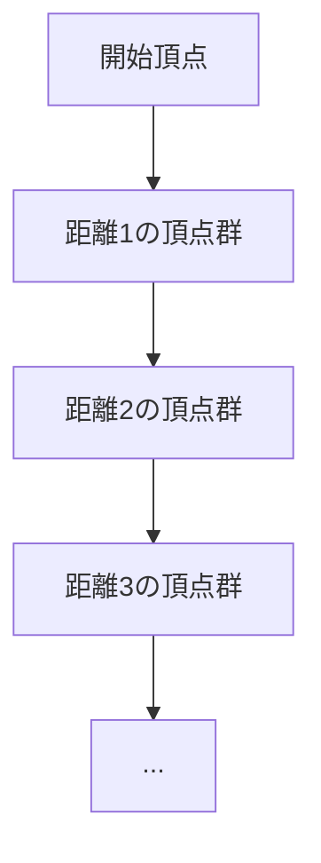
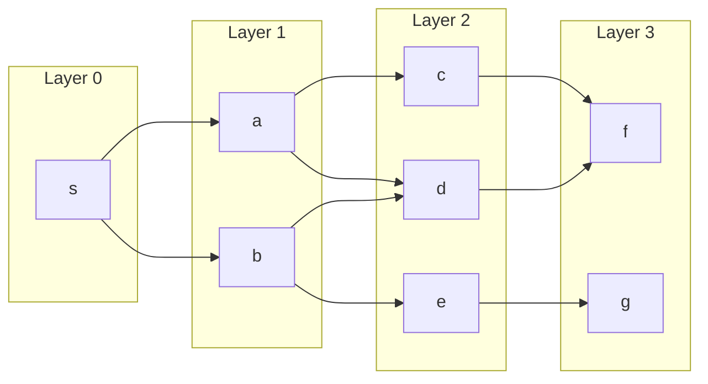
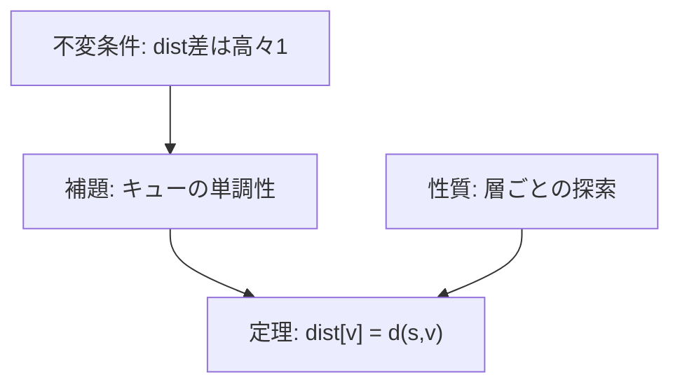
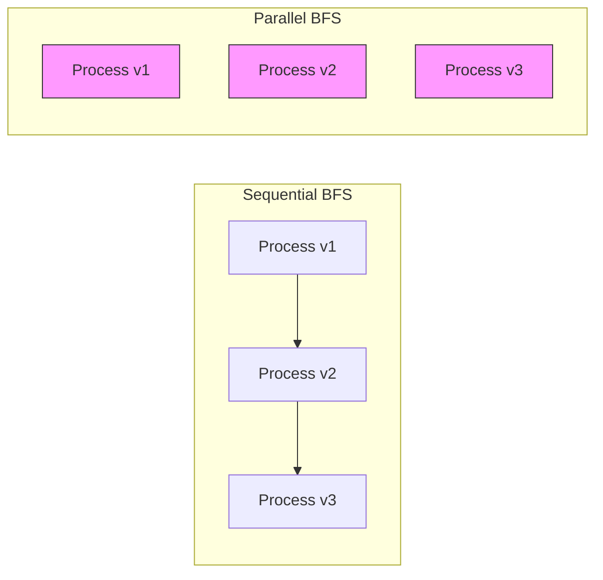
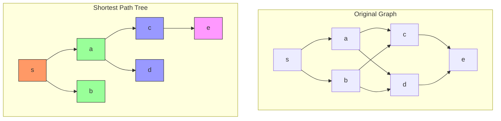

# 幅優先探索

幅優先探索（Breadth-First Search, BFS）は、グラフ理論における基礎的かつ重要な探索アルゴリズムである。その名が示す通り、探索の起点から「幅」を優先して、つまり起点からの距離が近い頂点から順に探索を進めていく戦略を採用する。この単純な原理の背後には、計算機科学の様々な分野で応用される豊かな理論的性質と実践的な有用性が存在している。

BFSの本質は、グラフ上の頂点を「層」として捉え、各層を完全に探索してから次の層へと進むという秩序立った探索順序にある。この探索順序は、起点からの最短経路を自然に計算する性質を持ち、多くの最短経路問題の解法の基礎となっている。Moore (1959) とLee (1961) によって独立に発見されたこのアルゴリズムは¹、今日では計算機科学のカリキュラムにおいて必須の内容となっている。



## アルゴリズムの数学的基礎

グラフ $G = (V, E)$ において、頂点集合 $V$ と辺集合 $E$ が与えられたとき、BFSは始点 $s \in V$ から到達可能なすべての頂点を系統的に探索する。ここで重要なのは、BFSが頂点を発見する順序が、始点からの最短距離と密接に関連していることである。

始点 $s$ から頂点 $v$ への距離 $d(s, v)$ を、$s$ から $v$ への最短経路に含まれる辺の数と定義する。BFSは、すべての距離 $k$ の頂点を探索し終えてから、距離 $k+1$ の頂点の探索を開始する。この性質は、BFSの正当性の証明において中心的な役割を果たす。

形式的には、BFSの探索過程で生成される頂点の部分集合の列 $S_0, S_1, S_2, \ldots$ を以下のように定義できる：

$$S_0 = \{s\}$$
$$S_k = \{v \in V \mid d(s, v) = k\} \quad (k \geq 1)$$

BFSは、これらの集合を $S_0, S_1, S_2, \ldots$ の順に探索していく。各 $S_k$ は第 $k$ 層と呼ばれ、始点から正確に $k$ ステップで到達可能な頂点の集合を表している。



## データ構造とアルゴリズムの詳細

BFSの実装において中核となるデータ構造はキュー（待ち行列）である。キューのFIFO（First-In-First-Out）特性が、BFSの層ごとの探索順序を自然に実現する。アルゴリズムは以下の主要なデータ構造を使用する：

1. **キュー $Q$**：次に探索すべき頂点を管理する
2. **訪問済み配列 $visited[v]$**：各頂点 $v$ が既に発見されたかを記録する
3. **距離配列 $dist[v]$**：始点から頂点 $v$ までの最短距離を記録する
4. **親配列 $parent[v]$**：最短経路木における頂点 $v$ の親を記録する

アルゴリズムの基本的な流れは以下の通りである。まず始点 $s$ をキューに入れ、訪問済みとしてマークする。その後、キューが空になるまで以下の処理を繰り返す：キューの先頭から頂点 $u$ を取り出し、$u$ のすべての隣接頂点 $v$ について、もし $v$ が未訪問であれば、$v$ を訪問済みとしてマークし、キューに追加する。

```python
def bfs(graph, start):
    n = len(graph)
    visited = [False] * n
    dist = [-1] * n
    parent = [-1] * n
    queue = deque()
    
    # Initialize start vertex
    visited[start] = True
    dist[start] = 0
    queue.append(start)
    
    while queue:
        u = queue.popleft()
        
        # Explore all adjacent vertices
        for v in graph[u]:
            if not visited[v]:
                visited[v] = True
                dist[v] = dist[u] + 1
                parent[v] = u
                queue.append(v)
    
    return dist, parent
```

この実装において重要な不変条件がいくつか存在する。第一に、キュー内の頂点の距離は単調非減少である。つまり、キューの先頭から末尾に向かって、頂点の距離は増加するか同じ値を保つ。第二に、キュー内の任意の二つの頂点の距離の差は高々1である。これらの不変条件は、BFSが最短距離を正しく計算することを保証する。

## 正当性の証明

BFSが各頂点への最短距離を正しく計算することの証明は、数学的帰納法による。以下、主要な補題と定理を示す。

**補題 1**：BFSの実行中、任意の時点でキュー $Q$ 内の頂点 $u, v$ について、$u$ が $v$ より先にキューに入った場合、$dist[u] \leq dist[v] \leq dist[u] + 1$ が成り立つ。

この補題は、キューの単調性を示している。証明は、頂点がキューに追加される順序と、その時点での距離の値に基づいて行われる。

**定理 1**：グラフ $G = (V, E)$ と始点 $s$ に対してBFSを実行したとき、すべての頂点 $v \in V$ について、$dist[v] = d(s, v)$ が成り立つ。ここで $d(s, v)$ は $s$ から $v$ への最短距離である。

証明の概略は以下の通りである。まず、$dist[v] \geq d(s, v)$ であることを示す。これは、BFSが発見する任意の経路が実際の経路であることから明らかである。次に、$dist[v] \leq d(s, v)$ であることを、$d(s, v)$ に関する帰納法で示す。基底ケースとして $d(s, v) = 0$ の場合、つまり $v = s$ の場合は明らかに成り立つ。帰納ステップでは、$d(s, v) = k$ のとき、$s$ から $v$ への最短経路上で $v$ の直前の頂点を $u$ とすると、$d(s, u) = k - 1$ である。帰納法の仮定より $dist[u] = k - 1$ であり、BFSは $u$ を処理する際に $v$ を発見し、$dist[v] = k$ と設定する。



## 計算量の分析

BFSの時間計算量と空間計算量は、グラフの表現方法に依存する。最も一般的な隣接リスト表現を前提とすると、以下の分析が得られる。

**時間計算量**：$O(|V| + |E|)$

この計算量は、各頂点が高々一度だけキューに追加され、各辺が高々一度だけ探索されることから導かれる。より詳細には、各頂点 $v$ について、$v$ がキューから取り出されるのは一度だけであり、その際に $v$ のすべての隣接頂点を調べる。頂点 $v$ の次数を $\deg(v)$ とすると、全体の操作回数は：

$$\sum_{v \in V} (1 + \deg(v)) = |V| + \sum_{v \in V} \deg(v) = |V| + 2|E|$$

無向グラフの場合、各辺は両端点から一度ずつ数えられるため $2|E|$ となる。有向グラフの場合は $|E|$ となる。

**空間計算量**：$O(|V|)$

空間計算量は、キュー、訪問済み配列、距離配列、親配列によって決まる。最悪の場合、キューにはすべての頂点が同時に含まれる可能性がある（例：星グラフの中心から探索を開始した場合）。各配列のサイズは $|V|$ であるため、全体の空間計算量は $O(|V|)$ となる。

隣接行列表現を使用する場合、時間計算量は $O(|V|^2)$ となる。これは、各頂点について、その頂点のすべての可能な隣接頂点（$|V|$ 個）を調べる必要があるためである。

## 実装上の考慮事項

実践的なBFSの実装では、いくつかの重要な考慮事項が存在する。これらは、アルゴリズムの効率性、メモリ使用量、そして適用可能性に大きな影響を与える。

**大規模グラフへの対応**として、数百万から数十億の頂点を持つグラフに対してBFSを適用する場合、メモリ使用量が深刻な制約となる。訪問済み配列をビットベクトルで実装することで、メモリ使用量を8分の1に削減できる。また、距離配列が不要な場合（到達可能性のみを判定する場合）は、これを省略することでさらなるメモリ削減が可能である。

```cpp
class BFS {
private:
    vector<vector<int>> graph;
    vector<uint8_t> visited;  // Bit-packed visited array
    
    bool isVisited(int v) {
        return visited[v / 8] & (1 << (v % 8));
    }
    
    void setVisited(int v) {
        visited[v / 8] |= (1 << (v % 8));
    }
    
public:
    void search(int start) {
        int n = graph.size();
        visited.assign((n + 7) / 8, 0);
        queue<int> q;
        
        setVisited(start);
        q.push(start);
        
        while (!q.empty()) {
            int u = q.front();
            q.pop();
            
            for (int v : graph[u]) {
                if (!isVisited(v)) {
                    setVisited(v);
                    q.push(v);
                }
            }
        }
    }
};
```

**並列化とマルチスレッド実装**も重要な最適化手法である。BFSの層ごとの性質は、同一層内の頂点を並列に処理することを可能にする。Level-synchronous BFSと呼ばれるこのアプローチでは、各層の処理が完了してから次の層に進む。



**双方向BFS**は、始点と終点が明確な場合に探索空間を大幅に削減できる技法である。始点と終点の両方から同時にBFSを実行し、探索領域が重なった時点で最短経路が見つかる。理論的には、探索する頂点数を $O(b^{d})$ から $O(b^{d/2})$ に削減できる（$b$ は平均分岐数、$d$ は最短経路長）。

## 応用アルゴリズムと発展的トピック

BFSは多くの高度なアルゴリズムの基礎となっている。これらの応用は、BFSの基本的な性質を活用しながら、特定の問題に対してより効率的な解法を提供する。

**0-1 BFS**は、辺の重みが0または1に限定されたグラフにおける最短経路問題を効率的に解く手法である。通常のBFSではすべての辺の重みが1であることを前提としているが、0-1 BFSはこれを拡張し、重み0の辺を通る場合は同じ層として扱う。実装では、dequeを使用し、重み0の辺で到達した頂点は前方に、重み1の辺で到達した頂点は後方に追加する。

```python
def zero_one_bfs(graph, start):
    n = len(graph)
    dist = [float('inf')] * n
    dist[start] = 0
    dq = deque([start])
    
    while dq:
        u = dq.popleft()
        
        for v, weight in graph[u]:
            if dist[u] + weight < dist[v]:
                dist[v] = dist[u] + weight
                if weight == 0:
                    dq.appendleft(v)  # Add to front for weight 0
                else:
                    dq.append(v)      # Add to back for weight 1
    
    return dist
```

**多始点BFS**は、複数の始点から同時に探索を開始する変種である。これは、「最も近い施設までの距離」のような問題で有用である。初期化時にすべての始点をキューに追加し、それらの距離を0に設定することで実現される。

グリッドグラフにおけるBFSも重要な応用である。2次元グリッドは暗黙的なグラフとして扱うことができ、各セルが頂点、隣接するセルへの移動が辺に対応する。迷路の最短経路、島の数を数える問題、最短変換経路など、多くの問題がグリッド上のBFSとして定式化できる。

```cpp
class GridBFS {
private:
    vector<vector<int>> grid;
    int rows, cols;
    const vector<pair<int, int>> directions = {{0,1}, {1,0}, {0,-1}, {-1,0}};
    
public:
    int shortestPath(int startX, int startY, int endX, int endY) {
        vector<vector<int>> dist(rows, vector<int>(cols, -1));
        queue<pair<int, int>> q;
        
        dist[startX][startY] = 0;
        q.push({startX, startY});
        
        while (!q.empty()) {
            auto [x, y] = q.front();
            q.pop();
            
            if (x == endX && y == endY) {
                return dist[x][y];
            }
            
            for (auto [dx, dy] : directions) {
                int nx = x + dx, ny = y + dy;
                
                if (nx >= 0 && nx < rows && ny >= 0 && ny < cols &&
                    grid[nx][ny] != 1 && dist[nx][ny] == -1) {
                    dist[nx][ny] = dist[x][y] + 1;
                    q.push({nx, ny});
                }
            }
        }
        
        return -1;  // No path found
    }
};
```

## 最短経路の復元と経路木

BFSの重要な応用の一つは、最短経路そのものを復元することである。親配列 $parent[v]$ を維持することで、任意の頂点への最短経路を効率的に復元できる。経路の復元は、終点から始点に向かって親を辿ることで行われる。

```python
def reconstruct_path(parent, start, end):
    if parent[end] == -1:
        return None  # No path exists
    
    path = []
    current = end
    
    while current != -1:
        path.append(current)
        current = parent[current]
    
    path.reverse()
    return path
```

BFSによって生成される親子関係は、最短経路木（shortest-path tree）と呼ばれる部分グラフを形成する。この木は以下の性質を持つ：

1. 始点を根とする木構造である
2. 始点から任意の頂点への木上の経路が、元のグラフにおける最短経路である
3. 木の辺数は正確に $|V| - 1$ である（連結成分内の頂点数を $|V|$ とする）



## 辞書式順序最小の最短経路

実践的な問題では、最短経路が複数存在する場合に、特定の基準で一意に経路を選択する必要がある。辞書式順序最小の最短経路を求める問題は、その典型例である。この問題は、通常のBFSを修正することで解決できる。

キーとなるアイデアは、隣接頂点を番号順（または辞書式順序）に探索することである。これにより、同じ距離の頂点の中で、辞書式に最小のものが最初に発見される。

```cpp
vector<int> lexicographically_smallest_path(vector<vector<int>>& graph, int start, int end) {
    int n = graph.size();
    vector<int> dist(n, -1);
    vector<int> parent(n, -1);
    queue<int> q;
    
    // Sort adjacency lists to ensure lexicographic order
    for (auto& adj : graph) {
        sort(adj.begin(), adj.end());
    }
    
    dist[start] = 0;
    q.push(start);
    
    while (!q.empty()) {
        int u = q.front();
        q.pop();
        
        for (int v : graph[u]) {
            if (dist[v] == -1) {
                dist[v] = dist[u] + 1;
                parent[v] = u;
                q.push(v);
            }
        }
    }
    
    // Reconstruct path
    vector<int> path;
    int current = end;
    
    while (current != -1) {
        path.push_back(current);
        current = parent[current];
    }
    
    reverse(path.begin(), path.end());
    return path;
}
```

## BFSの限界と代替手法

BFSは多くの問題に対して効果的であるが、いくつかの重要な限界も存在する。これらの限界を理解することは、適切なアルゴリズムを選択する上で不可欠である。

**重み付きグラフ**における最短経路問題は、BFSでは直接解くことができない。辺の重みが異なる場合、最少辺数の経路が必ずしも最短距離経路とは限らないためである。この場合、Dijkstra法やBellman-Ford法などの代替アルゴリズムが必要となる。ただし、前述の0-1 BFSのように、特殊な重み構造を持つ場合はBFSの変種で対応可能である。

**メモリ制約**も実践的な問題となる。BFSは探索済みのすべての頂点を記憶する必要があるため、巨大なグラフや無限グラフでは適用が困難である。深さ優先探索（DFS）や反復深化深さ優先探索（IDDFS）は、より少ないメモリで動作する代替手法である。

**最長経路問題**のようなNP困難問題に対して、BFSは多項式時間の解法を提供しない。BFSは最短経路に特化しており、最長経路や他の最適化問題には異なるアプローチが必要である。

## 実装のバリエーションと最適化

実践的なBFSの実装では、問題の特性に応じた様々な最適化が可能である。これらの最適化は、定数倍の高速化から、漸近的な計算量の改善まで幅広い。

**早期終了**は、特定の目標頂点への最短経路を求める場合の基本的な最適化である。目標頂点を発見した時点で探索を終了することで、不要な探索を回避できる。

```python
def bfs_with_early_termination(graph, start, target):
    if start == target:
        return 0
    
    visited = set([start])
    queue = deque([(start, 0)])
    
    while queue:
        vertex, distance = queue.popleft()
        
        for neighbor in graph[vertex]:
            if neighbor == target:
                return distance + 1
            
            if neighbor not in visited:
                visited.add(neighbor)
                queue.append((neighbor, distance + 1))
    
    return -1  # Target not reachable
```

**訪問済み判定の最適化**として、頂点数が少ない場合はビットマスクを使用できる。これにより、訪問済み配列の代わりに単一の整数で状態を管理できる。

```cpp
int bfs_with_bitmask(vector<vector<int>>& graph, int start, int target) {
    int n = graph.size();
    if (n > 32) return -1;  // Too many vertices for bitmask
    
    queue<pair<int, int>> q;  // {vertex, visited_mask}
    q.push({start, 1 << start});
    
    int steps = 0;
    while (!q.empty()) {
        int size = q.size();
        
        for (int i = 0; i < size; i++) {
            auto [u, mask] = q.front();
            q.pop();
            
            if (u == target) return steps;
            
            for (int v : graph[u]) {
                if (!(mask & (1 << v))) {
                    q.push({v, mask | (1 << v)});
                }
            }
        }
        steps++;
    }
    
    return -1;
}
```

## グラフの性質とBFS

BFSは、グラフの構造的性質を調べる強力なツールでもある。連結性、二部グラフ判定、最短サイクル検出など、多くのグラフ理論的問題がBFSを用いて効率的に解決できる。

**連結成分の検出**は、BFSの基本的な応用である。未訪問の頂点から繰り返しBFSを実行することで、グラフのすべての連結成分を列挙できる。

```python
def find_connected_components(graph):
    n = len(graph)
    visited = [False] * n
    components = []
    
    for start in range(n):
        if not visited[start]:
            component = []
            queue = deque([start])
            visited[start] = True
            
            while queue:
                u = queue.popleft()
                component.append(u)
                
                for v in graph[u]:
                    if not visited[v]:
                        visited[v] = True
                        queue.append(v)
            
            components.append(component)
    
    return components
```

**二部グラフ判定**は、グラフの頂点を2つの集合に分割し、同じ集合内の頂点間に辺が存在しないようにできるかを判定する問題である。BFSを用いて頂点を2色で彩色し、隣接する頂点が同じ色にならないかを確認することで判定できる。

```cpp
bool is_bipartite(vector<vector<int>>& graph) {
    int n = graph.size();
    vector<int> color(n, -1);
    
    for (int start = 0; start < n; start++) {
        if (color[start] == -1) {
            queue<int> q;
            q.push(start);
            color[start] = 0;
            
            while (!q.empty()) {
                int u = q.front();
                q.pop();
                
                for (int v : graph[u]) {
                    if (color[v] == -1) {
                        color[v] = 1 - color[u];
                        q.push(v);
                    } else if (color[v] == color[u]) {
                        return false;  // Same color on adjacent vertices
                    }
                }
            }
        }
    }
    
    return true;
}
```

## 競技プログラミングにおけるBFS

競技プログラミングの文脈では、BFSは頻出のツールである。その適用範囲は、明示的なグラフ問題から、状態空間探索、ゲーム理論まで多岐にわたる。

**状態空間探索**では、問題の状態をグラフの頂点、状態遷移を辺として捉える。例えば、パズルゲームの最小手数、文字列の最小編集距離、数値の最小変換回数などがこのパラダイムで解ける。

```python
def minimum_operations(start, target, operations):
    """
    Find minimum number of operations to transform start to target
    operations: list of functions that transform a number
    """
    if start == target:
        return 0
    
    visited = {start}
    queue = deque([(start, 0)])
    
    while queue:
        current, steps = queue.popleft()
        
        for op in operations:
            next_val = op(current)
            
            if next_val == target:
                return steps + 1
            
            if next_val not in visited and is_valid(next_val):
                visited.add(next_val)
                queue.append((next_val, steps + 1))
    
    return -1  # Target unreachable
```

**マルチソースBFS**は、複数の開始点から同時に探索を行う技法で、「すべての建物から最も遠い空き地」のような問題で有用である。

```cpp
vector<vector<int>> multi_source_bfs(vector<vector<int>>& grid, vector<pair<int, int>>& sources) {
    int rows = grid.size(), cols = grid[0].size();
    vector<vector<int>> dist(rows, vector<int>(cols, -1));
    queue<pair<int, int>> q;
    
    // Initialize all sources
    for (auto [x, y] : sources) {
        dist[x][y] = 0;
        q.push({x, y});
    }
    
    // Standard BFS from multiple sources
    vector<pair<int, int>> directions = {{0,1}, {1,0}, {0,-1}, {-1,0}};
    
    while (!q.empty()) {
        auto [x, y] = q.front();
        q.pop();
        
        for (auto [dx, dy] : directions) {
            int nx = x + dx, ny = y + dy;
            
            if (nx >= 0 && nx < rows && ny >= 0 && ny < cols && 
                dist[nx][ny] == -1 && grid[nx][ny] == 0) {
                dist[nx][ny] = dist[x][y] + 1;
                q.push({nx, ny});
            }
        }
    }
    
    return dist;
}
```

## 理論的発展と研究動向

BFSの理論的研究は、計算機科学の発展とともに継続的に進化している。特に、並列・分散アルゴリズム、外部メモリアルゴリズム、動的グラフアルゴリズムの文脈で、新しい成果が生まれている。

**並列BFS**の研究では、グラフの直径 $D$ に対して $O(D)$ ラウンドで動作するアルゴリズムが知られている²。各ラウンドでは、現在の層のすべての頂点を並列に処理する。理論的には、work-efficient な並列アルゴリズムの設計が課題となっている。

**外部メモリBFS**は、グラフがメインメモリに収まらない場合の効率的なアルゴリズムを扱う。Munagala and Ranade (1999) によるアルゴリズム³は、$O(\text{sort}(|V| + |E|))$ のI/O複雑度を達成する。ここで $\text{sort}(n)$ は $n$ 個の要素をソートするのに必要なI/O数である。

**動的グラフ**におけるBFSは、辺の追加・削除に対して効率的に最短距離を更新する問題を扱う。完全な動的化は困難であるが、制限された更新操作に対しては効率的なアルゴリズムが知られている。

これらの理論的発展は、実用的なシステムの設計にも影響を与えている。例えば、GraphChi⁴ やPregel⁵ などの大規模グラフ処理システムでは、BFSの並列化技術が中核的な役割を果たしている。

---

¹ Moore, E.F. (1959). "The shortest path through a maze". Proceedings of the International Symposium on the Theory of Switching. Harvard University Press. pp. 285–292.

² Beamer, S., Asanović, K., & Patterson, D. (2012). "Direction-optimizing breadth-first search". SC'12: Proceedings of the International Conference on High Performance Computing, Networking, Storage and Analysis. pp. 1-10.

³ Munagala, K., & Ranade, A. (1999). "I/O-complexity of graph algorithms". Proceedings of the tenth annual ACM-SIAM symposium on Discrete algorithms. pp. 687-694.

⁴ Kyrola, A., Blelloch, G., & Guestrin, C. (2012). "GraphChi: Large-scale graph computation on just a PC". Proceedings of the 10th USENIX Symposium on Operating Systems Design and Implementation. pp. 31-46.

⁵ Malewicz, G., et al. (2010). "Pregel: a system for large-scale graph processing". Proceedings of the 2010 ACM SIGMOD International Conference on Management of data. pp. 135-146.