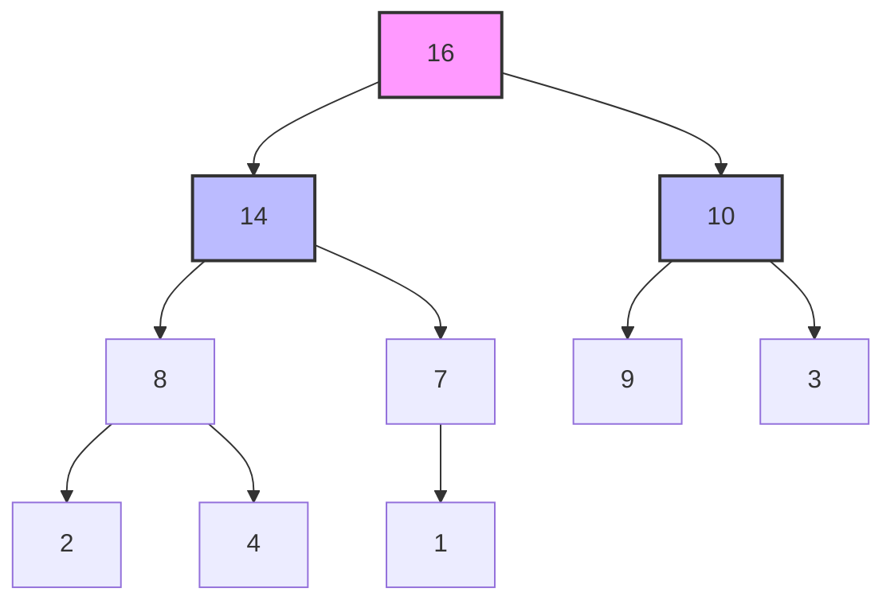
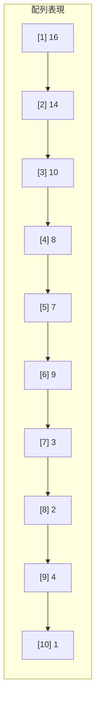
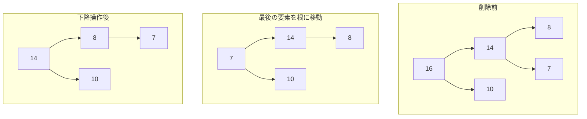

# 二項ヒープ

二項ヒープ（Binary Heap）は、完全二分木の構造を持つデータ構造であり、効率的な優先度付きキューの実装を可能にする。ヒープという名称は、要素が積み重ねられた構造を表現しており、親子関係に基づく順序制約によって全体の秩序が保たれる。この構造は1964年にJ.W.J. Williamsによってヒープソートアルゴリズムの一部として導入され[^1]、以来、多くのアルゴリズムの基礎となっている。

二項ヒープの最も重要な特徴は、完全二分木という特殊な形状と、ヒープ条件と呼ばれる順序制約の組み合わせにある。完全二分木は、最下段を除くすべての段が完全に埋まっており、最下段は左から順に詰められている構造を指す。この規則的な形状により、配列を用いた極めて効率的な実装が可能となり、ポインタを用いた明示的な木構造の管理が不要となる。



## ヒープ条件と順序性

ヒープ条件は、親ノードと子ノードの間の大小関係を規定する制約である。最大ヒープ（Max Heap）では、すべての親ノードの値がその子ノードの値以上でなければならない。数学的に表現すると、ノードiの値をA[i]とするとき、すべてのノードiに対して以下が成立する：

$$A[\text{parent}(i)] \geq A[i]$$

一方、最小ヒープ（Min Heap）では不等号の向きが逆となり、親ノードの値が子ノードの値以下である必要がある。この局所的な順序制約により、根ノードには常に最大値（最大ヒープの場合）または最小値（最小ヒープの場合）が配置される。

重要な点は、ヒープ条件が親子間の関係のみを規定し、兄弟ノード間や異なる部分木間の順序については何も保証しないことである。この緩い制約により、要素の挿入や削除における柔軟性が確保され、O(log n)という効率的な操作が可能となる。二分探索木のような完全な順序性を要求しないことで、構造の維持にかかるコストを削減している。

## 配列による実装の巧妙さ

二項ヒープの実装における最大の工夫は、完全二分木を配列で表現する手法にある。配列のインデックスを1から始めるとき、ノードiに対して以下の関係が成立する：

- 親ノード：⌊i/2⌋
- 左の子ノード：2i
- 右の子ノード：2i + 1

この単純な算術演算により、ポインタを用いることなく木構造の走査が可能となる。メモリの局所性も向上し、キャッシュ効率の観点からも優れた実装となる。



配列インデックスを0から始める実装も一般的であり、その場合の親子関係は以下のようになる：

- 親ノード：⌊(i-1)/2⌋
- 左の子ノード：2i + 1
- 右の子ノード：2i + 2

どちらの方式を採用するかは実装の好みによるが、1ベースのインデックスの方が親子関係の計算が直感的である一方、0ベースは多くのプログラミング言語の配列の慣習に従っている。

## 基本操作の詳細

### 挿入操作（Insert）

新しい要素の挿入は、完全二分木の性質を維持しながらヒープ条件を満たすように行われる。まず、新しい要素を配列の末尾（木の最下段の最も右）に追加する。その後、ヒープ条件を回復するために「上昇」（percolate up、bubble up、sift upとも呼ばれる）操作を行う。

```python
def insert(heap, value):
    heap.append(value)
    i = len(heap) - 1
    
    # Percolate up
    while i > 0:
        parent = (i - 1) // 2
        if heap[parent] < heap[i]:  # Max heap
            heap[parent], heap[i] = heap[i], heap[parent]
            i = parent
        else:
            break
```

上昇操作は、新しく追加された要素をその親と比較し、ヒープ条件が満たされていない場合は交換を行う。この過程を根に到達するか、ヒープ条件が満たされるまで繰り返す。最悪の場合、根まで上昇する必要があるため、時間計算量はO(log n)となる。

### 最大値の削除（Extract Max）

最大ヒープから最大値を取り出す操作は、優先度付きキューの基本操作である。根ノード（配列の先頭）が最大値であることは保証されているが、これを削除した後のヒープ条件の回復が課題となる。



手順は以下の通りである：

1. 根ノードの値を保存する（返却値として使用）
2. 配列の最後の要素を根に移動する
3. 配列のサイズを1減らす
4. 「下降」（percolate down、bubble down、sift downとも呼ばれる）操作を行う

下降操作では、現在のノードとその子ノードを比較し、最大の値を持つ子と交換を行う。この過程を葉に到達するか、ヒープ条件が満たされるまで繰り返す。

```python
def extract_max(heap):
    if not heap:
        return None
    
    max_value = heap[0]
    heap[0] = heap[-1]
    heap.pop()
    
    # Percolate down
    i = 0
    size = len(heap)
    
    while True:
        largest = i
        left = 2 * i + 1
        right = 2 * i + 2
        
        if left < size and heap[left] > heap[largest]:
            largest = left
        if right < size and heap[right] > heap[largest]:
            largest = right
            
        if largest != i:
            heap[i], heap[largest] = heap[largest], heap[i]
            i = largest
        else:
            break
    
    return max_value
```

### ヒープ構築（Build Heap）

n個の要素からヒープを構築する場合、単純に各要素を順次挿入する方法ではO(n log n)の時間がかかる。しかし、Floydのヒープ構築アルゴリズム[^2]を用いることで、O(n)時間での構築が可能となる。

このアルゴリズムの核心は、葉ノードはすでに単独でヒープ条件を満たしているという観察にある。したがって、最下段の内部ノードから順に上方向に向かって下降操作を適用すれば、全体をヒープ化できる。

```python
def build_heap(array):
    n = len(array)
    # Start from the last internal node
    for i in range(n // 2 - 1, -1, -1):
        percolate_down(array, i, n)
```

## 時間計算量の詳細な解析

ヒープ構築のO(n)時間計算量は直感に反するように思えるが、厳密な解析により証明できる。高さhのノードに対する下降操作の最大コストはO(h)である。完全二分木において、高さhのノードの数は最大で⌈n/2^(h+1)⌉個である。

総コストは以下の級数で表される：

$$\sum_{h=0}^{\lfloor \log n \rfloor} \lceil \frac{n}{2^{h+1}} \rceil \cdot O(h) = O(n \sum_{h=0}^{\lfloor \log n \rfloor} \frac{h}{2^{h+1}})$$

この級数は収束し、その和は2未満となる。したがって、全体の時間計算量はO(n)となる。

個々の操作の時間計算量をまとめると：

| 操作 | 時間計算量 | 備考 |
|------|-----------|------|
| 挿入 | O(log n) | 最悪の場合、根まで上昇 |
| 最大値取得 | O(1) | 根ノードを参照するだけ |
| 最大値削除 | O(log n) | 下降操作が必要 |
| ヒープ構築 | O(n) | Floydのアルゴリズム使用時 |
| 任意要素の削除 | O(log n) | 位置が分かっている場合 |
| 値の更新 | O(log n) | 上昇または下降が必要 |

## 応用：優先度付きキューとしての実装

二項ヒープは優先度付きキューの実装として広く用いられる。優先度付きキューは、各要素に優先度が付与されており、最高（または最低）優先度の要素を効率的に取り出せるデータ構造である。

```python
class PriorityQueue:
    def __init__(self):
        self.heap = []
    
    def push(self, priority, item):
        self.heap.append((priority, item))
        self._percolate_up(len(self.heap) - 1)
    
    def pop(self):
        if not self.heap:
            raise IndexError("Priority queue is empty")
        
        priority, item = self.heap[0]
        self.heap[0] = self.heap[-1]
        self.heap.pop()
        
        if self.heap:
            self._percolate_down(0)
        
        return item
    
    def _percolate_up(self, index):
        while index > 0:
            parent = (index - 1) // 2
            if self.heap[parent][0] < self.heap[index][0]:
                self.heap[parent], self.heap[index] = \
                    self.heap[index], self.heap[parent]
                index = parent
            else:
                break
```

優先度付きキューは、ダイクストラのアルゴリズム、A*探索、ハフマン符号化、イベント駆動シミュレーションなど、多くのアルゴリズムで中心的な役割を果たす。

## ヒープソート

ヒープソートは、二項ヒープの性質を利用した比較ベースのソートアルゴリズムである。最悪時間計算量O(n log n)を保証し、追加メモリをO(1)しか使用しないin-placeソートである点が特徴的である。

アルゴリズムは以下の2段階から構成される：

1. 配列全体を最大ヒープに変換する（O(n)時間）
2. 最大要素を順次取り出し、配列の後方に配置する（O(n log n)時間）

```python
def heapsort(array):
    n = len(array)
    
    # Build max heap
    for i in range(n // 2 - 1, -1, -1):
        percolate_down(array, i, n)
    
    # Extract elements one by one
    for i in range(n - 1, 0, -1):
        array[0], array[i] = array[i], array[0]
        percolate_down(array, 0, i)
```

ヒープソートは理論的に優れた性質を持つが、実用上はクイックソートに劣ることが多い。これは主にキャッシュ効率の違いによる。ヒープソートは配列の離れた位置にある要素を頻繁に交換するため、メモリアクセスの局所性が低い。

## 実装上の最適化と実践的考慮事項

実用的な二項ヒープの実装では、いくつかの最適化技術が適用される。まず、要素の交換回数を減らすために、上昇・下降操作において実際の交換を遅延させる手法がある。対象要素を一時変数に保存し、最終位置が確定してから一度だけ代入を行う。

```python
def optimized_percolate_up(heap, index):
    value = heap[index]
    
    while index > 0:
        parent = (index - 1) // 2
        if heap[parent] < value:
            heap[index] = heap[parent]
            index = parent
        else:
            break
    
    heap[index] = value
```

また、d-aryヒープ（d分ヒープ）への一般化も重要な拡張である。二項ヒープは各ノードが最大2個の子を持つが、d-aryヒープでは最大d個の子を持つ。dを大きくすると木の高さが減少し、挿入操作が高速化されるが、削除操作では比較回数が増加する。キャッシュラインのサイズを考慮してdを選択することで、実用的な性能向上が得られる。

メモリ管理の観点では、動的配列の拡張戦略が重要となる。多くの実装では、容量が不足した際に現在のサイズの2倍に拡張する倍増戦略を採用する。これにより、n個の要素の挿入に対する償却時間計算量をO(n)に抑えることができる。

並行アクセスへの対応も現代的な実装では重要である。単純なロックベースの同期から、より洗練されたロックフリーアルゴリズムまで、様々なアプローチが研究されている。Hunt et al.による並行優先度付きキュー[^3]は、複数のヒープを用いて競合を減らす手法を提案している。

## 理論的限界と他のヒープ構造との比較

二項ヒープは多くの場面で実用的だが、理論的な限界も存在する。特に、decrease-key操作（要素の優先度を上げる）やmerge操作（2つのヒープを統合する）は、単純な実装ではO(n)時間を要する。

これらの操作をより効率的に行うために、様々なヒープ構造が提案されている：

| ヒープ構造 | 挿入 | 最小値削除 | decrease-key | merge |
|-----------|------|------------|--------------|-------|
| 二項ヒープ | O(log n) | O(log n) | O(log n) | O(n) |
| 二項ヒープ（Binomial Heap） | O(log n) | O(log n) | O(log n) | O(log n) |
| フィボナッチヒープ | O(1)* | O(log n)* | O(1)* | O(1) |
| ペアリングヒープ | O(1)* | O(log n)* | O(log n)* | O(1) |

*は償却時間計算量を示す。

フィボナッチヒープ[^4]は理論的に優れた計算量を達成するが、定数倍が大きく、実装も複雑であるため、実用上は二項ヒープやペアリングヒープが選ばれることが多い。

## 実装の詳細とエッジケース

実用的な二項ヒープの実装では、様々なエッジケースへの対処が必要となる。空のヒープに対する操作、単一要素のヒープ、すべての要素が同じ値を持つ場合など、境界条件の適切な処理が堅牢性を左右する。

また、比較関数のカスタマイズも重要な機能である。多くの実装では、コンストラクタで比較関数を受け取り、任意の順序でのヒープを構築できるようにしている。これにより、最大ヒープと最小ヒープを同一の実装で扱うことができる。

```python
class BinaryHeap:
    def __init__(self, compare=lambda x, y: x > y):
        self.heap = []
        self.compare = compare
    
    def _should_swap(self, parent_idx, child_idx):
        return self.compare(self.heap[child_idx], self.heap[parent_idx])
```

メモリ効率を重視する場合、要素の型に応じた特殊化も考慮すべきである。整数のみを扱うヒープでは、プリミティブ型の配列を使用することで、オブジェクトのオーバーヘッドを回避できる。

## 数学的性質と理論的背景

二項ヒープの数学的解析において、完全二分木の性質が中心的な役割を果たす。n個のノードを持つ完全二分木の高さはh = ⌊log₂ n⌋であり、これがすべての操作の計算量の基礎となる。

ヒープの形状に関する興味深い性質として、n個の要素を持つ完全二分木の形状は一意に定まる。これは、nの二進表現と対応しており、各ビットが対応する深さにおけるノードの存在を示す。

また、ヒープソートの平均的な振る舞いについても深い解析がなされている。Schaffer and Sedgewick[^5]による研究では、ランダムな順列に対するヒープソートの平均比較回数が約2n log n - 2.8n + O(log n)であることが示されている。

## 実装例：完全な二項ヒープクラス

以下に、実用的な機能を備えた二項ヒープの完全な実装を示す：

```python
class CompleteBinaryHeap:
    def __init__(self, initial_capacity=16, compare=lambda x, y: x > y):
        self.heap = []
        self.compare = compare
        self.capacity = initial_capacity
        
    def push(self, value):
        self.heap.append(value)
        self._percolate_up(len(self.heap) - 1)
        
    def pop(self):
        if not self.heap:
            raise IndexError("Heap is empty")
            
        result = self.heap[0]
        last = self.heap.pop()
        
        if self.heap:
            self.heap[0] = last
            self._percolate_down(0)
            
        return result
        
    def peek(self):
        if not self.heap:
            raise IndexError("Heap is empty")
        return self.heap[0]
        
    def _percolate_up(self, index):
        value = self.heap[index]
        
        while index > 0:
            parent = (index - 1) // 2
            if self.compare(value, self.heap[parent]):
                self.heap[index] = self.heap[parent]
                index = parent
            else:
                break
                
        self.heap[index] = value
        
    def _percolate_down(self, index):
        value = self.heap[index]
        size = len(self.heap)
        
        while True:
            child = 2 * index + 1
            
            if child >= size:
                break
                
            # Find the better child
            if child + 1 < size and self.compare(self.heap[child + 1], 
                                                 self.heap[child]):
                child += 1
                
            if self.compare(self.heap[child], value):
                self.heap[index] = self.heap[child]
                index = child
            else:
                break
                
        self.heap[index] = value
        
    def update_key(self, index, new_value):
        if index < 0 or index >= len(self.heap):
            raise IndexError("Invalid index")
            
        old_value = self.heap[index]
        self.heap[index] = new_value
        
        # Determine whether to percolate up or down
        if self.compare(new_value, old_value):
            self._percolate_up(index)
        else:
            self._percolate_down(index)
            
    def build_heap(self, array):
        self.heap = array[:]
        for i in range(len(self.heap) // 2 - 1, -1, -1):
            self._percolate_down(i)
```

この実装は、基本的な操作に加えて、任意位置の要素の更新機能も提供している。比較関数のカスタマイズにより、最大ヒープと最小ヒープの両方に対応し、任意の順序関係でのヒープ構築が可能である。

二項ヒープは、その単純さと効率性により、計算機科学の基礎的なデータ構造として確固たる地位を築いている。完全二分木という規則的な構造と、局所的な順序制約の組み合わせが、理論と実装の両面で優れたバランスを実現している。配列による実装の巧妙さは、メモリ効率とアクセス効率の両立を可能にし、現代のコンピュータアーキテクチャにおいても高い性能を発揮する。

優先度付きキューやヒープソートといった応用は、二項ヒープの実用性を示す好例である。特に、グラフアルゴリズムやシミュレーション、タスクスケジューリングなど、優先度に基づく処理が必要な場面では欠かせない道具となっている。理論的にはより洗練されたヒープ構造も存在するが、実装の単純さと実用的な性能のバランスにおいて、二項ヒープは今なお第一の選択肢であり続けている。

[^1]: Williams, J. W. J. (1964). "Algorithm 232 - Heapsort". Communications of the ACM. 7 (6): 347–348.

[^2]: Floyd, Robert W. (1964). "Algorithm 245 - Treesort 3". Communications of the ACM. 7 (12): 701.

[^3]: Hunt, Galen C.; Michael, Maged M.; Parthasarathy, Srinivasan; Scott, Michael L. (1996). "An efficient algorithm for concurrent priority queue heaps". Information Processing Letters. 60 (3): 151–157.

[^4]: Fredman, Michael Lawrence; Tarjan, Robert E. (1987). "Fibonacci heaps and their uses in improved network optimization algorithms". Journal of the ACM. 34 (3): 596–615.

[^5]: Schaffer, Russel; Sedgewick, Robert (1993). "The Analysis of Heapsort". Journal of Algorithms. 15 (1): 76–100.