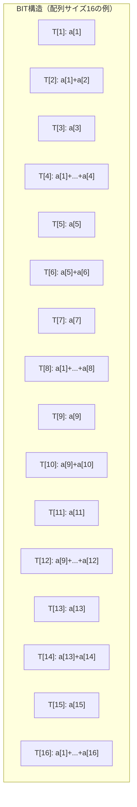
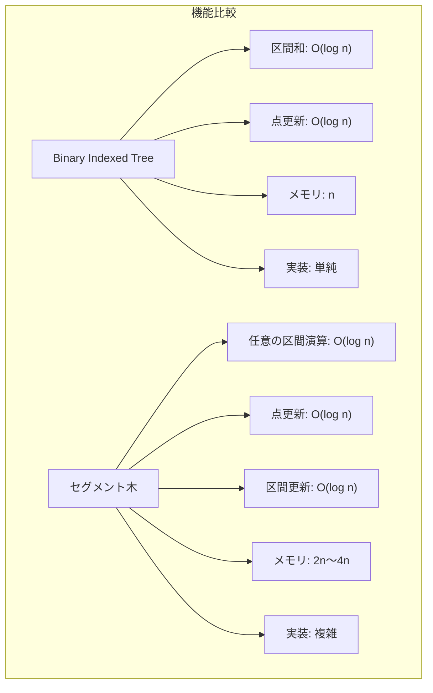

# Binary Indexed Tree

Binary Indexed Tree（BIT）は、配列の要素に対する更新操作と区間和クエリを効率的に処理するデータ構造である[^1]。Peter M. Fenwickによって1994年に提案されたことから、Fenwick Treeとも呼ばれる。この構造は、単純な配列による実装では O(n) かかる区間和クエリを O(log n) で処理し、同時に要素の更新も O(log n) で実現する。最も注目すべき特徴は、その実装の簡潔さと空間効率の良さである。必要なメモリは元の配列と同じサイズの配列一つのみで、セグメント木と比較して実装が著しく単純でありながら、特定の用途においては同等の性能を発揮する。

## 基本概念と二進数表現

Binary Indexed Treeの核心は、配列のインデックスと二進数表現の関係性にある。各ノードが保持する値の範囲は、そのインデックスの二進数表現における最下位の1ビット（LSB: Least Significant Bit）によって決定される。例えば、インデックス12（二進数で1100）の場合、最下位の1ビットは3ビット目にあるため、2^2 = 4個の要素の和を保持する。この巧妙な設計により、任意の区間和を log n 個以下のノードの値を加算することで計算できる。



このデータ構造において、インデックス i のノード T[i] が管理する区間は [i - LSB(i) + 1, i] である。LSB(i) は i & -i という単純なビット演算で求められる。この演算は、2の補数表現を利用した巧妙な手法で、-i は ~i + 1 と等価であり、i と -i のビット単位ANDを取ると最下位の1ビットのみが残る。

## 累積和クエリのアルゴリズム

位置 i までの累積和を求めるアルゴリズムは、i から開始して LSB を引きながら 0 に到達するまで値を加算していく。このプロセスは、二進数表現から1ビットずつ取り除いていく操作に相当する。

```
sum(i):
    s = 0
    while i > 0:
        s += T[i]
        i -= i & -i
    return s
```

例えば、sum(13) を計算する場合を考える。13 は二進数で 1101 であり、以下の手順で処理される：

1. i = 13 (1101): T[13] を加算、LSB は 1 なので i = 13 - 1 = 12
2. i = 12 (1100): T[12] を加算、LSB は 4 なので i = 12 - 4 = 8
3. i = 8 (1000): T[8] を加算、LSB は 8 なので i = 8 - 8 = 0
4. i = 0 なので終了

この過程で T[13] + T[12] + T[8] が計算され、これは a[1] から a[13] までの和に等しい。各ステップで少なくとも1つの1ビットが取り除かれるため、最大でも log n 回の繰り返しで終了する。

## 更新操作のアルゴリズム

要素 a[i] の値を変更する際は、その要素を含むすべてのノードを更新する必要がある。これは累積和クエリとは逆方向の処理で、i から開始して LSB を加算しながら配列サイズを超えるまで更新を続ける。

```
update(i, delta):
    while i <= n:
        T[i] += delta
        i += i & -i
```

位置 5 の要素を更新する場合、5 (0101) から始まり、以下のノードが更新される：

1. i = 5 (0101): T[5] を更新、LSB は 1 なので i = 5 + 1 = 6
2. i = 6 (0110): T[6] を更新、LSB は 2 なので i = 6 + 2 = 8
3. i = 8 (1000): T[8] を更新、LSB は 8 なので i = 8 + 8 = 16
4. i = 16 (10000): T[16] を更新、LSB は 16 なので i = 16 + 16 = 32
5. i = 32 > n なので終了

この更新パスは、要素 5 を含むすべての区間和ノードを正確に辿る。累積和クエリと同様に、各ステップで少なくとも1つの0ビットが1に変わるため、最大でも log n 回の繰り返しで終了する。

## データ構造の初期化

Binary Indexed Treeの初期化には主に2つの方法がある。最も単純な方法は、すべての要素を0で初期化し、各要素に対して update 操作を呼び出すことである。この方法の計算量は O(n log n) となる。

```
initialize_simple(a):
    T = [0] * (n + 1)  # 1-indexed
    for i in 1 to n:
        update(i, a[i])
```

より効率的な O(n) の初期化方法も存在する。各ノード T[i] に対して、まず a[i] を設定し、次に T[i] の値を親ノード T[i + LSB(i)] に伝播させる。

```
initialize_efficient(a):
    T = [0] * (n + 1)
    for i in 1 to n:
        T[i] += a[i]
        j = i + (i & -i)
        if j <= n:
            T[j] += T[i]
```

この方法は、各ノードの値が一度だけ計算され、必要に応じて親ノードに伝播されるため、全体で O(n) の計算量となる。

## 区間和クエリの実装

位置 l から r までの区間和は、sum(r) - sum(l-1) で計算できる。これは累積和の基本的な性質を利用している。

```
range_sum(l, r):
    return sum(r) - sum(l - 1)
```

この実装は、2回の累積和クエリを実行するため、計算量は O(log n) となる。負のインデックスや範囲外のインデックスに対する適切なエラーハンドリングは、実装において重要な考慮事項である。

## 二次元への拡張

Binary Indexed Treeは二次元配列にも自然に拡張できる。二次元BITでは、各要素 T[i][j] が矩形領域の和を保持する。更新と累積和クエリのアルゴリズムは、各次元で独立に適用される。

```
update_2d(x, y, delta):
    i = x
    while i <= n:
        j = y
        while j <= m:
            T[i][j] += delta
            j += j & -j
        i += i & -i

sum_2d(x, y):
    s = 0
    i = x
    while i > 0:
        j = y
        while j > 0:
            s += T[i][j]
            j -= j & -j
        i -= i & -i
    return s
```

二次元の場合、矩形領域 [(x1, y1), (x2, y2)] の和は包除原理を用いて計算される：

```
rectangle_sum(x1, y1, x2, y2):
    return sum_2d(x2, y2) - sum_2d(x1-1, y2) - sum_2d(x2, y1-1) + sum_2d(x1-1, y1-1)
```

計算量は更新・クエリともに O(log n × log m) となる。

## 逆元を用いた拡張

標準的なBinary Indexed Treeは加算のみをサポートするが、逆元が存在する演算（減算、XORなど）に対しては、区間更新・点クエリの操作も実現できる。区間 [l, r] に値 delta を加算する場合、差分配列の考え方を用いて以下のように実装する：

```
range_update(l, r, delta):
    update(l, delta)
    update(r + 1, -delta)

point_query(i):
    return sum(i)
```

この手法は、差分配列 D を管理し、D[i] = A[i] - A[i-1] という関係を利用している。区間更新は差分配列の2点のみの更新で実現され、点クエリは累積和として計算される。

## セグメント木との比較

Binary Indexed Treeとセグメント木は、どちらも区間クエリを効率的に処理するデータ構造であるが、いくつかの重要な違いがある。

メモリ使用量の観点では、BITは元の配列と同じサイズの配列を1つ使用するのに対し、セグメント木は通常2倍から4倍のメモリを必要とする。実装の複雑さにおいても、BITは数行のコードで実装できるのに対し、セグメント木はより複雑な木構造の管理が必要である。



機能面では、セグメント木は任意の結合的な演算（最大値、最小値、GCDなど）をサポートし、遅延評価を用いた区間更新も可能である。一方、BITは基本的に可換群の演算（加算、XORなど）に限定されるが、その制約の中では最も効率的な実装を提供する。

キャッシュ効率の面でも違いがある。BITは配列ベースの実装であるため、メモリアクセスパターンが予測可能でキャッシュフレンドリーである。セグメント木は木構造のため、深い階層でのアクセスはキャッシュミスを引き起こしやすい。

## 実装上の考慮事項

実用的なBinary Indexed Treeの実装では、いくつかの重要な考慮事項がある。

インデックスの扱いについて、BITは伝統的に1-indexedで実装される。これは、インデックス0ではLSBの計算が定義できないためである。0-indexedの入力を扱う場合は、内部的に1を加算して処理する実装が一般的である。

```cpp
class BinaryIndexedTree {
private:
    vector<long long> tree;
    int n;
    
public:
    BinaryIndexedTree(int size) : n(size), tree(size + 1, 0) {}
    
    void update(int i, long long delta) {
        i++;  // Convert to 1-indexed
        while (i <= n) {
            tree[i] += delta;
            i += i & -i;
        }
    }
    
    long long sum(int i) {
        i++;  // Convert to 1-indexed
        long long s = 0;
        while (i > 0) {
            s += tree[i];
            i -= i & -i;
        }
        return s;
    }
    
    long long rangeSum(int l, int r) {
        return sum(r) - (l > 0 ? sum(l - 1) : 0);
    }
};
```

オーバーフローの考慮も重要である。区間和を扱う場合、値が大きくなる可能性があるため、適切なデータ型の選択が必要である。32ビット整数では不十分な場合、64ビット整数や任意精度演算を使用する。

境界条件の処理も慎重に行う必要がある。負のインデックスや配列サイズを超えるインデックスに対して、適切なエラーハンドリングまたはデフォルト値の返却が必要である。

## 高度な応用技法

Binary Indexed Treeは、基本的な区間和以外にも様々な問題に応用できる。

### 二分探索との組み合わせ

累積和が単調増加する場合、BIT上で二分探索を行うことで、「累積和が初めて k を超える位置」を O(log n) で見つけることができる。

```cpp
int lower_bound(long long k) {
    int pos = 0;
    int pw = 1;
    while (pw <= n) pw <<= 1;
    pw >>= 1;
    
    while (pw > 0) {
        if (pos + pw <= n && tree[pos + pw] < k) {
            k -= tree[pos + pw];
            pos += pw;
        }
        pw >>= 1;
    }
    return pos + 1;  // Return 1-indexed position
}
```

この技法は、動的な順序統計量の問題（k番目に小さい要素を見つける）などに応用される。

### 座標圧縮との組み合わせ

値の範囲が大きい場合、座標圧縮を用いてBITのサイズを削減できる。例えば、10^9 の範囲の値でも、実際に現れる値が10^5個であれば、それらを1から10^5に圧縮してBITを構築する。

### 複数のBITの組み合わせ

区間更新・区間和クエリは、2つのBITを用いて実現できる。1つは係数用、もう1つは定数項用である。

```cpp
class RangeUpdateBIT {
private:
    BinaryIndexedTree bit1, bit2;
    int n;
    
public:
    RangeUpdateBIT(int size) : n(size), bit1(size), bit2(size) {}
    
    void rangeUpdate(int l, int r, long long x) {
        bit1.update(l, x);
        bit1.update(r + 1, -x);
        bit2.update(l, x * (l - 1));
        bit2.update(r + 1, -x * r);
    }
    
    long long prefixSum(int i) {
        return bit1.sum(i) * i - bit2.sum(i);
    }
    
    long long rangeSum(int l, int r) {
        return prefixSum(r) - (l > 0 ? prefixSum(l - 1) : 0);
    }
};
```

## 性能特性と最適化

Binary Indexed Treeの実際の性能は、理論的な計算量以外にも様々な要因に影響される。

キャッシュ局所性の観点から、BITは連続したメモリ領域を使用するため、現代のCPUアーキテクチャにおいて良好な性能を示す。特に、同じ要素への連続したアクセスや、近接した要素へのアクセスパターンでは、L1/L2キャッシュの恩恵を受けやすい。

ビット演算の最適化も重要である。LSBの計算 `i & -i` は、多くのCPUで1命令で実行される。一部のアーキテクチャでは、専用の命令（x86の`BSF`/`BSR`命令など）を使用することでさらなる高速化が可能である。

並列化の可能性について、異なる要素への更新操作は独立しているため、理論的には並列実行が可能である。ただし、同じノードを更新する可能性があるため、適切な同期機構が必要となる。読み取り操作は完全に並列化可能である。

メモリアライメントの考慮も性能に影響する。配列要素のサイズを2のべき乗（8バイト、16バイトなど）に揃えることで、キャッシュラインの境界をまたぐアクセスを減らすことができる。

## 実装例：完全なC++実装

実用的な観点から、テンプレート化された汎用的なBinary Indexed Treeの実装を示す。

```cpp
template<typename T>
class FenwickTree {
private:
    std::vector<T> tree;
    int n;
    
    static int lsb(int i) {
        return i & -i;
    }
    
public:
    explicit FenwickTree(int size) : n(size), tree(size + 1, T{}) {}
    
    explicit FenwickTree(const std::vector<T>& data) : n(data.size()), tree(n + 1, T{}) {
        for (int i = 0; i < n; ++i) {
            update(i, data[i]);
        }
    }
    
    void update(int idx, T delta) {
        if (idx < 0 || idx >= n) {
            throw std::out_of_range("Index out of range");
        }
        idx++;  // Convert to 1-indexed
        while (idx <= n) {
            tree[idx] += delta;
            idx += lsb(idx);
        }
    }
    
    T query(int idx) const {
        if (idx < 0 || idx >= n) {
            throw std::out_of_range("Index out of range");
        }
        idx++;  // Convert to 1-indexed
        T sum{};
        while (idx > 0) {
            sum += tree[idx];
            idx -= lsb(idx);
        }
        return sum;
    }
    
    T rangeQuery(int left, int right) const {
        if (left > right) {
            throw std::invalid_argument("Invalid range");
        }
        return query(right) - (left > 0 ? query(left - 1) : T{});
    }
    
    int size() const {
        return n;
    }
    
    // Find the smallest index i such that query(i) >= target
    // Requires that values are non-negative
    int lowerBound(T target) const {
        int pos = 0;
        int bit = 1;
        while (bit <= n) bit <<= 1;
        
        for (int len = bit >> 1; len > 0; len >>= 1) {
            if (pos + len <= n && tree[pos + len] < target) {
                target -= tree[pos + len];
                pos += len;
            }
        }
        
        return pos;  // Return 0-indexed position
    }
};
```

この実装は、任意の加算可能な型に対して動作し、境界チェックとエラーハンドリングを含んでいる。また、0-indexedのインターフェースを提供しながら、内部的には1-indexedで処理を行っている。

Binary Indexed Treeは、その単純さと効率性から、競技プログラミングや実務での様々な場面で活用される。特に、大量の更新とクエリを処理する必要がある動的な問題において、その真価を発揮する。実装の容易さと優れた性能特性のバランスが、このデータ構造の最大の魅力である。

[^1]: Fenwick, P. M. (1994). A new data structure for cumulative frequency tables. Software: Practice and Experience, 24(3), 327-336.