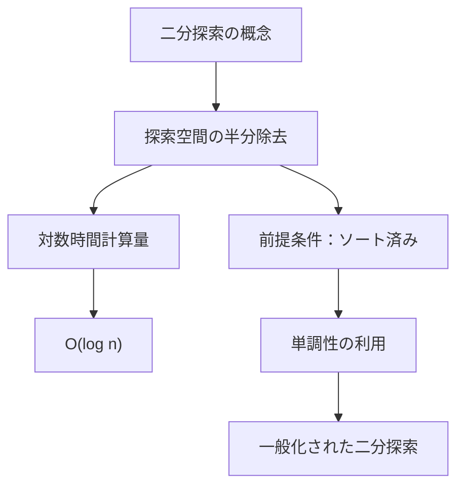
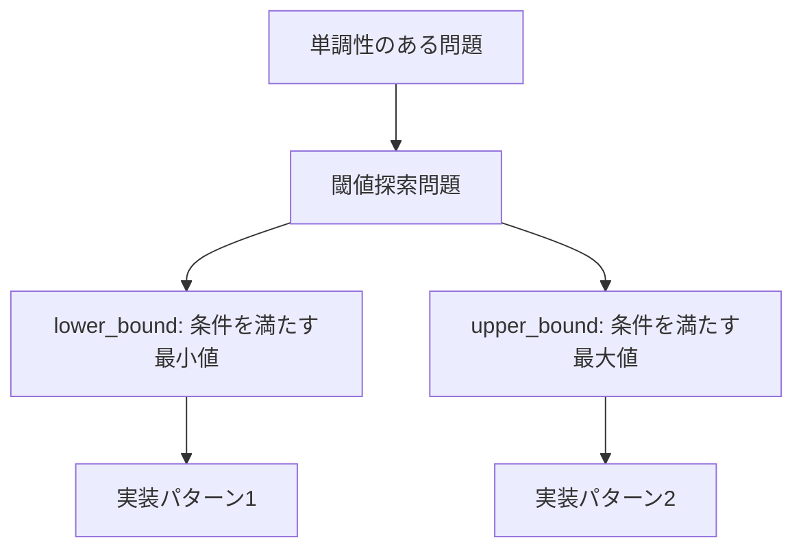
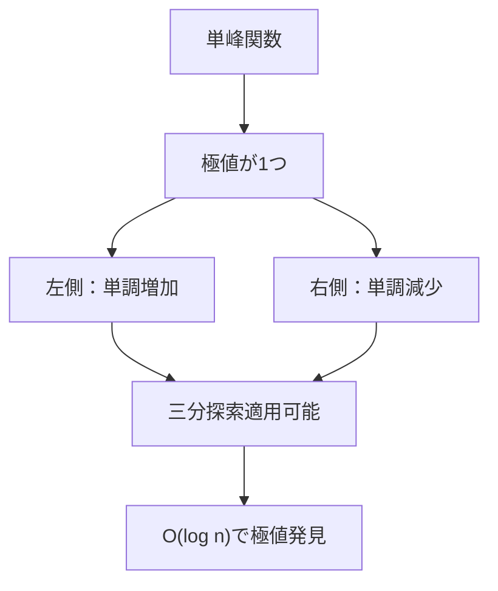
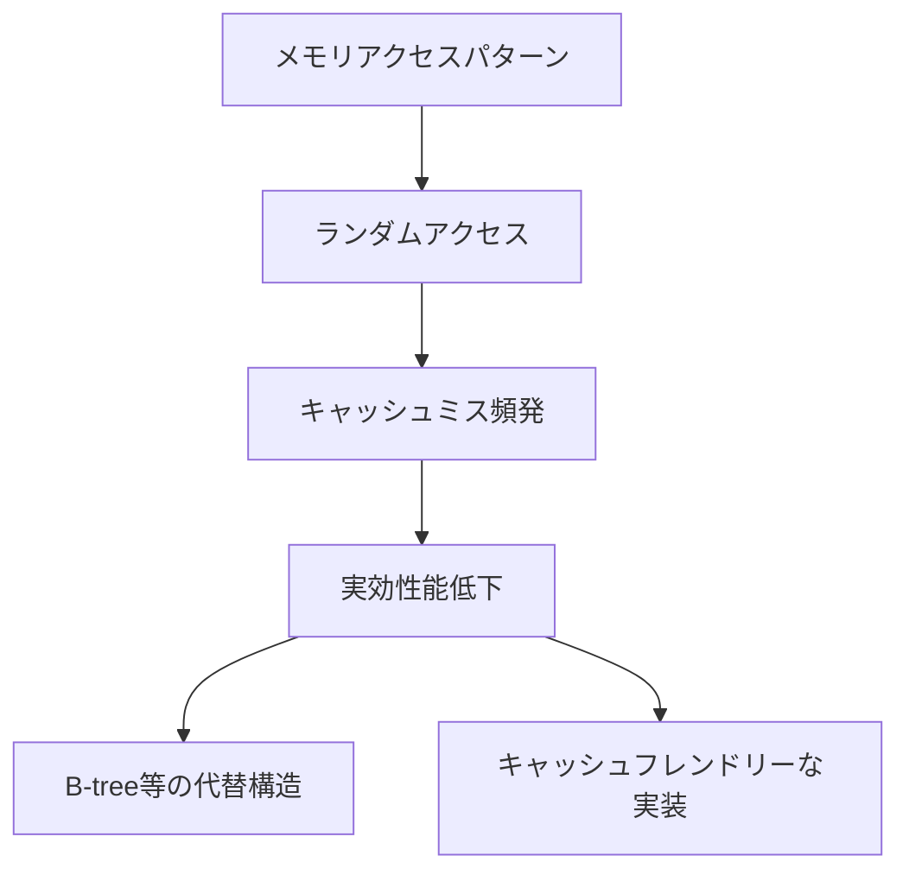
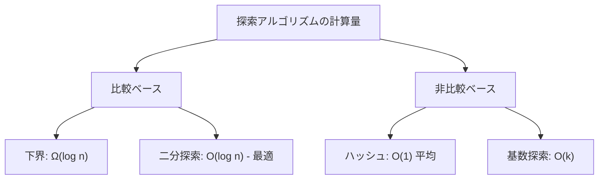

# 二分探索：理論と実装の詳細解説

二分探索（Binary Search）は、ソート済みのデータ構造から特定の要素を効率的に検索するアルゴリズムの一つである。その基本的なアイデアは極めて単純でありながら、正確な実装には繊細な注意が必要であり、また応用範囲も広い。本稿では、二分探索の理論的基礎から実装上の詳細、そして実践的な応用まで、包括的に解説する。



## アルゴリズムの理論的基礎

二分探索の本質は、探索空間を効率的に絞り込むことにある。n個の要素からなるソート済み配列において、任意の要素xを探索する場合、線形探索ではO(n)の時間計算量が必要となる。しかし、配列がソートされているという性質を活用することで、探索空間を毎回半分に削減でき、結果としてO(log n)の時間計算量で探索が可能となる。

この劇的な効率化の背景には、情報理論的な観点がある。n個の要素から1つを特定するために必要な情報量は、log₂(n)ビットである。二分探索は、各比較で1ビットの情報を得ることで、理論的に最適な探索回数を実現している[^1]。

[^1]: D. E. Knuth, "The Art of Computer Programming, Volume 3: Sorting and Searching", 2nd Edition, Addison-Wesley, 1998


## 基本的な実装と境界条件

二分探索の実装において最も重要なのは、境界条件の正確な処理である。多くのプログラマーが二分探索の実装でバグを生む理由は、この境界条件の扱いにある。以下に、最も標準的な実装パターンを示す。

```cpp
int binary_search(const vector<int>& arr, int target) {
    int left = 0;
    int right = arr.size() - 1;
    
    while (left <= right) {
        int mid = left + (right - left) / 2;  // Overflow prevention
        
        if (arr[mid] == target) {
            return mid;
        } else if (arr[mid] < target) {
            left = mid + 1;
        } else {
            right = mid - 1;
        }
    }
    
    return -1;  // Not found
}
```

この実装における重要な設計決定について詳しく見ていこう。まず、`mid`の計算において`(left + right) / 2`ではなく`left + (right - left) / 2`を使用している。これは整数オーバーフローを防ぐための標準的な手法である。`left`と`right`が大きな値の場合、その和が整数型の最大値を超える可能性があるためだ。

また、ループ条件として`left <= right`を使用し、更新時には`left = mid + 1`、`right = mid - 1`としている。この組み合わせは、探索範囲が正確に管理され、無限ループを防ぐことを保証する。別の実装スタイルとして、`left < right`をループ条件とし、`right = mid`とする方法もあるが、これらは異なる不変条件を維持するため、混在させてはならない。

## 一般化された二分探索：単調性の活用

二分探索の真の力は、単純な要素探索を超えた応用にある。実際、二分探索は「単調性」という性質を持つ任意の問題に適用可能である。ここで単調性とは、ある閾値を境に真偽値が切り替わる性質を指す。



この観点から、標準ライブラリの`lower_bound`と`upper_bound`の実装を理解することは重要である。

```cpp
// lower_bound: target以上の最小の要素の位置を返す
int lower_bound(const vector<int>& arr, int target) {
    int left = 0;
    int right = arr.size();  // Note: size(), not size()-1
    
    while (left < right) {
        int mid = left + (right - left) / 2;
        if (arr[mid] < target) {
            left = mid + 1;
        } else {
            right = mid;  // Note: mid, not mid-1
        }
    }
    
    return left;
}

// upper_bound: targetより大きい最小の要素の位置を返す
int upper_bound(const vector<int>& arr, int target) {
    int left = 0;
    int right = arr.size();
    
    while (left < right) {
        int mid = left + (right - left) / 2;
        if (arr[mid] <= target) {  // Note: <=, not <
            left = mid + 1;
        } else {
            right = mid;
        }
    }
    
    return left;
}
```

これらの実装における微妙な違いに注目してほしい。`lower_bound`と`upper_bound`の唯一の違いは、中央値との比較における等号の扱いである。この小さな違いが、異なる境界条件を生み出す。

## 実数値での二分探索

二分探索は離散的な値だけでなく、連続的な実数値に対しても適用可能である。実数値での二分探索は、最適化問題や方程式の数値解法において頻繁に使用される。

```cpp
double binary_search_real(function<bool(double)> predicate, 
                         double low, double high, 
                         double epsilon = 1e-9) {
    while (high - low > epsilon) {
        double mid = (low + high) / 2.0;
        if (predicate(mid)) {
            high = mid;
        } else {
            low = mid;
        }
    }
    
    return low;
}
```

実数値での二分探索では、厳密な等価性を求めることができないため、許容誤差`epsilon`を導入する。また、ループ回数を固定する実装も一般的である。

```cpp
double binary_search_real_fixed(function<bool(double)> predicate,
                               double low, double high,
                               int iterations = 100) {
    for (int i = 0; i < iterations; ++i) {
        double mid = (low + high) / 2.0;
        if (predicate(mid)) {
            high = mid;
        } else {
            low = mid;
        }
    }
    
    return low;
}
```

固定回数の反復では、各反復で探索範囲が半分になるため、100回の反復で約2^100 ≈ 10^30の精度が得られる。これは多くの実用的な問題において十分な精度である。

## 三分探索：単峰関数の最適化

二分探索の発展形として、三分探索（Ternary Search）がある。これは単峰関数（unimodal function）、つまり極値が1つだけ存在する関数の最大値または最小値を見つけるアルゴリズムである。



```cpp
double ternary_search(function<double(double)> f, 
                     double left, double right,
                     double epsilon = 1e-9) {
    while (right - left > epsilon) {
        double mid1 = left + (right - left) / 3.0;
        double mid2 = right - (right - left) / 3.0;
        
        if (f(mid1) < f(mid2)) {  // For maximum
            left = mid1;
        } else {
            right = mid2;
        }
    }
    
    return (left + right) / 2.0;
}
```

三分探索の名前は、探索範囲を3つの部分に分割することに由来するが、実際には各反復で探索範囲の1/3を除外する。これにより、O(log₁.₅ n)の収束速度を実現する。

## 二分探索の応用パターン

### 1. 答えを二分探索する

多くの最適化問題は、「ある値xが実現可能か」という判定問題に帰着できる。この場合、最適値を直接求める代わりに、可能な値の範囲で二分探索を行う。

```cpp
// Example: 最小の最大値問題
// n個の要素をk個のグループに分割し、各グループの和の最大値を最小化
bool is_possible(const vector<int>& arr, int k, long long max_sum) {
    int groups = 1;
    long long current_sum = 0;
    
    for (int val : arr) {
        if (val > max_sum) return false;
        
        if (current_sum + val > max_sum) {
            groups++;
            current_sum = val;
            if (groups > k) return false;
        } else {
            current_sum += val;
        }
    }
    
    return true;
}

long long minimize_maximum_sum(const vector<int>& arr, int k) {
    long long left = *max_element(arr.begin(), arr.end());
    long long right = accumulate(arr.begin(), arr.end(), 0LL);
    
    while (left < right) {
        long long mid = left + (right - left) / 2;
        if (is_possible(arr, k, mid)) {
            right = mid;
        } else {
            left = mid + 1;
        }
    }
    
    return left;
}
```

### 2. 平方根の計算

二分探索を用いた平方根の計算は、ニュートン法と並ぶ基本的な数値計算手法である。

```cpp
double sqrt_binary_search(double n, double epsilon = 1e-9) {
    if (n < 0) throw invalid_argument("Negative input");
    if (n == 0) return 0;
    
    double left = 0;
    double right = max(1.0, n);  // Handle n < 1 case
    
    while (right - left > epsilon) {
        double mid = (left + right) / 2.0;
        if (mid * mid < n) {
            left = mid;
        } else {
            right = mid;
        }
    }
    
    return left;
}
```

### 3. 回転ソート済み配列での探索

ソート済み配列が回転している場合でも、修正された二分探索により O(log n) で探索可能である。

```cpp
int search_rotated_array(const vector<int>& arr, int target) {
    int left = 0;
    int right = arr.size() - 1;
    
    while (left <= right) {
        int mid = left + (right - left) / 2;
        
        if (arr[mid] == target) {
            return mid;
        }
        
        // Left half is sorted
        if (arr[left] <= arr[mid]) {
            if (arr[left] <= target && target < arr[mid]) {
                right = mid - 1;
            } else {
                left = mid + 1;
            }
        }
        // Right half is sorted
        else {
            if (arr[mid] < target && target <= arr[right]) {
                left = mid + 1;
            } else {
                right = mid - 1;
            }
        }
    }
    
    return -1;
}
```

## 実装上の注意点とデバッグ技法

二分探索の実装において頻繁に発生するバグとその対処法について述べる。

### 1. オフバイワンエラー

最も一般的なバグは、境界条件の扱いにおけるオフバイワンエラーである。これを防ぐためには、以下の不変条件を常に意識する必要がある。

```cpp
// Invariant: answer is in [left, right]
// または
// Invariant: answer is in [left, right)
```

どちらの不変条件を採用するかによって、初期化、ループ条件、更新ロジックのすべてが変わる。混在させることは厳禁である。

### 2. 整数オーバーフロー

先述の通り、`mid = (left + right) / 2`は整数オーバーフローを引き起こす可能性がある。Java では`>>>` (unsigned right shift) を使用する別解もある。

```java
int mid = (left + right) >>> 1;  // Java only
```

### 3. 無限ループ

特に`left < right`をループ条件とする実装では、更新ロジックを誤ると無限ループに陥る可能性がある。

```cpp
// Wrong: infinite loop when left + 1 == right
while (left < right) {
    int mid = (left + right) / 2;
    if (condition) {
        left = mid;  // Should be mid + 1
    } else {
        right = mid;
    }
}
```

### デバッグのためのアサーション

実装の正確性を確保するため、アサーションを活用することを推奨する。

```cpp
template<typename T>
int binary_search_debug(const vector<T>& arr, const T& target) {
    assert(is_sorted(arr.begin(), arr.end()));  // Precondition
    
    int left = 0;
    int right = arr.size() - 1;
    int iterations = 0;
    const int max_iterations = 64;  // log2(2^64)
    
    while (left <= right) {
        assert(iterations++ < max_iterations);  // Prevent infinite loop
        assert(left >= 0 && right < arr.size());  // Bounds check
        
        int mid = left + (right - left) / 2;
        
        if (arr[mid] == target) {
            return mid;
        } else if (arr[mid] < target) {
            left = mid + 1;
        } else {
            right = mid - 1;
        }
    }
    
    return -1;
}
```

## パフォーマンス特性と最適化

### キャッシュ効率性

二分探索は理論的にはO(log n)の時間計算量を持つが、実際のパフォーマンスはメモリアクセスパターンに大きく依存する。大規模な配列では、キャッシュミスが性能のボトルネックとなる。



### 分岐予測の影響

現代のCPUは分岐予測機構を持つが、二分探索の比較結果は本質的に予測不可能である。これにより、各比較で分岐予測ミスが発生し、パイプラインストールが生じる。

```cpp
// Branch-free implementation (experimental)
int binary_search_branchless(const int* arr, int n, int target) {
    const int* base = arr;
    while (n > 1) {
        int half = n / 2;
        base = (base[half] < target) ? base + half : base;
        n -= half;
    }
    return (*base == target) ? base - arr : -1;
}
```

### 並列化の可能性

二分探索自体は逐次的なアルゴリズムだが、複数の探索を同時に行う場合は並列化が可能である。また、大規模なデータセットでは、初期の数回の比較を並列に行うことで、キャッシュプリフェッチの効果を得られる場合がある。

## 二分探索の変種と発展

### Exponential Search

要素数が不明または非常に大きい場合に有効な変種として、Exponential Search（指数探索）がある。これは、まず指数的に範囲を拡大して上界を見つけ、その後二分探索を行う。

```cpp
int exponential_search(const vector<int>& arr, int target) {
    if (arr[0] == target) return 0;
    
    int i = 1;
    while (i < arr.size() && arr[i] <= target) {
        i *= 2;
    }
    
    // Binary search in range [i/2, min(i, n-1)]
    int left = i / 2;
    int right = min(i, (int)arr.size() - 1);
    
    return binary_search_range(arr, target, left, right);
}
```

### Interpolation Search

データが一様分布している場合、補間探索（Interpolation Search）は平均的にO(log log n)の性能を達成する。

```cpp
int interpolation_search(const vector<int>& arr, int target) {
    int left = 0;
    int right = arr.size() - 1;
    
    while (left <= right && target >= arr[left] && target <= arr[right]) {
        if (left == right) {
            return (arr[left] == target) ? left : -1;
        }
        
        // Interpolation formula
        int pos = left + ((double)(right - left) / (arr[right] - arr[left])) 
                        * (target - arr[left]);
        
        if (arr[pos] == target) {
            return pos;
        }
        
        if (arr[pos] < target) {
            left = pos + 1;
        } else {
            right = pos - 1;
        }
    }
    
    return -1;
}
```

### Fractional Cascading

複数のソート済みリストに対して同じ要素を探索する場合、Fractional Cascadingという技法により、全体の計算量を削減できる。これは計算幾何学の分野で頻繁に使用される。

## 競技プログラミングにおける二分探索

競技プログラミングでは、二分探索は最も基本的かつ強力なツールの一つである。特に以下のパターンは頻出である。

### 1. 最小値の最大化・最大値の最小化

これらの問題は、しばしば「Binary Search on Answer」と呼ばれる手法で解決できる。

```cpp
// Example: 最小間隔の最大化
// n個の位置にk個の要素を配置し、最小間隔を最大化
bool can_place(const vector<int>& positions, int k, int min_dist) {
    int count = 1;
    int last_pos = positions[0];
    
    for (int i = 1; i < positions.size(); ++i) {
        if (positions[i] - last_pos >= min_dist) {
            count++;
            last_pos = positions[i];
            if (count >= k) return true;
        }
    }
    
    return false;
}

int maximize_minimum_distance(vector<int>& positions, int k) {
    sort(positions.begin(), positions.end());
    
    int left = 0;
    int right = positions.back() - positions.front();
    
    while (left < right) {
        int mid = left + (right - left + 1) / 2;  // Upper binary search
        if (can_place(positions, k, mid)) {
            left = mid;
        } else {
            right = mid - 1;
        }
    }
    
    return left;
}
```

### 2. 単調性を見出す問題

一見二分探索と無関係に見える問題でも、単調性を見出すことで二分探索が適用可能になる場合がある。

```cpp
// Example: 中央値を固定値以上にする最小コスト
// 配列の要素を増加させて、中央値をtarget以上にする最小コスト
long long min_cost_for_median(vector<int> arr, int target) {
    int n = arr.size();
    int median_pos = n / 2;
    
    // Sort array
    sort(arr.begin(), arr.end());
    
    // Binary search on final median value
    long long left = target;
    long long right = target + 1e9;  // Upper bound
    
    auto calculate_cost = [&](long long median_value) {
        long long cost = 0;
        
        // At least half elements should be >= median_value
        vector<long long> costs;
        for (int i = 0; i < n; ++i) {
            if (arr[i] < median_value) {
                costs.push_back(median_value - arr[i]);
            } else {
                costs.push_back(0);
            }
        }
        
        sort(costs.begin(), costs.end());
        
        // Take minimum cost to make at least n/2 + 1 elements >= median_value
        for (int i = 0; i <= median_pos; ++i) {
            cost += costs[i];
        }
        
        return cost;
    };
    
    // Find minimum cost
    long long min_cost = LLONG_MAX;
    for (long long m = target; m <= target + 100; ++m) {  // Check reasonable range
        min_cost = min(min_cost, calculate_cost(m));
    }
    
    return min_cost;
}
```

### 3. 整数二分探索の境界処理

競技プログラミングでは、特に整数での二分探索において、`mid`の計算方法が結果に影響することがある。

```cpp
// Lower bound style: finds minimum x such that f(x) is true
int binary_search_min(function<bool(int)> f, int low, int high) {
    while (low < high) {
        int mid = low + (high - low) / 2;
        if (f(mid)) {
            high = mid;
        } else {
            low = mid + 1;
        }
    }
    return low;
}

// Upper bound style: finds maximum x such that f(x) is true
int binary_search_max(function<bool(int)> f, int low, int high) {
    while (low < high) {
        int mid = low + (high - low + 1) / 2;  // Note: +1
        if (f(mid)) {
            low = mid;
        } else {
            high = mid - 1;
        }
    }
    return low;
}
```

`+1`の有無は、探索が最大値を求めるか最小値を求めるかによって決まる。これを誤ると無限ループに陥る。

## 実装の検証とテスト

二分探索の実装を検証するためのテスト戦略について述べる。

### 境界値テスト

```cpp
void test_binary_search() {
    // Empty array
    assert(binary_search({}, 1) == -1);
    
    // Single element
    assert(binary_search({5}, 5) == 0);
    assert(binary_search({5}, 3) == -1);
    assert(binary_search({5}, 7) == -1);
    
    // Two elements
    assert(binary_search({1, 3}, 1) == 0);
    assert(binary_search({1, 3}, 3) == 1);
    assert(binary_search({1, 3}, 2) == -1);
    
    // Multiple occurrences
    vector<int> arr = {1, 2, 2, 2, 3};
    int pos = binary_search(arr, 2);
    assert(pos >= 1 && pos <= 3 && arr[pos] == 2);
    
    // Large array
    vector<int> large(1000000);
    iota(large.begin(), large.end(), 0);
    assert(binary_search(large, 500000) == 500000);
    assert(binary_search(large, -1) == -1);
    assert(binary_search(large, 1000000) == -1);
}
```

### プロパティベーステスト

```cpp
void property_based_test() {
    random_device rd;
    mt19937 gen(rd());
    
    for (int test = 0; test < 1000; ++test) {
        int n = uniform_int_distribution<>(0, 1000)(gen);
        vector<int> arr(n);
        
        for (int& x : arr) {
            x = uniform_int_distribution<>(-1000, 1000)(gen);
        }
        
        sort(arr.begin(), arr.end());
        
        // Property 1: If found, element must match
        int target = uniform_int_distribution<>(-1500, 1500)(gen);
        int result = binary_search(arr, target);
        
        if (result != -1) {
            assert(arr[result] == target);
        }
        
        // Property 2: If not found, element must not exist
        if (result == -1) {
            assert(find(arr.begin(), arr.end(), target) == arr.end());
        }
        
        // Property 3: Result matches linear search
        int linear_result = -1;
        for (int i = 0; i < n; ++i) {
            if (arr[i] == target) {
                linear_result = i;
                break;
            }
        }
        
        if (linear_result == -1) {
            assert(result == -1);
        } else {
            assert(result != -1 && arr[result] == target);
        }
    }
}
```

## 理論的な下界と最適性

情報理論的な観点から、比較ベースの探索アルゴリズムの下界はΩ(log n)である。これは、n個の要素を区別するために必要な比較回数の下界が⌈log₂ n⌉であることから導かれる[^2]。

[^2]: T. H. Cormen, C. E. Leiserson, R. L. Rivest, and C. Stein, "Introduction to Algorithms", 3rd Edition, MIT Press, 2009

二分探索はこの下界を達成するため、比較ベースのアルゴリズムとしては最適である。ただし、ハッシュテーブルのような非比較ベースのデータ構造では、平均的にO(1)の探索が可能である。



二分探索の定数倍の改善は可能だが、漸近的な改善は不可能である。実用上は、キャッシュ効率やCPUの分岐予測を考慮した実装が重要となる。