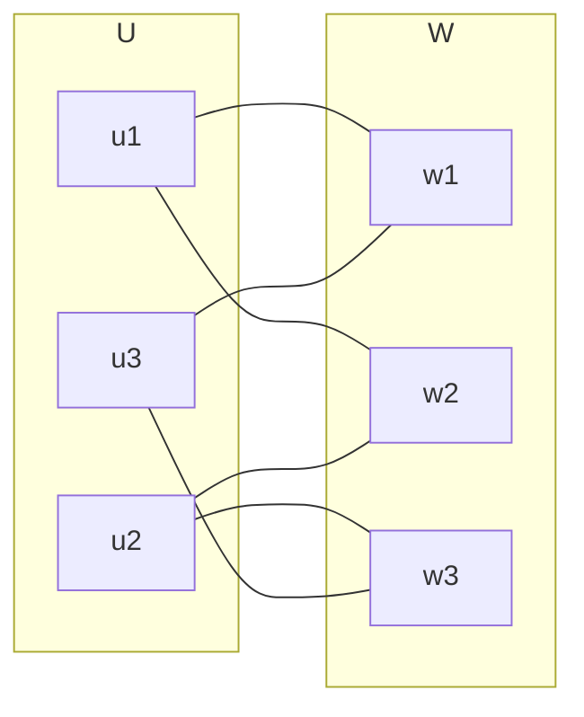
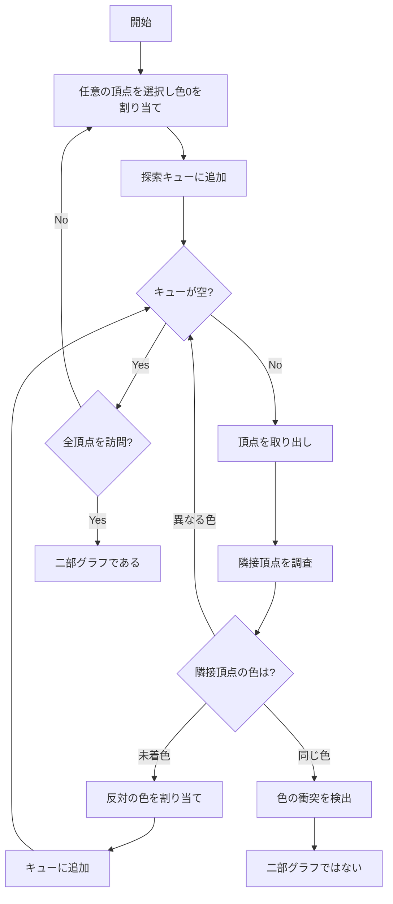
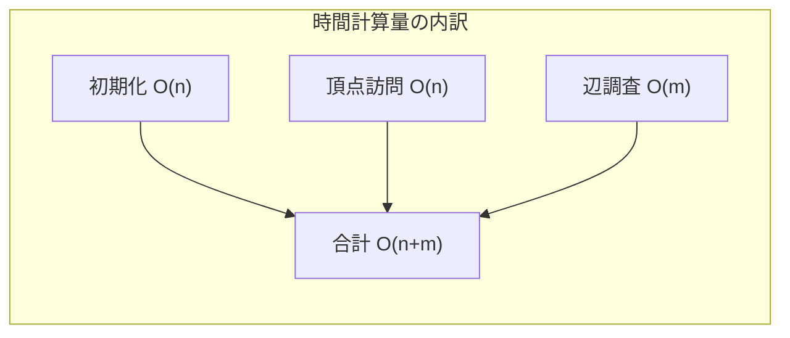
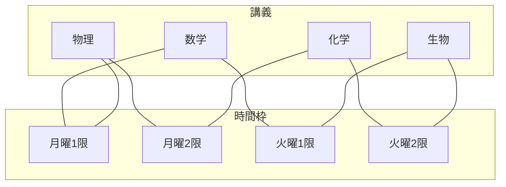

# 二部グラフ判定

二部グラフ（bipartite graph）は、グラフ理論において基本的でありながら実用上極めて重要な構造である。その頂点集合を互いに素な二つの部分集合に分割でき、すべての辺が異なる部分集合間を結ぶという性質は、様々な現実世界の問題をモデル化する際に自然に現れる。本稿では、二部グラフの数学的定義から始まり、その判定アルゴリズムの理論的基礎、効率的な実装方法、そして計算量解析について詳細に論じる。

## 二部グラフの定義と基本性質

無向グラフ $G = (V, E)$ が二部グラフであるとは、頂点集合 $V$ を二つの互いに素な部分集合 $U$ と $W$ に分割でき（すなわち $V = U \cup W$ かつ $U \cap W = \emptyset$）、すべての辺 $e \in E$ について、その端点の一方が $U$ に、もう一方が $W$ に属するような分割が存在することをいう¹。このような分割 $(U, W)$ を二部分割（bipartition）と呼ぶ。



二部グラフの最も重要な特徴付けの一つは、奇数長の閉路を含まないことである。これはKönigの定理として知られ、二部グラフ判定アルゴリズムの理論的基礎となる。

**定理（König, 1936）**: グラフ $G$ が二部グラフであることと、$G$ が奇数長の閉路を含まないことは同値である²。

この定理の証明は両方向について示す必要がある。まず、二部グラフが奇数長閉路を含まないことを示す。二部グラフ $G$ において、任意の閉路 $C = v_0, v_1, ..., v_{k-1}, v_0$ を考える。二部分割を $(U, W)$ とすると、隣接する頂点は異なる部分集合に属するため、閉路上で $U$ と $W$ の間を交互に移動することになる。$v_0$ から始まって $v_0$ に戻るためには、偶数回の移動が必要であり、したがって閉路の長さ $k$ は偶数でなければならない。

逆に、奇数長閉路を含まないグラフが二部グラフであることを示すには、連結成分ごとに考えればよい。任意の頂点 $v$ を選び、$v$ からの最短距離が偶数である頂点の集合を $U$、奇数である頂点の集合を $W$ とする。この分割が二部分割であることは、奇数長閉路が存在しないという仮定から導かれる。

## 二部グラフ判定アルゴリズムの理論的基礎

二部グラフ判定問題は、与えられたグラフが二部グラフであるかどうかを判定し、二部グラフである場合はその二部分割を求める問題である。この問題に対する標準的なアプローチは、グラフの頂点を2色で彩色することである。隣接する頂点が異なる色を持つような彩色が可能であれば、そのグラフは二部グラフである。



この彩色アプローチは、グラフ探索アルゴリズム（幅優先探索または深さ優先探索）を用いて効率的に実装できる。探索の過程で、各頂点に0または1の色を割り当て、隣接する頂点には必ず異なる色を割り当てる。もし隣接する頂点が同じ色を持つ状況が発生すれば、そのグラフは二部グラフではない。

アルゴリズムの正当性は、以下の不変条件によって保証される：
1. 同じ連結成分内の任意の二頂点間の最短路の長さの偶奇性は、その頂点の色の同異と対応する
2. 色の衝突は奇数長閉路の存在を意味する

## 幅優先探索による実装

幅優先探索（BFS）を用いた二部グラフ判定は、レベルごとに頂点を処理するという特性により、直感的な実装が可能である。各レベルの頂点は同じ色を持ち、隣接するレベルの頂点は異なる色を持つ。

```python
from collections import deque

def is_bipartite_bfs(n, edges):
    # Build adjacency list
    graph = [[] for _ in range(n)]
    for u, v in edges:
        graph[u].append(v)
        graph[v].append(u)
    
    # Color array: -1 (unvisited), 0 (color 0), 1 (color 1)
    color = [-1] * n
    
    # Check each connected component
    for start in range(n):
        if color[start] != -1:
            continue
            
        # BFS from unvisited vertex
        queue = deque([start])
        color[start] = 0
        
        while queue:
            u = queue.popleft()
            for v in graph[u]:
                if color[v] == -1:
                    # Assign opposite color
                    color[v] = 1 - color[u]
                    queue.append(v)
                elif color[v] == color[u]:
                    # Same color conflict
                    return False, None
    
    # Construct bipartition
    partition_0 = [i for i in range(n) if color[i] == 0]
    partition_1 = [i for i in range(n) if color[i] == 1]
    
    return True, (partition_0, partition_1)
```

BFSによる実装の利点は、最短路の性質を直接利用できることである。ある頂点からの距離が偶数の頂点はすべて同じ色を持ち、奇数の頂点は反対の色を持つ。この性質により、色の割り当てが自然に決まる。

## 深さ優先探索による実装

深さ優先探索（DFS）を用いた実装は、再帰的な構造により簡潔に記述できる。DFSでは、現在の頂点から隣接頂点へと深く探索を進め、バックトラックしながら全体を探索する。

```python
def is_bipartite_dfs(n, edges):
    # Build adjacency list
    graph = [[] for _ in range(n)]
    for u, v in edges:
        graph[u].append(v)
        graph[v].append(u)
    
    color = [-1] * n
    
    def dfs(v, c):
        color[v] = c
        for u in graph[v]:
            if color[u] == -1:
                if not dfs(u, 1 - c):
                    return False
            elif color[u] == c:
                return False
        return True
    
    # Check each connected component
    for i in range(n):
        if color[i] == -1:
            if not dfs(i, 0):
                return False, None
    
    # Construct bipartition
    partition_0 = [i for i in range(n) if color[i] == 0]
    partition_1 = [i for i in range(n) if color[i] == 1]
    
    return True, (partition_0, partition_1)
```

DFS実装の特徴は、スタックの使用（暗黙的には関数呼び出しスタック）により、メモリ使用量がグラフの最大深さに依存することである。密なグラフでは、BFSの方がメモリ効率が良い場合がある。

## 計算量解析

二部グラフ判定アルゴリズムの計算量は、使用するグラフ探索アルゴリズムの計算量に等しい。グラフ $G = (V, E)$ に対して、$|V| = n$、$|E| = m$ とする。

**時間計算量**: $O(n + m)$

各頂点は高々一度訪問され、各辺は高々二度（両端点から一度ずつ）調査される。したがって、全体の時間計算量は頂点数と辺数の和に比例する。これは、グラフの規模に対して線形時間であり、理論的に最適である。なぜなら、二部グラフでないことを確認するためには、最悪の場合すべての辺を調査する必要があるからである。

**空間計算量**: $O(n + m)$

隣接リスト表現でグラフを保持するために $O(n + m)$ の空間が必要である。さらに、色情報を保持するために $O(n)$ の追加空間が必要である。BFSの場合はキューのために、DFSの場合は再帰スタックのために、最悪で $O(n)$ の追加空間が必要となる。



## 実装上の注意点とエッジケース

実際の実装において注意すべき点がいくつか存在する。まず、グラフが連結でない場合、各連結成分について独立に判定を行う必要がある。上記の実装では、未訪問の頂点から新たな探索を開始することで、この問題に対処している。

自己ループ（頂点から自分自身への辺）が存在する場合、そのグラフは二部グラフではない。なぜなら、自己ループは長さ1の奇数長閉路だからである。実装では、隣接頂点のチェック時に自己ループを検出できる。

```python
# Check for self-loop
if u == v:
    return False  # Self-loop detected
```

多重辺（同じ頂点対を結ぶ複数の辺）は、二部グラフの判定には影響しない。隣接リストに同じ頂点が複数回現れても、色の整合性チェックは正しく機能する。

空グラフ（頂点はあるが辺がない）は二部グラフである。この場合、任意の二部分割が可能であり、実装では各頂点を任意に色分けできる。

## Union-Find を用いた別アプローチ

二部グラフ判定には、Union-Find（素集合データ構造）を用いる興味深いアプローチも存在する。このアプローチでは、各頂点 $v$ に対して二つのノード $v_0$ と $v_1$ を用意し、$v$ が色0または色1を持つ状態を表現する。

```python
class UnionFind:
    def __init__(self, n):
        self.parent = list(range(n))
        self.rank = [0] * n
    
    def find(self, x):
        if self.parent[x] != x:
            self.parent[x] = self.find(self.parent[x])
        return self.parent[x]
    
    def union(self, x, y):
        px, py = self.find(x), self.find(y)
        if px == py:
            return
        if self.rank[px] < self.rank[py]:
            px, py = py, px
        self.parent[py] = px
        if self.rank[px] == self.rank[py]:
            self.rank[px] += 1
    
    def same(self, x, y):
        return self.find(x) == self.find(y)

def is_bipartite_union_find(n, edges):
    uf = UnionFind(2 * n)
    
    for u, v in edges:
        # u and v must have different colors
        # u_0 ∼ v_1 and u_1 ∼ v_0
        uf.union(u, v + n)
        uf.union(u + n, v)
        
        # Check if u can have the same color as itself
        if uf.same(u, u + n):
            return False
    
    return True
```

このアプローチの利点は、動的な辺の追加に対応しやすいことである。新しい辺が追加されるたびに、Union-Find操作を行い、矛盾が生じないかチェックできる。

## 重み付きグラフへの拡張

二部グラフの概念は、重み付きグラフにも自然に拡張される。重み付き二部グラフでは、各辺に重みが付与されているが、二部性の判定自体は重みに依存しない。しかし、重み付き二部グラフは、最大重みマッチングや最小費用流などの最適化問題の文脈で重要となる。

特に、完全二部グラフ $K_{n,m}$（一方の部分集合のすべての頂点が他方の部分集合のすべての頂点と隣接するグラフ）に重みを付けた場合、割当問題（assignment problem）として知られる古典的な最適化問題となる。この問題は、ハンガリアン法などの多項式時間アルゴリズムで解くことができる³。

## 実用的な応用と問題のモデル化

二部グラフは、実世界の多くの問題を自然にモデル化する。典型的な例として、求人マッチング問題がある。求職者の集合と求人の集合があり、各求職者が応募可能な求人への辺を持つグラフは二部グラフとなる。このモデルでは、最大マッチングが最大数の雇用を実現する割り当てに対応する。

スケジューリング問題も二部グラフでモデル化できる。例えば、講義室割り当て問題では、講義の集合と時間枠の集合を頂点とし、ある講義がある時間枠で開講可能な場合に辺を引く。この二部グラフで、各講義が高々一つの時間枠に、各時間枠に高々一つの講義が割り当てられるような割り当て（マッチング）を求める。



回路設計においても二部グラフが現れる。プリント基板の配線問題では、一方の層のピンともう一方の層のピンを接続する必要があり、これは二部グラフの辺として表現される。配線の交差を最小化する問題は、二部グラフの平面描画問題と関連する。

## 関連するグラフクラスとの関係

二部グラフは、他の重要なグラフクラスと密接な関係を持つ。木（tree）はすべて二部グラフである。なぜなら、木は閉路を含まず、したがって奇数長閉路も含まないからである。実際、任意の頂点を根として、深さの偶奇で頂点を分類すれば二部分割が得られる。

平面グラフとの関係も興味深い。Kuratowskiの定理により、グラフが平面的であるための必要十分条件は、$K_5$（5頂点の完全グラフ）と$K_{3,3}$（完全二部グラフ）の細分を含まないことである⁴。$K_{3,3}$は平面グラフでない最小の二部グラフである。

弦グラフ（chordal graph）との関係では、二部グラフが弦グラフであるための必要十分条件は、$C_4$（長さ4の閉路）を誘導部分グラフとして含まないことである。これは、二部弦グラフ（bipartite chordal graph）と呼ばれるクラスを定義する。

## 計算複雑性理論における位置づけ

二部グラフ判定は多項式時間で解ける問題であり、複雑性クラスPに属する。より正確には、対数空間（L）で解けることが知られている⁵。これは、Reingoldの結果により、無向グラフの到達可能性問題が対数空間で解けることから導かれる。

一方、二部グラフに関連する多くの最適化問題は、一般のグラフではNP困難でも、二部グラフに制限すると多項式時間で解ける場合がある。例えば、最大独立集合問題は一般にNP困難だが、二部グラフでは最大マッチングの補集合として多項式時間で求められる（Königの定理）。

並列計算の観点では、二部グラフ判定はNC（Nick's Class）に属する。つまり、多項式個のプロセッサを用いて対数多項式時間で解くことができる。これは、行列の冪乗を用いたアプローチで実現される。

## パフォーマンス最適化と実装の工夫

大規模グラフに対する二部グラフ判定では、キャッシュ効率やメモリアクセスパターンが性能に大きく影響する。隣接リスト表現では、頂点の隣接頂点を連続メモリ領域に配置することで、キャッシュミスを減らせる。

```cpp
struct CompactGraph {
    vector<int> edges;      // All edges in continuous memory
    vector<int> offsets;    // Start index for each vertex
    
    CompactGraph(int n, const vector<pair<int, int>>& edge_list) {
        offsets.resize(n + 1);
        vector<vector<int>> adj(n);
        
        for (auto [u, v] : edge_list) {
            adj[u].push_back(v);
            adj[v].push_back(u);
        }
        
        // Calculate offsets
        offsets[0] = 0;
        for (int i = 0; i < n; i++) {
            offsets[i + 1] = offsets[i] + adj[i].size();
        }
        
        // Copy edges to continuous array
        edges.resize(offsets[n]);
        for (int i = 0; i < n; i++) {
            copy(adj[i].begin(), adj[i].end(), 
                 edges.begin() + offsets[i]);
        }
    }
};
```

並列化の観点では、連結成分ごとの判定は独立に実行できるため、複数のスレッドで並列処理が可能である。ただし、連結成分の検出自体にもコストがかかるため、グラフのサイズと構造に応じて並列化の粒度を調整する必要がある。

## まとめ

二部グラフ判定は、グラフ理論における基本的な問題でありながら、豊富な理論的背景と実用的な応用を持つ。線形時間で解ける効率的なアルゴリズムが存在し、BFSやDFSといった基本的なグラフ探索手法で実装できる。奇数長閉路の非存在という特徴付けは、アルゴリズムの正当性を保証するだけでなく、より深いグラフ理論的な洞察を与える。実装においては、連結性の扱い、メモリ効率、並列化など、実用的な観点からの最適化も重要である。二部グラフの理論は、マッチング理論、ネットワークフロー、組合せ最適化など、より高度なアルゴリズムの基礎となっており、その理解は現代のアルゴリズム設計において不可欠である。

---

¹ Diestel, R. (2017). *Graph Theory* (5th ed.). Springer-Verlag.

² König, D. (1936). *Theorie der endlichen und unendlichen Graphen*. Akademische Verlagsgesellschaft.

³ Kuhn, H. W. (1955). "The Hungarian method for the assignment problem". *Naval Research Logistics Quarterly*, 2(1-2), 83-97.

⁴ Kuratowski, K. (1930). "Sur le problème des courbes gauches en topologie". *Fundamenta Mathematicae*, 15, 271-283.

⁵ Reingold, O. (2008). "Undirected connectivity in log-space". *Journal of the ACM*, 55(4), 1-24.