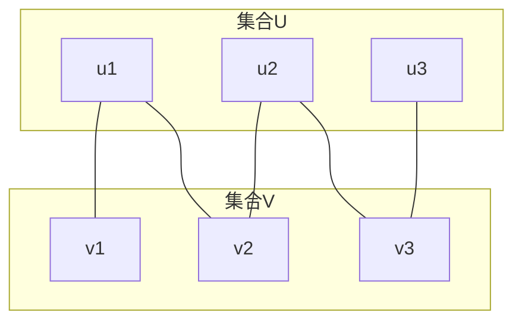
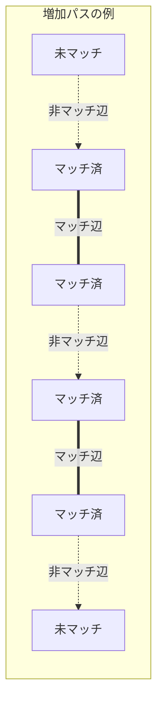
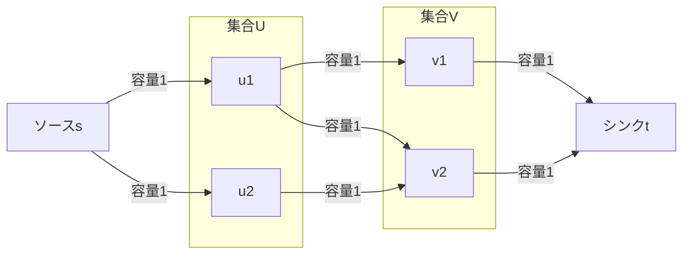
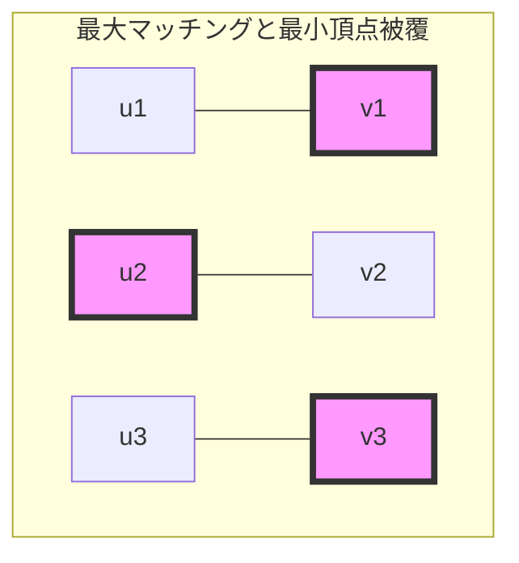

# 二部マッチング

二部マッチングは、グラフ理論における古典的かつ重要な問題であり、現実世界の多くの最適化問題を解決する基礎となっている。本稿では、二部マッチングの理論的基盤から始めて、効率的なアルゴリズムの設計と実装、そして競技プログラミングにおける実践的な応用まで、包括的に解説する。

## 二部グラフとマッチングの定義

グラフ$G = (V, E)$が二部グラフであるとは、頂点集合$V$を互いに素な二つの部分集合$U$と$V$に分割でき、すべての辺$(u, v) \in E$について、$u \in U$かつ$v \in V$（またはその逆）が成り立つときをいう。言い換えれば、同じ部分集合内の頂点間には辺が存在しない。この性質は、グラフが2-彩色可能であることと同値である。



マッチング$M \subseteq E$とは、どの二つの辺も共通の端点を持たない辺の集合である。より形式的には、$M$中の任意の二つの異なる辺$e_1 = (u_1, v_1)$と$e_2 = (u_2, v_2)$について、$u_1 \neq u_2$かつ$v_1 \neq v_2$が成り立つ。マッチング$M$において、ある頂点$v$がマッチング中のいずれかの辺の端点となっているとき、$v$は「マッチされている」または「飽和している」という。

最大マッチング問題は、与えられた二部グラフ$G$において、含まれる辺の数が最大となるマッチング$M^*$を見つける問題である。この問題は多項式時間で解くことができ、その解法は組合せ最適化理論の基礎を成している。

## 増加パスとBergeの定理

最大マッチングを特徴づける上で中心的な役割を果たすのが、増加パス（augmenting path）の概念である。マッチング$M$に対する増加パスとは、マッチされていない頂点から始まり、マッチされていない頂点で終わる交互パス（alternating path）である。ここで交互パスとは、マッチング中の辺とマッチング外の辺が交互に現れるパスを指す。



Claude Bergeによって1957年に証明された定理^[1]は、マッチングが最大であることの必要十分条件を与える：

**Bergeの定理**: マッチング$M$が最大マッチングであることと、$M$に対する増加パスが存在しないことは同値である。

この定理の証明は構成的である。もし増加パス$P$が存在すれば、$M \oplus P$（$M$と$P$の対称差）は$M$よりも1つ多い辺を含むマッチングとなる。逆に、$M$が最大でなければ、より大きなマッチング$M'$が存在し、$M \oplus M'$の連結成分を調べることで増加パスを見つけることができる。

Bergeの定理は、最大マッチングを求めるアルゴリズムの基礎となる。基本的なアプローチは、現在のマッチング$M$に対して増加パスを探し、見つかれば$M$を更新し、見つからなければ$M$が最大であると結論づけるものである。

## Ford-Fulkersonアルゴリズムと最大流問題との関係

二部マッチング問題は、最大流問題の特殊ケースとして定式化できる。この関係性を理解することで、より一般的なネットワークフロー理論の枠組みで二部マッチングを扱うことが可能となる。

二部グラフ$G = (U \cup V, E)$から、以下のようにフローネットワーク$N$を構築する：
1. 新たにソース$s$とシンク$t$を追加する
2. $s$から$U$の各頂点へ容量1の辺を追加
3. $V$の各頂点から$t$へ容量1の辺を追加
4. 元のグラフの各辺$(u, v) \in E$を、$u$から$v$への容量1の有向辺とする



このネットワーク$N$における最大流の値は、元の二部グラフ$G$の最大マッチングのサイズと等しい。さらに、整数容量を持つネットワークでは最大流も整数値となるため（整数性定理）、各辺の流量は0または1となり、流量1の辺が元のグラフのマッチングを形成する。

Ford-Fulkersonアルゴリズムをこのネットワークに適用すると、各反復で増加パスを見つけて流量を1増やすことになり、これは元のグラフで増加パスを見つけてマッチングを拡張することと対応する。計算量は$O(|V||E|)$となる。

## DFSベースの実装

二部マッチングの最も基本的な実装は、深さ優先探索（DFS）を用いて増加パスを探索するものである。以下に、競技プログラミングで頻繁に使用される実装を示す：

```cpp
struct BipartiteMatching {
    int n, m;
    vector<vector<int>> graph;
    vector<int> match_from_left, match_from_right;
    vector<bool> used;
    
    BipartiteMatching(int n, int m) : n(n), m(m), graph(n), 
        match_from_left(n, -1), match_from_right(m, -1), used(n) {}
    
    void add_edge(int u, int v) {
        graph[u].push_back(v);
    }
    
    bool dfs(int u) {
        if (used[u]) return false;
        used[u] = true;
        
        for (int v : graph[u]) {
            if (match_from_right[v] == -1 || dfs(match_from_right[v])) {
                match_from_left[u] = v;
                match_from_right[v] = u;
                return true;
            }
        }
        return false;
    }
    
    int max_matching() {
        int result = 0;
        for (int u = 0; u < n; u++) {
            fill(used.begin(), used.end(), false);
            if (dfs(u)) result++;
        }
        return result;
    }
};
```

この実装では、左側の各頂点から順に増加パスを探索している。`dfs`関数は、頂点`u`から始まる増加パスが存在するかを判定し、存在すればマッチングを更新して`true`を返す。`used`配列は、各DFSの反復で訪問した頂点を記録し、無限ループを防ぐ。

## Hopcroft-Karpアルゴリズム

DFSベースの実装は理解しやすく実装も簡単だが、最悪計算量が$O(|V||E|)$となる。1973年にJohn HopcroftとRichard Karpによって提案されたアルゴリズム^[2]は、複数の増加パスを同時に見つけることで、計算量を$O(|E|\sqrt{|V|})$に改善した。

Hopcroft-Karpアルゴリズムの核心は、最短の増加パスを幅優先探索（BFS）で見つけ、同じ長さの互いに素な増加パスを可能な限り多く見つけることにある。アルゴリズムは以下のフェーズを繰り返す：

1. **BFSフェーズ**: マッチされていない左側の頂点から始めて、増加パスの長さを計算する層別グラフを構築する
2. **DFSフェーズ**: 層別グラフ上でDFSを行い、互いに素な増加パスを見つけてマッチングを更新する

```cpp
struct HopcroftKarp {
    int n, m;
    vector<vector<int>> graph;
    vector<int> match_from_left, match_from_right;
    vector<int> dist;
    
    HopcroftKarp(int n, int m) : n(n), m(m), graph(n),
        match_from_left(n, -1), match_from_right(m, -1), dist(n) {}
    
    void add_edge(int u, int v) {
        graph[u].push_back(v);
    }
    
    bool bfs() {
        queue<int> q;
        for (int u = 0; u < n; u++) {
            if (match_from_left[u] == -1) {
                dist[u] = 0;
                q.push(u);
            } else {
                dist[u] = INT_MAX;
            }
        }
        
        bool found = false;
        while (!q.empty()) {
            int u = q.front();
            q.pop();
            
            for (int v : graph[u]) {
                int next = match_from_right[v];
                if (next == -1) {
                    found = true;
                } else if (dist[next] == INT_MAX) {
                    dist[next] = dist[u] + 1;
                    q.push(next);
                }
            }
        }
        return found;
    }
    
    bool dfs(int u) {
        if (u == -1) return true;
        
        for (int v : graph[u]) {
            int next = match_from_right[v];
            if (dist[next] == dist[u] + 1 && dfs(next)) {
                match_from_left[u] = v;
                match_from_right[v] = u;
                return true;
            }
        }
        
        dist[u] = INT_MAX;
        return false;
    }
    
    int max_matching() {
        int result = 0;
        while (bfs()) {
            for (int u = 0; u < n; u++) {
                if (match_from_left[u] == -1 && dfs(u)) {
                    result++;
                }
            }
        }
        return result;
    }
};
```

Hopcroft-Karpアルゴリズムの計算量解析は非自明である。鍵となる観察は、最短増加パスの長さが単調増加し、長さ$k$の増加パスが存在すれば、最大マッチングのサイズは現在のマッチングのサイズより高々$|V|/k$だけ大きいということである。これにより、$O(\sqrt{|V|})$回の反復で終了することが保証される。

## 最大重み二部マッチング

実際の応用では、単にマッチングの辺数を最大化するだけでなく、辺に重みがある場合の重みの総和を最大化したい場合がある。この問題は最大重み二部マッチング問題または割当問題（assignment problem）と呼ばれる。

最大重み完全マッチング（すべての頂点がマッチされる場合）を求める古典的なアルゴリズムが、1955年にHarold KuhnによってHungarian methodとして発表され^[3]、後にJames Munkresによって改良されたKuhn-Munkresアルゴリズム（ハンガリアン法）である。

アルゴリズムの基本的なアイデアは、双対性理論に基づいている。各頂点に「ポテンシャル」（双対変数）を割り当て、縮小コスト（reduced cost）が非負となるような条件下で、縮小コストが0の辺のみを使った最大マッチングを求める。

```cpp
struct Hungarian {
    int n;
    vector<vector<long long>> cost;
    vector<int> match_from_left, match_from_right;
    
    Hungarian(int n) : n(n), cost(n, vector<long long>(n, 0)),
        match_from_left(n, -1), match_from_right(n, -1) {}
    
    void set_cost(int i, int j, long long c) {
        cost[i][j] = c;
    }
    
    long long solve() {
        vector<long long> u(n, 0), v(n, 0);
        
        // Initialize dual variables
        for (int i = 0; i < n; i++) {
            u[i] = *max_element(cost[i].begin(), cost[i].end());
        }
        
        for (int i = 0; i < n; i++) {
            vector<bool> used_left(n, false), used_right(n, false);
            vector<int> parent(n, -1);
            vector<long long> min_cost(n, LLONG_MAX);
            
            int start = i;
            int current = -1;
            
            do {
                used_left[start] = true;
                long long delta = LLONG_MAX;
                int next = -1;
                
                for (int j = 0; j < n; j++) {
                    if (!used_right[j]) {
                        long long cur = cost[start][j] - u[start] - v[j];
                        if (cur < min_cost[j]) {
                            min_cost[j] = cur;
                            parent[j] = start;
                        }
                        if (min_cost[j] < delta) {
                            delta = min_cost[j];
                            next = j;
                        }
                    }
                }
                
                // Update dual variables
                for (int j = 0; j < n; j++) {
                    if (used_left[j]) u[j] += delta;
                    if (used_right[j]) v[j] -= delta;
                    else min_cost[j] -= delta;
                }
                
                used_right[next] = true;
                current = next;
                start = match_from_right[current];
            } while (start != -1);
            
            // Update matching
            while (current != -1) {
                int prev = parent[current];
                match_from_right[current] = prev;
                swap(current, match_from_left[prev]);
            }
        }
        
        long long result = 0;
        for (int i = 0; i < n; i++) {
            result += cost[i][match_from_left[i]];
        }
        return result;
    }
};
```

このアルゴリズムの計算量は$O(n^3)$であり、密グラフに対して効率的である。各反復で一つの頂点のマッチングを確定し、双対変数の更新により次の増加パスを効率的に見つける。

## 実装上の最適化とテクニック

競技プログラミングにおいて、二部マッチングの実装にはいくつかの重要な最適化テクニックがある。

### メモリ効率の改善

大規模なグラフでは、隣接リストの代わりに辺のリストを使用することでメモリ使用量を削減できる：

```cpp
struct Edge {
    int to, rev;
};

vector<vector<Edge>> graph;

void add_edge(int from, int to) {
    graph[from].push_back({to, (int)graph[to].size()});
    graph[to].push_back({from, (int)graph[from].size() - 1});
}
```

### ランダム化による高速化

DFSベースの実装では、頂点の訪問順序をランダム化することで、実践的な性能が向上することがある：

```cpp
vector<int> order(n);
iota(order.begin(), order.end(), 0);
shuffle(order.begin(), order.end(), mt19937(chrono::steady_clock::now().time_since_epoch().count()));

for (int i : order) {
    if (dfs(i)) result++;
}
```

### 早期終了の条件

理論的な最大マッチングサイズの上界が既知の場合、その値に達したら探索を終了できる：

```cpp
int theoretical_max = min(left_size, right_size);
if (result == theoretical_max) break;
```

## 二部マッチングの拡張と変種

二部マッチングの基本的な問題設定は、様々な方向に拡張されている。これらの拡張は、より複雑な現実世界の問題をモデル化する上で重要である。

### 最小頂点被覆とKönigの定理

二部グラフにおいて、最小頂点被覆（すべての辺を覆うのに必要な最小の頂点集合）のサイズは、最大マッチングのサイズと等しい。これはKönigの定理として知られており^[4]、1931年にDénes Königによって証明された。



最小頂点被覆は、最大マッチングから以下のように構築できる：
1. 最大マッチング$M$を求める
2. マッチされていない左側の頂点から、交互パスで到達可能な頂点を求める
3. 到達可能な右側の頂点と、到達不可能な左側の頂点が最小頂点被覆を形成する

### 安定結婚問題

David GaleとLloyd Shapleyによって1962年に提案された安定結婚問題^[5]は、二部マッチングに選好順序を導入した問題である。各参加者が相手に対する選好順位を持つとき、「不安定なペア」（現在のマッチング相手よりも互いに相手を好む二人）が存在しないマッチングを求める。

Gale-Shapleyアルゴリズム（提案-受諾アルゴリズム）は、必ず安定マッチングを見つけることができ、$O(n^2)$時間で動作する：

```cpp
struct StableMarriage {
    int n;
    vector<vector<int>> men_pref, women_pref;
    vector<vector<int>> women_rank;
    vector<int> match_men, match_women;
    
    StableMarriage(int n) : n(n), men_pref(n, vector<int>(n)),
        women_pref(n, vector<int>(n)), women_rank(n, vector<int>(n)),
        match_men(n, -1), match_women(n, -1) {}
    
    void solve() {
        // Precompute rankings for women
        for (int w = 0; w < n; w++) {
            for (int i = 0; i < n; i++) {
                women_rank[w][women_pref[w][i]] = i;
            }
        }
        
        queue<int> free_men;
        vector<int> next_proposal(n, 0);
        
        for (int m = 0; m < n; m++) {
            free_men.push(m);
        }
        
        while (!free_men.empty()) {
            int m = free_men.front();
            free_men.pop();
            
            int w = men_pref[m][next_proposal[m]++];
            
            if (match_women[w] == -1) {
                match_men[m] = w;
                match_women[w] = m;
            } else {
                int current = match_women[w];
                if (women_rank[w][m] < women_rank[w][current]) {
                    match_men[m] = w;
                    match_women[w] = m;
                    match_men[current] = -1;
                    free_men.push(current);
                } else {
                    free_men.push(m);
                }
            }
        }
    }
};
```

### オンライン二部マッチング

オンライン二部マッチング問題では、片側の頂点集合は事前に与えられるが、もう片側の頂点は逐次的に到着し、到着時点で即座にマッチングを決定しなければならない。この問題は、オンライン広告配信やクラウドソーシングなどの応用がある。

KarpらによるRANKINGアルゴリズム^[6]は、最適解の$1-1/e \approx 0.632$倍の期待性能を保証する：

```cpp
struct OnlineBipartiteMatching {
    int n;
    vector<int> ranking;
    vector<bool> matched;
    mt19937 rng;
    
    OnlineBipartiteMatching(int n) : n(n), ranking(n), matched(n, false),
        rng(chrono::steady_clock::now().time_since_epoch().count()) {
        iota(ranking.begin(), ranking.end(), 0);
        shuffle(ranking.begin(), ranking.end(), rng);
    }
    
    int match_vertex(const vector<int>& neighbors) {
        int best_rank = n;
        int best_vertex = -1;
        
        for (int v : neighbors) {
            if (!matched[v] && ranking[v] < best_rank) {
                best_rank = ranking[v];
                best_vertex = v;
            }
        }
        
        if (best_vertex != -1) {
            matched[best_vertex] = true;
        }
        return best_vertex;
    }
};
```

## 競技プログラミングにおける応用

二部マッチングは、一見すると無関係に見える多くの問題の解法の核心となる。以下に、代表的な応用パターンを詳述する。

### DAGの最小パス被覆

有向非巡回グラフ（DAG）において、すべての頂点を覆う互いに素なパスの最小数を求める問題は、二部マッチングに帰着できる。

まず、各頂点$v$を$v_{in}$と$v_{out}$に分割し、元のグラフの各辺$(u, v)$に対して$u_{out}$から$v_{in}$への辺を張る。この二部グラフの最大マッチング数を$M$とすると、最小パス被覆数は$|V| - M$となる。

```cpp
int min_path_cover(const vector<vector<int>>& dag) {
    int n = dag.size();
    BipartiteMatching bm(n, n);
    
    for (int u = 0; u < n; u++) {
        for (int v : dag[u]) {
            bm.add_edge(u, v);
        }
    }
    
    return n - bm.max_matching();
}
```

### 格子点の独立集合

$n \times m$の格子において、隣接する格子点（上下左右）を同時に選ばないという制約の下で、最大何個の点を選べるかという問題は、格子を市松模様に塗り分けることで二部グラフの最大独立集合問題に帰着できる。

Königの定理より、二部グラフの最大独立集合のサイズは、全頂点数から最大マッチング数を引いた値に等しい：

```cpp
int max_independent_set_on_grid(int n, int m, const vector<pair<int, int>>& forbidden) {
    set<pair<int, int>> forbidden_set(forbidden.begin(), forbidden.end());
    vector<vector<int>> id(n, vector<int>(m, -1));
    vector<pair<int, int>> black, white;
    
    for (int i = 0; i < n; i++) {
        for (int j = 0; j < m; j++) {
            if (forbidden_set.count({i, j})) continue;
            
            if ((i + j) % 2 == 0) {
                id[i][j] = black.size();
                black.push_back({i, j});
            } else {
                id[i][j] = white.size();
                white.push_back({i, j});
            }
        }
    }
    
    BipartiteMatching bm(black.size(), white.size());
    int dx[] = {0, 1, 0, -1};
    int dy[] = {1, 0, -1, 0};
    
    for (int i = 0; i < black.size(); i++) {
        auto [x, y] = black[i];
        for (int d = 0; d < 4; d++) {
            int nx = x + dx[d];
            int ny = y + dy[d];
            if (nx >= 0 && nx < n && ny >= 0 && ny < m && id[nx][ny] != -1) {
                bm.add_edge(i, id[nx][ny]);
            }
        }
    }
    
    return black.size() + white.size() - bm.max_matching();
}
```

### 区間スケジューリングの変種

複数のマシンで区間ジョブをスケジューリングする問題も、適切な変換により二部マッチングに帰着できることがある。例えば、各ジョブが実行可能な時間スロットの集合が与えられたとき、最大何個のジョブを実行できるかという問題は、ジョブと時間スロットを結ぶ二部グラフの最大マッチング問題となる。

### Hall's Marriage Theoremの応用

二部グラフ$G = (X \cup Y, E)$において、$|X| = |Y|$のとき、完全マッチングが存在する必要十分条件は、$X$の任意の部分集合$S$に対して$|N(S)| \geq |S|$が成り立つことである（ここで$N(S)$は$S$の隣接頂点集合）。これはPhilip Hallによって1935年に証明された^[7]。

この定理は、多くの組合せ論的問題の存在性を証明する際に使用される。例えば、$n \times n$のラテン方陣の存在や、正則二部グラフの完全マッチングの存在などが、この定理から導かれる。

## 実装上の注意点とデバッグ

二部マッチングの実装において、よくあるバグやミスを避けるための注意点を述べる。

### インデックスの管理

左側と右側の頂点集合で異なるインデックス体系を使用する場合、混同しやすい。一貫性のある命名規則を使用し、必要に応じてアサーションを追加する：

```cpp
assert(0 <= u && u < n_left);
assert(0 <= v && v < n_right);
```

### 初期化の確認

マッチング配列や訪問フラグの初期化を忘れることは一般的なミスである。特に、複数のテストケースを処理する場合は注意が必要：

```cpp
void reset() {
    fill(match_from_left.begin(), match_from_left.end(), -1);
    fill(match_from_right.begin(), match_from_right.end(), -1);
}
```

### 最大流への変換時の容量設定

二部マッチングを最大流問題として解く場合、すべての辺の容量を1に設定することを忘れないよう注意する。また、残余グラフの構築も正確に行う必要がある。

### 計算量の見積もり

問題の規模に応じて適切なアルゴリズムを選択することが重要である。$|V| = 10^3$程度であれば単純なDFS実装で十分だが、$|V| = 10^5$以上ではHopcroft-Karpアルゴリズムの使用を検討すべきである。

二部マッチングは、その簡潔な問題設定にもかかわらず、深い理論的背景と幅広い応用を持つ。本稿で述べた理論とアルゴリズムは、競技プログラミングにおいてだけでなく、実世界の最適化問題を解決する上でも重要な道具となる。効率的な実装と、問題を二部マッチングに帰着させる洞察力を身につけることで、複雑に見える問題も優雅に解決できるようになるだろう。

---

^[1]: Berge, C. (1957). "Two theorems in graph theory". Proceedings of the National Academy of Sciences, 43(9), 842-844.

^[2]: Hopcroft, J. E., & Karp, R. M. (1973). "An n^5/2 algorithm for maximum matchings in bipartite graphs". SIAM Journal on Computing, 2(4), 225-231.

^[3]: Kuhn, H. W. (1955). "The Hungarian method for the assignment problem". Naval Research Logistics Quarterly, 2(1-2), 83-97.

^[4]: König, D. (1931). "Gráfok és mátrixok". Matematikai és Fizikai Lapok, 38, 116-119.

^[5]: Gale, D., & Shapley, L. S. (1962). "College admissions and the stability of marriage". The American Mathematical Monthly, 69(1), 9-15.

^[6]: Karp, R. M., Vazirani, U. V., & Vazirani, V. V. (1990). "An optimal algorithm for on-line bipartite matching". Proceedings of the 22nd Annual ACM Symposium on Theory of Computing, 352-358.

^[7]: Hall, P. (1935). "On representatives of subsets". Journal of the London Mathematical Society, 10(1), 26-30.