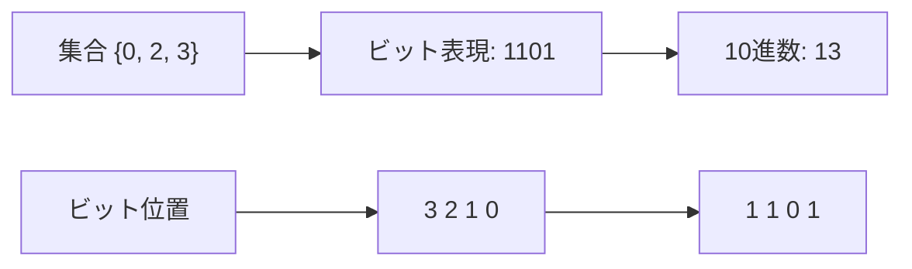
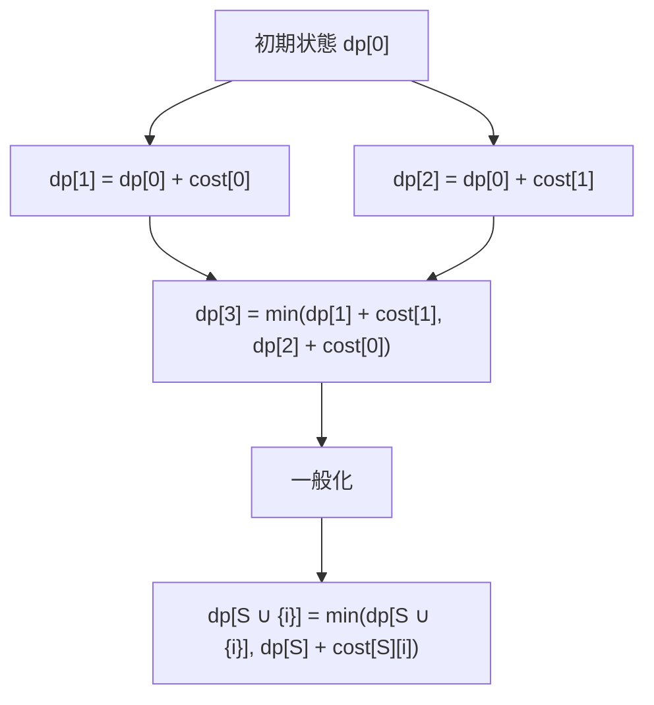
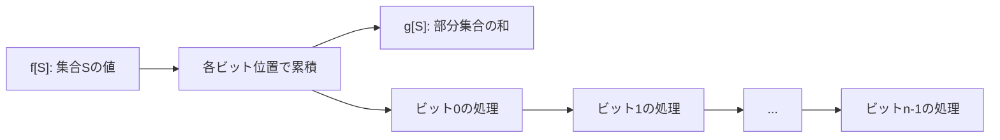
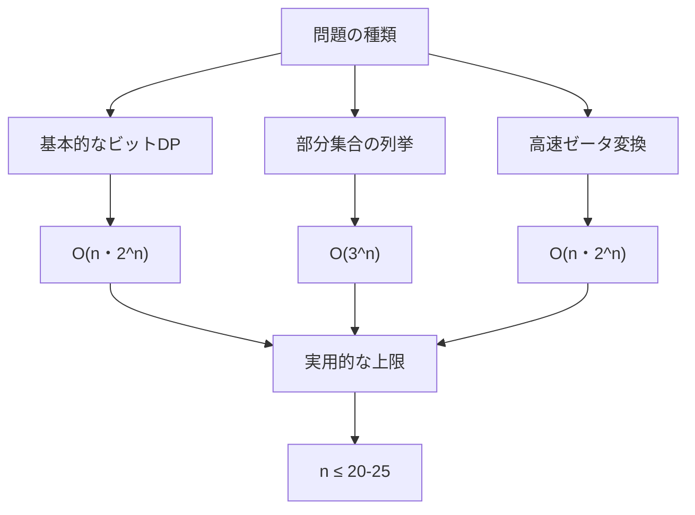

# ビットDP

ビットDP（Bit Dynamic Programming）は、動的計画法において状態をビットマスクで表現する手法であり、組み合わせ最適化問題や集合に関する問題を効率的に解く強力なアルゴリズムパターンです。特に要素数が20個程度までの小規模な集合に対する全探索が必要な問題において、指数時間の計算量を実用的な時間で処理することを可能にします。本稿では、ビットDPの理論的基盤から実装の詳細、そして実践的な応用まで、体系的に解説していきます。

## ビット演算と集合表現の数学的基礎

ビットDPを理解するためには、まずビット演算による集合表現の数学的基礎を押さえる必要があります。n個の要素からなる集合 $U = \{0, 1, 2, ..., n-1\}$ の部分集合は、n桁の2進数で表現できます。この表現において、i番目のビットが1であることは、要素iがその部分集合に含まれることを意味します。



この表現方法により、$2^n$ 個の部分集合すべてを 0 から $2^n - 1$ までの整数で一意に表現できます。集合演算とビット演算の対応関係は以下のように定式化されます：

- 和集合 $A \cup B$ : `A | B`
- 積集合 $A \cap B$ : `A & B`
- 差集合 $A \setminus B$ : `A & ~B`
- 対称差 $A \triangle B$ : `A ^ B`
- 要素iの追加 : `S | (1 << i)`
- 要素iの削除 : `S & ~(1 << i)`
- 要素iの所属判定 : `(S >> i) & 1`

これらの演算はすべて $O(1)$ 時間で実行可能であり、通常の集合操作と比較して計算効率の面で大きなアドバンテージを持ちます。

## 動的計画法における状態空間の構築

ビットDPの本質は、指数的な状態空間を持つ動的計画法を効率的に実装することにあります。一般的な動的計画法では、状態を多次元配列のインデックスとして表現しますが、ビットDPでは部分集合を整数値として扱うことで、状態遷移をより簡潔に記述できます。

典型的な状態定義として、`dp[S]` を「集合Sの要素を使用したときの最適値」と定義します。ここでSはビットマスクとして表現された部分集合です。状態遷移は、現在の集合から要素を追加または削除することで新しい状態を生成し、それぞれの選択肢から最適なものを選ぶという形で記述されます。



状態遷移の一般的なパターンは、現在の状態Sから次の状態への遷移を考える際に、Sに含まれない要素を追加する、またはSから特定の要素を削除するという操作を行います。これらの操作は前述のビット演算により高速に実行できます。

## 巡回セールスマン問題への応用

ビットDPの最も代表的な応用例として、巡回セールスマン問題（TSP: Traveling Salesman Problem）があります。n個の都市すべてを一度ずつ訪問して出発点に戻る最短経路を求める問題です。通常の全探索では $O(n!)$ の計算量となりますが、ビットDPを用いることで $O(n^2 \cdot 2^n)$ に改善できます。

状態定義として `dp[S][v]` を「集合Sの都市をすべて訪問し、現在都市vにいるときの最小コスト」とします。初期状態は `dp[{0}][0] = 0`（都市0から出発）で、他はすべて無限大に初期化します。

```cpp
// TSP implementation using bit DP
int tsp(vector<vector<int>>& dist) {
    int n = dist.size();
    vector<vector<int>> dp(1 << n, vector<int>(n, INF));
    
    dp[1][0] = 0;  // Start from city 0
    
    for (int S = 1; S < (1 << n); S++) {
        for (int v = 0; v < n; v++) {
            if (!(S & (1 << v))) continue;  // v not in S
            if (dp[S][v] == INF) continue;
            
            for (int u = 0; u < n; u++) {
                if (S & (1 << u)) continue;  // u already in S
                int next_S = S | (1 << u);
                dp[next_S][u] = min(dp[next_S][u], 
                                   dp[S][v] + dist[v][u]);
            }
        }
    }
    
    int ans = INF;
    for (int v = 1; v < n; v++) {
        ans = min(ans, dp[(1 << n) - 1][v] + dist[v][0]);
    }
    
    return ans;
}
```

この実装では、外側のループで訪問済み都市の集合Sを小さい順に処理し、内側のループで現在位置vから次の都市uへの遷移を考えています。ビットマスクを使用することで、訪問済み都市の管理が単一の整数で行え、集合演算も高速に実行できます。

## 部分集合の列挙と高速ゼータ変換

ビットDPにおいて頻繁に必要となる操作の一つが、ある集合の部分集合をすべて列挙することです。素朴な実装では $O(3^n)$ の計算量となりますが、ビット演算を巧みに使用することで効率的に実装できます。

```cpp
// Enumerate all subsets of S
for (int T = S; T > 0; T = (T - 1) & S) {
    // Process subset T of S
}
// Don't forget the empty set
```

この手法は、Tから1を引くことで最下位の1ビットから下位ビットがすべて反転し、それとSの積を取ることで次の部分集合が得られるという性質を利用しています。

高速ゼータ変換は、部分集合の和を効率的に計算するアルゴリズムです。`f[S]` から `g[S] = Σ_{T⊆S} f[T]` を $O(n \cdot 2^n)$ で計算できます：

```cpp
// Fast zeta transform
vector<int> zeta(vector<int>& f) {
    int n = __builtin_ctz(f.size());
    vector<int> g = f;
    
    for (int i = 0; i < n; i++) {
        for (int S = 0; S < (1 << n); S++) {
            if (S & (1 << i)) {
                g[S] += g[S ^ (1 << i)];
            }
        }
    }
    
    return g;
}
```



## 最大独立集合問題とクリーク問題

グラフ理論における重要な問題である最大独立集合問題も、ビットDPによって効率的に解くことができます。独立集合とは、どの2頂点も隣接していない頂点集合のことです。

```cpp
// Maximum independent set
int maxIndependentSet(vector<vector<int>>& adj) {
    int n = adj.size();
    vector<int> dp(1 << n);
    
    for (int S = 0; S < (1 << n); S++) {
        bool is_independent = true;
        
        // Check if S is an independent set
        for (int i = 0; i < n && is_independent; i++) {
            if (!(S & (1 << i))) continue;
            for (int j = i + 1; j < n; j++) {
                if ((S & (1 << j)) && adj[i][j]) {
                    is_independent = false;
                    break;
                }
            }
        }
        
        if (is_independent) {
            dp[S] = __builtin_popcount(S);
        } else {
            // Not independent, compute from subsets
            for (int i = 0; i < n; i++) {
                if (S & (1 << i)) {
                    dp[S] = max(dp[S], dp[S ^ (1 << i)]);
                }
            }
        }
    }
    
    return dp[(1 << n) - 1];
}
```

この実装では、まず集合Sが独立集合かどうかを判定し、独立集合であればその要素数を記録します。独立集合でない場合は、要素を一つ除いた部分集合の最大値を取ります。

## 状態圧縮とメモリ最適化

ビットDPの実装において、メモリ使用量は重要な考慮事項です。n個の要素に対して $2^n$ の状態空間が必要となるため、nが大きくなるとメモリ制約が問題となります。実践的には、以下のような最適化手法が用いられます。

まず、不要な状態を保持しないことが重要です。多くの問題では、すべての状態を同時に保持する必要はなく、現在処理中の状態とその遷移先のみを保持すれば十分です。また、対称性を利用して状態数を削減することも可能です。

```cpp
// Memory-optimized implementation with rolling array
vector<int> optimizedDP(int n) {
    vector<int> curr(1 << n), next(1 << n);
    
    // Process by number of bits
    for (int k = 0; k <= n; k++) {
        fill(next.begin(), next.end(), 0);
        
        for (int S = 0; S < (1 << n); S++) {
            if (__builtin_popcount(S) != k) continue;
            
            // State transition
            for (int i = 0; i < n; i++) {
                if (S & (1 << i)) continue;
                int T = S | (1 << i);
                next[T] = max(next[T], curr[S] + value[i]);
            }
        }
        
        swap(curr, next);
    }
    
    return curr;
}
```

## 計算量の詳細な分析

ビットDPの計算量は、状態数と各状態での遷移数の積で決まります。一般的なパターンでは：

- 状態数: $O(2^n)$
- 各状態での遷移: $O(n)$ または $O(n^2)$
- 全体の計算量: $O(n \cdot 2^n)$ または $O(n^2 \cdot 2^n)$

しかし、問題によってはより詳細な分析が必要です。例えば、部分集合を列挙する場合の計算量は、各集合Sに対して $2^{|S|}$ 個の部分集合があることから、全体で $\sum_{S} 2^{|S|} = 3^n$ となります[^1]。



## 実装上の注意点とデバッグ手法

ビットDPの実装では、ビット演算に関する細かなミスが頻発します。特に注意すべき点として：

1. **演算子の優先順位**: ビット演算子は比較演算子より優先順位が低いため、`(S & (1 << i)) != 0` のように括弧を適切に使用する必要があります。

2. **符号付き整数のオーバーフロー**: `1 << 31` は符号付き整数では負の値となるため、必要に応じて `1LL << i` のようにlong long型を使用します。

3. **境界条件**: 空集合（S = 0）や全体集合（S = (1 << n) - 1）の扱いには特に注意が必要です。

デバッグ時には、ビットマスクを2進数表現で出力する関数を用意すると便利です：

```cpp
void printBits(int S, int n) {
    for (int i = n - 1; i >= 0; i--) {
        cout << ((S >> i) & 1);
    }
    cout << endl;
}
```

## 発展的な応用：プロファイル動的計画法

ビットDPの発展形として、プロファイル動的計画法（Profile Dynamic Programming）があります。これは、グリッド上の問題において、ある行または列の状態をビットマスクで表現し、行単位または列単位で処理を進める手法です。

例えば、ドミノタイリング問題では、各列の埋まり方をビットマスクで表現し、左から右へ列を追加していきます。状態 `dp[i][mask]` は「i列目まで埋めて、i列目の状態がmaskであるときの場合の数」を表します。

この手法により、グリッドの一方の次元が小さい場合に、もう一方の次元に対して多項式時間で解くことが可能になります。計算量は $O(m \cdot 2^n \cdot 2^n)$ となり、nが小さければ実用的な時間で計算できます。

## 並列化とSIMD最適化

現代のCPUアーキテクチャを活用した最適化として、ビットDPの並列化とSIMD（Single Instruction Multiple Data）命令の活用があります。ビット演算は本質的に並列性が高く、複数の状態を同時に処理することが可能です。

```cpp
// SIMD-optimized bit operations
#include <immintrin.h>

void simdBitDP(int n) {
    const int states = 1 << n;
    const int simd_width = 8;  // 256-bit AVX2
    
    alignas(32) int dp[states];
    
    for (int S = 0; S < states; S += simd_width) {
        __m256i vec = _mm256_load_si256((__m256i*)&dp[S]);
        // SIMD operations
        _mm256_store_si256((__m256i*)&dp[S], vec);
    }
}
```

## 理論的限界と実用性の境界

ビットDPは強力な手法ですが、その適用範囲には明確な限界があります。状態数が $2^n$ であることから、実用的にはn ≤ 25程度が限界となります。これは、メモリ使用量（32ビット整数で128MB程度）と計算時間の両面からの制約です。

しかし、多くの実問題では、この制約内で十分な解を得ることができます。特に、厳密解が必要で、かつ問題サイズが小規模な場合には、ビットDPは最適な選択肢となります。より大規模な問題に対しては、近似アルゴリズムやヒューリスティクスとの組み合わせが検討されます。

ビットDPの理論的な重要性は、NP困難問題に対する指数時間アルゴリズムの設計において、単純な全探索よりも効率的な解法を提供する点にあります。これは、固定パラメータ扱い可能性（Fixed Parameter Tractability）の文脈でも重要な位置を占めています[^2]。

[^1]: Knuth, D. E. (2011). The Art of Computer Programming, Volume 4A: Combinatorial Algorithms, Part 1. Addison-Wesley Professional.

[^2]: Cygan, M., et al. (2015). Parameterized Algorithms. Springer.