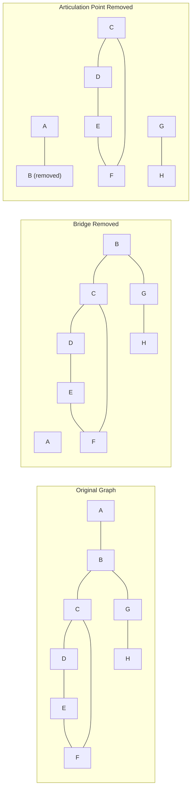
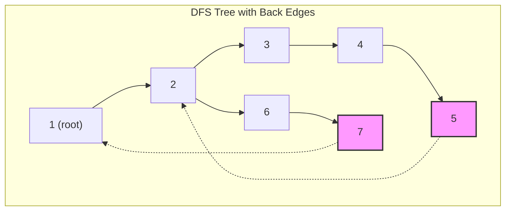

# 橋と関節点

無向グラフにおける橋（bridge）と関節点（articulation point、切断点とも呼ばれる）は、グラフの連結性を議論する上で中心的な役割を果たす概念である。これらは、その除去によってグラフの連結成分数が増加するという特性を持つ要素として定義され、ネットワークの脆弱性分析やグラフの構造理解において重要な指標となる。本稿では、これらの概念の数学的定義から始め、Tarjanによって提案された効率的な検出アルゴリズムの詳細、そして競技プログラミングにおける実装上の注意点まで、包括的に解説する。

## 基本概念と定義

無向グラフ$G = (V, E)$において、橋と関節点は以下のように定義される。辺$e \in E$が橋であるとは、$e$を除去したグラフ$G' = (V, E \setminus \{e\})$の連結成分数が、元のグラフ$G$の連結成分数よりも増加することを意味する。同様に、頂点$v \in V$が関節点であるとは、$v$とそれに接続する全ての辺を除去したグラフ$G' = (V \setminus \{v\}, E')$（ただし$E'$は$v$を端点としない辺の集合）の連結成分数が増加することを意味する。



これらの概念の重要性は、グラフの堅牢性分析において顕著に現れる。例えば、通信ネットワークにおいて橋となる通信路や関節点となるノードは、システム全体の可用性に対する単一障害点（single point of failure）となる。競技プログラミングの文脈では、グラフの構造を理解し、効率的に処理するための前処理として、これらの要素を特定することが求められる場面が多い。

## 深さ優先探索に基づく検出原理

橋と関節点の検出アルゴリズムの中核には、深さ優先探索（DFS）による到達可能性の解析がある。DFSを実行すると、グラフの辺は木辺（tree edge）と後退辺（back edge）に分類される。木辺はDFS木を構成する辺であり、後退辺はDFS木において祖先と子孫を結ぶ辺である。



DFS木において、ある頂点$v$から、その子孫を経由してDFS木上で$v$より上位（訪問順序が早い）の頂点に到達できるかどうかが、橋と関節点の判定の鍵となる。この到達可能性を効率的に計算するために、各頂点に対して以下の2つの値を定義する：

- $\text{disc}[v]$：頂点$v$の発見時刻（DFSで最初に訪問された時刻）
- $\text{low}[v]$：頂点$v$から、$v$自身およびその子孫から後退辺を高々1本使って到達可能な頂点の中で、最小の発見時刻

$\text{low}[v]$の再帰的な定義は以下の通りである：

$$\text{low}[v] = \min\begin{cases}
\text{disc}[v] \\
\text{low}[u] & \text{for all children } u \text{ of } v \text{ in DFS tree} \\
\text{disc}[w] & \text{for all back edges } (v, w)
\end{cases}$$

## Tarjanのアルゴリズム

Robert Tarjanによって1972年に提案されたアルゴリズムは、単一のDFS走査で橋と関節点を同時に検出する優れた手法である[^1]。このアルゴリズムの基本的なアイデアは、DFS木における各辺$(u, v)$（$u$が$v$の親）について、$v$を根とする部分木から$u$より上位の頂点への経路が存在するかどうかを$\text{low}$値を用いて判定することである。

[^1]: Tarjan, R. (1972). "Depth-first search and linear graph algorithms". SIAM Journal on Computing, 1(2), 146-160.

### 橋の判定条件

DFS木の辺$(u, v)$（$u$が$v$の親）が橋であるための必要十分条件は：

$$\text{low}[v] > \text{disc}[u]$$

この条件は、$v$を根とする部分木から、後退辺を使っても$u$より上位の頂点に到達できないことを意味する。つまり、辺$(u, v)$を除去すると、$v$を含む部分木が$u$を含む部分から切り離されることを示している。

### 関節点の判定条件

頂点$u$が関節点であるための条件は、$u$がDFS木の根であるかどうかで異なる：

1. $u$がDFS木の根の場合：$u$が2つ以上の子を持つ
2. $u$がDFS木の根でない場合：ある子$v$に対して$\text{low}[v] \geq \text{disc}[u]$

根でない頂点の条件は、ある子$v$を根とする部分木から、$u$を経由せずに$u$より上位の頂点に到達できないことを意味する。これは、$u$を除去すると、その子を含む部分木が切り離されることを示している。

## アルゴリズムの詳細実装

以下に、Tarjanのアルゴリズムの実装を示す。この実装は、隣接リスト表現を用いた無向グラフに対して動作する。

```cpp
class BridgeArticulation {
private:
    vector<vector<int>> adj;
    vector<int> disc, low, parent;
    vector<bool> visited, ap;
    vector<pair<int, int>> bridges;
    int timer;
    
    void dfs(int u) {
        visited[u] = true;
        disc[u] = low[u] = ++timer;
        int children = 0;
        
        for (int v : adj[u]) {
            if (!visited[v]) {
                children++;
                parent[v] = u;
                dfs(v);
                
                low[u] = min(low[u], low[v]);
                
                // Check for bridge
                if (low[v] > disc[u]) {
                    bridges.push_back({min(u, v), max(u, v)});
                }
                
                // Check for articulation point
                if (parent[u] == -1 && children > 1) {
                    ap[u] = true;
                } else if (parent[u] != -1 && low[v] >= disc[u]) {
                    ap[u] = true;
                }
            } else if (v != parent[u]) {
                // Back edge
                low[u] = min(low[u], disc[v]);
            }
        }
    }
    
public:
    BridgeArticulation(int n) : adj(n), disc(n), low(n), 
                                parent(n, -1), visited(n, false), 
                                ap(n, false), timer(0) {}
    
    void addEdge(int u, int v) {
        adj[u].push_back(v);
        adj[v].push_back(u);
    }
    
    void findBridgesAndAPs() {
        for (int i = 0; i < adj.size(); i++) {
            if (!visited[i]) {
                dfs(i);
            }
        }
    }
    
    vector<pair<int, int>> getBridges() { return bridges; }
    vector<int> getArticulationPoints() {
        vector<int> result;
        for (int i = 0; i < ap.size(); i++) {
            if (ap[i]) result.push_back(i);
        }
        return result;
    }
};
```

実装上の重要な注意点として、無向グラフにおける親への逆向きの辺の扱いがある。DFSで頂点$u$から頂点$v$を訪問する際、$v$から$u$への辺は親への逆向きの辺であり、これは後退辺として扱わない。この判定のために、各頂点の親を記録する`parent`配列を用いている。

## 計算量とメモリ効率

Tarjanのアルゴリズムの時間計算量は$O(V + E)$である。これは、各頂点と各辺を定数回ずつ訪問するためである。空間計算量も$O(V + E)$であり、隣接リストの格納に$O(V + E)$、各種配列に$O(V)$を要する。

実装の最適化として、以下の点が考慮できる：

1. **ビット演算による高速化**：関節点の判定結果をビットセットで管理することで、メモリアクセスを削減できる。

2. **スタックの明示的管理**：再帰によるDFSは、深いグラフでスタックオーバーフローを引き起こす可能性がある。明示的なスタックを用いた反復的実装により、この問題を回避できる。

```cpp
void dfsIterative(int start) {
    stack<pair<int, int>> st;
    st.push({start, 0});
    
    while (!st.empty()) {
        int u = st.top().first;
        int idx = st.top().second;
        
        if (idx == 0) {
            visited[u] = true;
            disc[u] = low[u] = ++timer;
        }
        
        if (idx < adj[u].size()) {
            st.top().second++;
            int v = adj[u][idx];
            
            if (!visited[v]) {
                parent[v] = u;
                st.push({v, 0});
            } else if (v != parent[u]) {
                low[u] = min(low[u], disc[v]);
            }
        } else {
            st.pop();
            if (!st.empty()) {
                int p = st.top().first;
                low[p] = min(low[p], low[u]);
                // Bridge and AP checks here
            }
        }
    }
}
```

## 特殊なケースと境界条件

アルゴリズムの実装において、以下の特殊なケースに注意する必要がある：

### 多重辺の扱い

無向グラフに多重辺（同じ頂点対を結ぶ複数の辺）が存在する場合、橋の判定に影響を与える。多重辺が存在する場合、その辺を1本除去してもグラフの連結性は保たれるため、多重辺は橋にはならない。

```cpp
void dfsWithMultiEdge(int u) {
    visited[u] = true;
    disc[u] = low[u] = ++timer;
    
    map<int, int> edgeCount;
    for (int v : adj[u]) {
        edgeCount[v]++;
    }
    
    for (auto& [v, count] : edgeCount) {
        if (!visited[v]) {
            parent[v] = u;
            dfs(v);
            low[u] = min(low[u], low[v]);
            
            // Bridge check with multi-edge consideration
            if (low[v] > disc[u] && count == 1) {
                bridges.push_back({min(u, v), max(u, v)});
            }
        } else if (v != parent[u] || count > 1) {
            low[u] = min(low[u], disc[v]);
        }
    }
}
```

### 連結成分の処理

グラフが連結でない場合、各連結成分に対して独立にDFSを実行する必要がある。この際、各連結成分の根は、その成分内で2つ以上の子を持つ場合にのみ関節点となる。

## 応用問題と発展的話題

橋と関節点の概念は、様々なグラフアルゴリズムの基礎となる。以下に、これらの概念を応用した問題の例を示す。

### 2-辺連結成分分解

グラフの2-辺連結成分（2-edge-connected component）とは、任意の1本の辺を除去しても連結性が保たれる極大部分グラフである。橋を全て求めた後、橋以外の辺のみを使ってDFSやBFSを行うことで、各2-辺連結成分を求めることができる。

```cpp
class TwoEdgeConnectedComponents {
private:
    vector<vector<pair<int, int>>> adj;  // {vertex, edge_id}
    vector<bool> isBridge;
    vector<int> component;
    int numComponents;
    
    void findComponents() {
        // First, find all bridges using Tarjan's algorithm
        findBridges();
        
        // Then, run DFS avoiding bridges
        component.assign(adj.size(), -1);
        numComponents = 0;
        
        for (int i = 0; i < adj.size(); i++) {
            if (component[i] == -1) {
                dfsComponent(i, numComponents++);
            }
        }
    }
    
    void dfsComponent(int u, int comp) {
        component[u] = comp;
        for (auto [v, eid] : adj[u]) {
            if (component[v] == -1 && !isBridge[eid]) {
                dfsComponent(v, comp);
            }
        }
    }
};
```

### 2-頂点連結成分分解

同様に、2-頂点連結成分（2-vertex-connected component、双連結成分とも呼ばれる）は、任意の1つの頂点を除去しても連結性が保たれる極大部分グラフである。これは関節点を用いて分解できるが、実装はより複雑になる。

### 橋の向き付け問題

無向グラフの各辺に向きを与えて強連結な有向グラフを作る問題において、橋の存在は重要な制約となる。橋が存在する場合、どのように向きを与えても強連結にはできない。この性質は、グラフの向き付け可能性の判定に利用される。

### オンラインクエリへの対応

動的に辺が追加・削除される状況で橋と関節点を管理する問題は、より高度なデータ構造を必要とする。Link-Cut TreeやTop Treeなどの動的木データ構造を用いることで、辺の追加・削除に対して$O(\log n)$時間で橋の判定を更新できる。

## 実装上の詳細な注意点

競技プログラミングにおいて、橋と関節点のアルゴリズムを実装する際の実践的な注意点を以下にまとめる。

### インデックスの管理

頂点番号が0-indexedか1-indexedかによって、実装の詳細が変わる。特に、親の初期値（通常-1）との比較において注意が必要である。

```cpp
// 0-indexed
parent.assign(n, -1);

// 1-indexed
parent.assign(n + 1, 0);  // 0 as sentinel for no parent
```

### 辺の重複排除

橋を出力する際、同じ辺を重複して出力しないよう注意する。無向グラフでは、辺$(u, v)$と$(v, u)$は同一視されるため、正規化が必要である。

```cpp
// Normalize edge representation
if (u > v) swap(u, v);
bridges.insert({u, v});  // Using set for automatic deduplication
```

### メモリ制限への対応

大規模なグラフでは、メモリ使用量が問題となることがある。必要に応じて、以下の最適化を検討する：

1. **ビットベクトルの使用**：`visited`や`ap`配列をビットベクトルで実装する
2. **動的配列の事前確保**：`vector::reserve()`を使用してメモリの再割り当てを削減
3. **不要な情報の削除**：橋のみが必要な場合は関節点の配列を省略

### 数値オーバーフローの防止

非常に大きなグラフでは、タイマーの値がオーバーフローする可能性がある。32ビット整数で十分な場合が多いが、必要に応じて64ビット整数を使用する。

## パフォーマンスチューニング

実際の競技プログラミングにおいて、以下の最適化技法が有効である：

### キャッシュ効率の改善

隣接リストの格納順序を工夫することで、キャッシュミスを削減できる。例えば、頂点番号順にソートしておくことで、メモリアクセスの局所性が向上する。

### 分岐予測の最適化

条件分岐の順序を、より頻繁に成立する条件を先に配置することで、分岐予測のミス率を削減できる。

```cpp
// Optimized branch order
if (v != parent[u]) {  // More frequent case
    if (!visited[v]) {
        // DFS recursive call
    } else {
        // Back edge processing
    }
}
```

### SIMDを活用した並列化

複数の連結成分を持つグラフでは、各成分の処理を並列化できる可能性がある。ただし、競技プログラミングの環境では、並列化のオーバーヘッドが問題となることが多い。

## デバッグとテスト

橋と関節点のアルゴリズムは、その性質上、バグが潜みやすい。以下のテストケースを用いて、実装の正確性を検証することが重要である：

### 基本的なテストケース

1. **単一の頂点**：橋も関節点も存在しない
2. **木構造**：全ての辺が橋、葉以外の全ての頂点が関節点
3. **サイクル**：橋も関節点も存在しない
4. **完全グラフ**：橋も関節点も存在しない

### エッジケース

1. **多重辺を含むグラフ**
2. **自己ループを含むグラフ**（通常は前処理で除去）
3. **非連結グラフ**
4. **スターグラフ**：中心が関節点

実装の検証には、既知の結果を持つ小規模なグラフでのテストに加えて、以下の性質を利用した検証も有効である：

- 橋の数 + 2-辺連結成分の数 = 頂点数
- 木では、辺数 = 頂点数 - 1 = 橋の数

橋と関節点の検出は、グラフアルゴリズムの中でも基礎的かつ重要な問題である。Tarjanのアルゴリズムは、その優れた時間計算量と実装の簡潔さから、競技プログラミングにおいて標準的な解法として広く採用されている。本稿で述べた実装上の注意点と最適化技法を適切に適用することで、大規模なグラフに対しても効率的に橋と関節点を検出できる。これらの概念は、より複雑なグラフアルゴリズムの基礎となるため、その深い理解と確実な実装能力は、競技プログラマーにとって必須のスキルといえる。