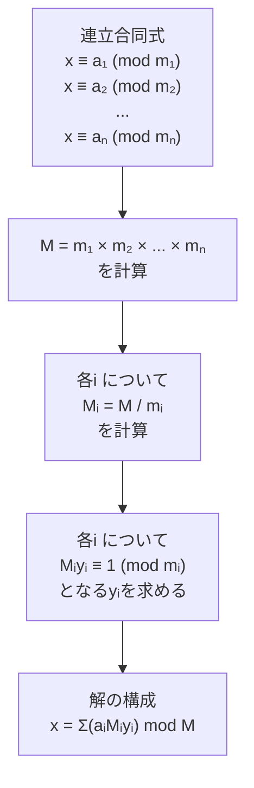
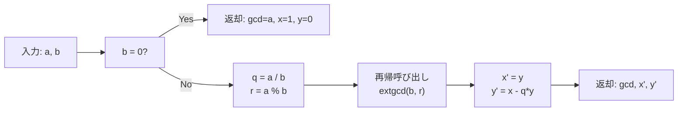
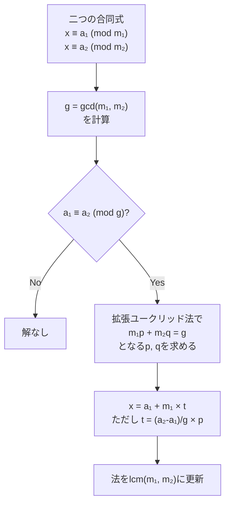

# 中国剰余定理

中国剰余定理（Chinese Remainder Theorem, CRT）は、整数論における基本的な定理の一つであり、互いに素な法に関する連立合同式を解くための強力な手法を提供します。この定理は、紀元3世紀頃の中国の数学書『孫子算経』に記された「物不知数」の問題に由来し、後に13世紀の数学者秦九韶によって一般化されました[^1]。現代の競技プログラミングにおいては、大きな整数の計算を複数の小さな法での計算に分解する際や、特定の制約条件を満たす整数を求める問題において頻繁に活用されます。

本稿では、中国剰余定理の数学的基礎から始め、効率的なアルゴリズムの実装、さらには互いに素でない法への一般化まで、競技プログラミングで必要となる実践的な知識を体系的に解説します。特に、大きな整数を扱う際のオーバーフロー対策や、計算量の最適化といった実装上の重要な考慮事項についても詳しく説明します。

## 数学的基礎

中国剰余定理の本質は、異なる法に関する剰余の情報から元の数を一意に復元できるという点にあります。これを理解するために、まず簡単な例から考察しましょう。

ある整数 $x$ が次の条件を満たすとします：
- $x \equiv 2 \pmod{3}$（3で割った余りが2）
- $x \equiv 3 \pmod{5}$（5で割った余りが3）
- $x \equiv 2 \pmod{7}$（7で割った余りが2）

これらの条件を同時に満たす最小の正の整数 $x$ は23であり、一般解は $x = 23 + 105k$（$k$ は任意の整数）となります。ここで105は $3 \times 5 \times 7$ であることに注目してください。

### 定理の厳密な記述

**定理（中国剰余定理）**：$m_1, m_2, \ldots, m_n$ を互いに素な正の整数とし、$a_1, a_2, \ldots, a_n$ を任意の整数とする。このとき、連立合同式

$$\begin{cases}
x \equiv a_1 \pmod{m_1} \\
x \equiv a_2 \pmod{m_2} \\
\vdots \\
x \equiv a_n \pmod{m_n}
\end{cases}$$

は $M = m_1 \times m_2 \times \cdots \times m_n$ を法として一意な解を持つ。

この定理の証明は構成的であり、実際のアルゴリズムに直結しています。$M_i = M / m_i$ とし、$M_i y_i \equiv 1 \pmod{m_i}$ を満たす $y_i$（$M_i$ の $m_i$ に関する逆元）を求めれば、解は次の式で与えられます：

$$x \equiv \sum_{i=1}^{n} a_i M_i y_i \pmod{M}$$



### 証明の概要

解の存在性と一意性を示すために、まず構成した解が実際に全ての合同式を満たすことを確認します。$j$ を固定して考えると：

$$x \equiv \sum_{i=1}^{n} a_i M_i y_i \pmod{m_j}$$

ここで、$i \neq j$ のとき $M_i$ は $m_j$ の倍数であるため $M_i \equiv 0 \pmod{m_j}$ となります。一方、$i = j$ のとき $M_j y_j \equiv 1 \pmod{m_j}$ より、結果として $x \equiv a_j \pmod{m_j}$ が得られます。

一意性については、二つの解 $x_1, x_2$ が存在すると仮定すると、全ての $i$ について $x_1 - x_2 \equiv 0 \pmod{m_i}$ となります。$m_1, m_2, \ldots, m_n$ が互いに素であることから、$x_1 - x_2$ は $M$ の倍数でなければならず、したがって $x_1 \equiv x_2 \pmod{M}$ となります。

## 拡張ユークリッドの互除法

中国剰余定理の実装において最も重要な要素の一つが、モジュラー逆元の計算です。$M_i y_i \equiv 1 \pmod{m_i}$ を満たす $y_i$ を効率的に求めるために、拡張ユークリッドの互除法を使用します。

拡張ユークリッドの互除法は、二つの整数 $a, b$ に対して、最大公約数 $\gcd(a, b)$ と、$ax + by = \gcd(a, b)$ を満たす整数 $x, y$ を同時に求めるアルゴリズムです。特に $\gcd(a, b) = 1$ の場合、$ax \equiv 1 \pmod{b}$ となるため、$x$ は $a$ の $b$ に関する逆元となります。



アルゴリズムの核心は、ユークリッドの互除法の各ステップで得られる関係式を逆向きに辿ることにあります。$a = bq + r$ という除算の関係から、$\gcd(a, b) = \gcd(b, r)$ が成り立ち、さらに線形結合の関係も保持されます。

実装において注意すべき点は、負の数の扱いです。プログラミング言語によって剰余演算の定義が異なるため、特にC++などでは負の数に対する剰余が負になる可能性があります。これを防ぐため、結果を正規化する処理が必要です。

## 基本的な実装

中国剰余定理の基本的な実装を以下に示します。この実装では、オーバーフローを防ぐための工夫も含まれています。

```cpp
// Extended Euclidean Algorithm
// Returns gcd(a, b) and finds x, y such that ax + by = gcd(a, b)
long long extgcd(long long a, long long b, long long &x, long long &y) {
    if (b == 0) {
        x = 1;
        y = 0;
        return a;
    }
    long long gcd = extgcd(b, a % b, y, x);
    y -= (a / b) * x;
    return gcd;
}

// Modular inverse of a modulo m
// Returns -1 if inverse doesn't exist
long long modinv(long long a, long long m) {
    long long x, y;
    long long gcd = extgcd(a, m, x, y);
    if (gcd != 1) return -1;
    return (x % m + m) % m;
}

// Chinese Remainder Theorem
// Solves x ≡ a[i] (mod m[i]) for i = 0, 1, ..., n-1
// Returns (solution, lcm of all m[i])
// Returns (-1, -1) if no solution exists
pair<long long, long long> crt(const vector<long long>& a, const vector<long long>& m) {
    int n = a.size();
    long long x = 0, M = 1;
    
    for (int i = 0; i < n; i++) {
        long long Mi = M / __gcd(M, m[i]) * m[i];
        if (Mi / m[i] != M / __gcd(M, m[i])) {
            // Overflow detection
            return {-1, -1};
        }
        
        long long p = M, q = m[i];
        long long pp, qq;
        long long g = extgcd(p, q, pp, qq);
        
        if ((a[i] - x) % g != 0) {
            // No solution exists
            return {-1, -1};
        }
        
        long long tmp = (a[i] - x) / g * pp % (m[i] / g);
        x += M * tmp;
        M = Mi;
        x = ((x % M) + M) % M;
    }
    
    return {x, M};
}
```

この実装では、各ステップでオーバーフローの可能性をチェックし、解が存在しない場合の処理も含まれています。特に、大きな数値を扱う競技プログラミングでは、このような配慮が不可欠です。

## 計算複雑度の分析

中国剰余定理のアルゴリズムの計算複雑度を分析すると、主要な計算は拡張ユークリッドの互除法の呼び出しにあります。$n$ 個の合同式に対して、各ステップで拡張ユークリッドの互除法を実行する必要があります。

拡張ユークリッドの互除法の計算量は、入力となる二つの数の桁数に対して対数的です。具体的には、$a, b$ に対して $O(\log \min(a, b))$ の時間がかかります。したがって、全体の計算複雑度は $O(n \log M)$ となります。ここで $M$ は全ての法の積です。

空間複雑度については、再帰呼び出しのスタック深さが $O(\log M)$ となるため、空間複雑度も $O(\log M)$ です。ただし、反復的な実装を用いれば定数空間で実装可能です。

## 一般化中国剰余定理

実際の問題では、法が互いに素でない場合も頻繁に現れます。このような場合に対応するため、中国剰余定理を一般化する必要があります。

二つの合同式 $x \equiv a_1 \pmod{m_1}$ と $x \equiv a_2 \pmod{m_2}$ を考えます。$g = \gcd(m_1, m_2)$ とすると、解が存在するための必要十分条件は $a_1 \equiv a_2 \pmod{g}$ です。この条件が満たされる場合、解は $x \equiv a \pmod{\text{lcm}(m_1, m_2)}$ の形で表されます。



一般化アルゴリズムの実装では、各ステップで二つの合同式を一つに統合していきます。このプロセスを繰り返すことで、任意の個数の合同式を処理できます。

## オーバーフロー対策

競技プログラミングにおいて、整数オーバーフローは頻繁に遭遇する問題です。特に中国剰余定理では、法の積が非常に大きくなる可能性があるため、慎重な実装が必要です。

### 乗算のオーバーフロー回避

二つの大きな整数の積を計算する際、直接計算するとオーバーフローする可能性があります。これを回避するため、以下のような手法を用います：

```cpp
// Safe multiplication: returns (a * b) % mod without overflow
long long safe_multiply(long long a, long long b, long long mod) {
    a %= mod;
    b %= mod;
    
    // Method 1: Using long double for approximation
    long long q = (long double)a * b / mod;
    long long r = a * b - q * mod;
    return (r % mod + mod) % mod;
    
    // Method 2: Binary method (slower but more reliable)
    // long long result = 0;
    // while (b > 0) {
    //     if (b & 1) result = (result + a) % mod;
    //     a = (a * 2) % mod;
    //     b >>= 1;
    // }
    // return result;
}
```

最初の方法は、浮動小数点数を用いて商の近似値を計算し、それを用いて剰余を求めます。この方法は高速ですが、極めて大きな数に対しては精度の問題が生じる可能性があります。二番目の方法は、二進法を用いた確実な方法ですが、計算時間が $O(\log b)$ かかります。

### 128ビット整数の活用

多くの現代的なコンパイラでは、128ビット整数型（`__int128`）がサポートされています。これを活用することで、64ビット整数同士の乗算を安全に行えます：

```cpp
long long safe_multiply_128(long long a, long long b, long long mod) {
    return ((__int128)a * b) % mod;
}
```

ただし、この方法はコンパイラ依存であり、すべての環境で利用可能とは限りません。競技プログラミングでは、使用可能な環境を事前に確認する必要があります。

## 実践的な応用例

中国剰余定理は、競技プログラミングにおいて様々な場面で活用されます。以下、代表的な応用例を詳しく見ていきます。

### 大きな数の計算

非常に大きな数を扱う問題では、複数の素数で割った余りを管理することで、オーバーフローを回避しながら計算を行えます。例えば、$10^{18}$ を超えるような階乗の値を求める場合、いくつかの素数 $p_1, p_2, \ldots, p_k$（積が十分大きい）に対して、それぞれ $n! \bmod p_i$ を計算し、最後に中国剰余定理で統合します。

### 周期性を持つ問題

異なる周期を持つ複数の条件を同時に満たす最小の時刻を求める問題は、中国剰余定理の典型的な応用です。例えば、「3日ごとに発生するイベントAと5日ごとに発生するイベントBが同時に起こる最初の日」といった問題は、$x \equiv 0 \pmod{3}$ かつ $x \equiv 0 \pmod{5}$ を解くことに帰着されます。

### 数え上げ問題

組み合わせ論的な数え上げ問題において、答えを複数の法で求めてから統合する手法は有効です。特に、動的計画法と組み合わせることで、メモリ使用量を削減しながら大きな答えを求めることができます。

## 実装上の注意点とベストプラクティス

競技プログラミングにおいて中国剰余定理を実装する際の重要な注意点をまとめます。

### 入力検証の重要性

問題文で「法が互いに素」と明記されていない場合は、一般化中国剰余定理を使用する必要があります。また、解が存在しない可能性も考慮し、適切なエラーハンドリングを実装することが重要です。

### 正規化の徹底

剰余演算の結果は、プログラミング言語や処理系によって負になることがあります。常に `((x % m) + m) % m` のような正規化を行い、結果が `[0, m)` の範囲に収まるようにします。

### テストケースの作成

実装の正確性を確認するため、以下のようなテストケースを用意することを推奨します：
- 小さな値での基本的なケース
- 法が互いに素でないケース（一般化が必要）
- 解が存在しないケース
- オーバーフローが発生しやすい大きな値のケース

### パフォーマンスの最適化

競技プログラミングでは実行時間制限があるため、以下の最適化を検討します：
- 事前計算可能な値（逆元など）はキャッシュする
- 不必要な剰余演算を削減する
- 128ビット整数が使用可能な場合は積極的に活用する

## 発展的な話題

中国剰余定理の理解を深めるため、関連する発展的な話題についても触れておきます。

### Garner のアルゴリズム

複数の法での剰余から元の数を復元する別の方法として、Garner のアルゴリズムがあります。このアルゴリズムは、結果を混合基数表現で構成することで、大きな数の計算を回避します[^2]。特に、最終的な答えを特定の法で求める場合に有効です。

### 素数冪を法とする場合

法が素数冪 $p^k$ の場合、Hensel の補題を用いることで、$p$ を法とする解から $p^k$ を法とする解を効率的に構成できます。これは、$p$-進数の理論とも関連する興味深い話題です。

### 並列化の可能性

中国剰余定理の計算は、各法に対する処理が独立しているため、並列化に適しています。大規模な計算では、複数のプロセッサで並行して逆元を計算し、最後に結果を統合することで高速化が可能です。

## 誤りやすいポイントと対策

実装時に陥りやすい誤りとその対策について説明します。

### 符号の扱い

C++などの言語では、負の数に対する剰余演算が負の値を返すことがあります。例えば、`-1 % 3` は `-1` を返します。これを防ぐため、常に正の剰余を得るような処理を加える必要があります。

### オーバーフローの見落とし

二つの法の最小公倍数を計算する際、`lcm(a, b) = a * b / gcd(a, b)` という公式を直接使用するとオーバーフローする可能性があります。`lcm(a, b) = a / gcd(a, b) * b` のように順序を工夫することで、オーバーフローのリスクを軽減できます。

### 解の存在条件の確認漏れ

一般化中国剰余定理では、解が存在するための条件 $a_1 \equiv a_2 \pmod{\gcd(m_1, m_2)}$ を確認する必要があります。この確認を怠ると、誤った結果を返す可能性があります。

## 具体的な競技プログラミング問題例

実際の競技プログラミングで出題される中国剰余定理の応用問題を見てみましょう。

### 例題1：同時発生イベント

**問題**：3つの衛星A、B、Cがそれぞれ11分、13分、17分周期で信号を送信します。最初は同時に信号を送信しました。次に3つの衛星が同時に信号を送信するのは何分後ですか？ただし、答えを1000000007で割った余りを求めてください。

**解法**：これは典型的な中国剰余定理の問題です。次に同時に信号を送信する時刻を $t$ とすると：
- $t \equiv 0 \pmod{11}$
- $t \equiv 0 \pmod{13}$
- $t \equiv 0 \pmod{17}$

11、13、17は互いに素なので、答えは $\text{lcm}(11, 13, 17) = 11 \times 13 \times 17 = 2431$ となります。

### 例題2：制約付き整数探索

**問題**：次の条件を満たす最小の正の整数 $x$ を求めよ：
- $x$ を3で割った余りは2
- $x$ を5で割った余りは3  
- $x$ を7で割った余りは2
- $x \leq 10^{18}$

**解法**：連立合同式を中国剰余定理で解きます。実装時は、オーバーフローに注意しながら計算を進めます。

## デバッグ手法

中国剰余定理の実装でバグが発生した場合の効果的なデバッグ手法を紹介します。

### アサーションの活用

開発時には、各ステップでの不変条件をアサーションで確認することが有効です：

```cpp
// Debug version with assertions
pair<long long, long long> crt_debug(const vector<long long>& a, const vector<long long>& m) {
    int n = a.size();
    long long x = 0, M = 1;
    
    for (int i = 0; i < n; i++) {
        // Assert moduli are positive
        assert(m[i] > 0);
        
        // Assert remainders are normalized
        assert(0 <= a[i] && a[i] < m[i]);
        
        long long g = __gcd(M, m[i]);
        
        // Check solution existence condition
        if ((a[i] - x) % g != 0) {
            cerr << "No solution: a[" << i << "] - x = " 
                 << a[i] - x << " is not divisible by gcd = " << g << endl;
            return {-1, -1};
        }
        
        // Continue with computation...
    }
    
    // Verify solution
    for (int i = 0; i < n; i++) {
        assert(x % m[i] == a[i]);
    }
    
    return {x, M};
}
```

### 小さな例での検証

実装が正しいかを確認するため、手計算可能な小さな例で検証します：

```cpp
void test_crt() {
    // Test case 1: Simple case
    vector<long long> a1 = {2, 3, 2};
    vector<long long> m1 = {3, 5, 7};
    auto [x1, M1] = crt(a1, m1);
    assert(x1 == 23 && M1 == 105);
    
    // Test case 2: Non-coprime moduli (should fail)
    vector<long long> a2 = {1, 2};
    vector<long long> m2 = {4, 6};
    auto [x2, M2] = crt(a2, m2);
    assert(x2 == -1 && M2 == -1);
    
    // Test case 3: General CRT (non-coprime but solvable)
    vector<long long> a3 = {2, 4};
    vector<long long> m3 = {4, 6};
    auto [x3, M3] = crt_general(a3, m3);
    assert(x3 == 10 && M3 == 12);
}
```

## 実装時のトラブルシューティング

### 問題：TLEが発生する

**原因**：拡張ユークリッドの互除法で無限ループに陥っている可能性があります。

**対策**：
- 入力値が負でないことを確認
- 剰余演算の結果を適切に正規化

### 問題：WAが発生する

**原因**：オーバーフローまたは符号の扱いに問題がある可能性があります。

**対策**：
- 128ビット整数を使用するか、安全な乗算関数を実装
- すべての剰余演算後に `((x % m) + m) % m` で正規化

### 問題：一般化CRTで誤った答えが出る

**原因**：解の存在条件の確認が不適切な可能性があります。

**対策**：
```cpp
// Correct check for solution existence
if ((a[i] - a[j]) % gcd(m[i], m[j]) != 0) {
    // No solution exists
    return {-1, -1};
}
```

## 関連アルゴリズムとの比較

中国剰余定理と関連する他のアルゴリズムとの比較を通じて、それぞれの特徴と使い分けを理解します。

### Baby-step Giant-step アルゴリズム

離散対数問題を解くこのアルゴリズムは、中国剰余定理と組み合わせることで、合成数を法とする場合にも適用できます。素因数分解して各素数冪で問題を解き、中国剰余定理で統合するアプローチが有効です。

### Pohlig-Hellman アルゴリズム

このアルゴリズムも離散対数問題に対するもので、群の位数が小さな素因数の積である場合に効率的です。中国剰余定理は、各素因数に対する部分問題の解を統合する際に使用されます。

### 高速フーリエ変換との関係

数論変換（NTT）では、中国剰余定理を用いて複数の素数を法とする計算結果を統合することがあります。これにより、大きな整数の積を効率的に計算できます。

中国剰余定理は、整数論の基本定理でありながら、競技プログラミングにおいて極めて実用的なツールです。本稿で解説した理論的背景、効率的な実装方法、そして様々な応用例を理解することで、より複雑な問題に対しても適切にこの定理を活用できるようになるでしょう。特に、オーバーフロー対策や一般化への対応は、実践的な問題解決において不可欠な要素です。継続的な練習と実装を通じて、この強力な道具を自在に扱えるようになることを期待します。

[^1]: Joseph Needham, "Science and Civilisation in China, Volume 3: Mathematics and the Sciences of the Heavens and the Earth", Cambridge University Press, 1959.

[^2]: H. L. Garner, "The Residue Number System", IRE Transactions on Electronic Computers, vol. EC-8, no. 2, pp. 140-147, June 1959.