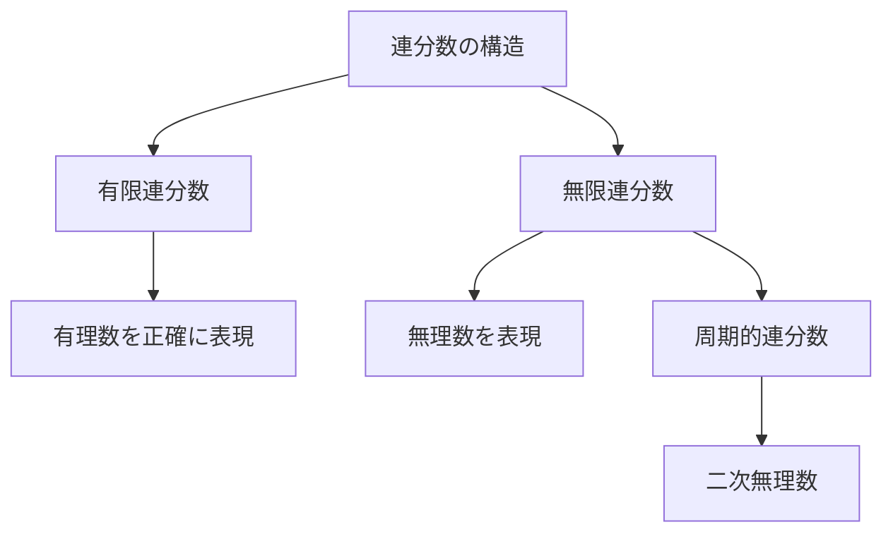
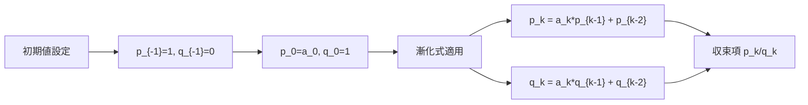
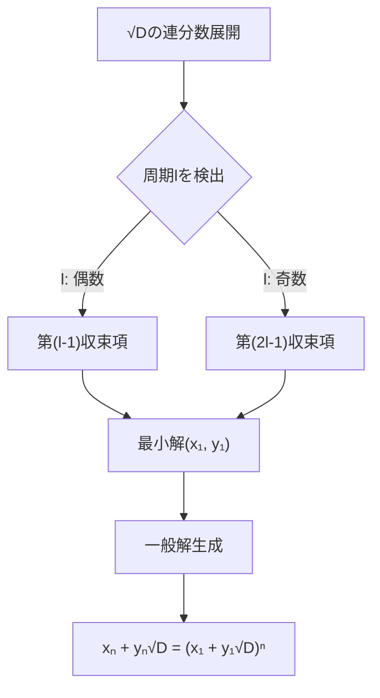
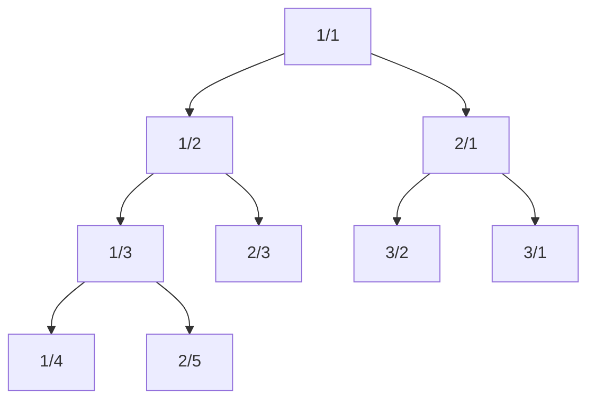

# 連分数

連分数は、実数を整数の連なりで表現する数学的手法であり、分数を再帰的に入れ子にした形式で数を表現する。競技プログラミングにおいては、有理数近似、ペル方程式の解法、幾何学的問題における整数解の探索など、整数論的な問題を効率的に解くための強力なツールとして活用される。本稿では、連分数の数学的基礎から始め、競技プログラミングで頻出する応用例とその実装技法について詳述する。

## 連分数の定義と基本概念

連分数とは、以下の形式で表される数の表現である：

$$a_0 + \cfrac{1}{a_1 + \cfrac{1}{a_2 + \cfrac{1}{a_3 + \cdots}}}$$

ここで、$a_0$は整数、$a_1, a_2, a_3, \ldots$は正の整数である。この表現は簡潔に$[a_0; a_1, a_2, a_3, \ldots]$と記される。$a_0$を整数部分（integer part）、$a_1, a_2, \ldots$を部分商（partial quotients）と呼ぶ。



有限連分数は有理数を表現し、無限連分数は無理数を表現する。特に興味深いのは、二次無理数（二次方程式の解となる無理数）が必ず周期的な連分数で表現されるという事実である[^1]。

連分数展開のアルゴリズムは、ユークリッドの互除法と密接な関係がある。有理数$p/q$に対して、以下の手順で連分数展開を求める：

1. $a_0 = \lfloor p/q \rfloor$とする
2. $p/q = a_0$なら終了
3. そうでなければ、$p/q = a_0 + 1/(q/(p - a_0 q))$と変形
4. $p' = q, q' = p - a_0 q$として、$p'/q'$に対して同じ手順を繰り返す

この過程は、実質的にユークリッドの互除法の各ステップで得られる商を記録していることに相当する。

## 収束項と近似理論

連分数の部分的な評価によって得られる有理数を収束項（convergent）と呼ぶ。$[a_0; a_1, \ldots, a_n]$の第$k$収束項$p_k/q_k$は、以下の漸化式で効率的に計算できる：

$$p_{-1} = 1, p_0 = a_0$$
$$q_{-1} = 0, q_0 = 1$$
$$p_k = a_k p_{k-1} + p_{k-2}$$
$$q_k = a_k q_{k-1} + q_{k-2}$$



収束項は元の数に対する最良近似を与える。具体的には、$p_k/q_k$は、分母が$q_k$以下のすべての分数の中で、元の数に最も近い分数となる[^2]。この性質は、有理数近似問題において極めて重要である。

収束項の誤差評価については、以下の不等式が成立する：

$$\left|\alpha - \frac{p_k}{q_k}\right| < \frac{1}{q_k q_{k+1}}$$

ここで$\alpha$は連分数で表現される元の数である。この評価式から、収束項の分母が大きくなるにつれて、近似精度が急速に向上することがわかる。

## 連分数の計算実装

競技プログラミングにおける連分数の実装では、整数オーバーフローへの対処と効率性が重要となる。以下に、基本的な連分数展開と収束項計算の実装を示す：

```cpp
struct ContinuedFraction {
    vector<long long> a;  // partial quotients
    
    // Convert rational p/q to continued fraction
    ContinuedFraction(long long p, long long q) {
        while (q != 0) {
            a.push_back(p / q);
            long long tmp = p % q;
            p = q;
            q = tmp;
        }
    }
    
    // Calculate k-th convergent
    pair<long long, long long> convergent(int k) {
        if (k < 0 || k >= a.size()) return {0, 0};
        
        long long p_prev = 1, q_prev = 0;
        long long p_curr = a[0], q_curr = 1;
        
        for (int i = 1; i <= k; i++) {
            long long p_next = a[i] * p_curr + p_prev;
            long long q_next = a[i] * q_curr + q_prev;
            p_prev = p_curr; p_curr = p_next;
            q_prev = q_curr; q_curr = q_next;
        }
        
        return {p_curr, q_curr};
    }
};
```

実数の連分数展開では、浮動小数点誤差の蓄積に注意が必要である。特に、無理数の周期的パターンを検出する場合、適切な精度管理が不可欠となる。

## ペル方程式への応用

ペル方程式$x^2 - Dy^2 = 1$（$D$は平方数でない正整数）の解法は、連分数の最も重要な応用の一つである。$\sqrt{D}$の連分数展開が周期的であることを利用して、最小解を効率的に求めることができる。

$\sqrt{D}$の連分数展開を$[a_0; \overline{a_1, a_2, \ldots, a_l}]$（上線は周期を表す）とすると、周期の長さ$l$が偶数なら第$(l-1)$収束項が、奇数なら第$(2l-1)$収束項がペル方程式の最小解を与える[^3]。



実装では、$\sqrt{D}$の連分数展開における周期検出が重要となる。以下のアルゴリズムで周期を検出できる：

```cpp
vector<long long> sqrtContinuedFraction(long long D) {
    long long a0 = sqrt(D);
    if (a0 * a0 == D) return {a0};  // D is perfect square
    
    vector<long long> cf = {a0};
    long long m = 0, d = 1, a = a0;
    
    // Detect period using cycle detection
    map<tuple<long long, long long>, int> seen;
    
    while (true) {
        m = d * a - m;
        d = (D - m * m) / d;
        a = (a0 + m) / d;
        
        auto state = make_tuple(m, d);
        if (seen.count(state)) break;
        
        seen[state] = cf.size();
        cf.push_back(a);
    }
    
    return cf;
}
```

## Stern-Brocot木と有理数の列挙

Stern-Brocot木は、すべての正の有理数を重複なく列挙する二分木構造であり、連分数と密接な関係がある。この木の各ノードは、その祖先ノードの連分数展開によって特徴づけられる。



Stern-Brocot木の構築では、メディアント（中点）演算を使用する。二つの分数$p/q$と$r/s$のメディアントは$(p+r)/(q+s)$で定義される。この演算は、連分数の収束項の計算と本質的に同じ構造を持つ。

競技プログラミングでは、Stern-Brocot木を用いて以下のような問題を効率的に解くことができる：

1. 与えられた範囲内の既約分数の列挙
2. 実数に最も近い分母制限付き有理数の探索
3. ファレイ数列の生成

```cpp
struct SternBrocotTree {
    // Find best rational approximation p/q with q <= maxDenom
    pair<long long, long long> findBest(double target, long long maxDenom) {
        long long p0 = 0, q0 = 1;  // 0/1
        long long p1 = 1, q1 = 1;  // 1/1
        
        while (true) {
            long long pm = p0 + p1;
            long long qm = q0 + q1;
            
            if (qm > maxDenom) {
                // Choose closer endpoint
                double d0 = abs(target - (double)p0/q0);
                double d1 = abs(target - (double)p1/q1);
                return d0 < d1 ? make_pair(p0, q0) : make_pair(p1, q1);
            }
            
            double mediant = (double)pm / qm;
            if (abs(target - mediant) < 1e-9) {
                return {pm, qm};
            } else if (target < mediant) {
                p1 = pm; q1 = qm;
            } else {
                p0 = pm; q0 = qm;
            }
        }
    }
};
```

## 実装上の注意点と最適化

連分数を競技プログラミングで実装する際には、以下の点に注意が必要である：

整数オーバーフローは最も頻繁に遭遇する問題である。収束項の計算では、分子と分母が指数関数的に増大する可能性がある。特に、黄金比$\phi = (1 + \sqrt{5})/2 = [1; 1, 1, 1, \ldots]$のような場合、第$n$収束項の分母はフィボナッチ数$F_n$となり、急速に増大する。

```cpp
// Overflow-safe convergent calculation
pair<long long, long long> safeConvergent(const vector<long long>& cf, int k) {
    const long long INF = 1e18;
    long long p_prev = 1, q_prev = 0;
    long long p_curr = cf[0], q_curr = 1;
    
    for (int i = 1; i <= k && i < cf.size(); i++) {
        // Check for overflow before multiplication
        if (cf[i] > INF / p_curr || cf[i] > INF / q_curr) {
            return {p_curr, q_curr};  // Return last safe convergent
        }
        
        long long p_next = cf[i] * p_curr + p_prev;
        long long q_next = cf[i] * q_curr + q_prev;
        
        if (p_next < 0 || q_next < 0) {  // Overflow occurred
            return {p_curr, q_curr};
        }
        
        p_prev = p_curr; p_curr = p_next;
        q_prev = q_curr; q_curr = q_next;
    }
    
    return {p_curr, q_curr};
}
```

精度の問題も重要である。実数の連分数展開では、浮動小数点誤差が蓄積し、誤った部分商を生成する可能性がある。特に、部分商が大きくなる場合（例：$\pi = [3; 7, 15, 1, 292, \ldots]$）、誤差の影響が顕著になる。

## 競技プログラミングにおける典型的応用

連分数は、以下のような競技プログラミングの問題で威力を発揮する：

**有理数近似問題**では、与えられた実数に対して、分母が制限値以下で最も近い有理数を求める。これは収束項の性質を直接利用することで、$O(\log n)$時間で解ける。

**線形ディオファントス方程式**$ax + by = c$の解を求める際、$a/b$の連分数展開から得られる収束項を用いることで、拡張ユークリッドの互除法と同等の計算が可能である。

**幾何学的問題**では、格子点を通る直線の性質を調べる際に連分数が有用である。特に、原点から点$(p, q)$への直線が通る格子点の個数は、$\gcd(p, q) - 1$であり、これは連分数展開の長さと関連する。

```cpp
// Count lattice points on line from (0,0) to (p,q)
long long countLatticePoints(long long p, long long q) {
    return __gcd(p, q) - 1;
}

// Find visible points from origin in rectangle [1,n] x [1,m]
long long countVisiblePoints(long long n, long long m) {
    long long count = 0;
    for (long long i = 1; i <= n; i++) {
        for (long long j = 1; j <= m; j++) {
            if (__gcd(i, j) == 1) count++;
        }
    }
    return count;
}
```

## 高度な応用と発展的話題

連分数の理論は、数論的アルゴリズムの設計において重要な役割を果たす。特に、以下のような高度な応用がある：

**二次篩法**（Quadratic Sieve）などの素因数分解アルゴリズムでは、連分数展開を用いて平方剰余を効率的に生成する。これは、大きな合成数の素因数分解において重要な技術である[^4]。

**LLL格子基底簡約アルゴリズム**では、連分数近似を用いて有理数近似を行い、格子点の探索を効率化する。これは、ナップサック暗号の解読や、整数計画問題の解法に応用される。

**実数の性質判定**では、連分数展開のパターンから、代数的数か超越数かを推測することができる。例えば、$e = [2; 1, 2, 1, 1, 4, 1, 1, 6, 1, 1, 8, \ldots]$のような規則的なパターンは、その数の特殊な性質を示唆する。

連分数の一般化として、多次元連分数や、複素連分数なども研究されている。これらは、多変数の同時近似問題や、複素数の有理近似に応用される。

競技プログラミングの文脈では、連分数は単なる数学的好奇心ではなく、実際の問題を効率的に解くための実用的なツールである。整数論的な制約を持つ最適化問題や、精度を保ちながら高速に計算を行う必要がある場面で、連分数の理論は強力な武器となる。

[^1]: Lagrange, J.-L. (1770). "Additions aux éléments d'algèbre d'Euler". Lyon.
[^2]: Hardy, G.H.; Wright, E.M. (2008). An Introduction to the Theory of Numbers (6th ed.). Oxford University Press.
[^3]: Rosen, K.H. (2011). Elementary Number Theory and Its Applications (6th ed.). Pearson.
[^4]: Pomerance, C. (1985). "The quadratic sieve factoring algorithm". Advances in Cryptology. Lecture Notes in Computer Science. 209: 169–182.