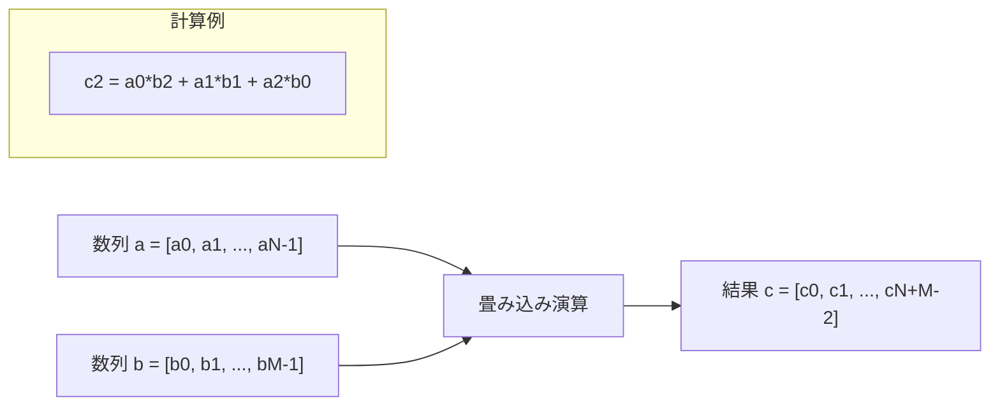
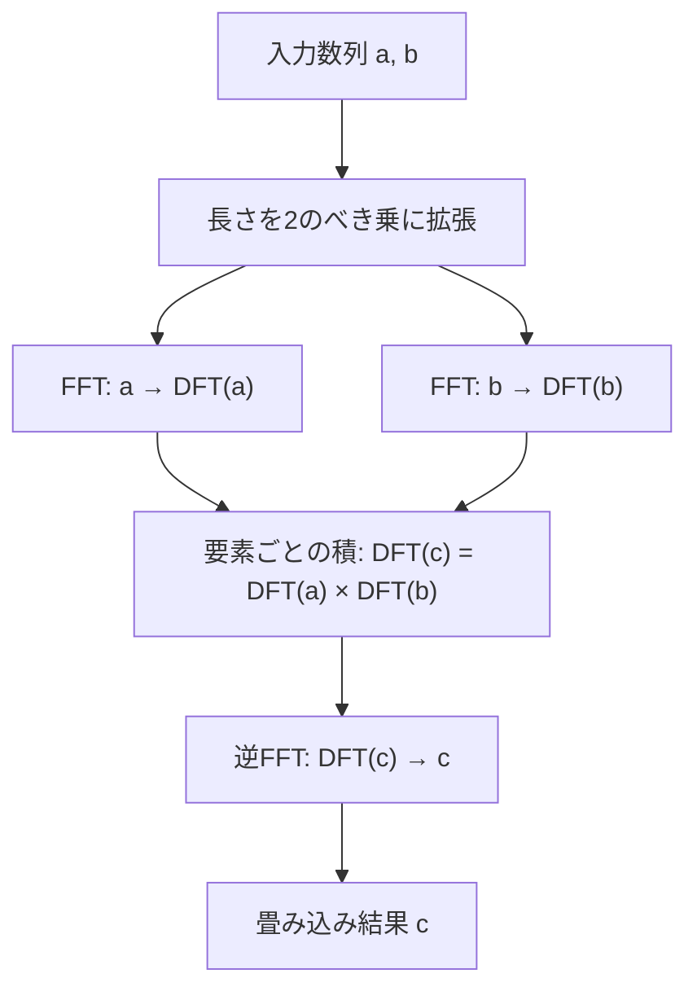
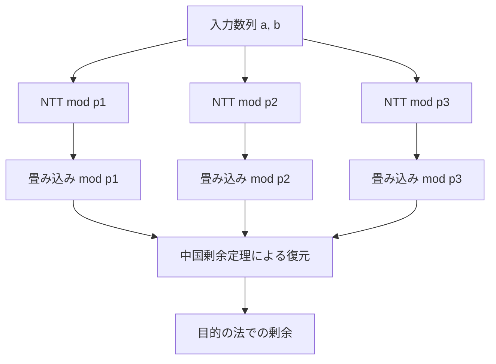
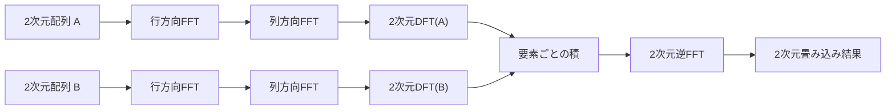
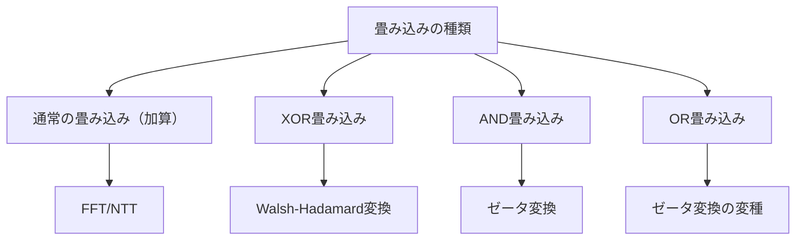

# 畳み込み

畳み込み（Convolution）は、2つの関数から新しい関数を生成する数学的演算であり、信号処理、画像処理、確率論など幅広い分野で応用される基本的な概念である。競技プログラミングにおいては、多項式の乗算、数列の操作、文字列マッチングなど様々な問題の効率的な解法の基礎となる重要な技術である。本稿では、畳み込みの数学的定義から始め、高速フーリエ変換（FFT）や数論変換（NTT）を用いた効率的な実装方法、そして競技プログラミングにおける具体的な応用まで、体系的に解説する。

## 数学的定義と基本性質

連続関数における畳み込みは、2つの関数 $f$ と $g$ に対して次のように定義される：

$$(f * g)(t) = \int_{-\infty}^{\infty} f(\tau)g(t - \tau)d\tau$$

この定義は、関数 $g$ を反転・平行移動させながら $f$ との積を積分することで、新しい関数を生成することを表している。離散的な場合、すなわち数列に対する畳み込みは次のように定義される：

$$(a * b)_n = \sum_{k=0}^{n} a_k b_{n-k}$$

競技プログラミングで扱うのは主にこの離散畳み込みであり、特に有限長の数列に対する畳み込みが中心となる。長さ $N$ の数列 $a$ と長さ $M$ の数列 $b$ の畳み込みは、長さ $N + M - 1$ の数列 $c$ を生成し、その第 $k$ 項は：

$$c_k = \sum_{i+j=k} a_i b_j$$

として計算される。ここで、$a_i = 0$ ($i \geq N$)、$b_j = 0$ ($j \geq M$) と見なす。



畳み込みの重要な性質として、可換性、結合性、分配性が挙げられる。可換性は $a * b = b * a$ を意味し、結合性は $(a * b) * c = a * (b * c)$ を保証する。これらの性質により、畳み込みは代数的構造として優れた性質を持つ。

## 多項式の観点からの理解

畳み込みは多項式の乗算と密接に関連している。数列 $a = [a_0, a_1, ..., a_{N-1}]$ を多項式 $A(x) = a_0 + a_1x + ... + a_{N-1}x^{N-1}$ に対応させると、2つの数列の畳み込みは対応する多項式の積の係数列となる。

$$A(x) \cdot B(x) = C(x) = \sum_{k=0}^{N+M-2} c_k x^k$$

ここで $c_k = \sum_{i+j=k} a_i b_j$ である。この対応関係により、畳み込みの計算は多項式乗算の問題に帰着される。単純な実装では $O(NM)$ の計算量を要するが、高速フーリエ変換を用いることで $O((N+M)\log(N+M))$ に削減できる。

## 高速フーリエ変換による畳み込み

高速フーリエ変換（Fast Fourier Transform, FFT）は、離散フーリエ変換（DFT）を効率的に計算するアルゴリズムである[^1]。DFTは数列を周波数領域に変換する操作であり、時間領域での畳み込みが周波数領域での要素ごとの積に対応するという性質を利用して、畳み込みを高速に計算できる。

[^1]: Cooley, J. W., & Tukey, J. W. (1965). "An algorithm for the machine calculation of complex Fourier series". Mathematics of Computation, 19(90), 297-301.

離散フーリエ変換は、長さ $n$ の複素数列 $a = [a_0, a_1, ..., a_{n-1}]$ を同じ長さの複素数列 $A = [A_0, A_1, ..., A_{n-1}]$ に変換する：

$$A_k = \sum_{j=0}^{n-1} a_j \omega_n^{jk}$$

ここで $\omega_n = e^{-2\pi i/n}$ は $n$ 次の原始単位根である。逆変換は：

$$a_j = \frac{1}{n} \sum_{k=0}^{n-1} A_k \omega_n^{-jk}$$

で与えられる。



Cooley-Tukeyアルゴリズムは、DFTを分割統治法により効率的に計算する。長さ $n = 2^k$ の数列に対して、偶数番目と奇数番目の要素に分割し、それぞれに対してサイズ $n/2$ のDFTを再帰的に計算する。この手法により、計算量は $O(n^2)$ から $O(n \log n)$ に削減される。

```cpp
void fft(vector<complex<double>>& a, bool inverse) {
    int n = a.size();
    if (n == 1) return;
    
    vector<complex<double>> even(n/2), odd(n/2);
    for (int i = 0; i < n/2; i++) {
        even[i] = a[2*i];
        odd[i] = a[2*i + 1];
    }
    
    fft(even, inverse);
    fft(odd, inverse);
    
    double angle = 2 * M_PI / n * (inverse ? -1 : 1);
    complex<double> w(1), wn(cos(angle), sin(angle));
    
    for (int i = 0; i < n/2; i++) {
        complex<double> t = w * odd[i];
        a[i] = even[i] + t;
        a[i + n/2] = even[i] - t;
        w *= wn;
    }
}
```

実装上の注意点として、数値誤差の蓄積が挙げられる。浮動小数点演算を用いるため、大きな数値や多数の演算を行う場合には誤差が問題となる可能性がある。競技プログラミングでは、結果が整数値であることが保証されている場合、四捨五入により正確な値を復元する。

## 数論変換による整数畳み込み

数論変換（Number Theoretic Transform, NTT）は、FFTの整数版とも言える手法であり、有限体上でDFTと同様の変換を行う[^2]。素数 $p$ を法とする剰余環 $\mathbb{Z}/p\mathbb{Z}$ において、原始 $n$ 乗根が存在する場合、FFTと同じアルゴリズムを適用できる。

[^2]: Pollard, J. M. (1971). "The fast Fourier transform in a finite field". Mathematics of Computation, 25(114), 365-374.

NTTを使用可能にする条件は、素数 $p$ が $p = kn + 1$ の形であることである。ここで $n$ は変換する数列の長さ（2のべき乗）である。このとき、$g^k \equiv 1 \pmod{p}$ を満たす最小の正整数 $k$ が $n$ となるような $g$ が存在し、これが原始 $n$ 乗根となる。

競技プログラミングでよく使用される素数として、$998244353 = 119 \times 2^{23} + 1$ がある。この素数は $2^{23}$ までの長さの変換に対応でき、多くの問題で十分な大きさである。原始根は $3$ であり、原始 $2^{23}$ 乗根は $3^{119} \bmod 998244353$ で計算できる。

```cpp
const long long MOD = 998244353;
const long long root = 3; // primitive root of MOD

long long mod_pow(long long base, long long exp, long long mod) {
    long long result = 1;
    while (exp > 0) {
        if (exp % 2 == 1) result = (result * base) % mod;
        base = (base * base) % mod;
        exp /= 2;
    }
    return result;
}

void ntt(vector<long long>& a, bool inverse) {
    int n = a.size();
    if (n == 1) return;
    
    // Calculate primitive nth root of unity
    long long g = mod_pow(root, (MOD - 1) / n, MOD);
    if (inverse) g = mod_pow(g, MOD - 2, MOD);
    
    // Bit reversal
    for (int i = 1, j = 0; i < n; i++) {
        int bit = n >> 1;
        for (; j & bit; bit >>= 1) {
            j ^= bit;
        }
        j ^= bit;
        if (i < j) swap(a[i], a[j]);
    }
    
    // Cooley-Tukey NTT
    for (int len = 2; len <= n; len <<= 1) {
        long long w = mod_pow(g, n / len, MOD);
        for (int i = 0; i < n; i += len) {
            long long wn = 1;
            for (int j = 0; j < len / 2; j++) {
                long long u = a[i + j];
                long long v = (a[i + j + len/2] * wn) % MOD;
                a[i + j] = (u + v) % MOD;
                a[i + j + len/2] = (u - v + MOD) % MOD;
                wn = (wn * w) % MOD;
            }
        }
    }
    
    if (inverse) {
        long long n_inv = mod_pow(n, MOD - 2, MOD);
        for (auto& x : a) {
            x = (x * n_inv) % MOD;
        }
    }
}
```

NTTの利点は、整数演算のみを使用するため数値誤差が発生しないことである。また、モジュラー演算により、オーバーフローを防ぎながら大きな数値を扱える。一方で、使用できる素数が限定されるという制約がある。

## 任意模数での畳み込み

競技プログラミングでは、$10^9 + 7$ のような特定の素数を法とする計算が要求されることがある。この素数はNTTに適した形ではないため、直接NTTを適用できない。このような場合、複数の素数でNTTを実行し、中国剰余定理により結果を復元する手法が用いられる。

具体的には、$p_1 = 469762049$、$p_2 = 998244353$、$p_3 = 1224736769$ のような3つのNTT適用可能な素数を選び、それぞれで畳み込みを計算する。これらの素数の積は十分大きく、通常の問題で現れる数値を表現できる。各素数での結果から、中国剰余定理により元の値を復元し、最終的に目的の法で剰余を取る。



この手法は、Garnerのアルゴリズムを用いて効率的に実装できる[^3]。各素数での結果 $r_1, r_2, r_3$ から、次の式により元の値を復元する：

[^3]: Knuth, D. E. (1997). "The Art of Computer Programming, Volume 2: Seminumerical Algorithms" (3rd ed.). Addison-Wesley.

$$x = r_1 + p_1(t_1 + p_2 \cdot t_2)$$

ここで、$t_1 = (r_2 - r_1) \cdot p_1^{-1} \bmod p_2$、$t_2 = ((r_3 - r_1) \cdot p_1^{-1} - t_1) \cdot p_2^{-1} \bmod p_3$ である。

## 循環畳み込みと非循環畳み込み

FFTやNTTを用いた畳み込みは、本質的に循環畳み込みを計算している。長さ $n$ の数列に対する循環畳み込みは：

$$(a \circledast b)_k = \sum_{i=0}^{n-1} a_i b_{(k-i) \bmod n}$$

で定義される。通常の（非循環）畳み込みを計算するためには、入力数列を適切にゼロパディングする必要がある。長さ $N$ と $M$ の数列の畳み込みを計算する場合、両方の数列を長さ $N + M - 1$ 以上の2のべき乗にパディングする。

循環畳み込みは、周期的な信号や円環上の畳み込みを扱う場合に自然に現れる。例えば、環状の文字列パターンマッチングや、周期的な数列の操作などで利用される。

## 多次元畳み込み

2次元以上の畳み込みも、1次元の場合と同様に定義される。2次元畳み込みは：

$$(A * B)_{i,j} = \sum_{k,l} A_{k,l} B_{i-k,j-l}$$

として定義される。画像処理における畳み込みフィルタがこの典型例である。

2次元FFTを用いることで、2次元畳み込みも効率的に計算できる。2次元FFTは、まず各行に対して1次元FFTを適用し、次に各列に対して1次元FFTを適用することで実現される。計算量は $O(NM \log(NM))$ となる。



## 実装の最適化技術

競技プログラミングにおいて、畳み込みの実装を最適化することは重要である。以下に主要な最適化技術を述べる。

ビット反転の前計算は、FFT/NTTの高速化に有効である。Cooley-Tukeyアルゴリズムでは、最初にビット反転順に要素を並べ替える必要がある。この並べ替えのインデックスは入力に依存しないため、前計算しておくことができる。

```cpp
vector<int> rev;
void precompute_rev(int n) {
    rev.resize(n);
    for (int i = 0; i < n; i++) {
        rev[i] = rev[i >> 1] >> 1;
        if (i & 1) rev[i] |= n >> 1;
    }
}
```

単位根の前計算も重要な最適化である。各段階で使用する単位根を事前に計算し、テーブルに格納しておくことで、繰り返し計算を避けられる。特にNTTの場合、モジュラー指数演算は高コストなため、この最適化の効果は大きい。

反復的実装による最適化も考慮すべきである。再帰的な実装は理解しやすいが、関数呼び出しのオーバーヘッドがある。反復的な実装により、このオーバーヘッドを削減できる。上記のNTT実装例は、既に反復的な形式になっている。

## 畳み込みの変種と拡張

畳み込みには様々な変種が存在し、それぞれ特定の問題に対して有用である。

XOR畳み込みは、インデックスの和の代わりにXORを用いる畳み込みである：

$$(a \otimes b)_k = \sum_{i \oplus j = k} a_i b_j$$

ここで $\oplus$ はビットごとのXOR演算を表す。この畳み込みは、Walsh-Hadamard変換を用いて高速に計算できる。Walsh-Hadamard変換は、FFTと同様に分割統治法により $O(n \log n)$ で計算可能である。

AND畳み込みやOR畳み込みも同様に定義され、それぞれゼータ変換・メビウス変換を用いて計算できる。これらの変換は、包除原理や部分集合の和に関する問題で重要な役割を果たす。



## 分割統治FFT

多項式の累乗や、再帰的に定義される多項式列の計算において、分割統治FFTが有効である。例えば、次のような漸化式で定義される数列を考える：

$$f_n = \sum_{i=1}^{n-1} a_i f_{n-i}$$

初期条件 $f_0 = 1$ として、$f_1, f_2, ..., f_N$ を計算する問題である。素朴な実装では $O(N^2)$ の計算量を要するが、分割統治FFTにより $O(N \log^2 N)$ に削減できる。

アルゴリズムの基本的なアイデアは、区間 $[0, N)$ を $[0, M)$ と $[M, N)$ に分割し、前半の値を再帰的に計算した後、その寄与を後半に畳み込みで反映させることである。この手法は、線形漸化式で定義される数列の高速計算に広く応用できる。

## 高精度演算への応用

FFTを用いた畳み込みは、高精度整数の乗算にも応用できる。大きな整数を適当な基数（例えば $10^4$）で表現し、各桁を数列の要素として扱う。2つの整数の乗算は、対応する数列の畳み込みとして計算できる。

この手法の利点は、$n$ 桁の整数同士の乗算を $O(n \log n)$ で実行できることである。Schönhage-Strassen法やより新しいHarvey-van der Hoeven法[^4]は、この原理に基づいている。

[^4]: Harvey, D., & van der Hoeven, J. (2021). "Integer multiplication in time O(n log n)". Annals of Mathematics, 193(2), 563-617.

実装上の注意点として、浮動小数点誤差の管理が重要である。各桁の値が大きくなりすぎないよう、適切な基数を選択する必要がある。また、繰り上がり処理を正確に行うため、十分な精度を確保する必要がある。

## 競技プログラミングにおける典型的応用

畳み込みは競技プログラミングにおいて、直接的または間接的に多くの問題で活用される。以下に典型的な応用例を示す。

多項式の演算は最も直接的な応用である。多項式の乗算、除算、逆元、平方根、指数関数、対数関数などの計算において、畳み込みは基本的な構成要素となる。これらの演算は、母関数を用いた組み合わせ論的問題の解法で頻繁に使用される。

文字列アルゴリズムにおいても畳み込みは有用である。パターンマッチングにおいて、ワイルドカードを含むパターンや、近似マッチングの問題は、畳み込みを用いて効率的に解ける。文字を数値に変換し、適切な多項式を構成することで、マッチング位置を畳み込みの結果から判定できる。

```cpp
// Example: wildcard pattern matching using convolution
vector<int> wildcard_match(string text, string pattern) {
    int n = text.size(), m = pattern.size();
    vector<complex<double>> t(n), p(m);
    
    // Convert characters to polynomials
    // Wildcard '?' is represented as 0
    for (int i = 0; i < n; i++) {
        t[i] = (text[i] == '?') ? 0 : text[i];
    }
    for (int i = 0; i < m; i++) {
        p[m-1-i] = (pattern[i] == '?') ? 0 : pattern[i];
    }
    
    // Compute convolution
    vector<complex<double>> conv = convolution(t, p);
    
    // Extract matching positions
    vector<int> matches;
    for (int i = m-1; i < n; i++) {
        if (abs(conv[i].real() - expected_value) < eps) {
            matches.push_back(i - m + 1);
        }
    }
    
    return matches;
}
```

期待値や確率の計算においても、畳み込みは重要な役割を果たす。独立な確率変数の和の分布は、個々の分布の畳み込みとして計算される。サイコロの和の分布、ランダムウォークの到達確率、待ち行列理論の解析など、多くの確率的問題で畳み込みが現れる。

動的計画法の高速化も重要な応用である。特定の構造を持つDP遷移は、畳み込みを用いて高速化できることがある。例えば、部分和問題の数え上げバージョンや、特定の制約下での分割数の計算などが該当する。

## 実装上の注意事項とデバッグ

畳み込みの実装において、いくつかの典型的な落とし穴が存在する。これらを認識し、適切に対処することが重要である。

配列サイズの管理は最も基本的だが重要な点である。FFT/NTTを適用する際、配列サイズを2のべき乗に拡張する必要がある。また、畳み込み結果のサイズが入力の和より1小さいことを忘れがちである。十分な大きさのバッファを確保し、境界条件を正確に処理する必要がある。

数値精度の問題はFFTで特に重要である。浮動小数点演算の誤差は、演算回数に応じて蓄積する。大きな値や多数の演算を含む場合、最終結果に有意な誤差が生じる可能性がある。整数値が期待される場合は、適切な丸め処理を行い、可能であればNTTの使用を検討すべきである。

オーバーフローの回避も重要な考慮事項である。NTTを使用する場合でも、要素ごとの積でオーバーフローが発生する可能性がある。使用する素数の大きさと、入力値の範囲を考慮し、安全な実装を心がける必要がある。

デバッグの際は、小さな入力での手計算結果との比較が有効である。また、FFTとNTTの両方を実装し、結果を比較することで、実装の正確性を検証できる。単位根の計算や、逆変換時の正規化など、細かい部分でのミスが多いため、段階的にデバッグすることが推奨される。

## 性能特性と計算量解析

畳み込みアルゴリズムの性能は、問題のサイズと性質に大きく依存する。理論的な計算量と実際の実行時間には差があり、実装の詳細や入力の特性が性能に影響する。

FFT/NTTの計算量 $O(n \log n)$ は、$n$ が2のべき乗の場合に達成される。実際の問題では、入力サイズを2のべき乗に切り上げる必要があり、最悪で2倍近くの計算が必要になる。この影響は、入力サイズが2のべき乗に近い場合は小さいが、そうでない場合は無視できない。

定数倍の影響も実用上重要である。NTTはFFTと比較して、モジュラー演算のコストにより定数倍が大きい傾向がある。しかし、整数演算の正確性と、キャッシュ効率の良さから、実際の性能ではNTTが優位な場合も多い。

メモリアクセスパターンも性能に大きく影響する。FFT/NTTのバタフライ演算は、ストライドアクセスを含むため、キャッシュミスが発生しやすい。ビット反転順序への並べ替えも、ランダムアクセスとなるため、性能上のボトルネックとなることがある。

並列化の可能性については、FFT/NTTは本質的に並列化しやすいアルゴリズムである。各段階のバタフライ演算は独立に実行可能であり、マルチコアCPUやGPUでの高速化が期待できる。ただし、競技プログラミングの環境では、単一スレッドでの実行が前提となることが多い。

## 理論的背景と発展

畳み込みの理論は、調和解析、数論、計算複雑性理論など、数学とコンピュータサイエンスの広範な分野と関連している。

群論的な観点から、DFTは有限アーベル群の指標による分解として理解できる。循環群 $\mathbb{Z}/n\mathbb{Z}$ の指標は、ちょうど $n$ 次の単位根に対応し、DFTはこの指標による展開係数を計算している。この視点は、より一般的な群上のフーリエ変換への拡張を可能にする。

計算複雑性の観点では、整数乗算の計算量下界は長年の未解決問題である。現在知られている最良のアルゴリズムは $O(n \log n)$ を達成しているが、これが最適かどうかは不明である。畳み込みの計算複雑性は、この問題と密接に関連している。

量子アルゴリズムの文脈では、量子フーリエ変換（QFT）が重要な役割を果たす。QFTは古典的なFFTの量子版であり、Shorの素因数分解アルゴリズムの核心部分である。量子コンピュータ上では、QFTは $O((\log n)^2)$ の量子ゲートで実装可能であり、指数的な高速化を実現する。

近年の発展として、疎な多項式の乗算に対する効率的なアルゴリズムの研究が進んでいる。非ゼロ係数が少ない多項式に対して、FFTよりも効率的な手法が提案されている。また、近似計算を許容することで、さらなる高速化を実現する研究も行われている。

畳み込みニューラルネットワーク（CNN）の隆盛により、畳み込み演算の高速化はますます重要になっている。GPUやTPUなどの専用ハードウェアでの実装最適化、量子化や枝刈りによる計算量削減など、実用的な観点からの研究が活発である。これらの技術の一部は、競技プログラミングの文脈でも応用可能である。

理論と実装の両面から、畳み込みは今後も発展を続ける分野である。新しいアルゴリズムの発見、既存手法の改良、応用分野の拡大など、多くの可能性を秘めている。競技プログラミングにおいても、畳み込みを基礎とした新しい問題や解法が登場することが期待される。