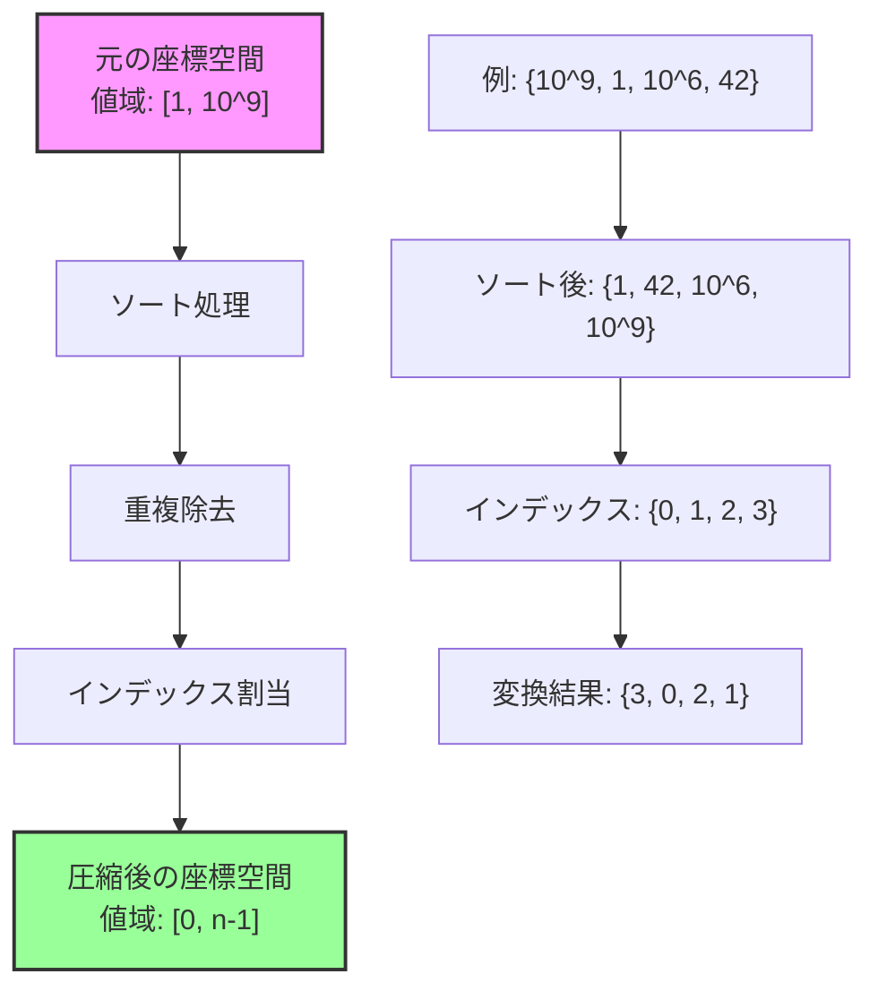
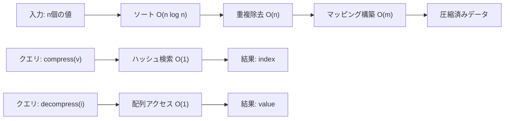
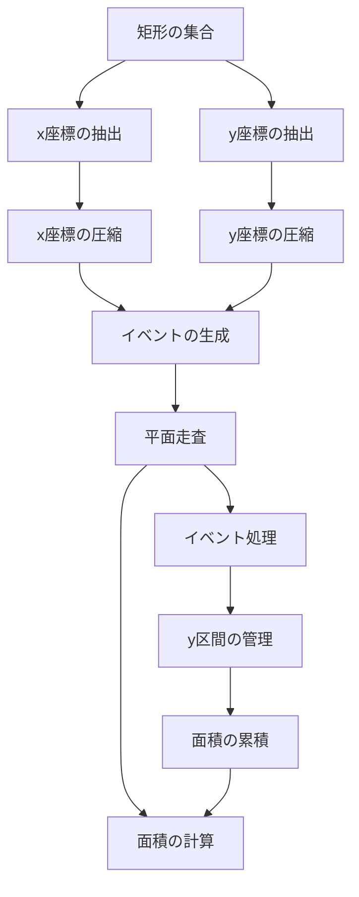

# 座標圧縮

座標圧縮（Coordinate Compression）は、競技プログラミングやアルゴリズム設計において頻繁に用いられる前処理技術である。本質的には、大きな値域を持つデータセットを、その順序関係を保持したまま小さな値域に写像する手法であり、空間計算量の削減と処理の効率化を実現する。特に、配列やセグメント木などのデータ構造を用いる際に、値域が広大である場合の空間効率化手法として重要な役割を果たす。

座標圧縮の基本的な考え方は、実際に出現する値のみに着目し、それらに連続する整数値を割り当てることである。例えば、$\{10^9, 1, 10^6, 42\}$ という値の集合があった場合、これらを順序を保持したまま $\{3, 0, 2, 1\}$ に変換する。この変換により、元の値域が $[1, 10^9]$ であったものが $[0, 3]$ という小さな範囲に収まることになる。



## 問題設定と動機

競技プログラミングにおいて、座標圧縮が必要となる典型的な状況を考えてみよう。例えば、二次元平面上に $n$ 個の点が与えられ、各点の座標値が $[-10^9, 10^9]$ の範囲にあるとする。これらの点に関する何らかの集計処理を行う際、座標値を直接配列のインデックスとして使用したい場合がある。しかし、$2 \times 10^9 + 1$ 個の要素を持つ配列を確保することは、メモリ制約の観点から現実的ではない。

より具体的な例として、以下のような問題を考える：
- $n$ 個の矩形が与えられ、それらの和集合の面積を求める
- 二次元平面上の点集合に対して、各点を含む最小の矩形内にある他の点の数を数える
- 一次元上の区間の集合が与えられ、各位置を覆う区間の数を効率的に管理する

これらの問題では、座標値そのものよりも、値の相対的な順序関係が重要である。座標圧縮を適用することで、空間計算量を $O(\text{値域})$ から $O(n)$ に削減でき、実用的な解法が可能となる。

## アルゴリズムの詳細

座標圧縮のアルゴリズムは、以下の手順で構成される：

1. **値の収集**: 入力データから圧縮対象となるすべての値を収集する
2. **ソートと重複除去**: 収集した値をソートし、重複を除去する
3. **インデックスの割当**: ソート後の各値に0から始まる連続したインデックスを割り当てる
4. **変換関数の構築**: 元の値から圧縮後のインデックスへの変換を行う関数を構築する

```cpp
class CoordinateCompression {
private:
    vector<long long> sorted_values;
    unordered_map<long long, int> value_to_index;
    
public:
    // Constructor takes all values that need to be compressed
    CoordinateCompression(vector<long long>& values) {
        // Copy and sort values
        sorted_values = values;
        sort(sorted_values.begin(), sorted_values.end());
        
        // Remove duplicates
        sorted_values.erase(
            unique(sorted_values.begin(), sorted_values.end()),
            sorted_values.end()
        );
        
        // Build value to index mapping
        for (int i = 0; i < sorted_values.size(); i++) {
            value_to_index[sorted_values[i]] = i;
        }
    }
    
    // Convert original value to compressed index
    int compress(long long value) {
        return value_to_index[value];
    }
    
    // Convert compressed index back to original value
    long long decompress(int index) {
        return sorted_values[index];
    }
    
    // Get the size of compressed space
    int size() {
        return sorted_values.size();
    }
};
```

このアルゴリズムの核心は、ソートによって値の順序関係を明確にし、その順序に基づいてインデックスを割り当てることにある。重要な性質として、任意の二つの値 $a, b$ について、$a < b$ ならば $\text{compress}(a) < \text{compress}(b)$ が成り立つ。この単調性により、元の問題の構造が圧縮後も保持される。

## 計算量の解析

座標圧縮の計算量を詳細に分析すると、以下のようになる：

**前処理段階**：
- 値の収集: $O(n)$（$n$ は入力値の総数）
- ソート: $O(n \log n)$
- 重複除去: $O(n)$
- ハッシュマップの構築: $O(m)$（$m$ は異なる値の数、$m \leq n$）

したがって、前処理全体の時間計算量は $O(n \log n)$ となる。

**クエリ段階**：
- 圧縮（compress）: $O(1)$（ハッシュマップを使用）
- 展開（decompress）: $O(1)$（配列アクセス）

空間計算量は $O(m)$ であり、これは異なる値の数に比例する。実際の応用では、$m \ll \text{元の値域}$ となることが多く、大幅な空間削減が実現される。



## 実装上の注意点

座標圧縮を実装する際には、いくつかの重要な注意点がある。まず、ハッシュマップの代わりに二分探索を使用する実装も考えられる。この場合、圧縮操作の計算量は $O(\log m)$ となるが、追加の空間を必要としないという利点がある。

```cpp
// Binary search based compression
int compress_binary_search(long long value) {
    return lower_bound(sorted_values.begin(), sorted_values.end(), value) 
           - sorted_values.begin();
}
```

また、座標圧縮を適用する際には、元の問題で必要とされる値がすべて圧縮対象に含まれていることを確認する必要がある。例えば、区間クエリを扱う問題では、区間の端点だけでなく、クエリで参照される可能性のあるすべての座標を事前に収集しておく必要がある。

さらに、数値の精度に関する問題も考慮すべきである。浮動小数点数を扱う場合、丸め誤差により同じであるべき値が異なる値として扱われる可能性がある。このような場合には、適切な許容誤差を設定し、近い値を同一視する処理が必要となる。

```cpp
// Coordinate compression with epsilon for floating point values
class FloatingPointCoordinateCompression {
private:
    const double EPSILON = 1e-9;
    vector<double> sorted_values;
    
    bool are_equal(double a, double b) {
        return abs(a - b) < EPSILON;
    }
    
public:
    FloatingPointCoordinateCompression(vector<double>& values) {
        sorted_values = values;
        sort(sorted_values.begin(), sorted_values.end());
        
        // Custom unique with epsilon comparison
        auto new_end = sorted_values.begin();
        for (auto it = sorted_values.begin(); it != sorted_values.end(); ++it) {
            if (new_end == sorted_values.begin() || 
                !are_equal(*it, *(new_end - 1))) {
                *new_end++ = *it;
            }
        }
        sorted_values.erase(new_end, sorted_values.end());
    }
};
```

## 二次元座標圧縮への拡張

座標圧縮は一次元だけでなく、多次元空間にも適用できる。二次元座標圧縮では、x座標とy座標を独立に圧縮する。これにより、元の二次元空間上の点 $(x, y)$ は、圧縮後の空間上の点 $(x', y')$ に変換される。

```cpp
class TwoDimensionalCoordinateCompression {
private:
    CoordinateCompression x_comp, y_comp;
    
public:
    TwoDimensionalCoordinateCompression(
        vector<pair<long long, long long>>& points) {
        vector<long long> x_values, y_values;
        
        for (auto& p : points) {
            x_values.push_back(p.first);
            y_values.push_back(p.second);
        }
        
        x_comp = CoordinateCompression(x_values);
        y_comp = CoordinateCompression(y_values);
    }
    
    pair<int, int> compress(pair<long long, long long> point) {
        return {x_comp.compress(point.first), 
                y_comp.compress(point.second)};
    }
    
    pair<int, int> get_compressed_size() {
        return {x_comp.size(), y_comp.size()};
    }
};
```

二次元座標圧縮の重要な応用として、矩形の和集合の面積計算がある。この問題では、すべての矩形の頂点のx座標とy座標を収集し、それぞれを圧縮する。圧縮後の座標系では、グリッドの各セルが元の座標系での矩形領域に対応し、効率的な処理が可能となる。

## 動的座標圧縮

これまで説明した座標圧縮は、すべての値が事前に分かっている静的な場合を想定していた。しかし、実際の問題では、値が動的に追加される場合もある。このような状況に対応するため、動的座標圧縮の手法が必要となる。

動的座標圧縮の基本的なアプローチは、平衡二分探索木（例えば、C++のstd::setやstd::map）を使用することである。新しい値が追加されるたびに、その値を木に挿入し、木内での順位を圧縮後のインデックスとして使用する。

```cpp
class DynamicCoordinateCompression {
private:
    set<long long> values;
    map<long long, int> value_to_index;
    
    void rebuild_indices() {
        int index = 0;
        value_to_index.clear();
        for (auto& v : values) {
            value_to_index[v] = index++;
        }
    }
    
public:
    void insert(long long value) {
        if (values.insert(value).second) {
            // New value was inserted, rebuild indices
            rebuild_indices();
        }
    }
    
    int compress(long long value) {
        return value_to_index[value];
    }
    
    int rank(long long value) {
        // Returns the number of values less than the given value
        return distance(values.begin(), values.lower_bound(value));
    }
};
```

しかし、この単純な実装では、新しい値が追加されるたびにインデックスの再構築が必要となり、効率が悪い。より洗練されたアプローチとして、Order Statistic Tree（順序統計木）を使用する方法がある。これにより、挿入と順位クエリの両方を $O(\log n)$ で実行できる。

## セグメント木との組み合わせ

座標圧縮の最も重要な応用の一つは、セグメント木やBinary Indexed Tree（BIT）などのデータ構造との組み合わせである。例えば、動的に更新される点の集合に対して、ある範囲内の点の数を高速にクエリする問題を考える。

```cpp
class CompressedRangeQuery {
private:
    CoordinateCompression comp;
    vector<int> bit;  // Binary Indexed Tree
    
    void update(int idx, int delta) {
        idx++;  // BIT is 1-indexed
        while (idx <= bit.size()) {
            bit[idx] += delta;
            idx += idx & (-idx);
        }
    }
    
    int query(int idx) {
        idx++;
        int sum = 0;
        while (idx > 0) {
            sum += bit[idx];
            idx -= idx & (-idx);
        }
        return sum;
    }
    
public:
    CompressedRangeQuery(vector<long long>& values) : comp(values) {
        bit.resize(comp.size() + 1, 0);
    }
    
    void add_point(long long x) {
        update(comp.compress(x), 1);
    }
    
    void remove_point(long long x) {
        update(comp.compress(x), -1);
    }
    
    int count_in_range(long long left, long long right) {
        int l = comp.compress(left);
        int r = comp.compress(right);
        return query(r) - (l > 0 ? query(l - 1) : 0);
    }
};
```

このような組み合わせにより、元の値域が巨大であっても、実際に出現する値の数に比例した空間計算量で効率的なデータ構造を構築できる。

## 区間座標圧縮

座標圧縮の変種として、区間座標圧縮（Interval Coordinate Compression）がある。これは、点ではなく区間を扱う問題で使用される。例えば、複数の区間が与えられ、それらの和集合や交差を効率的に処理する必要がある場合に有用である。

区間座標圧縮では、すべての区間の端点を収集し、それらを圧縮する。さらに、隣接する圧縮座標間の区間も考慮する必要がある。これにより、元の連続空間が有限個の離散的な区間に分割される。

```cpp
class IntervalCoordinateCompression {
private:
    vector<long long> critical_points;
    map<long long, int> point_to_segment;
    
public:
    IntervalCoordinateCompression(vector<pair<long long, long long>>& intervals) {
        // Collect all interval endpoints
        for (auto& interval : intervals) {
            critical_points.push_back(interval.first);
            critical_points.push_back(interval.second);
        }
        
        // Sort and remove duplicates
        sort(critical_points.begin(), critical_points.end());
        critical_points.erase(
            unique(critical_points.begin(), critical_points.end()),
            critical_points.end()
        );
        
        // Build point to segment mapping
        for (int i = 0; i < critical_points.size(); i++) {
            point_to_segment[critical_points[i]] = 2 * i;
            if (i + 1 < critical_points.size()) {
                // Add a virtual point between consecutive critical points
                long long mid = critical_points[i] + 1;
                if (mid < critical_points[i + 1]) {
                    point_to_segment[mid] = 2 * i + 1;
                }
            }
        }
    }
    
    pair<int, int> compress_interval(pair<long long, long long> interval) {
        auto it_left = point_to_segment.lower_bound(interval.first);
        auto it_right = point_to_segment.upper_bound(interval.second);
        it_right--;
        
        return {it_left->second, it_right->second};
    }
};
```

## 計算幾何学における座標圧縮

計算幾何学の問題では、座標圧縮が特に有効である。例えば、平面走査法（Plane Sweep）と組み合わせることで、多くの幾何学的問題を効率的に解くことができる。

矩形の和集合の面積を求める問題を詳しく見てみよう。この問題では、すべての矩形の左右の辺のx座標と、上下の辺のy座標を収集し、それぞれを圧縮する。その後、x座標でソートされたイベント（矩形の開始と終了）を処理しながら、各x座標での「アクティブな」y区間の和集合の長さを管理する。



この手法により、$n$ 個の矩形に対して $O(n^2 \log n)$ の時間計算量で和集合の面積を計算できる。座標圧縮を使用しない場合、値域に依存した計算量となり、実用的でない場合が多い。

## 実装における最適化

座標圧縮の実装では、いくつかの最適化技法を適用できる。まず、メモリ局所性を考慮した実装が重要である。圧縮後のインデックスを頻繁にアクセスする場合、キャッシュ効率を高めるためにデータ構造の配置を工夫する必要がある。

```cpp
class OptimizedCoordinateCompression {
private:
    // Use vector instead of unordered_map for better cache locality
    vector<pair<long long, int>> sorted_pairs;
    
    int binary_search_compress(long long value) {
        auto it = lower_bound(
            sorted_pairs.begin(), 
            sorted_pairs.end(),
            make_pair(value, -1)
        );
        return it->second;
    }
    
public:
    OptimizedCoordinateCompression(vector<long long>& values) {
        // Create pairs of (value, index)
        set<long long> unique_values(values.begin(), values.end());
        sorted_pairs.reserve(unique_values.size());
        
        int index = 0;
        for (auto& v : unique_values) {
            sorted_pairs.emplace_back(v, index++);
        }
    }
    
    int compress(long long value) {
        return binary_search_compress(value);
    }
};
```

また、座標圧縮を複数回適用する場合、圧縮結果をキャッシュすることで性能を向上させることができる。特に、同じ値セットに対して異なるクエリを実行する場合に有効である。

## 誤差を考慮した座標圧縮

実数値を扱う問題では、数値誤差が座標圧縮の正確性に影響を与える可能性がある。例えば、計算の過程で生じる丸め誤差により、本来同じであるべき座標が異なる値として扱われることがある。

この問題に対処するため、誤差を考慮した座標圧縮の実装が必要となる。基本的なアプローチは、値をソートした後、隣接する値の差が閾値以下の場合は同一視することである。

```cpp
class RobustCoordinateCompression {
private:
    const double EPSILON;
    vector<double> representatives;
    
public:
    RobustCoordinateCompression(vector<double>& values, double eps = 1e-9) 
        : EPSILON(eps) {
        if (values.empty()) return;
        
        sort(values.begin(), values.end());
        representatives.push_back(values[0]);
        
        for (int i = 1; i < values.size(); i++) {
            if (values[i] - representatives.back() > EPSILON) {
                representatives.push_back(values[i]);
            }
        }
    }
    
    int compress(double value) {
        // Find the representative closest to the value
        int left = 0, right = representatives.size() - 1;
        
        while (left < right) {
            int mid = (left + right) / 2;
            if (representatives[mid] + EPSILON < value) {
                left = mid + 1;
            } else {
                right = mid;
            }
        }
        
        // Check if the value is close enough to the representative
        if (abs(representatives[left] - value) <= EPSILON) {
            return left;
        }
        
        // Value not found (should not happen if properly initialized)
        return -1;
    }
};
```

この実装では、各圧縮後のインデックスに対して「代表値」を保持し、クエリ時には最も近い代表値のインデックスを返す。これにより、数値誤差の影響を最小限に抑えることができる。

## パフォーマンス特性と実測

座標圧縮のパフォーマンスは、実装方法と使用するデータ構造によって大きく異なる。以下に、典型的な実装のパフォーマンス特性を示す：

**ハッシュマップベースの実装**：
- 前処理: $O(n \log n)$（ソートがボトルネック）
- 圧縮クエリ: $O(1)$ 期待値
- メモリ使用量: $O(m)$（ハッシュマップのオーバーヘッドあり）

**二分探索ベースの実装**：
- 前処理: $O(n \log n)$
- 圧縮クエリ: $O(\log m)$
- メモリ使用量: $O(m)$（配列のみで実装可能）

実際の問題では、クエリの頻度とデータのサイズに応じて適切な実装を選択する必要がある。クエリが非常に頻繁に実行される場合はハッシュマップベースが有利だが、メモリ制約が厳しい場合は二分探索ベースが適している。

座標圧縮は、アルゴリズム設計における重要な前処理技術として、空間効率と処理効率の両方を改善する強力な手法である。その応用範囲は広く、競技プログラミングから実務的なデータ処理まで、様々な場面で活用されている。特に、大規模なデータセットを扱う現代のソフトウェアエンジニアリングにおいて、座標圧縮の理解と適切な実装は、効率的なシステム設計の鍵となる技術の一つと言えるだろう。