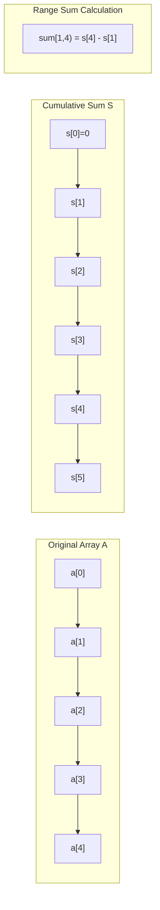
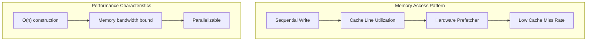
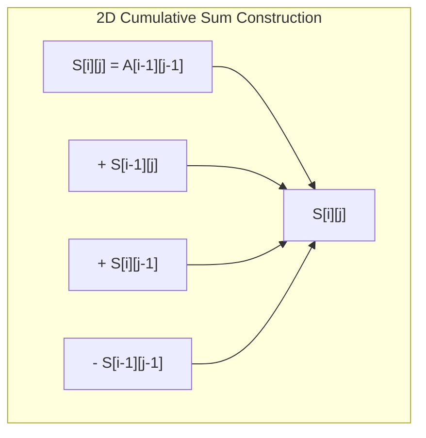
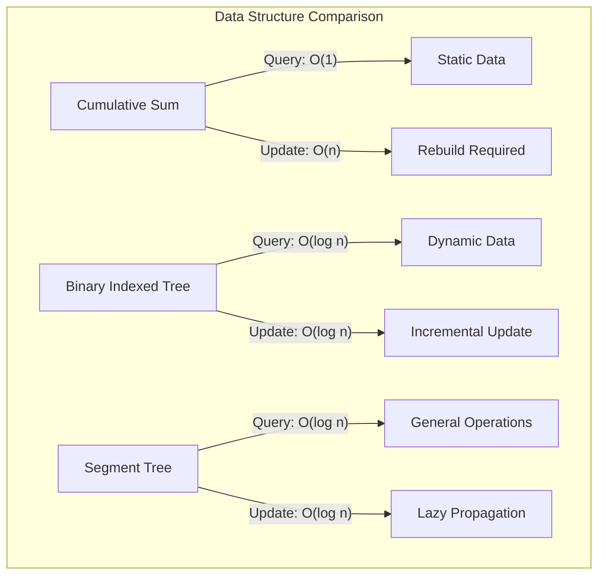

# 累積和

累積和は、数列の先頭から各位置までの要素の総和を事前に計算しておくことで、任意の区間和を定数時間で求めることを可能にする基本的なデータ構造である。この手法は、単純な総和計算の高速化にとどまらず、動的計画法における状態遷移の効率化、多次元データの領域和計算、さらには確率分布のサンプリングなど、幅広い応用を持つ。本稿では、累積和の数学的基礎から実装の詳細、そして実践的な最適化技法まで、体系的に解説する。

## 数学的基礎と定義

数列 $A = (a_0, a_1, ..., a_{n-1})$ に対して、その累積和数列 $S = (s_0, s_1, ..., s_n)$ を次のように定義する。

$$s_i = \sum_{j=0}^{i-1} a_j \quad (0 \leq i \leq n)$$

ここで、$s_0 = 0$ と定義することで、空区間の和が自然に0となる。この定義により、任意の半開区間 $[l, r)$ における和は次のように表される。

$$\sum_{i=l}^{r-1} a_i = s_r - s_l$$

この関係式が累積和の本質である。区間和の計算が引き算一回で済むという単純な事実が、多くのアルゴリズムの計算量を劇的に改善する。



累積和の構築は線形時間で行われ、その後の区間和クエリは定数時間で処理される。この前処理の投資が、複数回のクエリ処理において大きな効果を発揮する。

## 実装の詳細と境界条件

累積和の実装において最も重要なのは、インデックスの扱いと境界条件の処理である。実装上の観点から、累積和配列のサイズを元の配列より1要素多くすることには明確な利点がある。

```cpp
// Basic implementation with careful boundary handling
template<typename T>
class CumulativeSum {
private:
    vector<T> sum;
    
public:
    CumulativeSum(const vector<T>& arr) : sum(arr.size() + 1) {
        for (size_t i = 0; i < arr.size(); ++i) {
            sum[i + 1] = sum[i] + arr[i];
        }
    }
    
    // Query sum of [l, r)
    T query(int l, int r) const {
        return sum[r] - sum[l];
    }
};
```

この実装における設計判断として、半開区間 $[l, r)$ を採用している。これは標準ライブラリのイテレータ規約と一致し、空区間の扱いが自然になるという利点がある。閉区間 $[l, r]$ を使用する実装も可能だが、空区間の表現や境界処理が複雑になる傾向がある。

オーバーフローへの対処も実装上の重要な考慮事項である。整数型を使用する場合、累積和の値は元の配列要素よりも大きくなることが保証されているため、適切な型選択が必要となる。

```cpp
// Overflow-aware implementation
template<typename T>
class SafeCumulativeSum {
private:
    using SumType = conditional_t<is_integral_v<T>, int64_t, T>;
    vector<SumType> sum;
    
public:
    SafeCumulativeSum(const vector<T>& arr) : sum(arr.size() + 1) {
        for (size_t i = 0; i < arr.size(); ++i) {
            sum[i + 1] = sum[i] + static_cast<SumType>(arr[i]);
        }
    }
};
```

## メモリアクセスパターンとキャッシュ効率

累積和の構築過程は、メモリアクセスの観点から見ると理想的なシーケンシャルアクセスパターンを示す。現代のプロセッサアーキテクチャにおいて、このアクセスパターンはプリフェッチ機構を最大限に活用できる。



しかし、大規模なデータセットにおいては、メモリ帯域幅がボトルネックとなることがある。特に、累積和配列のサイズがL3キャッシュを超える場合、構築時のパフォーマンスはメモリサブシステムの性能に大きく依存する。

並列化による高速化も可能である。累積和の計算は本質的にシーケンシャルな操作に見えるが、分割統治法を用いることで並列化できる[^1]。

```cpp
// Parallel prefix sum using divide-and-conquer
template<typename T>
void parallel_prefix_sum(vector<T>& arr, int threads = thread::hardware_concurrency()) {
    const size_t n = arr.size();
    if (n <= 10000 || threads == 1) {
        // Sequential implementation for small arrays
        for (size_t i = 1; i < n; ++i) {
            arr[i] += arr[i - 1];
        }
        return;
    }
    
    // Divide phase: compute local prefix sums
    vector<T> block_sums(threads);
    size_t block_size = (n + threads - 1) / threads;
    
    parallel_for(0, threads, [&](int tid) {
        size_t start = tid * block_size;
        size_t end = min(start + block_size, n);
        
        for (size_t i = start + 1; i < end; ++i) {
            arr[i] += arr[i - 1];
        }
        
        if (end > start) {
            block_sums[tid] = arr[end - 1];
        }
    });
    
    // Conquer phase: compute prefix sums of block sums
    for (int i = 1; i < threads; ++i) {
        block_sums[i] += block_sums[i - 1];
    }
    
    // Combine phase: add block prefix to each element
    parallel_for(1, threads, [&](int tid) {
        size_t start = tid * block_size;
        size_t end = min(start + block_size, n);
        T offset = block_sums[tid - 1];
        
        for (size_t i = start; i < end; ++i) {
            arr[i] += offset;
        }
    });
}
```

[^1]: Guy E. Blelloch. "Prefix Sums and Their Applications". Technical Report CMU-CS-90-190, School of Computer Science, Carnegie Mellon University, November 1990.

## 多次元への拡張

二次元累積和は、矩形領域の和を高速に計算するための自然な拡張である。二次元配列 $A[i][j]$ に対して、累積和 $S[i][j]$ を次のように定義する。

$$S[i][j] = \sum_{p=0}^{i-1} \sum_{q=0}^{j-1} A[p][q]$$

この定義により、矩形領域 $[r_1, r_2) \times [c_1, c_2)$ の和は包除原理を用いて計算できる。

$$\text{sum} = S[r_2][c_2] - S[r_1][c_2] - S[r_2][c_1] + S[r_1][c_1]$$



二次元累積和の構築では、各要素に対して4つの値を参照する必要があるが、適切な順序で計算することで、キャッシュ効率を維持できる。

```cpp
template<typename T>
class CumulativeSum2D {
private:
    vector<vector<T>> sum;
    
public:
    CumulativeSum2D(const vector<vector<T>>& grid) {
        int h = grid.size();
        int w = grid[0].size();
        sum.assign(h + 1, vector<T>(w + 1, 0));
        
        for (int i = 0; i < h; ++i) {
            for (int j = 0; j < w; ++j) {
                sum[i + 1][j + 1] = grid[i][j] 
                                  + sum[i + 1][j] 
                                  + sum[i][j + 1] 
                                  - sum[i][j];
            }
        }
    }
    
    // Query sum of rectangle [r1, r2) x [c1, c2)
    T query(int r1, int c1, int r2, int c2) const {
        return sum[r2][c2] - sum[r1][c2] - sum[r2][c1] + sum[r1][c1];
    }
};
```

多次元への一般化も可能であり、$d$ 次元の場合、包除原理により $2^d$ 項の加減算で領域和が計算できる。しかし、次元数が増加すると、メモリ使用量と計算量の両面で実用性が低下する。

## 動的更新への対応：Binary Indexed TreeとSegment Tree

累積和の主要な制限は、元の配列の更新に対応できないことである。要素を一つ更新すると、それ以降のすべての累積和を再計算する必要があり、最悪の場合 $O(n)$ の時間がかかる。

この問題を解決するために、Binary Indexed Tree（BIT）やSegment Treeなどのデータ構造が開発された。これらは累積和の概念を一般化し、更新と区間クエリの両方を効率的に処理できる。

BITは累積和の思想を巧妙に拡張したデータ構造である。各ノードが特定の区間の和を保持し、ビット演算を用いて効率的にアクセスする。

```cpp
template<typename T>
class BinaryIndexedTree {
private:
    vector<T> tree;
    int n;
    
    int lowbit(int x) { return x & (-x); }
    
public:
    BinaryIndexedTree(int size) : n(size), tree(size + 1) {}
    
    void update(int idx, T delta) {
        idx++;  // 1-indexed
        while (idx <= n) {
            tree[idx] += delta;
            idx += lowbit(idx);
        }
    }
    
    T prefix_sum(int idx) {
        idx++;  // 1-indexed
        T sum = 0;
        while (idx > 0) {
            sum += tree[idx];
            idx -= lowbit(idx);
        }
        return sum;
    }
    
    T range_sum(int l, int r) {
        return prefix_sum(r - 1) - (l > 0 ? prefix_sum(l - 1) : 0);
    }
};
```

BITの各操作は $O(\log n)$ で実行される。この計算量は、累積和の $O(1)$ クエリと比較すると劣るが、更新操作も同じ計算量で実行できる点が重要である。



## 実数値データと数値安定性

実数値の累積和を扱う場合、浮動小数点演算の誤差が蓄積する問題が生じる。特に、正負の値が混在する配列では、桁落ちにより精度が著しく低下することがある。

Kahan summationアルゴリズム[^2]は、この問題に対する古典的な解決策である。補正項を用いて誤差を追跡し、累積誤差を最小限に抑える。

```cpp
template<typename T>
class KahanCumulativeSum {
private:
    vector<T> sum;
    vector<T> compensation;
    
public:
    KahanCumulativeSum(const vector<T>& arr) 
        : sum(arr.size() + 1), compensation(arr.size() + 1) {
        
        T s = 0, c = 0;
        for (size_t i = 0; i < arr.size(); ++i) {
            T y = arr[i] - c;
            T t = s + y;
            c = (t - s) - y;
            s = t;
            
            sum[i + 1] = s;
            compensation[i + 1] = c;
        }
    }
    
    T query(int l, int r) const {
        return (sum[r] - sum[l]) - (compensation[r] - compensation[l]);
    }
};
```

[^2]: William Kahan. "Pracniques: Further Remarks on Reducing Truncation Errors". Communications of the ACM, Volume 8, Issue 1, January 1965, pp. 40.

より高精度が要求される場合は、補償付き和の代わりに、より精密な誤差追跡を行うNeumaierのアルゴリズムや、ペアワイズ加算を用いる方法もある。

## 確率分布とサンプリング

累積和は確率分布からのサンプリングにおいても重要な役割を果たす。離散確率分布が与えられたとき、その累積分布関数（CDF）を事前計算しておくことで、二分探索により $O(\log n)$ でサンプリングできる。

```cpp
template<typename T>
class DiscreteDistribution {
private:
    vector<T> cdf;
    mt19937 gen;
    uniform_real_distribution<T> uniform;
    
public:
    DiscreteDistribution(const vector<T>& weights) 
        : gen(random_device{}()), uniform(0, 1) {
        
        cdf.resize(weights.size() + 1);
        partial_sum(weights.begin(), weights.end(), cdf.begin() + 1);
        
        // Normalize
        T total = cdf.back();
        for (auto& x : cdf) {
            x /= total;
        }
    }
    
    int sample() {
        T r = uniform(gen);
        return upper_bound(cdf.begin(), cdf.end(), r) - cdf.begin() - 1;
    }
};
```

この手法は、重み付きランダムサンプリング、モンテカルロ法、強化学習における行動選択など、幅広い応用がある。

## スライディングウィンドウと差分更新

固定サイズのウィンドウが配列上を移動する場合、累積和を用いることで各位置での和を効率的に計算できる。しかし、より効率的なアプローチとして、差分更新を用いる方法がある。

```cpp
template<typename T>
class SlidingWindowSum {
private:
    deque<T> window;
    T current_sum;
    size_t window_size;
    
public:
    SlidingWindowSum(size_t k) : window_size(k), current_sum(0) {}
    
    void add(T value) {
        window.push_back(value);
        current_sum += value;
        
        if (window.size() > window_size) {
            current_sum -= window.front();
            window.pop_front();
        }
    }
    
    T sum() const {
        return current_sum;
    }
};
```

この差分更新のアプローチは、累積和を明示的に構築することなく、同等の効果を達成する。メモリ使用量が $O(k)$ に削減され、ストリーミングデータの処理に適している。

## 循環配列と周期的境界条件

循環配列における区間和の計算は、累積和の興味深い応用例である。配列の末尾と先頭が接続されている場合、通常の累積和では扱いにくい区間が存在する。

```cpp
template<typename T>
class CircularCumulativeSum {
private:
    vector<T> sum;
    int n;
    
public:
    CircularCumulativeSum(const vector<T>& arr) : n(arr.size()) {
        sum.resize(2 * n + 1);
        
        // Build cumulative sum for doubled array
        for (int i = 0; i < 2 * n; ++i) {
            sum[i + 1] = sum[i] + arr[i % n];
        }
    }
    
    // Query circular range sum
    T query(int l, int r) {
        if (l <= r) {
            return sum[r] - sum[l];
        } else {
            // Wrapping case
            return sum[n] - sum[l] + sum[r];
        }
    }
};
```

この実装では、配列を仮想的に2倍に拡張することで、循環する区間和を通常の区間和として扱える。

## 差分配列との双対性

累積和と差分配列は双対の関係にある。配列 $A$ の差分配列 $D$ は $d_i = a_i - a_{i-1}$ で定義され、差分配列の累積和を取ると元の配列が復元される。

この双対性は、区間更新と点クエリの問題を、点更新と区間クエリの問題に変換する際に利用される。いわゆる「いもす法」として知られる手法である。

```cpp
template<typename T>
class RangeUpdatePointQuery {
private:
    vector<T> diff;
    int n;
    
public:
    RangeUpdatePointQuery(int size) : n(size), diff(size + 1) {}
    
    // Add value to range [l, r)
    void range_add(int l, int r, T value) {
        diff[l] += value;
        diff[r] -= value;
    }
    
    // Get value at index i
    T point_query(int i) {
        T sum = 0;
        for (int j = 0; j <= i; ++j) {
            sum += diff[j];
        }
        return sum;
    }
    
    // Materialize all values
    vector<T> build() {
        vector<T> result(n);
        T sum = 0;
        for (int i = 0; i < n; ++i) {
            sum += diff[i];
            result[i] = sum;
        }
        return result;
    }
};
```

## 実装上の最適化技法

実践的な場面では、累積和の実装において様々な最適化が可能である。SIMD命令を用いた並列化、プリフェッチヒントの挿入、アライメントの調整などがある。

```cpp
// SIMD-optimized cumulative sum for aligned float arrays
void simd_cumulative_sum(float* arr, float* sum, size_t n) {
    const size_t simd_width = 8;  // AVX: 256-bit / 32-bit = 8 floats
    
    __m256 acc = _mm256_setzero_ps();
    size_t i = 0;
    
    // Process aligned portion
    for (; i + simd_width <= n; i += simd_width) {
        __m256 vals = _mm256_load_ps(&arr[i]);
        
        // Horizontal scan within SIMD register
        vals = _mm256_add_ps(vals, _mm256_castsi256_ps(
            _mm256_slli_si256(_mm256_castps_si256(vals), 4)));
        vals = _mm256_add_ps(vals, _mm256_castsi256_ps(
            _mm256_slli_si256(_mm256_castps_si256(vals), 8)));
        
        // Add accumulated sum from previous iterations
        vals = _mm256_add_ps(vals, acc);
        _mm256_store_ps(&sum[i], vals);
        
        // Update accumulator
        acc = _mm256_set1_ps(sum[i + simd_width - 1]);
    }
    
    // Handle remaining elements
    float last_sum = (i > 0) ? sum[i - 1] : 0;
    for (; i < n; ++i) {
        last_sum += arr[i];
        sum[i] = last_sum;
    }
}
```

キャッシュラインの境界を意識したデータ配置も重要である。累積和配列を構築する際、false sharingを避けるためにパディングを挿入することで、並列処理時の性能が向上することがある。

## 分散システムにおける累積和

大規模データ処理において、累積和の計算を複数のノードに分散させる必要がある場合がある。MapReduceフレームワークにおける実装例を考える。

```python
# Distributed cumulative sum using MapReduce paradigm
def map_phase(partition_id, data):
    """Compute local cumulative sum for a partition"""
    local_sum = []
    acc = 0
    for value in data:
        acc += value
        local_sum.append(acc)
    
    # Emit partition sum for reduce phase
    yield ('partition_sum', partition_id, acc)
    
    # Emit local cumulative sums
    for i, s in enumerate(local_sum):
        yield ('local_sum', partition_id, i, s)

def reduce_phase(key_type, values):
    """Combine partition results"""
    if key_type == 'partition_sum':
        # Compute prefix sums of partition totals
        partition_sums = sorted(values, key=lambda x: x[0])
        prefix = 0
        offsets = {}
        
        for pid, total in partition_sums:
            offsets[pid] = prefix
            prefix += total
        
        return offsets
    
    elif key_type == 'local_sum':
        # Adjust local sums with partition offsets
        offsets = get_partition_offsets()
        
        for pid, idx, local_sum in values:
            global_sum = local_sum + offsets[pid]
            yield (pid, idx, global_sum)
```

この分散アプローチでは、各パーティションで局所的な累積和を計算し、その後パーティション間の調整を行う。通信量は $O(p)$（$p$ はパーティション数）に抑えられる。

## 近似アルゴリズムとスケッチ

メモリ制約が厳しい環境では、厳密な累積和の代わりに近似的な手法を用いることがある。Count-Min SketchやQuantile Sketchなどの確率的データ構造は、累積和の概念を近似的に実現する。

```cpp
// Approximate cumulative sum using sampling
template<typename T>
class ApproximateCumulativeSum {
private:
    vector<T> samples;
    vector<size_t> indices;
    size_t n;
    size_t sample_rate;
    
public:
    ApproximateCumulativeSum(const vector<T>& arr, size_t samples_count) 
        : n(arr.size()) {
        
        sample_rate = max(size_t(1), n / samples_count);
        
        T sum = 0;
        for (size_t i = 0; i < n; ++i) {
            sum += arr[i];
            
            if (i % sample_rate == 0) {
                samples.push_back(sum);
                indices.push_back(i);
            }
        }
    }
    
    // Approximate query with interpolation
    T query(size_t pos) {
        if (pos >= n) return samples.back();
        
        auto it = upper_bound(indices.begin(), indices.end(), pos);
        if (it == indices.begin()) return 0;
        
        size_t idx = it - indices.begin() - 1;
        
        // Linear interpolation
        if (idx + 1 < samples.size()) {
            double t = double(pos - indices[idx]) / (indices[idx + 1] - indices[idx]);
            return samples[idx] + t * (samples[idx + 1] - samples[idx]);
        }
        
        return samples[idx];
    }
};
```

この近似手法は、メモリ使用量を $O(n)$ から $O(\sqrt{n})$ や $O(\log n)$ に削減できるが、精度とのトレードオフが存在する。

## GPUにおける累積和

GPUでの累積和計算は、並列プレフィックスサムアルゴリズムの典型的な応用例である。CUDAにおける効率的な実装は、共有メモリとワープレベルのプリミティブを活用する。

```cuda
__global__ void gpu_cumulative_sum(float* input, float* output, int n) {
    extern __shared__ float shared[];
    
    int tid = threadIdx.x;
    int gid = blockIdx.x * blockDim.x + tid;
    
    // Load data to shared memory
    shared[tid] = (gid < n) ? input[gid] : 0;
    __syncthreads();
    
    // Up-sweep (reduction) phase
    for (int stride = 1; stride < blockDim.x; stride *= 2) {
        int idx = (tid + 1) * stride * 2 - 1;
        if (idx < blockDim.x) {
            shared[idx] += shared[idx - stride];
        }
        __syncthreads();
    }
    
    // Down-sweep phase
    if (tid == blockDim.x - 1) {
        shared[tid] = 0;
    }
    __syncthreads();
    
    for (int stride = blockDim.x / 2; stride > 0; stride /= 2) {
        int idx = (tid + 1) * stride * 2 - 1;
        if (idx < blockDim.x) {
            float temp = shared[idx - stride];
            shared[idx - stride] = shared[idx];
            shared[idx] += temp;
        }
        __syncthreads();
    }
    
    // Write result
    if (gid < n) {
        output[gid] = shared[tid];
    }
}
```

この実装は、ブロック内での並列プレフィックスサムを計算する。完全な累積和を得るには、ブロック間の調整が必要となる。

累積和という一見単純な概念が、これほど多様な側面を持つことは興味深い。基本的な定義から始まり、並列化、分散処理、近似アルゴリズム、そしてハードウェアアクセラレーションまで、計算機科学の幅広い領域と関連している。効率的なアルゴリズムの設計において、累積和の理解は基礎的でありながら本質的な要素である。実装の詳細に注意を払い、問題の特性に応じて適切な変種を選択することで、多くの計算問題を効率的に解決できる。