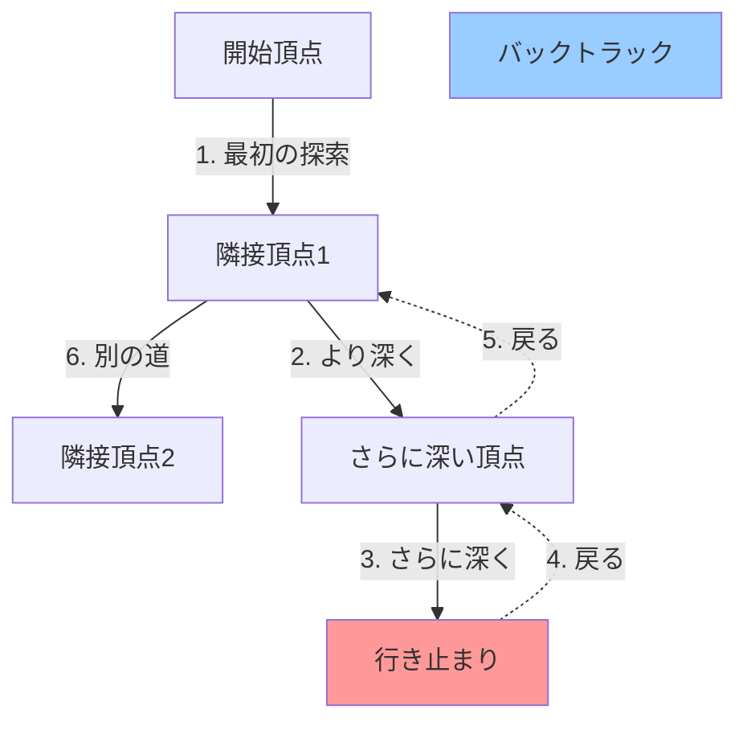
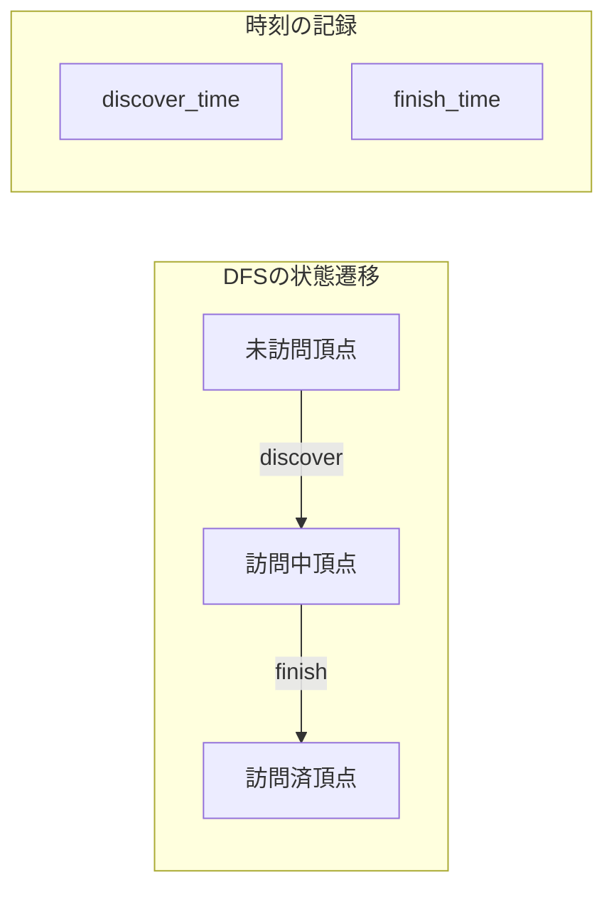
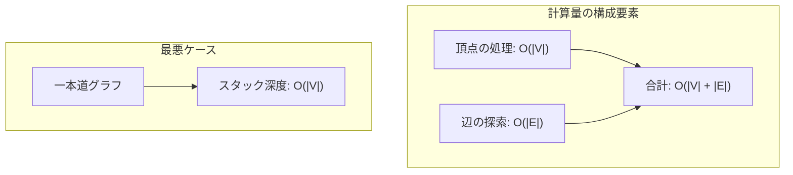
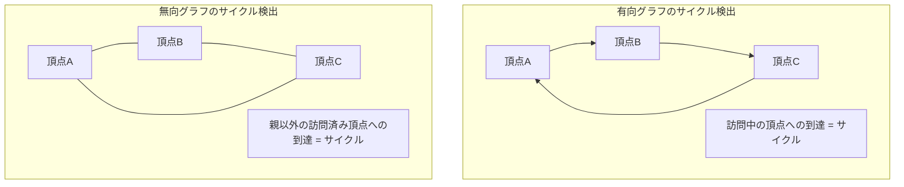
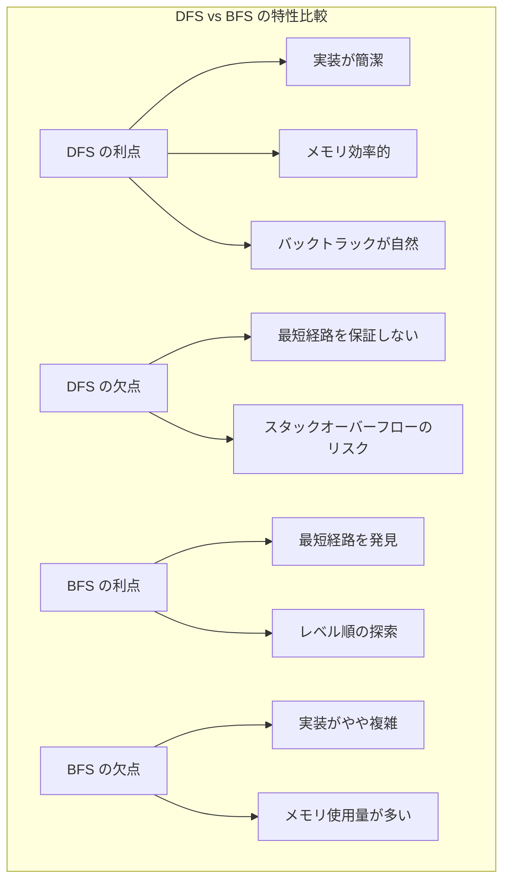

# 深さ優先探索（Depth-First Search）

深さ優先探索（Depth-First Search, DFS）は、グラフや木構造を探索する基本的なアルゴリズムの一つである。その本質は、現在の頂点から可能な限り深く進み、行き止まりに到達したら一つ前の分岐点に戻るという後戻り（バックトラック）の原理にある。この単純な原理が、グラフの連結性判定、サイクル検出、トポロジカルソート、強連結成分分解など、多様な問題を解く強力な道具となる。

競技プログラミングにおいて、DFSは最も頻繁に使用されるアルゴリズムの一つである。その理由は、実装の簡潔さと適用範囲の広さにある。再帰関数として自然に記述できるDFSは、問題の構造を直感的にコードに反映できるため、限られた時間で正確な実装を求められる競技プログラミングの文脈で特に重要となる。



## アルゴリズムの形式的定義

グラフ$G = (V, E)$において、頂点集合$V$と辺集合$E$が与えられたとき、深さ優先探索は以下のように定義される。各頂点$v \in V$に対して、訪問状態を管理する集合$visited$を用いて、開始頂点$s$から到達可能な全ての頂点を系統的に訪問する。

アルゴリズムの動作は、スタックデータ構造を用いて形式化できる。現在の探索パスがスタックに格納され、新たな頂点を訪問するたびにスタックに追加し、行き止まりに到達したらスタックから取り出すという操作を繰り返す。この過程で生成される頂点の訪問順序は、DFS木と呼ばれる部分グラフを形成する。



DFSの探索過程では、各頂点に対して二つの重要な時刻が記録される。頂点が最初に発見される時刻（discover time）と、その頂点から到達可能な全ての頂点の探索が完了する時刻（finish time）である。これらの時刻情報は、トポロジカルソートや強連結成分分解などの応用において重要な役割を果たす。

## 実装の詳細

深さ優先探索の実装には、大きく分けて再帰による実装と明示的なスタックを用いた実装の二つのアプローチが存在する。競技プログラミングでは、コードの簡潔さから再帰実装が好まれるが、再帰深度の制限やスタックオーバーフローのリスクを考慮する必要がある。

再帰による実装は、アルゴリズムの本質を直接的に表現できる。各頂点での処理は、隣接頂点への再帰呼び出しとして自然に記述される。一方、明示的なスタックを用いた実装は、メモリ使用量を細かく制御でき、大規模なグラフに対してもロバストに動作する。

```cpp
// Recursive implementation
void dfs_recursive(int v, vector<vector<int>>& adj, vector<bool>& visited) {
    visited[v] = true;
    // Process vertex v
    
    for (int u : adj[v]) {
        if (!visited[u]) {
            dfs_recursive(u, adj, visited);
        }
    }
}

// Stack-based implementation
void dfs_stack(int start, vector<vector<int>>& adj, vector<bool>& visited) {
    stack<int> st;
    st.push(start);
    
    while (!st.empty()) {
        int v = st.top();
        st.pop();
        
        if (visited[v]) continue;
        visited[v] = true;
        // Process vertex v
        
        for (int u : adj[v]) {
            if (!visited[u]) {
                st.push(u);
            }
        }
    }
}
```

実装上の重要な考慮点として、隣接頂点の探索順序がある。隣接リストの順序によって、同じグラフでも異なるDFS木が生成される。競技プログラミングでは、この性質を利用して、辞書順最小の経路を求める問題などが出題される。

## 計算量の解析

深さ優先探索の時間計算量は$O(|V| + |E|)$である。この線形時間の達成は、各頂点と各辺を高々一度ずつ訪問するという性質に基づく。より詳細に分析すると、各頂点の訪問には$O(1)$の時間がかかり、各頂点から出る辺の探索には、その頂点の次数に比例する時間がかかる。全体では、$\sum_{v \in V} (1 + deg(v)) = |V| + 2|E|$の操作が行われる。

空間計算量については、訪問状態を管理する配列に$O(|V|)$、再帰呼び出しのスタックまたは明示的なスタックに最悪$O(|V|)$が必要となる。特に、グラフが一本の長いパスの場合、スタックの深さは頂点数に等しくなる。



実際の実行時間は、グラフの構造に大きく依存する。密なグラフ（$|E| = O(|V|^2)$）では辺の探索が支配的となり、疎なグラフ（$|E| = O(|V|)$）では頂点の処理と辺の探索が同程度の時間を要する。キャッシュ効率の観点からは、隣接リスト表現の方が隣接行列表現よりも優れている場合が多い。

## 競技プログラミングにおける典型的応用

深さ優先探索の応用は多岐にわたるが、競技プログラミングで頻出するパターンをいくつかの観点から整理する。まず、グラフの構造的性質を調べる問題群がある。連結成分の個数を数える、二部グラフ判定、サイクル検出などがこれに該当する。

連結成分の分解は、DFSの最も基本的な応用である。未訪問の頂点から繰り返しDFSを実行することで、グラフを連結成分に分割できる。この技法は、グラフが複数の独立した部分から構成される問題で頻繁に使用される。

```cpp
int count_components(int n, vector<vector<int>>& adj) {
    vector<bool> visited(n, false);
    int components = 0;
    
    for (int i = 0; i < n; i++) {
        if (!visited[i]) {
            dfs_recursive(i, adj, visited);
            components++;
        }
    }
    
    return components;
}
```

サイクル検出は、DFSの状態管理を活用する典型例である。各頂点を「未訪問」「訪問中」「訪問済み」の三状態で管理し、訪問中の頂点に再び到達した場合にサイクルを検出する。有向グラフと無向グラフでは検出の条件が異なることに注意が必要である。



トポロジカルソートは、有向非巡回グラフ（DAG）において、全ての辺が前から後ろに向かうような頂点の順序付けを求める問題である。DFSの終了時刻を利用することで、効率的に実装できる。頂点の探索が終了した順番を逆順にすることで、トポロジカル順序が得られる。

```cpp
void topological_sort_dfs(int v, vector<vector<int>>& adj, 
                          vector<bool>& visited, stack<int>& result) {
    visited[v] = true;
    
    for (int u : adj[v]) {
        if (!visited[u]) {
            topological_sort_dfs(u, adj, visited, result);
        }
    }
    
    result.push(v);  // Finish time: add to result
}
```

木構造に対するDFSは、競技プログラミングで特に重要な位置を占める。根付き木の部分木のサイズ計算、最小共通祖先（LCA）の前処理、木の直径の計算など、多くの問題がDFSを基礎として解かれる。オイラーツアーと呼ばれる技法では、DFSの訪問順序を利用して木を配列に変換し、区間クエリとして処理する。

グリッドグラフ上のDFSも頻出パターンの一つである。二次元配列として表現される迷路やマップ上で、連結領域の探索や最短経路問題（ただし辺の重みが等しい場合はBFSが適切）などに応用される。四方向または八方向への移動を隣接関係として扱う。

```cpp
// Grid DFS example
const int dx[] = {0, 1, 0, -1};
const int dy[] = {1, 0, -1, 0};

void grid_dfs(int x, int y, vector<vector<char>>& grid, 
              vector<vector<bool>>& visited) {
    int h = grid.size(), w = grid[0].size();
    visited[x][y] = true;
    
    for (int i = 0; i < 4; i++) {
        int nx = x + dx[i];
        int ny = y + dy[i];
        
        if (nx >= 0 && nx < h && ny >= 0 && ny < w && 
            !visited[nx][ny] && grid[nx][ny] != '#') {
            grid_dfs(nx, ny, grid, visited);
        }
    }
}
```

## 実装上の落とし穴と最適化

競技プログラミングにおけるDFSの実装では、いくつかの典型的な落とし穴が存在する。最も一般的なものは、再帰深度によるスタックオーバーフローである。C++では通常、スタックサイズが数MBに制限されているため、10^5程度の深さで問題が発生する可能性がある。

この問題への対処法として、コンパイラオプションでスタックサイズを増やす、明示的なスタックを使用する、または末尾再帰の形に書き換えて最適化を期待するなどの方法がある。競技プログラミングのジャッジシステムによっては、スタックサイズの設定が異なるため、環境依存の問題となることもある。

```cpp
// Tail recursion optimization (may not always work)
void dfs_tail(int v, vector<vector<int>>& adj, vector<bool>& visited) {
    while (true) {
        visited[v] = true;
        int next = -1;
        
        for (int u : adj[v]) {
            if (!visited[u]) {
                if (next == -1) {
                    next = u;
                } else {
                    dfs_tail(u, adj, visited);
                }
            }
        }
        
        if (next == -1) break;
        v = next;  // Tail call optimization
    }
}
```

メモリアクセスパターンの最適化も重要な考慮点である。隣接リスト表現では、各頂点の隣接頂点がメモリ上で連続して配置されるため、キャッシュ効率が良い。一方、隣接行列表現では、疎なグラフに対して多くの無駄なメモリアクセスが発生する。

訪問済みフラグの管理においても、最適化の余地がある。bool型の配列の代わりにビットセットを使用することで、メモリ使用量を削減できる。また、各テストケースごとに配列を初期化する代わりに、タイムスタンプを使用する技法もある。

```cpp
// Timestamp-based visited tracking
vector<int> visited_time(n, -1);
int current_time = 0;

void dfs_with_timestamp(int v, vector<vector<int>>& adj) {
    visited_time[v] = current_time;
    
    for (int u : adj[v]) {
        if (visited_time[u] < current_time) {
            dfs_with_timestamp(u, adj);
        }
    }
}

// For each test case
current_time++;
```

## DFSとBFSの選択基準

深さ優先探索と幅優先探索（BFS）は、グラフ探索の二大手法であり、問題の性質によって使い分ける必要がある。一般的な指針として、最短経路を求める問題では辺の重みが等しい場合にBFSが適切であり、全探索や構造的性質の調査ではDFSが適している。

メモリ使用量の観点では、DFSは最悪でも頂点数に比例するメモリしか使用しないのに対し、BFSは最悪で全頂点を同時にキューに保持する可能性がある。特に、グラフが「幅広い」構造を持つ場合、BFSのメモリ使用量が問題となることがある。



実装の容易さという点では、DFSが圧倒的に優位である。再帰関数として自然に記述でき、状態の管理も暗黙的に行われる。一方、BFSはキューの明示的な管理が必要であり、レベルごとの処理を行う場合はさらに複雑になる。

## 高度な応用：強連結成分分解

強連結成分分解（Strongly Connected Components, SCC）は、DFSの高度な応用例として重要である。Kosarajuのアルゴリズムは、二回のDFSで有向グラフを強連結成分に分解する。最初のDFSで頂点の終了時刻を記録し、グラフの辺を逆向きにした転置グラフに対して、終了時刻の降順で二回目のDFSを実行する。

この手法の正当性は、DFSの終了時刻の性質に基づいている。ある強連結成分から別の強連結成分への辺が存在する場合、出発側の成分の代表頂点の終了時刻は、到着側の成分の代表頂点の終了時刻よりも必ず大きくなる。

```cpp
void scc_first_dfs(int v, vector<vector<int>>& adj, 
                   vector<bool>& visited, stack<int>& finish_order) {
    visited[v] = true;
    for (int u : adj[v]) {
        if (!visited[u]) {
            scc_first_dfs(u, adj, visited, finish_order);
        }
    }
    finish_order.push(v);
}

void scc_second_dfs(int v, vector<vector<int>>& rev_adj, 
                    vector<bool>& visited, vector<int>& component) {
    visited[v] = true;
    component.push_back(v);
    for (int u : rev_adj[v]) {
        if (!visited[u]) {
            scc_second_dfs(u, rev_adj, visited, component);
        }
    }
}
```

Tarjanのアルゴリズムは、一回のDFSで強連結成分を発見する、より効率的な手法である。各頂点に対してDFS番号（発見時刻）とlow-link値を管理し、スタックを用いて現在の強連結成分の候補を追跡する。頂点vのlow-link値が発見時刻と等しい場合、vを根とする強連結成分が発見される。

## 実装のバリエーションと最適化技法

DFSの実装には、問題の要求に応じた様々なバリエーションが存在する。関数型プログラミングのスタイルを取り入れた実装では、訪問状態を引数として渡し、副作用を最小限に抑えることができる。これにより、並列化や部分的な再計算が容易になる場合がある。

イテレータを用いた実装では、DFSの進行状態を外部から制御できる。これは、探索を途中で中断・再開する必要がある場合や、複数のDFSを協調させる場合に有用である。C++20のコルーチンを使用すれば、より直感的な実装が可能となる。

```cpp
// Iterator-based DFS implementation
class DFSIterator {
private:
    stack<pair<int, int>> st;  // (vertex, edge_index)
    vector<vector<int>>& adj;
    vector<bool>& visited;
    
public:
    DFSIterator(int start, vector<vector<int>>& adj, vector<bool>& visited) 
        : adj(adj), visited(visited) {
        st.push({start, 0});
        visited[start] = true;
    }
    
    bool hasNext() { return !st.empty(); }
    
    int next() {
        while (!st.empty()) {
            auto [v, idx] = st.top();
            
            if (idx < adj[v].size()) {
                st.top().second++;
                int u = adj[v][idx];
                if (!visited[u]) {
                    visited[u] = true;
                    st.push({u, 0});
                    return u;
                }
            } else {
                st.pop();
            }
        }
        return -1;
    }
};
```

メモリプールを用いた最適化では、頻繁な動的メモリ確保を避けることができる。特に、多数の小規模なDFSを実行する場合に効果的である。また、SIMDインストラクションを活用した並列化も、特定の条件下では有効である。

キャッシュ効率を考慮した隣接リストの配置も重要である。頂点番号が近い頂点同士が頻繁に接続される傾向がある場合、メモリ上での配置を工夫することで、キャッシュミスを削減できる。Compressed Sparse Row（CSR）形式などの表現を用いることで、メモリ使用量とアクセス効率のバランスを取ることができる。

## 競技プログラミングにおける実戦的テクニック

競技プログラミングの実戦では、DFSを他のアルゴリズムと組み合わせて使用することが多い。例えば、二分探索とDFSを組み合わせて、「ある条件を満たす最大値」を求める問題がある。各二分探索のステップでDFSを実行し、条件の成立を確認する。

動的計画法との組み合わせも頻出パターンである。木構造上でのDPでは、DFSの帰りがけ順で部分問題を解いていく。各頂点で、その部分木に関する情報を集約し、親頂点に渡していく。この手法は、木の直径、部分木の重心、最適な頂点被覆などの問題で使用される。

```cpp
// Tree DP with DFS
void tree_dp(int v, int parent, vector<vector<int>>& adj, 
             vector<int>& dp, vector<int>& size) {
    size[v] = 1;
    dp[v] = 0;
    
    for (int u : adj[v]) {
        if (u != parent) {
            tree_dp(u, v, adj, dp, size);
            size[v] += size[u];
            dp[v] += dp[u] + size[u];  // Example: sum of distances
        }
    }
}
```

複数のグラフを同時に探索する問題では、状態空間を拡張したDFSを使用する。例えば、二人のプレイヤーが異なるグラフ上を移動する問題では、(頂点1, 頂点2)のペアを状態として扱い、この拡張された状態空間上でDFSを実行する。

## デバッグとテストの指針

DFSの実装をデバッグする際は、探索の過程を可視化することが重要である。訪問順序、スタックの状態、各頂点の発見・終了時刻などを出力し、期待される動作と比較する。小規模なテストケースから始め、徐々に複雑なケースに移行することで、バグの原因を特定しやすくなる。

境界条件のテストも欠かせない。空のグラフ、単一頂点のグラフ、完全グラフ、長いパスなど、極端なケースで正しく動作することを確認する。特に、自己ループや多重辺の扱いは、実装によって異なる挙動を示すことがあるため、問題の制約を確認することが重要である。

パフォーマンステストでは、最悪ケースの入力を生成して実行時間を測定する。DFSの場合、深い再帰を引き起こすような入力（長いパス）や、多くの分岐を持つ入力（完全グラフに近い構造）でテストする。メモリ使用量についても、同様のアプローチで検証する。

競技プログラミングの文脈では、時間制限との戦いも重要な要素である。典型的な制約（N ≤ 10^5, M ≤ 10^6）に対して、自分の実装がどの程度の余裕を持って動作するかを把握しておく。定数倍の最適化が必要な場合は、プロファイリングツールを使用してボトルネックを特定する。

深さ優先探索は、その単純さゆえに奥が深いアルゴリズムである。基本的な実装から始まり、様々な応用や最適化を重ねることで、競技プログラミングにおける強力な武器となる。重要なのは、問題の本質を見抜き、適切な形でDFSを適用する能力を磨くことである。理論的な理解と実装力の両方を高めることで、より複雑な問題にも対応できるようになるだろう。