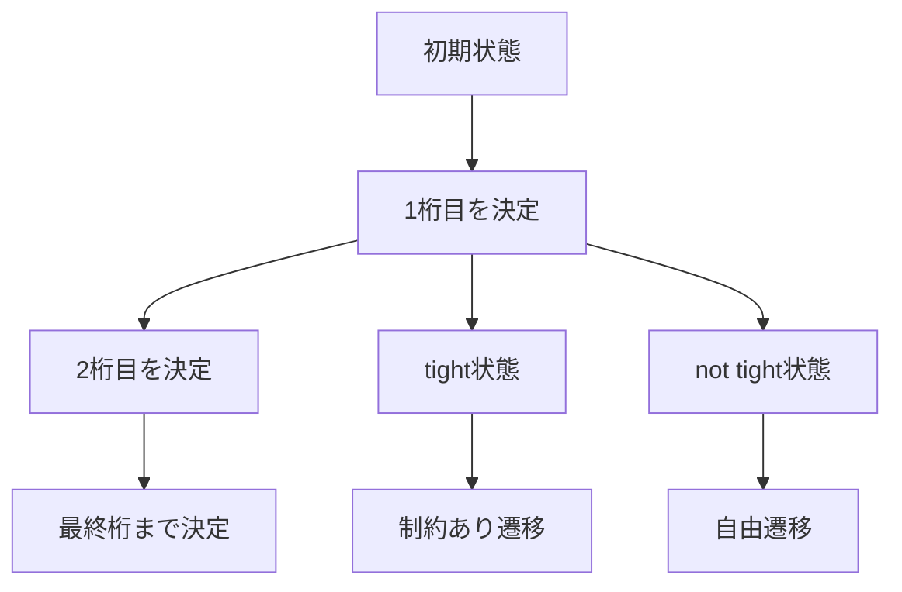
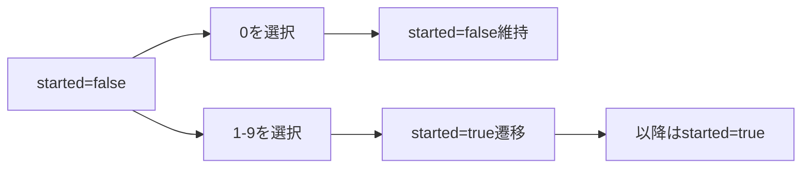
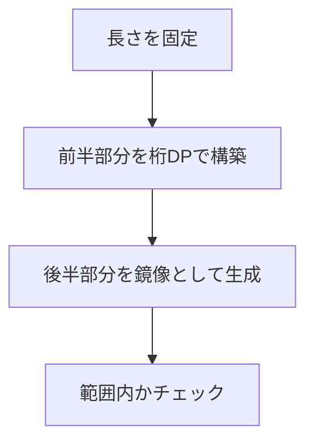

# 桁DP（Digit Dynamic Programming）

桁DPは、数値の各桁を順番に決定していく動的計画法の一種であり、主に「ある範囲内の数値のうち、特定の条件を満たすものの個数を数える」問題に対して適用される。この手法は、数値を文字列として扱い、上位桁から順番に決定していくことで、指数的な探索空間を多項式時間で処理可能にする。

## 桁DPの基本概念

桁DPの本質は、数値を桁ごとに分解して処理することにある。例えば、$0$から$N$までの整数のうち、ある条件を満たすものの個数を数える問題を考える。素朴なアプローチでは$O(N)$の計算量が必要となるが、$N$が$10^{18}$のような巨大な値の場合、この方法は現実的ではない。桁DPを用いることで、この問題を$O(\log N)$の桁数に比例する計算量で解くことができる。

桁DPの核心的なアイデアは、数値を上位桁から順番に構築していく過程で、「現在構築中の数値が上限値以下であることが確定しているか」という情報を状態として持つことである。この状態管理により、効率的な計算が可能となる。



## 状態の定義と遷移

桁DPにおける状態は、一般的に以下の要素から構成される：

1. **現在処理している桁の位置**（$pos$）：上位桁から何桁目を処理しているか
2. **tight制約**（$tight$）：これまでに構築した部分が上限値と一致しているか
3. **問題固有の状態**：例えば、これまでに出現した数字の集合、和、積など

tight制約は桁DPの最も重要な概念の一つである。$tight = true$の場合、次に選択できる数字は上限値の対応する桁以下に制限される。一方、$tight = false$の場合は、$0$から$9$までの任意の数字を選択できる。

状態遷移の一般的な形式は以下のように表現される：

$$dp[pos][tight][state] = \sum_{d=0}^{limit} dp[pos+1][tight \land (d = limit)][next\_state]$$

ここで、$limit$は$tight$が$true$の場合は上限値の$pos$桁目の数字、$false$の場合は$9$となる。

## Leading Zeroの扱い

多くの桁DP問題では、leading zero（先頭の0）の扱いが重要となる。例えば、「各桁の数字がすべて異なる数の個数を数える」問題を考える。この場合、$007$と$7$を区別する必要がある。

leading zeroを適切に扱うため、追加の状態変数$started$を導入する。この変数は、「意味のある数字が既に始まっているか」を表す。



leading zeroの処理により、状態空間は以下のように拡張される：

$$dp[pos][tight][started][state]$$

遷移においては、$started = false$かつ選択した数字が$0$の場合、次の状態でも$started = false$を維持する。それ以外の場合は$started = true$となる。

## 実装の詳細

桁DPの実装では、メモ化再帰を用いることが一般的である。以下に、基本的な実装パターンを示す：

```cpp
long long solve(int pos, bool tight, bool started, State state) {
    // Base case: all digits processed
    if (pos == n) {
        return checkCondition(state) ? 1 : 0;
    }
    
    // Memoization check
    if (!tight && started && memo[pos][state] != -1) {
        return memo[pos][state];
    }
    
    int limit = tight ? digits[pos] : 9;
    long long result = 0;
    
    for (int d = 0; d <= limit; d++) {
        if (!started && d == 0) {
            // Leading zero case
            result += solve(pos + 1, tight && (d == limit), false, state);
        } else {
            // Normal transition
            State newState = updateState(state, d);
            result += solve(pos + 1, tight && (d == limit), true, newState);
        }
    }
    
    if (!tight && started) {
        memo[pos][state] = result;
    }
    
    return result;
}
```

メモ化において重要な点は、$tight = true$の場合はメモ化しないことである。これは、tight制約下での値は入力に依存するため、再利用できないからである。

## 計算量分析

桁DPの計算量は、状態数と各状態での遷移数の積で決まる。一般的な桁DP問題では：

- 桁数：$O(\log N)$
- tight状態：$O(1)$（booleanのため）
- 問題固有の状態：$O(S)$（問題依存）
- 各状態での遷移：$O(10)$（0-9の数字）

したがって、全体の計算量は$O(10 \cdot \log N \cdot S)$となる。$S$が多項式オーダーであれば、全体として多項式時間で解くことができる。

メモリ使用量については、tight制約がtrueの場合はメモ化しないため、実際に保存する状態数は$O(\log N \cdot S)$となる。

## 高度な最適化技法

桁DPの実装において、いくつかの最適化技法が存在する：

### 1. 状態圧縮

問題固有の状態が集合を表す場合、ビットマスクを用いて状態を圧縮できる。例えば、「使用した数字の集合」を管理する場合、10ビットのビットマスクで表現可能である。

### 2. 前計算による高速化

頻繁に使用する値や、状態遷移で必要な計算結果を前計算しておくことで、実行時間を短縮できる。

### 3. 不要な状態の削減

問題の性質を分析し、到達不可能な状態や、答えに寄与しない状態を事前に除外することで、探索空間を削減できる。

## 典型的な問題パターン

桁DPが適用される典型的な問題パターンを分析すると、以下のような分類が可能である：

### 1. 条件を満たす数の個数計算

最も基本的なパターンであり、「$L$以上$R$以下の整数のうち、条件$C$を満たすものの個数」を求める問題である。この場合、$[0, R]$と$[0, L-1]$の範囲でそれぞれ桁DPを実行し、その差を取る。

### 2. 和・積の計算

条件を満たす数の和や積を求める問題では、状態に「現在までの和」や「積の剰余」を含める必要がある。

### 3. 最大値・最小値問題

条件を満たす数の中での最大値や最小値を求める場合、貪欲法的なアプローチと組み合わせることが多い。

## 実装上の注意点

桁DPの実装において、よくある誤りとその対策を述べる：

### 1. オーバーフロー対策

個数や和を計算する際、結果が64ビット整数の範囲を超える可能性がある。適切にmodulo演算を適用するか、多倍長整数を使用する必要がある。

### 2. 境界条件の処理

$L = 0$の場合や、leading zeroを含む場合の処理は特に注意が必要である。edge caseを丁寧に処理することが重要である。

### 3. メモ化の初期化

メモ化配列の初期化を忘れると、誤った結果を返す可能性がある。テストケースごとに適切に初期化することが必要である。

## 変種と拡張

桁DPの基本的な枠組みは、様々な方向に拡張可能である：

### 1. 多次元への拡張

2つ以上の数値を同時に扱う問題では、それぞれの数値に対してtight制約を管理する必要がある。状態空間は指数的に増大するが、基本的な考え方は同じである。

### 2. 異なる基数への適用

10進数以外の基数（2進数、16進数など）に対しても、桁DPは同様に適用できる。遷移で考慮する数字の範囲を変更するだけで対応可能である。

### 3. 文字列への応用

数値だけでなく、辞書順で特定の範囲にある文字列の個数を数える問題にも、桁DPの考え方を適用できる。

## 実践的な設計指針

桁DPを用いた問題解決において、以下の設計指針が有用である：

### 1. 状態設計の原則

状態は必要最小限に留めることが重要である。不必要に詳細な情報を状態に含めると、計算量とメモリ使用量が増大する。問題の本質を見極め、真に必要な情報のみを状態として管理する。

### 2. デバッグ戦略

桁DPのデバッグは複雑になりがちである。小さな入力での手計算結果と照合する、各状態での遷移を可視化する、といった手法が有効である。

### 3. テストケースの設計

境界値（$L = 0$、$L = R$、1桁の数など）、典型的なケース、大規模なケースを網羅的にテストすることが重要である。

## 具体的な問題例による理解の深化

桁DPの理解を深めるため、いくつかの具体的な問題を詳細に分析する。

### 例1：桁和が特定の値の倍数となる数の個数

$0$から$N$までの整数のうち、各桁の和が$K$の倍数となるものの個数を求める問題を考える。この問題では、状態として「現在の桁和を$K$で割った余り」を管理する必要がある。

状態定義：$dp[pos][tight][sum\bmod K]$

ここで、$sum$は現在までに決定した桁の和である。遷移は以下のようになる：

```cpp
for (int d = 0; d <= limit; d++) {
    int newSum = (sum + d) % K;
    result += solve(pos + 1, tight && (d == limit), newSum);
}
```

この問題の計算量は$O(10 \cdot \log N \cdot K)$となり、$K$が小さい定数であれば効率的に解ける。

### 例2：隣接する桁の差が1以下の数（Stepping Numbers）

隣接する任意の2桁の差の絶対値が1以下である数をStepping Numbersと呼ぶ。例えば、123、321、101はStepping Numbersだが、130は違う（3と0の差が3）。

この問題では、状態として「前の桁の数字」を管理する必要がある：

状態定義：$dp[pos][tight][prev][started]$

遷移において、$started = true$の場合は$|d - prev| \leq 1$を満たす$d$のみを選択できる。

```cpp
for (int d = 0; d <= limit; d++) {
    if (started && abs(d - prev) > 1) continue;
    // Transition
}
```

### 例3：回文数の個数

$L$以上$R$以下の回文数の個数を求める問題は、桁DPの応用として興味深い。回文数の判定には全体の構造を知る必要があるため、通常の桁DPとは異なるアプローチが必要となる。

一つの方法は、数の長さを固定して、前半部分のみを桁DPで構築することである。長さ$len$の回文数に対して、前半の$(len + 1) / 2$桁を決定すれば、後半は自動的に決まる。



## 実装の詳細な解説

桁DPの実装において、細かい部分での工夫が全体の正確性と効率性に大きく影響する。

### メモリ管理の最適化

メモ化配列のサイズは問題によって大きく異なる。例えば、「使用した数字の集合」を状態として持つ場合、$2^{10} = 1024$の状態が必要となる。動的配列やmapを使用することで、実際に訪れる状態のみをメモ化する方法もある：

```cpp
map<tuple<int, int, int>, long long> memo;
```

ただし、mapのアクセスは$O(\log n)$のオーバーヘッドがあるため、状態数が予測可能な場合は固定サイズの配列の方が高速である。

### 数値の前処理

入力された数値$N$を桁ごとの配列に変換する際の実装も重要である：

```cpp
vector<int> digits;
while (N > 0) {
    digits.push_back(N % 10);
    N /= 10;
}
reverse(digits.begin(), digits.end());
```

この前処理により、上位桁から順にアクセスできるようになる。

### 範囲クエリの処理

$[L, R]$の範囲での個数を求める場合、$count(R) - count(L-1)$として計算することが一般的だが、$L = 0$の場合の処理には注意が必要である。また、$L$自体が条件を満たすかどうかの確認も忘れてはならない。

## 計算量の詳細な分析

桁DPの計算量を正確に見積もることは、実装の実行可能性を判断する上で重要である。

### 時間計算量の構成要素

1. **基本的な状態数**：$O(\log N)$（桁数）
2. **tight制約**：実質的に定数倍の影響
3. **問題固有の状態**：問題により大きく異なる
4. **各状態での遷移数**：通常$O(10)$だが、制約により減少する場合もある

例えば、「桁積が$P$の約数となる数」を数える問題では、状態として「現在の桁積」を持つ必要があるが、$P$の約数の個数を$d(P)$とすると、状態数は$O(\log N \cdot d(P))$となる。

### 空間計算量の考察

メモ化に必要な空間は、訪れる可能性のある状態数に依存する。tight制約が$true$の状態はメモ化しないため、実際のメモリ使用量は理論的な状態数より少なくなることが多い。

また、再帰の深さは最大で桁数となるため、スタックオーバーフローの心配は通常ない。

## 発展的なテクニック

桁DPをさらに効果的に活用するための発展的なテクニックを紹介する。

### 1. 双方向からの構築

特定の条件（例：回文性）を満たす数を構築する場合、両端から同時に構築していく方法が有効な場合がある。この場合、状態管理はより複雑になるが、探索空間を大幅に削減できる。

### 2. 確率的桁DP

「ランダムに選んだ$N$桁の数が条件を満たす確率」のような問題では、桁DPを確率計算に拡張できる。各遷移に確率を付与し、期待値を計算する。

### 3. 桁DPとグラフ理論の融合

桁の遷移をグラフとして捉え、最短経路問題や到達可能性問題として定式化することも可能である。これにより、より複雑な制約を扱えるようになる。

## よくある実装ミスとその対策

桁DPの実装で頻繁に発生するミスとその対策を体系的にまとめる。

### 1. メモ化の条件ミス

最も多いミスは、tight制約が$true$の状態をメモ化してしまうことである。これにより、異なる入力に対して誤った結果を返す可能性がある。

対策：メモ化の条件を明確にし、コメントで意図を記述する。

### 2. Leading Zeroの処理漏れ

Leading zeroの扱いを忘れると、短い桁数の数が正しくカウントされない。

対策：問題文を注意深く読み、数の表現方法を確認する。テストケースに1桁の数を含める。

### 3. オーバーフローの見落とし

組み合わせ的な問題では、中間結果が非常に大きくなることがある。

対策：最悪ケースでの値の大きさを見積もり、必要に応じてmodulo演算や多倍長整数を使用する。

## 競技プログラミングにおける戦略

競技プログラミングのコンテストで桁DPを効果的に使用するための戦略を述べる。

### 問題の識別

桁DPが適用可能な問題の特徴：
- 数値の範囲が非常に大きい（$10^{18}$など）
- 「条件を満たす数の個数」を問う
- 数値の各桁に関する条件がある

### 実装の効率化

コンテスト中の限られた時間で正確に実装するため：
- テンプレート化された基本構造を準備
- デバッグ用の出力を組み込む
- 小さいケースでの動作確認を徹底

### 時間配分

桁DPの問題は実装が複雑になりがちなため、十分な時間を確保する必要がある。問題の難易度を正しく見積もり、他の問題とのバランスを考慮する。

桁DPは、一見複雑に見える数値に関する計数問題を、体系的かつ効率的に解決する強力な手法である。その本質は、数値を桁ごとに分解し、上位桁から順番に決定していく過程で適切な状態管理を行うことにある。tight制約とleading zeroの扱いを正しく理解し、問題に応じた状態設計を行うことで、幅広い問題に適用可能である。実装においては、メモ化による効率化と、境界条件の丁寧な処理が成功の鍵となる。

理論的な理解と実装技術の両方を身につけることで、桁DPは競技プログラミングにおける強力な武器となる。様々な問題に取り組み、パターンを認識する能力を養うことが、桁DPマスターへの道である。