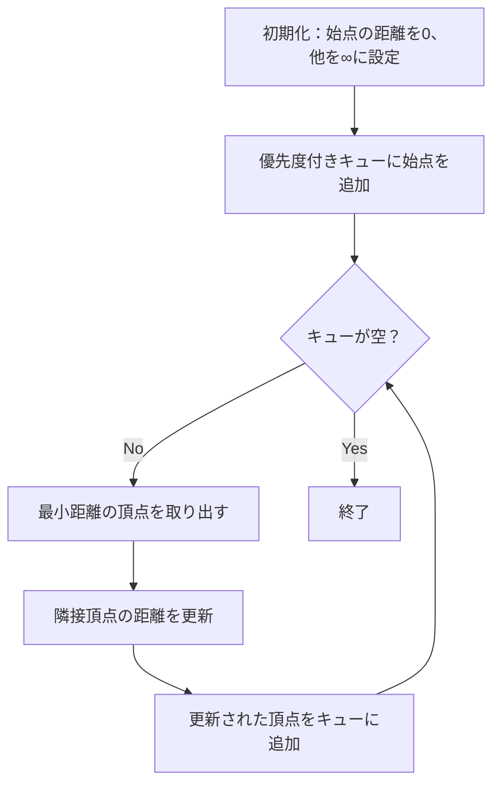
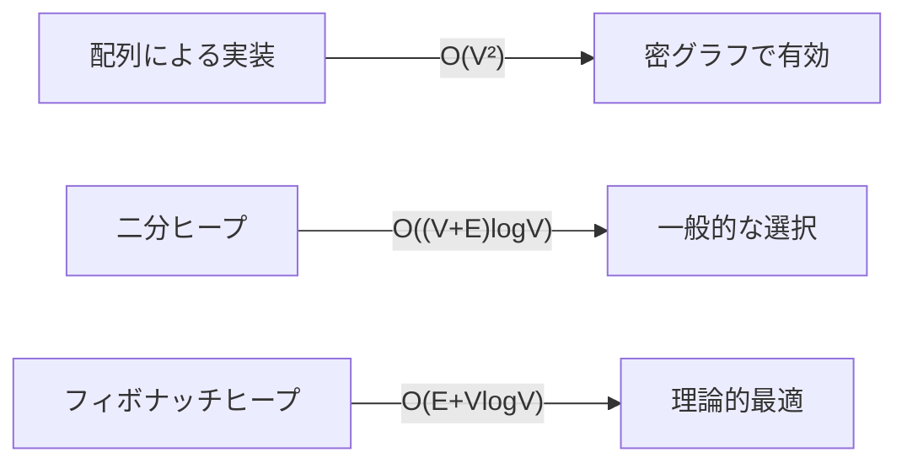

# ダイクストラ法

ダイクストラ法は、グラフ理論における単一始点最短経路問題を解く基本的なアルゴリズムです。1959年にエドガー・ダイクストラによって考案されたこのアルゴリズムは、非負の重みを持つ辺で構成されたグラフにおいて、ある頂点から他のすべての頂点への最短経路を効率的に求めることができます。競技プログラミングにおいては、最短経路問題の標準的な解法として頻繁に登場し、その理解と実装能力は必須とされています。

## アルゴリズムの基本原理

ダイクストラ法の核心は、グラフの探索において常に「現時点で最も近い未訪問頂点」を選択し続けるという貪欲法的アプローチにあります。始点からの距離が確定した頂点の集合を徐々に拡大していき、最終的にすべての到達可能な頂点への最短距離を決定します。



アルゴリズムの動作原理は、以下の不変条件に基づいています。各時点において、すでに処理済みの頂点への最短距離は確定しており、未処理の頂点への暫定的な最短距離は、処理済み頂点を経由する経路の中で最小のものとなっています。この性質により、次に処理する頂点として暫定距離が最小のものを選ぶことで、その頂点への最短距離を確定できるのです。

## 数学的正当性

ダイクストラ法の正当性は、数学的帰納法によって証明できます。まず、始点の最短距離が0であることは自明です。次に、k個の頂点の最短距離が正しく求められているとき、(k+1)番目に選ばれる頂点vの最短距離も正しいことを示します。

頂点vが選ばれた時点で、その暫定距離をd[v]とします。もしd[v]が真の最短距離でないとすると、始点からvへのより短い経路が存在することになります。この経路は必ず未処理の頂点を通るはずですが、辺の重みが非負であることから、その頂点の暫定距離はd[v]以下でなければなりません。これは、vが最小の暫定距離を持つ頂点として選ばれたことと矛盾します。

$$
\text{Let } d[v] \text{ be the tentative distance to vertex } v \\
\text{Assume } \exists \text{ path } P: s \rightarrow v \text{ with } \text{length}(P) < d[v] \\
\text{Let } u \text{ be the first unprocessed vertex on } P \\
\Rightarrow d[u] \leq \text{length}(s \rightarrow u) < \text{length}(P) < d[v] \\
\text{Contradiction: } v \text{ was chosen as the minimum}
$$

## 実装の詳細

ダイクストラ法の効率的な実装には、優先度付きキューが不可欠です。C++のstd::priority_queueや、より高機能なstd::setを使用することで、最小距離の頂点を対数時間で取得できます。

```cpp
// Priority queue implementation using std::priority_queue
#include <vector>
#include <queue>
#include <limits>

const long long INF = 1e18;

struct Edge {
    int to;
    long long weight;
};

std::vector<long long> dijkstra(int n, int start, 
                                const std::vector<std::vector<Edge>>& graph) {
    std::vector<long long> dist(n, INF);
    std::priority_queue<std::pair<long long, int>, 
                       std::vector<std::pair<long long, int>>,
                       std::greater<std::pair<long long, int>>> pq;
    
    dist[start] = 0;
    pq.push({0, start});
    
    while (!pq.empty()) {
        auto [d, v] = pq.top();
        pq.pop();
        
        // Skip if already processed with a better distance
        if (d > dist[v]) continue;
        
        for (const auto& edge : graph[v]) {
            if (dist[v] + edge.weight < dist[edge.to]) {
                dist[edge.to] = dist[v] + edge.weight;
                pq.push({dist[edge.to], edge.to});
            }
        }
    }
    
    return dist;
}
```

実装上の重要な注意点として、同じ頂点が複数回キューに入る可能性があることが挙げられます。頂点を取り出した際に、その暫定距離が現在の最短距離より大きい場合は、その更新は無視する必要があります。この処理を怠ると、同じ頂点を複数回処理してしまい、計算量が悪化する可能性があります。

## 計算量の分析

ダイクストラ法の時間計算量は、使用するデータ構造に大きく依存します。優先度付きキューを二分ヒープで実装した場合、各頂点の取り出しにO(log V)、各辺の緩和操作でのキューへの挿入にO(log V)の時間がかかります。最悪の場合、すべての辺で緩和が発生するため、全体の時間計算量はO((V + E) log V)となります。



空間計算量については、距離配列でO(V)、優先度付きキューで最悪O(E)（すべての辺で緩和が発生した場合）、グラフの隣接リスト表現でO(V + E)となり、全体でO(V + E)の空間を使用します。

## 負の重みを持つ辺への対応

ダイクストラ法の重要な制約は、すべての辺の重みが非負でなければならないという点です。負の重みを持つ辺が存在する場合、アルゴリズムの基本的な仮定が崩れ、正しい結果を得ることができません。

負の重みを持つ辺が存在するグラフでは、ベルマン・フォード法やSPFA（Shortest Path Faster Algorithm）を使用する必要があります。これらのアルゴリズムは、負の重みに対応できる代わりに、時間計算量がO(VE)と大きくなります。

```cpp
// Bellman-Ford algorithm for graphs with negative weights
std::vector<long long> bellmanFord(int n, int start,
                                  const std::vector<std::tuple<int, int, long long>>& edges) {
    std::vector<long long> dist(n, INF);
    dist[start] = 0;
    
    // Relax all edges V-1 times
    for (int i = 0; i < n - 1; ++i) {
        for (const auto& [u, v, w] : edges) {
            if (dist[u] != INF && dist[u] + w < dist[v]) {
                dist[v] = dist[u] + w;
            }
        }
    }
    
    // Check for negative cycles
    for (const auto& [u, v, w] : edges) {
        if (dist[u] != INF && dist[u] + w < dist[v]) {
            // Negative cycle detected
            return {};
        }
    }
    
    return dist;
}
```

## 高速化テクニック

競技プログラミングにおいては、ダイクストラ法の定数倍の高速化が重要になることがあります。以下にいくつかの実践的なテクニックを示します。

双方向ダイクストラ法は、始点と終点の両方から同時に探索を行うことで、探索空間を大幅に削減できます。両方向からの探索が出会った時点で、最短経路が見つかります。この手法は、特に大規模なグラフで始点と終点が離れている場合に有効です。

```cpp
// Bidirectional Dijkstra implementation
long long bidirectionalDijkstra(int n, int start, int goal,
                               const std::vector<std::vector<Edge>>& graph,
                               const std::vector<std::vector<Edge>>& revGraph) {
    std::vector<long long> distF(n, INF), distB(n, INF);
    std::priority_queue<std::pair<long long, int>,
                       std::vector<std::pair<long long, int>>,
                       std::greater<>> pqF, pqB;
    
    distF[start] = 0;
    distB[goal] = 0;
    pqF.push({0, start});
    pqB.push({0, goal});
    
    long long minDist = INF;
    
    while (!pqF.empty() || !pqB.empty()) {
        // Forward search
        if (!pqF.empty()) {
            auto [d, v] = pqF.top();
            pqF.pop();
            
            if (d > distF[v]) continue;
            
            // Check if meeting point
            if (distB[v] != INF) {
                minDist = std::min(minDist, distF[v] + distB[v]);
            }
            
            for (const auto& edge : graph[v]) {
                if (distF[v] + edge.weight < distF[edge.to]) {
                    distF[edge.to] = distF[v] + edge.weight;
                    pqF.push({distF[edge.to], edge.to});
                }
            }
        }
        
        // Backward search (similar structure)
        // ...
    }
    
    return minDist;
}
```

A*アルゴリズムは、ダイクストラ法に推定関数（ヒューリスティック）を加えた拡張版です。目的地までの推定距離を利用することで、探索の方向性を持たせ、無駄な探索を減らすことができます。グリッド上の最短経路問題では、マンハッタン距離やユークリッド距離を推定関数として使用することが一般的です。

## メモリ効率の改善

大規模なグラフを扱う際には、メモリ使用量も重要な考慮事項となります。隣接リスト表現の代わりに、辺のリストを直接保持し、各頂点の辺の開始インデックスのみを記録する方法があります。これにより、メモリの連続性が向上し、キャッシュ効率も改善されます。

```cpp
// Memory-efficient graph representation
struct CompactGraph {
    std::vector<int> head;     // Starting index for each vertex
    std::vector<int> to;       // Destination vertices
    std::vector<long long> weight;  // Edge weights
    
    CompactGraph(int n, const std::vector<std::tuple<int, int, long long>>& edges) 
        : head(n + 1) {
        // Count edges for each vertex
        for (const auto& [u, v, w] : edges) {
            head[u + 1]++;
        }
        
        // Compute cumulative sum
        for (int i = 1; i <= n; ++i) {
            head[i] += head[i - 1];
        }
        
        to.resize(edges.size());
        weight.resize(edges.size());
        
        // Fill edge arrays
        std::vector<int> ptr = head;
        for (const auto& [u, v, w] : edges) {
            to[ptr[u]] = v;
            weight[ptr[u]] = w;
            ptr[u]++;
        }
    }
};
```

## 経路復元

最短距離だけでなく、実際の最短経路を求める必要がある場合は、各頂点への最短経路における直前の頂点を記録します。これにより、終点から始点に向かって経路を逆順にたどることができます。

```cpp
struct DijkstraWithPath {
    std::vector<long long> dist;
    std::vector<int> prev;
    
    DijkstraWithPath(int n, int start, const std::vector<std::vector<Edge>>& graph) 
        : dist(n, INF), prev(n, -1) {
        std::priority_queue<std::pair<long long, int>,
                           std::vector<std::pair<long long, int>>,
                           std::greater<>> pq;
        
        dist[start] = 0;
        pq.push({0, start});
        
        while (!pq.empty()) {
            auto [d, v] = pq.top();
            pq.pop();
            
            if (d > dist[v]) continue;
            
            for (const auto& edge : graph[v]) {
                if (dist[v] + edge.weight < dist[edge.to]) {
                    dist[edge.to] = dist[v] + edge.weight;
                    prev[edge.to] = v;
                    pq.push({dist[edge.to], edge.to});
                }
            }
        }
    }
    
    std::vector<int> getPath(int goal) {
        if (dist[goal] == INF) return {};
        
        std::vector<int> path;
        for (int v = goal; v != -1; v = prev[v]) {
            path.push_back(v);
        }
        std::reverse(path.begin(), path.end());
        return path;
    }
};
```

## 拡張と応用

ダイクストラ法は、様々な問題に応用できる柔軟なアルゴリズムです。例えば、k番目最短経路問題では、各頂点についてk個の最短距離を管理することで解決できます。また、制約付き最短経路問題では、状態を拡張して（頂点、制約の状態）の組に対してダイクストラ法を適用します。

```cpp
// K-shortest paths using modified Dijkstra
std::vector<std::vector<long long>> kShortestPaths(int n, int start, int k,
                                                   const std::vector<std::vector<Edge>>& graph) {
    std::vector<std::vector<long long>> dist(n, std::vector<long long>(k, INF));
    std::priority_queue<std::pair<long long, int>,
                       std::vector<std::pair<long long, int>>,
                       std::greater<>> pq;
    
    dist[start][0] = 0;
    pq.push({0, start});
    
    while (!pq.empty()) {
        auto [d, v] = pq.top();
        pq.pop();
        
        // Find which k-th distance this is
        int idx = std::lower_bound(dist[v].begin(), dist[v].end(), d) - dist[v].begin();
        if (idx >= k || dist[v][idx] != d) continue;
        
        for (const auto& edge : graph[v]) {
            long long newDist = d + edge.weight;
            
            // Try to insert newDist into dist[edge.to]
            if (newDist < dist[edge.to][k - 1]) {
                dist[edge.to][k - 1] = newDist;
                std::sort(dist[edge.to].begin(), dist[edge.to].end());
                pq.push({newDist, edge.to});
            }
        }
    }
    
    return dist;
}
```

グラフが動的に変化する場合、完全に再計算するのではなく、変更の影響を受ける部分のみを更新する動的ダイクストラ法が研究されています。これは、リアルタイムシステムや大規模ネットワークのルーティングにおいて重要な技術です。

## 実装上の注意点

競技プログラミングにおいてダイクストラ法を実装する際の典型的な落とし穴について説明します。まず、整数オーバーフローへの対処が必要です。辺の重みが大きい場合、距離の合計が32ビット整数の範囲を超える可能性があるため、64ビット整数を使用することが推奨されます。

優先度付きキューの実装選択も重要です。C++のstd::priority_queueは最大ヒープがデフォルトであるため、std::greaterを指定して最小ヒープにする必要があります。また、std::setを使用する実装では、同じ頂点の古い情報を削除できるため、メモリ効率が向上しますが、定数倍が大きくなる傾向があります。

```cpp
// Implementation using std::set for better memory efficiency
std::vector<long long> dijkstraWithSet(int n, int start,
                                       const std::vector<std::vector<Edge>>& graph) {
    std::vector<long long> dist(n, INF);
    std::set<std::pair<long long, int>> st;
    
    dist[start] = 0;
    st.insert({0, start});
    
    while (!st.empty()) {
        auto [d, v] = *st.begin();
        st.erase(st.begin());
        
        for (const auto& edge : graph[v]) {
            if (dist[v] + edge.weight < dist[edge.to]) {
                // Remove old entry if exists
                st.erase({dist[edge.to], edge.to});
                
                dist[edge.to] = dist[v] + edge.weight;
                st.insert({dist[edge.to], edge.to});
            }
        }
    }
    
    return dist;
}
```

## パフォーマンスチューニング

実際の競技プログラミングでは、制限時間内に処理を完了させるため、様々な最適化が必要になることがあります。キャッシュ効率を考慮したデータ構造の配置、不要な処理の削減、コンパイラ最適化の活用などが重要です。

頂点番号の付け替えによって、メモリアクセスパターンを改善できる場合があります。例えば、BFSで到達順に頂点番号を付け直すことで、隣接頂点へのアクセスの局所性が向上し、キャッシュミスを減らすことができます。

## 他のアルゴリズムとの比較

最短経路問題を解くアルゴリズムは、ダイクストラ法以外にも多数存在します。それぞれの特徴と適用場面を理解することで、問題に応じて適切なアルゴリズムを選択できます。

幅優先探索（BFS）は、すべての辺の重みが等しい場合に使用できる最も単純なアルゴリズムです。時間計算量O(V + E)で動作し、実装も簡潔です。01-BFSは、辺の重みが0または1の場合に使用でき、デックを使った実装でO(V + E)の時間計算量を実現します。

```cpp
// 01-BFS implementation
std::vector<int> zeroOneBFS(int n, int start,
                            const std::vector<std::vector<std::pair<int, int>>>& graph) {
    std::vector<int> dist(n, INF);
    std::deque<int> dq;
    
    dist[start] = 0;
    dq.push_back(start);
    
    while (!dq.empty()) {
        int v = dq.front();
        dq.pop_front();
        
        for (const auto& [to, weight] : graph[v]) {
            if (dist[v] + weight < dist[to]) {
                dist[to] = dist[v] + weight;
                if (weight == 0) {
                    dq.push_front(to);
                } else {
                    dq.push_back(to);
                }
            }
        }
    }
    
    return dist;
}
```

ワーシャル・フロイド法は、すべての頂点対間の最短距離を求めるアルゴリズムです。時間計算量はO(V³)と大きいですが、実装が単純で、負の重みにも対応できます。頂点数が小さい場合や、すべての頂点対の最短距離が必要な場合に適しています。

## 実践的な問題への適用

競技プログラミングでは、ダイクストラ法を直接適用するだけでなく、問題を適切にモデル化してグラフに変換する能力が重要です。状態をグラフの頂点として表現し、状態遷移を辺として表現することで、様々な最適化問題を最短経路問題に帰着できます。

例えば、グリッド上の経路探索問題では、各マスを頂点とし、移動可能な隣接マスへの辺を張ります。移動にコストがある場合は、そのコストを辺の重みとします。障害物や特殊な制約がある場合は、グラフの構築時にそれらを考慮します。

```cpp
// Grid shortest path with obstacles
struct GridDijkstra {
    static constexpr int dx[] = {0, 1, 0, -1};
    static constexpr int dy[] = {1, 0, -1, 0};
    
    int H, W;
    std::vector<std::string> grid;
    
    int encode(int x, int y) { return x * W + y; }
    std::pair<int, int> decode(int v) { return {v / W, v % W}; }
    
    std::vector<long long> solve(int sx, int sy) {
        int n = H * W;
        std::vector<std::vector<Edge>> graph(n);
        
        // Build graph from grid
        for (int x = 0; x < H; ++x) {
            for (int y = 0; y < W; ++y) {
                if (grid[x][y] == '#') continue;  // Obstacle
                
                for (int d = 0; d < 4; ++d) {
                    int nx = x + dx[d];
                    int ny = y + dy[d];
                    
                    if (nx >= 0 && nx < H && ny >= 0 && ny < W && grid[nx][ny] != '#') {
                        int cost = 1;  // Can be modified based on terrain
                        graph[encode(x, y)].push_back({encode(nx, ny), cost});
                    }
                }
            }
        }
        
        return dijkstra(n, encode(sx, sy), graph);
    }
};
```

## デバッグとテスト

ダイクストラ法の実装をデバッグする際は、小さなテストケースから始めることが重要です。手で追跡可能なサイズのグラフで、各ステップでの距離の更新を確認します。また、特殊なケースとして、始点から到達不可能な頂点、自己ループ、重複辺などを含むグラフでのテストも必要です。

パフォーマンステストでは、最悪ケースを意識的に構築することが重要です。例えば、完全グラフや、すべての辺で緩和が発生するようなグラフを生成してテストします。また、メモリ使用量の確認も忘れずに行い、大規模なグラフでもメモリ不足にならないことを確認します。

## 並列化とGPU実装

現代のコンピュータアーキテクチャを活用するため、ダイクストラ法の並列化も研究されています。基本的なアルゴリズムは逐次的な性質を持つため、完全な並列化は困難ですが、複数の頂点を同時に処理するΔ-steppingアルゴリズムなどが提案されています。

GPUを使用した実装では、大量の頂点の距離更新を並列に行うことで高速化を図ります。ただし、優先度付きキューの並列実装が課題となるため、バケットベースのアプローチが使用されることが多いです。

ダイクストラ法は、その単純さと効率性から、グラフアルゴリズムの中でも特に重要な位置を占めています。競技プログラミングにおいては、基本的な実装を確実にマスターした上で、問題に応じた適切な拡張や最適化を行う能力が求められます。アルゴリズムの本質的な理解と、実装上の細かな注意点の両方を押さえることで、様々な最短経路問題に対応できるようになります。