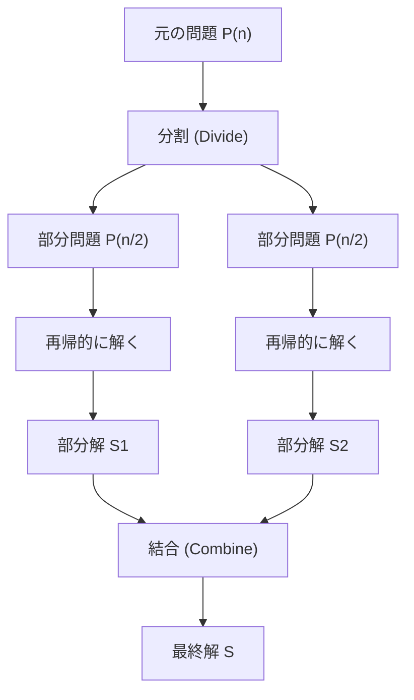
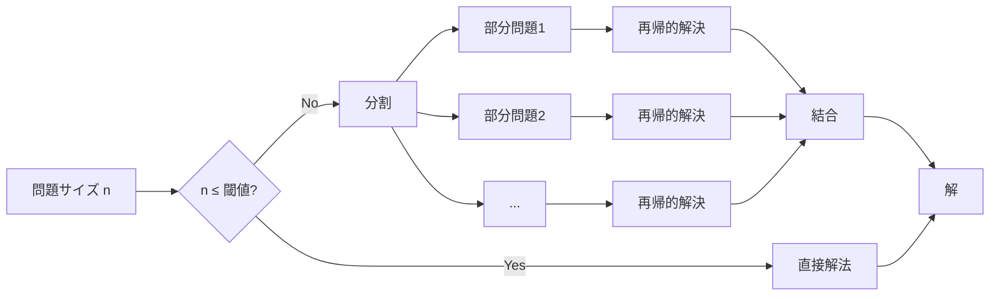
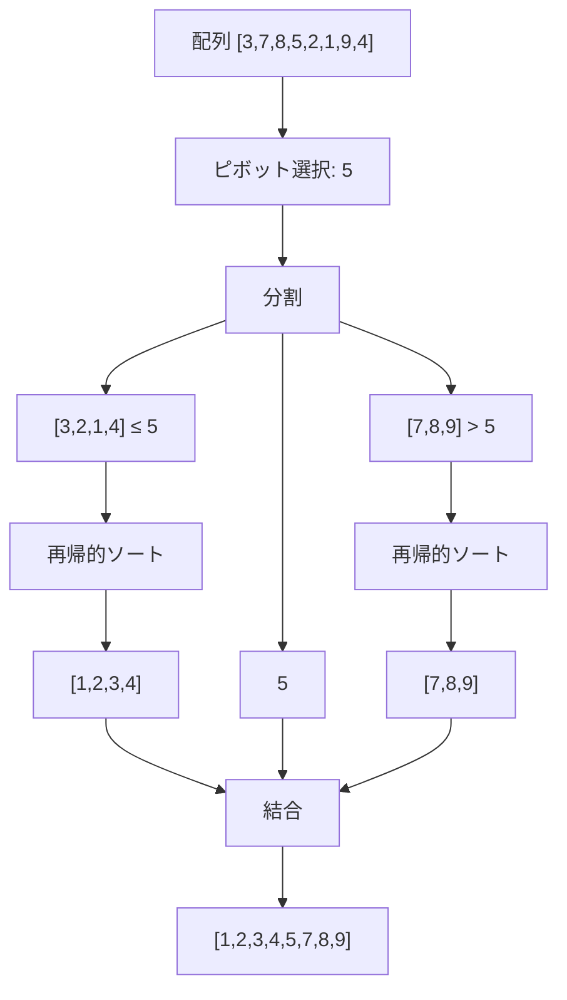
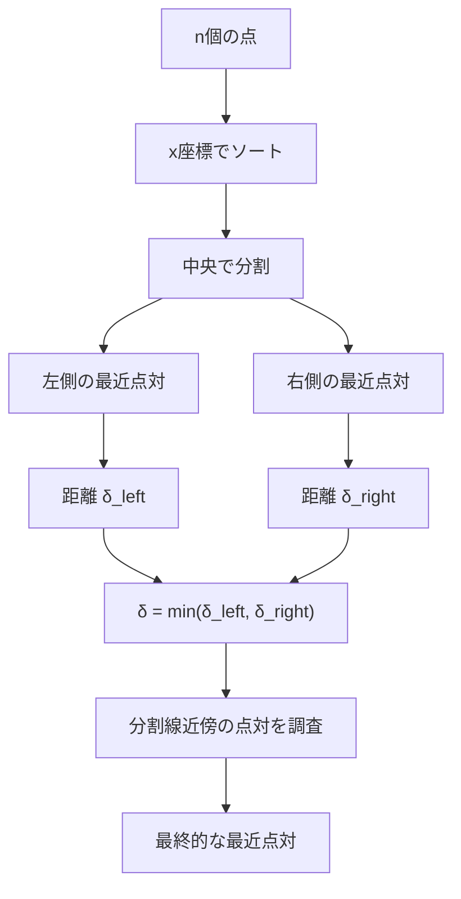

# 分割統治法

分割統治法（Divide and Conquer）は、コンピュータサイエンスにおける最も基本的かつ強力なアルゴリズム設計技法の一つである。複雑な問題を同じ構造を持つより小さな部分問題に分割し、それらを再帰的に解いた後、得られた部分解を組み合わせて元の問題の解を構成するという手法である。この技法は、紀元前のユークリッドの互除法から現代の並列アルゴリズムに至るまで、幅広い問題解決において中心的な役割を果たしている。

分割統治法の本質は、問題の再帰的な構造を認識し、それを活用することにある。大規模な入力に対する問題を直接解くことが困難な場合でも、問題をより小さな部分に分割することで、各部分問題は元の問題よりも容易に解けるようになる。この「分割」「統治」「結合」という3つのステップを通じて、見かけ上複雑な問題を系統的に解決することが可能となる。



## 数学的基礎と計算量解析

分割統治法のアルゴリズムの実行時間は、一般に再帰関係式として表現される。最も一般的な形式は以下のマスター定理（Master Theorem）で解析される再帰式である：

$$T(n) = aT(n/b) + f(n)$$

ここで、$a \geq 1$ は部分問題の個数、$b > 1$ は各部分問題のサイズの縮小率、$f(n)$ は分割と結合に必要な時間を表す。マスター定理は、$f(n)$ と $n^{\log_b a}$ の漸近的な関係に基づいて、$T(n)$ の漸近的な振る舞いを決定する¹。

マスター定理には3つの主要なケースが存在する。第一のケースは $f(n) = O(n^{\log_b a - \epsilon})$ （ある正の定数 $\epsilon$ に対して）の場合で、このとき $T(n) = \Theta(n^{\log_b a})$ となる。第二のケースは $f(n) = \Theta(n^{\log_b a})$ の場合で、$T(n) = \Theta(n^{\log_b a} \log n)$ となる。第三のケースは $f(n) = \Omega(n^{\log_b a + \epsilon})$ かつ正則性条件を満たす場合で、$T(n) = \Theta(f(n))$ となる。

これらの理論的な基礎は、アルゴリズムの効率性を事前に評価し、最適な分割戦略を選択する上で不可欠である。例えば、マージソートの場合、$a = 2$、$b = 2$、$f(n) = \Theta(n)$ であり、$\log_b a = 1$ なので第二のケースに該当し、$T(n) = \Theta(n \log n)$ という時間計算量が導かれる。

## 分割統治法の設計原理

分割統治法を適用する際の設計原理には、いくつかの重要な考慮事項がある。まず、問題の分割方法が決定的に重要である。理想的には、各部分問題のサイズがほぼ等しくなるように分割すべきである。不均等な分割は、最悪の場合、アルゴリズムの効率を大幅に低下させる可能性がある。クイックソートにおけるピボット選択の問題は、この原理の重要性を如実に示している。

次に、基底条件（base case）の適切な設定が必要である。再帰の深さが過度に深くなることを防ぎ、また小さな入力に対しては単純な直接的な解法の方が効率的である場合が多い。実際の実装では、入力サイズがある閾値以下になった時点で、挿入ソートのような単純なアルゴリズムに切り替えることがよく行われる。



結合ステップの効率性も重要な設計要素である。部分解を結合する際の計算量が過大になると、分割によって得られた利点が相殺されてしまう。理想的には、結合ステップは線形時間またはそれ以下で実行されるべきである。

## マージソート：分割統治法の典型例

マージソートは分割統治法の最も純粋な実装例の一つである。配列を二つの等しい部分に分割し、それぞれを再帰的にソートした後、二つのソート済み部分配列をマージして全体のソート済み配列を生成する。

```python
def merge_sort(arr, left, right):
    if left >= right:
        return
    
    mid = (left + right) // 2
    
    # Divide: Recursively sort both halves
    merge_sort(arr, left, mid)
    merge_sort(arr, mid + 1, right)
    
    # Conquer: Merge the sorted halves
    merge(arr, left, mid, right)

def merge(arr, left, mid, right):
    # Create temporary arrays
    left_arr = arr[left:mid+1]
    right_arr = arr[mid+1:right+1]
    
    i = j = 0
    k = left
    
    # Merge process
    while i < len(left_arr) and j < len(right_arr):
        if left_arr[i] <= right_arr[j]:
            arr[k] = left_arr[i]
            i += 1
        else:
            arr[k] = right_arr[j]
            j += 1
        k += 1
    
    # Copy remaining elements
    while i < len(left_arr):
        arr[k] = left_arr[i]
        i += 1
        k += 1
    
    while j < len(right_arr):
        arr[k] = right_arr[j]
        j += 1
        k += 1
```

マージソートの重要な特性は、その安定性と予測可能な性能である。最悪の場合でも $O(n \log n)$ の時間計算量を保証し、安定ソート（同じ値の要素の相対的な順序を保持）である。しかし、$O(n)$ の追加メモリを必要とすることが欠点となる場合がある。

## クイックソート：実践的な分割統治

クイックソートは、実践において最も広く使用される分割統治アルゴリズムの一つである。ピボット要素を選択し、配列をピボット以下の要素とピボットより大きい要素に分割する。マージソートとは異なり、分割ステップで主要な作業が行われ、結合ステップは不要である。



クイックソートの性能は、ピボット選択戦略に大きく依存する。理想的には、ピボットは配列の中央値であるべきだが、これを効率的に見つけることは困難である。実践的なアプローチとして、ランダムピボット選択、三点の中央値（median-of-three）、あるいはイントロソート（Introsort）のようなハイブリッドアプローチが使用される²。

## 高速フーリエ変換：分割統治の数値計算への応用

高速フーリエ変換（FFT）は、分割統治法が数値計算に革命をもたらした例である。離散フーリエ変換（DFT）の計算を $O(n^2)$ から $O(n \log n)$ に削減することで、信号処理、画像処理、多項式乗算など幅広い応用を可能にした。

FFTの核心的なアイデアは、$n$ 点のDFTを2つの $n/2$ 点のDFTに分解することである。入力信号 $x[k]$ のDFTは以下のように定義される：

$$X[k] = \sum_{n=0}^{N-1} x[n] \cdot e^{-j2\pi kn/N}$$

Cooley-Tukeyアルゴリズムでは、偶数インデックスと奇数インデックスの要素を分離し、以下のように再帰的に計算する：

$$X[k] = X_{\text{even}}[k] + W_N^k \cdot X_{\text{odd}}[k]$$
$$X[k + N/2] = X_{\text{even}}[k] - W_N^k \cdot X_{\text{odd}}[k]$$

ここで、$W_N^k = e^{-j2\pi k/N}$ は回転因子（twiddle factor）である。この巧妙な分解により、計算量を劇的に削減できる³。

## 最近点対問題：計算幾何学における分割統治

平面上の $n$ 個の点から最も近い2点を見つける最近点対問題は、分割統治法の計算幾何学への応用例である。単純な総当たり法では $O(n^2)$ の時間がかかるが、分割統治法により $O(n \log n)$ で解決できる。

アルゴリズムは以下のステップで構成される：

1. 点を $x$ 座標でソートし、中央で左右に分割
2. 左側と右側でそれぞれ再帰的に最近点対を見つける
3. 分割線をまたぐ可能性のある点対を調べる

重要な観察は、ステップ3において、調べる必要がある点が限定されることである。左右の最小距離を $\delta$ とすると、分割線から距離 $\delta$ 以内の点のみを考慮すればよい。さらに、各点に対して $y$ 座標の差が $\delta$ 以内の点のみを調べればよいため、効率的に処理できる。



## 分割統治法の並列化

分割統治法の本質的な特性により、並列化に非常に適している。部分問題が独立して解けるため、異なるプロセッサやスレッドで同時に処理できる。この特性は、現代のマルチコアプロセッサやGPUコンピューティングにおいて特に重要である。

並列分割統治の実装では、タスクの粒度（granularity）が重要な考慮事項となる。過度に細かい分割は、タスク管理のオーバーヘッドを増大させる。一方、粗すぎる分割は、利用可能な並列性を十分に活用できない。動的負荷分散とワークスティーリング（work stealing）などの技術が、効率的な並列実行のために使用される⁴。

Fork-Joinフレームワークは、分割統治アルゴリズムの並列実装を支援する一般的なモデルである。タスクを再帰的に分割（fork）し、結果を結合（join）する過程を効率的に管理する。Java 7で導入されたFork/Joinフレームワークや、IntelのCilk Plusなどがこのモデルの実装例である。

## 動的計画法との関係

分割統治法と動的計画法は、どちらも問題を部分問題に分解する点で類似しているが、根本的な違いがある。分割統治法では部分問題が独立しているのに対し、動的計画法では部分問題が重複する。この重複する部分問題の性質により、動的計画法では計算結果をメモ化（記憶）することで効率を向上させる。

フィボナッチ数列の計算を例に考える。単純な分割統治的アプローチでは、$F(n) = F(n-1) + F(n-2)$ により指数的な時間がかかる。これは同じ部分問題を何度も計算するためである。動的計画法では、計算済みの値を保存することで線形時間で解決できる。

しかし、分割統治法が動的計画法に変換できる場合もある。メモ化を追加することで、重複する部分問題を効率的に処理できる。この技法は「メモ化による分割統治」と呼ばれ、多くの最適化問題で有効である。

## 実装上の考慮事項

分割統治アルゴリズムの実装では、いくつかの実践的な考慮事項がある。まず、スタックオーバーフローの問題である。深い再帰はシステムのスタックサイズの制限に達する可能性がある。これを回避するために、末尾再帰の最適化、反復的実装への変換、または明示的なスタックの使用が検討される。

キャッシュ効率も重要な要素である。分割統治アルゴリズムは、データのローカリティを活用できる場合に特に効率的である。キャッシュを意識した実装では、部分問題のサイズがキャッシュサイズに収まるように調整することで、性能を大幅に向上させることができる。

```python
# Cache-aware implementation example
CACHE_SIZE = 64 * 1024  # 64KB L1 cache
ELEMENT_SIZE = 8  # bytes per element
THRESHOLD = CACHE_SIZE // ELEMENT_SIZE

def cache_aware_algorithm(data, start, end):
    if end - start <= THRESHOLD:
        # Process in cache-friendly manner
        return direct_solve(data, start, end)
    
    mid = (start + end) // 2
    left_result = cache_aware_algorithm(data, start, mid)
    right_result = cache_aware_algorithm(data, mid, end)
    return combine(left_result, right_result)
```

## 分割統治法の限界と代替手法

分割統治法が適用できない、または効率的でない問題クラスも存在する。問題が自然な再帰的構造を持たない場合、強制的に分割することでかえって複雑性が増す可能性がある。また、部分問題の解から全体の解を構成することが困難または不可能な場合もある。

グラフアルゴリズムの多くは、分割統治法の直接的な適用が困難である。グラフの構造は一般に規則的でなく、分割によってグラフの重要な性質が失われることがある。このような場合、動的計画法、貪欲法、または特殊なグラフアルゴリズムが適している。

オンラインアルゴリズムや、入力が逐次的に与えられる問題も、分割統治法の適用が困難である。これらの問題では、将来の入力を知らずに現在の決定を行う必要があるため、事前の分割が不可能である。

## 現代的な応用と発展

分割統治法は、現代のコンピューティングにおいても進化を続けている。機械学習の分野では、決定木やランダムフォレストなどのアルゴリズムが分割統治の原理を使用している。大規模データ処理では、MapReduceフレームワークが分割統治パラダイムを分散環境に拡張している。

量子コンピューティングにおいても、分割統治的アプローチが研究されている。量子アルゴリズムの設計において、問題を量子ビットの制限内で処理可能な部分に分割する技術が開発されている。

外部メモリアルゴリズムでは、データが主記憶に収まらない場合の分割統治戦略が重要である。I/O効率を考慮した分割方法により、ディスクアクセスを最小化しながら大規模データを処理する。

分割統治法は、その単純さと強力さにより、アルゴリズム設計の基本的なツールとして今後も重要であり続けるだろう。新しい計算モデルや問題領域に適応しながら、効率的なアルゴリズムの開発に貢献し続けることが期待される。

---

¹ Cormen, T. H., Leiserson, C. E., Rivest, R. L., & Stein, C. (2009). Introduction to Algorithms (3rd ed.). MIT Press.

² Hoare, C. A. R. (1962). "Quicksort". The Computer Journal. 5 (1): 10–16.

³ Cooley, J. W., & Tukey, J. W. (1965). "An algorithm for the machine calculation of complex Fourier series". Mathematics of Computation. 19 (90): 297–301.

⁴ Blumofe, R. D., & Leiserson, C. E. (1999). "Scheduling multithreaded computations by work stealing". Journal of the ACM. 46 (5): 720–748.