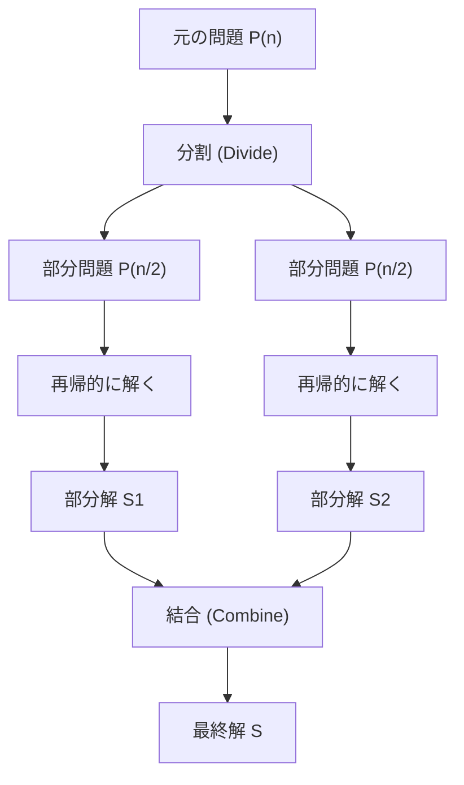
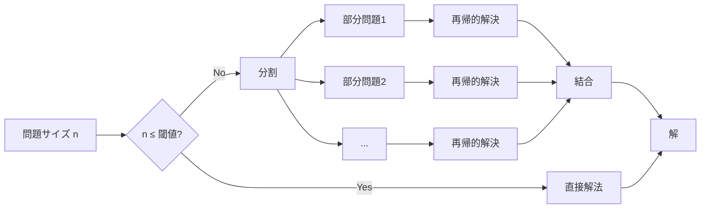
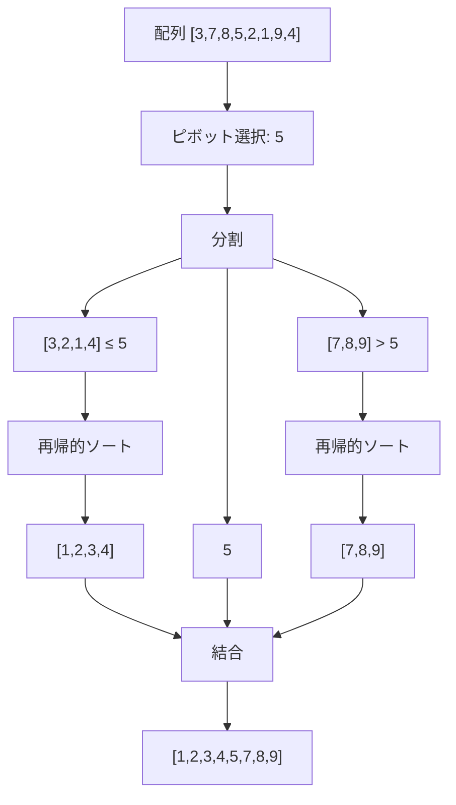
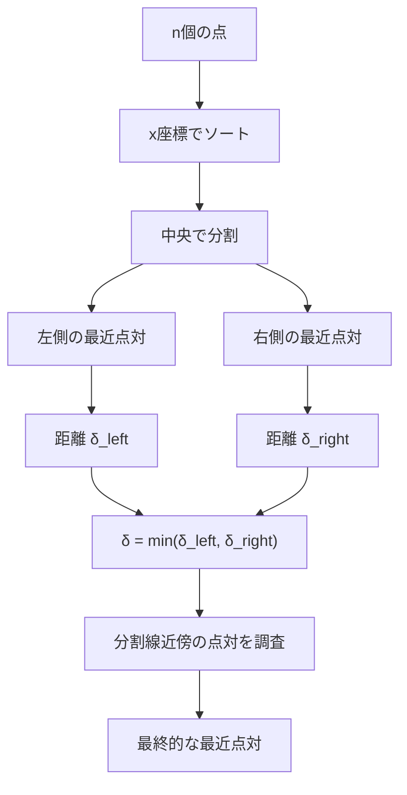
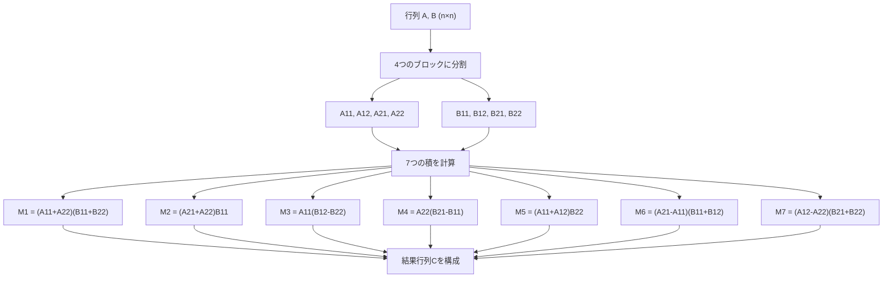
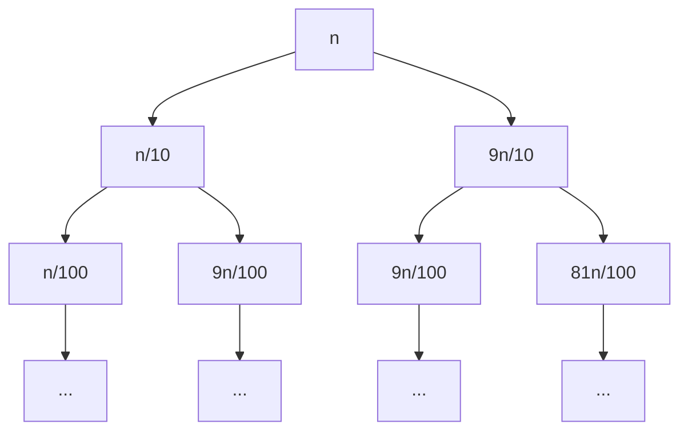
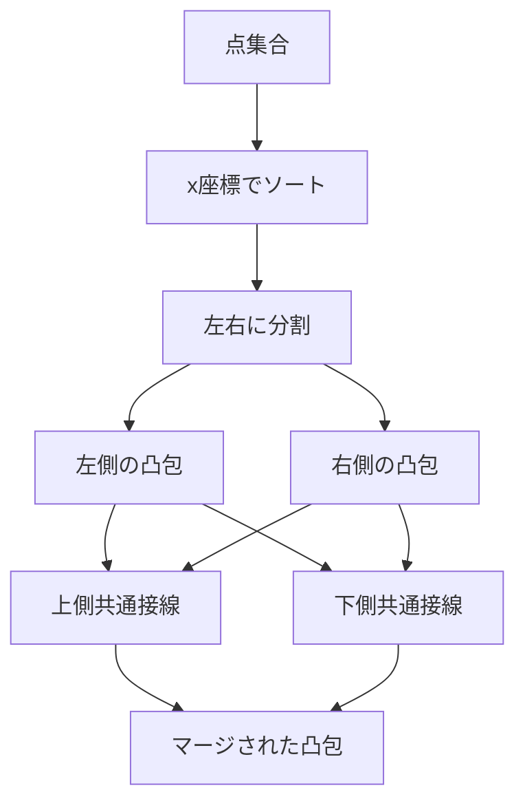

# 分割統治法

分割統治法（Divide and Conquer）は、コンピュータサイエンスにおける最も基本的かつ強力なアルゴリズム設計技法の一つである。複雑な問題を同じ構造を持つより小さな部分問題に分割し、それらを再帰的に解いた後、得られた部分解を組み合わせて元の問題の解を構成するという手法である。この技法は、紀元前のユークリッドの互除法から現代の並列アルゴリズムに至るまで、幅広い問題解決において中心的な役割を果たしている。

分割統治法の本質は、問題の再帰的な構造を認識し、それを活用することにある。大規模な入力に対する問題を直接解くことが困難な場合でも、問題をより小さな部分に分割することで、各部分問題は元の問題よりも容易に解けるようになる。この「分割」「統治」「結合」という3つのステップを通じて、見かけ上複雑な問題を系統的に解決することが可能となる。



## 数学的基礎と計算量解析

分割統治法のアルゴリズムの実行時間は、一般に再帰関係式として表現される。最も一般的な形式は以下のマスター定理（Master Theorem）で解析される再帰式である：

$$T(n) = aT(n/b) + f(n)$$

ここで、$a \geq 1$ は部分問題の個数、$b > 1$ は各部分問題のサイズの縮小率、$f(n)$ は分割と結合に必要な時間を表す。マスター定理は、$f(n)$ と $n^{\log_b a}$ の漸近的な関係に基づいて、$T(n)$ の漸近的な振る舞いを決定する¹。

マスター定理には3つの主要なケースが存在する。第一のケースは $f(n) = O(n^{\log_b a - \epsilon})$ （ある正の定数 $\epsilon$ に対して）の場合で、このとき $T(n) = \Theta(n^{\log_b a})$ となる。第二のケースは $f(n) = \Theta(n^{\log_b a})$ の場合で、$T(n) = \Theta(n^{\log_b a} \log n)$ となる。第三のケースは $f(n) = \Omega(n^{\log_b a + \epsilon})$ かつ正則性条件を満たす場合で、$T(n) = \Theta(f(n))$ となる。

これらの理論的な基礎は、アルゴリズムの効率性を事前に評価し、最適な分割戦略を選択する上で不可欠である。例えば、マージソートの場合、$a = 2$、$b = 2$、$f(n) = \Theta(n)$ であり、$\log_b a = 1$ なので第二のケースに該当し、$T(n) = \Theta(n \log n)$ という時間計算量が導かれる。

## 分割統治法の設計原理

分割統治法を適用する際の設計原理には、いくつかの重要な考慮事項がある。まず、問題の分割方法が決定的に重要である。理想的には、各部分問題のサイズがほぼ等しくなるように分割すべきである。不均等な分割は、最悪の場合、アルゴリズムの効率を大幅に低下させる可能性がある。クイックソートにおけるピボット選択の問題は、この原理の重要性を如実に示している。

次に、基底条件（base case）の適切な設定が必要である。再帰の深さが過度に深くなることを防ぎ、また小さな入力に対しては単純な直接的な解法の方が効率的である場合が多い。実際の実装では、入力サイズがある閾値以下になった時点で、挿入ソートのような単純なアルゴリズムに切り替えることがよく行われる。



結合ステップの効率性も重要な設計要素である。部分解を結合する際の計算量が過大になると、分割によって得られた利点が相殺されてしまう。理想的には、結合ステップは線形時間またはそれ以下で実行されるべきである。

## マージソート：分割統治法の典型例

マージソートは分割統治法の最も純粋な実装例の一つである。配列を二つの等しい部分に分割し、それぞれを再帰的にソートした後、二つのソート済み部分配列をマージして全体のソート済み配列を生成する。

```python
def merge_sort(arr, left, right):
    if left >= right:
        return
    
    mid = (left + right) // 2
    
    # Divide: Recursively sort both halves
    merge_sort(arr, left, mid)
    merge_sort(arr, mid + 1, right)
    
    # Conquer: Merge the sorted halves
    merge(arr, left, mid, right)

def merge(arr, left, mid, right):
    # Create temporary arrays
    left_arr = arr[left:mid+1]
    right_arr = arr[mid+1:right+1]
    
    i = j = 0
    k = left
    
    # Merge process
    while i < len(left_arr) and j < len(right_arr):
        if left_arr[i] <= right_arr[j]:
            arr[k] = left_arr[i]
            i += 1
        else:
            arr[k] = right_arr[j]
            j += 1
        k += 1
    
    # Copy remaining elements
    while i < len(left_arr):
        arr[k] = left_arr[i]
        i += 1
        k += 1
    
    while j < len(right_arr):
        arr[k] = right_arr[j]
        j += 1
        k += 1
```

マージソートの重要な特性は、その安定性と予測可能な性能である。最悪の場合でも $O(n \log n)$ の時間計算量を保証し、安定ソート（同じ値の要素の相対的な順序を保持）である。しかし、$O(n)$ の追加メモリを必要とすることが欠点となる場合がある。

## クイックソート：実践的な分割統治

クイックソートは、実践において最も広く使用される分割統治アルゴリズムの一つである。ピボット要素を選択し、配列をピボット以下の要素とピボットより大きい要素に分割する。マージソートとは異なり、分割ステップで主要な作業が行われ、結合ステップは不要である。



クイックソートの性能は、ピボット選択戦略に大きく依存する。理想的には、ピボットは配列の中央値であるべきだが、これを効率的に見つけることは困難である。実践的なアプローチとして、ランダムピボット選択、三点の中央値（median-of-three）、あるいはイントロソート（Introsort）のようなハイブリッドアプローチが使用される²。

## 高速フーリエ変換：分割統治の数値計算への応用

高速フーリエ変換（FFT）は、分割統治法が数値計算に革命をもたらした例である。離散フーリエ変換（DFT）の計算を $O(n^2)$ から $O(n \log n)$ に削減することで、信号処理、画像処理、多項式乗算など幅広い応用を可能にした。

FFTの核心的なアイデアは、$n$ 点のDFTを2つの $n/2$ 点のDFTに分解することである。入力信号 $x[k]$ のDFTは以下のように定義される：

$$X[k] = \sum_{n=0}^{N-1} x[n] \cdot e^{-j2\pi kn/N}$$

Cooley-Tukeyアルゴリズムでは、偶数インデックスと奇数インデックスの要素を分離し、以下のように再帰的に計算する：

$$X[k] = X_{\text{even}}[k] + W_N^k \cdot X_{\text{odd}}[k]$$
$$X[k + N/2] = X_{\text{even}}[k] - W_N^k \cdot X_{\text{odd}}[k]$$

ここで、$W_N^k = e^{-j2\pi k/N}$ は回転因子（twiddle factor）である。この巧妙な分解により、計算量を劇的に削減できる³。

## 最近点対問題：計算幾何学における分割統治

平面上の $n$ 個の点から最も近い2点を見つける最近点対問題は、分割統治法の計算幾何学への応用例である。単純な総当たり法では $O(n^2)$ の時間がかかるが、分割統治法により $O(n \log n)$ で解決できる。

アルゴリズムは以下のステップで構成される：

1. 点を $x$ 座標でソートし、中央で左右に分割
2. 左側と右側でそれぞれ再帰的に最近点対を見つける
3. 分割線をまたぐ可能性のある点対を調べる

重要な観察は、ステップ3において、調べる必要がある点が限定されることである。左右の最小距離を $\delta$ とすると、分割線から距離 $\delta$ 以内の点のみを考慮すればよい。さらに、各点に対して $y$ 座標の差が $\delta$ 以内の点のみを調べればよいため、効率的に処理できる。



## 分割統治法の並列化

分割統治法の本質的な特性により、並列化に非常に適している。部分問題が独立して解けるため、異なるプロセッサやスレッドで同時に処理できる。この特性は、現代のマルチコアプロセッサやGPUコンピューティングにおいて特に重要である。

並列分割統治の実装では、タスクの粒度（granularity）が重要な考慮事項となる。過度に細かい分割は、タスク管理のオーバーヘッドを増大させる。一方、粗すぎる分割は、利用可能な並列性を十分に活用できない。動的負荷分散とワークスティーリング（work stealing）などの技術が、効率的な並列実行のために使用される⁴。

Fork-Joinフレームワークは、分割統治アルゴリズムの並列実装を支援する一般的なモデルである。タスクを再帰的に分割（fork）し、結果を結合（join）する過程を効率的に管理する。Java 7で導入されたFork/Joinフレームワークや、IntelのCilk Plusなどがこのモデルの実装例である。

## 動的計画法との関係

分割統治法と動的計画法は、どちらも問題を部分問題に分解する点で類似しているが、根本的な違いがある。分割統治法では部分問題が独立しているのに対し、動的計画法では部分問題が重複する。この重複する部分問題の性質により、動的計画法では計算結果をメモ化（記憶）することで効率を向上させる。

フィボナッチ数列の計算を例に考える。単純な分割統治的アプローチでは、$F(n) = F(n-1) + F(n-2)$ により指数的な時間がかかる。これは同じ部分問題を何度も計算するためである。動的計画法では、計算済みの値を保存することで線形時間で解決できる。

しかし、分割統治法が動的計画法に変換できる場合もある。メモ化を追加することで、重複する部分問題を効率的に処理できる。この技法は「メモ化による分割統治」と呼ばれ、多くの最適化問題で有効である。

## Strassen行列乗算アルゴリズム

Strassenアルゴリズムは、行列乗算の計算量を改善する画期的な分割統治アルゴリズムである。通常の行列乗算は $O(n^3)$ の時間がかかるが、Strassenアルゴリズムは $O(n^{2.807})$ で実行できる。このアルゴリズムは、2つの $n \times n$ 行列の乗算を7つの $n/2 \times n/2$ 行列の乗算に分解する。

通常の行列乗算では、$C = A \times B$ を計算する際、$C$ の各要素 $c_{ij}$ は以下のように計算される：

$$c_{ij} = \sum_{k=1}^{n} a_{ik} \cdot b_{kj}$$

Strassenアルゴリズムでは、行列を4つのブロックに分割し、7つの補助行列 $M_1$ から $M_7$ を計算する：



結果行列のブロックは以下のように計算される：
- $C_{11} = M_1 + M_4 - M_5 + M_7$
- $C_{12} = M_3 + M_5$
- $C_{21} = M_2 + M_4$
- $C_{22} = M_1 - M_2 + M_3 + M_6$

Strassenアルゴリズムの重要性は、理論的な下限を突破したことにある。それまで行列乗算の下限は $\Omega(n^3)$ と考えられていたが、このアルゴリズムはその予想を覆した。その後、CoppersmithとWinogradによってさらに改善されたアルゴリズムが発見され、現在の最良の計算量は約 $O(n^{2.373})$ である⁵。

## Karatsuba乗算アルゴリズム

Karatsuba乗算は、大きな整数の乗算を効率的に行う分割統治アルゴリズムである。通常の筆算による乗算は $O(n^2)$ の時間がかかるが、Karatsubaアルゴリズムは $O(n^{\log_2 3}) \approx O(n^{1.585})$ で実行できる。

$n$ 桁の2つの整数 $x$ と $y$ を考える。これらを以下のように分割する：
- $x = x_1 \cdot 10^{n/2} + x_0$
- $y = y_1 \cdot 10^{n/2} + y_0$

通常の方法では、$x \times y$ を計算するために4つの乗算が必要である：
$$x \times y = x_1 y_1 \cdot 10^n + (x_1 y_0 + x_0 y_1) \cdot 10^{n/2} + x_0 y_0$$

Karatsubaの洞察は、3つの乗算で同じ結果を得られることである：
- $z_0 = x_0 \times y_0$
- $z_2 = x_1 \times y_1$
- $z_1 = (x_0 + x_1) \times (y_0 + y_1) - z_0 - z_2$

このとき、$x \times y = z_2 \cdot 10^n + z_1 \cdot 10^{n/2} + z_0$ となる。

```python
def karatsuba(x, y):
    # Base case for small numbers
    if x < 10 or y < 10:
        return x * y
    
    # Calculate the size of the numbers
    n = max(len(str(x)), len(str(y)))
    m = n // 2
    
    # Split the numbers
    x_high, x_low = divmod(x, 10**m)
    y_high, y_low = divmod(y, 10**m)
    
    # Recursive steps
    z0 = karatsuba(x_low, y_low)
    z1 = karatsuba(x_low + x_high, y_low + y_high)
    z2 = karatsuba(x_high, y_high)
    
    # Combine the results
    return z2 * 10**(2*m) + (z1 - z2 - z0) * 10**m + z0
```

このアルゴリズムは、RSA暗号などで使用される大きな整数の演算において実用的な重要性を持つ。

## 再帰木による詳細な計算量解析

分割統治アルゴリズムの計算量を視覚的に理解するために、再帰木（recursion tree）による解析が有効である。再帰木は、アルゴリズムの実行過程を木構造として表現し、各ノードが部分問題を、エッジが再帰呼び出しを表す。

マージソートの再帰木を例に考える。入力サイズ $n$ の問題は、サイズ $n/2$ の2つの部分問題に分割される。各レベルでの作業量は：

- レベル0（根）：1つの問題、サイズ $n$、作業量 $cn$
- レベル1：2つの問題、各サイズ $n/2$、総作業量 $2 \cdot c(n/2) = cn$
- レベル2：4つの問題、各サイズ $n/4$、総作業量 $4 \cdot c(n/4) = cn$
- ...
- レベル $\log n$：$n$ 個の問題、各サイズ 1、総作業量 $n \cdot c(1) = cn$

各レベルでの作業量が $cn$ で一定であり、木の高さが $\log n$ なので、総計算量は $cn \log n = O(n \log n)$ となる。

一方、不均衡な分割の場合を考える。例えば、常に1:9の比率で分割する場合：



この場合、木の高さは最悪で $\log_{10/9} n$ となり、各レベルでの作業量も一定でないため、効率が低下する。

## セレクションアルゴリズム：中央値の中央値

配列から $k$ 番目に小さい要素を見つけるセレクション問題は、分割統治法の興味深い応用である。「中央値の中央値」アルゴリズム（Blum-Floyd-Pratt-Rivest-Tarjanアルゴリズム）は、最悪の場合でも $O(n)$ の時間で動作する。

アルゴリズムの手順：

1. 配列を5要素のグループに分割
2. 各グループの中央値を求める
3. 中央値の配列から再帰的に中央値を求める（中央値の中央値）
4. この値をピボットとして配列を分割
5. 必要な部分で再帰的に探索

このアルゴリズムの巧妙な点は、ピボット選択により最悪でも30%の要素を確実に除外できることである。これにより、再帰式 $T(n) = T(n/5) + T(7n/10) + O(n)$ が成立し、マスター定理により $T(n) = O(n)$ が証明される⁶。

## 実装上の考慮事項

分割統治アルゴリズムの実装では、いくつかの実践的な考慮事項がある。まず、スタックオーバーフローの問題である。深い再帰はシステムのスタックサイズの制限に達する可能性がある。これを回避するために、末尾再帰の最適化、反復的実装への変換、または明示的なスタックの使用が検討される。

キャッシュ効率も重要な要素である。分割統治アルゴリズムは、データのローカリティを活用できる場合に特に効率的である。キャッシュを意識した実装では、部分問題のサイズがキャッシュサイズに収まるように調整することで、性能を大幅に向上させることができる。

```python
# Cache-aware implementation example
CACHE_SIZE = 64 * 1024  # 64KB L1 cache
ELEMENT_SIZE = 8  # bytes per element
THRESHOLD = CACHE_SIZE // ELEMENT_SIZE

def cache_aware_algorithm(data, start, end):
    if end - start <= THRESHOLD:
        # Process in cache-friendly manner
        return direct_solve(data, start, end)
    
    mid = (start + end) // 2
    left_result = cache_aware_algorithm(data, start, mid)
    right_result = cache_aware_algorithm(data, mid, end)
    return combine(left_result, right_result)
```

メモリアライメントも性能に影響する。特にSIMD命令を使用する場合、データが適切にアライメントされていることが重要である。また、false sharingを避けるために、並列実行時のデータ配置にも注意が必要である。

再帰の深さを制御するテクニックとして、「再帰深度制限」がある。一定の深さに達したら、別のアルゴリズムに切り替える。例えば、イントロソートは、再帰深度が $2\log n$ を超えたらヒープソートに切り替える。

```python
def introsort(arr, start, end, max_depth):
    if end - start <= 16:
        insertion_sort(arr, start, end)
    elif max_depth == 0:
        heapsort(arr, start, end)
    else:
        pivot = partition(arr, start, end)
        introsort(arr, start, pivot, max_depth - 1)
        introsort(arr, pivot + 1, end, max_depth - 1)
```

## 分割統治法の限界と代替手法

分割統治法が適用できない、または効率的でない問題クラスも存在する。問題が自然な再帰的構造を持たない場合、強制的に分割することでかえって複雑性が増す可能性がある。また、部分問題の解から全体の解を構成することが困難または不可能な場合もある。

グラフアルゴリズムの多くは、分割統治法の直接的な適用が困難である。グラフの構造は一般に規則的でなく、分割によってグラフの重要な性質が失われることがある。このような場合、動的計画法、貪欲法、または特殊なグラフアルゴリズムが適している。

オンラインアルゴリズムや、入力が逐次的に与えられる問題も、分割統治法の適用が困難である。これらの問題では、将来の入力を知らずに現在の決定を行う必要があるため、事前の分割が不可能である。

## 現代的な応用と発展

分割統治法は、現代のコンピューティングにおいても進化を続けている。機械学習の分野では、決定木やランダムフォレストなどのアルゴリズムが分割統治の原理を使用している。大規模データ処理では、MapReduceフレームワークが分割統治パラダイムを分散環境に拡張している。

量子コンピューティングにおいても、分割統治的アプローチが研究されている。量子アルゴリズムの設計において、問題を量子ビットの制限内で処理可能な部分に分割する技術が開発されている。

外部メモリアルゴリズムでは、データが主記憶に収まらない場合の分割統治戦略が重要である。I/O効率を考慮した分割方法により、ディスクアクセスを最小化しながら大規模データを処理する。

分割統治法は、その単純さと強力さにより、アルゴリズム設計の基本的なツールとして今後も重要であり続けるだろう。新しい計算モデルや問題領域に適応しながら、効率的なアルゴリズムの開発に貢献し続けることが期待される。

## 凸包問題への応用

計算幾何学における凸包（Convex Hull）問題も、分割統治法で効率的に解ける。平面上の点集合から凸包を求める問題は、Graham Scanアルゴリズムでは $O(n \log n)$ だが、分割統治法を用いても同じ計算量で解ける。

分割統治による凸包アルゴリズム：

1. 点を $x$ 座標でソートし、中央で左右に分割
2. 左側と右側でそれぞれ再帰的に凸包を計算
3. 2つの凸包をマージして全体の凸包を構成

マージステップが核心であり、2つの凸包の共通接線（上側と下側）を見つける必要がある。これは二分探索により $O(\log n)$ で実現できるが、実装の複雑さから線形時間のアルゴリズムが一般的に使用される。



## 多項式評価と補間

多項式の評価と補間も分割統治法の重要な応用分野である。Horner法は多項式評価の効率的な方法だが、並列化には適さない。分割統治法を用いることで、並列化可能な評価アルゴリズムを構築できる。

$n$ 次多項式 $P(x) = a_n x^n + a_{n-1} x^{n-1} + ... + a_1 x + a_0$ を考える。これを偶数次と奇数次の項に分割：

$$P(x) = P_{\text{even}}(x^2) + x \cdot P_{\text{odd}}(x^2)$$

ここで、$P_{\text{even}}$ と $P_{\text{odd}}$ はそれぞれ $n/2$ 次の多項式である。この分解により、2つの部分問題を独立に計算できる。

多項式補間においても、分割統治法は有効である。$n$ 個の点 $(x_i, y_i)$ から $n-1$ 次多項式を求めるLagrange補間は、通常 $O(n^2)$ の時間がかかるが、分割統治法により $O(n \log^2 n)$ で計算できる。

## 分割統治法の理論的側面

分割統治法の理論的研究は、計算複雑性理論と密接に関連している。多くのNP困難問題に対して、分割統治法は指数時間アルゴリズムを提供するが、多項式時間への改善は一般に不可能である。

しかし、パラメータ化複雑性の観点から見ると、分割統治法は固定パラメータ扱いやすい（FPT）アルゴリズムの設計に有用である。例えば、頂点被覆問題は一般にNP困難だが、木幅が制限されたグラフでは分割統治的アプローチにより効率的に解ける。

また、近似アルゴリズムの設計においても分割統治法は重要である。巡回セールスマン問題（TSP）の2近似アルゴリズムは、最小全域木を求めた後、分割統治的にEuler閉路を構成することで実現される。

## 実装の最適化技術

現代のプロセッサアーキテクチャに適した分割統治の実装には、いくつかの高度な最適化技術がある：

**1. ループタイリング（Loop Tiling）**
大きな配列を処理する際、キャッシュラインのサイズに合わせてデータをタイル状に分割する。これにより、キャッシュミスを大幅に削減できる。

**2. プリフェッチング**
次に必要となるデータを事前にキャッシュに読み込む。分割統治法では、アクセスパターンが予測可能なため、効果的なプリフェッチが可能である。

**3. ベクトル化**
SIMD命令を活用して、複数のデータを同時に処理する。特にマージソートのマージステップなどで有効である。

```cpp
// SIMD-optimized merge using AVX2
void simd_merge(int* left, int* right, int* output, int size) {
    __m256i left_vec = _mm256_loadu_si256((__m256i*)left);
    __m256i right_vec = _mm256_loadu_si256((__m256i*)right);
    
    // Compare and merge 8 elements at once
    __m256i min_vec = _mm256_min_epi32(left_vec, right_vec);
    __m256i max_vec = _mm256_max_epi32(left_vec, right_vec);
    
    // Store results
    _mm256_storeu_si256((__m256i*)output, min_vec);
    _mm256_storeu_si256((__m256i*)(output + 8), max_vec);
}
```

**4. メモリプールとカスタムアロケータ**
頻繁なメモリ割り当てを避けるため、事前に確保したメモリプールから割り当てる。これにより、メモリ断片化も防げる。

## 分散環境での分割統治

大規模データ処理では、単一マシンの限界を超えて分散環境での実行が必要となる。MapReduceフレームワークは、分割統治パラダイムを分散環境に適用した代表例である。

分散分割統治の課題：

- **通信コスト**: ネットワーク通信は計算よりも遅いため、通信量を最小化する必要がある
- **負荷分散**: 各ノードの処理時間を均等化し、全体の処理時間を最小化する
- **耐障害性**: ノードの故障に対処し、計算を継続できるようにする

Apache Sparkなどの現代的なフレームワークは、これらの課題に対処しながら、分割統治アルゴリズムの効率的な実行を可能にしている。

---

¹ Cormen, T. H., Leiserson, C. E., Rivest, R. L., & Stein, C. (2009). Introduction to Algorithms (3rd ed.). MIT Press.

² Hoare, C. A. R. (1962). "Quicksort". The Computer Journal. 5 (1): 10–16.

³ Cooley, J. W., & Tukey, J. W. (1965). "An algorithm for the machine calculation of complex Fourier series". Mathematics of Computation. 19 (90): 297–301.

⁴ Blumofe, R. D., & Leiserson, C. E. (1999). "Scheduling multithreaded computations by work stealing". Journal of the ACM. 46 (5): 720–748.

⁵ Strassen, V. (1969). "Gaussian elimination is not optimal". Numerische Mathematik. 13 (4): 354–356.

⁶ Blum, M., Floyd, R. W., Pratt, V., Rivest, R. L., & Tarjan, R. E. (1973). "Time bounds for selection". Journal of Computer and System Sciences. 7 (4): 448–461.