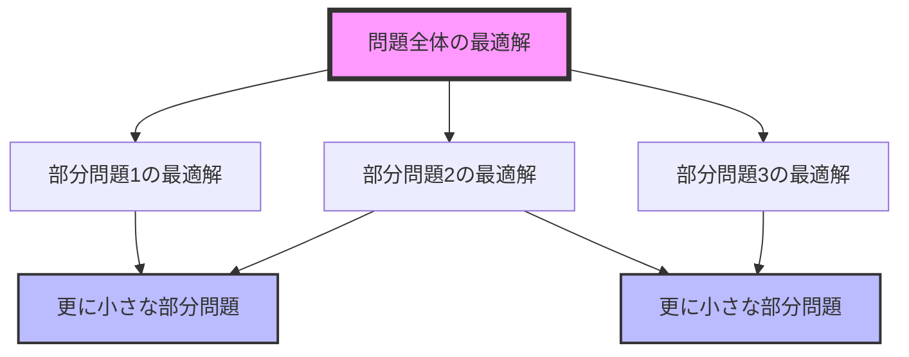
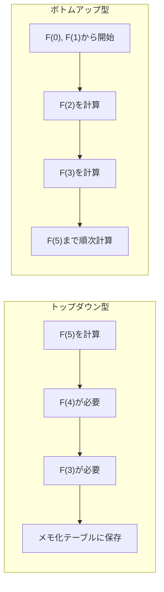
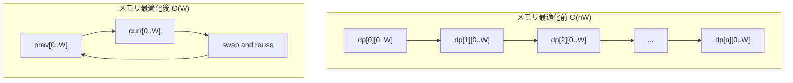
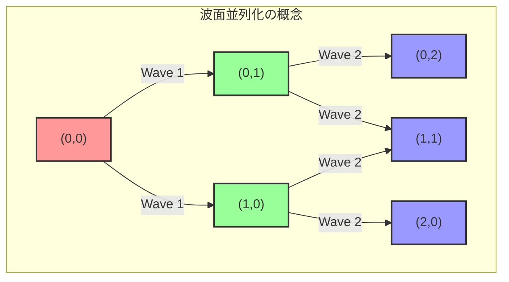

# 動的計画法

動的計画法（Dynamic Programming）は、複雑な問題を小さな部分問題に分割し、それらの解を保存・再利用することで効率的に全体の最適解を求めるアルゴリズム設計手法である。1950年代にリチャード・ベルマンによって考案されたこの手法は、最適化問題の解法として計算機科学の中核を成す概念の一つとなっている[^1]。動的計画法という名称自体は、当時の研究資金を獲得するための政治的配慮から付けられたものであり、その本質は「多段階決定過程の最適化」にある。

動的計画法の本質は、問題が持つ二つの重要な性質、すなわち最適部分構造（Optimal Substructure）と部分問題の重複（Overlapping Subproblems）を利用することにある。最適部分構造とは、ある問題の最適解が、その部分問題の最適解を用いて構成できるという性質である。例えば、グラフの最短経路問題において、頂点AからCへの最短経路が頂点Bを経由する場合、AからBへの部分経路もまた最短でなければならない。この性質により、大きな問題を小さな部分問題に分解し、それらを組み合わせることで全体の解を構築できる。



部分問題の重複は、異なる計算経路が同じ部分問題に到達する性質を指す。単純な再帰的アプローチでは、これらの重複する部分問題を何度も解くことになり、指数的な計算時間を要することがある。動的計画法は、一度計算した部分問題の解を保存（メモ化）することで、この無駄な再計算を回避する。フィボナッチ数列の計算がその典型例であり、$F(n) = F(n-1) + F(n-2)$という漸化式において、$F(n-2)$は$F(n)$と$F(n-1)$の両方の計算で必要となる。

動的計画法の実装には、主に二つのアプローチが存在する。トップダウン型（メモ化再帰）は、大きな問題から始めて必要に応じて部分問題を解く手法である。このアプローチは直感的で実装が容易だが、再帰呼び出しのオーバーヘッドとスタックの深さに制約がある。一方、ボトムアップ型（表形式）は、最小の部分問題から始めて順次大きな問題を解いていく手法である。こちらは再帰のオーバーヘッドがなく、必要なメモリ量を事前に把握できる利点がある。



状態の定義と遷移の設計は、動的計画法において最も重要かつ創造的な部分である。状態とは、部分問題を一意に識別するための情報の集合であり、通常は配列のインデックスとして表現される。例えば、ナップサック問題では「$i$番目までの品物を考慮し、容量$w$のナップサックに入れる場合の最大価値」を$dp[i][w]$として定義する。この状態定義により、問題空間が明確に区切られ、各部分問題が独立して扱える。

状態遷移は、ある状態から別の状態への関係を表す漸化式として記述される。ナップサック問題の場合、$i$番目の品物を入れるか入れないかの選択により、以下の漸化式が得られる：

$$dp[i][w] = \max(dp[i-1][w], dp[i-1][w-w_i] + v_i)$$

ここで、$w_i$は$i$番目の品物の重さ、$v_i$はその価値を表す。この漸化式は、品物を入れない場合（$dp[i-1][w]$）と入れる場合（$dp[i-1][w-w_i] + v_i$）の最大値を取ることを意味する。

計算量の解析において、動的計画法の時間計算量は状態数と各状態における遷移の計算量の積で表される。ナップサック問題の例では、状態数が$O(nW)$（$n$は品物数、$W$は容量）であり、各状態の遷移が$O(1)$で計算できるため、全体の時間計算量は$O(nW)$となる。これは一見すると多項式時間のように見えるが、$W$が入力のビット数に対して指数的に大きくなりうるため、厳密には擬多項式時間アルゴリズムと呼ばれる。

メモリ使用量の最適化は、実用的な動的計画法の実装において重要な考慮事項である。多くの場合、すべての状態を保持する必要はなく、現在の計算に必要な状態のみを保持すれば十分である。例えば、前述のナップサック問題では、$i$番目の状態を計算する際に必要なのは$(i-1)$番目の状態のみであるため、2次元配列の代わりに1次元配列を2つ使い回すことで、空間計算量を$O(nW)$から$O(W)$に削減できる。



動的計画法と他のアルゴリズム手法との関係を理解することは、適切な手法を選択する上で重要である。貪欲法（Greedy Algorithm）は、各段階で局所的に最適な選択を行う手法であり、動的計画法よりも効率的だが、最適部分構造に加えて貪欲選択性（Greedy Choice Property）が必要となる。例えば、活動選択問題は貪欲法で解けるが、ナップサック問題は一般に貪欲法では最適解が得られない。

分割統治法（Divide and Conquer）も問題を部分問題に分割する点で動的計画法と類似するが、部分問題が重複しない点で異なる。マージソートやクイックソートは分割統治法の典型例であり、各部分問題は独立して解かれる。一方、動的計画法が適用される問題では、部分問題が重複するため、その解を保存・再利用することが効率化の鍵となる。

動的計画法の実装パターンには、いくつかの典型的な形式が存在する。線形動的計画法は、状態が1次元で表現される最も単純な形式である。最長増加部分列（LIS）問題がその例であり、$dp[i]$を「$i$番目の要素を末尾とする最長増加部分列の長さ」と定義することで、$O(n^2)$で解ける（セグメント木を用いれば$O(n\log n)$に改善可能）。

区間動的計画法は、連続する区間を状態として扱うパターンである。行列連鎖積問題では、$dp[i][j]$を「$i$番目から$j$番目までの行列の積を計算する最小コスト」と定義し、区間を分割する位置$k$について以下の漸化式を得る：

$$dp[i][j] = \min_{i \leq k < j}(dp[i][k] + dp[k+1][j] + cost(i,k,j))$$

ビット動的計画法は、集合を状態として扱う際にビット演算を活用するパターンである。巡回セールスマン問題（TSP）の動的計画法による解法では、訪問済みの都市の集合をビットマスクで表現し、$dp[S][i]$を「集合$S$の都市を訪問し、現在都市$i$にいる場合の最小コスト」と定義する。

```cpp
// TSPの動的計画法実装の核心部分
for (int S = 0; S < (1 << n); S++) {
    for (int i = 0; i < n; i++) {
        if (!(S & (1 << i))) continue;
        for (int j = 0; j < n; j++) {
            if (S & (1 << j)) continue;
            dp[S | (1 << j)][j] = min(dp[S | (1 << j)][j], 
                                      dp[S][i] + dist[i][j]);
        }
    }
}
```

確率的動的計画法は、状態遷移に確率的要素を含む問題を扱う。期待値DPとも呼ばれ、各状態における期待値を計算する。サイコロを使ったゲームの勝率計算などがその例であり、状態遷移の確率を考慮した漸化式を立てる必要がある。

動的計画法の計算順序の決定は、実装上の重要な考慮事項である。ボトムアップ型では、依存関係に基づいて計算順序を決定する必要がある。DAG（有向非巡回グラフ）上の動的計画法では、トポロジカルソートによって計算順序を決定できる。一方、トップダウン型では、メモ化により計算順序を明示的に指定する必要がなく、実装が簡潔になることが多い。

実践的な設計指針として、まず問題の構造を分析し、最適部分構造と部分問題の重複を確認することが重要である。次に、状態を定義する際は、部分問題を一意に識別するために必要十分な情報を含めるよう注意する。状態数が多すぎると計算量が増大し、少なすぎると正しい解が得られない。状態遷移の設計では、すべての可能な遷移を網羅し、境界条件を適切に処理することが求められる。

動的計画法の限界と適用範囲を理解することも重要である。状態数が指数的に増大する問題では、動的計画法でも現実的な時間で解けない場合がある。また、最適部分構造を持たない問題には適用できない。例えば、最長単純路問題は、部分経路が単純路であることを保証できないため、一般のグラフでは動的計画法で効率的に解けない（NP困難）。

数値精度の問題も実装上の考慮事項である。確率や実数を扱う動的計画法では、浮動小数点演算の誤差が蓄積する可能性がある。可能な限り整数演算で処理し、必要に応じて有理数や任意精度演算を使用することが推奨される。

動的計画法の並列化は、現代の計算環境において重要なトピックである。ボトムアップ型の実装では、依存関係のない状態を並列に計算できる。波面並列化（Wavefront Parallelization）は、対角線上の要素を並列に計算する手法であり、2次元DPテーブルの計算で有効である。一方、トップダウン型の並列化は、メモ化テーブルへの同時アクセスの制御が必要となり、実装が複雑になる。



動的計画法の高度な最適化技法として、Convex Hull Trickや単調性を利用した最適化がある。Convex Hull Trickは、遷移が直線の集合で表現できる場合に、凸包を管理することで状態遷移を高速化する手法である。これにより、特定のクラスの動的計画法の計算量を$O(n^2)$から$O(n\log n)$や$O(n)$に改善できる。

[^1]: Bellman, R. (1957). Dynamic Programming. Princeton University Press.