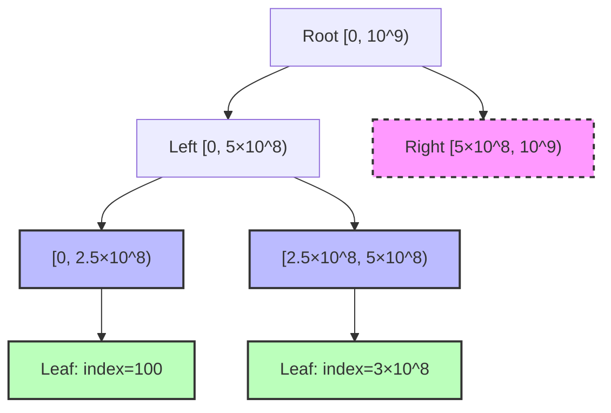
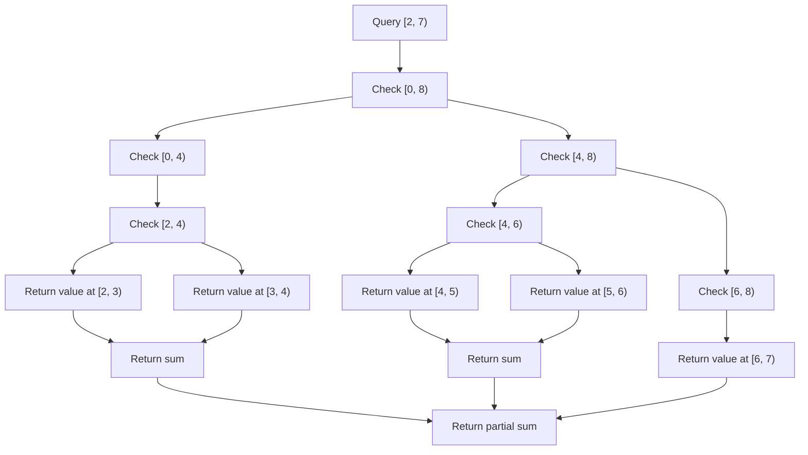
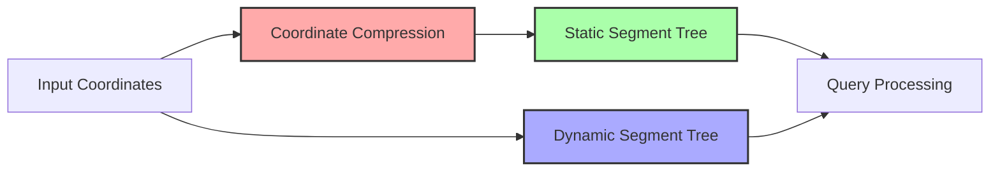

# 動的セグメント木

動的セグメント木は、通常のセグメント木が事前に固定サイズの配列を確保するのに対し、必要に応じてノードを動的に生成していくデータ構造である。これにより、非常に大きな範囲（例えば10^9や10^18といった範囲）に対しても、実際にアクセスされる要素数に比例したメモリ使用量で効率的に区間クエリを処理できる。競技プログラミングにおいては、座標圧縮が困難または不可能な場面で特に威力を発揮する。

通常のセグメント木では、範囲[0, N)に対してO(N)のメモリを事前に確保する必要がある。一方、動的セグメント木では初期状態でルートノードのみを持ち、更新操作が行われるたびに必要なノードを生成していく。この遅延的なノード生成により、M回の更新操作に対してO(M log N)のメモリ使用量で済む。これは、疎な配列に対する効率的な操作を可能にする。



## 基本的な仕組みと実装原理

動的セグメント木の核心は、ノードを必要になった時点で生成するという遅延評価の考え方にある。各ノードは左右の子ノードへのポインタを持ち、初期状態ではこれらはnullptrを指している。更新や取得操作で特定の範囲にアクセスする必要が生じた際に、その経路上のノードを生成していく。

```cpp
struct Node {
    long long value;
    Node* left;
    Node* right;
    
    Node() : value(0), left(nullptr), right(nullptr) {}
};
```

この構造により、例えば10^18という巨大な範囲に対しても、実際にアクセスされる位置が1000箇所程度であれば、生成されるノード数は高々1000 × log(10^18) ≈ 60000個程度に抑えられる。通常のセグメント木では10^18個のメモリを確保することは現実的に不可能であるため、動的セグメント木が唯一の解決策となる場面が存在する。

更新操作は、ルートから目的の位置まで再帰的に降りていき、その過程で必要なノードを生成する。範囲[l, r)を管理するノードにおいて、更新位置がmid = (l + r) / 2より小さければ左の子に、そうでなければ右の子に再帰する。子ノードが存在しない場合は新たに生成する。

```cpp
void update(Node*& node, long long l, long long r, long long pos, long long val) {
    if (!node) node = new Node();
    
    if (r - l == 1) {
        node->value = val;
        return;
    }
    
    long long mid = (l + r) / 2;
    if (pos < mid) {
        update(node->left, l, mid, pos, val);
    } else {
        update(node->right, mid, r, pos, val);
    }
    
    // Combine values from children
    long long left_val = node->left ? node->left->value : 0;
    long long right_val = node->right ? node->right->value : 0;
    node->value = left_val + right_val;
}
```

## メモリ管理と計算量の詳細

動的セグメント木の空間計算量は、更新操作の回数Mと範囲の大きさNに対してO(M log N)となる。これは各更新操作が最大でlog N個の新しいノードを生成する可能性があることに由来する。一方、時間計算量は通常のセグメント木と同様に、更新・取得ともにO(log N)である。

メモリ管理において注意すべき点は、動的にノードを生成していくため、メモリの断片化が発生する可能性があることである。C++においては、頻繁なnew/delete操作によるオーバーヘッドを避けるため、メモリプールを用いた実装が推奨される場合がある。

```cpp
class MemoryPool {
private:
    static const int POOL_SIZE = 1000000;
    Node pool[POOL_SIZE];
    int ptr = 0;
    
public:
    Node* allocate() {
        return &pool[ptr++];
    }
};
```

このようなメモリプールを使用することで、動的メモリ確保のオーバーヘッドを大幅に削減できる。特に競技プログラミングにおいては、実行時間制限が厳しいため、このような最適化が重要となる。

## 区間クエリの実装

動的セグメント木における区間クエリは、通常のセグメント木と同様の分割統治アプローチを取るが、nullptrのチェックが追加される。存在しないノードは単位元（和の場合は0、最大値の場合は-∞など）として扱う。

```cpp
long long query(Node* node, long long l, long long r, long long ql, long long qr) {
    if (!node || qr <= l || r <= ql) return 0;  // Identity element
    if (ql <= l && r <= qr) return node->value;
    
    long long mid = (l + r) / 2;
    long long left_result = query(node->left, l, mid, ql, qr);
    long long right_result = query(node->right, mid, r, ql, qr);
    
    return left_result + right_result;  // Combine operation
}
```

この実装では、ノードが存在しない場合や範囲外の場合に単位元を返すことで、存在しない部分木を効率的に処理している。これにより、疎な配列に対しても高速な区間クエリが可能となる。



## 遅延評価との組み合わせ

動的セグメント木は遅延評価（Lazy Propagation）と組み合わせることも可能である。この場合、各ノードに遅延評価用の追加フィールドを持たせ、区間更新を効率的に処理する。ただし、遅延評価の伝播時にも子ノードの動的生成が必要となるため、実装はより複雑になる。

```cpp
struct LazyNode {
    long long value;
    long long lazy;
    LazyNode* left;
    LazyNode* right;
    
    LazyNode() : value(0), lazy(0), left(nullptr), right(nullptr) {}
};

void push(LazyNode*& node, long long l, long long r) {
    if (!node || node->lazy == 0) return;
    
    long long mid = (l + r) / 2;
    
    // Create children if they don't exist
    if (!node->left) node->left = new LazyNode();
    if (!node->right) node->right = new LazyNode();
    
    // Propagate lazy value
    node->left->lazy += node->lazy;
    node->left->value += node->lazy * (mid - l);
    
    node->right->lazy += node->lazy;
    node->right->value += node->lazy * (r - mid);
    
    node->lazy = 0;
}
```

遅延評価を用いた区間更新では、更新範囲に完全に含まれるノードに対して遅延タグを設定し、実際の値の更新は後の操作時まで遅延させる。これにより、区間更新もO(log N)時間で処理できる。

## 永続化との関係

動的セグメント木は永続セグメント木と密接な関係がある。実際、永続セグメント木の実装では、各バージョンで変更されたノードのみを新たに生成し、変更されていない部分は前のバージョンと共有する。これは動的セグメント木のノード生成戦略と本質的に同じアイデアである。

永続化を行う場合、更新操作では既存のノードを変更するのではなく、新しいノードを生成して新しい木構造を作る。このとき、変更されない部分木は前のバージョンと共有される。

```cpp
Node* persistent_update(Node* node, long long l, long long r, long long pos, long long val) {
    Node* new_node = new Node();
    if (node) *new_node = *node;  // Copy existing node
    
    if (r - l == 1) {
        new_node->value = val;
        return new_node;
    }
    
    long long mid = (l + r) / 2;
    if (pos < mid) {
        new_node->left = persistent_update(node ? node->left : nullptr, l, mid, pos, val);
    } else {
        new_node->right = persistent_update(node ? node->right : nullptr, mid, r, pos, val);
    }
    
    // Recalculate value
    long long left_val = new_node->left ? new_node->left->value : 0;
    long long right_val = new_node->right ? new_node->right->value : 0;
    new_node->value = left_val + right_val;
    
    return new_node;
}
```

## 実装上の注意点とベストプラクティス

動的セグメント木を実装する際には、いくつかの重要な注意点がある。まず、整数オーバーフローに注意が必要である。範囲が非常に大きい場合、mid = (l + r) / 2の計算でオーバーフローする可能性がある。これを避けるには、mid = l + (r - l) / 2とする方法がある。

```cpp
long long safe_mid(long long l, long long r) {
    return l + (r - l) / 2;
}
```

また、再帰の深さも考慮する必要がある。範囲が10^18の場合、最悪でlog_2(10^18) ≈ 60程度の再帰深度となる。C++のデフォルトスタックサイズでは問題ないが、より深い再帰が必要な場合は注意が必要である。

メモリリークを防ぐため、動的に確保したメモリの解放も重要である。ただし、競技プログラミングでは実行終了時にOSがメモリを解放するため、明示的な解放は省略されることが多い。長時間動作するアプリケーションでは、適切なデストラクタの実装が必要となる。

```cpp
void destroy(Node* node) {
    if (!node) return;
    destroy(node->left);
    destroy(node->right);
    delete node;
}
```

## 座標圧縮との比較

動的セグメント木の主な利点は、座標圧縮が困難または不可能な場面で効果を発揮することである。座標圧縮では、事前にすべてのクエリで使用される座標を収集し、ソートして連続的なインデックスに変換する必要がある。これはオフラインアルゴリズムであり、オンラインクエリには対応できない。

一方、動的セグメント木はオンラインアルゴリズムとして動作し、新しい座標が現れても問題なく処理できる。ただし、座標圧縮が可能な場合と比較すると、定数倍の実行時間とメモリ使用量は大きくなる傾向がある。



## 高度な応用：2次元動的セグメント木

動的セグメント木の概念は多次元に拡張できる。2次元動的セグメント木では、各ノードが別の動的セグメント木を持つ入れ子構造となる。これにより、平面上の矩形領域に対するクエリを効率的に処理できる。

```cpp
struct Node2D {
    Node* tree;  // Inner segment tree for y-coordinate
    Node2D* left;
    Node2D* right;
    
    Node2D() : tree(nullptr), left(nullptr), right(nullptr) {}
};

void update2D(Node2D*& node, long long xl, long long xr, 
              long long x, long long y, long long val) {
    if (!node) node = new Node2D();
    
    // Update inner tree
    update(node->tree, 0, Y_MAX, y, val);
    
    if (xr - xl == 1) return;
    
    long long xmid = (xl + xr) / 2;
    if (x < xmid) {
        update2D(node->left, xl, xmid, x, y, val);
    } else {
        update2D(node->right, xmid, xr, x, y, val);
    }
}
```

2次元の場合、単一点更新の時間計算量はO(log X × log Y)、空間計算量はO(M × log X × log Y)となる。ここでMは更新回数、X、Yはそれぞれの次元の範囲である。

## パフォーマンス最適化技法

実践的な実装では、いくつかの最適化技法を適用することで性能を向上させることができる。まず、ノードの構造体をコンパクトにすることで、キャッシュ効率を改善できる。また、頻繁にアクセスされるノードをキャッシュすることで、再帰的な探索を削減できる。

```cpp
struct CompactNode {
    int32_t value;  // Use smaller data type if possible
    uint32_t left_idx;  // Index in memory pool instead of pointer
    uint32_t right_idx;
    
    CompactNode() : value(0), left_idx(0), right_idx(0) {}
};
```

さらに、特定のパターンのクエリに対しては、専用の最適化を適用できる。例えば、連続する範囲への更新が多い場合は、バッファリングを行って複数の更新をまとめて処理する方法がある。

## 実装例：範囲最大値クエリ

ここまでは主に範囲和クエリを例に説明してきたが、動的セグメント木は任意の結合的な演算に対して適用できる。範囲最大値クエリの実装例を示す。

```cpp
class DynamicSegmentTree {
private:
    struct Node {
        long long max_val;
        Node* left;
        Node* right;
        
        Node() : max_val(LLONG_MIN), left(nullptr), right(nullptr) {}
    };
    
    Node* root;
    long long L, R;  // Range [L, R)
    
    void update(Node*& node, long long l, long long r, long long pos, long long val) {
        if (!node) node = new Node();
        
        if (r - l == 1) {
            node->max_val = val;
            return;
        }
        
        long long mid = l + (r - l) / 2;
        if (pos < mid) {
            update(node->left, l, mid, pos, val);
        } else {
            update(node->right, mid, r, pos, val);
        }
        
        long long left_max = node->left ? node->left->max_val : LLONG_MIN;
        long long right_max = node->right ? node->right->max_val : LLONG_MIN;
        node->max_val = max(left_max, right_max);
    }
    
    long long query(Node* node, long long l, long long r, long long ql, long long qr) {
        if (!node || qr <= l || r <= ql) return LLONG_MIN;
        if (ql <= l && r <= qr) return node->max_val;
        
        long long mid = l + (r - l) / 2;
        long long left_result = query(node->left, l, mid, ql, qr);
        long long right_result = query(node->right, mid, r, ql, qr);
        
        return max(left_result, right_result);
    }
    
public:
    DynamicSegmentTree(long long l, long long r) : root(nullptr), L(l), R(r) {}
    
    void update(long long pos, long long val) {
        update(root, L, R, pos, val);
    }
    
    long long query(long long l, long long r) {
        return query(root, L, R, l, r);
    }
};
```

## 理論的背景と計算複雑性

動的セグメント木の理論的基盤は、平衡二分探索木とセグメント木の概念の融合にある。各操作の計算量がO(log N)であることの証明は、木の高さが最大でlog Nであることに基づく。動的にノードを生成する場合でも、各レベルで高々1つのノードを訪問するため、この性質は保たれる。

空間計算量の解析では、M回の更新操作それぞれが最悪でlog N個の新しいノードを生成することから、全体でO(M log N)となる。ただし、更新が局所的に集中する場合は、実際のノード数はこれより少なくなる。

メモリアクセスパターンの観点から見ると、動的セグメント木はポインタを辿るため、キャッシュミスが発生しやすい。一方、通常のセグメント木は配列ベースの実装が可能で、より良いキャッシュ局所性を持つ。これは実行時間の定数倍に影響する要因である。

動的セグメント木は、データ構造の設計において時間と空間のトレードオフを考慮した優れた例である。巨大な範囲に対して疎なデータを扱う必要がある場合、この構造は理論的にも実践的にも最適な選択となることが多い。特に競技プログラミングにおいては、問題の制約を満たす唯一の解法となる場面も少なくない。