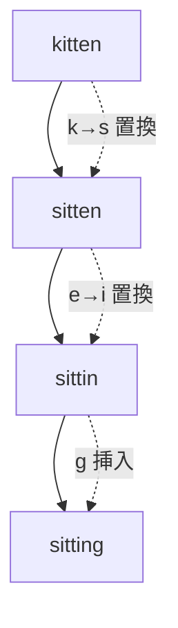
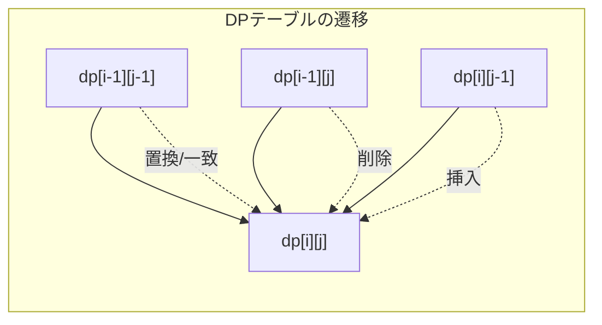
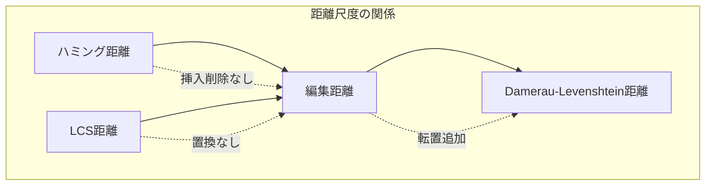

# 編集距離

編集距離は、ある文字列を別の文字列に変換するために必要な最小操作回数を表す指標であり、文字列の類似度を定量的に評価する基本的な概念です。1965年にウラジーミル・レーベンシュタインが提案したことから、レーベンシュタイン距離とも呼ばれます[^1]。競技プログラミングにおいては、動的計画法の典型問題として頻繁に出題され、その理解は文字列処理問題を解く上で不可欠です。

編集距離の本質は、二つの文字列間の「差異」を最小限の編集操作で表現することにあります。許可される編集操作は通常、文字の挿入（insertion）、削除（deletion）、置換（substitution）の三つです。例えば、"kitten"を"sitting"に変換する場合、'k'を's'に置換し、'e'を'i'に置換し、最後に'g'を挿入することで、3回の操作で変換が完了します。この最小操作回数3が、これら二つの文字列間の編集距離となります。



## 数学的定義と形式化

二つの文字列$s$と$t$が与えられたとき、編集距離$d(s, t)$は以下のように再帰的に定義されます。$|s|$と$|t|$をそれぞれ文字列$s$と$t$の長さとし、$s_i$を文字列$s$の$i$番目の文字（1-indexed）とします。

$$
d(s, t) = \begin{cases}
|t| & \text{if } |s| = 0 \\
|s| & \text{if } |t| = 0 \\
d(s[1:|s|-1], t[1:|t|-1]) & \text{if } s_{|s|} = t_{|t|} \\
1 + \min \begin{cases}
d(s[1:|s|-1], t) & \text{(削除)} \\
d(s, t[1:|t|-1]) & \text{(挿入)} \\
d(s[1:|s|-1], t[1:|t|-1]) & \text{(置換)}
\end{cases} & \text{otherwise}
\end{cases}
$$

この定義は、編集距離が距離の公理を満たすことを示しています。つまり、非負性（$d(s, t) \geq 0$）、同一性（$d(s, t) = 0 \iff s = t$）、対称性（$d(s, t) = d(t, s)$）、三角不等式（$d(s, t) + d(t, u) \geq d(s, u)$）のすべてが成立します[^2]。

## 動的計画法による解法

編集距離の計算は、上記の再帰的定義を直接実装すると指数的な時間計算量となりますが、部分問題の重複を活用した動的計画法により効率的に解くことができます。基本的なアイデアは、文字列の接頭辞同士の編集距離を段階的に計算し、表（DPテーブル）に記録していくことです。

$dp[i][j]$を文字列$s$の最初の$i$文字と文字列$t$の最初の$j$文字の編集距離とすると、遷移式は以下のようになります：

$$
dp[i][j] = \begin{cases}
j & \text{if } i = 0 \\
i & \text{if } j = 0 \\
dp[i-1][j-1] & \text{if } s_i = t_j \\
1 + \min(dp[i-1][j], dp[i][j-1], dp[i-1][j-1]) & \text{otherwise}
\end{cases}
$$



この動的計画法のアプローチにより、時間計算量$O(mn)$、空間計算量$O(mn)$で編集距離を計算できます。ここで$m = |s|$、$n = |t|$です。実装例を示します：

```cpp
int editDistance(const string& s, const string& t) {
    int m = s.length(), n = t.length();
    vector<vector<int>> dp(m + 1, vector<int>(n + 1));
    
    // Initialize base cases
    for (int i = 0; i <= m; ++i) dp[i][0] = i;
    for (int j = 0; j <= n; ++j) dp[0][j] = j;
    
    // Fill DP table
    for (int i = 1; i <= m; ++i) {
        for (int j = 1; j <= n; ++j) {
            if (s[i-1] == t[j-1]) {
                dp[i][j] = dp[i-1][j-1];
            } else {
                dp[i][j] = 1 + min({dp[i-1][j], dp[i][j-1], dp[i-1][j-1]});
            }
        }
    }
    
    return dp[m][n];
}
```

## 空間計算量の最適化

標準的な実装では$O(mn)$の空間を使用しますが、編集距離の値のみが必要な場合は、空間計算量を$O(\min(m, n))$に削減できます。これは、DPテーブルの計算において、現在の行の値を求めるのに必要なのは直前の行の値のみであることを利用します。

```cpp
int editDistanceOptimized(const string& s, const string& t) {
    if (s.length() > t.length()) return editDistanceOptimized(t, s);
    
    int m = s.length(), n = t.length();
    vector<int> prev(m + 1), curr(m + 1);
    
    // Initialize first column
    for (int i = 0; i <= m; ++i) prev[i] = i;
    
    for (int j = 1; j <= n; ++j) {
        curr[0] = j;
        for (int i = 1; i <= m; ++i) {
            if (s[i-1] == t[j-1]) {
                curr[i] = prev[i-1];
            } else {
                curr[i] = 1 + min({prev[i], curr[i-1], prev[i-1]});
            }
        }
        swap(prev, curr);
    }
    
    return prev[m];
}
```

さらに、ローリング配列の技法を用いることで、実装をより簡潔にすることも可能です。この最適化は、メモリ制約が厳しい環境や、非常に長い文字列を扱う場合に特に有効です。

## 編集操作の復元

編集距離の値だけでなく、実際にどのような編集操作を行えばよいかを知りたい場合があります。これは、DPテーブルを逆方向にトレースすることで実現できます。各セルでどの遷移を選択したかを記録しておくか、値から逆算することで、最適な編集操作列を復元できます。

```cpp
vector<pair<char, string>> getEditOperations(const string& s, const string& t) {
    int m = s.length(), n = t.length();
    vector<vector<int>> dp(m + 1, vector<int>(n + 1));
    
    // Compute DP table
    for (int i = 0; i <= m; ++i) dp[i][0] = i;
    for (int j = 0; j <= n; ++j) dp[0][j] = j;
    
    for (int i = 1; i <= m; ++i) {
        for (int j = 1; j <= n; ++j) {
            if (s[i-1] == t[j-1]) {
                dp[i][j] = dp[i-1][j-1];
            } else {
                dp[i][j] = 1 + min({dp[i-1][j], dp[i][j-1], dp[i-1][j-1]});
            }
        }
    }
    
    // Backtrack to find operations
    vector<pair<char, string>> operations;
    int i = m, j = n;
    
    while (i > 0 || j > 0) {
        if (i > 0 && j > 0 && s[i-1] == t[j-1]) {
            i--; j--;
        } else if (i > 0 && j > 0 && dp[i][j] == dp[i-1][j-1] + 1) {
            operations.push_back({'R', string(1, s[i-1]) + "->" + t[j-1]});
            i--; j--;
        } else if (i > 0 && dp[i][j] == dp[i-1][j] + 1) {
            operations.push_back({'D', string(1, s[i-1])});
            i--;
        } else {
            operations.push_back({'I', string(1, t[j-1])});
            j--;
        }
    }
    
    reverse(operations.begin(), operations.end());
    return operations;
}
```

## 重み付き編集距離

実際の応用では、すべての編集操作のコストが等しいとは限りません。例えば、キーボード上で隣接するキー同士の打ち間違いは、離れたキー同士の打ち間違いよりも起こりやすいため、より低いコストを割り当てることが適切です。このような場合、重み付き編集距離を使用します。

重み付き編集距離では、各操作に異なるコストを設定できます：
- 挿入コスト: $w_i(c)$ - 文字$c$を挿入するコスト
- 削除コスト: $w_d(c)$ - 文字$c$を削除するコスト
- 置換コスト: $w_s(c_1, c_2)$ - 文字$c_1$を$c_2$に置換するコスト

遷移式は以下のように一般化されます：

$$
dp[i][j] = \begin{cases}
\sum_{k=1}^{j} w_i(t_k) & \text{if } i = 0 \\
\sum_{k=1}^{i} w_d(s_k) & \text{if } j = 0 \\
\min \begin{cases}
dp[i-1][j] + w_d(s_i) \\
dp[i][j-1] + w_i(t_j) \\
dp[i-1][j-1] + w_s(s_i, t_j) \cdot [s_i \neq t_j]
\end{cases} & \text{otherwise}
\end{cases}
$$

## 高速化手法とヒューリスティクス

編集距離の計算は$O(mn)$の時間計算量を持ちますが、実用的な場面では様々な高速化手法が適用できます。

### 早期終了条件

編集距離が閾値$k$以下であるかどうかだけを判定したい場合、計算を早期に打ち切ることができます。これは、対角線から距離$k$より離れたセルは計算する必要がないという性質を利用します。

```cpp
bool isEditDistanceAtMost(const string& s, const string& t, int k) {
    int m = s.length(), n = t.length();
    if (abs(m - n) > k) return false;
    
    vector<int> prev(2 * k + 1, INT_MAX), curr(2 * k + 1);
    prev[k] = 0;  // Offset to handle negative indices
    
    for (int j = 1; j <= n; ++j) {
        int lo = max(1, j - k);
        int hi = min(m, j + k);
        
        for (int i = lo; i <= hi; ++i) {
            int offset = i - j + k;
            curr[offset] = INT_MAX;
            
            if (s[i-1] == t[j-1]) {
                if (offset > 0) curr[offset] = prev[offset];
            } else {
                if (offset > 0) curr[offset] = min(curr[offset], prev[offset] + 1);
                if (offset > 0 && i > lo) curr[offset] = min(curr[offset], curr[offset-1] + 1);
                if (offset < 2 * k) curr[offset] = min(curr[offset], prev[offset+1] + 1);
            }
        }
        swap(prev, curr);
    }
    
    return prev[k] <= k;
}
```

### ビット並列化

小さなアルファベットサイズの場合、ビット演算を用いて複数の計算を並列化できます。Myersのビットベクトルアルゴリズムはこの手法の代表例で、$O(mn/w)$の時間計算量を実現します（$w$はワードサイズ）[^3]。

```cpp
int editDistanceBitParallel(const string& s, const string& t) {
    const int MAXN = 64;  // Word size
    if (t.length() > MAXN) return -1;  // Fallback needed
    
    int m = s.length(), n = t.length();
    unordered_map<char, uint64_t> PM;
    
    // Precompute pattern masks
    for (int j = 0; j < n; ++j) {
        PM[t[j]] |= 1ULL << j;
    }
    
    uint64_t VP = (1ULL << n) - 1;
    uint64_t VN = 0;
    int score = n;
    
    for (int i = 0; i < m; ++i) {
        uint64_t Eq = PM[s[i]];
        uint64_t D0 = ((VP + (VP & Eq)) ^ VP) | Eq | VN;
        uint64_t HP = VN | ~(D0 | VP);
        uint64_t HN = D0 & VP;
        
        if (HP & (1ULL << (n - 1))) score++;
        if (HN & (1ULL << (n - 1))) score--;
        
        VP = (HP << 1) | 1;
        VN = HN << 1;
    }
    
    return score;
}
```

## 関連アルゴリズムとの比較

編集距離は文字列の類似度を測る指標の一つですが、他にも様々な距離尺度が存在します。それぞれに特徴があり、用途に応じて使い分けることが重要です。

### ハミング距離

ハミング距離は、同じ長さの文字列間で、対応する位置の文字が異なる個数を数えます。編集距離と異なり、挿入や削除は許可されません。計算は$O(n)$で行え、エラー訂正符号などで広く使用されます。

### 最長共通部分列（LCS）

二つの文字列の最長共通部分列の長さを$\text{LCS}(s, t)$とすると、編集距離との間に以下の関係が成立します：

$$
d(s, t) = |s| + |t| - 2 \cdot \text{LCS}(s, t)
$$

ただし、この関係は置換操作のコストが2（削除＋挿入）の場合にのみ成立します。

### Damerau-Levenshtein距離

標準的な編集距離に加えて、隣接する二文字の転置（transposition）を許可する距離尺度です。"teh"と"the"のような打ち間違いをより自然にモデル化できます。計算は$O(mn)$で可能ですが、実装がやや複雑になります[^4]。



## 競技プログラミングにおける応用

編集距離は、競技プログラミングにおいて様々な形で出題されます。基本的な編集距離の計算だけでなく、その概念を応用した問題も多く見られます。

### 典型的な問題パターン

文字列の類似判定問題では、与えられた文字列集合から、クエリ文字列との編集距離が$k$以下のものをすべて見つける必要があります。単純な総当たりでは$O(N \cdot mn)$となりますが、BKツリーやトライ木を用いることで効率化できます。

部分文字列の編集距離問題では、長い文字列$S$の中から、パターン$P$との編集距離が最小となる部分文字列を見つけます。これは、DPの初期化を工夫することで$O(|S| \cdot |P|)$で解けます：

```cpp
int minEditDistanceSubstring(const string& S, const string& P) {
    int n = S.length(), m = P.length();
    vector<vector<int>> dp(n + 1, vector<int>(m + 1));
    
    // Initialize: any prefix of S can be the start
    for (int i = 0; i <= n; ++i) dp[i][0] = 0;
    for (int j = 1; j <= m; ++j) dp[0][j] = j;
    
    int minDist = m;
    for (int i = 1; i <= n; ++i) {
        for (int j = 1; j <= m; ++j) {
            if (S[i-1] == P[j-1]) {
                dp[i][j] = dp[i-1][j-1];
            } else {
                dp[i][j] = 1 + min({dp[i-1][j], dp[i][j-1], dp[i-1][j-1]});
            }
        }
        minDist = min(minDist, dp[i][m]);
    }
    
    return minDist;
}
```

### 制約付き編集距離

実際の問題では、様々な制約が追加されることがあります。例えば、連続する$k$文字以上の削除を禁止する、特定の文字の置換のみを許可する、といった制約です。これらは、DPの状態に追加の情報を持たせることで対応できます。

```cpp
// Example: No more than k consecutive deletions
int editDistanceWithConstraint(const string& s, const string& t, int k) {
    int m = s.length(), n = t.length();
    const int INF = 1e9;
    // dp[i][j][d] = min distance, d consecutive deletions ending at position i
    vector<vector<vector<int>>> dp(m + 1, 
        vector<vector<int>>(n + 1, vector<int>(k + 1, INF)));
    
    dp[0][0][0] = 0;
    
    for (int i = 0; i <= m; ++i) {
        for (int j = 0; j <= n; ++j) {
            for (int d = 0; d <= k; ++d) {
                if (dp[i][j][d] == INF) continue;
                
                // Match or substitute
                if (i < m && j < n) {
                    int cost = (s[i] == t[j]) ? 0 : 1;
                    dp[i+1][j+1][0] = min(dp[i+1][j+1][0], dp[i][j][d] + cost);
                }
                
                // Delete (if allowed)
                if (i < m && d < k) {
                    dp[i+1][j][d+1] = min(dp[i+1][j][d+1], dp[i][j][d] + 1);
                }
                
                // Insert
                if (j < n) {
                    dp[i][j+1][0] = min(dp[i][j+1][0], dp[i][j][d] + 1);
                }
            }
        }
    }
    
    int result = INF;
    for (int d = 0; d <= k; ++d) {
        result = min(result, dp[m][n][d]);
    }
    return result;
}
```

## 実装上の注意点とデバッグ手法

編集距離の実装では、いくつかの典型的なミスが発生しやすいポイントがあります。

インデックスの扱いは特に注意が必要です。文字列のインデックスが0始まりか1始まりかによって、DPテーブルへのアクセス時にオフバイワンエラーが発生しやすくなります。一般的には、DPテーブルは1-indexedで、文字列は0-indexedで扱うことが多いです。

境界条件の設定も重要です。空文字列から任意の文字列への編集距離は、その文字列の長さに等しく、これがDPテーブルの初期化に反映される必要があります。

デバッグ時には、小さな例でDPテーブル全体を出力し、手計算の結果と比較することが有効です：

```cpp
void debugEditDistance(const string& s, const string& t) {
    int m = s.length(), n = t.length();
    vector<vector<int>> dp(m + 1, vector<int>(n + 1));
    
    // Compute DP table
    for (int i = 0; i <= m; ++i) dp[i][0] = i;
    for (int j = 0; j <= n; ++j) dp[0][j] = j;
    
    for (int i = 1; i <= m; ++i) {
        for (int j = 1; j <= n; ++j) {
            if (s[i-1] == t[j-1]) {
                dp[i][j] = dp[i-1][j-1];
            } else {
                dp[i][j] = 1 + min({dp[i-1][j], dp[i][j-1], dp[i-1][j-1]});
            }
        }
    }
    
    // Print DP table
    cout << "    ";
    for (int j = 0; j < n; ++j) cout << t[j] << " ";
    cout << "\n";
    
    for (int i = 0; i <= m; ++i) {
        if (i > 0) cout << s[i-1] << " ";
        else cout << "  ";
        
        for (int j = 0; j <= n; ++j) {
            cout << dp[i][j] << " ";
        }
        cout << "\n";
    }
}
```

## パフォーマンス特性と実用的考察

編集距離アルゴリズムのパフォーマンスは、文字列の長さだけでなく、その内容にも依存します。類似度の高い文字列同士では、早期終了条件が効果的に働き、実質的な計算量が削減されることがあります。

メモリアクセスパターンも性能に大きく影響します。標準的な行優先の実装では、キャッシュ効率が良好ですが、列優先の実装ではキャッシュミスが増加する可能性があります。大規模なデータを扱う場合は、キャッシュブロッキングやタイリングといった最適化技法の適用も検討すべきです。

並列化の観点では、編集距離の計算は本質的に逐次的な性質を持ちますが、対角線方向の要素は独立に計算できるため、ウェーブフロント並列化が可能です：

```cpp
// Conceptual parallel implementation (requires proper synchronization)
void editDistanceParallel(const string& s, const string& t) {
    int m = s.length(), n = t.length();
    vector<vector<int>> dp(m + 1, vector<int>(n + 1));
    
    // Initialize boundaries
    for (int i = 0; i <= m; ++i) dp[i][0] = i;
    for (int j = 0; j <= n; ++j) dp[0][j] = j;
    
    // Process diagonals in parallel
    for (int diag = 2; diag <= m + n; ++diag) {
        #pragma omp parallel for
        for (int i = max(1, diag - n); i <= min(m, diag - 1); ++i) {
            int j = diag - i;
            if (s[i-1] == t[j-1]) {
                dp[i][j] = dp[i-1][j-1];
            } else {
                dp[i][j] = 1 + min({dp[i-1][j], dp[i][j-1], dp[i-1][j-1]});
            }
        }
    }
}
```

実用的なアプリケーションでは、編集距離の計算は often a bottleneck となります。スペルチェッカー、DNAシーケンスアライメント、差分検出ツールなど、多くのシステムで高速な編集距離計算が求められます。これらの用途では、前述の最適化技法に加えて、近似アルゴリズムや確率的手法も検討される場合があります。

編集距離の概念は、その単純さと汎用性から、計算機科学の様々な分野で基礎的な役割を果たしています。動的計画法の教育的な例としてだけでなく、実用的なアルゴリズムとしても、その重要性は今後も変わることはないでしょう。理論的な性質の深い理解と、実装上の工夫の両方を身につけることで、競技プログラミングにおいても実務においても、文字列処理の問題に対して効果的なアプローチが可能となります。

[^1]: Levenshtein, V. I. (1966). "Binary codes capable of correcting deletions, insertions, and reversals". Soviet Physics Doklady. 10 (8): 707–710.

[^2]: Wagner, R. A.; Fischer, M. J. (1974). "The String-to-String Correction Problem". Journal of the ACM. 21 (1): 168–173.

[^3]: Myers, G. (1999). "A fast bit-vector algorithm for approximate string matching based on dynamic programming". Journal of the ACM. 46 (3): 395–415.

[^4]: Damerau, F. J. (1964). "A technique for computer detection and correction of spelling errors". Communications of the ACM. 7 (3): 171–176.