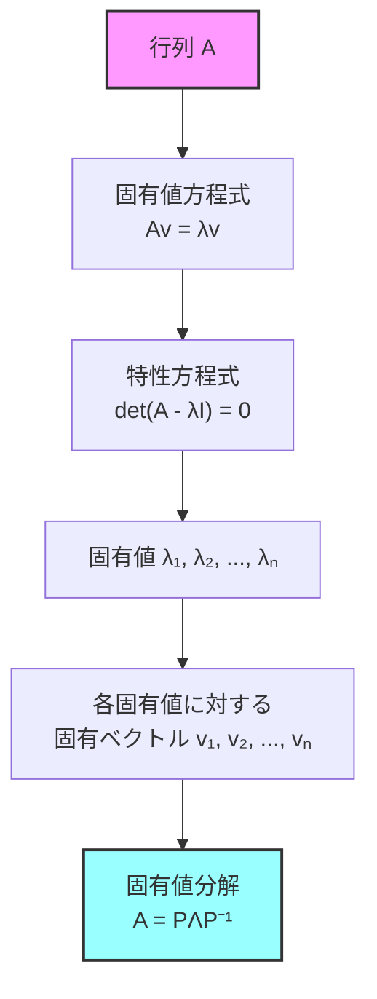
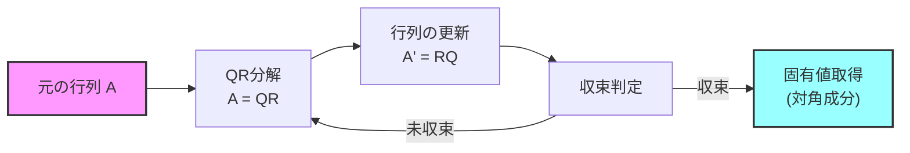
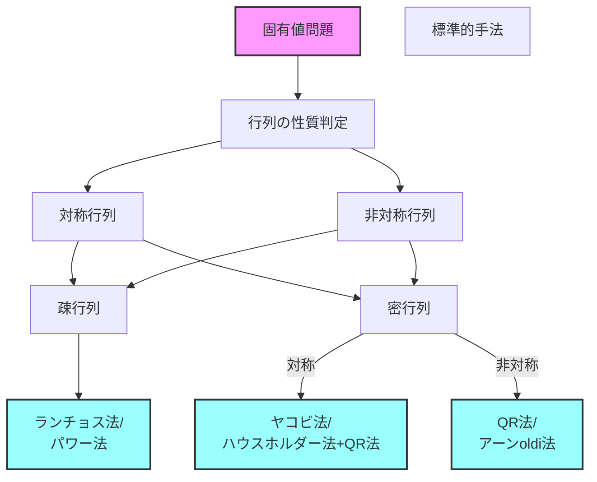

# 固有値分解

固有値分解は線形代数の中核的な概念であり、行列の本質的な性質を明らかにする強力な数学的手法です。競技プログラミングにおいては、グラフ理論における隣接行列の解析、行列累乗の高速化、漸化式の解法、そして物理シミュレーションなど、様々な場面で重要な役割を果たします。本稿では、固有値分解の数学的基礎から始めて、効率的な計算アルゴリズム、そして競技プログラミングにおける実践的な応用まで、体系的に解説していきます。

## 固有値と固有ベクトルの定義

正方行列 $A$ に対して、ゼロでないベクトル $\mathbf{v}$ が存在し、以下の関係を満たすとき、スカラー $\lambda$ を行列 $A$ の固有値、ベクトル $\mathbf{v}$ を対応する固有ベクトルと呼びます。

$$A\mathbf{v} = \lambda\mathbf{v}$$

この式は、行列 $A$ による変換が、特定の方向（固有ベクトル）に対しては単なるスケーリング（固有値倍）として作用することを示しています。幾何学的には、固有ベクトルは変換によって方向が変わらない特別なベクトルであり、固有値はその拡大・縮小率を表します。

固有値を求めるには、上記の式を変形して得られる特性方程式を解きます。

$$(A - \lambda I)\mathbf{v} = \mathbf{0}$$

この方程式が非自明な解を持つための必要十分条件は、係数行列の行列式がゼロになることです。

$$\det(A - \lambda I) = 0$$

この方程式を特性方程式と呼び、$n \times n$ 行列に対しては $n$ 次の多項式となります。複素数の範囲では、代数学の基本定理により、重複度を考慮すれば必ず $n$ 個の固有値が存在します。



## 固有値分解の数学的構造

$n \times n$ 行列 $A$ が $n$ 個の線形独立な固有ベクトルを持つとき、これらの固有ベクトルを列として並べた行列 $P$ と、対応する固有値を対角成分に持つ対角行列 $\Lambda$ を用いて、行列 $A$ を次のように分解できます。

$$A = P\Lambda P^{-1}$$

ここで、$P = [\mathbf{v}_1, \mathbf{v}_2, \ldots, \mathbf{v}_n]$ は固有ベクトルを列として並べた行列、$\Lambda = \text{diag}(\lambda_1, \lambda_2, \ldots, \lambda_n)$ は固有値を対角成分に持つ対角行列です。

この分解が可能な行列を対角化可能と呼びます。実対称行列は常に対角化可能であり、さらに固有ベクトルを正規直交基底として選ぶことができるため、$P$ は直交行列となり、$P^{-1} = P^T$ という性質を持ちます。この場合の分解を特にスペクトル分解と呼びます。

固有値分解の重要な応用の一つは、行列のべき乗の計算です。固有値分解を用いると、

$$A^k = P\Lambda^k P^{-1}$$

となり、対角行列のべき乗は各対角成分をべき乗するだけで計算できるため、大幅な計算量の削減が可能になります。

## 固有値の計算アルゴリズム

競技プログラミングで実装可能な固有値計算アルゴリズムには、主に以下のものがあります。それぞれに特徴があり、問題の性質や行列のサイズに応じて使い分ける必要があります。

### べき乗法（Power Method）

べき乗法は、絶対値最大の固有値とその固有ベクトルを求める反復法です。任意の初期ベクトル $\mathbf{x}_0$ から始めて、以下の反復を行います。

$$\mathbf{x}_{k+1} = \frac{A\mathbf{x}_k}{||A\mathbf{x}_k||}$$

この反復により、$\mathbf{x}_k$ は絶対値最大の固有値に対応する固有ベクトルに収束します。収束後、レイリー商を用いて固有値を計算します。

$$\lambda = \frac{\mathbf{x}^T A \mathbf{x}}{\mathbf{x}^T \mathbf{x}}$$

べき乗法の実装は単純ですが、収束速度は第一固有値と第二固有値の比に依存し、これらが近い値の場合は収束が遅くなります。また、複数の固有値を求める場合は、既に求めた固有ベクトルと直交する部分空間で反復を行う必要があります。

```cpp
// Power method implementation
double powerMethod(vector<vector<double>>& A, vector<double>& eigenvector, int maxIter = 1000, double eps = 1e-9) {
    int n = A.size();
    vector<double> x(n, 1.0);  // Initial vector
    
    for (int iter = 0; iter < maxIter; iter++) {
        vector<double> y(n, 0.0);
        
        // Matrix-vector multiplication
        for (int i = 0; i < n; i++) {
            for (int j = 0; j < n; j++) {
                y[i] += A[i][j] * x[j];
            }
        }
        
        // Normalize
        double norm = 0.0;
        for (int i = 0; i < n; i++) {
            norm += y[i] * y[i];
        }
        norm = sqrt(norm);
        
        for (int i = 0; i < n; i++) {
            y[i] /= norm;
        }
        
        // Check convergence
        double diff = 0.0;
        for (int i = 0; i < n; i++) {
            diff += (x[i] - y[i]) * (x[i] - y[i]);
        }
        
        if (sqrt(diff) < eps) {
            eigenvector = y;
            
            // Compute eigenvalue using Rayleigh quotient
            double lambda = 0.0;
            vector<double> Ay(n, 0.0);
            for (int i = 0; i < n; i++) {
                for (int j = 0; j < n; j++) {
                    Ay[i] += A[i][j] * y[j];
                }
                lambda += y[i] * Ay[i];
            }
            return lambda;
        }
        
        x = y;
    }
    
    return 0.0;  // Failed to converge
}
```

### QR分解による固有値計算

QR法は、行列を直交行列 $Q$ と上三角行列 $R$ の積に分解し、これを反復的に適用することで固有値を求める手法です。基本的なアルゴリズムは以下の通りです。

1. $A_0 = A$ とする
2. $A_k = Q_k R_k$ とQR分解する
3. $A_{k+1} = R_k Q_k$ を計算する
4. 収束するまで2-3を繰り返す

この反復により、$A_k$ は上三角行列に収束し、対角成分が固有値となります。実対称行列の場合は、より効率的なハウスホルダー変換を用いて三重対角行列に変換してからQR法を適用することが一般的です。



### ヤコビ法（実対称行列用）

ヤコビ法は実対称行列専用の固有値計算法で、回転行列を用いて非対角成分を順次ゼロに近づけていく手法です。各ステップで最大の非対角成分を選び、それをゼロにする回転を適用します。

回転角 $\theta$ は以下の式で計算されます：

$$\tan(2\theta) = \frac{2a_{ij}}{a_{ii} - a_{jj}}$$

この方法は実装が比較的簡単で、数値的に安定しており、すべての固有値と固有ベクトルを同時に求めることができます。

## 競技プログラミングにおける応用

固有値分解は競技プログラミングにおいて、以下のような問題で重要な役割を果たします。

### グラフの固有値と構造解析

グラフの隣接行列やラプラシアン行列の固有値は、グラフの構造的性質を反映します。特に重要なのは以下の性質です。

隣接行列の最大固有値（スペクトル半径）は、グラフの連結性や拡張性を表す指標となります。正則グラフでは、最大固有値はグラフの次数と一致します。また、二部グラフの判定は、隣接行列の固有値の対称性から行うことができます。

ラプラシアン行列 $L = D - A$（$D$ は次数行列、$A$ は隣接行列）の固有値は、すべて非負であり、最小固有値はゼロです。ゼロ固有値の重複度は、グラフの連結成分数と一致します。二番目に小さい固有値（代数的連結度）は、グラフの連結の強さを表す重要な指標です。

```cpp
// Compute algebraic connectivity of a graph
double algebraicConnectivity(vector<vector<int>>& adj) {
    int n = adj.size();
    vector<vector<double>> L(n, vector<double>(n, 0.0));
    
    // Construct Laplacian matrix
    for (int i = 0; i < n; i++) {
        int degree = 0;
        for (int j = 0; j < n; j++) {
            if (adj[i][j]) {
                L[i][j] = -1.0;
                degree++;
            }
        }
        L[i][i] = degree;
    }
    
    // Compute eigenvalues (simplified - actual implementation would be more complex)
    vector<double> eigenvalues = computeEigenvalues(L);
    sort(eigenvalues.begin(), eigenvalues.end());
    
    return eigenvalues[1];  // Second smallest eigenvalue
}
```

### 行列累乗と漸化式の高速化

固有値分解を用いることで、行列累乗を高速に計算できます。これは特に、線形漸化式で表される数列の第 $n$ 項を求める問題で威力を発揮します。

フィボナッチ数列を例にとると、

$$\begin{bmatrix} F_{n+1} \\ F_n \end{bmatrix} = \begin{bmatrix} 1 & 1 \\ 1 & 0 \end{bmatrix} \begin{bmatrix} F_n \\ F_{n-1} \end{bmatrix}$$

という関係があり、係数行列の固有値は $\lambda_1 = \frac{1+\sqrt{5}}{2}$（黄金比）と $\lambda_2 = \frac{1-\sqrt{5}}{2}$ です。固有値分解を用いると、フィボナッチ数の一般項が直接計算できます。

$$F_n = \frac{1}{\sqrt{5}}\left[\left(\frac{1+\sqrt{5}}{2}\right)^n - \left(\frac{1-\sqrt{5}}{2}\right)^n\right]$$

より一般的な $k$ 次線形漸化式においても、係数行列の固有値分解により、$O(\log n)$ の計算量で第 $n$ 項を求めることができます。

### マルコフ連鎖と定常分布

マルコフ連鎖の遷移行列 $P$ に対して、定常分布 $\pi$ は固有値1に対応する固有ベクトルとして求められます。

$$P^T \pi = \pi$$

これは、ランダムウォークの長期的な挙動を解析する問題や、ページランクアルゴリズムなどで重要となります。遷移行列が既約かつ非周期的であれば、固有値1は単純固有値となり、対応する固有ベクトルを正規化することで一意な定常分布が得られます。

```cpp
// Compute stationary distribution of a Markov chain
vector<double> stationaryDistribution(vector<vector<double>>& P) {
    int n = P.size();
    vector<vector<double>> PT(n, vector<double>(n));
    
    // Transpose
    for (int i = 0; i < n; i++) {
        for (int j = 0; j < n; j++) {
            PT[i][j] = P[j][i];
        }
    }
    
    // Subtract identity to find null space of (P^T - I)
    for (int i = 0; i < n; i++) {
        PT[i][i] -= 1.0;
    }
    
    // Find eigenvector for eigenvalue 0 (which is eigenvalue 1 for original P^T)
    // Using power method on (P^T)^k converges to stationary distribution
    vector<double> pi(n, 1.0 / n);
    
    for (int iter = 0; iter < 1000; iter++) {
        vector<double> newPi(n, 0.0);
        for (int i = 0; i < n; i++) {
            for (int j = 0; j < n; j++) {
                newPi[i] += P[j][i] * pi[j];  // P^T * pi
            }
        }
        
        // Normalize
        double sum = 0.0;
        for (int i = 0; i < n; i++) {
            sum += newPi[i];
        }
        for (int i = 0; i < n; i++) {
            newPi[i] /= sum;
        }
        
        pi = newPi;
    }
    
    return pi;
}
```

### 主成分分析とデータ圧縮

競技プログラミングでは稀ですが、幾何問題やデータ処理問題において、主成分分析（PCA）が有用な場合があります。データの共分散行列の固有値分解により、データの主要な変動方向を見つけ出すことができます。

$n$ 個の $d$ 次元データ点 $\mathbf{x}_1, \ldots, \mathbf{x}_n$ に対して、中心化したデータの共分散行列 $C$ を計算し、その固有値分解を行います。最大固有値に対応する固有ベクトルが第一主成分となり、データの最も大きな分散を持つ方向を示します。

## 数値的安定性と実装上の注意点

固有値計算は数値的に繊細な問題であり、実装時には以下の点に注意が必要です。

浮動小数点演算の誤差は、特に固有値が近接している場合や、行列の条件数が大きい場合に顕著になります。反復法では適切な収束判定基準を設定し、過度に厳しい精度を要求しないことが重要です。

対称行列の場合は、その性質を活用した専用のアルゴリズムを使用することで、計算効率と数値的安定性の両方を改善できます。例えば、対称行列の固有値は必ず実数となるため、複素数演算を避けることができます。

大規模な疎行列に対しては、行列全体を保持するのではなく、行列ベクトル積のみを計算する方法（行列フリー法）が有効です。これにより、メモリ使用量を大幅に削減できます。

```cpp
// Sparse matrix eigenvalue computation using power method
class SparseMatrix {
    vector<vector<pair<int, double>>> adj;  // Adjacency list representation
    
public:
    SparseMatrix(int n) : adj(n) {}
    
    void addEntry(int i, int j, double val) {
        adj[i].push_back({j, val});
    }
    
    vector<double> multiply(const vector<double>& x) {
        int n = adj.size();
        vector<double> y(n, 0.0);
        
        for (int i = 0; i < n; i++) {
            for (auto& [j, val] : adj[i]) {
                y[i] += val * x[j];
            }
        }
        
        return y;
    }
    
    double largestEigenvalue(int maxIter = 1000) {
        int n = adj.size();
        vector<double> x(n, 1.0 / sqrt(n));
        
        for (int iter = 0; iter < maxIter; iter++) {
            vector<double> y = multiply(x);
            
            // Normalize
            double norm = 0.0;
            for (double val : y) {
                norm += val * val;
            }
            norm = sqrt(norm);
            
            for (int i = 0; i < n; i++) {
                y[i] /= norm;
            }
            
            x = y;
        }
        
        // Compute eigenvalue
        vector<double> Ax = multiply(x);
        double lambda = 0.0;
        for (int i = 0; i < n; i++) {
            lambda += x[i] * Ax[i];
        }
        
        return lambda;
    }
};
```

## 複素固有値と一般化固有値問題

実行列であっても、固有値は複素数となる場合があります。特に、非対称行列では複素共役のペアとして現れることが多く、これは振動的な挙動を表します。競技プログラミングでは複素固有値を扱う問題は少ないですが、力学系のシミュレーションなどでは重要となります。

一般化固有値問題 $A\mathbf{v} = \lambda B\mathbf{v}$ は、通常の固有値問題の拡張であり、振動解析や最適化問題で現れます。$B$ が正定値行列の場合、コレスキー分解を用いて標準的な固有値問題に帰着できます。

## パフォーマンスの最適化

競技プログラミングにおける固有値計算では、厳密な解よりも十分な精度の近似解を高速に求めることが重要です。以下の最適化手法が有効です。

前処理として、行列を相似変換により簡単な形（三重対角行列やヘッセンベルク行列）に変換することで、後続の計算を高速化できます。対称行列の三重対角化にはハウスホルダー変換が、非対称行列のヘッセンベルク化にはアーンoldi法が用いられます。

反復法の初期値として、問題の性質から予測される固有ベクトルの近似を用いることで、収束を加速できます。例えば、グラフの隣接行列では、次数の大きい頂点に対応する成分を大きくした初期ベクトルが有効です。

複数の固有値を求める場合、同時反復法（サブスペース反復法）を用いることで、個別に計算するよりも効率的に計算できます。また、必要な固有値の個数が少ない場合は、ランチョス法やアーンолディ法などのクリロフ部分空間法が有効です。



固有値分解は、その数学的な深さと実用的な重要性から、競技プログラミングにおいて習得すべき重要な技術の一つです。基本的な概念を理解し、適切なアルゴリズムを選択して実装することで、グラフ理論、線形代数、最適化問題など、幅広い分野の問題に対処することが可能になります。実装においては、数値的安定性とパフォーマンスのバランスを考慮し、問題の規模と要求精度に応じた手法を選択することが成功の鍵となります。