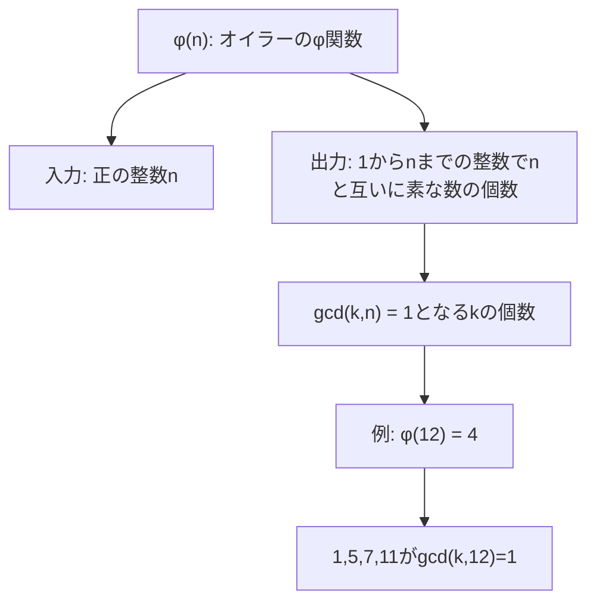
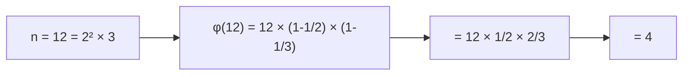
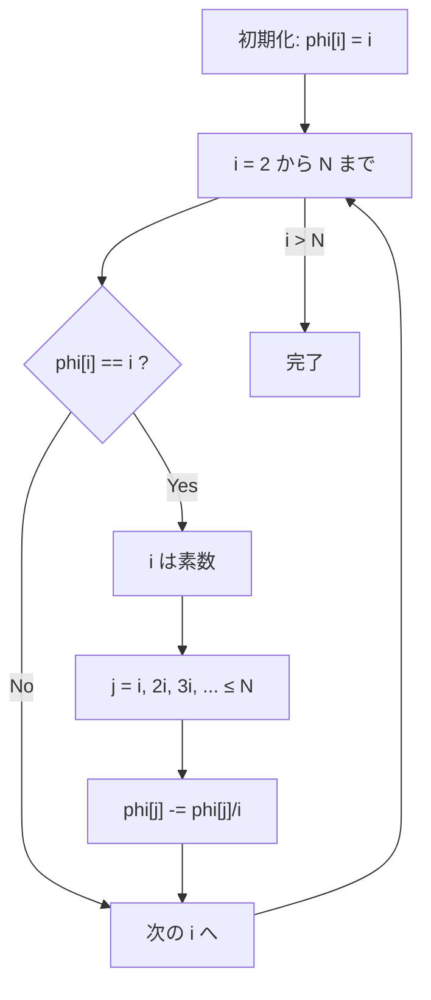
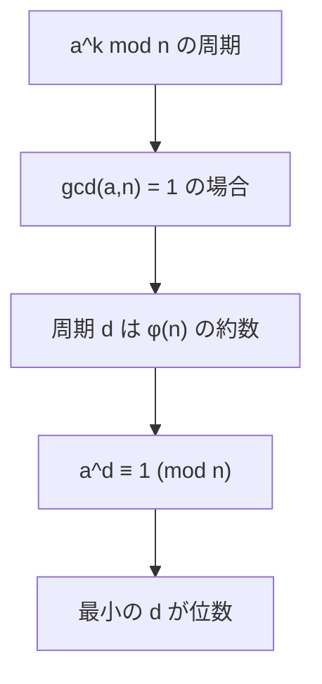

# オイラーのφ関数

オイラーのφ関数（Euler's totient function）は、数論において基礎的かつ重要な役割を果たす算術関数であり、競技プログラミングでは頻繁に登場する概念である。正の整数nに対して、1からnまでの整数のうちnと互いに素な整数の個数を表すこの関数は、モジュラー算術、暗号理論、組み合わせ論など幅広い分野で応用される。本稿では、オイラーのφ関数の数学的性質から始まり、効率的な計算アルゴリズム、そして競技プログラミングにおける典型的な応用例まで、体系的に解説する。

## 数学的定義と基本性質

オイラーのφ関数φ(n)は、正の整数nに対して以下のように定義される：

$$\phi(n) = |\{k : 1 \leq k \leq n, \gcd(k, n) = 1\}|$$

ここで、gcd(k, n)はkとnの最大公約数を表す。つまり、φ(n)は1からnまでの整数のうち、nと最大公約数が1である（互いに素である）整数の個数を表している。



最初にいくつかの小さな値に対するφ関数の値を見てみよう。φ(1) = 1（1は1と互いに素）、φ(2) = 1、φ(3) = 2、φ(4) = 2、φ(5) = 4、φ(6) = 2となる。これらの値から、素数pに対してはφ(p) = p - 1となることが観察できる。これは素数の定義から明らかで、素数pは1を除くp未満のすべての正の整数と互いに素であるためである。

オイラーのφ関数は乗法的関数（multiplicative function）である。つまり、gcd(m, n) = 1ならばφ(mn) = φ(m)φ(n)が成り立つ。この性質は、素因数分解を用いたφ関数の計算において重要な役割を果たす。

## 素因数分解による計算

任意の正の整数nが素因数分解により以下のように表されるとする：

$$n = p_1^{a_1} \cdot p_2^{a_2} \cdot ... \cdot p_k^{a_k}$$

このとき、オイラーのφ関数は次の公式で計算できる：

$$\phi(n) = n \prod_{i=1}^{k} \left(1 - \frac{1}{p_i}\right) = n \prod_{i=1}^{k} \frac{p_i - 1}{p_i}$$

この公式は、φ関数の乗法性と素数べきに対する値から導出される。素数pとその正のべきkに対して、φ(p^k) = p^k - p^(k-1) = p^(k-1)(p - 1)となることを利用している。



実装においては、まずnを素因数分解し、各素因数に対して上記の公式を適用する。以下は基本的な実装例である：

```cpp
long long euler_phi(long long n) {
    long long result = n;
    for (long long p = 2; p * p <= n; p++) {
        if (n % p == 0) {
            // Remove all factors of p
            while (n % p == 0) {
                n /= p;
            }
            // Apply formula: φ(n) = n * (1 - 1/p)
            result -= result / p;
        }
    }
    // If n > 1, then it's a prime factor
    if (n > 1) {
        result -= result / n;
    }
    return result;
}
```

この実装の時間計算量はO(√n)であり、単一の値に対するφ関数の計算には十分効率的である。

## エラトステネスの篩を応用した前計算

競技プログラミングでは、複数のnに対してφ(n)を求める必要がある場合が多い。このような場合、エラトステネスの篩のアイデアを応用して、1からNまでのすべてのφ関数の値を効率的に前計算できる。

```cpp
vector<int> compute_phi_table(int N) {
    vector<int> phi(N + 1);
    // Initialize phi[i] = i
    for (int i = 0; i <= N; i++) {
        phi[i] = i;
    }
    
    // Sieve-like approach
    for (int i = 2; i <= N; i++) {
        if (phi[i] == i) {  // i is prime
            for (int j = i; j <= N; j += i) {
                phi[j] -= phi[j] / i;
            }
        }
    }
    
    return phi;
}
```

この手法の背後にある考え方は、各素数pについて、pの倍数すべてに対してφ関数の値を更新することである。素数pがnの素因数である場合、φ(n) = n × (1 - 1/p)の公式に従って値を更新する。



この前計算の時間計算量はO(N log log N)であり、エラトステネスの篩と同じオーダーである。空間計算量はO(N)となる。

## オイラーの定理とその応用

オイラーのφ関数は、オイラーの定理と密接に関連している。オイラーの定理は、gcd(a, n) = 1のとき、以下が成り立つことを述べている：

$$a^{\phi(n)} \equiv 1 \pmod{n}$$

この定理は、フェルマーの小定理の一般化であり、モジュラー算術において極めて重要な役割を果たす。特に、モジュラー逆元の計算や、大きなべき乗の効率的な計算に応用される。

モジュラー逆元の計算において、gcd(a, n) = 1のとき、aのmod nにおける逆元は：

$$a^{-1} \equiv a^{\phi(n)-1} \pmod{n}$$

として計算できる。これは、a × a^(φ(n)-1) ≡ a^φ(n) ≡ 1 (mod n)となることから導かれる。

```cpp
long long mod_inverse(long long a, long long n) {
    // Compute φ(n)
    long long phi = euler_phi(n);
    // Return a^(φ(n)-1) mod n
    return mod_pow(a, phi - 1, n);
}
```

## 原始根とカーマイケル関数

オイラーのφ関数は、原始根（primitive root）の理論とも深く関わっている。整数gがmod nの原始根であるとは、g^k (k = 1, 2, ..., φ(n))がmod nで互いに異なるφ(n)個の値を取ることを意味する。言い換えれば、gの位数（order）がφ(n)に等しいということである。

原始根が存在するための必要十分条件は、nが1, 2, 4, p^k, 2p^k（ただしpは奇素数）のいずれかの形であることである。原始根の個数は、存在する場合φ(φ(n))個となる。

カーマイケル関数λ(n)は、オイラーのφ関数の改良版とも言える関数で、すべてのgcd(a, n) = 1なるaに対してa^λ(n) ≡ 1 (mod n)となる最小の正の整数λ(n)を与える。カーマイケル関数は以下のように定義される：

- λ(1) = 1
- λ(2) = 1, λ(4) = 2, λ(2^k) = 2^(k-2) (k ≥ 3)
- λ(p^k) = φ(p^k) = p^(k-1)(p-1) （pは奇素数）
- λ(mn) = lcm(λ(m), λ(n)) （gcd(m,n) = 1）

## 競技プログラミングにおける典型問題

オイラーのφ関数は、競技プログラミングにおいて様々な形で出題される。以下、典型的な問題パターンを見ていく。

### 1. 直接的なφ関数の計算

最も基本的なパターンは、与えられたnに対してφ(n)を求める問題である。前述の素因数分解による方法で解くことができる。

### 2. φ関数の総和

Σ_{i=1}^n φ(i)を求める問題は、数論的な考察を要する興味深い問題である。この和は、1からnまでの既約分数の個数と関連している。具体的には、分母がn以下の既約分数（0と1の間）の個数は、Σ_{i=1}^n φ(i) - 1となる。

```cpp
long long phi_sum(int n) {
    vector<int> phi = compute_phi_table(n);
    long long sum = 0;
    for (int i = 1; i <= n; i++) {
        sum += phi[i];
    }
    return sum;
}
```

### 3. べき乗の周期性

a^k mod nの値は、kが大きくなると周期的になる。この周期はφ(n)の約数であることが、オイラーの定理から保証される。特に、gcd(a, n) = 1の場合、周期はaのmod nにおける位数と呼ばれ、φ(n)の約数となる。



### 4. 反復べき乗

a^(a^(a^(...))) mod nのような反復べき乗の値を求める問題では、オイラーの定理を利用して指数部分を簡約化する。具体的には、以下の性質を利用する：

$$a^x \equiv a^{x \bmod \phi(n) + \phi(n)} \pmod{n} \quad (x \geq \log_2 n)$$

```cpp
long long tower_mod(vector<long long>& a, int idx, long long mod) {
    if (mod == 1) return 0;
    if (idx == a.size() - 1) return a[idx] % mod;
    
    long long phi = euler_phi(mod);
    long long exp = tower_mod(a, idx + 1, phi);
    
    // Check if exp >= log2(mod)
    if (exp >= 64 || (1LL << exp) >= mod) {
        exp = exp % phi + phi;
    }
    
    return mod_pow(a[idx], exp, mod);
}
```

## 数え上げ問題への応用

オイラーのφ関数は、様々な数え上げ問題にも応用される。例えば、円環上にn個の異なる色のビーズを配置する方法の数を求める問題（ネックレス問題）では、バーンサイドの補題と組み合わせてφ関数が使用される。

n個のビーズを円環上に配置する際、回転によって同じになる配置を同一視する場合、異なる配置の数は：

$$\frac{1}{n} \sum_{d|n} \phi(d) \cdot f(n/d)$$

ここで、f(k)はk個の周期で繰り返すパターンの数を表す。

## RSA暗号との関連

オイラーのφ関数は、現代暗号の基礎であるRSA暗号においても中心的な役割を果たす。RSA暗号では、2つの大きな素数p, qの積n = pqを法とし、φ(n) = (p-1)(q-1)を利用して暗号化・復号化を行う。

公開鍵eと秘密鍵dは、ed ≡ 1 (mod φ(n))を満たすように選ばれる。これにより、メッセージmに対して：

$$(m^e)^d \equiv m^{ed} \equiv m \pmod{n}$$

となり、暗号化と復号化が実現される。RSAの安全性は、nの素因数分解の困難性に依存しており、nからφ(n)を効率的に計算することの困難性とも関連している。

## 実装上の注意点とテクニック

競技プログラミングにおいてオイラーのφ関数を扱う際には、いくつかの実装上の注意点がある。

まず、オーバーフローに注意が必要である。φ(n)の計算過程で、一時的にnより大きな値を扱う可能性があるため、適切な型の選択と、必要に応じたモジュラー演算の適用が重要である。

```cpp
// Overflow-safe implementation
long long safe_euler_phi(long long n, long long mod) {
    long long result = n % mod;
    for (long long p = 2; p * p <= n; p++) {
        if (n % p == 0) {
            while (n % p == 0) n /= p;
            result = result / p * (p - 1) % mod;
        }
    }
    if (n > 1) {
        result = result / n * (n - 1) % mod;
    }
    return result;
}
```

また、複数のクエリに対応する場合は、前計算とメモ化を組み合わせることで効率化できる。特に、同じnに対して繰り返しφ(n)を計算する可能性がある場合は、結果をキャッシュすることで大幅な高速化が可能である。

## 一般化と拡張

オイラーのφ関数の概念は、より一般的な設定に拡張できる。例えば、多項式環における類似の概念や、有限体上での応用などがある。また、ヨルダンのトーシェント関数J_k(n)は、φ関数の一般化であり、k-タプル(a_1, ..., a_k)でgcd(a_1, ..., a_k, n) = 1となるものの個数を表す。特に、J_1(n) = φ(n)である。

デデキントのψ関数も関連する概念で、ψ(n) = n × Π_{p|n}(1 + 1/p)として定義される。この関数は、nの約数の逆数の和と関連している。

## 計算複雑性の観点から

オイラーのφ関数の計算複雑性は、素因数分解の複雑性と密接に関連している。現在知られている最も効率的な素因数分解アルゴリズムは準指数時間で動作するため、任意の大きな合成数に対してφ関数を効率的に計算することは困難である。

一方で、特殊な形の数に対しては効率的な計算が可能である。例えば、素数p、素数べきp^k、または既知の素因数分解を持つ数に対しては、φ関数は定数時間または線形時間で計算できる。

競技プログラミングの文脈では、通常扱う数の範囲が限定されているため、O(√n)の素因数分解アルゴリズムで十分な場合が多い。しかし、問題によってはより効率的なアプローチが必要となることもある。

## デバッグとテストのアプローチ

オイラーのφ関数の実装をデバッグする際には、以下の性質を利用してテストケースを作成すると効果的である：

1. φ(1) = 1
2. 素数pに対してφ(p) = p - 1
3. φ(2n) = φ(n) （nが奇数の場合）
4. φ(2n) = 2φ(n) （nが偶数の場合）
5. Σ_{d|n} φ(d) = n

特に最後の性質は、実装の正確性を検証する際に有用である。nの約数すべてに対するφ関数の値の和がnに等しくなることを確認することで、実装の妥当性をチェックできる。

```cpp
bool verify_phi_implementation(int n) {
    vector<int> divisors;
    for (int i = 1; i * i <= n; i++) {
        if (n % i == 0) {
            divisors.push_back(i);
            if (i != n / i) divisors.push_back(n / i);
        }
    }
    
    int sum = 0;
    for (int d : divisors) {
        sum += euler_phi(d);
    }
    
    return sum == n;
}
```

オイラーのφ関数は、その単純な定義にもかかわらず、数論の深い性質と密接に関わっており、競技プログラミングにおいても多様な応用を持つ。基本的な計算方法から始まり、効率的なアルゴリズム、そして様々な問題への応用まで、体系的に理解することで、より複雑な問題にも対処できるようになる。特に、モジュラー算術、数え上げ問題、暗号理論などの分野では、φ関数の理解が問題解決の鍵となることが多い。

---

[^1]: Euler, L. (1763). "Theoremata arithmetica nova methodo demonstrata". Novi Commentarii academiae scientiarum Petropolitanae 8, pp. 74-104.

[^2]: Hardy, G. H., & Wright, E. M. (2008). An Introduction to the Theory of Numbers (6th ed.). Oxford University Press.

[^3]: Knuth, D. E. (1997). The Art of Computer Programming, Volume 2: Seminumerical Algorithms (3rd ed.). Addison-Wesley.