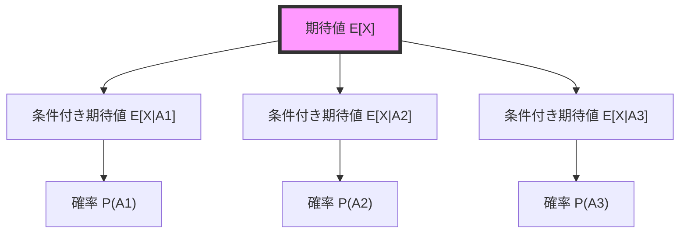
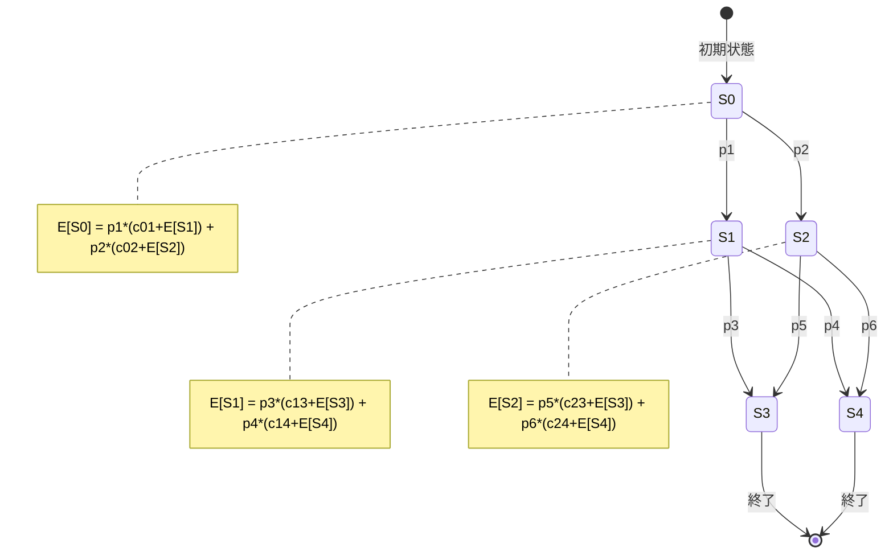
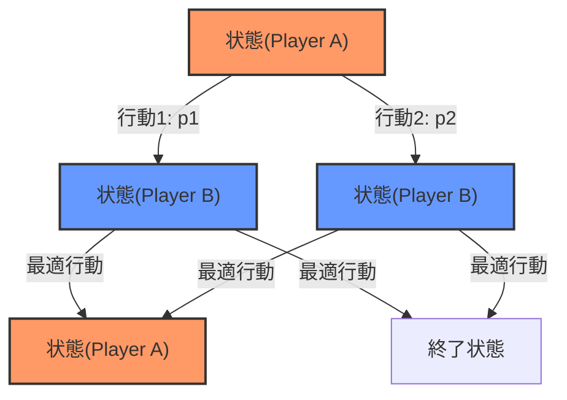

# 確率DP（期待値DP）

動的計画法（Dynamic Programming）は、複雑な問題を部分問題に分解し、その解を再利用することで効率的に解を求める手法である。確率DPは、この動的計画法を確率的な事象を含む問題に適用したものであり、特に期待値の計算において強力な手法となる。確率DPは、ゲーム理論、金融工学、機械学習など幅広い分野で応用されているが、競技プログラミングにおいても頻出のテーマである。

確率DPの本質は、確率的な状態遷移を持つシステムにおいて、各状態での期待値を再帰的に計算することにある。決定的な動的計画法が「ある状態からの最適値」を求めるのに対し、確率DPは「ある状態からの期待値」を求める。この違いは単純に見えるが、実装や計算の観点から多くの注意すべき点を含んでいる。

## 期待値の数学的基礎

期待値（Expected Value）は、確率変数が取りうる値とその確率の積の総和として定義される。離散確率変数 $X$ に対して、期待値 $E[X]$ は以下のように定義される¹。

$$E[X] = \sum_{x} x \cdot P(X = x)$$

連続確率変数の場合は積分で定義されるが、競技プログラミングにおいては主に離散的な問題を扱うため、本稿では離散確率変数に焦点を当てる。

期待値の重要な性質として、線形性がある。確率変数 $X, Y$ と定数 $a, b$ に対して、以下が成り立つ。

$$E[aX + bY] = aE[X] + bE[Y]$$

この性質は、複雑な期待値計算を分解する際に極めて重要である。また、条件付き期待値の法則（Law of Total Expectation）も確率DPにおいて中心的な役割を果たす。

$$E[X] = \sum_{i} E[X|A_i] \cdot P(A_i)$$

ここで、$\{A_i\}$ は標本空間の分割である。この法則により、複雑な期待値を条件付き期待値に分解して計算することが可能となる。



## 確率DPの基本構造

確率DPは、状態空間上で期待値を計算する手法である。各状態 $s$ に対して、その状態から始まった場合の期待値 $E[s]$ を求める。状態遷移が確率的である場合、期待値は以下の再帰式で表される。

$$E[s] = \sum_{s'} P(s \to s') \cdot (c(s, s') + E[s'])$$

ここで、$P(s \to s')$ は状態 $s$ から状態 $s'$ への遷移確率、$c(s, s')$ は遷移に伴うコストや報酬を表す。この再帰式は、ベルマン方程式の確率版と見なすことができる²。

確率DPの実装において重要なのは、状態の定義と遷移の把握である。状態は問題の本質を捉える必要十分な情報を含む必要があり、過度に細かくすると計算量が爆発し、粗すぎると正確な計算ができない。



## 実装上の考慮事項

確率DPの実装には、通常のDPとは異なる注意点がいくつか存在する。まず、浮動小数点数の精度問題である。確率計算では小さな値の積を繰り返すため、アンダーフローや丸め誤差が累積しやすい。C++では`double`型（約15桁の精度）を使用することが一般的だが、問題によっては`long double`型や任意精度演算が必要となる場合もある。

メモ化と表形式DPの選択も重要である。状態数が少ない場合は表形式DPが効率的だが、状態空間が疎な場合はメモ化が適している。以下に、典型的なメモ化による実装パターンを示す。

```cpp
// Memoization approach for expected value DP
map<State, double> memo;

double expectedValue(State s) {
    if (isTerminal(s)) return terminalValue(s);
    
    if (memo.count(s)) return memo[s];
    
    double ev = 0.0;
    for (auto [next, prob, cost] : getTransitions(s)) {
        ev += prob * (cost + expectedValue(next));
    }
    
    return memo[s] = ev;
}
```

循環参照の処理も確率DPに特有の課題である。状態遷移グラフに閉路が存在する場合、単純な再帰では無限ループに陥る。この場合、連立方程式として定式化し、ガウス消去法や反復法で解く必要がある。

## 典型的な問題パターンとその解法

確率DPが適用される問題には、いくつかの典型的なパターンが存在する。これらのパターンを理解することで、新しい問題に対しても適切なアプローチを選択できるようになる。

### サイコロ問題

最も基本的なパターンは、サイコロやコイン投げなどの確率的な操作を含む問題である。例えば、「サイコロを振って、出た目の合計が $N$ 以上になるまでの期待値」を求める問題を考える。

状態を「現在の合計値」として定義すると、期待値は以下の再帰式で表される。

$$E[s] = \begin{cases}
0 & (s \geq N) \\
1 + \frac{1}{6}\sum_{i=1}^{6} E[s+i] & (s < N)
\end{cases}$$

この式は、「次の一投 + その後の期待値」という構造を持っており、確率DPの基本的な考え方を表している。

### ゲーム理論との融合

確率DPは、ゲーム理論的な要素を含む問題にも適用される。例えば、二人のプレイヤーが交互に行動し、各プレイヤーが最適に行動する場合の期待値を求める問題である。

この場合、状態に「現在のプレイヤー」の情報を含める必要があり、各プレイヤーの目的（最大化/最小化）に応じて期待値を計算する。ミニマックス法の確率版と見なすことができる。



### マルコフ連鎖との関連

確率DPは、マルコフ連鎖の解析と密接に関連している。特に、吸収マルコフ連鎖における吸収までの期待ステップ数の計算は、確率DPの典型的な応用例である³。

マルコフ連鎖の遷移行列を $P$ とし、状態 $i$ から吸収状態までの期待ステップ数を $m_i$ とすると、以下の関係が成り立つ。

$$m_i = 1 + \sum_{j \in \text{non-absorbing}} P_{ij} \cdot m_j$$

これは確率DPの再帰式そのものであり、行列形式で表現すると $(I - Q)m = 1$ となる。ここで $Q$ は非吸収状態間の遷移行列である。

## 計算量の解析と最適化

確率DPの計算量は、状態数を $|S|$、各状態からの遷移数を $|T|$ とすると、一般に $O(|S| \cdot |T|)$ となる。しかし、状態空間が大きい場合や、精度要求が高い場合には、さらなる最適化が必要となる。

状態数削減の手法として、対称性の利用がある。問題に回転対称性や鏡像対称性がある場合、等価な状態をまとめることで状態数を大幅に削減できる。また、到達可能性解析により、実際に到達する状態のみを考慮することも重要である。

計算順序の最適化も効果的である。トポロジカルソートにより依存関係を整理し、必要な状態のみを計算することで、無駄な計算を避けることができる。循環がある場合でも、強連結成分分解により、各成分内で連立方程式を解くことで効率化が可能である。

## 数値的安定性と精度管理

確率計算における数値的安定性は、実装の正確性に直結する重要な問題である。特に、小さな確率の積を繰り返し計算する場合、アンダーフローや有効桁数の損失が発生しやすい。

対数確率の使用は、この問題に対する標準的な解決策である。確率 $p$ の代わりに $\log p$ を扱うことで、積が和に変換され、数値的に安定した計算が可能となる。ただし、対数空間での加算（元の空間での加算に対応）には、log-sum-exp トリックなどの工夫が必要である。

$$\log(e^a + e^b) = \max(a, b) + \log(1 + e^{-|a-b|})$$

精度要求に応じた型の選択も重要である。競技プログラミングでは通常 `double` 型で十分だが、金融計算などでは任意精度演算が必要となる場合もある。問題の性質と要求精度を見極めて適切な実装を選択する必要がある。

## 高度な技法と発展的話題

確率DPの応用範囲は広く、より高度な技法と組み合わせることで、複雑な問題にも対応できる。ここでは、いくつかの発展的な話題について述べる。

### 連続状態空間への拡張

これまで離散的な状態空間を前提としてきたが、連続的な状態空間を扱う必要がある場合もある。この場合、状態空間を離散化するか、関数近似を用いる必要がある。

離散化においては、グリッドの粒度と計算量のトレードオフが重要である。適応的メッシュ細分化により、重要な領域では細かく、そうでない領域では粗く離散化することで、効率的な計算が可能となる。

### 多段決定過程との関連

確率DPは、強化学習の基礎となる多段決定過程（MDP: Markov Decision Process）と密接に関連している⁴。MDPにおける価値反復法は、確率DPの一般化と見なすことができる。

MDPでは、各状態で行動を選択でき、選択した行動により遷移確率が変化する。最適方策の下での期待値（価値関数）は、ベルマン最適方程式を満たす。

$$V^*(s) = \max_a \sum_{s'} P(s'|s,a) [R(s,a,s') + \gamma V^*(s')]$$

ここで、$\gamma$ は割引率である。この方程式を反復的に解くことで、最適価値関数と最適方策を同時に求めることができる。

### 近似アルゴリズムとの組み合わせ

状態空間が非常に大きい場合、厳密な確率DPは計算不可能となる。この場合、モンテカルロ法やTD学習などの近似手法と組み合わせることで、実用的な解を得ることができる。

モンテカルロ法では、多数のシミュレーションにより期待値を推定する。中心極限定理により、推定誤差は試行回数の平方根に反比例して減少する。一方、TD学習では、部分的な経験から価値関数を逐次的に更新する。

これらの手法は、確率DPの理論的基礎の上に構築されており、問題の性質に応じて適切に選択・組み合わせることが重要である。

## 実装例：期待値最大化問題

ここで、確率DPの具体的な実装例として、期待値最大化問題を考える。$N$ 個の選択肢があり、各選択肢 $i$ は確率 $p_i$ で報酬 $r_i$ を得られるとする。$K$ 回の試行で得られる報酬の期待値を最大化したい。

この問題は、状態を「残り試行回数」として、以下の再帰式で解ける。

```cpp
// State: remaining trials
// Returns: maximum expected reward
double maxExpectedReward(int remaining, vector<double>& prob, vector<double>& reward) {
    static vector<double> dp(K + 1, -1);
    
    if (remaining == 0) return 0;
    if (dp[remaining] >= 0) return dp[remaining];
    
    double maxEV = 0;
    for (int i = 0; i < N; i++) {
        double ev = prob[i] * reward[i] + maxExpectedReward(remaining - 1, prob, reward);
        maxEV = max(maxEV, ev);
    }
    
    return dp[remaining] = maxEV;
}
```

この実装は単純だが、確率DPの本質を表している。各状態で最適な選択を行い、その期待値を計算している。

## 確率DPの限界と代替手法

確率DPは強力な手法だが、すべての問題に適用できるわけではない。主な限界として、状態空間の爆発、循環依存の処理の複雑さ、連続時間システムへの適用の困難さなどがある。

状態空間が指数的に増大する問題では、近似動的計画法やヒューリスティック探索が有効である。A*アルゴリズムやビームサーチなどの探索手法と組み合わせることで、実用的な解を得ることができる。

循環依存が複雑な場合、線形計画法やセミマルコフ決定過程などの定式化が有効な場合がある。これらの手法は、確率DPとは異なる観点から問題を捉え、効率的な解法を提供する。

連続時間システムでは、確率微分方程式やジャンプ過程の理論が必要となる。これらは確率DPの連続時間版と見なすことができるが、解析的・数値的な扱いは大きく異なる。

## 競技プログラミングにおける実践的技法

確率DPの理論的理解と実践的な実装には大きな隔たりがある。ここでは、競技プログラミングで確率DPを実装する際の具体的な技法とパターンを詳述する。

### 頻出パターンの分類と実装

競技プログラミングにおける確率DPの問題は、いくつかの典型的なパターンに分類できる。これらのパターンを認識し、適切な実装方法を選択することが重要である。

**ランダムウォーク型問題**は、グリッド上や数直線上を確率的に移動する問題である。例として、「グリッド上を各方向に等確率で移動し、特定のマスに到達する期待ステップ数」を考える。この種の問題では、状態を座標で表現し、隣接する状態への遷移を考慮する。

```cpp
// Grid random walk expected steps
double expectedSteps[MAX_N][MAX_N];
bool visited[MAX_N][MAX_N];

double solve(int x, int y) {
    if (x == targetX && y == targetY) return 0;
    if (visited[x][y]) return expectedSteps[x][y];
    
    visited[x][y] = true;
    double ev = 1.0;  // Current step
    int validMoves = 0;
    
    for (int d = 0; d < 4; d++) {
        int nx = x + dx[d], ny = y + dy[d];
        if (isValid(nx, ny)) {
            ev += solve(nx, ny) / 4.0;
            validMoves++;
        }
    }
    
    // Handle boundary reflection
    ev += (4 - validMoves) * solve(x, y) / 4.0;
    
    // Solve linear equation: E[x][y] = 1 + p * E[x][y] + ...
    return expectedSteps[x][y] = ev * 4.0 / validMoves;
}
```

**カード・コイン収集型問題**では、確率的に要素を収集し、全て集めるまでの期待値を求める。クーポンコレクター問題がこの典型例である。状態をビットマスクで管理し、未収集の要素に対する遷移を考慮する。

### デバッグ技法と検証方法

確率DPのデバッグは、通常のアルゴリズムより困難である。期待値の正確性を検証するための手法をいくつか紹介する。

**小規模ケースの手計算**は最も基本的な検証方法である。状態数が少ない場合、全ての期待値を手計算し、プログラムの出力と比較する。特に、境界条件や特殊ケースの検証に有効である。

**モンテカルロシミュレーションによる検証**も強力な手法である。確率DPで計算した期待値と、大量のシミュレーションによる経験的期待値を比較することで、実装の正確性を検証できる。

```cpp
// Monte Carlo verification
double monteCarloVerify(int initialState, int numTrials) {
    double totalValue = 0;
    for (int trial = 0; trial < numTrials; trial++) {
        int state = initialState;
        double value = 0;
        while (!isTerminal(state)) {
            auto [nextState, reward] = simulateTransition(state);
            value += reward;
            state = nextState;
        }
        totalValue += value;
    }
    return totalValue / numTrials;
}
```

**確率の総和チェック**も重要である。各状態からの遷移確率の総和が1になることを確認する。これは実装ミスを発見する簡単かつ効果的な方法である。

### よくある実装ミスとその対策

確率DPの実装では、特有のミスが発生しやすい。これらを認識し、対策を講じることが重要である。

**循環依存の不適切な処理**は最も一般的なミスである。状態遷移グラフに閉路がある場合、単純なメモ化では正しい結果が得られない。この場合、連立方程式として解くか、反復法を使用する必要がある。

```cpp
// Iterative method for cyclic dependencies
void solveWithIteration(double eps = 1e-9) {
    vector<double> prev(N), curr(N);
    
    while (true) {
        double maxDiff = 0;
        for (int i = 0; i < N; i++) {
            curr[i] = computeExpectedValue(i, prev);
            maxDiff = max(maxDiff, abs(curr[i] - prev[i]));
        }
        
        if (maxDiff < eps) break;
        prev = curr;
    }
}
```

**浮動小数点数の比較ミス**も頻繁に発生する。等号比較の代わりに、適切な許容誤差を設定した比較を行う必要がある。

**初期化の誤り**は、特にメモ化実装で問題となる。未計算の状態と計算済みの状態を区別するため、適切な初期値（通常は負の値やNaN）を使用する。

### 効率的な実装のための最適化技法

確率DPの実行時間を改善するための最適化技法をいくつか紹介する。

**状態圧縮**は、メモリ使用量と実行時間の両方を改善する。例えば、順序が重要でない要素の集合を扱う場合、組み合わせの数で状態を表現することで、状態数を大幅に削減できる。

**遷移の前計算**も効果的である。状態遷移が複雑な計算を含む場合、可能な遷移を事前に計算しておくことで、DPの実行時間を短縮できる。

**疎な状態空間の活用**では、実際に到達可能な状態のみを考慮する。幅優先探索などで到達可能性を判定し、不要な状態の計算を省略する。

## 高度な実装パターンと応用

確率DPの応用は基本的なパターンに留まらない。より複雑な問題に対応するための高度な技法を紹介する。

### 多次元確率DPの実装

複数の確率的要素が絡む問題では、多次元の状態空間を扱う必要がある。例えば、複数のサイコロを同時に振る問題や、複数のプレイヤーが関与する問題などである。

状態の次元が増えると、メモリ使用量が指数的に増大する。この問題に対処するため、次元削減技法や、動的メモリ割り当てを活用する。

```cpp
// Multi-dimensional probability DP with dynamic allocation
unordered_map<vector<int>, double, VectorHash> memo;

double solveMultiDim(const vector<int>& state) {
    if (isTerminalState(state)) return 0;
    
    if (memo.count(state)) return memo[state];
    
    double ev = 0;
    for (const auto& [nextState, prob, cost] : getTransitions(state)) {
        ev += prob * (cost + solveMultiDim(nextState));
    }
    
    return memo[state] = ev;
}
```

### 期待値の線形性を活用した分解

複雑な問題を、期待値の線形性を利用して単純な部分問題に分解することができる。例えば、複数の独立した確率過程が同時に進行する場合、各過程の期待値を個別に計算し、それらを合計することで全体の期待値を得られる。

この技法は、問題の構造を見抜く洞察力が必要だが、計算量を劇的に削減できる場合がある。

### 確率DPと他のアルゴリズムの融合

確率DPは、他のアルゴリズムと組み合わせることで、より複雑な問題を解決できる。

**セグメント木との組み合わせ**では、状態遷移が区間クエリを含む場合に有効である。期待値の更新と区間和の計算を効率的に行える。

**二分探索との組み合わせ**は、パラメトリックな確率DPで使用される。例えば、「成功確率を $p$ 以上にするための最小コスト」を求める問題では、コストに対して二分探索を行い、各コストでの成功確率を確率DPで計算する。

## 実装時の詳細な注意事項

確率DPの実装において見落としがちな詳細について述べる。

### メモリ管理の最適化

大規模な状態空間を扱う場合、メモリ使用量が制約となることが多い。以下の技法により、メモリ効率を改善できる。

**ローリングアレイ**は、DPテーブルの一部のみを保持する技法である。前の数ステップの情報のみが必要な場合に有効である。

**状態の再番号付け**により、疎な状態空間を密に詰めることができる。到達可能な状態のみに連続した番号を割り当てることで、配列のサイズを削減する。

### 数値精度の詳細な管理

確率計算では、極めて小さい値や大きい値を扱うことがある。以下の技法により、数値精度を保つことができる。

**スケーリング**により、値の範囲を適切に調整する。例えば、非常に小さな確率を扱う場合、適切な定数を掛けて計算し、最後に調整する。

**Kahan加算アルゴリズム**は、多数の浮動小数点数を加算する際の精度損失を防ぐ。確率DPで多くの項を加算する場合に有効である。

```cpp
// Kahan summation for improved precision
double kahanSum(const vector<double>& values) {
    double sum = 0.0;
    double c = 0.0;  // Compensation for lost low-order bits
    
    for (double value : values) {
        double y = value - c;
        double t = sum + y;
        c = (t - sum) - y;
        sum = t;
    }
    
    return sum;
}
```

## 結論に代えて：確率DPの本質的理解

確率DPは、確率的な現象を含む最適化問題に対する体系的なアプローチを提供する。その本質は、複雑な確率的過程を状態遷移として捉え、期待値の再帰的構造を利用することにある。

実装においては、数値的安定性、計算量、メモリ使用量などの実践的な考慮が必要である。また、問題の性質に応じて、厳密解法と近似解法を適切に選択することが重要である。本稿で述べた各種の技法とパターンを理解し、適切に適用することで、幅広い確率的問題に対応できるようになる。

確率DPの理解は、より高度な確率的最適化手法への入り口でもある。強化学習、確率的制御理論、金融工学など、多くの分野で確率DPの考え方が基礎となっている。競技プログラミングにおける確率DPの習得は、これらの分野への橋渡しともなるだろう。

実践的な観点から見ると、確率DPは単なるアルゴリズムではなく、確率的思考と計算機科学を融合させた問題解決のフレームワークである。この思考法を身につけることで、不確実性を含む現実世界の問題に対しても、体系的なアプローチが可能となる。

---

¹ Feller, W. (1968). An Introduction to Probability Theory and Its Applications, Vol. 1, 3rd Edition. Wiley.

² Bertsekas, D. P. (2012). Dynamic Programming and Optimal Control, Vol. 1, 4th Edition. Athena Scientific.

³ Kemeny, J. G., & Snell, J. L. (1976). Finite Markov Chains. Springer-Verlag.

⁴ Sutton, R. S., & Barto, A. G. (2018). Reinforcement Learning: An Introduction, 2nd Edition. MIT Press.