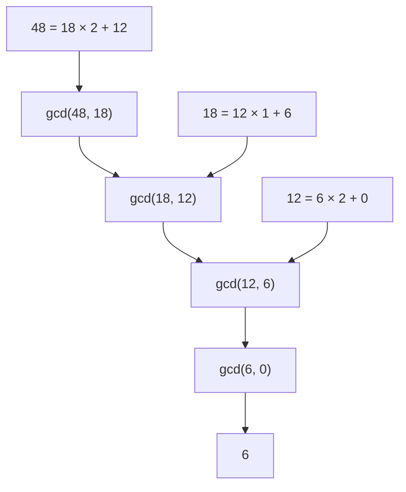
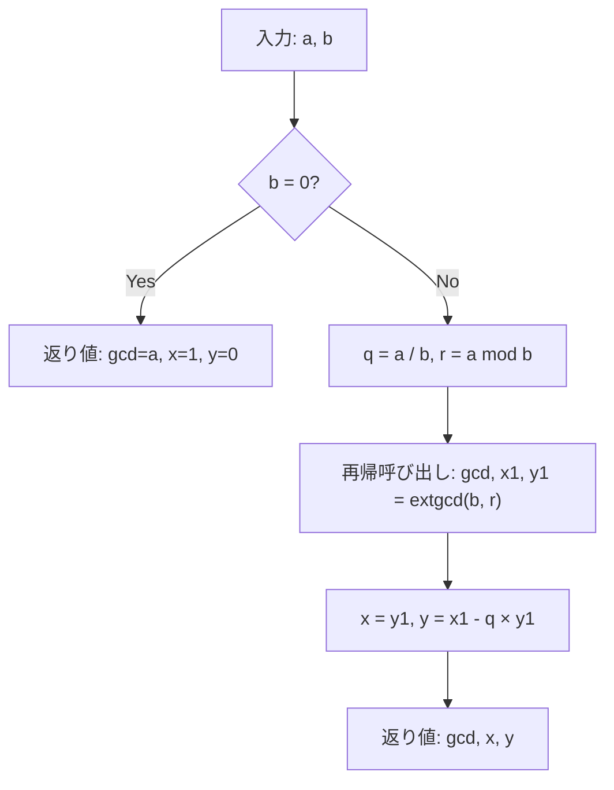
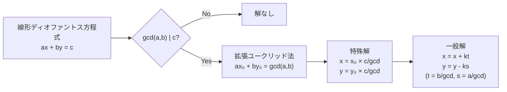

# 拡張ユークリッドの互除法

拡張ユークリッドの互除法（Extended Euclidean Algorithm）は、古代ギリシャの数学者ユークリッドが紀元前300年頃に著した『原論』第7巻に記述されたユークリッドの互除法を拡張したアルゴリズムです。通常のユークリッドの互除法が二つの整数の最大公約数（GCD）を求めるアルゴリズムであるのに対し、拡張版はベズーの恒等式 $ax + by = \gcd(a, b)$ を満たす整数係数 $x, y$ を同時に計算します。

このアルゴリズムは、現代の暗号理論、数論、計算機代数において極めて重要な役割を果たしています。RSA暗号の鍵生成、有限体上の演算、線形ディオファントス方程式の解法など、多くの応用分野で基礎となる計算手法として使用されています。特に競技プログラミングにおいては、モジュラー逆元の計算、中国剰余定理の実装、分数演算の効率化など、様々な問題を解く際の基本的なツールとなっています。

## ユークリッドの互除法の基礎

拡張ユークリッドの互除法を理解するためには、まず通常のユークリッドの互除法の仕組みを正確に理解する必要があります。ユークリッドの互除法は、以下の数学的性質に基づいています：

$$\gcd(a, b) = \gcd(b, a \bmod b) \quad (b \neq 0)$$

この性質は、$a$ を $b$ で割った余りを $r = a \bmod b$ とすると、$a = bq + r$ （$q$ は商）と表せることから導かれます。$a$ と $b$ の公約数は必ず $b$ と $r$ の公約数でもあり、逆も成り立つため、両者の最大公約数は等しくなります。



このアルゴリズムの計算量は $O(\log(\min(a, b)))$ であり、フィボナッチ数列の隣接する二項に対して最悪計算量を達成します。これはラメの定理として知られており、1844年にガブリエル・ラメによって証明されました[^1]。

## 拡張ユークリッドの互除法の定義

拡張ユークリッドの互除法は、二つの整数 $a, b$ に対して、以下の三つの値を計算します：

1. $\gcd(a, b)$：$a$ と $b$ の最大公約数
2. $x$：ベズーの恒等式における $a$ の係数
3. $y$：ベズーの恒等式における $b$ の係数

これらは次の関係を満たします：

$$ax + by = \gcd(a, b)$$

この等式はベズーの恒等式（Bézout's identity）と呼ばれ、1624年にクロード・ガスパール・バシェ・ド・メジリアックによって初めて記述され、後にエティエンヌ・ベズーによって一般化されました[^2]。

重要な点は、この恒等式が常に整数解を持つことです。これは、$\gcd(a, b)$ が $a$ と $b$ の線形結合として表現可能であることを意味し、この性質が多くの数論的問題の解法の基礎となっています。

## アルゴリズムの詳細

拡張ユークリッドの互除法の核心は、通常のユークリッドの互除法の各ステップで生成される商と余りの情報を用いて、ベズー係数を逆算していくことにあります。アルゴリズムは再帰的にも反復的にも実装できますが、まず数学的な構造を理解するために再帰的な観点から説明します。

基本的なアイデアは、$\gcd(a, b) = \gcd(b, a \bmod b)$ の関係を利用して、より小さい問題に帰着させることです。$b \neq 0$ の場合、再帰的に $\gcd(b, a \bmod b) = bx_1 + (a \bmod b)y_1$ を計算したとします。ここで $a \bmod b = a - \lfloor a/b \rfloor \cdot b$ であることを利用すると：

$$\gcd(b, a \bmod b) = bx_1 + (a - \lfloor a/b \rfloor \cdot b)y_1$$
$$= ay_1 + b(x_1 - \lfloor a/b \rfloor \cdot y_1)$$

したがって、$x = y_1$、$y = x_1 - \lfloor a/b \rfloor \cdot y_1$ とすることで、$ax + by = \gcd(a, b)$ を満たす係数が得られます。



## 数学的証明と正当性

拡張ユークリッドの互除法の正当性を証明するには、以下の二つを示す必要があります：

1. アルゴリズムが正しく $\gcd(a, b)$ を計算すること
2. 計算される $x, y$ が実際に $ax + by = \gcd(a, b)$ を満たすこと

第一の点は通常のユークリッドの互除法の正当性から直ちに従います。第二の点について、数学的帰納法を用いて証明します。

**基底ケース**：$b = 0$ のとき、$\gcd(a, 0) = a$ であり、$x = 1, y = 0$ とすると $a \cdot 1 + 0 \cdot 0 = a$ となり、確かに成立します。

**帰納ステップ**：$b > 0$ とし、任意の $0 \leq c < b$ に対して命題が成立すると仮定します。$r = a \bmod b$ とすると $0 \leq r < b$ であるため、帰納法の仮定より：

$$\gcd(b, r) = bx_1 + ry_1$$

を満たす $x_1, y_1$ が存在します。ここで $r = a - \lfloor a/b \rfloor b$ を代入すると：

$$\gcd(b, r) = bx_1 + (a - \lfloor a/b \rfloor b)y_1 = ay_1 + b(x_1 - \lfloor a/b \rfloor y_1)$$

$\gcd(a, b) = \gcd(b, r)$ であることと、$x = y_1, y = x_1 - \lfloor a/b \rfloor y_1$ とすることで、$ax + by = \gcd(a, b)$ が成立します。

## 実装の詳細と最適化

拡張ユークリッドの互除法の実装には、再帰的実装と反復的実装の二つの主要なアプローチがあります。再帰的実装は理解しやすく、数学的な定義に忠実ですが、深い再帰によるスタックオーバーフローのリスクがあります。一方、反復的実装はメモリ効率が良く、実用的です。

再帰的実装の基本形は以下のようになります：

```cpp
// Recursive implementation of extended Euclidean algorithm
// Returns gcd(a, b) and finds x, y such that ax + by = gcd(a, b)
long long extgcd(long long a, long long b, long long &x, long long &y) {
    if (b == 0) {
        x = 1;
        y = 0;
        return a;
    }
    long long x1, y1;
    long long gcd = extgcd(b, a % b, x1, y1);
    x = y1;
    y = x1 - (a / b) * y1;
    return gcd;
}
```

反復的実装では、係数の更新を追跡しながらループを用いて計算を行います：

```cpp
// Iterative implementation of extended Euclidean algorithm
long long extgcd_iterative(long long a, long long b, long long &x, long long &y) {
    long long x0 = 1, x1 = 0;
    long long y0 = 0, y1 = 1;
    
    while (b != 0) {
        long long q = a / b;
        long long r = a % b;
        
        a = b;
        b = r;
        
        long long new_x = x0 - q * x1;
        x0 = x1;
        x1 = new_x;
        
        long long new_y = y0 - q * y1;
        y0 = y1;
        y1 = new_y;
    }
    
    x = x0;
    y = y0;
    return a;
}
```

実装上の重要な考慮事項として、整数オーバーフローへの対処があります。特に、係数 $x, y$ は入力値よりも大きくなる可能性があるため、適切な型選択が必要です。また、負の数を扱う場合の除算と剰余演算の挙動にも注意が必要です。C++では、$a \bmod b$ の符号は $a$ の符号と同じになりますが、これは言語によって異なる場合があります。

## モジュラー逆元の計算

拡張ユークリッドの互除法の最も重要な応用の一つが、モジュラー逆元の計算です。整数 $a$ の法 $m$ におけるモジュラー逆元とは、$ax \equiv 1 \pmod{m}$ を満たす整数 $x$ のことです。この逆元が存在するための必要十分条件は $\gcd(a, m) = 1$ であることです。

拡張ユークリッドの互除法を用いて $ax + my = 1$ を満たす $x, y$ を求めると、$ax \equiv 1 \pmod{m}$ が成立するため、$x$ が求めるモジュラー逆元となります。ただし、$x$ が負の場合は $x + m$ を返すなどの調整が必要です：

```cpp
// Calculate modular inverse of a modulo m
// Returns -1 if inverse doesn't exist
long long mod_inverse(long long a, long long m) {
    long long x, y;
    long long g = extgcd(a, m, x, y);
    if (g != 1) return -1;  // Inverse doesn't exist
    return (x % m + m) % m;  // Ensure positive result
}
```

モジュラー逆元は、有限体上の除算、組み合わせ数の計算、線形合同方程式の解法など、多くの場面で使用されます。特に競技プログラミングでは、大きな素数（通常 $10^9 + 7$ や $998244353$）を法とする計算において頻繁に登場します。

## 線形ディオファントス方程式

拡張ユークリッドの互除法のもう一つの重要な応用は、線形ディオファントス方程式 $ax + by = c$ の整数解を求めることです。この方程式が整数解を持つための必要十分条件は、$c$ が $\gcd(a, b)$ の倍数であることです。

解が存在する場合、まず $ax_0 + by_0 = \gcd(a, b)$ を満たす $x_0, y_0$ を拡張ユークリッドの互除法で求め、両辺に $c / \gcd(a, b)$ を掛けることで、一つの特殊解を得ることができます：

$$x = x_0 \cdot \frac{c}{\gcd(a, b)}, \quad y = y_0 \cdot \frac{c}{\gcd(a, b)}$$

さらに、一般解は以下の形で表されます：

$$x = x_0 \cdot \frac{c}{\gcd(a, b)} + k \cdot \frac{b}{\gcd(a, b)}$$
$$y = y_0 \cdot \frac{c}{\gcd(a, b)} - k \cdot \frac{a}{\gcd(a, b)}$$

ここで $k$ は任意の整数です。この一般解の形は、解空間が一次元の格子であることを示しています。



## 中国剰余定理との関係

中国剰余定理（Chinese Remainder Theorem, CRT）は、互いに素な法に関する連立合同方程式を解くための定理です。拡張ユークリッドの互除法は、CRTの構成的証明と実装において中心的な役割を果たします。

二つの合同式 $x \equiv a_1 \pmod{m_1}$ と $x \equiv a_2 \pmod{m_2}$ （ただし $\gcd(m_1, m_2) = 1$）を考えます。拡張ユークリッドの互除法を用いて $m_1 u + m_2 v = 1$ を満たす $u, v$ を求めると、解は以下のように構成できます：

$$x = a_1 m_2 v + a_2 m_1 u \pmod{m_1 m_2}$$

この構成法の正当性は、$m_1 u \equiv 1 \pmod{m_2}$ かつ $m_2 v \equiv 1 \pmod{m_1}$ であることから確認できます。より一般的な場合（$n$ 個の合同式）への拡張も、同様の手法で行うことができます。

## 分数の簡約と有理数演算

拡張ユークリッドの互除法は、分数の簡約や有理数の演算においても有用です。分数 $p/q$ を既約分数に変換するには、$\gcd(p, q)$ で分子と分母を割ればよいですが、拡張版を使用することで、より高度な演算が可能になります。

例えば、二つの分数 $a/b$ と $c/d$ の和を計算する際、通常は $\frac{ad + bc}{bd}$ として計算しますが、分母が非常に大きくなる可能性があります。拡張ユークリッドの互除法を使用することで、オーバーフローを回避しながら計算することができます：

```cpp
// Add two fractions a/b + c/d and return the result in reduced form
struct Fraction {
    long long num, den;
    
    void reduce() {
        long long g = gcd(abs(num), abs(den));
        num /= g;
        den /= g;
        if (den < 0) {
            num = -num;
            den = -den;
        }
    }
    
    Fraction operator+(const Fraction& other) const {
        // Calculate lcm(b, d) = b * d / gcd(b, d) to avoid overflow
        long long g = gcd(den, other.den);
        long long lcm = den / g * other.den;
        
        Fraction result;
        result.num = num * (lcm / den) + other.num * (lcm / other.den);
        result.den = lcm;
        result.reduce();
        return result;
    }
};
```

## 多項式GCDへの拡張

拡張ユークリッドの互除法の概念は、整数から多項式環へと自然に拡張されます。多項式 $f(x), g(x)$ に対して、$a(x)f(x) + b(x)g(x) = \gcd(f(x), g(x))$ を満たす多項式 $a(x), b(x)$ を求めることができます。

多項式版のアルゴリズムは、整数版と同じ構造を持ちますが、除算を多項式の除算に、剰余を多項式の剰余に置き換えます。この拡張は、符号理論、計算機代数、数値解析など、多くの分野で応用されています。

アルゴリズムの基本的な流れは整数版と同じですが、係数の計算がより複雑になります。特に、有限体上の多項式を扱う場合は、係数演算にモジュラー算術を組み合わせる必要があります。

## 計算量と性能特性

拡張ユークリッドの互除法の時間計算量は、通常のユークリッドの互除法と同じ $O(\log(\min(a, b)))$ です。これは、各反復で少なくとも一方の引数が半分以下になるためです。より正確には、フィボナッチ数列 $F_n$ に対して、$\gcd(F_{n+1}, F_n)$ の計算に正確に $n-1$ 回の除算が必要となり、これが最悪ケースとなります。

空間計算量は、再帰的実装では $O(\log(\min(a, b)))$ のスタック空間を使用しますが、反復的実装では $O(1)$ の追加空間で済みます。実用上は、反復的実装の方が好まれることが多いです。

ビット演算の観点から見ると、$n$ ビットの整数に対する拡張ユークリッドの互除法の計算量は $O(n^2)$ となります。これは、各除算操作が $O(n)$ ビット演算を必要とし、最大で $O(n)$ 回の除算が行われるためです。

## 数値的安定性と精度

拡張ユークリッドの互除法は理論的には正確ですが、実装上はいくつかの数値的な問題に注意する必要があります。特に、係数 $x, y$ は入力値よりもはるかに大きくなる可能性があります。

例えば、$\gcd(F_n, F_{n-1}) = 1$ （$F_n$ はフィボナッチ数）の場合、ベズー係数の絶対値は $F_{n-2}$ 程度まで大きくなることが知られています。これは、32ビット整数で扱える範囲を容易に超える可能性があることを意味します。

また、浮動小数点数を使用した近似的な実装も考えられますが、整数の厳密な性質を利用するアルゴリズムであるため、一般的には推奨されません。必要に応じて、多倍長整数ライブラリを使用することが適切です。

## セキュリティへの応用

拡張ユークリッドの互除法は、現代暗号理論において基礎的な役割を果たしています。RSA暗号では、秘密鍵 $d$ を公開鍵 $e$ と $\phi(n) = (p-1)(q-1)$ から計算する際に、$ed \equiv 1 \pmod{\phi(n)}$ を満たす $d$ を求める必要があり、これはまさにモジュラー逆元の計算です。

楕円曲線暗号（ECC）においても、有限体上の除算操作でモジュラー逆元が必要となります。特に、楕円曲線上の点の加算や倍加操作では、座標の計算で頻繁に逆元計算が発生します。

これらの暗号システムでは、サイドチャネル攻撃への耐性も重要です。拡張ユークリッドの互除法の実行時間は入力に依存するため、タイミング攻撃に脆弱である可能性があります。セキュリティが重要な実装では、定数時間アルゴリズムの使用が推奨されます。

## 実装上の落とし穴と対策

拡張ユークリッドの互除法を実装する際によく遭遇する問題と、その対策について説明します。

最も一般的な問題は整数オーバーフローです。特に、中間計算で現れる $\lfloor a/b \rfloor \cdot y_1$ の計算は、$a, b, y_1$ が大きい場合にオーバーフローしやすいです。これを防ぐには、より大きな整数型を使用するか、計算順序を工夫する必要があります。

負の数の扱いも注意が必要です。多くのプログラミング言語では、負の数の除算と剰余の定義が数学的な定義と異なる場合があります。例えば、C++では `-7 % 3 = -1` となりますが、数学的には $2$ が期待される場合があります。

```cpp
// Safe modulo operation that always returns non-negative result
long long safe_mod(long long a, long long b) {
    return ((a % b) + b) % b;
}
```

また、$b = 0$ の場合の処理も重要です。数学的には $\gcd(a, 0) = |a|$ ですが、$a = 0$ の場合は $\gcd(0, 0) = 0$ とする実装が一般的です。ただし、この場合のベズー係数は一意に定まらないため、適切な値を選択する必要があります。

## 並列化と最適化技術

拡張ユークリッドの互除法は本質的に逐次的なアルゴリズムですが、複数の独立した計算を行う場合は並列化が可能です。例えば、多数のモジュラー逆元を計算する場合や、中国剰余定理で複数の係数を求める場合などです。

バイナリGCDアルゴリズム（Stein's algorithm）を拡張版に適用することで、除算を使わずにビットシフトと減算のみで計算することも可能です。これは、除算が高コストなアーキテクチャでは有効な最適化となります：

```cpp
// Binary extended GCD (simplified version)
long long binary_extgcd(long long a, long long b, long long &x, long long &y) {
    if (a == 0) {
        x = 0; y = 1;
        return b;
    }
    
    long long u = 1, v = 0, s = 0, t = 1;
    int shift = 0;
    
    // Remove common factors of 2
    while ((a & 1) == 0 && (b & 1) == 0) {
        a >>= 1; b >>= 1; shift++;
    }
    
    long long alpha = a, beta = b;
    
    while (a != 0) {
        while ((a & 1) == 0) {
            a >>= 1;
            if ((u & 1) == 0 && (v & 1) == 0) {
                u >>= 1; v >>= 1;
            } else {
                u = (u + beta) >> 1;
                v = (v - alpha) >> 1;
            }
        }
        
        while ((b & 1) == 0) {
            b >>= 1;
            if ((s & 1) == 0 && (t & 1) == 0) {
                s >>= 1; t >>= 1;
            } else {
                s = (s + beta) >> 1;
                t = (t - alpha) >> 1;
            }
        }
        
        if (a >= b) {
            a -= b; u -= s; v -= t;
        } else {
            b -= a; s -= u; t -= v;
        }
    }
    
    x = s; y = t;
    return b << shift;
}
```

## 実践的な使用例とパターン

競技プログラミングや実務において、拡張ユークリッドの互除法は様々なパターンで使用されます。以下に代表的な使用例を示します。

**パターン1：モジュラー除算**
大きな素数を法とする除算 $a/b \bmod p$ は、$a \cdot b^{-1} \bmod p$ として計算します：

```cpp
const long long MOD = 1000000007;

long long mod_divide(long long a, long long b) {
    return (a * mod_inverse(b, MOD)) % MOD;
}
```

**パターン2：線形合同方程式の解法**
$ax \equiv b \pmod{m}$ の形の方程式を解く：

```cpp
// Solve ax ≡ b (mod m)
// Returns pair<solution, period> or {-1, -1} if no solution
pair<long long, long long> solve_linear_congruence(long long a, long long b, long long m) {
    long long x, y;
    long long g = extgcd(a, m, x, y);
    
    if (b % g != 0) return {-1, -1};  // No solution
    
    x = (x * (b / g)) % m;
    if (x < 0) x += m;
    
    return {x, m / g};  // Solutions: x, x + m/g, x + 2*(m/g), ...
}
```

**パターン3：分数の厳密な比較**
オーバーフローを避けながら $a/b$ と $c/d$ を比較：

```cpp
// Compare a/b with c/d without overflow
// Returns -1 if a/b < c/d, 0 if equal, 1 if a/b > c/d
int compare_fractions(long long a, long long b, long long c, long long d) {
    // Cross multiplication might overflow, so use different approach
    long long g = gcd(b, d);
    long long lcm_bd = b / g * d;
    
    // Compare a*(lcm/b) with c*(lcm/d)
    long long left = a * (lcm_bd / b);
    long long right = c * (lcm_bd / d);
    
    if (left < right) return -1;
    if (left > right) return 1;
    return 0;
}
```

## 理論的拡張と一般化

拡張ユークリッドの互除法の概念は、より一般的な代数構造へと拡張することができます。主イデアル整域（PID）において、任意の二元 $a, b$ に対して、$\gcd(a, b) = ax + by$ を満たす $x, y$ が存在します。これは、整数環 $\mathbb{Z}$ や体上の一変数多項式環 $K[x]$ で成立します。

さらに一般的に、ユークリッド整域においては、ユークリッド関数を用いた除算アルゴリズムが定義でき、拡張ユークリッドの互除法も同様に定義されます。ガウス整数環 $\mathbb{Z}[i]$ やアイゼンシュタイン整数環 $\mathbb{Z}[\omega]$（$\omega = e^{2\pi i/3}$）などがその例です。

これらの一般化は、代数的整数論、代数幾何学、符号理論などの分野で重要な役割を果たしています。特に、代数体の整数環における単数群の構造や、イデアル類群の計算などで応用されています。

拡張ユークリッドの互除法は、2000年以上の歴史を持つ数学的アルゴリズムでありながら、現代のコンピュータサイエンスにおいても中心的な役割を果たし続けています。その単純さと汎用性は、数学とコンピュータサイエンスの美しい融合を体現しており、今後も様々な分野での応用が期待されます。

[^1]: Gabriel Lamé, "Note sur la limite du nombre des divisions dans la recherche du plus grand commun diviseur entre deux nombres entiers", Comptes Rendus de l'Académie des Sciences, 1844.

[^2]: Claude Gaspard Bachet de Méziriac, "Problèmes plaisants et délectables qui se font par les nombres", 1612. Étienne Bézout, "Théorie générale des équations algébriques", 1779.