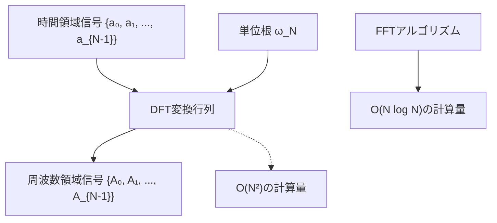
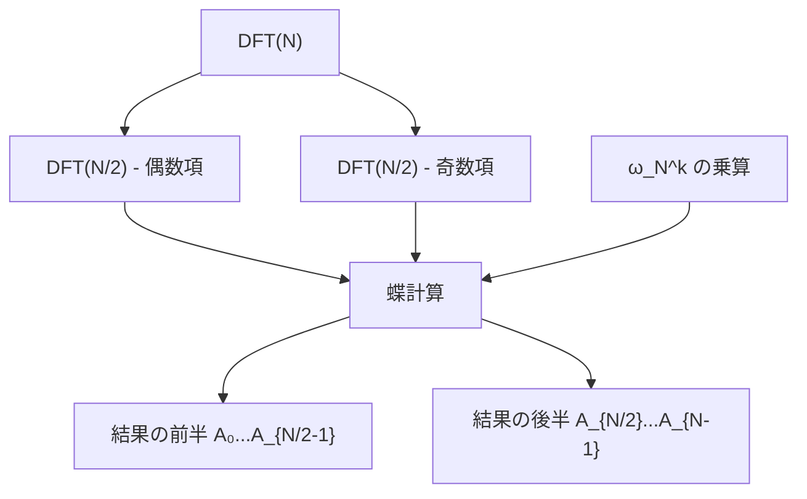
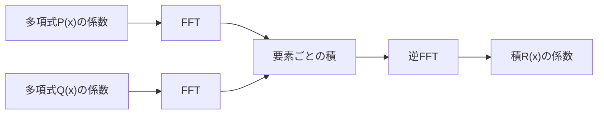

# 高速フーリエ変換

高速フーリエ変換（Fast Fourier Transform, FFT）は、離散フーリエ変換（DFT）を効率的に計算するアルゴリズムである。1965年にCooleyとTukeyによって再発見されたこのアルゴリズムは[^1]、計算量をO(N²)からO(N log N)に削減し、デジタル信号処理から競技プログラミングまで幅広い分野で活用されている。本稿では、FFTの数学的基礎から始まり、アルゴリズムの詳細、実装上の考慮事項、そして競技プログラミングにおける応用について体系的に解説する。

## 離散フーリエ変換の数学的基礎

離散フーリエ変換は、有限長の離散信号を周波数領域に変換する数学的操作である。長さNの複素数列 {a₀, a₁, ..., a_{N-1}} に対して、その離散フーリエ変換は次式で定義される：

$$A_k = \sum_{n=0}^{N-1} a_n \cdot \omega_N^{nk}$$

ここで、$\omega_N = e^{-2\pi i/N}$ はN次の原始単位根である。この変換は、時間領域の信号を周波数成分に分解する操作と解釈できる。逆変換は次式で与えられる：

$$a_n = \frac{1}{N} \sum_{k=0}^{N-1} A_k \cdot \omega_N^{-nk}$$

単位根 $\omega_N$ の重要な性質として、$\omega_N^N = 1$ および $\omega_N^{N/2} = -1$ が挙げられる。これらの性質は、FFTアルゴリズムの効率性の鍵となる。



## Cooley-Tukeyアルゴリズムの原理

FFTの核心は、DFTの計算を再帰的に分割することにある。N = 2ⁿ として、偶数インデックスと奇数インデックスの要素を分離すると：

$$A_k = \sum_{n=0}^{N/2-1} a_{2n} \cdot \omega_N^{2nk} + \sum_{n=0}^{N/2-1} a_{2n+1} \cdot \omega_N^{(2n+1)k}$$

$\omega_N^2 = \omega_{N/2}$ の関係を用いて整理すると：

$$A_k = \sum_{n=0}^{N/2-1} a_{2n} \cdot \omega_{N/2}^{nk} + \omega_N^k \sum_{n=0}^{N/2-1} a_{2n+1} \cdot \omega_{N/2}^{nk}$$

これは、元のDFTを2つの長さN/2のDFTに分解できることを示している。第一項は偶数インデックス要素のDFT、第二項は奇数インデックス要素のDFTに $\omega_N^k$ を乗じたものである。

さらに重要な観察として、$k \geq N/2$ の場合を考える。$\omega_N^{k+N/2} = -\omega_N^k$ の性質を用いると：

$$A_{k+N/2} = \sum_{n=0}^{N/2-1} a_{2n} \cdot \omega_{N/2}^{nk} - \omega_N^k \sum_{n=0}^{N/2-1} a_{2n+1} \cdot \omega_{N/2}^{nk}$$

これにより、N/2個の値から残りのN/2個の値を効率的に計算できる。この分割統治法により、計算量の劇的な削減が実現される。



## ビット反転と蝶計算

FFTの反復実装では、まず入力配列をビット反転順に並べ替える必要がある。これは再帰的分割の結果として自然に現れる順序である。例えば、N=8の場合：

- 000 (0) → 000 (0)
- 001 (1) → 100 (4)
- 010 (2) → 010 (2)
- 011 (3) → 110 (6)
- 100 (4) → 001 (1)
- 101 (5) → 101 (5)
- 110 (6) → 011 (3)
- 111 (7) → 111 (7)

ビット反転後、蝶計算（butterfly operation）と呼ばれる基本演算を段階的に適用する。各段階では、適切な単位根を用いて2要素の組み合わせを更新する：

```cpp
Complex u = a[j];
Complex v = a[j + len/2] * w;
a[j] = u + v;
a[j + len/2] = u - v;
```

この演算は、2つの複素数の加算と減算、および1つの複素数乗算を含む。FFT全体では、log₂(N)段階の蝶計算が必要となり、各段階でN/2回の蝶計算を実行する。

## 計算量と数値精度

FFTの時間計算量はO(N log N)である。これは各段階でO(N)の演算を行い、段階数がlog₂(N)であることから導かれる。空間計算量は、入力配列を in-place で変換する実装ではO(N)となる。

浮動小数点演算による数値誤差は、FFTの実用上重要な考慮事項である。誤差は主に以下の要因から生じる：

1. 単位根の計算における丸め誤差
2. 複素数乗算における誤差の蓄積
3. 大きな値と小さな値の加算による桁落ち

誤差の上界は概ねO(ε N log N)と評価される[^2]。ここでεは機械イプシロンである。実用的には、倍精度浮動小数点数を用いた場合、N ≤ 10⁶程度まで十分な精度が保たれる。

## 競技プログラミングにおける応用

競技プログラミングでは、FFTは主に多項式の高速乗算に用いられる。2つの多項式 P(x) = Σaᵢxⁱ と Q(x) = Σbᵢxⁱ の積 R(x) = P(x)Q(x) を計算する場合、係数の畳み込みが必要となる：

$$r_k = \sum_{i=0}^{k} a_i \cdot b_{k-i}$$

直接計算ではO(N²)の時間がかかるが、FFTを用いることでO(N log N)に削減できる。アルゴリズムは以下の手順で実行される：

1. 係数列をFFTで周波数領域に変換
2. 周波数領域で要素ごとの積を計算
3. 逆FFTで時間領域に戻す



この手法は、大きな整数の乗算、文字列マッチング、信号処理など、様々な問題に応用できる。例えば、Karatsuba法では分割統治により整数乗算をO(N^1.58)に改善するが、FFTを用いればO(N log N log log N)まで削減可能である[^3]。

## 実装上の最適化技術

実用的なFFT実装では、以下の最適化が重要である：

**単位根の事前計算**: 三角関数の計算は高コストなため、必要な単位根を事前に計算してテーブルに格納する。これにより、実行時の計算量を大幅に削減できる。

**キャッシュ効率の向上**: ビット反転処理を工夫し、メモリアクセスパターンを最適化する。特に、大きなサイズのFFTでは、キャッシュミスによる性能低下が顕著となる。

**実数FFT**: 実数列に対するFFTでは、共役対称性を利用して計算量を約半分に削減できる。具体的には、長さNの実数列を長さN/2の複素数列として処理し、結果を適切に分離する。

**数論変換（NTT）**: 整数演算のみを用いるFFTの変種で、特定の素数pを法とする剰余環上で計算を行う。浮動小数点誤差が発生しないため、厳密な計算が必要な場合に有用である。条件として、p = kN + 1 の形の素数が必要となる。

## アルゴリズムの変種と発展

FFTには多くの変種が存在し、それぞれ特定の用途に最適化されている。Radix-4 FFTは、4要素ずつをまとめて処理することで、複素数乗算の回数を削減する。Split-radix FFTは、異なる基数を組み合わせることで、さらなる効率化を実現する[^4]。

並列化の観点では、FFTは本質的に並列性の高いアルゴリズムである。各段階の蝶計算は独立に実行可能であり、GPUやマルチコアCPUでの実装が広く研究されている。特に、大規模なFFTでは、通信コストの最小化が重要な課題となる。

競技プログラミングの文脈では、問題の制約に応じて適切な実装を選択することが重要である。小さなサイズのFFTでは、ループアンローリングや特殊化された実装が有効である。一方、大きなサイズでは、メモリ使用量とキャッシュ効率のバランスが性能を左右する。

FFTの理論的な下界はΩ(N log N)であることが知られており[^5]、これは比較ソートの下界と同じ議論から導かれる。したがって、FFTは理論的に最適なアルゴリズムであり、定数倍の改善以外に本質的な高速化は期待できない。

実装の詳細において注意すべき点として、オーバーフローの回避がある。特に、大きな係数を持つ多項式の乗算では、中間結果が表現可能な範囲を超える可能性がある。この問題に対しては、複数の素数でNTTを実行し、中国剰余定理で結果を復元する手法が有効である。

FFTは、その優れた計算効率と広範な応用可能性により、現代の計算機科学において不可欠なアルゴリズムとなっている。競技プログラミングにおいても、多項式演算、畳み込み、文字列処理など、様々な問題でFFTの理解と実装能力が求められる。本稿で解説した理論的基礎と実装技術を習得することで、これらの問題に効果的に対処できるようになるだろう。

[^1]: Cooley, J. W.; Tukey, J. W. (1965). "An algorithm for the machine calculation of complex Fourier series". Mathematics of Computation. 19 (90): 297–301.

[^2]: Higham, N. J. (2002). Accuracy and Stability of Numerical Algorithms (2nd ed.). SIAM.

[^3]: Schönhage, A.; Strassen, V. (1971). "Schnelle Multiplikation großer Zahlen". Computing. 7 (3–4): 281–292.

[^4]: Duhamel, P.; Vetterli, M. (1990). "Fast Fourier transforms: a tutorial review and a state of the art". Signal Processing. 19 (4): 259–299.

[^5]: Morgenstern, J. (1973). "Note on a lower bound on the linear complexity of the fast Fourier transform". Journal of the ACM. 20 (2): 305–306.