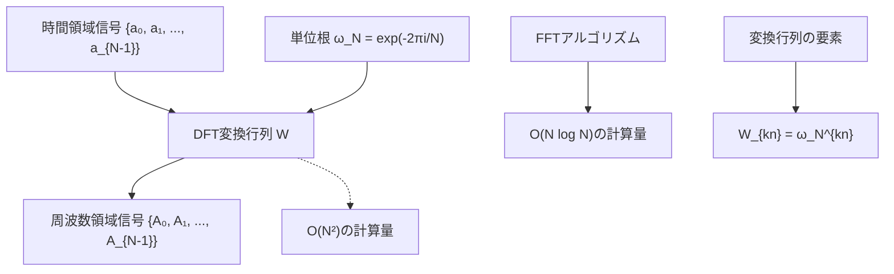
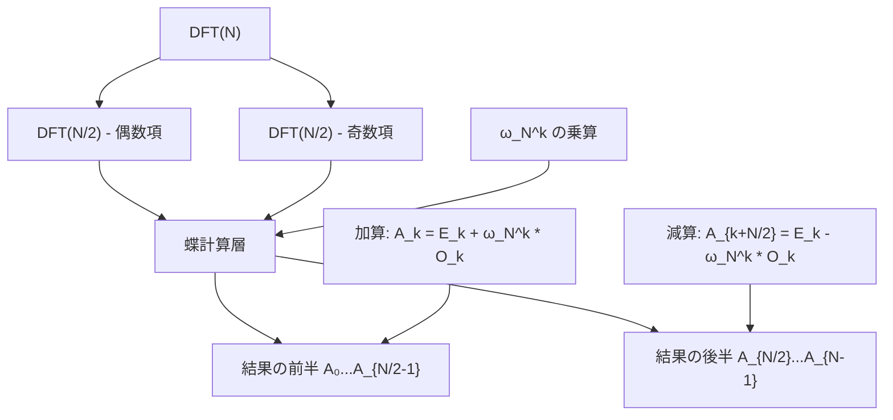
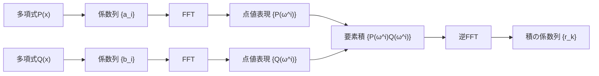

# 高速フーリエ変換

高速フーリエ変換（Fast Fourier Transform, FFT）は、離散フーリエ変換（DFT）を効率的に計算するアルゴリズムである。1965年にCooleyとTukeyによって再発見されたこのアルゴリズムは[^1]、計算量をO(N²)からO(N log N)に削減し、デジタル信号処理から競技プログラミングまで幅広い分野で活用されている。実はFFTの原理は、GaussやCooley-Tukey以前にも複数の数学者によって独立に発見されていた。特に1942年のDanielson-Lanczosの論文では、すでに同様のアイデアが示されていたが、コンピュータの普及前であったため広く知られることはなかった。本稿では、FFTの数学的基礎から始まり、アルゴリズムの詳細、実装上の考慮事項、そして競技プログラミングにおける応用について体系的に解説する。

## 複素数と単位根の数学的準備

FFTを理解するためには、まず複素数と単位根の性質を深く理解する必要がある。複素数は実部と虚部からなる数であり、複素平面上の点として表現される。オイラーの公式 $e^{i\theta} = \cos\theta + i\sin\theta$ は、指数関数と三角関数を結びつける重要な関係式である。この公式により、複素数の積は極形式で考えると角度の加算に対応することがわかる。

N次の単位根とは、N乗して1になる複素数のことである。主要なN次単位根（primitive N-th root of unity）は $\omega_N = e^{-2\pi i/N}$ で定義される。幾何学的には、これは複素平面上の単位円をN等分する点の一つである。単位根の重要な性質を以下に整理する：

1. **周期性**: $\omega_N^{k+N} = \omega_N^k$ （N周期で値が繰り返される）
2. **対称性**: $\omega_N^{N/2} = -1$ （半周で符号が反転）
3. **共役性**: $\overline{\omega_N^k} = \omega_N^{-k} = \omega_N^{N-k}$
4. **直交性**: $\sum_{k=0}^{N-1} \omega_N^{kj} = N\delta_{j,0}$ （ここで$\delta$はクロネッカーのデルタ）

これらの性質は、FFTアルゴリズムの正当性と効率性を保証する基礎となる。特に直交性は、フーリエ変換が可逆であることを保証し、信号を周波数領域と時間領域の間で損失なく変換できることを意味する。

## 離散フーリエ変換の数学的基礎

離散フーリエ変換は、有限長の離散信号を周波数領域に変換する数学的操作である。長さNの複素数列 {a₀, a₁, ..., a_{N-1}} に対して、その離散フーリエ変換は次式で定義される：

$$A_k = \sum_{n=0}^{N-1} a_n \cdot \omega_N^{nk}$$

ここで、$\omega_N = e^{-2\pi i/N}$ はN次の原始単位根である。この変換は、時間領域の信号を周波数成分に分解する操作と解釈できる。物理的には、各周波数成分 $A_k$ は、周波数 $k/N$ における信号の振幅と位相を表している。

逆変換は次式で与えられる：

$$a_n = \frac{1}{N} \sum_{k=0}^{N-1} A_k \cdot \omega_N^{-nk}$$

この逆変換の式は、単位根の直交性から導出される。具体的には、両辺に $\omega_N^{-mn}$ を乗じて $n$ について総和を取ると、直交性により $m = k$ の項のみが残ることで証明される。

DFTを行列形式で表現すると、変換行列 $W$ の要素は $W_{kn} = \omega_N^{kn}$ となる。この行列は対称性と周期性を持ち、その構造がFFTアルゴリズムの効率化の鍵となる。



## Cooley-Tukeyアルゴリズムの詳細な導出

FFTの核心は、DFTの計算を再帰的に分割することにある。ここでは、最も一般的なradix-2のCooley-Tukeyアルゴリズムについて詳細に解説する。N = 2ⁿ として、DFTの定義式を偶数インデックスと奇数インデックスの要素に分離する：

$$A_k = \sum_{n=0}^{N-1} a_n \cdot \omega_N^{nk} = \sum_{m=0}^{N/2-1} a_{2m} \cdot \omega_N^{2mk} + \sum_{m=0}^{N/2-1} a_{2m+1} \cdot \omega_N^{(2m+1)k}$$

第二項を展開すると：

$$A_k = \sum_{m=0}^{N/2-1} a_{2m} \cdot \omega_N^{2mk} + \omega_N^k \sum_{m=0}^{N/2-1} a_{2m+1} \cdot \omega_N^{2mk}$$

ここで重要な観察は、$\omega_N^2 = e^{-4\pi i/N} = e^{-2\pi i/(N/2)} = \omega_{N/2}$ という関係である。これを用いると：

$$A_k = \sum_{m=0}^{N/2-1} a_{2m} \cdot \omega_{N/2}^{mk} + \omega_N^k \sum_{m=0}^{N/2-1} a_{2m+1} \cdot \omega_{N/2}^{mk}$$

つまり、$A_k = DFT_{even}[k] + \omega_N^k \cdot DFT_{odd}[k]$ という形で表現できる。ここで、$DFT_{even}$ と $DFT_{odd}$ はそれぞれ偶数インデックスと奇数インデックスの要素に対する長さN/2のDFTである。

さらに、$k \geq N/2$ の場合を考える。単位根の性質 $\omega_N^{k+N/2} = -\omega_N^k$ および $\omega_{N/2}^{m(k+N/2)} = \omega_{N/2}^{mk}$ （なぜなら $\omega_{N/2}^{mN/2} = 1$）を用いると：

$$A_{k+N/2} = DFT_{even}[k] - \omega_N^k \cdot DFT_{odd}[k]$$

この関係により、2つの長さN/2のDFTから、長さNのDFTの全要素を効率的に計算できる。この操作は「蝶計算（butterfly operation）」と呼ばれ、FFTの基本単位となる。



## ビット反転とデータフローの詳細

FFTの反復実装では、まず入力配列をビット反転順に並べ替える必要がある。これは再帰的分割の結果として自然に現れる順序である。ビット反転が必要な理由を理解するために、再帰的な分割過程を追跡してみよう。

最初の分割で偶数・奇数に分けると：{a₀, a₂, a₄, a₆, a₁, a₃, a₅, a₇}。次の分割では各グループをさらに偶数・奇数に分けるため：{a₀, a₄, a₂, a₆, a₁, a₅, a₃, a₇}。最終的に得られる順序は、インデックスをビット反転した順序と一致する。

例えば、N=8の場合のビット反転：
- 000 (0) → 000 (0): a₀はそのまま位置0
- 001 (1) → 100 (4): a₁は位置4へ
- 010 (2) → 010 (2): a₂はそのまま位置2
- 011 (3) → 110 (6): a₃は位置6へ
- 100 (4) → 001 (1): a₄は位置1へ
- 101 (5) → 101 (5): a₅はそのまま位置5
- 110 (6) → 011 (3): a₆は位置3へ
- 111 (7) → 111 (7): a₇はそのまま位置7

ビット反転の効率的な実装は、FFT全体の性能に影響を与える。以下に、ビット反転を行う効率的なアルゴリズムを示す：

```cpp
// Bit reversal using bit manipulation
for (int i = 0; i < n; i++) {
    int rev = 0;
    int x = i;
    for (int j = 0; j < log2n; j++) {
        rev = (rev << 1) | (x & 1);
        x >>= 1;
    }
    if (i < rev) swap(a[i], a[rev]);
}
```

## 蝶計算の実装詳細と最適化

ビット反転後、蝶計算（butterfly operation）を段階的に適用する。各段階では、適切な単位根を用いて2要素の組み合わせを更新する。蝶計算の基本構造は以下の通りである：

```cpp
// Basic butterfly operation
Complex u = a[j];
Complex v = a[j + len/2] * w;
a[j] = u + v;
a[j + len/2] = u - v;
```

この演算は、2つの複素数の加算と減算、および1つの複素数乗算を含む。複素数乗算は4回の実数乗算と2回の実数加算を必要とするため、計算コストが高い。そのため、以下の最適化が重要となる：

1. **単位根の事前計算とキャッシング**: 三角関数の計算は非常に高コストなため、必要な単位根を事前に計算してテーブルに格納する。

2. **トリゴノメトリック再帰**: 連続する単位根の値を、前の値から効率的に計算する手法。$\omega_{next} = \omega_{current} \cdot \omega_{step}$ の関係を利用する。

3. **複素数乗算の最適化**: Karatsuba法を応用し、3回の実数乗算で複素数乗算を実現する。$(a+bi)(c+di) = (ac-bd) + i((a+b)(c+d)-ac-bd)$

FFT全体では、log₂(N)段階の蝶計算が必要となり、各段階でN/2回の蝶計算を実行する。段階が進むにつれて、蝶計算のストライド（要素間の距離）が2倍になっていく。

## 計算量解析と理論的下界

FFTの時間計算量を詳細に解析する。各段階でN/2回の蝶計算を行い、各蝶計算は定数時間で実行される。段階数はlog₂(N)であるため、全体の時間計算量はO(N log N)となる。より詳細には、複素数乗算の回数は (N/2)log₂(N) 回、複素数加算の回数は N log₂(N) 回である。

空間計算量については、入力配列を in-place で変換する実装ではO(N)となる。ただし、単位根のテーブルを事前計算する場合は、追加でO(N)の空間が必要となることがある。

FFTの理論的下界について、Morgensternは1973年に次の定理を証明した[^5]：任意のDFTアルゴリズムは、少なくともΩ(N log N)回の算術演算を必要とする。この証明は、線形変換の計算複雑性理論に基づいており、FFTが漸近的に最適なアルゴリズムであることを示している。

## 数値精度と誤差解析

浮動小数点演算による数値誤差は、FFTの実用上重要な考慮事項である。誤差の発生源と蓄積過程を詳細に分析する。

**誤差の発生源**：
1. **単位根の計算誤差**: $\omega_N^k = \cos(2\pi k/N) - i\sin(2\pi k/N)$ の計算において、三角関数の評価誤差が生じる。
2. **丸め誤差の蓄積**: 各蝶計算で発生する丸め誤差が、再帰的な構造により増幅される。
3. **キャンセレーション誤差**: 近い値の減算により有効桁数が減少する。

Highamの解析によれば[^2]、前進誤差の上界は次のように評価される：

$$\|FFT(a) - DFT(a)\|_2 \leq c \cdot \epsilon \cdot \log_2(N) \cdot \|a\|_2$$

ここで、$c$ は小さな定数、$\epsilon$ は機械イプシロンである。この結果は、誤差がlog(N)に比例して増大することを示している。

実用的な観点から、以下の対策が有効である：
- **高精度演算の使用**: 必要に応じて倍精度から四倍精度への切り替え
- **スケーリング**: 入力値を適切にスケーリングしてオーバーフロー/アンダーフローを防ぐ
- **条件数の監視**: 変換の条件数を評価し、数値的に不安定な場合は警告を出す

## 競技プログラミングにおける詳細な応用

競技プログラミングでは、FFTは主に以下の問題カテゴリで活用される：

### 1. 多項式の高速乗算

2つの多項式 $P(x) = \sum_{i=0}^{n} a_i x^i$ と $Q(x) = \sum_{i=0}^{m} b_i x^i$ の積を計算する問題は、競技プログラミングで頻出する。係数の畳み込みは以下で定義される：

$$r_k = \sum_{i=0}^{k} a_i \cdot b_{k-i}$$

FFTを用いた解法の手順：
1. 両多項式の次数を2のべき乗に拡張（ゼロパディング）
2. 係数列をFFTで周波数領域に変換
3. 周波数領域で要素ごとの積を計算
4. 逆FFTで時間領域に戻す



### 2. 文字列マッチングへの応用

FFTを用いた文字列マッチングは、特にワイルドカードを含むパターンマッチングで威力を発揮する。基本的なアイデアは、文字列を数値列として扱い、相関関数を計算することである。

例えば、テキストTとパターンPのマッチングでは、各文字を数値に変換し、以下の相関関数を計算する：

$$C[k] = \sum_{i=0}^{|P|-1} T[k+i] \cdot P[i]$$

この計算はFFTを用いてO(N log N)で実行できる。ワイルドカードがある場合は、対応する位置の値を0に設定することで対処する。

### 3. 大整数の乗算

N桁の整数同士の乗算は、基数Bの多項式の乗算として扱える。例えば、基数10000を用いれば、4桁ずつをまとめて1つの係数とする。FFTによる乗算後、繰り上がり処理を行う：

```cpp
// Carry propagation after FFT multiplication
for (int i = 0; i < result.size() - 1; i++) {
    result[i + 1] += result[i] / BASE;
    result[i] %= BASE;
}
```

### 4. 畳み込みの一般化

FFTは、より一般的な畳み込み演算にも適用できる。例えば、XOR畳み込みやAND畳み込みなど、通常の加算・乗算以外の演算を用いる畳み込みも、適切な変換により高速化できる場合がある。

## 実装における詳細な最適化技術

### メモリアクセスパターンの最適化

現代のプロセッサではキャッシュ効率が性能に大きく影響する。FFTのメモリアクセスパターンを最適化する手法として以下が挙げられる：

1. **キャッシュブロッキング**: 大きなFFTを小さなブロックに分割し、各ブロックがキャッシュに収まるようにする。
2. **データレイアウトの工夫**: 実部と虚部を別配列にするSoA（Structure of Arrays）形式vs交互に配置するAoS（Array of Structures）形式の選択。
3. **プリフェッチの活用**: 次に必要となるデータを事前にキャッシュに読み込む。

### SIMD命令の活用

現代のCPUはSIMD（Single Instruction Multiple Data）命令をサポートしており、これを活用することで大幅な高速化が可能である。例えば、AVX2命令を用いれば、4つの倍精度浮動小数点演算を同時に実行できる：

```cpp
// SIMD-optimized butterfly operation (pseudo-code)
__m256d u = _mm256_load_pd(&a[j]);
__m256d v = _mm256_load_pd(&a[j + stride]);
__m256d w_real = _mm256_broadcast_sd(&omega_real);
__m256d w_imag = _mm256_broadcast_sd(&omega_imag);
// Complex multiplication and butterfly computation
__m256d v_rotated = complex_mul_simd(v, w_real, w_imag);
_mm256_store_pd(&a[j], _mm256_add_pd(u, v_rotated));
_mm256_store_pd(&a[j + stride], _mm256_sub_pd(u, v_rotated));
```

### 実数専用FFT

実数列に対するFFTでは、出力が共役対称性を持つことを利用して計算量を削減できる。具体的には、長さNの実数列を長さN/2の複素数列として扱い、1回のFFTで2つの実数列を同時に変換する手法がある：

1. 2つの実数列 x[n] と y[n] を複素数列 z[n] = x[n] + i*y[n] として結合
2. Z[k] = FFT(z[n]) を計算
3. 対称性を利用して X[k] と Y[k] を分離：
   - X[k] = (Z[k] + conj(Z[N-k])) / 2
   - Y[k] = (Z[k] - conj(Z[N-k])) / (2i)

## 数論変換（NTT）の詳細

数論変換は、複素数の代わりに有限体上で計算を行うFFTの変種である。素数pを法とする剰余環 Z/pZ 上で、原始N乗根 g を用いて変換を定義する：

$$A_k = \sum_{n=0}^{N-1} a_n \cdot g^{nk} \pmod{p}$$

NTTが可能となる条件は：
1. p ≡ 1 (mod N) （pがNで割り切れること）
2. gがpを法とする原始N乗根であること

よく使用される素数として、p = 998244353 = 119 × 2²³ + 1 がある。この素数では、g = 3 が原始根となる。

NTTの利点：
- 浮動小数点誤差が発生しない
- モジュラー演算により、大きな数の乗算でもオーバーフローしない
- 整数演算のみで実装可能

NTTの実装上の注意点：
- モジュラー乗算の高速化が重要（Montgomery乗算など）
- 複数の素数でNTTを実行し、中国剰余定理で復元する手法
- 素数の選択により、変換可能な列の長さが制限される

## アルゴリズムの発展的な変種

### Split-Radix FFT

Split-Radix FFTは、radix-2とradix-4の利点を組み合わせた手法である。偶数インデックスにはradix-2、奇数インデックスにはradix-4の分割を適用する：

$$A_k = \sum_{n=0}^{N/2-1} a_{2n} \omega_{N/2}^{nk} + \omega_N^k \sum_{n=0}^{N/4-1} a_{4n+1} \omega_{N/4}^{nk} + \omega_N^{3k} \sum_{n=0}^{N/4-1} a_{4n+3} \omega_{N/4}^{nk}$$

この手法により、実数乗算の回数を約25%削減できる。

### Mixed-Radix FFT

Nが2のべき乗でない場合、Mixed-Radix FFTが使用される。例えば、N = 2^a × 3^b × 5^c の場合、各素因数に対応する段階的な分割を行う。各段階では、対応する基数の蝶計算を実行する。

### Prime Factor Algorithm (PFA)

Good-Thomasアルゴリズムとも呼ばれ、互いに素な因数への分解を利用する。N = N₁ × N₂ （gcd(N₁, N₂) = 1）の場合、中国剰余定理を用いて2次元DFTに変換できる。

## 並列化とハードウェア実装

### マルチスレッド並列化

FFTは本質的に並列性の高いアルゴリズムである。各段階の蝶計算は独立に実行可能であり、以下の並列化戦略が有効である：

1. **データ並列**: 各スレッドが配列の異なる部分を処理
2. **パイプライン並列**: 異なる段階を異なるスレッドが処理
3. **ハイブリッド並列**: データ並列とタスク並列の組み合わせ

並列化における課題は、同期オーバーヘッドとキャッシュコヒーレンシの管理である。特に、偽共有（false sharing）を避けるため、各スレッドが処理するデータを適切に配置する必要がある。

### GPU実装

GPUは大量の並列計算に適しており、大規模なFFTで特に効果的である。CUDAやOpenCLを用いた実装では、以下の最適化が重要となる：

1. **共有メモリの活用**: 頻繁にアクセスされるデータを高速な共有メモリに配置
2. **バンク競合の回避**: メモリアクセスパターンを工夫してバンク競合を最小化
3. **占有率の最適化**: スレッドブロックサイズとレジスタ使用量のバランス

### FPGA/ASIC実装

専用ハードウェアでのFFT実装は、信号処理システムで広く使用されている。パイプライン型アーキテクチャやメモリベースアーキテクチャなど、用途に応じた設計が選択される。

## 実践的な実装例と性能比較

競技プログラミングで使用可能な、最適化されたFFT実装の核心部分を示す：

```cpp
namespace FFT {
    const double PI = acos(-1.0);
    
    void fft(vector<complex<double>>& a, bool inverse) {
        int n = a.size();
        if (n == 1) return;
        
        // Bit reversal
        for (int i = 1, j = 0; i < n; i++) {
            int bit = n >> 1;
            for (; j & bit; bit >>= 1) {
                j ^= bit;
            }
            j ^= bit;
            if (i < j) swap(a[i], a[j]);
        }
        
        // Cooley-Tukey FFT
        for (int len = 2; len <= n; len <<= 1) {
            double ang = 2 * PI / len * (inverse ? -1 : 1);
            complex<double> wlen(cos(ang), sin(ang));
            
            for (int i = 0; i < n; i += len) {
                complex<double> w(1);
                for (int j = 0; j < len / 2; j++) {
                    complex<double> u = a[i + j];
                    complex<double> v = a[i + j + len/2] * w;
                    a[i + j] = u + v;
                    a[i + j + len/2] = u - v;
                    w *= wlen;
                }
            }
        }
        
        if (inverse) {
            for (auto& x : a) x /= n;
        }
    }
}
```

この実装は、教育的な明確さを重視しているが、実用的には前述の最適化技術を適用することで、さらなる高速化が可能である。

## FFTの限界と代替手法

FFTは多くの場合で最適な選択だが、以下のような状況では他の手法が有利な場合がある：

1. **小さなサイズ**: N < 32 程度では、直接計算やKaratsuba法が高速
2. **疎な多項式**: 非ゼロ係数が少ない場合は、直接計算が効率的
3. **特殊な構造**: Toeplitz行列やCirculant行列など、特殊な構造を持つ場合は専用アルゴリズムが存在
4. **オンライン処理**: ストリーミングデータに対しては、Sliding DFTなどの手法が適切

## 競技プログラミングにおける実装上の注意点

競技プログラミングでFFTを実装・使用する際の重要な注意点をまとめる：

1. **精度の確認**: 問題の制約から必要な精度を見積もり、適切な数値型を選択
2. **定数倍の最適化**: 実行時間制限が厳しい場合は、定数倍の最適化が重要
3. **メモリ使用量**: 大きな配列を確保する際は、メモリ制限に注意
4. **エッジケース**: N = 1 や空配列などの特殊ケースの処理
5. **デバッグ**: 小さなケースで手計算と比較し、実装の正確性を確認

FFTは、その優れた計算効率と広範な応用可能性により、現代の計算機科学において不可欠なアルゴリズムとなっている。本稿で解説した理論的基礎から実装の詳細まで、体系的な理解を深めることで、競技プログラミングにおける複雑な問題に対処する能力が向上するだろう。特に、多項式演算、畳み込み計算、信号処理に関連する問題では、FFTの理解と適切な実装が解法の鍵となることが多い。継続的な学習と実践を通じて、このアルゴリズムを自在に活用できるようになることを期待する。

[^1]: Cooley, J. W.; Tukey, J. W. (1965). "An algorithm for the machine calculation of complex Fourier series". Mathematics of Computation. 19 (90): 297–301.

[^2]: Higham, N. J. (2002). Accuracy and Stability of Numerical Algorithms (2nd ed.). SIAM.

[^3]: Schönhage, A.; Strassen, V. (1971). "Schnelle Multiplikation großer Zahlen". Computing. 7 (3–4): 281–292.

[^4]: Duhamel, P.; Vetterli, M. (1990). "Fast Fourier transforms: a tutorial review and a state of the art". Signal Processing. 19 (4): 259–299.

[^5]: Morgenstern, J. (1973). "Note on a lower bound on the linear complexity of the fast Fourier transform". Journal of the ACM. 20 (2): 305–306.