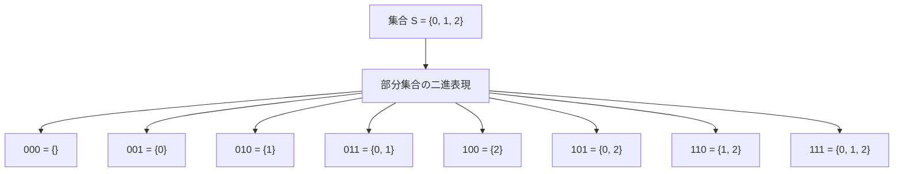
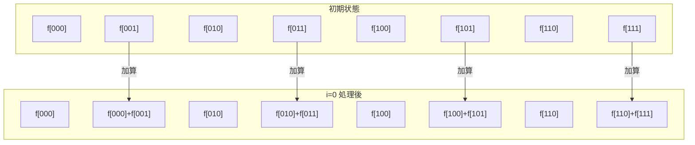
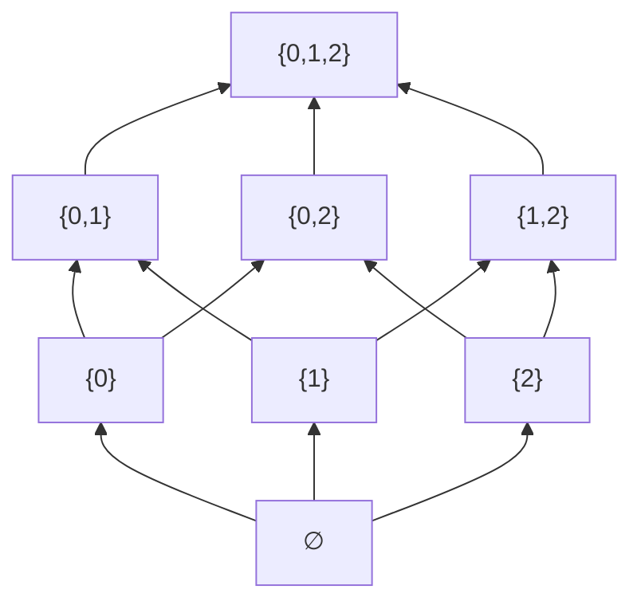

# 高速メビウス変換

高速メビウス変換（Fast Zeta Transform、Fast Möbius Transform）は、集合の包除関係を扱う際に現れる特殊な変換を高速に計算するアルゴリズムです。競技プログラミングやアルゴリズム設計において、部分集合に関する動的計画法を効率化する強力な手法として知られています。本稿では、メビウス変換の数学的基礎から始め、高速化アルゴリズムの詳細、そして実装方法まで、体系的に解説します。

## 数学的基礎

メビウス変換を理解するために、まず包除原理との関係から見ていきましょう。集合 $S = \{0, 1, ..., n-1\}$ の部分集合を考えるとき、任意の部分集合を $n$ ビットのビット列として表現できます。例えば、$n = 3$ のとき、部分集合 $\{0, 2\}$ は二進数表現で $101_2 = 5$ として表せます。

この表現方法を用いて、関数 $f: 2^S \rightarrow \mathbb{R}$ を考えます。ここで $2^S$ は $S$ のべき集合（すべての部分集合の集合）を表します。実装上は、$f$ は長さ $2^n$ の配列として表現されます。



## ゼータ変換とメビウス変換

ゼータ変換（Zeta Transform）は、関数 $f$ から新しい関数 $\hat{f}$ を生成する変換で、以下のように定義されます：

$$\hat{f}(T) = \sum_{S \subseteq T} f(S)$$

つまり、$\hat{f}(T)$ は $T$ のすべての部分集合 $S$ に対する $f(S)$ の和となります。この変換は、部分集合の和を効率的に計算する際に重要な役割を果たします。

一方、メビウス変換（Möbius Transform）はゼータ変換の逆変換として定義されます。$\hat{f}$ から元の $f$ を復元する変換で、包除原理を用いて以下のように表されます：

$$f(T) = \sum_{S \subseteq T} (-1)^{|T| - |S|} \hat{f}(S)$$

ここで $|T|$ は集合 $T$ の要素数を表します。この式は包除原理の直接的な応用であり、重複して数えられた要素を適切に除外することで元の値を復元しています。


## 素朴なアルゴリズム

まず、ゼータ変換の素朴な実装を見てみましょう。定義通りに実装すると、各 $T$ に対してそのすべての部分集合を列挙する必要があります：

```cpp
// Naive zeta transform
for (int T = 0; T < (1 << n); T++) {
    zeta[T] = 0;
    for (int S = T; ; S = (S - 1) & T) {
        zeta[T] += f[S];
        if (S == 0) break;
    }
}
```

この実装では、部分集合の列挙に Gosper's hack と呼ばれるテクニックを使用しています。`S = (S - 1) & T` により、$T$ の部分集合を降順に列挙できます。しかし、この方法の時間計算量は $O(3^n)$ となります^[1]^。これは、各要素が「$T$ に含まれる」「$S$ に含まれる」「どちらにも含まれない」の3通りの状態を取り得ることから導かれます。

^[1]: より正確には、$\sum_{k=0}^{n} \binom{n}{k} 2^k = 3^n$ という二項定理から導かれます。

## 高速ゼータ変換

高速ゼータ変換の核心は、変換を次元ごとに分解することにあります。$n$ ビットの集合を考えるとき、各ビット位置について独立に処理を行うことで、計算量を劇的に削減できます。

アルゴリズムの基本的なアイデアは次の通りです。ビット位置 $i$ について、$i$ 番目のビットが立っている集合から、そのビットを落とした集合へ値を伝播させます。これを全てのビット位置について順番に行うことで、最終的にゼータ変換が完成します。

```cpp
// Fast zeta transform
vector<long long> zeta = f;  // Copy original function
for (int i = 0; i < n; i++) {
    for (int S = 0; S < (1 << n); S++) {
        if (S & (1 << i)) {
            zeta[S] += zeta[S ^ (1 << i)];
        }
    }
}
```

このアルゴリズムの動作を理解するために、$n = 3$ の場合の具体例を追ってみましょう。初期状態で $f[0], f[1], ..., f[7]$ が与えられているとします。



各ステップで、特定のビットが立っている位置から、そのビットを落とした位置へ値が加算されます。これを全ビット位置について繰り返すことで、最終的に各位置にその部分集合すべての和が格納されます。

時間計算量は $O(n \cdot 2^n)$ となり、素朴な方法の $O(3^n)$ と比較して大幅に改善されています。例えば $n = 20$ の場合、$3^{20} \approx 3.5 \times 10^9$ に対して $20 \times 2^{20} \approx 2.1 \times 10^7$ となり、約170倍の高速化が実現されます。

## 高速メビウス変換

メビウス変換はゼータ変換の逆変換として定義されますが、高速化の手法は似ています。ただし、値の伝播方向が逆になります：

```cpp
// Fast Möbius transform
vector<long long> mobius = zeta;  // Copy zeta-transformed function
for (int i = 0; i < n; i++) {
    for (int S = 0; S < (1 << n); S++) {
        if (S & (1 << i)) {
            mobius[S] -= mobius[S ^ (1 << i)];
        }
    }
}
```

ゼータ変換では加算を行いましたが、メビウス変換では減算を行います。これは包除原理における符号の交代に対応しています。

## 一般化：任意の演算への拡張

ここまで見てきたゼータ変換とメビウス変換は、実は加算という特定の演算に対するものでした。しかし、この手法はより一般的な演算に拡張できます。

演算 $\oplus$ と その逆演算 $\ominus$ が以下の条件を満たすとき、同様の高速変換が可能です：
- $(a \oplus b) \ominus b = a$ （逆演算の性質）
- 結合法則：$(a \oplus b) \oplus c = a \oplus (b \oplus c)$

例えば、以下のような演算に対して高速変換を適用できます：

1. **最大値/最小値**：$\oplus = \max$、$\ominus$ は不要（単調性のため）
2. **ビット演算**：$\oplus = \text{OR}$、$\oplus = \text{AND}$、$\oplus = \text{XOR}$
3. **乗算**（適切な条件下で）：$\oplus = \times$、$\ominus = \div$

```cpp
// Generalized fast transform with max operation
vector<int> max_transform = f;
for (int i = 0; i < n; i++) {
    for (int S = 0; S < (1 << n); S++) {
        if (S & (1 << i)) {
            max_transform[S] = max(max_transform[S], max_transform[S ^ (1 << i)]);
        }
    }
}
```

## 実装上の最適化

実際の競技プログラミングや高性能が要求される場面では、さらなる最適化が可能です。

### キャッシュ効率の改善

標準的な実装では、各ビット位置について全体を走査しますが、メモリアクセスパターンを改善することでキャッシュ効率を高められます：

```cpp
// Cache-friendly implementation
vector<long long> dp = f;
for (int i = 0; i < n; i++) {
    int block_size = 1 << (i + 1);
    int half_block = 1 << i;
    for (int start = 0; start < (1 << n); start += block_size) {
        for (int j = 0; j < half_block; j++) {
            dp[start + half_block + j] += dp[start + j];
        }
    }
}
```

この実装では、連続したメモリ領域にアクセスするため、キャッシュミスが減少します。

### ビット並列化

複数の独立した変換を同時に実行する場合、ビット並列化により高速化できます：

```cpp
// Bit-parallel zeta transform for multiple functions
const int BATCH = 64;  // Process 64 functions simultaneously
vector<bitset<BATCH>> dp(1 << n);

// Initialize with input functions
for (int S = 0; S < (1 << n); S++) {
    for (int k = 0; k < BATCH; k++) {
        dp[S][k] = f[k][S];  // f[k] is the k-th function
    }
}

// Apply transform
for (int i = 0; i < n; i++) {
    for (int S = 0; S < (1 << n); S++) {
        if (S & (1 << i)) {
            dp[S] ^= dp[S ^ (1 << i)];  // XOR for boolean functions
        }
    }
}
```

## 応用例：部分集合の畳み込み

高速メビウス変換の最も重要な応用の一つが、部分集合の畳み込み（Subset Sum Convolution）です。二つの関数 $f, g: 2^S \rightarrow \mathbb{R}$ に対して、その畳み込み $h$ を以下のように定義します：

$$h(T) = \sum_{S \subseteq T} f(S) \cdot g(T \setminus S)$$

ここで $T \setminus S$ は集合 $T$ から $S$ を除いた差集合です。この畳み込みは、集合を分割する方法を数え上げる問題などで自然に現れます。

素朴に計算すると $O(3^n)$ の時間がかかりますが、高速メビウス変換を用いることで $O(n^2 \cdot 2^n)$ まで改善できます。

```cpp
// Subset sum convolution
vector<vector<long long>> ranked_f(n + 1, vector<long long>(1 << n));
vector<vector<long long>> ranked_g(n + 1, vector<long long>(1 << n));

// Rank functions by popcount
for (int S = 0; S < (1 << n); S++) {
    ranked_f[__builtin_popcount(S)][S] = f[S];
    ranked_g[__builtin_popcount(S)][S] = g[S];
}

// Apply zeta transform to each rank
for (int i = 0; i <= n; i++) {
    zeta_transform(ranked_f[i]);
    zeta_transform(ranked_g[i]);
}

// Multiply
vector<vector<long long>> ranked_h(n + 1, vector<long long>(1 << n));
for (int i = 0; i <= n; i++) {
    for (int j = 0; j <= i; j++) {
        for (int S = 0; S < (1 << n); S++) {
            ranked_h[i][S] += ranked_f[j][S] * ranked_g[i - j][S];
        }
    }
}

// Apply Möbius transform
for (int i = 0; i <= n; i++) {
    mobius_transform(ranked_h[i]);
}

// Extract result
vector<long long> h(1 << n);
for (int S = 0; S < (1 << n); S++) {
    h[S] = ranked_h[__builtin_popcount(S)][S];
}
```

この実装の鍵は、集合のサイズ（popcount）でランク分けすることです。これにより、重複カウントを避けながら効率的に畳み込みを計算できます。

## 実践的な問題への適用

高速メビウス変換は、以下のような問題で威力を発揮します：

### 1. 集合被覆問題の変種

$n$ 個の要素からなる全体集合 $U$ と、その部分集合の族 $\mathcal{F} = \{S_1, S_2, ..., S_m\}$ が与えられたとき、$U$ を被覆する $\mathcal{F}$ の部分族の数を求める問題を考えます。

```cpp
vector<long long> dp(1 << n, 0);
dp[0] = 1;  // Empty set can be covered by empty family

for (int i = 0; i < m; i++) {
    int mask = 0;
    for (int elem : S[i]) {
        mask |= (1 << elem);
    }
    
    // Update dp in reverse order
    for (int T = (1 << n) - 1; T >= 0; T--) {
        if ((T & mask) == 0) {  // Can use S[i] to cover
            dp[T | mask] += dp[T];
        }
    }
}

// The answer is dp[(1 << n) - 1]
```

### 2. 最適化問題への応用

部分集合に対するコスト関数が与えられたとき、特定の条件を満たす部分集合の中で最小コストを求める問題も、高速メビウス変換を用いて効率的に解けます。

```cpp
// Find minimum cost among subsets with specific properties
vector<int> min_cost(1 << n, INT_MAX);

// Initialize with base costs
for (int S = 0; S < (1 << n); S++) {
    if (has_property(S)) {
        min_cost[S] = base_cost(S);
    }
}

// Apply min-transform
for (int i = 0; i < n; i++) {
    for (int S = 0; S < (1 << n); S++) {
        if (S & (1 << i)) {
            min_cost[S] = min(min_cost[S], min_cost[S ^ (1 << i)]);
        }
    }
}
```

### 3. 包除原理の高速計算

複雑な包除原理の計算も、高速メビウス変換により効率化できます。例えば、$n$ 個の条件のうち、ちょうど $k$ 個を満たすオブジェクトの数を求める問題：

```cpp
// Count objects satisfying exactly k conditions
vector<long long> at_least(1 << n);  // at_least[S] = count of objects satisfying all conditions in S

// ... compute at_least ...

// Apply Möbius transform to get exactly count
mobius_transform(at_least);

// Now at_least[S] contains count of objects satisfying exactly conditions in S
long long answer = 0;
for (int S = 0; S < (1 << n); S++) {
    if (__builtin_popcount(S) == k) {
        answer += at_least[S];
    }
}
```

## 理論的背景：束論との関係

高速メビウス変換の数学的基礎は、束論（Lattice Theory）にあります。部分集合の包含関係は半順序を形成し、特にブール束と呼ばれる構造を持ちます。



この半順序集合上でのメビウス関数 $\mu$ は、包除原理の係数 $(-1)^{|T|-|S|}$ に対応します。一般の半順序集合に対するメビウス変換も定義できますが、ブール束の場合は特に単純な形になり、高速アルゴリズムが存在するのです。

## パフォーマンス特性と実装上の注意点

高速メビウス変換を実装する際の重要な考慮事項をまとめます。

### メモリ使用量

基本的な実装では $O(2^n)$ のメモリを使用します。$n = 20$ で約 8MB（long long の場合）、$n = 25$ で約 256MB となるため、問題の制約に注意が必要です。

### 数値精度

整数演算の場合はオーバーフローに注意が必要です。特に畳み込みでは中間結果が大きくなりやすいため、適切な modulo 演算や多倍長整数の使用を検討します：

```cpp
const long long MOD = 1e9 + 7;

// Modular arithmetic version
for (int i = 0; i < n; i++) {
    for (int S = 0; S < (1 << n); S++) {
        if (S & (1 << i)) {
            dp[S] = (dp[S] + dp[S ^ (1 << i)]) % MOD;
        }
    }
}
```

### 並列化の可能性

各ビット位置の処理は前の結果に依存するため、ビット位置方向の並列化は困難です。しかし、同じビット位置内の処理は独立しているため、OpenMP などを用いた並列化が可能です：

```cpp
#pragma omp parallel for
for (int S = 0; S < (1 << n); S++) {
    if (S & (1 << i)) {
        // Atomic operation or appropriate synchronization needed
        #pragma omp atomic
        dp[S] += dp[S ^ (1 << i)];
    }
}
```

## 発展的話題：他の変換との関係

高速メビウス変換は、他の重要な変換アルゴリズムと深い関係があります。

### 高速フーリエ変換（FFT）との類似性

高速メビウス変換と FFT は、どちらも「分割統治」の考え方に基づいています。FFT が複素数の単位根を用いて周波数領域への変換を行うのに対し、高速メビウス変換は包含関係に基づく変換を行います。

両者の構造的類似性は、以下の対応関係に現れます：
- FFT：多項式の積 → 点値表現での積 → 逆変換
- FMT：集合関数の畳み込み → ゼータ変換での積 → メビウス変換

### アダマール変換との関係

アダマール変換（Walsh-Hadamard Transform）は、XOR 畳み込みを高速化する変換です。実は、これも高速メビウス変換の特殊なケースと見なすことができます：

```cpp
// Hadamard transform (XOR convolution)
for (int len = 1; len < (1 << n); len <<= 1) {
    for (int i = 0; i < (1 << n); i += (len << 1)) {
        for (int j = 0; j < len; j++) {
            long long u = dp[i + j];
            long long v = dp[i + j + len];
            dp[i + j] = u + v;
            dp[i + j + len] = u - v;
        }
    }
}
```

この変換は、XOR を演算とする群構造に対応しており、高速メビウス変換が扱う包含関係とは異なる代数構造を持ちます。

## 実装ライブラリの設計

実用的な高速メビウス変換ライブラリを設計する際は、汎用性と効率性のバランスが重要です：

```cpp
template<typename T, typename Op>
class FastMobiusTransform {
private:
    int n;
    Op op;
    
public:
    FastMobiusTransform(int n, Op op = Op()) : n(n), op(op) {}
    
    void zeta_transform(vector<T>& f) {
        for (int i = 0; i < n; i++) {
            for (int S = 0; S < (1 << n); S++) {
                if (S & (1 << i)) {
                    f[S] = op(f[S], f[S ^ (1 << i)]);
                }
            }
        }
    }
    
    void mobius_transform(vector<T>& f) {
        for (int i = 0; i < n; i++) {
            for (int S = 0; S < (1 << n); S++) {
                if (S & (1 << i)) {
                    f[S] = op.inverse(f[S], f[S ^ (1 << i)]);
                }
            }
        }
    }
};

// Usage example
struct AddOp {
    long long operator()(long long a, long long b) { return a + b; }
    long long inverse(long long a, long long b) { return a - b; }
};

FastMobiusTransform<long long, AddOp> fmt(n);
fmt.zeta_transform(f);
```

このような設計により、異なる演算や型に対して同じインターフェースで変換を適用できます。

## 計算複雑性の詳細な分析

高速メビウス変換の時間計算量 $O(n \cdot 2^n)$ について、より詳細に分析してみましょう。

各ビット位置 $i$ に対して、$2^n$ 個の要素をスキャンし、そのうち半分（第 $i$ ビットが立っているもの）に対して演算を行います。したがって、総演算回数は：

$$\sum_{i=0}^{n-1} 2^{n-1} = n \cdot 2^{n-1}$$

これは厳密には $O(n \cdot 2^{n-1})$ ですが、ビッグO記法では定数係数を無視して $O(n \cdot 2^n)$ と表記します。

空間計算量は、in-place で変換を行う場合 $O(2^n)$ です。ただし、元のデータを保持する必要がある場合は、追加で $O(2^n)$ の空間が必要になります。

### 実行時間の実測

典型的な実装での実行時間の目安（Intel Core i7、単一スレッド）：
- $n = 20$: 約 20-50 ミリ秒
- $n = 22$: 約 80-200 ミリ秒  
- $n = 24$: 約 400-800 ミリ秒
- $n = 26$: 約 2-4 秒

これらの値は、演算の種類、コンパイラの最適化レベル、キャッシュサイズなどに大きく依存します。

## 誤りやすいポイントと対策

高速メビウス変換を実装・使用する際によくある誤りをまとめます。

### 1. 変換の順序

ゼータ変換とメビウス変換で、ビット位置の処理順序を逆にしてしまう誤り：

```cpp
// Wrong: This doesn't work
for (int i = n - 1; i >= 0; i--) {  // Reverse order
    for (int S = 0; S < (1 << n); S++) {
        if (S & (1 << i)) {
            f[S] += f[S ^ (1 << i)];
        }
    }
}
```

正しくは、両方の変換で同じ順序（通常は 0 から n-1）で処理します。

### 2. 初期化忘れ

特に複数回変換を行う場合、配列の初期化を忘れることがあります：

```cpp
// Correct: Always initialize
vector<long long> result = original_function;  // Copy
zeta_transform(result);
```

### 3. 演算の可逆性

すべての演算に逆演算が存在するわけではありません。例えば、max/min 演算には厳密な逆演算がないため、メビウス変換は定義できません。

### 4. オーバーフロー

特に乗算を含む場合、中間結果が非常に大きくなることがあります：

```cpp
// Safe multiplication with modulo
const long long MOD = 1e9 + 7;
f[S] = (f[S] * g[S]) % MOD;
```

## 高速メビウス変換の限界と代替手法

高速メビウス変換は強力ですが、$n$ が大きい場合（典型的には $n > 26$）はメモリ制約により使用が困難になります。このような場合の代替手法を紹介します。

### 1. 近似アルゴリズム

厳密解が不要な場合、サンプリングやヒューリスティックを用いた近似が有効です：

```cpp
// Monte Carlo sampling for large n
long long approximate_subset_sum(int n, function<long long(int)> f, int samples = 1000000) {
    long long sum = 0;
    mt19937 rng(chrono::steady_clock::now().time_since_epoch().count());
    
    for (int i = 0; i < samples; i++) {
        int subset = uniform_int_distribution<int>(0, (1 << n) - 1)(rng);
        sum += f(subset);
    }
    
    return sum * (1LL << n) / samples;
}
```

### 2. 動的計画法の工夫

問題の構造によっては、より効率的な動的計画法が存在する場合があります：

```cpp
// When only small subsets matter
vector<long long> dp(1 << k);  // k << n
// Process only subsets of size at most k
```

### 3. 分割統治

大きな問題を小さな部分問題に分割し、それぞれに高速メビウス変換を適用する方法もあります。

## 結論

高速メビウス変換は、集合の包除関係を扱う問題に対する強力なアルゴリズム技法です。その数学的基礎は束論と包除原理にあり、実装は比較的単純ながら、適用範囲は広大です。

本稿で解説した内容を理解することで、競技プログラミングにおける部分集合 DP の問題から、実務における組合せ最適化問題まで、幅広い場面で効率的なアルゴリズムを設計できるようになるでしょう。特に、$O(3^n)$ から $O(n \cdot 2^n)$ への計算量の改善は、実用上極めて重要な高速化となります。

高速メビウス変換の真の価値は、単なる高速化技法としてだけでなく、集合演算を異なる視点から捉え直す思考の枠組みを提供することにあります。ゼータ変換による「累積和の世界」への移行と、メビウス変換による「元の世界」への帰還という往復により、複雑な包除計算を単純な要素ごとの演算に帰着させることができるのです。

実装においては、キャッシュ効率、数値精度、メモリ使用量などの実用的な側面にも注意を払う必要があります。また、問題の性質に応じて、一般化された演算への拡張や、他の変換手法との組み合わせも検討すべきでしょう。理論と実装の両面から高速メビウス変換を深く理解することで、より洗練されたアルゴリズムの設計が可能になります。