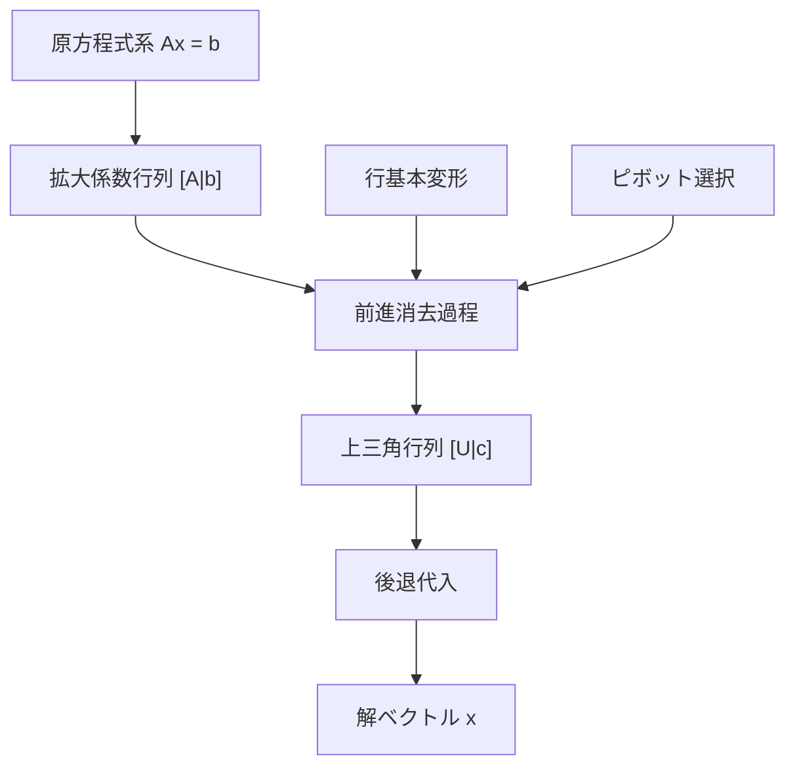
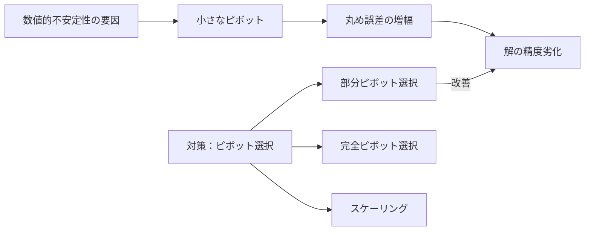
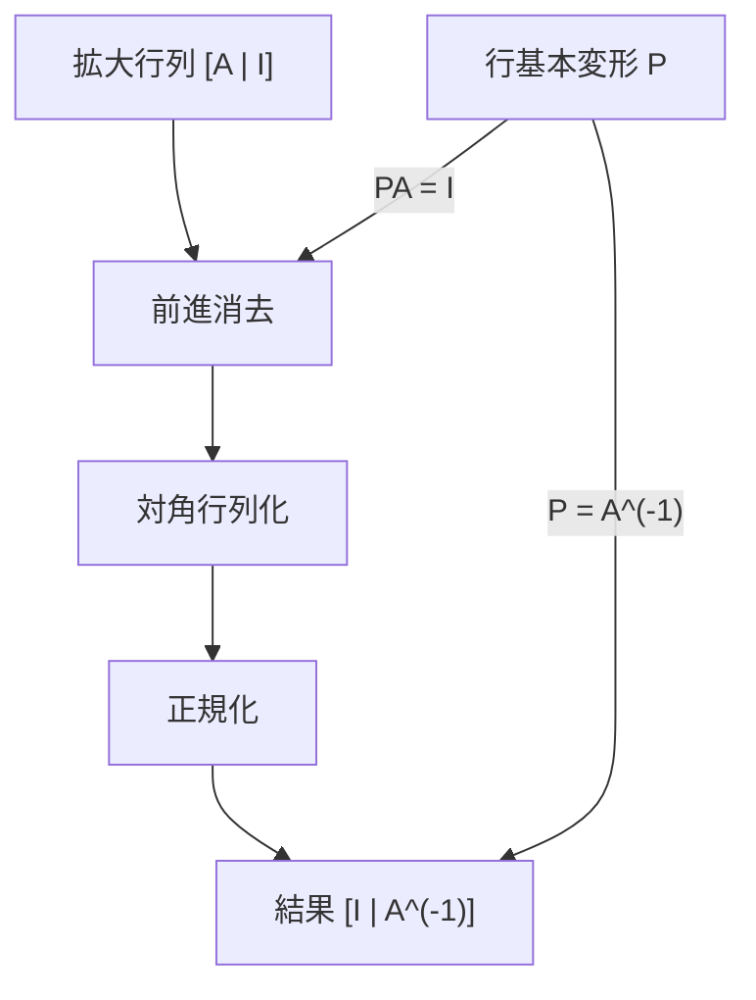
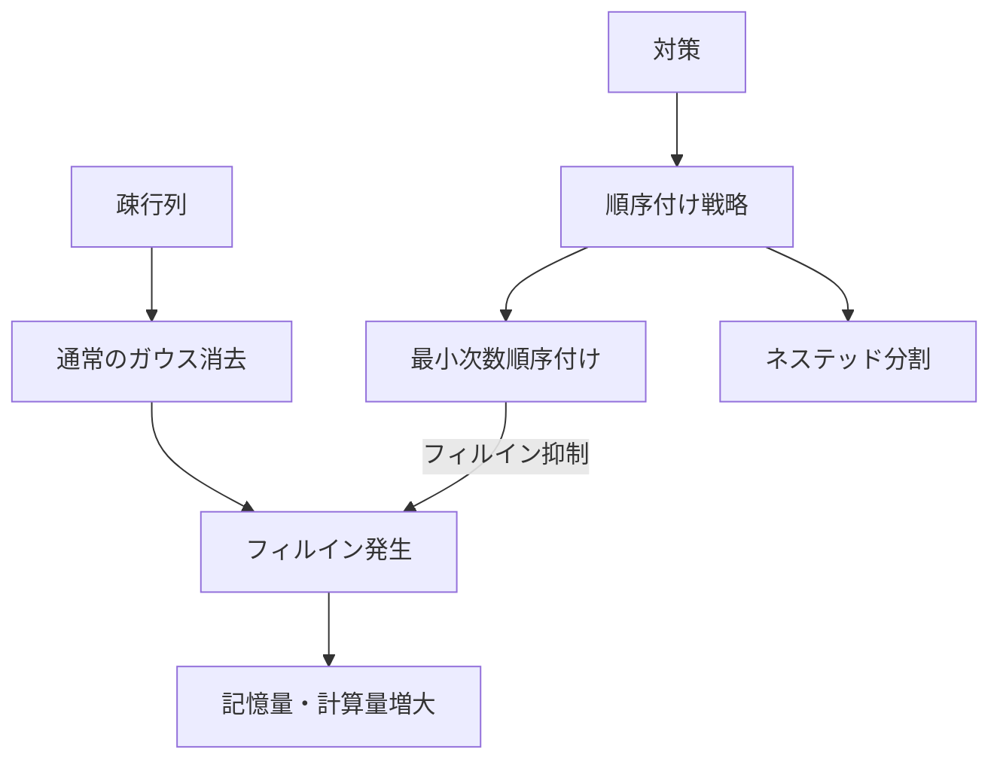

# ガウスの消去法

ガウスの消去法は、連立一次方程式を解くための基本的かつ強力なアルゴリズムである。19世紀初頭にカール・フリードリヒ・ガウスによって体系化されたこの手法は、現代の数値線形代数の礎となっており、科学技術計算から競技プログラミングまで幅広い分野で活用されている。本稿では、ガウスの消去法の数学的基礎から実装上の詳細まで、アルゴリズムの本質を深く掘り下げて解説する。

## 数学的基礎

連立一次方程式 $Ax = b$ を考える。ここで $A$ は $n \times n$ の係数行列、$x$ は未知数ベクトル、$b$ は定数ベクトルである。ガウスの消去法の中核となる発想は、この方程式系を行基本変形によって上三角行列の形に変換し、後退代入によって解を求めるというものである。

行基本変形は以下の3つの操作から成る：
1. ある行を非零のスカラー倍する
2. ある行に別の行のスカラー倍を加える
3. 2つの行を入れ替える

これらの操作は、連立方程式の解を変えることなく、係数行列の形を変換できる。数学的には、各行基本変形は可逆行列の左からの乗算として表現できる。つまり、$Ax = b$ に対して行基本変形を施すことは、$P_k \cdots P_2 P_1 A x = P_k \cdots P_2 P_1 b$ という形で表される。ここで各 $P_i$ は基本行列である。



## アルゴリズムの詳細

ガウスの消去法は、前進消去（forward elimination）と後退代入（back substitution）の2つの段階から構成される。

### 前進消去

前進消去の目的は、係数行列を上三角行列に変換することである。$k$ 番目のステップ（$k = 1, 2, \ldots, n-1$）では、第 $k$ 列の対角成分より下の要素をすべて0にする。これは、第 $i$ 行（$i > k$）から第 $k$ 行の適切な倍数を引くことで実現される。

具体的には、乗数 $m_{ik} = a_{ik} / a_{kk}$ を計算し、第 $i$ 行から第 $k$ 行の $m_{ik}$ 倍を引く。ただし、$a_{kk} = 0$ の場合は除算が定義されないため、ピボット選択が必要となる。

```cpp
// Forward elimination (simplified)
for (int k = 0; k < n - 1; k++) {
    for (int i = k + 1; i < n; i++) {
        double m = A[i][k] / A[k][k];
        for (int j = k; j < n; j++) {
            A[i][j] -= m * A[k][j];
        }
        b[i] -= m * b[k];
    }
}
```

### 後退代入

上三角行列が得られたら、最後の行から順に未知数を求めていく。第 $n$ 行からは $x_n = b_n / a_{nn}$ が直接求まる。一般に、$x_i$ は以下の式で計算される：

$$x_i = \frac{1}{a_{ii}} \left( b_i - \sum_{j=i+1}^{n} a_{ij} x_j \right)$$

この過程は、既に求めた $x_{i+1}, x_{i+2}, \ldots, x_n$ を用いて $x_i$ を計算するため、後退代入と呼ばれる。

## 計算量と数値的安定性

ガウスの消去法の計算量は、前進消去が主要な部分を占める。第 $k$ ステップでは、$(n-k) \times (n-k)$ の部分行列に対して演算を行うため、全体の演算回数は：

$$\sum_{k=1}^{n-1} (n-k)^2 \approx \frac{n^3}{3}$$

となる。後退代入の計算量は $O(n^2)$ であるため、全体として $O(n^3)$ の計算量となる[^1]。

数値的安定性は、ガウスの消去法を実装する上で極めて重要な考慮事項である。浮動小数点演算における丸め誤差は、特に小さなピボット（対角要素）で除算する際に増幅される。この問題に対処するため、部分ピボット選択（partial pivoting）が標準的に用いられる。



## ピボット選択戦略

### 部分ピボット選択

部分ピボット選択では、各ステップで現在の列において絶対値が最大の要素を持つ行と交換する。これにより、除算における分母を可能な限り大きくし、丸め誤差の増幅を抑制する。

```cpp
// Partial pivoting
int maxRow = k;
for (int i = k + 1; i < n; i++) {
    if (abs(A[i][k]) > abs(A[maxRow][k])) {
        maxRow = i;
    }
}
if (maxRow != k) {
    swap(A[k], A[maxRow]);
    swap(b[k], b[maxRow]);
}
```

部分ピボット選択を用いたガウスの消去法の安定性は、成長因子（growth factor）によって特徴づけられる。成長因子 $\rho$ は、消去過程で現れる要素の最大値と元の行列の要素の最大値の比として定義される。Wilkinsonの後退誤差解析によれば、部分ピボット選択では $\rho \leq 2^{n-1}$ となるが、実用上はこの上界に達することは稀である[^2]。

### 完全ピボット選択

完全ピボット選択では、残りの部分行列全体から絶対値最大の要素を選び、行と列の両方の交換を行う。これは部分ピボット選択よりも安定性が高いが、計算コストも増大する。競技プログラミングでは、問題の制約によっては完全ピボット選択が必要な場合もある。

## 特異行列と階数の判定

ガウスの消去法の過程で、すべての候補要素が0（または数値的に0に近い）となる場合、行列は特異（singular）である。この場合、連立方程式は一意解を持たない。アルゴリズムの実行中に行列の階数（rank）を判定することも可能である。

```cpp
int rank = 0;
for (int k = 0; k < n; k++) {
    // Find pivot
    int pivot = -1;
    for (int i = k; i < n; i++) {
        if (abs(A[i][k]) > EPS) {
            pivot = i;
            break;
        }
    }
    
    if (pivot == -1) continue;  // Skip this column
    
    rank++;
    // Continue with elimination...
}
```

階数の判定は、線形従属性の検出や解空間の次元の決定に有用である。特に、$\text{rank}(A) < n$ の場合、斉次方程式 $Ax = 0$ は非自明な解を持つ。

## 逆行列の計算

ガウスの消去法を拡張することで、逆行列を効率的に計算できる。基本的なアイデアは、拡大行列 $[A | I]$ に対してガウス・ジョルダン法を適用し、$[I | A^{-1}]$ の形に変換することである。



ガウス・ジョルダン法では、前進消去に加えて後退消去も行い、係数行列を単位行列に変換する。この過程で右側の単位行列に施された変換の累積が逆行列となる。計算量は通常のガウスの消去法と同じ $O(n^3)$ である。

## 行列式の計算

ガウスの消去法の副産物として、行列式を効率的に計算できる。上三角行列の行列式は対角要素の積であるため、前進消去の過程で行った行交換の回数を記録しておけば、元の行列の行列式が求まる。

$$\det(A) = (-1)^s \prod_{i=1}^{n} u_{ii}$$

ここで $s$ は行交換の回数、$u_{ii}$ は上三角行列の対角要素である。この方法は、余因子展開による $O(n!)$ の計算量と比較して、$O(n^3)$ で行列式を計算できる点で優れている。

## 連立方程式の解の構造

ガウスの消去法を用いることで、連立方程式 $Ax = b$ の解の構造を完全に特徴づけることができる。拡大係数行列 $[A | b]$ に対して行基本変形を施し、簡約行階段形（reduced row echelon form）を得ることで、以下の情報が得られる：

1. **解の存在性**: $\text{rank}(A) = \text{rank}([A | b])$ のとき、かつそのときに限り解が存在する（Rouché-Capelliの定理）
2. **解の一意性**: $\text{rank}(A) = n$ のとき、かつそのときに限り解は一意である
3. **解空間の構造**: 一般解は特殊解と斉次方程式の解空間の和として表される

## 数値的考察：条件数と誤差解析

行列の条件数（condition number）は、入力の微小な変化が解にどの程度影響するかを表す指標である。条件数 $\kappa(A) = \|A\| \|A^{-1}\|$ が大きい行列は悪条件（ill-conditioned）と呼ばれ、数値的に不安定である。

ガウスの消去法で得られた数値解 $\tilde{x}$ の相対誤差は、以下のように評価される[^3]：

$$\frac{\|\tilde{x} - x\|}{\|x\|} \leq \kappa(A) \cdot \frac{\|r\|}{\|b\|}$$

ここで $r = b - A\tilde{x}$ は残差ベクトルである。この不等式は、条件数が大きい場合、小さな残差でも大きな誤差を生じる可能性を示している。

## 疎行列への対応

実用的な問題では、係数行列が疎（sparse）である場合が多い。疎行列に対して通常のガウスの消去法を適用すると、フィルイン（fill-in）と呼ばれる現象により、元々0だった要素が非零になることがある。



フィルインを最小化するため、行と列の順序を適切に選ぶ順序付け（ordering）戦略が重要となる。最小次数順序付け（minimum degree ordering）やネステッド分割（nested dissection）などの手法が知られている。

## 競技プログラミングにおける実装

競技プログラミングでは、ガウスの消去法は主に以下の問題で活用される：

1. **線形方程式系の求解**: 直接的な応用
2. **行列のランク計算**: グラフの独立性判定など
3. **行列式の計算**: 組み合わせ問題での数え上げ
4. **XOR方程式系**: $\mathbb{F}_2$ 上での線形代数

特にXOR方程式系は、ビット演算を用いて効率的に実装できる：

```cpp
// XOR Gaussian elimination
const int MAXN = 100;
bitset<MAXN> A[MAXN];
int rank = 0;

for (int col = 0; col < n; col++) {
    int pivot = -1;
    for (int row = rank; row < n; row++) {
        if (A[row][col]) {
            pivot = row;
            break;
        }
    }
    
    if (pivot == -1) continue;
    
    swap(A[pivot], A[rank]);
    
    for (int row = 0; row < n; row++) {
        if (row != rank && A[row][col]) {
            A[row] ^= A[rank];
        }
    }
    rank++;
}
```

## 実装上の注意点

### 数値精度の管理

浮動小数点演算では、適切な許容誤差（epsilon）の設定が重要である。一般的には、機械イプシロンの平方根程度（倍精度で約 $10^{-8}$）が用いられるが、問題の条件数によって調整が必要である。

### メモリアクセスパターン

現代のコンピュータアーキテクチャでは、キャッシュ効率が性能に大きく影響する。行優先（row-major）の配列レイアウトでは、内側のループで行方向にアクセスすることでキャッシュミスを削減できる。

### 並列化

ガウスの消去法の並列化は、各ステップで依存関係があるため単純ではない。しかし、ブロック化アルゴリズムを用いることで、BLAS（Basic Linear Algebra Subprograms）レベル3の演算として実装し、効率的な並列化が可能となる[^4]。

## 発展的話題：LU分解との関係

ガウスの消去法は、本質的に行列のLU分解（LU decomposition）を計算している。前進消去の過程で用いた乗数 $m_{ik}$ を記録すると、下三角行列 $L$ が構成できる：

$$L = \begin{pmatrix}
1 & & & \\
m_{21} & 1 & & \\
m_{31} & m_{32} & 1 & \\
\vdots & \vdots & \ddots & 1
\end{pmatrix}$$

このとき、$PA = LU$ が成り立つ（$P$ は行交換を表す置換行列）。LU分解の観点から見ると、ガウスの消去法は $L$ と $U$ を同時に計算し、即座に前進・後退代入を行うアルゴリズムと解釈できる。

## 数値線形代数ライブラリでの実装

実用的な数値計算では、LAPACK（Linear Algebra Package）などの高度に最適化されたライブラリが使用される。LAPACKのDGETRFルーチンは、部分ピボット選択付きLU分解を実装しており、以下の最適化が施されている：

1. **ブロック化アルゴリズム**: 行列をブロックに分割し、BLAS3演算を活用
2. **再帰的アルゴリズム**: キャッシュ効率を向上させる再帰的な実装
3. **遅延更新**: ピボット選択と消去操作を分離し、データ再利用を促進

これらの最適化により、理論的な計算量は同じでも、実際の性能は数倍から数十倍向上する。

## 誤差の事後評価と反復改良

ガウスの消去法で得られた解の精度を向上させる手法として、反復改良（iterative refinement）がある。基本的なアイデアは、残差 $r = b - Ax^{(k)}$ を計算し、補正方程式 $A\delta = r$ を解いて解を更新することである：

$$x^{(k+1)} = x^{(k)} + \delta$$

反復改良の成功には、残差の計算を高精度（例えば倍精度演算に対して拡張精度）で行うことが重要である。適切に実装された反復改良により、悪条件問題でも機械精度に近い解が得られることがある[^5]。

ガウスの消去法は、その単純さゆえに基本的なアルゴリズムと見なされがちだが、数値的安定性、効率的な実装、理論的性質など、多くの深い側面を持つ。線形代数の中核を成すこのアルゴリズムの理解は、より高度な数値計算手法の基礎となる。特に競技プログラミングにおいては、問題の制約や要求精度に応じて適切な実装を選択し、必要に応じて最適化を施すことが求められる。本稿で述べた理論的背景と実装技術を基に、読者が様々な問題に対して適切にガウスの消去法を適用できることを期待する。

[^1]: Golub, G. H., & Van Loan, C. F. (2013). Matrix computations (4th ed.). Johns Hopkins University Press.
[^2]: Higham, N. J. (2002). Accuracy and stability of numerical algorithms (2nd ed.). SIAM.
[^3]: Trefethen, L. N., & Bau III, D. (1997). Numerical linear algebra. SIAM.
[^4]: Dongarra, J. J., Duff, I. S., Sorensen, D. C., & Van der Vorst, H. A. (1998). Numerical linear algebra for high-performance computers. SIAM.
[^5]: Demmel, J. W. (1997). Applied numerical linear algebra. SIAM.