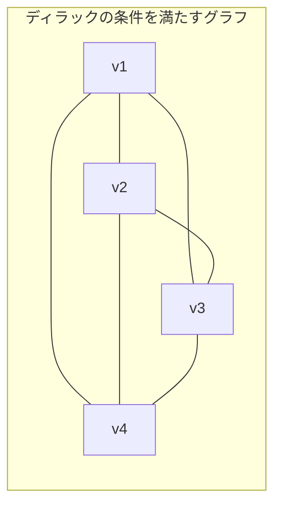
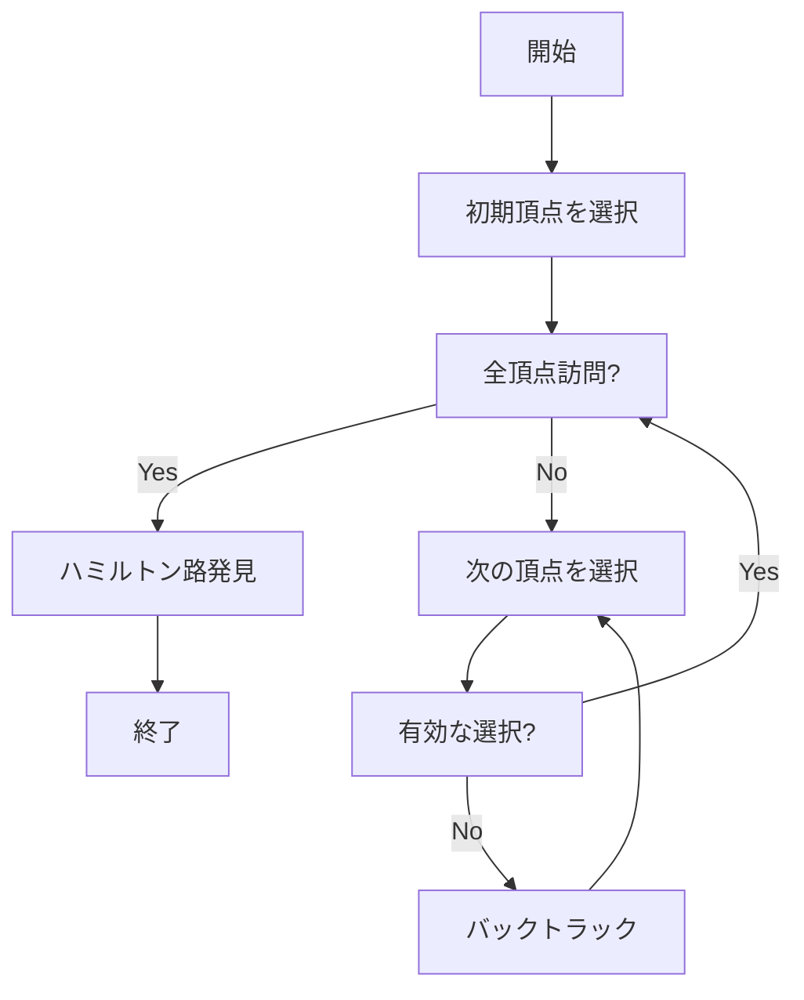
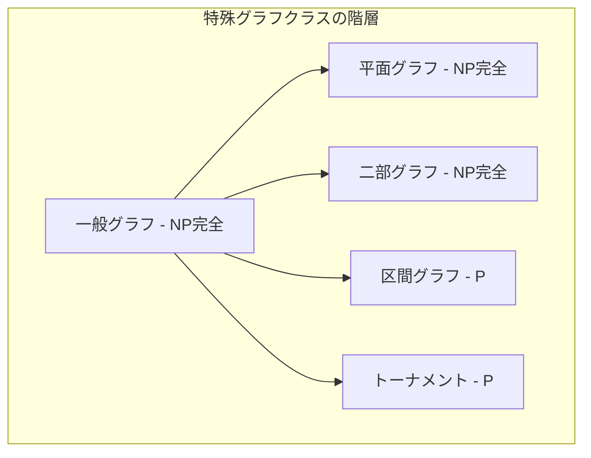
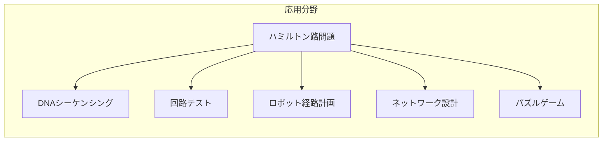

# ハミルトン路

グラフ理論において、ハミルトン路（Hamiltonian Path）は、グラフの全ての頂点をちょうど一度ずつ通る経路を指す概念である。この問題は、1857年にアイルランドの数学者ウィリアム・ローワン・ハミルトンが考案したイコシアンゲームに由来する^[1]^。ハミルトン路問題は、その単純な定義とは対照的に、計算複雑性理論においてNP完全問題として知られており、効率的な解法が存在しない代表的な問題の一つとなっている。

グラフ理論の基本的な問題でありながら、ハミルトン路問題は巡回セールスマン問題（TSP）、タンパク質フォールディング、DNAシーケンシングなど、実世界の様々な応用と密接に関連している。競技プログラミングにおいても、ハミルトン路問題は動的計画法とビット演算を組み合わせた高度な技法を要求する重要な問題として頻繁に出題される。

## 定義と基本概念

グラフG = (V, E)において、頂点集合Vの全ての要素を含む経路がハミルトン路である。より形式的には、v₁, v₂, ..., vₙを頂点集合Vの全ての要素とするとき、任意のi (1 ≤ i < n)に対して(vᵢ, vᵢ₊₁) ∈ Eが成り立つような頂点の列v₁, v₂, ..., vₙをハミルトン路と呼ぶ。このとき、各頂点は経路中にちょうど一度だけ現れることに注意する必要がある。


ハミルトン路と密接に関連する概念として、ハミルトン閉路（Hamiltonian Cycle）がある。ハミルトン閉路は、ハミルトン路の始点と終点が辺で結ばれているもの、つまり全ての頂点をちょうど一度ずつ通って始点に戻る閉路である。グラフがハミルトン路を持つための必要十分条件は、そのグラフに2つの次数1の頂点を追加し、それらを元のグラフの任意の2頂点に接続したグラフがハミルトン閉路を持つことである。

ハミルトン路問題の判定版は、「与えられたグラフGにハミルトン路が存在するか」を問う決定問題である。この問題は1972年にリチャード・カープによってNP完全であることが証明された^[2]^。NP完全性の証明は、3-SATからの多項式時間帰着によって行われる。

## 数学的性質と定理

ハミルトン路の存在性に関する研究は、グラフ理論の重要な分野を形成している。完全グラフKₙは常にハミルトン路を持つが、一般のグラフに対してハミルトン路の存在を判定する効率的なアルゴリズムは知られていない。しかし、特定の条件下でハミルトン路の存在を保証するいくつかの十分条件が知られている。

ディラックの定理（1952年）は、n頂点グラフG（n ≥ 3）において、全ての頂点の次数がn/2以上であれば、Gはハミルトン閉路を持つことを示している^[3]^。この定理の系として、同じ条件下でGはハミルトン路も持つことが導かれる。オアの定理（1960年）は、より弱い条件として、隣接していない任意の2頂点u, vに対してdeg(u) + deg(v) ≥ nが成り立てば、グラフはハミルトン閉路を持つことを示している^[4]^。



ハミルトン路問題の特殊ケースとして、トーナメントグラフ（完全有向グラフ）においては、常にハミルトン路が存在することが知られている。これはレデイの定理として知られ、帰納法によって証明される。n頂点のトーナメントでは、任意の頂点vに対して、vへの入次数をd⁻(v)、出次数をd⁺(v)とすると、d⁻(v) + d⁺(v) = n - 1が成り立つ。

## 計算複雑性とNP完全性

ハミルトン路問題のNP完全性は、計算複雑性理論における基本的な結果の一つである。問題がNPに属することは自明である。なぜなら、与えられた頂点の列がハミルトン路であるかどうかは、各頂点が一度ずつ現れることと、連続する頂点間に辺が存在することを確認すれば多項式時間で検証できるからである。

NP困難性の証明は、3-SATからの帰着によって行われる。3-SAT問題の各変数に対してガジェットと呼ばれる部分グラフを構成し、各節に対して別のガジェットを構成する。これらのガジェットを適切に接続することで、元の3-SAT式が充足可能であることと、構成されたグラフがハミルトン路を持つことが同値になるようにする。この構成は多項式時間で実行可能であり、したがってハミルトン路問題はNP完全である。


有向グラフにおけるハミルトン路問題も同様にNP完全である。さらに、平面グラフ、3-正則グラフ、二部グラフなど、多くの制限されたグラフクラスにおいてもハミルトン路問題はNP完全性を保持する。唯一の例外として、区間グラフ、円弧グラフ、置換グラフなどの特殊なグラフクラスでは多項式時間アルゴリズムが存在する。

## 解法アルゴリズム

ハミルトン路問題に対する厳密解法として、最も基本的なものは全探索アルゴリズムである。n頂点グラフに対して、可能な頂点の順列は n! 通り存在し、それぞれがハミルトン路であるかを確認する。この手法の時間計算量はO(n! × n)となり、実用的ではない。

より効率的な解法として、動的計画法を用いたHeld-Karpアルゴリズム（1962年）がある^[5]^。このアルゴリズムは、部分集合Sと終点vに対して、Sに含まれる全ての頂点を通ってvで終わる経路の存在性をdp[S][v]として記録する。状態数は2ⁿ × nであり、各状態の計算にO(n)時間かかるため、全体の時間計算量はO(n² × 2ⁿ)、空間計算量はO(n × 2ⁿ)となる。

```python
def hamiltonian_path_dp(graph, n):
    # dp[mask][v] = True if there exists a path visiting all vertices in mask ending at v
    dp = [[False] * n for _ in range(1 << n)]
    
    # Base case: single vertex paths
    for i in range(n):
        dp[1 << i][i] = True
    
    # Fill dp table
    for mask in range(1 << n):
        for v in range(n):
            if not (mask & (1 << v)) or not dp[mask][v]:
                continue
            for u in range(n):
                if not (mask & (1 << u)) and graph[v][u]:
                    dp[mask | (1 << u)][u] = True
    
    # Check if Hamiltonian path exists
    full_mask = (1 << n) - 1
    return any(dp[full_mask][v] for v in range(n))
```

バックトラッキングアルゴリズムは、実践的には動的計画法よりも高速に動作することが多い。探索中に枝刈りを行うことで、無駄な探索を削減できる。効果的な枝刈り戦略として、次数による制約、到達可能性の検査、対称性の除去などがある。



近年では、SATソルバーを用いたアプローチも注目されている。ハミルトン路問題をSAT問題に変換し、高度に最適化されたSATソルバーで解く手法である。変数x_{i,j}を「i番目に頂点jを訪問する」という命題とし、適切な制約を加えることで、元の問題と等価なSAT式を構成できる。

## 競技プログラミングにおける実装技法

競技プログラミングでは、ハミルトン路問題は主に小規模なグラフ（n ≤ 20）に対して出題される。この制約下では、ビットDPによる実装が標準的である。ビット演算を活用することで、集合演算を高速に実行でき、メモリアクセスパターンも改善される。

```cpp
const int MAXN = 20;
int adj[MAXN][MAXN];
int dp[1 << MAXN][MAXN];

bool hasHamiltonianPath(int n) {
    memset(dp, -1, sizeof(dp));
    
    // Initialize: single vertex
    for (int i = 0; i < n; i++) {
        dp[1 << i][i] = 1;
    }
    
    // DP transition
    for (int mask = 1; mask < (1 << n); mask++) {
        for (int v = 0; v < n; v++) {
            if (!(mask & (1 << v)) || dp[mask][v] == -1) continue;
            
            for (int u = 0; u < n; u++) {
                if (!(mask & (1 << u)) && adj[v][u]) {
                    dp[mask | (1 << u)][u] = 1;
                }
            }
        }
    }
    
    // Check if Hamiltonian path exists
    int full_mask = (1 << n) - 1;
    for (int v = 0; v < n; v++) {
        if (dp[full_mask][v] == 1) return true;
    }
    return false;
}
```

メモリ最適化のテクニックとして、dpテーブルの次元を削減する方法がある。現在の状態から次の状態への遷移のみを考慮すれば、前の層の情報だけを保持すればよい。これにより空間計算量をO(2ⁿ)に削減できる。

競技プログラミングでは、ハミルトン路問題の変種も頻繁に出題される。最短ハミルトン路問題では、単に経路の存在性だけでなく、辺の重みの総和を最小化する経路を求める。この問題も同様のDPアプローチで解けるが、dp[mask][v]を「集合maskの頂点を訪問してvで終わる最短経路長」として定義する。

```cpp
const int INF = 1e9;
int dist[MAXN][MAXN];
int dp[1 << MAXN][MAXN];

int shortestHamiltonianPath(int n) {
    fill(&dp[0][0], &dp[0][0] + sizeof(dp) / sizeof(int), INF);
    
    // Initialize
    for (int i = 0; i < n; i++) {
        dp[1 << i][i] = 0;
    }
    
    // DP transition
    for (int mask = 1; mask < (1 << n); mask++) {
        for (int v = 0; v < n; v++) {
            if (!(mask & (1 << v)) || dp[mask][v] == INF) continue;
            
            for (int u = 0; u < n; u++) {
                if (!(mask & (1 << u))) {
                    dp[mask | (1 << u)][u] = min(dp[mask | (1 << u)][u], 
                                                  dp[mask][v] + dist[v][u]);
                }
            }
        }
    }
    
    // Find minimum
    int full_mask = (1 << n) - 1;
    int ans = INF;
    for (int v = 0; v < n; v++) {
        ans = min(ans, dp[full_mask][v]);
    }
    return ans;
}
```

## 特殊なグラフクラスにおけるハミルトン路

特定のグラフクラスでは、ハミルトン路問題を多項式時間で解くことができる。トーナメントグラフでは、常にハミルトン路が存在し、トポロジカルソートの要領でO(n²)時間で構成できる。区間グラフでは、区間の包含関係と重なりを利用した効率的なアルゴリズムが存在する。



弦グラフ（chordal graph）においては、完全消去順序を利用したアプローチが研究されている。木幅が制限されたグラフでは、木分解を用いた動的計画法により、固定パラメータ扱いやすい（FPT）アルゴリズムが存在する。木幅kのグラフに対して、O(k^k × n)時間でハミルトン路の存在を判定できる。

格子グラフにおけるハミルトン路問題は、特に興味深い性質を持つ。m × nの格子グラフがハミルトン路を持つための必要十分条件は、mnが偶数であるか、mとnの少なくとも一方が1であることである。この結果は、格子グラフの二部性と頂点数の偶奇性から導かれる。

## 近似アルゴリズムとヒューリスティクス

ハミルトン路問題は判定問題であるため、厳密な意味での近似アルゴリズムは存在しない。しかし、関連する最適化問題である最長路問題や、できるだけ多くの頂点を訪問する路を見つける問題に対しては、近似アルゴリズムが研究されている。

最も単純なヒューリスティクスは貪欲法である。未訪問の頂点の中から、現在の頂点に最も「近い」頂点を選択していく。距離の定義は問題に依存するが、次数の小さい頂点を優先する、クラスタリング係数を考慮するなどの戦略がある。

```python
def greedy_hamiltonian_path(graph, n):
    visited = [False] * n
    path = []
    
    # Start from vertex with minimum degree
    degrees = [sum(graph[i]) for i in range(n)]
    current = min(range(n), key=lambda i: degrees[i])
    
    visited[current] = True
    path.append(current)
    
    while len(path) < n:
        best_next = -1
        best_score = -1
        
        for next_v in range(n):
            if not visited[next_v] and graph[current][next_v]:
                # Score based on unvisited neighbors
                score = sum(1 for u in range(n) 
                           if not visited[u] and graph[next_v][u])
                if score > best_score:
                    best_score = score
                    best_next = next_v
        
        if best_next == -1:
            break  # No valid next vertex
            
        current = best_next
        visited[current] = True
        path.append(current)
    
    return path if len(path) == n else None
```

遺伝的アルゴリズム、シミュレーテッドアニーリング、タブーサーチなどのメタヒューリスティクスも、大規模なインスタンスに対して実用的な解を得るために使用される。これらの手法は、解の質と計算時間のトレードオフを調整できる利点がある。

## 実世界での応用

ハミルトン路問題は、理論的な興味だけでなく、多くの実用的な応用を持つ。DNAシーケンシングでは、短いDNA断片（リード）を重ね合わせて元の配列を再構成する際に、オーバーラップグラフ上でハミルトン路を見つける問題として定式化される。

回路設計では、テストパターンの生成においてハミルトン路が利用される。全ての論理ゲートを一度ずつテストするための最短のテストシーケンスを見つける問題は、状態遷移グラフ上でのハミルトン路問題として表現できる。



コンピュータネットワークにおいては、全てのノードを効率的に巡回するためのルーティングプロトコルの設計に応用される。特に、センサーネットワークにおけるデータ収集や、分散システムにおけるトークンパッシングなどで重要な役割を果たす。

## 高度な解法技術

現代的なアプローチとして、代数的手法を用いたハミルトン路の検出がある。包含排除原理に基づくBjörklundのアルゴリズム（2010年）は、O*(2ⁿ)時間でハミルトン路の個数を数え上げることができる^[6]^。ここでO*記法は多項式因子を無視した計算量を表す。

並列アルゴリズムの研究も進んでいる。ビットDPの状態空間を複数のプロセッサに分割し、並列に計算することで高速化が可能である。GPUを用いた実装では、ビット演算の並列性を活用して、CPUベースの実装と比較して大幅な高速化を達成している。

量子アルゴリズムの分野では、グローバーのアルゴリズムを応用したO*(√2ⁿ)時間のアルゴリズムが提案されている。量子ウォークを用いたより効率的なアルゴリズムの研究も活発である。

機械学習アプローチも注目を集めている。グラフニューラルネットワーク（GNN）を用いて、グラフの構造的特徴からハミルトン路の存在確率を予測する研究がある。完全な解を保証するものではないが、大規模グラフに対する前処理やヒューリスティクスの指針として有用である。

ハミルトン路問題は、その単純な定義にもかかわらず、計算複雑性理論、アルゴリズム設計、実用的応用において重要な位置を占める。NP完全性という理論的な壁がありながら、特殊ケースでの多項式時間アルゴリズム、実用的なヒューリスティクス、並列化による高速化など、多角的なアプローチが研究されている。競技プログラミングにおいても、動的計画法とビット演算を組み合わせた洗練された実装技術が要求される、教育的価値の高い問題である。

---

^[1]^ W. R. Hamilton, "The Icosian Game", 1857  
^[2]^ R. M. Karp, "Reducibility Among Combinatorial Problems", 1972  
^[3]^ G. A. Dirac, "Some Theorems on Abstract Graphs", Proceedings of the London Mathematical Society, 1952  
^[4]^ O. Ore, "Note on Hamilton Circuits", The American Mathematical Monthly, 1960  
^[5]^ M. Held and R. M. Karp, "A Dynamic Programming Approach to Sequencing Problems", 1962  
^[6]^ A. Björklund, "Determinant Sums for Undirected Hamiltonicity", 2010  