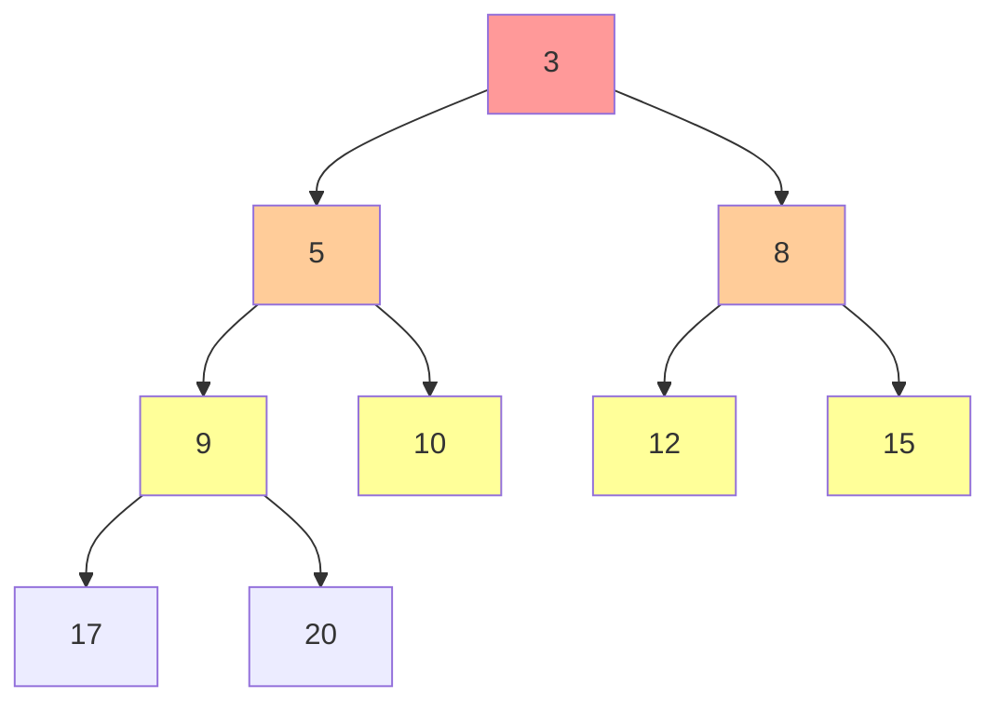
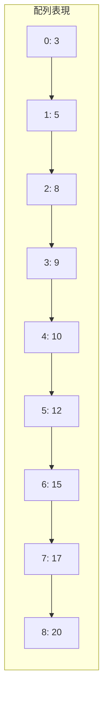
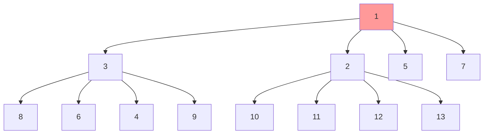
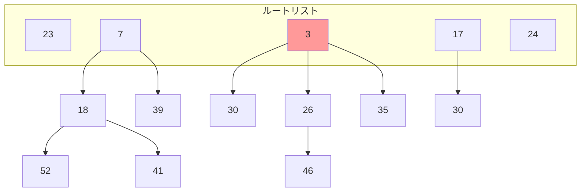

# ヒープ

ヒープは、特定の順序性を持つ完全二分木として実装されるデータ構造である。その名前の由来は、要素が積み重なった山（heap）のような構造を持つことからきている。ヒープの最も重要な特性は、親ノードと子ノードの間に常に一定の大小関係が保たれることであり、この性質により効率的な優先度付きキューの実装が可能となる。競技プログラミングにおいては、ダイクストラ法のような最短経路アルゴリズムや、複数のソート済み配列のマージ、中央値の動的管理など、様々な場面で活用される基本的なデータ構造である。

ヒープの本質的な価値は、要素の挿入と最小値（または最大値）の取得・削除を対数時間で実現できることにある。配列を用いた素朴な実装では、最小値の取得は $O(1)$ で可能だが、削除後の配列の再構成に $O(n)$ の時間が必要となる。一方、ヒープを用いることで、これらの操作を $O(\log n)$ で実現でき、大規模なデータセットに対しても効率的な処理が可能となる。

## ヒープ性質と二分ヒープの構造

ヒープは大きく分けて最小ヒープ（min-heap）と最大ヒープ（max-heap）の2種類が存在する。最小ヒープでは、任意のノードの値がその子ノードの値以下となる性質を持ち、最大ヒープではその逆の関係が成立する。以下では主に最小ヒープを扱うが、不等号の向きを逆にすることで最大ヒープとしても同様に機能する。



二分ヒープの最も興味深い性質は、完全二分木として配列上に効率的に表現できることである。根ノードを配列のインデックス0（または1）に配置し、インデックス $i$ のノードに対して、左の子ノードを $2i + 1$、右の子ノードを $2i + 2$、親ノードを $\lfloor (i-1)/2 \rfloor$ として表現する。この配列表現により、ポインタを用いた木構造の実装と比較して、メモリ効率が良く、キャッシュ効率も高い実装が可能となる。



ヒープ性質を維持するための基本操作として、ヒープ化（heapify）操作が重要である。ヒープ化には上方向（sift-up）と下方向（sift-down）の2種類があり、それぞれ異なる場面で使用される。

## ヒープの基本操作

ヒープの実装において最も重要な操作は、要素の挿入（push）と最小要素の削除（pop）である。これらの操作は、ヒープ性質を維持しながら効率的に実行される必要がある。

要素の挿入では、新しい要素を配列の末尾に追加し、その後sift-up操作によってヒープ性質を回復する。sift-up操作は、新しく追加された要素を親ノードと比較し、親ノードより小さい場合は交換を行う。この操作を根ノードに到達するか、親ノードより大きくなるまで繰り返す。

```python
def push(heap, value):
    heap.append(value)
    index = len(heap) - 1
    
    # sift-up operation
    while index > 0:
        parent = (index - 1) // 2
        if heap[parent] > heap[index]:
            heap[parent], heap[index] = heap[index], heap[parent]
            index = parent
        else:
            break
```

最小要素の削除では、根ノード（最小要素）を取り出し、配列の最後の要素を根ノードに移動させる。その後、sift-down操作によってヒープ性質を回復する。sift-down操作では、現在のノードを両方の子ノードと比較し、最小の値を持つノードと交換を行う。

```python
def pop(heap):
    if not heap:
        raise IndexError("pop from empty heap")
    
    min_val = heap[0]
    heap[0] = heap[-1]
    heap.pop()
    
    if heap:
        # sift-down operation
        index = 0
        while True:
            left = 2 * index + 1
            right = 2 * index + 2
            smallest = index
            
            if left < len(heap) and heap[left] < heap[smallest]:
                smallest = left
            if right < len(heap) and heap[right] < heap[smallest]:
                smallest = right
                
            if smallest != index:
                heap[index], heap[smallest] = heap[smallest], heap[index]
                index = smallest
            else:
                break
    
    return min_val
```

これらの操作の時間計算量は、木の高さに依存する。完全二分木の高さは $\lfloor \log_2 n \rfloor$ であるため、挿入と削除の両方の操作は $O(\log n)$ の時間計算量となる。

## ヒープ構築の効率的アルゴリズム

$n$ 個の要素からヒープを構築する場合、単純に各要素を順番に挿入していく方法では $O(n \log n)$ の時間がかかる。しかし、より効率的な構築方法として、ボトムアップ方式のヒープ構築アルゴリズムが存在する。このアルゴリズムは、Floyd によって提案され、$O(n)$ の時間計算量でヒープを構築できる。

ボトムアップ構築では、配列の後半部分（葉ノード）は既に単独でヒープ性質を満たしているため、非葉ノードに対してのみsift-down操作を実行する。最後の非葉ノードのインデックスは $\lfloor n/2 \rfloor - 1$ であり、このノードから逆順に根ノードまでsift-down操作を適用する。

```python
def build_heap(array):
    n = len(array)
    # Start from the last non-leaf node
    for i in range(n // 2 - 1, -1, -1):
        sift_down(array, i, n)

def sift_down(heap, index, heap_size):
    while True:
        left = 2 * index + 1
        right = 2 * index + 2
        smallest = index
        
        if left < heap_size and heap[left] < heap[smallest]:
            smallest = left
        if right < heap_size and heap[right] < heap[smallest]:
            smallest = right
            
        if smallest != index:
            heap[index], heap[smallest] = heap[smallest], heap[index]
            index = smallest
        else:
            break
```

このアルゴリズムの時間計算量が $O(n)$ である理由は、各レベルでの作業量の総和を考察することで理解できる。高さ $h$ のノードに対するsift-down操作の最大コストは $h$ であり、高さ $h$ のノード数は最大で $\lceil n/2^{h+1} \rceil$ である。したがって、総作業量は：

$$\sum_{h=0}^{\lfloor \log n \rfloor} \lceil n/2^{h+1} \rceil \cdot h \leq n \sum_{h=0}^{\infty} h/2^{h+1} = n$$

## 優先度付きキューとしての応用

ヒープの最も一般的な応用は優先度付きキューの実装である。優先度付きキューは、各要素に優先度が付与されたデータ構造で、常に最高優先度（または最低優先度）の要素を効率的に取り出すことができる。標準的な実装では、要素と優先度のペアを管理し、優先度に基づいてヒープ性質を維持する。

競技プログラミングにおいて、優先度付きキューは以下のような場面で頻繁に使用される：

ダイクストラ法における最短経路探索では、未確定ノードの中から最小距離を持つノードを効率的に選択する必要がある。優先度付きキューを使用することで、この選択を $O(\log n)$ で実行でき、全体の計算量を $O((V + E) \log V)$ に抑えることができる。

```python
def dijkstra(graph, start):
    import heapq
    distances = {node: float('inf') for node in graph}
    distances[start] = 0
    pq = [(0, start)]
    
    while pq:
        current_distance, current_node = heapq.heappop(pq)
        
        if current_distance > distances[current_node]:
            continue
            
        for neighbor, weight in graph[current_node]:
            distance = current_distance + weight
            
            if distance < distances[neighbor]:
                distances[neighbor] = distance
                heapq.heappush(pq, (distance, neighbor))
    
    return distances
```

プリム法による最小全域木の構築でも、優先度付きキューは重要な役割を果たす。未接続の辺の中から最小重みの辺を選択する際に、優先度付きキューを使用することで効率的な実装が可能となる。

## ヒープソートアルゴリズム

ヒープソートは、ヒープのデータ構造を利用した効率的なソートアルゴリズムである。このアルゴリズムは、1964年にJ.W.J. Williamsによって提案され、最悪計算量 $O(n \log n)$ を保証する in-place ソートアルゴリズムとして知られている。

ヒープソートは2つの段階から構成される。第一段階では、入力配列を最大ヒープに変換する。第二段階では、ヒープから要素を1つずつ取り出し、配列の後方から順に配置していく。

```python
def heapsort(array):
    n = len(array)
    
    # Build max heap
    for i in range(n // 2 - 1, -1, -1):
        max_heapify(array, i, n)
    
    # Extract elements from heap one by one
    for i in range(n - 1, 0, -1):
        array[0], array[i] = array[i], array[0]
        max_heapify(array, 0, i)

def max_heapify(array, index, heap_size):
    largest = index
    left = 2 * index + 1
    right = 2 * index + 2
    
    if left < heap_size and array[left] > array[largest]:
        largest = left
    if right < heap_size and array[right] > array[largest]:
        largest = right
        
    if largest != index:
        array[index], array[largest] = array[largest], array[index]
        max_heapify(array, largest, heap_size)
```

ヒープソートの利点は、追加のメモリを必要としない in-place アルゴリズムであることと、最悪計算量が $O(n \log n)$ であることである。一方で、実際の性能ではクイックソートに劣ることが多く、また安定ソートではないという欠点もある。キャッシュ効率の観点では、ヒープ内での要素アクセスパターンが局所性に欠けるため、現代のプロセッサアーキテクチャでは性能が出にくいという特性もある。

## d-aryヒープ

二分ヒープを一般化したものとして、各ノードが最大 $d$ 個の子を持つ d-ary ヒープがある。$d$ の値を増やすことで、木の高さが $\log_d n$ に減少し、挿入操作の性能が向上する。一方で、削除操作では $d$ 個の子ノードとの比較が必要となるため、トレードオフが存在する。



d-ary ヒープにおける親子関係のインデックス計算は以下のようになる：
- 親ノード：$\lfloor (i + d - 2) / d \rfloor$
- $k$ 番目の子ノード：$d \cdot i - d + 2 + k$ （$k = 0, 1, ..., d-1$）

実践的には、$d = 3$ または $d = 4$ の場合が最も効率的であることが多い。これは、メモリアクセスのコストと比較演算のコストのバランスによるものである。特に、外部メモリアルゴリズムや、挿入操作が削除操作よりも頻繁に行われる場合には、d-ary ヒープが有効である。

## フィボナッチヒープ

フィボナッチヒープは、Michael L. FredmanとRobert E. Tarjanによって1984年に提案された、より高度なヒープデータ構造である。このデータ構造は、特定の操作に対して償却計算量での改善を実現し、理論的に最適な時間計算量を達成している[^1]。

[^1]: Fredman, M. L., & Tarjan, R. E. (1987). Fibonacci heaps and their uses in improved network optimization algorithms. Journal of the ACM, 34(3), 596-615.

フィボナッチヒープの主要な操作の償却計算量は以下の通りである：
- 挿入：$O(1)$
- 最小値の検索：$O(1)$
- 2つのヒープの併合：$O(1)$
- キーの減少：$O(1)$
- 最小値の削除：$O(\log n)$



フィボナッチヒープの実装は複雑であり、定数倍が大きいため、実際の応用では二分ヒープの方が高速であることが多い。しかし、理論的な重要性は高く、特にキーの減少操作が頻繁に必要となるアルゴリズム（改良版ダイクストラ法、プリム法など）では、漸近的な性能改善が期待できる。

フィボナッチヒープの名前の由来は、ヒープ内のノード数の解析にフィボナッチ数が現れることからきている。具体的には、ランク $k$ のノードを根とする部分木のノード数は、少なくとも $F_{k+2}$ 個であることが証明される。ここで $F_k$ は $k$ 番目のフィボナッチ数である。

## ペアリングヒープ

ペアリングヒープは、フィボナッチヒープの実装の複雑さを改善することを目的として、1986年にFredman、Sedgewick、Sleator、Tarjanによって提案されたデータ構造である[^2]。実装がシンプルでありながら、実用的な性能を示すことから、多くの場面で使用されている。

[^2]: Fredman, M. L., Sedgewick, R., Sleator, D. D., & Tarjan, R. E. (1986). The pairing heap: A new form of self-adjusting heap. Algorithmica, 1(1-4), 111-129.

ペアリングヒープは、ヒープ順序を満たす多分木として実装される。各ノードは左端の子と右の兄弟へのポインタを持つ、いわゆる「左子右兄弟表現」を用いる。

```cpp
struct PairingHeapNode {
    int key;
    PairingHeapNode* child;
    PairingHeapNode* sibling;
    PairingHeapNode* prev;  // parent or left sibling
};
```

ペアリングヒープの基本操作：

1. **meld（併合）操作**：2つのヒープを併合する際は、ルートの値を比較し、小さい方を新しいルートとし、大きい方をその子として追加する。

2. **insert（挿入）操作**：新しい要素を持つ単一ノードのヒープを作成し、既存のヒープとmeldする。

3. **deleteMin（最小値削除）操作**：ルートを削除し、その子たちを特定の戦略でペアリングして新しいヒープを構築する。

ペアリングヒープの理論的な計算量は完全には解明されていないが、実験的には非常に良好な性能を示す。特に、decrease-key操作が $O(\log \log n)$ の償却計算量で実行できることが予想されており、これはフィボナッチヒープの $O(1)$ には及ばないものの、実用上は十分高速である。

## 競技プログラミングにおける実践的活用

競技プログラミングにおいて、ヒープは様々な問題で活用される。以下に代表的な活用パターンを示す。

### K番目に小さい要素の動的管理

データストリームから常にK番目に小さい要素を効率的に取得する問題では、サイズKの最大ヒープを維持することで解決できる。新しい要素が到着するたびに、ヒープのルート（K番目に小さい要素）と比較し、必要に応じてヒープを更新する。

```python
import heapq

class KthSmallest:
    def __init__(self, k):
        self.k = k
        self.heap = []
    
    def add(self, num):
        if len(self.heap) < self.k:
            heapq.heappush(self.heap, -num)  # max heap using negation
        elif num < -self.heap[0]:
            heapq.heapreplace(self.heap, -num)
    
    def get_kth(self):
        return -self.heap[0] if self.heap else None
```

### 複数のソート済み配列のマージ

K個のソート済み配列を1つのソート済み配列にマージする問題は、各配列の先頭要素を管理する最小ヒープを用いることで効率的に解決できる。全要素数をNとすると、時間計算量は $O(N \log K)$ となる。

```python
def merge_k_sorted_arrays(arrays):
    import heapq
    result = []
    heap = []
    
    # Initialize heap with first element from each array
    for i, array in enumerate(arrays):
        if array:
            heapq.heappush(heap, (array[0], i, 0))
    
    while heap:
        val, array_idx, elem_idx = heapq.heappop(heap)
        result.append(val)
        
        # Add next element from the same array
        if elem_idx + 1 < len(arrays[array_idx]):
            next_val = arrays[array_idx][elem_idx + 1]
            heapq.heappush(heap, (next_val, array_idx, elem_idx + 1))
    
    return result
```

### スカイライン問題

建物の輪郭線（スカイライン）を求める問題では、イベント駆動のアプローチと最大ヒープを組み合わせて解決する。各建物の開始点と終了点をイベントとして処理し、現在の最大高さを動的に管理する。

### 中央値の動的管理

データストリームの中央値を動的に管理する問題では、最大ヒープと最小ヒープの2つを使用する。小さい半分の要素を最大ヒープで、大きい半分の要素を最小ヒープで管理することで、中央値を $O(1)$ で取得できる。

```python
class MedianFinder:
    def __init__(self):
        self.small = []  # max heap
        self.large = []  # min heap
    
    def add_num(self, num):
        import heapq
        
        # Add to max heap
        heapq.heappush(self.small, -num)
        
        # Balance the heaps
        if self.small and self.large and -self.small[0] > self.large[0]:
            val = -heapq.heappop(self.small)
            heapq.heappush(self.large, val)
        
        # Maintain size property
        if len(self.small) > len(self.large) + 1:
            val = -heapq.heappop(self.small)
            heapq.heappush(self.large, val)
        elif len(self.large) > len(self.small):
            val = heapq.heappop(self.large)
            heapq.heappush(self.small, -val)
    
    def find_median(self):
        if len(self.small) > len(self.large):
            return -self.small[0]
        return (-self.small[0] + self.large[0]) / 2.0
```

## 実装上の注意点とパフォーマンス最適化

ヒープの実装において、パフォーマンスを最大化するためには以下の点に注意する必要がある。

### メモリレイアウトとキャッシュ効率

配列ベースのヒープ実装は、連続したメモリ領域を使用するため、基本的にはキャッシュフレンドリーである。しかし、ヒープの高さが増すにつれて、親子間のメモリアドレスの距離が大きくなり、キャッシュミスが発生しやすくなる。これを改善するために、以下のような手法が考えられる：

1. **B-ヒープ**：キャッシュラインサイズに合わせて、複数の要素をまとめて1つのノードとして扱う。
2. **キャッシュ考慮型レイアウト**：van Emde Boasレイアウトなど、メモリアクセスパターンを最適化した配置を使用する。

### インデックス計算の最適化

親子関係のインデックス計算は頻繁に実行されるため、ビット演算を用いた最適化が有効である。例えば、0ベースのインデックスを使用する場合：

```cpp
inline int parent(int i) { return (i - 1) >> 1; }
inline int left_child(int i) { return (i << 1) + 1; }
inline int right_child(int i) { return (i << 1) + 2; }
```

### 比較関数のインライン化

カスタム比較関数を使用する場合、関数呼び出しのオーバーヘッドを避けるために、テンプレートやインライン関数を活用することが重要である。

```cpp
template<typename T, typename Compare = std::less<T>>
class Heap {
    std::vector<T> data;
    Compare comp;
    
    void sift_up(int index) {
        while (index > 0) {
            int p = parent(index);
            if (comp(data[index], data[p])) {
                std::swap(data[index], data[p]);
                index = p;
            } else {
                break;
            }
        }
    }
};
```

### 要素の移動回数の削減

標準的なsift-upやsift-down操作では、要素の交換を繰り返し行う。しかし、移動する要素を一時変数に保存し、最終位置が決まってから1回だけ書き込むことで、メモリアクセス回数を削減できる。

```cpp
void sift_down_optimized(int index) {
    T temp = std::move(data[index]);
    int child;
    
    while ((child = left_child(index)) < size) {
        if (child + 1 < size && comp(data[child + 1], data[child])) {
            child++;
        }
        
        if (comp(data[child], temp)) {
            data[index] = std::move(data[child]);
            index = child;
        } else {
            break;
        }
    }
    
    data[index] = std::move(temp);
}
```

## 高度なヒープアルゴリズムと理論

### ソフトヒープ

ソフトヒープは、Bernard ChazalleとCarl Pommersbaumによって2000年に提案された、確率的なデータ構造である[^3]。このデータ構造は、一定の割合の要素について「不正確」な値を許容することで、すべての操作を定数時間で実行可能にする。

[^3]: Chazelle, B. (2000). The soft heap: an approximate priority queue with optimal error rate. Journal of the ACM, 47(6), 1012-1027.

ソフトヒープの主な特徴：
- すべての操作が $O(1)$ の償却時間計算量
- 最大で $\epsilon n$ 個の要素が「corrupted」（実際の値より大きい値を報告）される可能性がある
- 最小全域木アルゴリズムの理論的改善に使用される

### ランク均衡ヒープ

ランク均衡ヒープは、挿入と削除の両方の操作で最悪計算量 $O(\log \log n)$ を達成する理論的に興味深いデータ構造である。これは、要素を複数のヒープに分散して管理し、各ヒープのサイズを特定の規則に従って維持することで実現される。

### 並列ヒープアルゴリズム

マルチコアプロセッサの普及に伴い、並列ヒープアルゴリズムの研究も進んでいる。主なアプローチには以下がある：

1. **スレッドセーフなヒープ**：細粒度ロックやロックフリーアルゴリズムを用いた実装
2. **分散ヒープ**：複数のローカルヒープを維持し、定期的に統合する手法
3. **バルク操作の並列化**：複数の挿入や削除を同時に処理する手法

## 実装例とベンチマーク

以下に、最適化された二分ヒープの完全な実装例を示す。この実装は、競技プログラミングで使用することを想定し、パフォーマンスと可読性のバランスを考慮している。

```cpp
#include <vector>
#include <functional>
#include <algorithm>

template<typename T, typename Compare = std::less<T>>
class BinaryHeap {
private:
    std::vector<T> heap;
    Compare comp;
    
    void sift_up(size_t idx) {
        T temp = std::move(heap[idx]);
        while (idx > 0) {
            size_t parent = (idx - 1) / 2;
            if (comp(temp, heap[parent])) {
                heap[idx] = std::move(heap[parent]);
                idx = parent;
            } else {
                break;
            }
        }
        heap[idx] = std::move(temp);
    }
    
    void sift_down(size_t idx) {
        T temp = std::move(heap[idx]);
        size_t half = heap.size() / 2;
        
        while (idx < half) {
            size_t child = 2 * idx + 1;
            if (child + 1 < heap.size() && comp(heap[child + 1], heap[child])) {
                ++child;
            }
            
            if (comp(heap[child], temp)) {
                heap[idx] = std::move(heap[child]);
                idx = child;
            } else {
                break;
            }
        }
        heap[idx] = std::move(temp);
    }
    
public:
    BinaryHeap() = default;
    
    explicit BinaryHeap(const Compare& c) : comp(c) {}
    
    template<typename InputIt>
    BinaryHeap(InputIt first, InputIt last, const Compare& c = Compare())
        : heap(first, last), comp(c) {
        build_heap();
    }
    
    void build_heap() {
        if (heap.size() <= 1) return;
        
        for (size_t i = heap.size() / 2; i > 0; --i) {
            sift_down(i - 1);
        }
    }
    
    void push(const T& value) {
        heap.push_back(value);
        sift_up(heap.size() - 1);
    }
    
    void push(T&& value) {
        heap.push_back(std::move(value));
        sift_up(heap.size() - 1);
    }
    
    void pop() {
        if (heap.empty()) return;
        
        heap[0] = std::move(heap.back());
        heap.pop_back();
        
        if (!heap.empty()) {
            sift_down(0);
        }
    }
    
    const T& top() const {
        return heap[0];
    }
    
    bool empty() const {
        return heap.empty();
    }
    
    size_t size() const {
        return heap.size();
    }
    
    void clear() {
        heap.clear();
    }
    
    // Decrease key operation for dijkstra-like algorithms
    void decrease_key(size_t idx, const T& new_value) {
        if (idx >= heap.size() || !comp(new_value, heap[idx])) {
            return;
        }
        
        heap[idx] = new_value;
        sift_up(idx);
    }
};
```

## まとめと発展的話題

ヒープは、その単純な構造にもかかわらず、計算機科学において極めて重要な役割を果たすデータ構造である。二分ヒープの基本的な実装から始まり、フィボナッチヒープやペアリングヒープといった高度な変種まで、様々な形で発展してきた。競技プログラミングにおいては、標準ライブラリのpriority_queueやheapqを使用することが多いが、問題の特性に応じてカスタム実装を行うことで、より効率的な解法を実現できる場合がある。

理論的な観点からは、ヒープの研究は現在も活発に行われており、特に並列計算環境での効率的な実装や、外部メモリアルゴリズムとしての応用など、新しい課題に対する解決策が模索されている。また、機械学習分野においても、k近傍探索やビームサーチなど、ヒープを基盤とするアルゴリズムが重要な役割を果たしている。

実装の観点では、現代のハードウェアアーキテクチャに適応した最適化が重要となっている。キャッシュ階層を考慮したメモリレイアウトや、SIMD命令を活用した並列比較など、低レベルの最適化技術とアルゴリズムの理論を組み合わせることで、さらなる性能向上が期待できる。