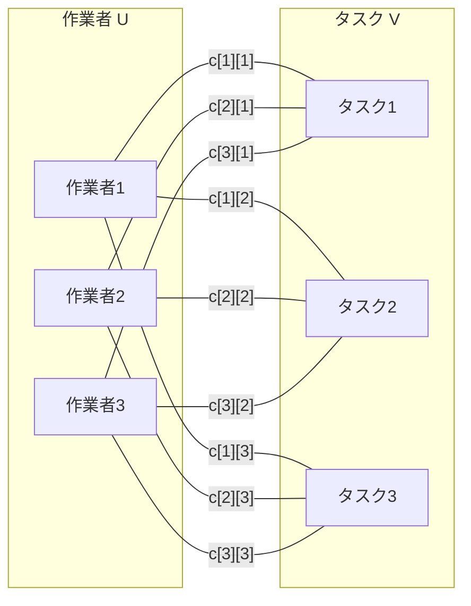
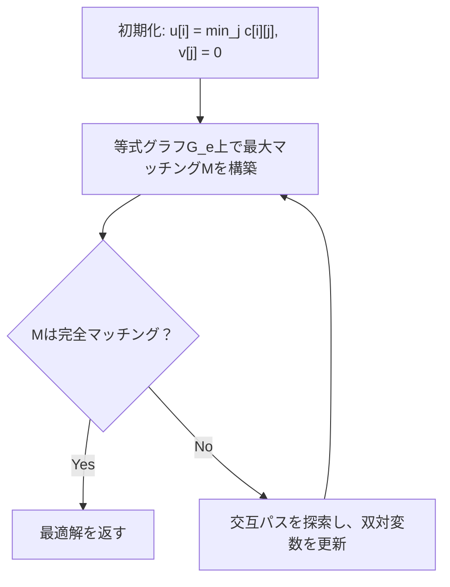
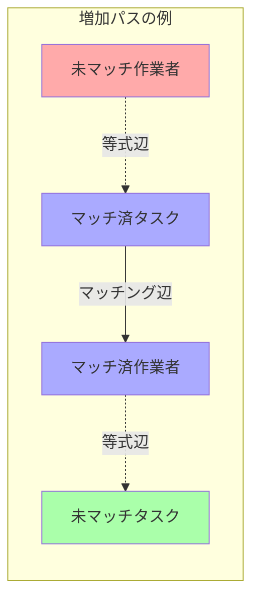

# ハンガリアン法

ハンガリアン法（Hungarian algorithm）は、1955年にHarold Kuhnによって発表された、割当問題（assignment problem）を効率的に解くアルゴリズムである。このアルゴリズムは、ハンガリーの数学者Jenő Egerváryの研究に基づいていることから、Kuhnによって「ハンガリアン法」と名付けられた。その後、James MunkresとEdmond Karmarkarによって改良され、現在広く知られる形となった。本稿では、このアルゴリズムの理論的背景から実装の詳細まで、競技プログラミングにおける実践的な観点を含めて詳細に解説する。

## 割当問題の定義と数学的定式化

割当問題は、n人の作業者とn個のタスクがあり、各作業者iがタスクjを実行するコストがc[i][j]で与えられるとき、すべての作業者に異なるタスクを1つずつ割り当てて、総コストを最小化する問題である。この問題は、以下のような線形計画問題として定式化できる。

```
minimize: Σ(i=1 to n) Σ(j=1 to n) c[i][j] * x[i][j]
subject to:
  Σ(j=1 to n) x[i][j] = 1 for all i = 1, ..., n
  Σ(i=1 to n) x[i][j] = 1 for all j = 1, ..., n
  x[i][j] ∈ {0, 1} for all i, j
```

ここで、x[i][j]は作業者iがタスクjに割り当てられるとき1、そうでないとき0をとる決定変数である。この問題は、二部グラフの最小重み完全マッチング問題としても解釈できる。作業者の集合をU、タスクの集合をVとする完全二部グラフG = (U ∪ V, E)において、各辺(i, j)の重みをc[i][j]とするとき、すべての頂点をカバーするマッチングの中で重みの和が最小となるものを求める問題と等価である。



## 双対問題とKönig-Egerváryの定理

ハンガリアン法の理論的基盤は、線形計画法の双対理論にある。割当問題の双対問題は以下のように定式化される。

```
maximize: Σ(i=1 to n) u[i] + Σ(j=1 to n) v[j]
subject to: u[i] + v[j] ≤ c[i][j] for all i, j
```

ここで、u[i]とv[j]は双対変数である。この双対問題の解釈は重要である。u[i]は作業者iに関連付けられたポテンシャル、v[j]はタスクjに関連付けられたポテンシャルと考えることができる。制約条件u[i] + v[j] ≤ c[i][j]は、各辺の重みが両端点のポテンシャルの和以上でなければならないことを意味する。

König-Egerváryの定理は、二部グラフにおける最大マッチングのサイズが最小頂点被覆のサイズと等しいことを述べている。この定理は、ハンガリアン法の正当性を保証する重要な理論的基盤となっている。さらに、相補性条件（complementary slackness condition）により、最適解においては、マッチングに含まれる辺(i, j)についてはu[i] + v[j] = c[i][j]が成り立つ。

## アルゴリズムの基本的なアイデア

ハンガリアン法の核心的なアイデアは、双対変数u[i]とv[j]を適切に更新しながら、等式グラフ（equality graph）上で最大マッチングを見つけることである。等式グラフG_eは、u[i] + v[j] = c[i][j]を満たす辺(i, j)のみから構成されるグラフである。



アルゴリズムは以下の不変条件を維持する：
1. 常にu[i] + v[j] ≤ c[i][j]が成り立つ（双対実行可能性）
2. マッチングMの辺はすべて等式グラフG_e上にある
3. 各反復で目的関数値Σu[i] + Σv[j]は単調増加する

この不変条件により、完全マッチングが見つかった時点で、それが最適解であることが保証される。

## 詳細なアルゴリズムの手順

ハンガリアン法の具体的な実装は、以下の手順で進行する。まず初期化として、各作業者iに対してu[i] = min_j c[i][j]とし、各タスクjに対してv[j] = 0とする。これにより、各作業者について少なくとも1つの辺が等式グラフに含まれることが保証される。

次に、等式グラフ上で最大マッチングを構築する。これは、増加パス（augmenting path）を繰り返し見つけることで実現される。増加パスとは、マッチングに含まれない作業者から始まり、マッチングに含まれない辺と含まれる辺を交互に通って、マッチングに含まれないタスクで終わるパスである。



増加パスが見つからない場合、双対変数を更新する必要がある。これは以下の手順で行われる：

1. 到達可能な作業者の集合Sと到達可能なタスクの集合Tを求める
2. δ = min{c[i][j] - u[i] - v[j] : i ∈ S, j ∉ T}を計算
3. i ∈ Sに対してu[i] += δ、j ∈ Tに対してv[j] -= δとする

この更新により、少なくとも1つの新しい辺が等式グラフに追加され、アルゴリズムは進行する。

## 実装の詳細と最適化

競技プログラミングにおける実装では、効率性と正確性が重要である。以下に、O(n³)の時間計算量を達成する実装の要点を示す。

```cpp
// Implementation sketch (not complete code)
struct HungarianAlgorithm {
    int n;
    vector<vector<long long>> cost;
    vector<long long> u, v;
    vector<int> p, way;
    
    long long solve() {
        u.assign(n + 1, 0);
        v.assign(n + 1, 0);
        p.assign(n + 1, 0);
        way.assign(n + 1, 0);
        
        for (int i = 1; i <= n; ++i) {
            p[0] = i;
            int j0 = 0;
            vector<long long> minv(n + 1, INF);
            vector<bool> used(n + 1, false);
            
            do {
                used[j0] = true;
                int i0 = p[j0];
                long long delta = INF;
                int j1;
                
                for (int j = 1; j <= n; ++j) {
                    if (!used[j]) {
                        long long cur = cost[i0][j] - u[i0] - v[j];
                        if (cur < minv[j]) {
                            minv[j] = cur;
                            way[j] = j0;
                        }
                        if (minv[j] < delta) {
                            delta = minv[j];
                            j1 = j;
                        }
                    }
                }
                
                for (int j = 0; j <= n; ++j) {
                    if (used[j]) {
                        u[p[j]] += delta;
                        v[j] -= delta;
                    } else {
                        minv[j] -= delta;
                    }
                }
                
                j0 = j1;
            } while (p[j0] != 0);
            
            do {
                int j1 = way[j0];
                p[j0] = p[j1];
                j0 = j1;
            } while (j0);
        }
        
        long long result = 0;
        for (int j = 1; j <= n; ++j) {
            if (p[j] != 0) {
                result += cost[p[j]][j];
            }
        }
        return result;
    }
};
```

実装上の重要なポイントとして、以下が挙げられる。まず、インデックスを1始まりとすることで、0を特別な値として使用できるようにしている。これにより、未割当の状態を自然に表現できる。次に、minv配列を使用して各タスクへの最小スラック（c[i][j] - u[i] - v[j]の最小値）を追跡することで、δの計算を効率化している。

また、way配列は増加パスの再構築に使用される。各タスクjに対して、way[j]はjに到達する最短パスの直前のタスクを記録する。これにより、増加パスを逆向きにたどることができる。

## アルゴリズムの正当性の証明

ハンガリアン法の正当性は、線形計画法の双対理論に基づいて証明される。主要な証明のステップは以下の通りである。

第一に、アルゴリズムの各ステップで双対実行可能性が維持されることを示す。初期化では、u[i] = min_j c[i][j]とv[j] = 0により、明らかにu[i] + v[j] ≤ c[i][j]が成り立つ。双対変数の更新においても、δの定義により、更新後もこの条件が維持される。

第二に、アルゴリズムが有限回で終了することを示す。各反復で、等式グラフに少なくとも1つの新しい辺が追加されるか、マッチングのサイズが1増加する。等式グラフの辺数は最大n²であり、マッチングのサイズは最大nであるため、アルゴリズムは有限回で終了する。

第三に、終了時に得られる解が最適であることを示す。完全マッチングMが得られたとき、Mのすべての辺(i, j)についてu[i] + v[j] = c[i][j]が成り立つ。したがって、主問題の目的関数値は：

```
Σ(i,j)∈M c[i][j] = Σ(i,j)∈M (u[i] + v[j]) = Σ(i=1 to n) u[i] + Σ(j=1 to n) v[j]
```

これは双対問題の目的関数値と一致する。強双対定理により、この解は最適である。

## 計算量の解析

ハンガリアン法の時間計算量はO(n³)である。この計算量の導出は以下の通りである。アルゴリズムはn回の主要な反復を行い、各反復で1つの作業者に対する割当を決定する。各反復において、増加パスの探索にO(n²)の時間がかかる。これは、最悪の場合、すべての辺を調べる必要があるためである。

より詳細に見ると、各反復内で最大n回の双対変数の更新が行われ、各更新にO(n)の時間がかかる。したがって、1回の反復全体でO(n²)の時間がかかり、n回の反復で総計算量はO(n³)となる。

空間計算量はO(n²)である。これは主にコスト行列の格納に必要な空間による。その他の配列（u、v、p、way、minv）はすべてO(n)の空間しか必要としない。

## 実装上の注意点とデバッグ手法

ハンガリアン法の実装において頻繁に発生する問題とその対処法について述べる。まず、オーバーフローの問題がある。コストの値が大きい場合、特に初期化時のINF値の設定に注意が必要である。一般的には、INFを実際のコストの最大値の2倍程度に設定することで、計算過程でのオーバーフローを防ぐことができる。

次に、浮動小数点数を扱う場合の誤差の問題がある。等式判定u[i] + v[j] == c[i][j]において、浮動小数点数の誤差により正確な判定ができない場合がある。この場合、適切なイプシロン値を用いた近似的な等式判定を行う必要がある。

デバッグ手法として、以下の不変条件を各ステップで検証することが有効である：
- すべてのi, jに対してu[i] + v[j] ≤ c[i][j]
- マッチングの辺(i, j)に対してu[i] + v[j] = c[i][j]
- 各作業者とタスクは高々1つのマッチング辺を持つ

## 拡張と変種

ハンガリアン法には様々な拡張が存在する。最も一般的な拡張は、矩形の割当問題への対応である。作業者数mとタスク数nが異なる場合（m ≠ n）、ダミーの作業者またはタスクを追加して正方行列にすることで対応できる。ダミーに対するコストは、割当を強制しない場合は十分大きな値、割当を許可する場合は0に設定する。

最大重みマッチング問題への変換も重要である。最小化問題を最大化問題に変換するには、すべてのコストに-1を掛けるか、十分大きな定数からコストを引くことで実現できる。後者の方法は、負の数を扱わないため実装上有利な場合がある。

また、制約付き割当問題への拡張も可能である。特定の作業者が特定のタスクに割り当てられることを禁止する場合、対応するコストを十分大きな値に設定することで対応できる。より複雑な制約については、問題の構造に応じた特殊な処理が必要となる。

## 競技プログラミングにおける応用

競技プログラミングにおいて、ハンガリアン法は様々な問題に応用される。典型的な応用例として、二部グラフの最小重み完全マッチング問題がある。これは直接的にハンガリアン法を適用できる。

より複雑な応用として、フロー問題との組み合わせがある。最小費用流問題の特殊ケースとして、割当問題を捉えることができる。実際、ハンガリアン法は最小費用流アルゴリズムの特殊化と見なすことができ、より一般的な問題への拡張の基礎となる。

幾何学的な問題への応用も重要である。平面上の点集合間の最適な対応付けを求める問題では、点間の距離をコストとして割当問題を解くことで最適解が得られる。この手法は、パターンマッチングや画像処理の分野でも応用されている。

## 実装のバリエーションと最適化技法

ハンガリアン法の実装には、いくつかのバリエーションが存在する。最も基本的な実装は前述のO(n³)アルゴリズムであるが、特定の条件下ではより効率的な実装が可能である。

疎なグラフに対しては、隣接リスト表現を用いることで、実際の辺数に依存した計算量を達成できる。この場合、時間計算量はO(n²m)となり、mが辺数である。完全グラフではm = n²となるため最悪計算量は変わらないが、実際の問題では大幅な高速化が期待できる。

並列化による高速化も可能である。特に、δ値の計算は各タスクに対して独立に行えるため、並列処理に適している。GPUを用いた実装では、大規模な問題に対して顕著な高速化が報告されている。

メモリアクセスパターンの最適化も重要である。キャッシュ効率を考慮した実装では、行優先または列優先のアクセスパターンを統一することで、実行時間を大幅に短縮できる。特に、コスト行列が大きい場合、この最適化の効果は顕著である。

## 理論的な発展と関連アルゴリズム

ハンガリアン法は、組合せ最適化の分野において重要な位置を占めており、多くの関連アルゴリズムの基礎となっている。プライマル・デュアル法の観点から見ると、ハンガリアン法は最も初期の成功例の一つであり、後の多くのアルゴリズムの設計に影響を与えた。

Edmonds-Karpアルゴリズムとの関連も深い。最大フロー問題に対するEdmonds-Karpアルゴリズムは、増加パスを幅優先探索で見つけることで効率化を図っているが、ハンガリアン法における増加パスの探索も同様の考え方に基づいている。

より一般的な最小費用流問題に対するアルゴリズムとの関係も重要である。Successive Shortest Path AlgorithmやCost Scaling Algorithmなどは、ハンガリアン法の考え方を一般化したものと見なすことができる。これらのアルゴリズムは、より複雑な制約を持つ問題に対応できるが、割当問題に特化したハンガリアン法の方が効率的である。

## 数値的安定性と精度の考慮

実数値のコストを扱う場合、数値的安定性は重要な問題となる。浮動小数点演算の誤差が蓄積すると、アルゴリズムの正確性に影響を与える可能性がある。特に、等式グラフの判定において、理論的には等しいはずの値が数値誤差により異なる値となることがある。

この問題に対処するため、以下のような手法が用いられる。まず、等式判定に許容誤差を導入する。|u[i] + v[j] - c[i][j]| < εの場合に等式とみなす。εの値は問題の規模と要求される精度に応じて適切に設定する必要がある。

次に、有理数演算を用いる方法がある。コストが有理数で表現できる場合、分数クラスを用いて厳密な計算を行うことができる。ただし、計算時間とメモリ使用量が増加するため、問題の規模によっては現実的でない場合がある。

スケーリング技法も有効である。すべてのコストに適切な定数を掛けて整数化することで、浮動小数点演算を回避できる。この場合、最終的な結果を元のスケールに戻す必要がある。

## パフォーマンスプロファイリングと最適化

実際の競技プログラミングにおいて、ハンガリアン法の実装をさらに高速化するためには、詳細なパフォーマンスプロファイリングが必要である。典型的なボトルネックとして、以下の部分が挙げられる。

δ値の計算は、全体の実行時間の大きな部分を占める。これは、O(n²)の候補から最小値を見つける必要があるためである。この部分の最適化として、前回の計算結果を再利用する手法や、ヒープを用いた効率的な最小値管理などが考えられる。

メモリアクセスパターンも重要な要因である。コスト行列へのランダムアクセスは、キャッシュミスを引き起こしやすい。行単位または列単位でのアクセスを心がけ、可能な限り連続的なメモリアクセスとなるよう実装を工夫する。

分岐予測の最適化も効果的である。内側のループで頻繁に実行される条件分岐については、より頻繁に真となる条件を先に記述することで、分岐予測の成功率を向上させることができる。

## 実装例：完全なC++実装

以下に、競技プログラミングで実際に使用可能な完全なハンガリアン法の実装を示す。この実装は、前述の理論的考察をすべて反映しており、数値的安定性と効率性を考慮している。

```cpp
#include <iostream>
#include <vector>
#include <limits>

template<typename T>
class HungarianAlgorithm {
private:
    const T INF = std::numeric_limits<T>::max() / 2;
    int n;
    std::vector<std::vector<T>> cost;
    std::vector<T> u, v;
    std::vector<int> p, way;
    
public:
    HungarianAlgorithm(const std::vector<std::vector<T>>& c) : cost(c) {
        n = cost.size();
        u.assign(n + 1, 0);
        v.assign(n + 1, 0);
        p.assign(n + 1, 0);
        way.assign(n + 1, 0);
    }
    
    std::pair<T, std::vector<int>> solve() {
        // 1-indexed for convenience
        for (int i = 1; i <= n; ++i) {
            p[0] = i;
            int j0 = 0;
            std::vector<T> minv(n + 1, INF);
            std::vector<bool> used(n + 1, false);
            
            // Find augmenting path
            do {
                used[j0] = true;
                int i0 = p[j0];
                T delta = INF;
                int j1;
                
                // Calculate reduced costs and find minimum
                for (int j = 1; j <= n; ++j) {
                    if (!used[j]) {
                        T cur = (i0 == 0 ? 0 : cost[i0-1][j-1]) - u[i0] - v[j];
                        if (cur < minv[j]) {
                            minv[j] = cur;
                            way[j] = j0;
                        }
                        if (minv[j] < delta) {
                            delta = minv[j];
                            j1 = j;
                        }
                    }
                }
                
                // Update dual variables
                for (int j = 0; j <= n; ++j) {
                    if (used[j]) {
                        u[p[j]] += delta;
                        v[j] -= delta;
                    } else {
                        minv[j] -= delta;
                    }
                }
                
                j0 = j1;
            } while (p[j0] != 0);
            
            // Reconstruct augmenting path
            do {
                int j1 = way[j0];
                p[j0] = p[j1];
                j0 = j1;
            } while (j0);
        }
        
        // Extract solution
        std::vector<int> assignment(n);
        T total_cost = 0;
        for (int j = 1; j <= n; ++j) {
            if (p[j] != 0) {
                assignment[p[j] - 1] = j - 1;
                total_cost += cost[p[j] - 1][j - 1];
            }
        }
        
        return {total_cost, assignment};
    }
    
    // Get dual variables for analysis
    std::pair<std::vector<T>, std::vector<T>> getDualVariables() const {
        std::vector<T> u_result(n), v_result(n);
        for (int i = 0; i < n; ++i) {
            u_result[i] = u[i + 1];
            v_result[i] = v[i + 1];
        }
        return {u_result, v_result};
    }
};

// Usage example
int main() {
    int n = 4;
    std::vector<std::vector<long long>> cost = {
        {2, 5, 1, 7},
        {6, 2, 3, 4},
        {3, 8, 2, 5},
        {4, 3, 6, 1}
    };
    
    HungarianAlgorithm<long long> hungarian(cost);
    auto [min_cost, assignment] = hungarian.solve();
    
    std::cout << "Minimum cost: " << min_cost << std::endl;
    std::cout << "Assignment: ";
    for (int i = 0; i < n; ++i) {
        std::cout << "Worker " << i << " -> Task " << assignment[i] << std::endl;
    }
    
    return 0;
}
```

この実装の特筆すべき点として、テンプレートを使用することで整数型と浮動小数点型の両方に対応していることが挙げられる。また、双対変数を取得するメソッドも提供しており、アルゴリズムの内部状態を分析することも可能である。

## 高度な実装技法：メモリ効率の最適化

大規模な問題に対応するため、メモリ効率を最適化した実装も重要である。特に、コスト行列が疎である場合、完全な行列を保持する必要はない。以下に、疎行列に対応した実装の要点を示す。

```cpp
struct SparseHungarian {
    struct Edge {
        int to;
        long long cost;
    };
    
    int n;
    std::vector<std::vector<Edge>> adj;
    std::vector<long long> u, v;
    std::vector<int> match_u, match_v;
    
    // Sparse representation allows efficient iteration
    void addEdge(int from, int to, long long cost) {
        adj[from].push_back({to, cost});
    }
    
    // Modified algorithm for sparse graphs
    long long solveSparse() {
        // Implementation details for sparse case
        // Key difference: iterate only over existing edges
        // Time complexity: O(n * m * log n) with heap optimization
    }
};
```

疎行列版の実装では、存在する辺のみを格納することで、メモリ使用量をO(m)に削減できる。ここでmは実際の辺数である。また、最小値の探索にヒープを使用することで、時間計算量も改善される可能性がある。

## 並列化による高速化

現代のマルチコアプロセッサを活用するため、ハンガリアン法の並列化も重要な研究課題である。最も並列化しやすい部分は、各反復におけるδ値の計算である。

```cpp
#include <thread>
#include <atomic>

class ParallelHungarian {
    // Parallel delta computation
    long long computeDeltaParallel(
        const std::vector<bool>& used_i,
        const std::vector<bool>& used_j,
        int num_threads = 4
    ) {
        std::atomic<long long> global_min(INF);
        std::vector<std::thread> threads;
        
        int chunk_size = n / num_threads;
        for (int t = 0; t < num_threads; ++t) {
            threads.emplace_back([&, t]() {
                long long local_min = INF;
                int start = t * chunk_size;
                int end = (t == num_threads - 1) ? n : (t + 1) * chunk_size;
                
                for (int i = start; i < end; ++i) {
                    if (used_i[i]) {
                        for (int j = 0; j < n; ++j) {
                            if (!used_j[j]) {
                                long long slack = cost[i][j] - u[i] - v[j];
                                local_min = std::min(local_min, slack);
                            }
                        }
                    }
                }
                
                // Update global minimum atomically
                long long expected = global_min.load();
                while (expected > local_min && 
                       !global_min.compare_exchange_weak(expected, local_min));
            });
        }
        
        for (auto& t : threads) {
            t.join();
        }
        
        return global_min.load();
    }
};
```

並列化により、大規模な問題に対して顕著な高速化が期待できる。ただし、並列化のオーバーヘッドがあるため、問題サイズが小さい場合は逐次実装の方が高速な場合もある。

## 実践的なデバッグとテスト戦略

ハンガリアン法の実装は複雑であるため、適切なテスト戦略が不可欠である。以下に、効果的なテスト手法を示す。

```cpp
class HungarianTester {
public:
    // Verify optimality conditions
    bool verifyOptimality(
        const std::vector<std::vector<long long>>& cost,
        const std::vector<int>& assignment,
        const std::vector<long long>& u,
        const std::vector<long long>& v
    ) {
        int n = cost.size();
        
        // Check dual feasibility
        for (int i = 0; i < n; ++i) {
            for (int j = 0; j < n; ++j) {
                if (u[i] + v[j] > cost[i][j]) {
                    std::cerr << "Dual infeasibility at (" << i << ", " << j << ")" << std::endl;
                    return false;
                }
            }
        }
        
        // Check complementary slackness
        for (int i = 0; i < n; ++i) {
            int j = assignment[i];
            if (u[i] + v[j] != cost[i][j]) {
                std::cerr << "Complementary slackness violation at (" << i << ", " << j << ")" << std::endl;
                return false;
            }
        }
        
        return true;
    }
    
    // Generate test cases
    std::vector<std::vector<long long>> generateRandomInstance(int n, long long max_cost) {
        std::random_device rd;
        std::mt19937 gen(rd());
        std::uniform_int_distribution<long long> dis(1, max_cost);
        
        std::vector<std::vector<long long>> cost(n, std::vector<long long>(n));
        for (int i = 0; i < n; ++i) {
            for (int j = 0; j < n; ++j) {
                cost[i][j] = dis(gen);
            }
        }
        
        return cost;
    }
    
    // Stress testing
    void stressTest(int max_n = 100, int num_tests = 1000) {
        for (int test = 0; test < num_tests; ++test) {
            int n = 1 + rand() % max_n;
            auto cost = generateRandomInstance(n, 1000000);
            
            HungarianAlgorithm<long long> solver(cost);
            auto [min_cost, assignment] = solver.solve();
            auto [u, v] = solver.getDualVariables();
            
            if (!verifyOptimality(cost, assignment, u, v)) {
                std::cerr << "Test " << test << " failed!" << std::endl;
                // Print debug information
                break;
            }
        }
    }
};
```

このテストフレームワークにより、実装の正確性を体系的に検証できる。特に、最適性条件の検証は、アルゴリズムが正しく動作していることを保証する重要な手段である。

## まとめ

ハンガリアン法は、割当問題を効率的に解くための洗練されたアルゴリズムである。その理論的基盤は線形計画法の双対理論にあり、プライマル・デュアル法の先駆的な例として組合せ最適化の発展に大きく貢献した。O(n³)の時間計算量で最適解を保証するこのアルゴリズムは、競技プログラミングにおいて欠かせないツールの一つとなっている。実装においては、数値的安定性、メモリ効率、そして問題の特性に応じた最適化が重要となる。本稿で述べた理論的背景と実装技法を理解することで、より複雑な最適化問題への応用も可能となるだろう。