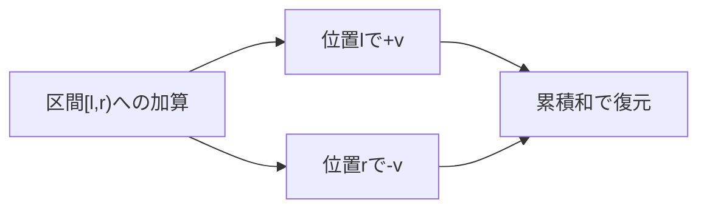
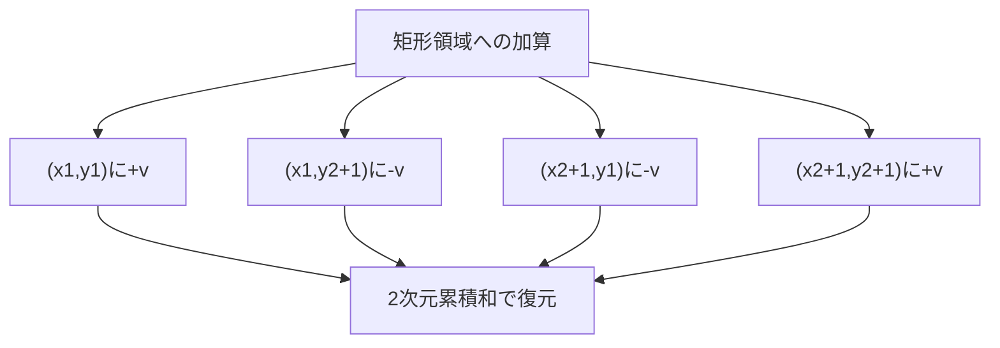

# いもす法

いもす法は、区間に対する加算クエリを高速に処理するアルゴリズムの一つである。累積和の概念を応用し、区間への加算操作を端点での差分記録に変換することで、計算量を削減する手法である。名前の由来は、この手法を考案したプログラマのハンドルネーム「imos」に由来する[^1]。競技プログラミングの文脈で広く使われるようになり、現在では区間操作の最適化における標準的な手法の一つとして認識されている。

## 基本概念

いもす法の核心は、区間 [l, r) への加算操作を、位置 l での加算と位置 r での減算という2つの点操作に分解することにある。この変換により、複数の区間加算クエリを効率的に処理できるようになる。



例えば、配列の区間 [2, 5) に値 3 を加算する操作を考える。従来の方法では、インデックス 2, 3, 4 の各要素に対して個別に 3 を加算する必要があるが、いもす法では位置 2 に +3、位置 5 に -3 を記録するだけで済む。すべての区間加算クエリを処理した後、累積和を計算することで最終的な配列の状態を得ることができる。

## アルゴリズムの詳細

いもす法のアルゴリズムは以下の3つのフェーズから構成される。

**初期化フェーズ**: 差分配列を0で初期化する。この配列は、各位置での値の変化量を記録するために使用される。

**クエリ処理フェーズ**: 各区間加算クエリ (l, r, v) に対して、差分配列の位置 l に v を加算し、位置 r に -v を加算する。この操作により、区間 [l, r) に対する加算の効果が差分配列に記録される。

**累積和計算フェーズ**: 差分配列の累積和を計算することで、最終的な配列の値を得る。位置 i の最終的な値は、差分配列の 0 から i までの総和となる。

```python
def imos_1d(n, queries):
    # Initialize difference array
    diff = [0] * (n + 1)
    
    # Process queries
    for l, r, v in queries:
        diff[l] += v
        diff[r] -= v
    
    # Calculate cumulative sum
    result = [0] * n
    current = 0
    for i in range(n):
        current += diff[i]
        result[i] = current
    
    return result
```

## 計算量の分析

いもす法の効率性は、その計算量の削減にある。N 要素の配列に対して Q 個の区間加算クエリを処理する場合を考える。

**従来の方法**: 各クエリで最大 O(N) の要素を更新する必要があるため、全体の計算量は O(Q × N) となる。

**いもす法**: 各クエリは O(1) で処理でき、最後の累積和計算が O(N) であるため、全体の計算量は O(Q + N) となる。

この違いは、Q と N が大きくなるほど顕著になる。例えば、N = 10^6、Q = 10^5 の場合、従来の方法では最悪 10^11 回の操作が必要となるが、いもす法では約 10^6 回の操作で済む。

## 2次元への拡張

いもす法は2次元配列にも拡張できる。2次元の場合、矩形領域への加算操作を4つの点操作に分解する。矩形の左上座標を (x1, y1)、右下座標を (x2, y2) とすると、以下の4点に値を記録する：

- (x1, y1) に +v
- (x1, y2+1) に -v
- (x2+1, y1) に -v
- (x2+1, y2+1) に +v



2次元累積和の計算は、まず行方向に累積和を取り、次に列方向に累積和を取ることで実現できる。

```python
def imos_2d(h, w, queries):
    # Initialize 2D difference array
    diff = [[0] * (w + 1) for _ in range(h + 1)]
    
    # Process queries
    for x1, y1, x2, y2, v in queries:
        diff[x1][y1] += v
        diff[x1][y2 + 1] -= v
        diff[x2 + 1][y1] -= v
        diff[x2 + 1][y2 + 1] += v
    
    # Calculate 2D cumulative sum
    # First, accumulate horizontally
    for i in range(h):
        for j in range(1, w):
            diff[i][j] += diff[i][j - 1]
    
    # Then, accumulate vertically
    for j in range(w):
        for i in range(1, h):
            diff[i][j] += diff[i - 1][j]
    
    # Extract result (excluding padding)
    result = [[diff[i][j] for j in range(w)] for i in range(h)]
    return result
```

## 実装上の注意点

いもす法の実装において、以下の点に注意が必要である。

**配列サイズ**: 差分配列は元の配列より1要素大きくする必要がある。これは、区間の右端での減算操作を記録するためである。範囲外アクセスを防ぐため、適切なパディングが必要となる。

**区間の扱い**: 半開区間 [l, r) と閉区間 [l, r] の違いに注意が必要である。競技プログラミングでは半開区間が一般的だが、問題によっては閉区間で与えられることもある。閉区間の場合は、右端の処理を r+1 にする必要がある。

**オーバーフロー**: 多数のクエリや大きな値を扱う場合、累積和の計算でオーバーフローが発生する可能性がある。必要に応じて64ビット整数型を使用する。

**負の値への対応**: いもす法は負の値の加算にも対応している。減算クエリは負の値の加算として処理できる。

## 典型的な応用パターン

いもす法は、以下のような問題パターンで有効である。

**区間加算クエリの処理**: 最も基本的な応用である。配列の特定区間に値を加算するクエリを複数処理し、最終的な配列の状態を求める問題。

**イベントの重なり判定**: 時間軸上でのイベントの重なりを効率的に計算できる。各イベントを区間として表現し、各時刻でのイベント数を求める。

**差分制約系の処理**: グラフ理論における差分制約系の問題で、区間に対する制約を効率的に処理できる。

**座標圧縮との組み合わせ**: 巨大な座標空間での区間操作を、座標圧縮といもす法を組み合わせることで効率的に処理できる。

## 関連手法との比較

いもす法と類似の目的を持つデータ構造や手法として、以下のものがある。

**セグメント木 (Segment Tree)**: 区間に対する更新と参照を O(log N) で処理できるデータ構造。単一要素への参照が頻繁な場合や、オンラインでのクエリ処理が必要な場合に有効。ただし、実装が複雑で、メモリ使用量も大きい。

**Binary Indexed Tree (BIT/Fenwick Tree)**: 累積和の更新と参照を O(log N) で処理できるデータ構造。いもす法と同様に区間加算を扱えるが、オンライン処理が可能な点が異なる。

**平方分割 (Square Root Decomposition)**: 配列を √N 個のブロックに分割し、各ブロックごとに情報を管理する手法。区間更新と単一要素参照の両方を O(√N) で処理できる。

いもす法の利点は、実装の簡潔さと、すべてのクエリを受け取った後でまとめて処理する場合の効率性にある。一方、オンラインでのクエリ処理や、更新と参照が混在する場合には、他の手法が適している場合がある。

## 実装例：典型問題

以下に、いもす法を用いた典型的な問題の実装例を示す。

**問題**: N 個の座席がある映画館で、M 個の予約がある。各予約は座席番号 l から r までを使用する。最も混雑する座席の予約数を求めよ。

```python
def max_reservations(n, reservations):
    # Apply imos method
    diff = [0] * (n + 1)
    
    for l, r in reservations:
        diff[l] += 1
        diff[r + 1] -= 1  # Closed interval [l, r]
    
    # Calculate cumulative sum and find maximum
    max_count = 0
    current = 0
    
    for i in range(n):
        current += diff[i]
        max_count = max(max_count, current)
    
    return max_count
```

この実装では、各予約を区間加算クエリとして処理し、累積和を計算しながら最大値を求めている。

## パフォーマンス特性

いもす法のパフォーマンス特性を詳しく見ると、以下のような特徴がある。

**メモリアクセスパターン**: いもす法は配列に対する線形なアクセスパターンを持つため、CPUキャッシュの効率が良い。特に累積和計算フェーズでは、連続したメモリアクセスによりキャッシュヒット率が高い。

**並列化**: クエリ処理フェーズは各クエリが独立しているため、並列化が容易である。ただし、同じ位置への更新が競合する可能性があるため、適切な同期機構が必要となる。

**メモリ使用量**: 1次元の場合 O(N)、2次元の場合 O(N×M) の追加メモリが必要となる。元の配列を保持する必要がない場合は、差分配列を直接結果配列として使用することでメモリを節約できる。

## 実装の最適化

実際のシステムでいもす法を使用する際の最適化手法について述べる。

**スパース実装**: 区間操作が疎な場合、差分を記録する位置のみを保持するスパース実装が有効である。std::map や辞書型を使用することで、メモリ使用量を削減できる。

```python
from collections import defaultdict

def sparse_imos(queries):
    diff = defaultdict(int)
    
    for l, r, v in queries:
        diff[l] += v
        diff[r] -= v
    
    # Process only positions with changes
    positions = sorted(diff.keys())
    result = []
    current = 0
    
    for pos in positions:
        current += diff[pos]
        result.append((pos, current))
    
    return result
```

**遅延評価**: 大規模なシステムでは、累積和の計算を必要になるまで遅延させることで、不要な計算を避けることができる。

**圧縮技法**: 連続した同じ値の区間を圧縮して保持することで、メモリ使用量をさらに削減できる。ランレングス符号化と組み合わせることで、効率的な表現が可能となる。

## 誤りやすいポイント

いもす法の実装において、以下のような誤りが発生しやすい。

**境界条件の誤り**: 特に閉区間と半開区間の混同による、右端の処理の誤りが多い。問題文を注意深く読み、区間の定義を正確に理解することが重要である。

**初期値の考慮漏れ**: 元の配列に初期値がある場合、その値を考慮し忘れることがある。差分配列に初期値を反映させるか、最終結果に加算する必要がある。

**範囲外アクセス**: 差分配列のサイズが不適切な場合、範囲外アクセスが発生する。特に2次元の場合、両方向にパディングが必要であることに注意が必要である。

## 高度な応用

いもす法の概念は、より複雑な問題にも応用できる。

**円環上のいもす法**: 円環状の配列に対する区間操作を扱う場合、端をまたぐ区間の処理に工夫が必要となる。モジュロ演算を適切に使用することで実現できる。

**木構造上のいもす法**: 木構造において、あるノードから別のノードへのパス上の全ノードに値を加算する操作を効率化できる。LCA（最小共通祖先）と組み合わせることで実現する。

**多次元への一般化**: 3次元以上の空間でも同様の考え方が適用できる。k次元の場合、2^k 個の点に値を記録することになる。

## 理論的背景

いもす法の理論的基盤は、差分と積分の関係に基づいている。連続関数における微分と積分の関係を、離散的な配列に適用したものと見なすことができる。

区間 [a, b] への定数関数の加算は、ディラックのデルタ関数を用いて以下のように表現できる：

$$f(x) = v \cdot [\delta(x - a) - \delta(x - b)]$$

この積分が、区間 [a, b] で値 v を持つ階段関数となる。いもす法は、この概念を離散化したものである。

## 実装言語による違い

いもす法の実装は言語によって若干の違いがある。

**C++**: 高速な実行が期待できる。vector を使用することで動的なサイズに対応できる。

```cpp
vector<int> imos(int n, vector<tuple<int, int, int>>& queries) {
    vector<int> diff(n + 1, 0);
    
    for (auto& [l, r, v] : queries) {
        diff[l] += v;
        diff[r] -= v;
    }
    
    for (int i = 1; i <= n; i++) {
        diff[i] += diff[i - 1];
    }
    
    diff.pop_back();  // Remove padding
    return diff;
}
```

**Python**: 実装が簡潔で読みやすい。NumPy を使用することで、さらに高速化できる。

**Java**: 配列の境界チェックが自動的に行われるため、安全性が高い。ただし、プリミティブ型の配列を使用することで性能を向上できる。

## 発展的話題

いもす法の考え方は、他の分野にも応用されている。

**画像処理**: 画像の特定領域に対するフィルタ処理を高速化する際に、いもす法の原理が使用される。積分画像（Integral Image）[^2]は、2次元いもす法の累積和部分と同じ概念である。

**データベース**: 時系列データベースにおいて、特定期間のデータ集計を効率化する手法として、いもす法に類似したアプローチが使用されることがある。

**機械学習**: 特徴量エンジニアリングにおいて、時間窓に基づく特徴量の計算を効率化する際に応用される。

これらの応用は、いもす法の基本的な考え方である「区間操作を端点操作に変換する」という原理を、それぞれの文脈に適用したものである。

## 競技プログラミングにおける実践的テクニック

競技プログラミングの文脈でいもす法を使いこなすためには、いくつかの実践的なテクニックを身に付けることが重要である。

**問題の読み替え**: 一見いもす法と関係ない問題でも、「区間への操作」として読み替えることで適用できる場合がある。例えば、「ある時刻に開始し、別の時刻に終了するイベント」は「時間軸上の区間への加算」として扱える。

**逆向きの発想**: 「各要素がいくつの区間に含まれるか」を求める問題は、各区間を加算クエリとして処理することで解ける。この逆向きの発想により、問題を簡潔に解決できることが多い。

**前処理との組み合わせ**: 座標圧縮やソートなどの前処理と組み合わせることで、より広範な問題に適用できる。特に、値域が大きい場合の座標圧縮は必須のテクニックである。

## デバッグとテストの指針

いもす法の実装をデバッグする際の効果的な方法について述べる。

**小さなケースでの手計算**: 配列サイズ5程度の小さなケースで、手計算による検証を行う。差分配列の各ステップと累積和の計算過程を追跡することで、実装の誤りを発見しやすい。

**境界値テスト**: 以下のようなケースを必ずテストする：
- 配列全体への加算 [0, n)
- 単一要素への加算 [i, i+1)
- 配列の最初と最後の要素を含むケース
- 空の区間 [i, i)

**可視化ツールの活用**: 差分配列と最終結果を可視化することで、誤りを直感的に把握できる。特に2次元の場合、ヒートマップ表示が有効である。

```python
import matplotlib.pyplot as plt
import numpy as np

def visualize_imos_2d(result):
    plt.imshow(result, cmap='hot', interpolation='nearest')
    plt.colorbar()
    plt.title('Imos Method Result')
    plt.show()
```

## システム設計への応用

実際のソフトウェアシステムにいもす法の考え方を応用する場合の設計指針について述べる。

**バッチ処理システム**: 大量のデータ更新を効率的に処理する必要があるバッチ処理システムでは、いもす法の原理が有効である。更新をまとめて処理し、最後に一括で適用することで、システムの負荷を軽減できる。

**リアルタイムシステムへの適用**: リアルタイム性が要求されるシステムでも、一定の遅延が許容される場合は、マイクロバッチ処理といもす法を組み合わせることができる。数秒間の更新をバッファリングし、定期的に適用する。

**分散システムでの利用**: 分散環境では、各ノードで独立に差分を計算し、最後に集約することで、いもす法を並列化できる。MapReduceパラダイムとの親和性が高い。

## 数学的な一般化

いもす法の数学的な一般化について考察する。

**関数空間での解釈**: いもす法は、階段関数の空間における線形作用素として解釈できる。区間への加算は、特定の基底関数の線形結合として表現される。

**フーリエ変換との関連**: 周期的な境界条件を持つ問題では、いもす法とフーリエ変換の間に興味深い関連がある。畳み込み演算として区間加算を表現できる場合がある。

**測度論的解釈**: いもす法は、測度の変化を端点でのディラック測度で表現する手法として、測度論の枠組みで理解できる。

## 実装パフォーマンスの詳細分析

現代のコンピュータアーキテクチャにおけるいもす法の性能特性をより詳しく分析する。

**キャッシュ効率**: いもす法の累積和計算は、メモリアクセスが連続的であるため、L1/L2キャッシュの効率が非常に高い。プリフェッチャーも効果的に動作する。

**ベクトル化**: 現代のCPUのSIMD命令を活用することで、累積和計算を高速化できる。特にAVX2やAVX-512を使用した実装では、大幅な性能向上が期待できる。

```cpp
// AVX2を使用した累積和の例（概念的なコード）
void cumsum_avx2(int* data, int n) {
    __m256i sum = _mm256_setzero_si256();
    for (int i = 0; i < n; i += 8) {
        __m256i values = _mm256_loadu_si256((__m256i*)&data[i]);
        sum = _mm256_add_epi32(sum, values);
        _mm256_storeu_si256((__m256i*)&data[i], sum);
    }
}
```

**メモリ帯域幅**: いもす法はメモリバウンドなアルゴリズムであるため、メモリ帯域幅が性能のボトルネックとなることが多い。NUMA環境では、メモリアクセスの局所性に注意が必要である。

## 実装言語別の最適化テクニック

各プログラミング言語における、いもす法の最適化テクニックを詳述する。

**C++での最適化**:
- `std::partial_sum` を使用した標準ライブラリの活用
- テンプレートメタプログラミングによる汎用的な実装
- `constexpr` を使用したコンパイル時計算の活用

**Rustでの実装**:
```rust
fn imos_method(n: usize, queries: &[(usize, usize, i32)]) -> Vec<i32> {
    let mut diff = vec![0; n + 1];
    
    for &(l, r, v) in queries {
        diff[l] += v;
        diff[r] -= v;
    }
    
    diff.into_iter()
        .scan(0, |acc, x| {
            *acc += x;
            Some(*acc)
        })
        .take(n)
        .collect()
}
```

**Goでの並行処理**:
```go
func imosMethodConcurrent(n int, queries []Query) []int {
    diff := make([]int, n+1)
    
    // Process queries concurrently
    var mu sync.Mutex
    var wg sync.WaitGroup
    
    for _, q := range queries {
        wg.Add(1)
        go func(q Query) {
            defer wg.Done()
            mu.Lock()
            diff[q.L] += q.V
            diff[q.R] -= q.V
            mu.Unlock()
        }(q)
    }
    
    wg.Wait()
    
    // Calculate cumulative sum
    for i := 1; i < n; i++ {
        diff[i] += diff[i-1]
    }
    
    return diff[:n]
}
```

## エラー処理と堅牢性

実用的なシステムでいもす法を実装する際の、エラー処理と堅牢性について考察する。

**入力検証**: 区間の妥当性（l <= r）、インデックスの範囲チェック、オーバーフローの検出など、適切な入力検証が必要である。

**例外安全性**: C++では、強い例外安全性を保証する実装が望ましい。メモリ確保の失敗や、計算中の例外に対して適切に対処する。

**数値的安定性**: 浮動小数点数を扱う場合、累積和の計算で誤差が蓄積する可能性がある。Kahan加算アルゴリズムなどの使用を検討する。

## アルゴリズムの変種

いもす法には、特定の用途に最適化されたいくつかの変種が存在する。

**遅延伝播いもす法**: セグメント木の遅延伝播と同様の概念を適用し、必要な部分のみを計算する変種。大規模なデータで一部のみを参照する場合に有効。

**循環いもす法**: 円環状のデータ構造に対するいもす法。時計の文字盤のような循環構造での区間操作に使用される。

**階層的いもす法**: 複数の解像度でいもす法を適用し、クエリに応じて適切な解像度を選択する手法。地図アプリケーションなどで有用。

## 教育的観点からの考察

いもす法を教える際の効果的なアプローチについて述べる。

**視覚的な説明**: アニメーションを使用して、差分の記録と累積和の計算過程を視覚化することで、直感的な理解を促進できる。

**段階的な導入**: 1次元の簡単な例から始め、徐々に複雑な応用へと進むことで、学習者の理解を深められる。

**類推による説明**: 「水の流入と流出」「人の入退室」など、日常的な類推を用いることで、概念を理解しやすくする。

[^1]: いもす法の名前の由来については、競技プログラミング界隈での通称として定着したものであり、正式な学術用語ではない。英語圏では "Difference Array Technique" や "Range Update Array" などと呼ばれることがある。

[^2]: Viola, P., & Jones, M. (2001). "Rapid object detection using a boosted cascade of simple features." Proceedings of the 2001 IEEE Computer Society Conference on Computer Vision and Pattern Recognition.