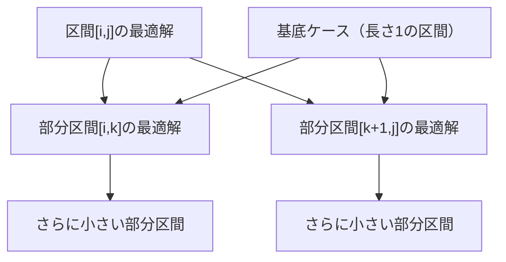
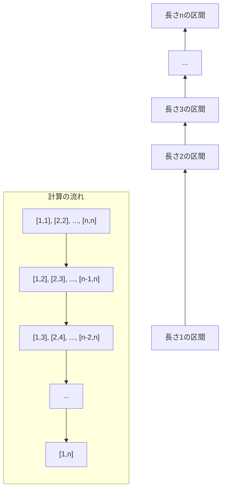

# 区間DP

区間動的計画法（Interval Dynamic Programming）は、連続した要素からなる区間を対象として、その区間内での最適解を求める動的計画法の一種である。区間DPの本質は、大きな区間の最適解を、より小さな部分区間の最適解から構築することにある。この手法は、区間の分割方法に自由度がある問題において特に有効であり、分割統治法と動的計画法の概念を巧妙に組み合わせたアプローチといえる。

区間DPが扱う問題の特徴は、ある区間に対する操作や評価が、その区間をどのように分割するかによって異なる結果をもたらす点にある。例えば、文字列の構文解析、行列の連鎖積、最適二分探索木の構築など、区間の分割位置が結果に大きく影響する問題がその典型例である。これらの問題では、全ての可能な分割方法を効率的に探索し、最適な分割を見つけ出すことが求められる。



## 数学的定式化と最適部分構造

区間DPの数学的基礎は、最適部分構造（Optimal Substructure）の原理に基づいている。ある区間`[i, j]`に対する最適解を`dp[i][j]`とするとき、この値は一般に次のような再帰的関係式で表現される：

```
dp[i][j] = opt_{i ≤ k < j} { dp[i][k] ⊕ dp[k+1][j] ⊕ cost(i, k, j) }
```

ここで、`opt`は問題に応じた最適化演算（最小化または最大化）、`⊕`は部分問題の解を結合する演算、`cost(i, k, j)`は区間`[i, j]`を位置`k`で分割する際のコストを表す。この定式化が示すのは、大きな区間の最適解が、その区間を分割して得られる部分区間の最適解から構成されるという事実である。

この再帰的構造が成立するためには、問題が最適部分構造を持つ必要がある。つまり、全体の最適解に含まれる部分問題の解も、その部分問題に対して最適でなければならない。この性質は、Bellmanの最適性原理[^1]として知られており、動的計画法が適用可能な問題の必要条件となっている。

区間DPにおける状態空間は、通常O(n²)のサイズを持つ。ここで`n`は対象となる要素数である。各状態`dp[i][j]`は区間`[i, j]`に対する最適解を表し、`i ≤ j`という制約から、実際に計算が必要な状態数は`n(n+1)/2`となる。この二次元の状態空間は、区間DPの特徴的な構造であり、メモリ使用量の観点から問題のスケーラビリティを決定する重要な要因となる。

## 計算順序と依存関係

区間DPの実装において最も重要な考慮事項の一つは、計算順序の決定である。ある区間`[i, j]`の最適解を計算するためには、その全ての部分区間`[i, k]`と`[k+1, j]`（ただし`i ≤ k < j`）の解が既に計算されている必要がある。この依存関係から、計算は区間の長さが短いものから順に行われなければならない。



この計算順序は、次のような擬似コードで実現される：

```python
# Initialize base cases (length 1)
for i in range(n):
    dp[i][i] = base_value(i)

# Compute for increasing lengths
for length in range(2, n + 1):
    for i in range(n - length + 1):
        j = i + length - 1
        # Compute dp[i][j] using smaller subproblems
        for k in range(i, j):
            # Update dp[i][j] based on dp[i][k] and dp[k+1][j]
```

この実装パターンは、区間DPの標準的なテンプレートとして広く使用されている。外側のループが区間の長さを制御し、内側のループが同じ長さの全ての区間を処理する。最内側のループは、現在の区間に対する全ての可能な分割を試行する。

## 時間計算量と空間計算量の分析

区間DPの時間計算量は、典型的にはO(n³)となる。この計算量は次のように導出される：

- 状態数：O(n²)個の区間`[i, j]`が存在
- 各状態の計算：O(n)回の分割位置の試行
- 全体：O(n²) × O(n) = O(n³)

しかし、問題によってはこの計算量を改善できる場合がある。例えば、Knuth-Yao speedup[^2]と呼ばれる手法を適用できる問題では、特定の条件下で時間計算量をO(n²)に削減することが可能である。この高速化は、最適な分割位置が持つ単調性を利用したものであり、コスト関数が四辺形不等式（Quadrangle Inequality）を満たす場合に適用できる。

空間計算量については、基本的な実装ではO(n²)のメモリが必要となる。これは、全ての区間`[i, j]`に対する最適解を保存する必要があるためである。ただし、最終的に必要なのが特定の区間（例えば`[1, n]`）の解のみである場合、メモリ使用量を削減する技法も存在する。

メモリアクセスパターンの観点から見ると、区間DPは局所性が比較的良好である。同じ長さの区間を連続して処理するため、キャッシュ効率は悪くない。しかし、大きな問題サイズでは、二次元配列全体がキャッシュに収まらないため、メモリアクセスがボトルネックになる可能性がある。

## 典型的な問題パターンと応用

区間DPが適用される問題には、いくつかの典型的なパターンが存在する。これらのパターンを理解することは、新しい問題に対して区間DPの適用可能性を判断する上で重要である。

### 行列連鎖積問題

行列連鎖積問題は、区間DPの最も古典的な応用例の一つである。`n`個の行列`A₁, A₂, ..., Aₙ`の積を計算する際、結合則により様々な計算順序が可能であるが、行列のサイズによって必要な乗算回数が異なる。この問題では、`dp[i][j]`を行列`Aᵢ`から`Aⱼ`までの積を計算するのに必要な最小乗算回数と定義する。

```
dp[i][j] = min_{i ≤ k < j} { dp[i][k] + dp[k+1][j] + rows[i] × cols[k] × cols[j] }
```

この問題は、Cormenらによる教科書[^3]でも詳しく解説されており、動的計画法の入門例として広く知られている。

### 最適二分探索木

最適二分探索木の構築は、与えられたキーの集合とその検索頻度に対して、期待検索コストを最小化する二分探索木を見つける問題である。Knuthは1971年の論文[^4]でこの問題に対する効率的なアルゴリズムを提案した。

この問題では、`dp[i][j]`をキー`kᵢ`から`kⱼ`を含む最適二分探索木の期待コストと定義する。根となるキーの選択が区間の分割に対応し、左部分木と右部分木が部分問題となる。

### 構文解析と文法認識

文脈自由文法（Context-Free Grammar）に基づく構文解析は、区間DPの重要な応用分野である。CYKアルゴリズム（Cocke-Younger-Kasami algorithm）[^5]は、チョムスキー標準形の文法に対して、文字列が文法に従うかを判定する区間DPアルゴリズムである。

このアルゴリズムでは、`dp[i][j][A]`を「部分文字列`s[i..j]`が非終端記号`A`から導出可能か」を表すブール値として定義する。文法規則`A → BC`に対して、部分文字列を分割して`B`と`C`から導出可能かを確認することで、より大きな区間の導出可能性を判定する。

## 実装上の考慮事項

区間DPの実装において注意すべき点がいくつか存在する。これらは、アルゴリズムの正確性と効率性の両方に影響を与える重要な要素である。

### インデックスの管理

区間DPでは、区間の開始位置と終了位置を表すインデックスの扱いが重要となる。閉区間`[i, j]`を使用するか、半開区間`[i, j)`を使用するかは、実装の一貫性に大きく影響する。一般的には閉区間が使用されることが多いが、これは主に以下の理由による：

1. 区間の長さが`j - i + 1`として直感的に計算できる
2. 単一要素の区間が`[i, i]`として自然に表現できる
3. 分割時の境界が明確である（`[i, k]`と`[k+1, j]`）

### 初期化と境界条件

区間DPの正しい動作には、適切な初期化が不可欠である。通常、長さ1の区間（基底ケース）から計算を開始するが、問題によっては長さ0の区間も考慮する必要がある。例えば、空の区間に対するコストが定義されている問題では、これらの値を適切に初期化しなければならない。

```python
# Example initialization pattern
INF = float('inf')
dp = [[INF] * n for _ in range(n)]

# Base cases
for i in range(n):
    dp[i][i] = base_cost[i]  # Length 1
    if i > 0:
        dp[i][i-1] = 0  # Length 0 (if needed)
```

### 数値精度とオーバーフロー

区間DPで扱う値が大きくなる可能性がある場合、数値精度やオーバーフローに注意する必要がある。特に、コストの累積や乗算を含む問題では、中間結果が予想以上に大きくなることがある。整数型を使用する場合は、値の範囲を事前に見積もり、必要に応じて64ビット整数や多倍長整数を使用する。

浮動小数点数を使用する場合は、累積誤差にも注意が必要である。多数の加算や減算を繰り返すと、丸め誤差が蓄積して最終結果の精度が低下する可能性がある。

## 最適化技法と発展的話題

基本的な区間DPの実装から、さらなる最適化を行うための技法がいくつか存在する。これらの技法は、問題の特性に応じて選択的に適用される。

### Knuth-Yao Speedup

前述のKnuth-Yao speedupは、特定の条件を満たす問題に対して時間計算量を改善する強力な手法である。この手法の核心は、最適な分割位置が持つ単調性にある。具体的には、区間`[i, j]`の最適分割位置を`opt[i][j]`とするとき、次の不等式が成立する：

```
opt[i][j-1] ≤ opt[i][j] ≤ opt[i+1][j]
```

この性質により、各区間に対して試行する分割位置の範囲を制限でき、全体の時間計算量がO(n²)に削減される。この手法が適用可能な条件として、コスト関数が四辺形不等式を満たすことが挙げられる：

```
cost[i][j] + cost[i+1][j+1] ≤ cost[i][j+1] + cost[i+1][j]
```

### Convex Hull Trick

特定のクラスの区間DP問題では、Convex Hull Trickと呼ばれる手法を適用できる場合がある。この手法は、DPの遷移式が線形関数の最小値（または最大値）を求める形になっている場合に有効である。区間DPにおいても、コスト関数が特定の構造を持つ場合、この手法により各状態の計算をO(log n)に削減できることがある。

### 並列化とメモリ最適化

区間DPの計算は、同じ長さの区間については独立に行えるため、ある程度の並列化が可能である。OpenMPやTBBなどの並列化フレームワークを使用して、同一長の区間の計算を複数のスレッドで分担することで、マルチコアプロセッサの性能を活用できる。

メモリ使用量の最適化については、問題によっては全ての中間結果を保持する必要がない場合がある。例えば、最終的に`dp[0][n-1]`の値のみが必要な場合、部分問題の解を選択的に破棄することでメモリ使用量を削減できる。ただし、この最適化は最適解の復元が必要な場合には適用できない。

## 他のDP手法との比較と使い分け

動的計画法には様々な変種が存在し、それぞれが異なる問題構造に適している。区間DPと他の主要なDP手法を比較することで、適切な手法の選択基準が明確になる。

### 線形DPとの比較

線形DP（通常の1次元DP）は、状態が線形に並んでおり、各状態が直前のいくつかの状態にのみ依存する問題に適している。最長増加部分列問題やナップサック問題がその典型例である。区間DPとの主な違いは：

1. 状態空間：線形DPはO(n)、区間DPはO(n²)
2. 依存関係：線形DPは通常前方のみ、区間DPは任意の部分区間
3. 計算量：線形DPは多くの場合O(n)またはO(n²)、区間DPは通常O(n³)

### ビットDPとの比較

ビットDP（状態圧縮DP）は、集合を扱う問題において、集合をビットマスクで表現することで効率的に計算を行う手法である。巡回セールスマン問題や集合被覆問題などに適用される。区間DPとビットDPは、扱う問題の性質が大きく異なるため、適用領域はほとんど重ならない。

### 木DPとの比較

木DP（Tree DP）は、木構造上での最適化問題を解く手法である。各ノードでの計算が、その子ノードの結果に基づいて行われる。区間DPも木DPも、部分構造の最適解から全体の最適解を構築する点では共通しているが、対象とする構造が異なる。興味深いことに、区間DPの計算過程は暗黙的に二分木構造を形成しており、この観点から区間DPを木DPの特殊ケースと見ることもできる。

## 実装例：括弧列の最小削除コスト

区間DPの具体的な実装例として、括弧列から文法的に正しい括弧列を作るための最小削除コストを求める問題を考える。この問題は、区間DPの本質的な要素を含みながら、比較的理解しやすい構造を持っている。

問題設定：文字列`s`が与えられ、各文字には削除コスト`cost[i]`が設定されている。いくつかの文字を削除して、残った文字列が正しい括弧列（すべての開き括弧に対応する閉じ括弧が存在し、正しい順序で現れる）となるようにしたい。削除コストの総和を最小化する。

```python
def min_deletion_cost(s, cost):
    n = len(s)
    # dp[i][j] = minimum cost to make s[i:j+1] valid
    dp = [[float('inf')] * n for _ in range(n)]
    
    # Base case: empty intervals
    for i in range(n + 1):
        for j in range(i - 1, -1, -1):
            if j < n:
                dp[i][j] = 0
    
    # Process intervals by increasing length
    for length in range(1, n + 1):
        for i in range(n - length + 1):
            j = i + length - 1
            
            # Option 1: Delete s[i]
            if i + 1 <= j:
                dp[i][j] = min(dp[i][j], dp[i + 1][j] + cost[i])
            else:
                dp[i][j] = cost[i]
            
            # Option 2: Delete s[j]
            if i <= j - 1:
                dp[i][j] = min(dp[i][j], dp[i][j - 1] + cost[j])
            
            # Option 3: Match s[i] and s[j] if they form a pair
            if s[i] == '(' and s[j] == ')':
                if i + 1 <= j - 1:
                    dp[i][j] = min(dp[i][j], dp[i + 1][j - 1])
                else:
                    dp[i][j] = 0
            
            # Option 4: Split at position k
            for k in range(i, j):
                dp[i][j] = min(dp[i][j], dp[i][k] + dp[k + 1][j])
    
    return dp[0][n - 1]
```

この実装は、区間DPの典型的な構造を示している。各区間に対して、文字を削除するか、括弧のペアとしてマッチさせるか、区間を分割するかの選択肢を考慮している。計算順序は区間の長さに基づいており、依存関係が正しく満たされている。

## パフォーマンスチューニングと実践的考慮事項

区間DPの実装において、理論的な正しさだけでなく、実際の実行効率も重要である。現代のコンピュータアーキテクチャを考慮したいくつかの最適化手法を検討する。

### キャッシュ効率の改善

区間DPの二次元配列へのアクセスパターンは、キャッシュ効率に大きく影響する。標準的な実装では、同じ長さの区間を順次処理するため、メモリアクセスは比較的局所的である。しかし、大きな問題サイズでは、配列全体がL3キャッシュにも収まらない可能性がある。

キャッシュ効率を改善する一つの方法は、ブロック化（tiling）である。区間を小さなブロックに分割し、各ブロック内での計算を完了してから次のブロックに移ることで、データの再利用性を高められる。

```cpp
// Cache-friendly block processing
const int BLOCK_SIZE = 64;  // Tuned for typical cache line size
for (int len_block = 2; len_block <= n; len_block += BLOCK_SIZE) {
    int max_len = min(len_block + BLOCK_SIZE - 1, n);
    for (int len = len_block; len <= max_len; len++) {
        // Process all intervals of length 'len'
    }
}
```

### SIMD命令の活用

最内側のループで複数の分割位置を試行する際、SIMD（Single Instruction Multiple Data）命令を使用して並列化できる場合がある。特に、コスト計算が単純な算術演算で構成されている場合、AVX2やAVX-512などの拡張命令セットを活用することで、大幅な高速化が期待できる。

### 分枝予測の最適化

区間DPの実装では、最小値や最大値を求める比較演算が頻繁に行われる。現代のCPUは分枝予測機構を持っているが、予測ミスはパイプラインストールを引き起こし、性能低下の原因となる。

分枝を減らす一つの方法は、条件付き移動命令（cmov）や、ビット演算を使用した無分岐実装である：

```cpp
// Branchless minimum
int min_branchless(int a, int b) {
    return b ^ ((a ^ b) & -(a < b));
}
```

## 理論的発展と研究動向

区間DPの理論は、計算複雑性理論や組合せ最適化の文脈で継続的に研究されている。近年の研究動向として、以下のようなトピックが注目されている。

### 近似アルゴリズムとの組み合わせ

NP困難な問題に対して、区間DPの枠組みを使用した近似アルゴリズムの研究が行われている。例えば、一般的なグラフ上の最適化問題を、区間グラフや弦グラフなどの特殊なクラスに制限することで、多項式時間で解ける場合がある。これらの制限されたグラフクラスでは、区間DPに類似した手法が有効であることが知られている。

### 確率的区間DP

不確実性を含む問題に対して、区間DPを拡張した確率的区間DPの研究も進んでいる。各操作の結果が確率的である場合、期待値最適化や分散最小化などの目的関数に対して、区間DPの枠組みを適用できる。このアプローチは、計算言語学における確率的文法の学習や、バイオインフォマティクスにおけるRNA二次構造予測などに応用されている[^6]。

### 量子アルゴリズムへの拡張

量子コンピューティングの文脈では、区間DPの量子版アルゴリズムの可能性が探究されている。Groverの探索アルゴリズムを応用することで、特定のクラスの区間DP問題に対して、二次の高速化が達成できる可能性がある。ただし、量子アルゴリズムの実用化にはまだ多くの技術的課題が残されている。

区間DPは、その汎用性と理論的な美しさから、アルゴリズム設計の重要な道具として位置づけられている。問題の構造を深く理解し、適切な状態定義と遷移を設計することで、一見複雑に見える問題も効率的に解決できる。この手法の習得は、より高度なアルゴリズム設計への重要なステップとなるだろう。

[^1]: Bellman, R. (1957). Dynamic Programming. Princeton University Press.

[^2]: Yao, F. F. (1982). Speed-up in dynamic programming. SIAM Journal on Algebraic and Discrete Methods, 3(4), 532-540.

[^3]: Cormen, T. H., Leiserson, C. E., Rivest, R. L., & Stein, C. (2009). Introduction to Algorithms (3rd ed.). MIT Press.

[^4]: Knuth, D. E. (1971). Optimum binary search trees. Acta Informatica, 1(1), 14-25.

[^5]: Younger, D. H. (1967). Recognition and parsing of context-free languages in time n³. Information and Control, 10(2), 189-208.

[^6]: Dowell, R. D., & Eddy, S. R. (2004). Evaluation of several lightweight stochastic context-free grammars for RNA secondary structure prediction. BMC Bioinformatics, 5(1), 71.