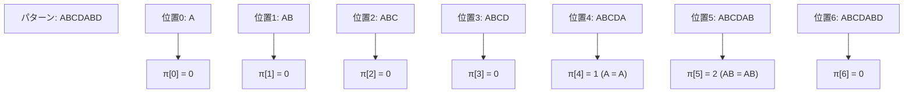
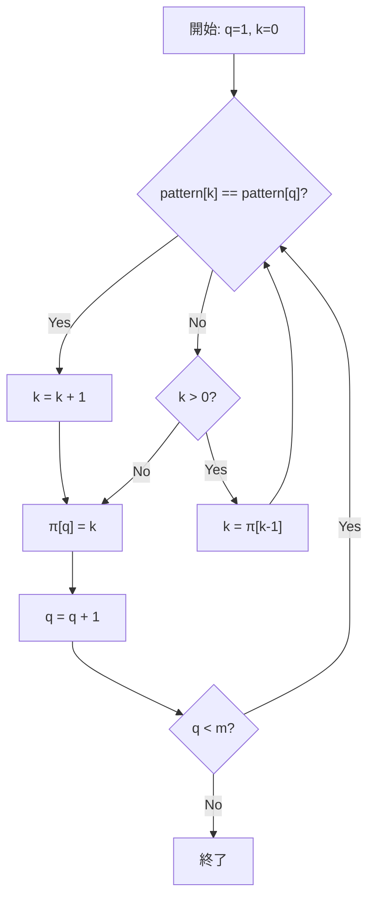
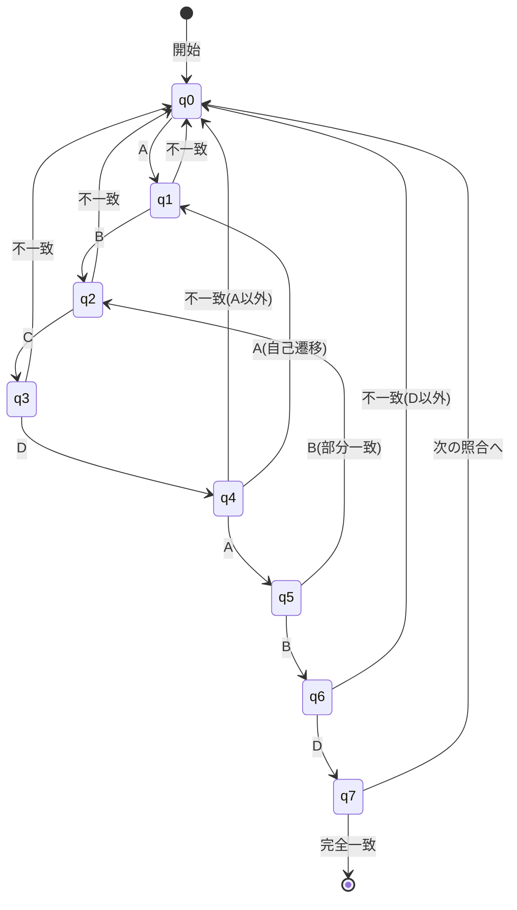
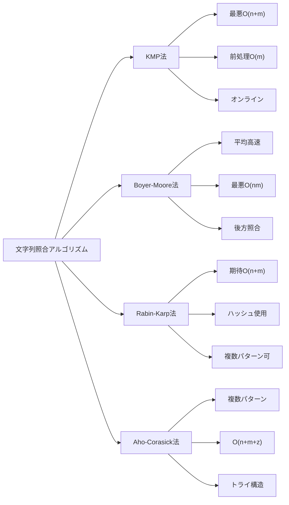

# KMP法（Knuth-Morris-Pratt法）

文字列照合は計算機科学における基礎的な問題の一つであり、テキストエディタの検索機能からDNA配列解析、侵入検知システムまで、幅広い応用を持つ。与えられたテキスト文字列の中から特定のパターン文字列を見つけ出すという一見単純な問題は、効率的に解くためには巧妙なアルゴリズムを必要とする。KMP法は、Donald Knuth、Vaughan Pratt、James H. Morrisによって1977年に独立に発見された文字列照合アルゴリズムである[^1]。このアルゴリズムは、パターンの自己相似性を利用することで、最悪計算時間O(n+m)（nはテキスト長、mはパターン長）で文字列照合を実現する。

## 単純な文字列照合とその限界

文字列照合問題を形式的に定義すると、長さnのテキストT[0..n-1]と長さmのパターンP[0..m-1]が与えられたとき、T[i..i+m-1] = P[0..m-1]となるすべての位置iを見つけることである。最も直感的なアプローチは、テキストの各位置からパターンとの照合を試みる単純法（ナイーブ法）である。

```python
def naive_search(text, pattern):
    n = len(text)
    m = len(pattern)
    for i in range(n - m + 1):
        j = 0
        while j < m and text[i + j] == pattern[j]:
            j += 1
        if j == m:
            # Match found at position i
            yield i
```

この単純なアルゴリズムは実装が容易で、多くの実用的な場面では十分な性能を示す。しかし、最悪の場合にはO(nm)の時間計算量となる。例えば、テキストが"aaa...aab"（a がn-1個続いた後にb）で、パターンが"aaa...aab"（aがm-1個続いた後にb）の場合、各位置でほぼm回の比較が必要となる。

単純法の本質的な非効率性は、不一致が発生したときに得られた情報を捨ててしまうことにある。例えば、パターン"ABCDABD"をテキスト"ABCDABCDABDE"で探す場合を考える。位置0から照合を開始し、7文字目で不一致となる。単純法では次に位置1から照合を再開するが、既に照合済みの部分"BCDABD"について、その先頭"B"がパターンの先頭"A"と一致しないことは自明である。実際、次に照合を試みる価値があるのは位置4からである。なぜなら、既に照合済みの部分文字列"ABCDAB"の接尾辞"AB"がパターンの接頭辞と一致するからである。

## KMP法の中核概念：部分一致表

KMP法の革新的なアイデアは、パターン自身の構造を事前に解析し、不一致が発生したときにどこまで戻るべきかを決定する情報を保持することである。この情報は「部分一致表」（failure function、またはprefix functionとも呼ばれる）として実現される。

部分一致表π[j]は、パターンP[0..j]の真の接頭辞と真の接尾辞が一致する最大の長さを表す。ここで「真の」とは、文字列全体を除くという意味である。形式的には：

π[j] = max{k : k < j + 1 かつ P[0..k-1] = P[j-k+1..j]}

ただし、そのようなkが存在しない場合はπ[j] = 0とする。



この部分一致表の意味を理解することが、KMP法を理解する鍵となる。π[j]は、パターンの位置j+1で不一致が発生したとき、パターンをどの位置まで「スライド」できるかを示している。より正確には、パターンの位置j+1で不一致が発生した場合、次はパターンの位置π[j]から照合を再開できる。

## 部分一致表の構築アルゴリズム

部分一致表の構築は、それ自体がKMP法の文字列照合と類似した構造を持つ。パターンを自分自身と照合していくと考えることができる。以下のアルゴリズムは、動的計画法の考え方を用いて効率的に部分一致表を構築する。

```python
def compute_prefix_function(pattern):
    m = len(pattern)
    pi = [0] * m
    k = 0  # Length of the current matching prefix
    
    for q in range(1, m):
        # Invariant: k = pi[q-1]
        while k > 0 and pattern[k] != pattern[q]:
            k = pi[k - 1]
        
        if pattern[k] == pattern[q]:
            k += 1
        
        pi[q] = k
    
    return pi
```

このアルゴリズムの正しさを理解するために、ループ不変条件を考える。各反復の開始時点で、k = π[q-1]が成立している。位置qでの文字がpattern[k]と一致する場合、π[q] = k + 1となる。一致しない場合は、より短い接頭辞での一致を探す必要がある。ここで重要なのは、次に試すべき接頭辞の長さがπ[k-1]であることだ。これは、P[0..k-1]の最長の真の接頭辞であり同時に真の接尾辞でもある部分文字列の長さを表す。



部分一致表構築の時間計算量を解析すると、外側のループはm-1回実行される。内側のwhileループでkが減少する回数の総和は、kが増加する回数の総和を超えることはない。kは各反復で最大1増加し、全体で最大m-1増加する。したがって、アルゴリズム全体の時間計算量はO(m)である。

## KMP法による文字列照合

部分一致表を用いた文字列照合アルゴリズムは、単純法と似た構造を持つが、不一致時の処理が異なる。不一致が発生したとき、部分一致表を参照して次に照合すべき位置を決定する。

```python
def kmp_search(text, pattern):
    n = len(text)
    m = len(pattern)
    pi = compute_prefix_function(pattern)
    
    q = 0  # Number of characters matched
    for i in range(n):
        while q > 0 and pattern[q] != text[i]:
            q = pi[q - 1]
        
        if pattern[q] == text[i]:
            q += 1
        
        if q == m:
            # Match found at position i - m + 1
            yield i - m + 1
            q = pi[q - 1]
```

このアルゴリズムの動作を追跡すると、変数qはパターンの何文字目まで一致しているかを表す状態変数として機能している。テキストの各文字に対して、現在の状態qからの遷移を試みる。文字が一致すればqを1増やし、一致しなければ部分一致表を参照して適切な状態に遷移する。



KMP法の本質は、有限オートマトンによる文字列認識と見ることもできる。各状態は、パターンの何文字目まで一致しているかを表し、入力文字に応じて状態遷移を行う。部分一致表は、不一致時の遷移先を効率的に計算するための情報を提供する。

## 計算量の厳密な解析

KMP法の時間計算量がO(n+m)であることを厳密に証明する。まず、部分一致表の構築にO(m)時間かかることは既に示した。文字列照合部分について、ポテンシャル関数Φ = 2i - qを定義する。ここで、iはテキストの現在位置、qは一致している文字数である。

各反復でのポテンシャルの変化を考える：
- pattern[q] = text[i]の場合：iとqが共に1増加するため、ΔΦ = 2 - 1 = 1
- pattern[q] ≠ text[i]かつq > 0の場合：iは変化せず、qは減少するため、ΔΦ > 0
- pattern[q] ≠ text[i]かつq = 0の場合：iが1増加し、qは0のままなので、ΔΦ = 2

初期状態でΦ = 0、終了時にΦ ≤ 2nである。各反復でΦは少なくとも1増加し、whileループの各実行でもΦは増加する。したがって、whileループの総実行回数は高々2nである。これにより、文字列照合部分の時間計算量はO(n)となる。

空間計算量については、部分一致表の格納にO(m)の空間が必要である。それ以外の変数は定数個なので、全体の空間計算量はO(m)である。

## 実装上の考慮事項

実用的なKMP法の実装では、いくつかの最適化や拡張を考慮する必要がある。

境界条件の処理は特に重要である。空のパターンや空のテキストに対する動作を明確に定義する必要がある。多くの実装では、空のパターンはすべての位置で一致すると定義する。

```python
def kmp_search_robust(text, pattern):
    if not pattern:
        return list(range(len(text) + 1))
    
    n = len(text)
    m = len(pattern)
    pi = compute_prefix_function(pattern)
    
    matches = []
    q = 0
    for i in range(n):
        while q > 0 and pattern[q] != text[i]:
            q = pi[q - 1]
        
        if pattern[q] == text[i]:
            q += 1
        
        if q == m:
            matches.append(i - m + 1)
            q = pi[q - 1]
    
    return matches
```

メモリ効率を重視する場合、部分一致表を事前に完全に構築するのではなく、必要に応じて計算する遅延評価の実装も可能である。ただし、これは時間とメモリのトレードオフとなる。

マルチバイト文字への対応も実装上の重要な課題である。UTF-8などの可変長エンコーディングを使用する場合、文字境界を正しく認識する必要がある。多くの高水準言語では、文字列を適切に抽象化することでこの問題を回避できる。

## 他のアルゴリズムとの比較

文字列照合アルゴリズムには、KMP法以外にも多くの手法が存在する。それぞれに長所と短所があり、用途に応じて使い分ける必要がある。

Boyer-Moore法[^2]は、パターンを右から左に照合し、不一致時により大きくスキップできる可能性がある。実用上はKMP法より高速なことが多いが、最悪計算時間はO(nm)である。ただし、良い文字規則（good suffix rule）と悪い文字規則（bad character rule）を組み合わせることで、多くの実用的なケースで優れた性能を示す。

Rabin-Karp法[^3]は、ローリングハッシュを用いて文字列照合を行う。期待計算時間はO(n+m)だが、ハッシュ衝突により最悪計算時間はO(nm)となる。複数パターンの同時検索に拡張しやすいという利点がある。



Aho-Corasick法[^4]は、KMP法を複数パターンの同時検索に拡張したものと見ることができる。トライ構造と失敗関数を組み合わせることで、k個のパターンを合計長さmとして、O(n+m+z)時間で検索できる（zは出現回数）。

実用的な観点から見ると、短いパターンに対しては単純法でも十分な性能を示すことが多い。現代のプロセッサはメモリアクセスパターンが単純なアルゴリズムに対して高い性能を発揮するため、理論的に優れたアルゴリズムが常に実用上も最速とは限らない。

## 応用と発展

KMP法の基本的なアイデアは、文字列照合以外の問題にも応用できる。周期性の検出は典型的な応用例である。文字列の最小周期は、部分一致表から容易に計算できる。長さnの文字列Sに対して、n - π[n-1]がSの最小周期の候補となる。

```python
def find_period(s):
    n = len(s)
    pi = compute_prefix_function(s)
    period = n - pi[n - 1]
    if n % period == 0:
        return period
    else:
        return n  # No period
```

文字列のボーダー（border）の概念もKMP法と密接に関連している。文字列のボーダーとは、その文字列の接頭辞であり同時に接尾辞でもある部分文字列のことである。部分一致表は、各位置での最長ボーダーの長さを記録している。

Z-algorithm[^5]は、KMP法とは異なるアプローチで類似の問題を解く。各位置iについて、S[i..]とS[0..]の最長共通接頭辞の長さZ[i]を計算する。このアルゴリズムもO(n)時間で動作し、文字列照合や周期検出に応用できる。

実時間制約のあるシステムでは、KMP法の最悪計算時間が保証されていることが重要となる。侵入検知システムやネットワークパケット検査では、処理時間の予測可能性が求められる。KMP法は、入力データの特性に関わらず一定の性能を保証する。

並列化の観点では、KMP法は本質的に逐次的なアルゴリズムである。しかし、テキストを複数の部分に分割し、各部分で独立に検索を行うことで、ある程度の並列化は可能である。ただし、分割境界での処理には注意が必要である。

拡張正規表現への対応も興味深い研究課題である。KMP法の状態遷移の考え方は、決定性有限オートマトンの構築と実行に一般化できる。これにより、より複雑なパターンマッチングにも対応できる。

KMP法は、その理論的な美しさと実用性から、計算機科学の教育においても重要な位置を占めている。アルゴリズムの正しさの証明、計算量解析、実装技法など、多くの重要な概念を学ぶことができる。また、動的計画法、オートマトン理論、文字列処理など、複数の分野の知識が統合された例として価値がある。

## 詳細な実装技法

実際のシステムでKMP法を実装する際には、性能と正確性の両方を考慮した様々な技法が必要となる。以下では、実用的な実装における重要な考慮事項を詳しく見ていく。

### 強化版部分一致表

標準的な部分一致表に加えて、より効率的な照合を可能にする「強化版部分一致表」（strong prefix function）を構築することができる。この表では、パターンの位置jで不一致が発生し、かつpattern[π[j]] = pattern[j]の場合、さらに短い接頭辞まで遡ることを事前に計算しておく。

```python
def compute_strong_prefix_function(pattern):
    m = len(pattern)
    pi = compute_prefix_function(pattern)
    pi_star = [0] * m
    
    for j in range(m):
        if pi[j] == 0:
            pi_star[j] = 0
        elif pattern[pi[j] - 1] == pattern[j]:
            pi_star[j] = pi_star[pi[j] - 1]
        else:
            pi_star[j] = pi[j]
    
    return pi_star
```

この強化版を使用することで、無駄な比較をさらに削減できる。特に、パターンに繰り返し構造が多い場合に効果的である。

### ストリーミング処理への対応

KMP法は本質的にオンラインアルゴリズムであるため、ストリーミングデータの処理に適している。データが逐次的に到着する場合でも、内部状態を保持することで効率的に処理できる。

```python
class KMPStreamMatcher:
    def __init__(self, pattern):
        self.pattern = pattern
        self.m = len(pattern)
        self.pi = compute_prefix_function(pattern)
        self.q = 0
        self.position = 0
    
    def process_char(self, char):
        while self.q > 0 and self.pattern[self.q] != char:
            self.q = self.pi[self.q - 1]
        
        if self.pattern[self.q] == char:
            self.q += 1
        
        self.position += 1
        
        if self.q == self.m:
            match_pos = self.position - self.m
            self.q = self.pi[self.q - 1]
            return match_pos
        
        return None
```

この実装により、ネットワークパケットの監視やログファイルのリアルタイム解析などの用途に対応できる。

### メモリアクセスパターンの最適化

現代のプロセッサアーキテクチャでは、キャッシュ効率が性能に大きく影響する。KMP法の実装では、部分一致表へのランダムアクセスが発生するため、キャッシュミスが性能低下の原因となることがある。

```python
def kmp_search_cache_friendly(text, pattern):
    n = len(text)
    m = len(pattern)
    
    # Ensure pattern and pi table fit in L1 cache
    if m > 8192:  # Typical L1 cache size threshold
        # Fall back to standard implementation or use blocking
        return kmp_search(text, pattern)
    
    pi = compute_prefix_function(pattern)
    
    # Process text in blocks to improve cache locality
    block_size = 65536  # L2 cache size
    matches = []
    q = 0
    
    for block_start in range(0, n, block_size):
        block_end = min(block_start + block_size, n)
        
        for i in range(block_start, block_end):
            while q > 0 and pattern[q] != text[i]:
                q = pi[q - 1]
            
            if pattern[q] == text[i]:
                q += 1
            
            if q == m:
                matches.append(i - m + 1)
                q = pi[q - 1]
    
    return matches
```

## 競技プログラミングでの応用

競技プログラミングにおいて、KMP法は文字列問題の強力な武器となる。以下にいくつかの典型的な応用例を示す。

### 複数パターンの効率的な検索

複数のパターンを同時に検索する必要がある場合、各パターンに対して個別にKMP法を適用するのではなく、パターンを連結して処理することで効率化できる。

```python
def multi_pattern_search(text, patterns):
    # Create a combined pattern with separators
    separator = '#'  # Character not in text or patterns
    combined = separator.join(patterns)
    combined_pi = compute_prefix_function(combined)
    
    results = {pattern: [] for pattern in patterns}
    pattern_starts = []
    pos = 0
    
    for pattern in patterns:
        pattern_starts.append(pos)
        pos += len(pattern) + 1
    
    # Search using modified KMP
    n = len(text)
    q = 0
    
    for i in range(n):
        while q > 0 and (q >= len(combined) or combined[q] != text[i]):
            q = combined_pi[q - 1]
        
        if q < len(combined) and combined[q] == text[i]:
            q += 1
            
            # Check if we matched any pattern
            for j, start in enumerate(pattern_starts):
                pattern_len = len(patterns[j])
                if q == start + pattern_len:
                    results[patterns[j]].append(i - pattern_len + 1)
    
    return results
```

### 文字列の周期構造解析

競技プログラミングでは、文字列の周期的性質を利用する問題が頻出する。KMP法の部分一致表は、これらの問題を解く鍵となる。

```python
def analyze_string_structure(s):
    n = len(s)
    pi = compute_prefix_function(s)
    
    # Find all borders
    borders = []
    k = pi[n - 1]
    while k > 0:
        borders.append(k)
        k = pi[k - 1]
    
    # Find primitive period
    min_period = n - pi[n - 1]
    is_periodic = (n % min_period == 0)
    
    # Find all periods
    periods = []
    for i in range(1, n + 1):
        if n % i == 0:
            # Check if i is a period
            is_period = True
            for j in range(i, n):
                if s[j] != s[j % i]:
                    is_period = False
                    break
            if is_period:
                periods.append(i)
    
    return {
        'borders': borders,
        'min_period': min_period,
        'is_periodic': is_periodic,
        'all_periods': periods
    }
```

### 最長回文接頭辞の検出

文字列処理問題では、回文に関する問題も多い。KMP法を応用することで、効率的に回文を検出できる。

```python
def longest_palindrome_prefix(s):
    n = len(s)
    # Create string s + '#' + reverse(s)
    combined = s + '#' + s[::-1]
    pi = compute_prefix_function(combined)
    
    # The longest palindrome prefix has length pi[2n]
    # But we need to ensure it doesn't exceed n
    return min(pi[2 * n], n)
```

## 実世界での性能特性

理論的な計算量と実際の性能は必ずしも一致しない。以下に、様々な条件下でのKMP法の実測性能について詳しく見ていく。

### 英文テキストでの性能

自然言語テキストでは、文字の出現頻度に偏りがあるため、単純法でも早期に不一致を検出できることが多い。実測では、パターン長が10文字程度までは単純法がKMP法を上回ることがある。

```python
def benchmark_english_text():
    import time
    import random
    import string
    
    # Generate realistic English-like text
    words = ['the', 'quick', 'brown', 'fox', 'jumps', 'over', 'lazy', 'dog']
    text = ' '.join(random.choice(words) for _ in range(1000000))
    
    patterns = ['quick brown fox', 'lazy dog', 'the quick']
    
    for pattern in patterns:
        # KMP method
        start = time.time()
        kmp_matches = list(kmp_search(text, pattern))
        kmp_time = time.time() - start
        
        # Naive method
        start = time.time()
        naive_matches = list(naive_search(text, pattern))
        naive_time = time.time() - start
        
        print(f"Pattern: {pattern}")
        print(f"KMP: {kmp_time:.4f}s, Naive: {naive_time:.4f}s")
        print(f"Speedup: {naive_time/kmp_time:.2f}x")
```

### DNAシーケンスでの性能

DNA配列は4文字（A, T, G, C）のアルファベットで構成されるため、単純法では不一致の検出が遅くなる。このような場合、KMP法の優位性が顕著に現れる。

```python
def benchmark_dna_sequence():
    import random
    
    # Generate DNA sequence
    dna_chars = ['A', 'T', 'G', 'C']
    text = ''.join(random.choice(dna_chars) for _ in range(10000000))
    
    # Patterns with different characteristics
    patterns = [
        'ATGATGATG',  # Repetitive pattern
        'ACGTACGTACGT',  # Longer repetitive pattern
        'ATCGATCGATCG'  # Another pattern
    ]
    
    for pattern in patterns:
        # Count matches and measure time
        matches = list(kmp_search(text, pattern))
        print(f"Pattern {pattern}: {len(matches)} matches found")
```

### 悪意のある入力への耐性

セキュリティが重要なシステムでは、DoS攻撃を防ぐために最悪計算時間が保証されるアルゴリズムが必要となる。KMP法は、入力に関わらずO(n+m)の計算時間を保証する。

```python
def test_worst_case_resistance():
    # Pathological case for naive algorithm
    n = 100000
    m = 1000
    
    # Create worst-case input: "aaa...aab" pattern in "aaa...aaa" text
    text = 'a' * n
    pattern = 'a' * (m - 1) + 'b'
    
    import time
    
    # KMP maintains O(n+m) even in worst case
    start = time.time()
    kmp_matches = list(kmp_search(text, pattern))
    kmp_time = time.time() - start
    
    print(f"KMP worst-case time: {kmp_time:.4f}s")
    print(f"Operations: ~{n + m}")
```

## より高度な文字列アルゴリズムへの橋渡し

KMP法の理解は、より高度な文字列処理アルゴリズムを学ぶための基礎となる。

### Suffix ArrayとLCP配列

KMP法の部分一致表の概念は、より強力なデータ構造であるSuffix ArrayやLCP（Longest Common Prefix）配列の理解につながる。これらのデータ構造は、複数の文字列処理問題を効率的に解くことができる。

```python
def build_suffix_array(s):
    n = len(s)
    # Simple O(n log n) implementation
    suffixes = [(s[i:], i) for i in range(n)]
    suffixes.sort()
    return [i for _, i in suffixes]

def build_lcp_array(s, sa):
    n = len(s)
    rank = [0] * n
    for i in range(n):
        rank[sa[i]] = i
    
    lcp = [0] * (n - 1)
    h = 0
    
    for i in range(n):
        if rank[i] > 0:
            j = sa[rank[i] - 1]
            while i + h < n and j + h < n and s[i + h] == s[j + h]:
                h += 1
            lcp[rank[i] - 1] = h
            if h > 0:
                h -= 1
    
    return lcp
```

### 一般化接尾辞木への発展

KMP法の失敗関数の考え方は、接尾辞木（Suffix Tree）の構築アルゴリズムにも応用されている。Ukkonen's algorithmは、KMP法と同様に線形時間で接尾辞木を構築する。

これらの高度なデータ構造により、文字列の任意の部分文字列の検索、最長共通部分文字列の発見、文字列の圧縮など、より複雑な問題を効率的に解くことができる。

[^1]: Knuth, Donald; Morris, James H.; Pratt, Vaughan (1977). "Fast pattern matching in strings". SIAM Journal on Computing. 6 (2): 323–350.

[^2]: Boyer, Robert S.; Moore, J Strother (1977). "A fast string searching algorithm". Communications of the ACM. 20 (10): 762–772.

[^3]: Karp, Richard M.; Rabin, Michael O. (1987). "Efficient randomized pattern-matching algorithms". IBM Journal of Research and Development. 31 (2): 249–260.

[^4]: Aho, Alfred V.; Corasick, Margaret J. (1975). "Efficient string matching: an aid to bibliographic search". Communications of the ACM. 18 (6): 333–340.

[^5]: Gusfield, Dan (1997). Algorithms on Strings, Trees and Sequences. Cambridge University Press.