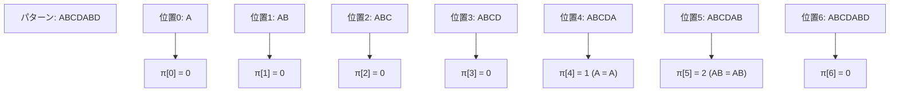
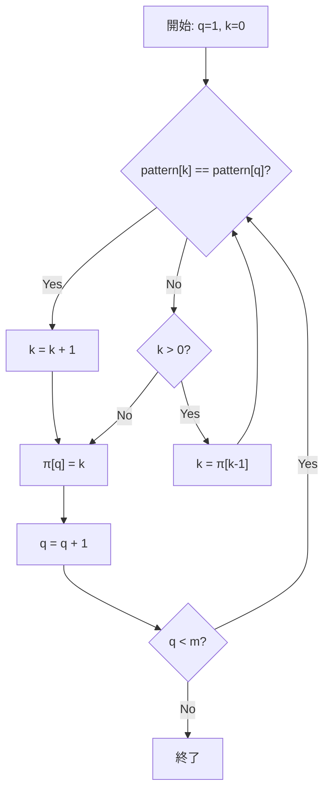
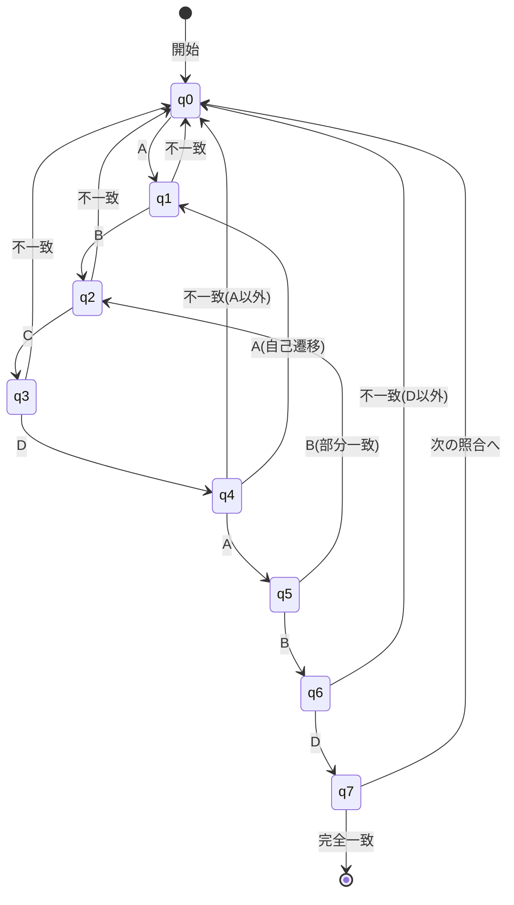
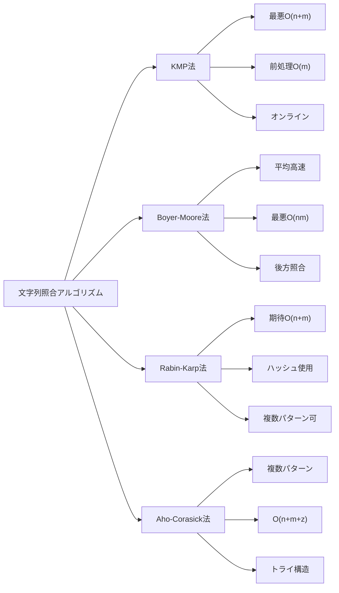

# KMP法（Knuth-Morris-Pratt法）

文字列照合は計算機科学における基礎的な問題の一つであり、テキストエディタの検索機能からDNA配列解析、侵入検知システムまで、幅広い応用を持つ。与えられたテキスト文字列の中から特定のパターン文字列を見つけ出すという一見単純な問題は、効率的に解くためには巧妙なアルゴリズムを必要とする。KMP法は、Donald Knuth、Vaughan Pratt、James H. Morrisによって1977年に独立に発見された文字列照合アルゴリズムである[^1]。このアルゴリズムは、パターンの自己相似性を利用することで、最悪計算時間O(n+m)（nはテキスト長、mはパターン長）で文字列照合を実現する。

## 単純な文字列照合とその限界

文字列照合問題を形式的に定義すると、長さnのテキストT[0..n-1]と長さmのパターンP[0..m-1]が与えられたとき、T[i..i+m-1] = P[0..m-1]となるすべての位置iを見つけることである。最も直感的なアプローチは、テキストの各位置からパターンとの照合を試みる単純法（ナイーブ法）である。

```python
def naive_search(text, pattern):
    n = len(text)
    m = len(pattern)
    for i in range(n - m + 1):
        j = 0
        while j < m and text[i + j] == pattern[j]:
            j += 1
        if j == m:
            # Match found at position i
            yield i
```

この単純なアルゴリズムは実装が容易で、多くの実用的な場面では十分な性能を示す。しかし、最悪の場合にはO(nm)の時間計算量となる。例えば、テキストが"aaa...aab"（a がn-1個続いた後にb）で、パターンが"aaa...aab"（aがm-1個続いた後にb）の場合、各位置でほぼm回の比較が必要となる。

単純法の本質的な非効率性は、不一致が発生したときに得られた情報を捨ててしまうことにある。例えば、パターン"ABCDABD"をテキスト"ABCDABCDABDE"で探す場合を考える。位置0から照合を開始し、7文字目で不一致となる。単純法では次に位置1から照合を再開するが、既に照合済みの部分"BCDABD"について、その先頭"B"がパターンの先頭"A"と一致しないことは自明である。実際、次に照合を試みる価値があるのは位置4からである。なぜなら、既に照合済みの部分文字列"ABCDAB"の接尾辞"AB"がパターンの接頭辞と一致するからである。

## KMP法の中核概念：部分一致表

KMP法の革新的なアイデアは、パターン自身の構造を事前に解析し、不一致が発生したときにどこまで戻るべきかを決定する情報を保持することである。この情報は「部分一致表」（failure function、またはprefix functionとも呼ばれる）として実現される。

部分一致表π[j]は、パターンP[0..j]の真の接頭辞と真の接尾辞が一致する最大の長さを表す。ここで「真の」とは、文字列全体を除くという意味である。形式的には：

π[j] = max{k : k < j + 1 かつ P[0..k-1] = P[j-k+1..j]}

ただし、そのようなkが存在しない場合はπ[j] = 0とする。



この部分一致表の意味を理解することが、KMP法を理解する鍵となる。π[j]は、パターンの位置j+1で不一致が発生したとき、パターンをどの位置まで「スライド」できるかを示している。より正確には、パターンの位置j+1で不一致が発生した場合、次はパターンの位置π[j]から照合を再開できる。

## 部分一致表の構築アルゴリズム

部分一致表の構築は、それ自体がKMP法の文字列照合と類似した構造を持つ。パターンを自分自身と照合していくと考えることができる。以下のアルゴリズムは、動的計画法の考え方を用いて効率的に部分一致表を構築する。

```python
def compute_prefix_function(pattern):
    m = len(pattern)
    pi = [0] * m
    k = 0  # Length of the current matching prefix
    
    for q in range(1, m):
        # Invariant: k = pi[q-1]
        while k > 0 and pattern[k] != pattern[q]:
            k = pi[k - 1]
        
        if pattern[k] == pattern[q]:
            k += 1
        
        pi[q] = k
    
    return pi
```

このアルゴリズムの正しさを理解するために、ループ不変条件を考える。各反復の開始時点で、k = π[q-1]が成立している。位置qでの文字がpattern[k]と一致する場合、π[q] = k + 1となる。一致しない場合は、より短い接頭辞での一致を探す必要がある。ここで重要なのは、次に試すべき接頭辞の長さがπ[k-1]であることだ。これは、P[0..k-1]の最長の真の接頭辞であり同時に真の接尾辞でもある部分文字列の長さを表す。



部分一致表構築の時間計算量を解析すると、外側のループはm-1回実行される。内側のwhileループでkが減少する回数の総和は、kが増加する回数の総和を超えることはない。kは各反復で最大1増加し、全体で最大m-1増加する。したがって、アルゴリズム全体の時間計算量はO(m)である。

## KMP法による文字列照合

部分一致表を用いた文字列照合アルゴリズムは、単純法と似た構造を持つが、不一致時の処理が異なる。不一致が発生したとき、部分一致表を参照して次に照合すべき位置を決定する。

```python
def kmp_search(text, pattern):
    n = len(text)
    m = len(pattern)
    pi = compute_prefix_function(pattern)
    
    q = 0  # Number of characters matched
    for i in range(n):
        while q > 0 and pattern[q] != text[i]:
            q = pi[q - 1]
        
        if pattern[q] == text[i]:
            q += 1
        
        if q == m:
            # Match found at position i - m + 1
            yield i - m + 1
            q = pi[q - 1]
```

このアルゴリズムの動作を追跡すると、変数qはパターンの何文字目まで一致しているかを表す状態変数として機能している。テキストの各文字に対して、現在の状態qからの遷移を試みる。文字が一致すればqを1増やし、一致しなければ部分一致表を参照して適切な状態に遷移する。



KMP法の本質は、有限オートマトンによる文字列認識と見ることもできる。各状態は、パターンの何文字目まで一致しているかを表し、入力文字に応じて状態遷移を行う。部分一致表は、不一致時の遷移先を効率的に計算するための情報を提供する。

## 計算量の厳密な解析

KMP法の時間計算量がO(n+m)であることを厳密に証明する。まず、部分一致表の構築にO(m)時間かかることは既に示した。文字列照合部分について、ポテンシャル関数Φ = 2i - qを定義する。ここで、iはテキストの現在位置、qは一致している文字数である。

各反復でのポテンシャルの変化を考える：
- pattern[q] = text[i]の場合：iとqが共に1増加するため、ΔΦ = 2 - 1 = 1
- pattern[q] ≠ text[i]かつq > 0の場合：iは変化せず、qは減少するため、ΔΦ > 0
- pattern[q] ≠ text[i]かつq = 0の場合：iが1増加し、qは0のままなので、ΔΦ = 2

初期状態でΦ = 0、終了時にΦ ≤ 2nである。各反復でΦは少なくとも1増加し、whileループの各実行でもΦは増加する。したがって、whileループの総実行回数は高々2nである。これにより、文字列照合部分の時間計算量はO(n)となる。

空間計算量については、部分一致表の格納にO(m)の空間が必要である。それ以外の変数は定数個なので、全体の空間計算量はO(m)である。

## 実装上の考慮事項

実用的なKMP法の実装では、いくつかの最適化や拡張を考慮する必要がある。

境界条件の処理は特に重要である。空のパターンや空のテキストに対する動作を明確に定義する必要がある。多くの実装では、空のパターンはすべての位置で一致すると定義する。

```python
def kmp_search_robust(text, pattern):
    if not pattern:
        return list(range(len(text) + 1))
    
    n = len(text)
    m = len(pattern)
    pi = compute_prefix_function(pattern)
    
    matches = []
    q = 0
    for i in range(n):
        while q > 0 and pattern[q] != text[i]:
            q = pi[q - 1]
        
        if pattern[q] == text[i]:
            q += 1
        
        if q == m:
            matches.append(i - m + 1)
            q = pi[q - 1]
    
    return matches
```

メモリ効率を重視する場合、部分一致表を事前に完全に構築するのではなく、必要に応じて計算する遅延評価の実装も可能である。ただし、これは時間とメモリのトレードオフとなる。

マルチバイト文字への対応も実装上の重要な課題である。UTF-8などの可変長エンコーディングを使用する場合、文字境界を正しく認識する必要がある。多くの高水準言語では、文字列を適切に抽象化することでこの問題を回避できる。

## 他のアルゴリズムとの比較

文字列照合アルゴリズムには、KMP法以外にも多くの手法が存在する。それぞれに長所と短所があり、用途に応じて使い分ける必要がある。

Boyer-Moore法[^2]は、パターンを右から左に照合し、不一致時により大きくスキップできる可能性がある。実用上はKMP法より高速なことが多いが、最悪計算時間はO(nm)である。ただし、良い文字規則（good suffix rule）と悪い文字規則（bad character rule）を組み合わせることで、多くの実用的なケースで優れた性能を示す。

Rabin-Karp法[^3]は、ローリングハッシュを用いて文字列照合を行う。期待計算時間はO(n+m)だが、ハッシュ衝突により最悪計算時間はO(nm)となる。複数パターンの同時検索に拡張しやすいという利点がある。



Aho-Corasick法[^4]は、KMP法を複数パターンの同時検索に拡張したものと見ることができる。トライ構造と失敗関数を組み合わせることで、k個のパターンを合計長さmとして、O(n+m+z)時間で検索できる（zは出現回数）。

実用的な観点から見ると、短いパターンに対しては単純法でも十分な性能を示すことが多い。現代のプロセッサはメモリアクセスパターンが単純なアルゴリズムに対して高い性能を発揮するため、理論的に優れたアルゴリズムが常に実用上も最速とは限らない。

## 応用と発展

KMP法の基本的なアイデアは、文字列照合以外の問題にも応用できる。周期性の検出は典型的な応用例である。文字列の最小周期は、部分一致表から容易に計算できる。長さnの文字列Sに対して、n - π[n-1]がSの最小周期の候補となる。

```python
def find_period(s):
    n = len(s)
    pi = compute_prefix_function(s)
    period = n - pi[n - 1]
    if n % period == 0:
        return period
    else:
        return n  # No period
```

文字列のボーダー（border）の概念もKMP法と密接に関連している。文字列のボーダーとは、その文字列の接頭辞であり同時に接尾辞でもある部分文字列のことである。部分一致表は、各位置での最長ボーダーの長さを記録している。

Z-algorithm[^5]は、KMP法とは異なるアプローチで類似の問題を解く。各位置iについて、S[i..]とS[0..]の最長共通接頭辞の長さZ[i]を計算する。このアルゴリズムもO(n)時間で動作し、文字列照合や周期検出に応用できる。

実時間制約のあるシステムでは、KMP法の最悪計算時間が保証されていることが重要となる。侵入検知システムやネットワークパケット検査では、処理時間の予測可能性が求められる。KMP法は、入力データの特性に関わらず一定の性能を保証する。

並列化の観点では、KMP法は本質的に逐次的なアルゴリズムである。しかし、テキストを複数の部分に分割し、各部分で独立に検索を行うことで、ある程度の並列化は可能である。ただし、分割境界での処理には注意が必要である。

拡張正規表現への対応も興味深い研究課題である。KMP法の状態遷移の考え方は、決定性有限オートマトンの構築と実行に一般化できる。これにより、より複雑なパターンマッチングにも対応できる。

KMP法は、その理論的な美しさと実用性から、計算機科学の教育においても重要な位置を占めている。アルゴリズムの正しさの証明、計算量解析、実装技法など、多くの重要な概念を学ぶことができる。また、動的計画法、オートマトン理論、文字列処理など、複数の分野の知識が統合された例として価値がある。

[^1]: Knuth, Donald; Morris, James H.; Pratt, Vaughan (1977). "Fast pattern matching in strings". SIAM Journal on Computing. 6 (2): 323–350.

[^2]: Boyer, Robert S.; Moore, J Strother (1977). "A fast string searching algorithm". Communications of the ACM. 20 (10): 762–772.

[^3]: Karp, Richard M.; Rabin, Michael O. (1987). "Efficient randomized pattern-matching algorithms". IBM Journal of Research and Development. 31 (2): 249–260.

[^4]: Aho, Alfred V.; Corasick, Margaret J. (1975). "Efficient string matching: an aid to bibliographic search". Communications of the ACM. 18 (6): 333–340.

[^5]: Gusfield, Dan (1997). Algorithms on Strings, Trees and Sequences. Cambridge University Press.